# Inhaltsverzeichnis

- [Vorbereitung](#vorbereitung)
- [1. Import der benötigten Daten](#datenimport)
    - [1.1 Skript](#skript)
    - [1.2 Import des Skripts](#skriptimport)
    - [1.3 Datenmodellierung mittels Quick SQL](#datenmodellierung)
- [2. Create App Wizard](#create)
    - [Erstellen einer Anwendung](erstelleneineranwendung)
    - [Report](#report)
    - [Create Application](#createapplication)
    - [Run Page](#runpage)
- [3. Zugriff auf Views statt auf Tabellen vornehmen](#views)
    - [Tools](#tools)
    - [Page Processes](#pageprocesses)
- [4. Interactive Grid](#interactivegrid)
    - [Erstellung der View](#gridview)
    - [Create Page](#gridcreatepage)
- [5. Master-Detail-Detail](#master-detail-detail)
    - [Erstellung der Views](#erstellung-der-views)
    - [Erstellung einer Master-Detail-Detail Seite](#erstellung-einer-master-detail-detail-seite)
    - [Popup List of Values](#popup-list-of-values)
- [6. Charts](#charts)
    - [Erstellung der View](#charts-erstellung-der-view)
    - [Charts Region](#charts-region)
- [7. Features für mobile Endgeräte](#features-fuer-mobile-endgeraete)
    - [Reflow Report & Column Toggle Report](#reflow-report--column-toggle-report)
        - [View erstellen](#mobile-view-erstellen)
        - [Report erstellen](#mobile-report-erstellen)
    - [Progressive Web Apps](#progressive-web-apps)
    - [Persistent Authentication](#persistent-authentication)
- [8. Cards Region](#cards-region)
    - [View erstellen](#cards-view-erstellen)
    - [Seite erstellen](#cards-seite-erstellen)
    - [Cards mit Bild erstellen](#cards-mit-bild-erstellen)
- [9. Faceted Search](#faceted-search)
    - [Erstellung der View](#fs-erstellung-der-view)
    - [Create Page](#fs-create-page)
    - [Create Facets](#fs-create-facets)
- [10. Smart Filters](#smart-filters)
    - [Erstellung der View](#sf-erstellung-der-view)
    - [Create Page](#sf-create-page)
    - [Create Filters](#sf-create-filters)
- [11. Optische Anpassungen](#optische-anpassungen)
    - [Dark-Mode](#dark-mode)
    - [Anpassung des Login-Screens](#anpassung-des-login-screens)
- [12. Plug-Ins](#plug-ins)
    - [Einleitung](#pi-einleitung)
    - [Plug-Ins](#pi-plug-ins)
        - [Plug-In importieren](#plug-in-importieren)
        - [Plugin einbinden](#plugin-einbinden)
        - [Quality Assurance Plugin](#quality-assurance-plugin)
- [13. REST Data Sources](#rest-data-sources)
    - [RESTful Service erstellen](#restful-service-erstellen)
    - [REST Data Source erstellen](#rest-data-source-erstellen)
    - [Senden von Daten an eine REST-Datenquelle](#senden-von-daten-an-eine-rest-datenquelle)
    - [Abrufen von Daten aus einer REST Data Source](#abrufen-von-daten-aus-einer-rest-data-source)
- [14. Exkurs: Datenmodellierung mittels Quick SQL](#exkurs-datenmodellierung-mittels-quick-sql)
    - [Erstellung der Datenbank-Tabelle](#ex-erstellung-der-datenbank-tabelle)
    - [Erstellung eines Interactive Reports](#ex-erstellung-eines-interactive-reports)
    - [Beispieldaten mittels Data Generator generieren](#beispieldaten-mittels-data-generator-generieren)
- [15. Karten erstellen](#karten-erstellen)
    - [REST Data Source](#karten-rest-data-source)
    - [Erstellen der Karte auf einer neuen Anwendungsseite](#erstellen-der-karte-auf-einer-neuen-anwendungsseite)
- [16. Genehmigungsprozess erstellen](#genehmigungsprozess-erstellen)
    - [Erstellen einer Anwendung](#task-erstellen-einer-anwendung)
    - [Erstellen einer Task Definition](#erstellen-einer-task-definition)
    - [Erstellen der „My Approvals“ und „My Request“ Seite](#erstellen-der-my-approvals-und-my-request-seite)
    - [Erstellen der „Salary Change“ Seite](#erstellen-der-salary-change-seite)
    - [User erstellen](#task-user-erstellen)
    - [Anwendung ausführen](#task-anwendung-ausfuehren)
- [17. Application Search: Suchregionen und Suchkonfigurationen erstellen](#application-search-suchregionen-und-suchkonfigurationen-erstellen)
    - [Erstellen eine Suchkonfiguration](#erstellen-eine-suchkonfiguration)
        - [Lokalen Daten Datenquelle](#lokalen-daten-datenquelle)
        - [REST-Datenquelle](#suche-rest-datenquelle)
    - [Suchkonfigurationen in der Anwendung verwenden](#suchkonfigurationen-in-der-anwendung-verwenden)
        - [Suchseite erstellen](#suchseite-erstellen)
    - [Suchfeld in die Navigationsleiste einbauen](#suchfeld-in-die-navigationsleiste-einbauen)
- [18. Invoke API Process Type](#invoke-api-process-type)
    - [Erstellung der benötigten Objekte](#api-erstellung-der-benoetigten-objekte)
        - [Erstellung der View](#api-erstellung-der-view)
        - [Erstellung der Prozedur](#api-erstellung-der-prozedur)
    - [Invoke API Process verwenden](#invoke-api-process-verwenden)
- [19. Template Components](#template-components)
    - [Erstellung eines "Template Components" APEX Plugin](#erstellung-eines-template-components-apex-plugin)
- [20. Working Copy](#working-copy)
    - [Arbeitskopie erstellen](#arbeitskopie-erstellen)
    - [Arbeitsaufgabe erledigen](#arbeitsaufgabe-erledigen)
    - [Vergleich zwischen Branch und Main](#vergleich-zwischen-branch-und-main)
    - [Änderung in Main](#aenderung-in-main)
- [21. APEX Workflow](#apex-workflow)
    - [Ausgangspunkt Use Case und Flow-Chart](#ausgangspunkt-use-case-und-flow-chart)
    - [Einrichtung der benötigten Elemente](#workflow-einrichtung-der-benoetigten-elemente)
    - [Erstellen des Workflows](#erstellen-des-workflows)
    - [Task zur Reservierungsanfrage erstellen](#task-zur-reservierungsanfrage-erstellen)
    - [Fertigstellung des Workflows](#fertigstellung-des-workflows)
    - [Erstellen der App-Seiten](#workflow-erstellen-der-app-seiten)
    - [Anlegen einer Unified Task List](#workflow-anlegen-einer-unified-task-list)
    - [Anlegen der Workflow Console](#anlegen-der-workflow-console)
    - [Application Logo anpassen](#workflow-application-logo-anpassen)
    - [Tour durch die neue App](#workflow-tour-durch-die-neue-app)
- [22. AI-basierte Artikelgenerierung für Webshops](#AI-basierte-Artikelgenerierung)
    - [1. Eine View erstellen](#Eine-View-erstellen)
    - [2. Konfiguration des Kartenlayouts](#Konfiguration-des-Kartenlayouts)
    - [3. Region Erstellen](#Region-Erstellen) 
    - [4. Erstellung eines Textfelds und eines Buttons](#Erstellung-eines-Textfelds-und-eines-Buttons) 
    - [5. Erstellung eines Pakets für den AI-Webshop](#Erstellung-eines-Pakets-für-den-AI-Webshop) 
        - [5.1. Erstellung der Paketspezifikation (Package Specification)](#Erstellung-der-Paketspezifikation)
        - [5.2. Erstellung des Package Body](#Erstellung-des-Package-Body)
    - [6. Erstellung des Prozesses zum Hinzufügen eines Artikels](#Erstellung-des-Prozesses-zum-Hinzufügen-eines-Artikels) 
    - [7. Überprüfung des Parameters `p_new_article`](#Erstellung-des-Prozesses-zum-Hinzufügen-eines-Artikels) 
    - [8. Endgültige Seitenvorschau](#Endgültige-Seitenvorschau) 
    - [9. Bild-URL hinzufügen](#Bild-URL-hinzufügen) 

# Vorbereitung

Herzlich Willkommen bei dem Workshop „Hands-On APEX 23.2“ der MT - IT Solutions.
Bevor Sie mit der Bearbeitung dieses Tutorials beginnen können, müssen Sie einen Workspace auf den Servern von Oracle beantragen. Dies können Sie innerhalb weniger Minuten unter [apex.oracle.com](apex.oracle.com) erledigen.

Falls Sie die Möglichkeit nutzen möchten, englischsprachige Tutorials zu bearbeiten, gibt es unter dem folgenden Link die Möglichkeit, dies zu tun. Klicken Sie einfach auf [https://apex.oracle.com/en/learn/tutorials/](https://apex.oracle.com/en/learn/tutorials/) und bearbeiten Sie die von APEX bereitgestellten Tutorials, wenn Sie noch einen größeren Einblick in die Welt von APEX erhalten möchten.  

# <a name="datenimport"></a> 1. Import der benötigten Daten 

## <a name="skript"></a> 1.1 Skript

Ein Skript ist eine Liste von Befehlen zur Automatisierung von Prozessen. In diesem Fall erzeugt das Skript Tabellen und Sequenzen. Außerdem werden die Tabellen durch das Skript mit Daten befüllt.

Tabellen sind die Grundeinheit des Datenspeichers einer Oracle-Datenbank. In ihnen werden Daten in Zeilen und Spalten gespeichert. Eine Zeile ist eine Sammlung von Spalteninformationen, die einem einzelnen Datensatz entsprechen. Die Spalten definieren die Datentypen der einzelnen Daten einer Zeile. 

Bevor Sie mit dem Erstellen der Anwendung starten können, müssen Sie zunächst die benötigten Daten per SQL-Skript in die Datenbank Ihres Workspace laden.

Das Hochladen und Ausführen des Skripts sorgt dafür, dass alle Datenbankobjekte angelegt und alle Daten eingefügt werden. Anschließend können Sie in Ihrer Anwendung auf diese Daten zugreifen.

Verwenden Sie das beigefügte SQL-Skript (**Skript.sql**), um die Daten wie im Folgenden beschrieben zu importieren.

## <a name="skriptimport"></a> 1.2 Import des Skripts

- Navigieren Sie zum **SQL-Workshop**, indem Sie eine der zwei rot markierten Möglichkeiten wählen.

 

- Wenn Sie sich im **SQL Workshop** befinden, klicken Sie dort auf **SQL Scripts**.


- Klicken Sie nun auf **Upload**.

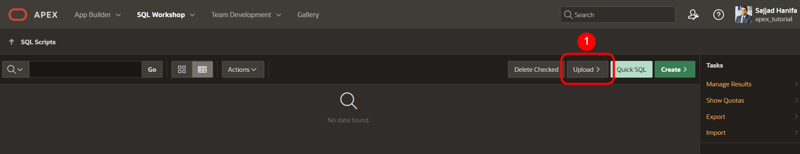

- Wählen Sie das Skript **Skript.sql** aus, welches sich in dem Ordner **Kapitel-01** befindet. Laden Sie das Skript durch Klicken auf den Upload-Button hoch bzw. ziehen Sie es in das vorgesehene Feld.


- Starten Sie das Skript, indem Sie auf den **Run**-Button drücken.

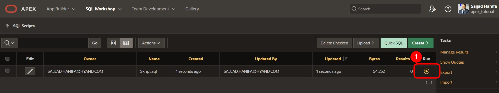

- Klicken Sie auf **Run Now**.

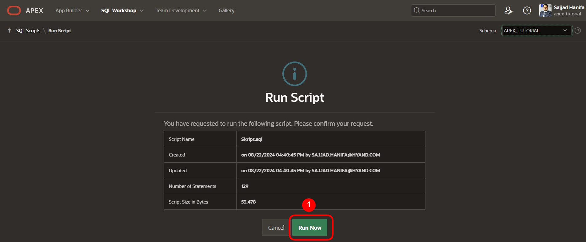

- Nach dem erfolgreichen Import sollten Sie folgendes Ergebnis sehen:

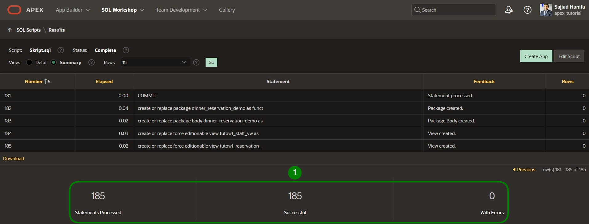

Es sollten jetzt alle Tabellen und Daten, welche für dieses Tutorial benötigt werden, in Ihrem Workspace vorhanden sein.  

## <a name="datenmodellierung"></a>1.3 Datenmodellierung mittels Quick SQL

Eine weitere Möglichkeit, Datenmodelle ohne viel Aufwand anzulegen, bietet Quick SQL.  
Wie das funktioniert, erfahren Sie in der <span style="color:red">**Aufgabe #14: Exkurs: Datenmodellierung mittels Quick SQL**</span>.

# <a name="create"></a>2. Create App Wizard

Der Create App Wizard ist ein Assistent, der es Entwicklern ermöglicht, Standard APEX-Anwendungen schnell zu entwerfen und zu entwickeln. Dabei kann der Assistent verwendet werden, um vollständige Anwendungen zu erstellen, die aus mehreren Seiten und einer Vielzahl von verschiedenen Reports und Forms bestehen.

In diesem Kapitel wird das Grundgerüst der Anwendung und die erste Seite erstellt. Im Create App Wizard geben Sie die Einstellungen für Ihre Anwendung an. Nachdem Sie auf Create Application geklickt haben, erstellt APEX die Anwendung mit Ihren Einstellungen.

## <a name="erstelleneineranwendung"></a>2.1 Erstellen einer Anwendung

- Für die weiteren Aufgaben muss zunächst eine **Anwendung** erstellt werden. Öffnen Sie hierzu als erstes den **App Builder**. Der App Builder zeigt alle installierten Anwendungen an. Klicken Sie nun auf den Button **Create**.


- Der Assistent zur Erstellung von Anwendungen wird gestartet. Klicken Sie auf Use Create App Wizard, um den Assistenten für eine neue Anwendung zu öffnen.


- Geben Sie jetzt den Namen der Anwendung ein (z.B. Tutorial 23.2).


- Wenn gewünscht kann mit einem Klick auf den blauen Briefumschlag, links vom Namen, auch das Application Icon angepasst werden. Es öffnet sich ein Wizard, in dem ein Icon und eine Farbe ausgewählt oder ein eigenes Bild hochgeladen werden kann.

- Im Assistenten können Sie direkt eine erste Seite in Ihrer Anwendung erstellen. Dazu klicken Sie auf das Plus oder auf Add Page.


## <a name="report"></a>2.2 Report

In APEX ist ein Report eine formatierte Darstellung einer SQL-Abfrage. Ein Report kann über den Assistenten oder über eine händisch eingegebene SQL-Abfrage generiert werden.

APEX unterscheidet zwischen dem klassischen und dem interaktiven Report. Der Unterschied zwischen den beiden besteht darin, dass der Benutzer beim interaktiven Report die Möglichkeit hat, die Darstellung der Daten durch Suchen, Filtern, Sortieren, Spaltenauswahl, Hervorheben und andere Datenmanipulationen anzupassen.

- Nachdem Sie auf den Button geklickt haben, um eine Seite hinzuzufügen, öffnet sich ein neues Fenster mit einem Assistenten zur Erstellung der Seite. Dort wählen Sie **Interactive Report** aus.

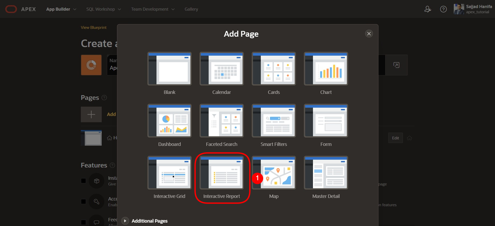

- Es folgen die Eigenschaften der Seite im nächsten Fenster. Als **Page Name** geben Sie ***STATES*** ein.
-	Die Einstellungen **Table or View** und **Interactive Report** sind standardmäßig ausgewählt. Falls das nicht der Fall ist, wählen Sie diese bitte aus.
-	Als nächstes klicken Sie auf das Dropdown-Menü rechts, um eine **Tabelle auszuwählen**, die im Interactive Report angezeigt werden soll. 


- Es öffnet sich der **Search Dialog**, wo Sie die Tabelle ***STATES*** auswählen.
- Setzen Sie das Häkchen für **Include Form** und klicken Sie anschließend auf den Button **Add Page**.


 
## <a name="createapplication"></a>2.3 Create Application

- So sollte Ihr Create App Wizard jetzt aussehen. 


- Setzen Sie nun das Häkchen für das Feature **„Install Progressive Web App“**. Mit diesem Feature können APEX Anwendungen auf mobilen Endgeräten installiert und als eigenständige Anwendung verwendet werden. Mehr dazu erfahren Sie in <span style="color:red">**Aufgabe #07: Features für mobile Endgeräte**</span>. 


- Wenn Sie herunterscrollen, sehen Sie unter **Settings** die **Application ID**. Da Sie diese im weiteren Verlauf noch brauchen werden, ist es ratsam, sich diese zu notieren.  
Bei der Application ID handelt es sich um eine eindeutige Nummer, über welche die Anwendung im Browser aufgerufen werden kann.

- Nachdem Sie alle anderen Schritte absolviert haben, klicken Sie auf den **Create Application**-Button, um die Anwendung zu erstellen.

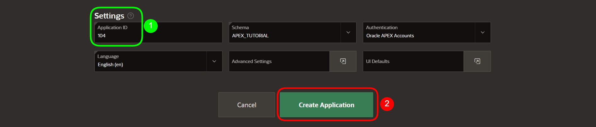
 
## <a name="runpage"></a> 2.4 Run Page

Nachdem Sie die Anwendung erstellt haben, öffnet sich die Seitenübersicht Ihrer Anwendung. 
Sie sehen fünf Seiten: **0 - Global Page - Desktop**, **1 - Home** und **9999 - Login Page** sind Standardseiten, die bei jeder Anwendung erstellt werden. Die Global Page ist eine Masterseite. Sämtliche Komponenten, die auf der Global Page angelegt werden, werden auf allen Seiten der Anwendung angezeigt. 
Die Seiten **2 - STATES** und **3 - State** haben Sie eben über den Add Page – Assistenten erstellt.
- Klicken Sie auf die markierte Schaltfläche, um die **Listenansicht** zu öffnen.


- Klicken Sie auf den **Run-Button** der ***STATES***-Seite, um die erstellte Seite anzusehen.


- Es erscheint ein Login-Bildschirm, wo Sie sich mit Ihrem Username und Ihrem Password (selbe Zugangsdaten wie für den Workspace) anmelden.


- Nach dem Login erscheint die Seite ***STATES*** mit einem Interactive Report.


- Wenn Sie auf das **Stiftsymbol** in der linken Spalte klicken, öffnet sich ein modaler Dialog, in dem Sie die Daten ändern können.


- Fürs Erste lassen wir die Inhalte so wie sie sind und schließen den modalen Dialog wieder (über den **Cancel**-Button oder das x oben in der Ecke).  

- Wechseln Sie nun zurück in den Tab **App Builder**. 

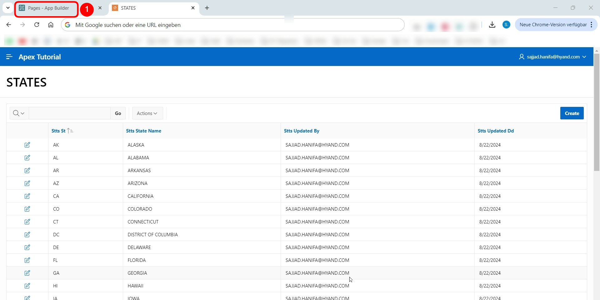

# <a name="views"></a>3. Zugriff auf Views statt auf Tabellen vornehmen

Um einen einheitlichen Zugriff auf die Daten zu gewähren, werden View-Schichten genutzt.  

Mit Views kann man leicht aus großen Tabellen nur die wichtigsten Spalten selektieren, um diese anzuzeigen.  

Bei einer View handelt es sich um eine in einer Datenbank gespeicherte SQL-Abfrage für Daten, welche von den Datenbankbenutzern genauso abgefragt werden kann, wie die Daten in einer Tabelle. Damit ist das Ergebnis einer View eine Art virtuelle Tabelle, die dynamisch aus Daten in der Datenbank generiert wird, wenn der Zugriff auf die View angefordert wird. Ändern sich Daten in der Tabelle, werden die Änderungen auf die View gespiegelt.   

  

Es bietet sich an, die Views auf zwei verschiedene Arten einzusetzen: Für jede APEX-Seite werden seitenspezifische Views erstellt. Diese enthalten die Informationen, die auf der spezifischen Seite angezeigt werden. Für jede Seite sollten daher eine oder mehrere Views angelegt werden.  

Sollen Views seitenübergreifend verwendet werden, sollte eine Business View erstellt werden.  

In diesem Tutorial wird ausschließlich auf seitenspezifische Views zurückgegriffen.   

Im Folgenden werden nun die Views erstellt und die Zugriffe, die auf die Tabellen erfolgen, auf die Views umgestellt.  
 
## <a name="tools"></a>3.1 Tools
Im SQL Workshop werden Werkzeuge bereitgestellt, mit denen Datenbankobjekte angezeigt, erstellt und verwaltet werden können.  

Eines der Werkzeuge ist **SQL-Commands**. In diesem können direkt SQL-Befehle eingegeben und ausgeführt werden.   

Ein weiters Werkzeug ist der **Object Browser**. Mit diesem können Objekteigenschaften angezeigt und bearbeitet werden. Ebenso können hierüber neue Objekte erstellt werden.   
Der **Object Browser** ist in zwei Bereiche unterteilt. Auf der linken Seite wird der Objektauswahlbereich angezeigt. Dort werden alle Datenbankobjekte eines bestimmten Typs aufgelistet, die im aktuellen Schema vorhanden sind. Auf der rechten Seite werden detaillierte Informationen zu den einzelnen Objekten angezeigt.   

- Navigieren Sie über das Dropdown-Menü **SQL Workshop** zu dem Eintrag **Object Browser**.   

  

- Starten Sie den Assistenten zum Erstellen einer View. Öffnen Sie dazu das Dropdown-Menü über das + und klicken auf den Eintrag View.  

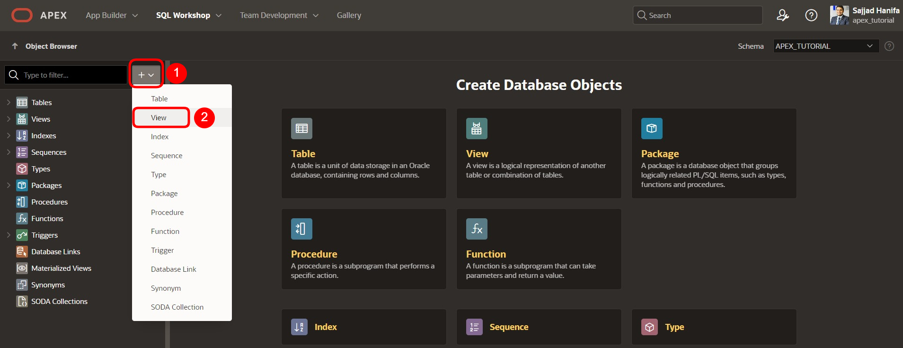  

Es öffnet sich ein Assistent zur Erstellung der View.    
Nun müssen Sie den entsprechenden Code sowie einen Namen für die View hinterlegen. Um eine einheitliche Benennung über verschiedene Anwendungen hinweg zu erzielen, empfiehlt sich die Verwendung von Namenskonventionen.  

In diesem Fall setzt sich die Bezeichnung der View wie folgt zusammen:  
**<APP_KUERZEL>_P<PAGE_ID>_VW**  

- Ersetzen Sie die Platzhalter mit den folgenden Werten:
  - <APP_KUERZEL>: Kürzel für Ihre Anwendung, z.B. TUTO für Tutorial
  - <PAGE_ID>: 0003 (Seitennummer, für die die View erstellt wird)  

- So könnte Ihre View beispielsweise **TUTO_P0003_VW** heißen.  
  Als **Query** (eine Abfrage, die gezielt nach Daten sucht) fügen Sie folgenden Code ein:
  ```sql
  select stts_id,
        stts_st,
        stts_state_name
  from states
  ```

- Achten Sie beim Einfügen auf die Formatierung der Abfrage. Sollte Ihre Formatierung nicht wie gezeigt aussehen, formatieren Sie sie entsprechend.  


- Abschließend klicken Sie auf den Button **Create View**.  

- So sollte Ihre fertige View aussehen:  

  

## <a name="pageprocesses"></a>3.2 Page Processes
**Page Processes** werden zu bestimmten, festgelegten Zeitpunkten ausgeführt, beispielsweise beim Aufrufen der Seite oder beim Speichern. Durch sie werden Aufrufe der Applikationslogik oder Datenbank-Operationen realisiert. Für die Verarbeitung eines Formulars sind in APEX zwei Prozesse verantwortlich: **Form – Initialization** und **Form – Automatic Row Processing (DML)**.  

Beide werden automatisch beim Erstellen einer Formular-Seite mithilfe des Wizards generiert und sorgen dafür, dass die Eingabefelder beim Aufruf die richtigen Daten enthalten und dass die Werte beim Abschicken des Formulars in der entsprechenden Datenquelle gespeichert werden.  

Im Folgenden wird die erstellte View dem DML-Prozess zugeordnet und einige kleinere Änderungen am Formular vorgenommen.  

- Gehen Sie in den Page Designer, indem Sie oben in der Leiste auf den **App Builder** klicken, dann auf Ihre **Anwendung** und dann auf die Seite 3 - ***State***.  

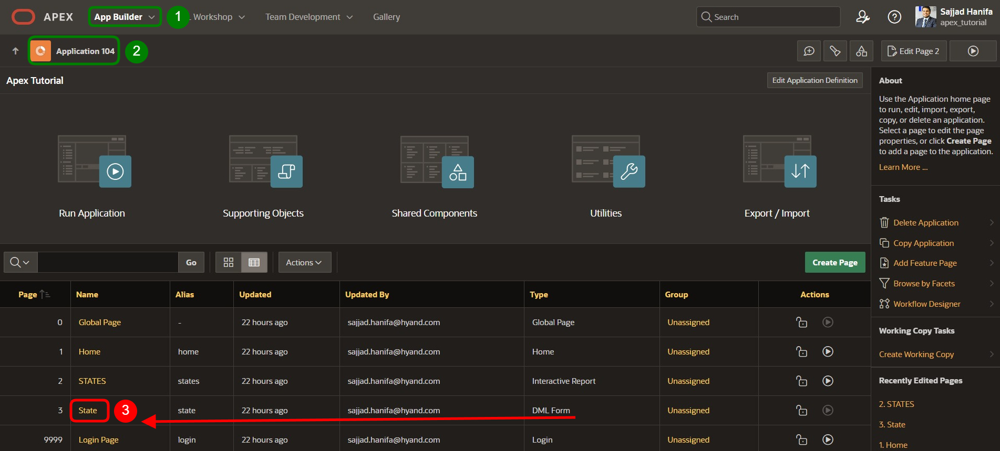  
  
- Klicken Sie auf die Region **State** und ändern Sie den **Table Name** auf die eben erstellte View ***TUTO_P0003_VW***.  

  

- Klicken Sie nun auf den Reiter **Processing** (die beiden Pfeile links oben)  

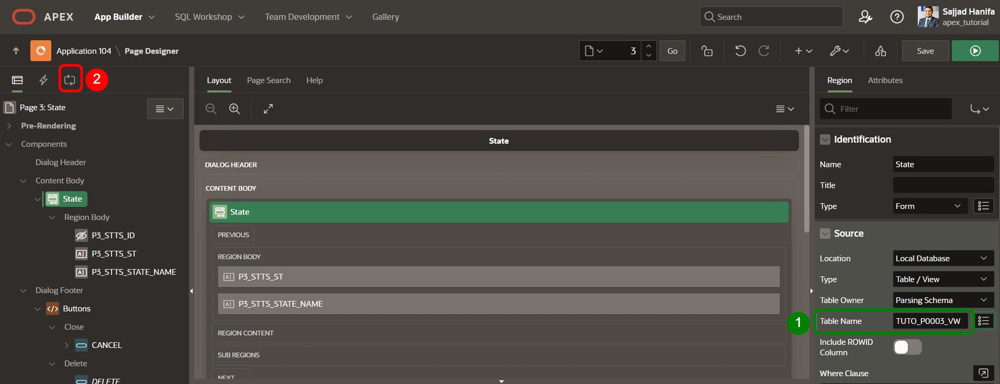  

- Wählen Sie den Process **Process form State** aus, um das Processing anzupassen.  

  

- Ändern Sie den **Target Type** auf ***Region Source***.  

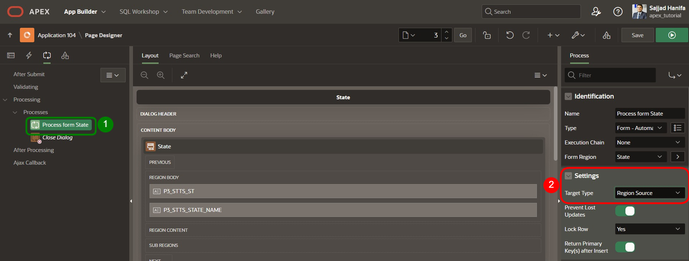  

Dies sorgt nun dafür, dass für das Processing die gleiche Quelle verwendet wird, wie für die Region. In unserem Fall ist das die eben erstellte View. 
Wird in der Zukunft die Datenquelle der Region geändert, muss das Processing nicht mehr angepasst werden.   

Wenn man in APEX Reports und Forms über den Wizard erstellt, werden die benötigten Standard-Processings (z.B. zum Einfügen oder Updaten von Daten) automatisiert erstellt.  

- Gehen Sie danach wieder in den ersten Reiter **Rendering** mit der Übersicht der Elemente auf der Seite und klicken Sie unter State – Items auf **P3_STTS_ID**. Prüfen Sie, ob der **Type** ***Hidden*** ist. Wenn nicht, ändern Sie ihn entsprechend ab.   

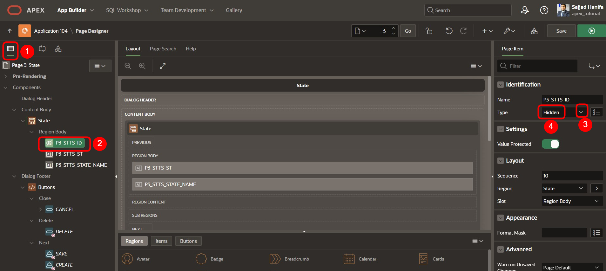  

- Klicken Sie anschließend auf **Save**.   

  

- Wechseln Sie zur Seite ***STATES***, indem Sie den **Dialog** in der **Breadcrumb-Leiste** aufrufen und dort die Seite 2 ***STATES*** auswählen.  
 
  

- Im Page Designer klicken Sie im Bereich **States** unter Columns auf **STTS_UPDATED_BY** und setzen den **Type** auf ***Hidden Column***. Das gleiche wiederholen Sie für die Spalte **STTS_UPDATED_DD** und klicken anschließend auf **Save**. Nun werden die entsprechenden Spalten im Report ausgeblendet.  

  

- Wenn Sie jetzt die Anwendung im anderen Tab aktualisieren, können Sie Ihre Änderungen sehen.  


# <a name="interactivegrid"></a>4. Interactive Grid

Ein **Interactive Grid** zeigt dem Datenbankbenutzer eine Reihe von festgelegten Datensätzen in einem durchsuchbaren, anpassbaren Bericht an. In diesem Bericht können die Datensätze geändert und aktualisiert werden. Außerdem ist es möglich, neue Datensätze hinzuzufügen und alte zu löschen.

In dieser Aufgabe wird ein **Interactive Grid** angelegt, um die oben genannten Funktionen nutzen zu können.

## <a name="gridview"></a>4.1	Erstellung der View
- Für diese Aufgabe muss zuerst eine **View** erstellt werden.
Dazu gehen Sie wie in Aufgabe #03 über den **SQL Workshop** in den **Object Browser** und starten über das + den Assistenten zur Erstellung der **View**.  
Dort geben Sie folgende Daten ein:

- **View Name**: ***TUTO_P0021_VW***  
- **Query**:
  ```sql
  select PRDT_INFO_ID,
         PRDT_INFO_NAME,
         PRDT_INFO_DESCR,
         PRDT_INFO_CATEGORY,
         PRDT_INFO_AVAIL,
         PRDT_INFO_LIST_PRICE
  from PRODUCT_INFO
  ```


- Klicken Sie anschließend auf den Button **Next** und dann auf **Create View**.

## <a name="gridcreatepage"></a>4.2	Create Page
- Öffnen Sie den **App Builder** über die Navigationsleiste, wählen Sie Ihre Anwendung aus und klicken Sie auf den Button **Create Page**. 

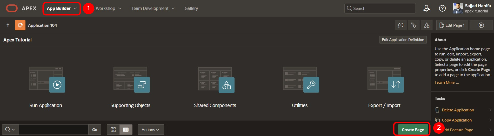

- Es startet der **Assistent** zum Erstellen einer **Seite**.  
Wählen Sie den Seitentypen **Interactive Grid** aus. Der Wechsel zur nächsten Seite erfolgt automatisch, ansonsten klicken Sie auf den Button **Next**. 

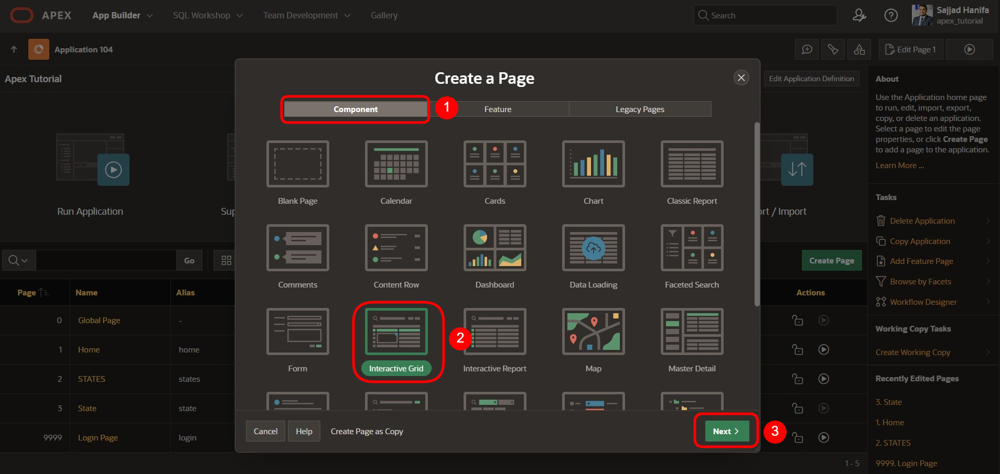

- Geben Sie als **Page Number** ***21*** ein und als **Page Name** ***Product Info***.
- Wählen Sie im Bereich Data Source die erstellte View zur *Product Info* als **Table / View** Name aus und aktivieren Sie nun die Bearbeitung im **Interactive Grid**, indem Sie **Editing Enabled** auf ***enabled*** stellen.  
Dies ist besonders wichtig, damit die Spalte APEX$ROW_SELECTOR erstellt werden kann.
- Öffnen Sie anschließend den Navigationsbereich.

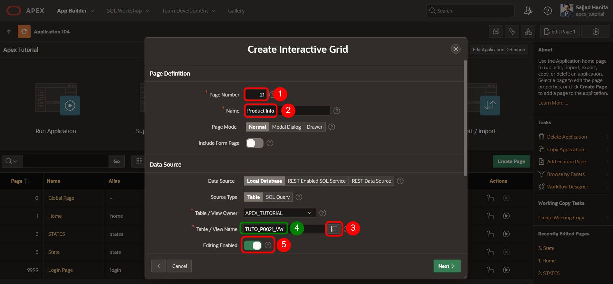

- Deaktivieren Sie hier die Breadcrumb und klicken Sie anschließend auf den Button **Next**. 


- Wählen Sie die Spalte ***PRDT_INFO_ID (Number)*** als **Primary Key Column 1** aus.

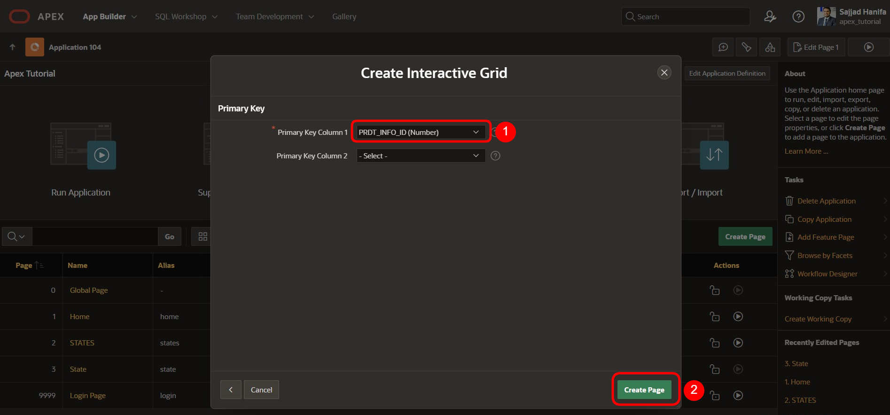

- Klicken Sie abschließend auf den Button **Create Page**.

- Die **Seite** mit dem **Interactive Grid** wurde erfolgreich erstellt. Starten Sie nun die **Seite**, indem Sie auf den **Run**-Button klicken


- Sie sehen nun das **Interactive Grid**. Zunächst bietet Ihnen das **Interactive Grid** einen Bericht über die bestehenden Daten. Über den Button **Add Row** können Sie einen neuen Datensatz direkt in dieser Tabelle anlegen.

- Außerdem können Sie bestehende Datensätze editieren. Hierzu können Sie mit einem **Doppelklick** einen Eintrag auswählen, woraufhin der Cursor in dem entsprechenden Feld angezeigt wird. Wenn der Edit-Modus aktiviert ist, reicht auch ein einfacher Klick aus. Über den Button **Edit** lässt sich dieser Modus aktivieren bzw. deaktivieren.


- Die von Ihnen durchgeführten Änderungen finden zunächst nur in Ihrem Browser statt. Um die Änderungen zu speichern, klicken Sie auf den Button **Save**. Alternativ können Sie auch unerwünschte Änderungen widerrufen, indem Sie das **Dropdown-Menü** ***Actions*** öffnen und hier den Eintrag ***Refresh*** unter ***Data*** auswählen. So werden die ursprünglichen Daten aus der Datenbank erneut geladen.

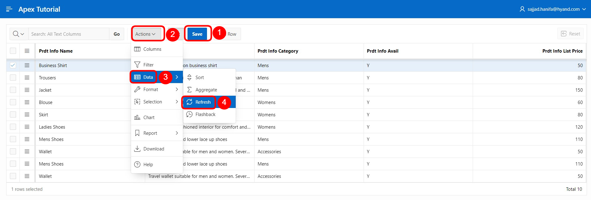

- Des Weiteren steht Ihnen eine Detailansicht einzelner Datensätze zur Verfügung. Klicken Sie dafür auf den kleinen Button links neben einem Datensatz und wählen Sie den Eintrag ***Single Row View***. 


- Nun sehen Sie nur noch die Daten zum ausgewählten Datensatz. Über den Button **Report View** gelangen Sie wieder zurück zur Tabellenansicht.


- Je nach Auflösung und Menge der angezeigten Spalten kann es passieren, dass horizontales Scrolling nötig wird


- Um dennoch den Überblick zu behalten, lassen sich Spalten fixieren. **Fixierte Spalten** bleiben bei horizontalem Scrollen stehen. Klicken Sie auf die **Spalte** ***Product Name*** und wählen das **Symbol** für ***Freeze*** aus.


 
- Nun wird die Spalte *Product Name* fixiert dargestellt und es bleibt auch bei horizontalem Scrolling ersichtlich, auf welches Produkt sich die übrigen Spalten beziehen.


# <a name="master-detail-detail"></a>5. Master-Detail-Detail
Master – Detail Regionen sind praktisch, wenn man auf einer Seite Daten aus voneinander abhängigen Tabellen darstellen möchte.

In diesem Beispiel enthält die erste Tabelle die Kundendaten, die zweite Tabelle die Bestellungen pro Kunde und die dritte Tabelle die Artikel (Items) der Bestellung.

Beim Auswählen eines Datensatzes ändern sich die Inhalte der Tabellen und man kann für einen Kunden alle Bestellungen und nach Auswahl einer Bestellung jeweils alle zugehörigen Artikel auf einer Seite einsehen.

## <a name="erstellung-der-views"></a>5.1 Erstellung der Views
- Für die Bearbeitung dieser Aufgabe werden vier Views benötigt. Erstellen Sie diese nach den folgenden Vorgaben:

  - TUTO_P0031_1_VW
    ```sql
    select ordr_id, 
           ordr_ctmr_id, 
           ordr_total, 
           ordr_dd, 
           ordr_user_name, 
           ordr_tags 
      from orders
    ```
  - TUTO_P0031_2_VW
    ```sql
    select ordr_item_id,
           ordr_item_ordr_id,
           ordr_item_prdt_info_id,
           ordr_item_unit_price,
           ordr_item_quantity
      from order_items
    ```
  - TUTO_P0031_3_VW
    ```sql
    select prdt_info_id,
           prdt_info_name,
           prdt_info_descr,
           prdt_info_category,
           prdt_info_avail,
           prdt_info_list_price,
           prdt_info_product_image,
           prdt_info_mimetype,
           prdt_info_filename,
           prdt_info_image_last_update,
           prdt_info_tags
      from product_info
    ```
  - TUTO_P0031_4_VW
    ```sql
    select ctmr_id,
           ctmr_frst_name,
           ctmr_last_name,
           ctmr_street_address1,
           ctmr_street_address2,
           ctmr_state,
           ctmr_postal_code,
           ctmr_email,
           ctmr_phone_number1,
           ctmr_phone_number2,
           ctmr_url,
           ctmr_credit_limit,
           ctmr_tags
      from customers
    ```


## <a name="erstellung-einer-master-detail-detail-seite"></a>5.2 Erstellung einer Master-Detail-Detail Seite
- Öffnen Sie den **App Builder** über die Navigationsleiste, wählen Sie Ihre Anwendung aus und klicken Sie auf den Button **Create Page**.


- Wählen Sie als Seitentypen **Master Detail** aus.


- Wählen Sie als Bereichstypen **Stacked** aus.

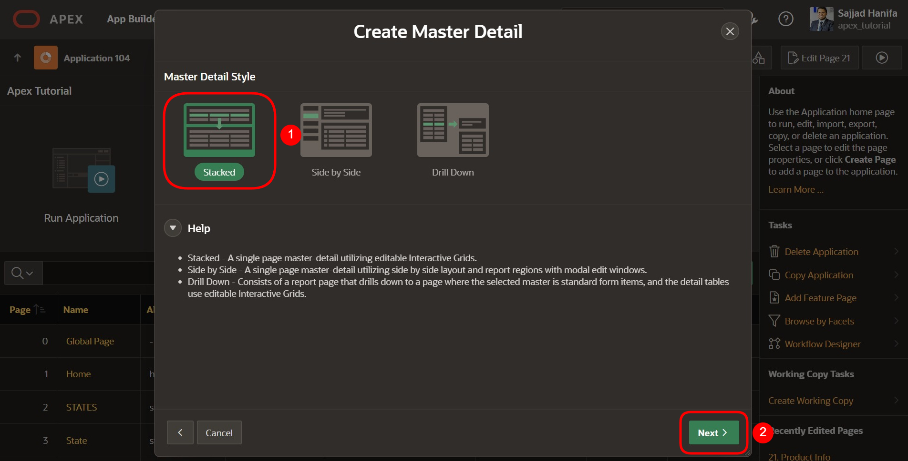

- Geben Sie als **Page Number** ***31*** ein und als **Page Name** ***Customer Orders***. 
- Wählen Sie im Bereich Master Data Source zunächst die erstellte View für die Master Region als **Table / View** Name aus (*TUTO_P0031_4_VW*).
- Öffnen Sie anschließend den Navigationsbereich.


- Deaktivieren Sie hier die **Breadcrumb** und klicken Sie anschließend auf den Button **Next**. 


- Wählen Sie als **Primary Key Column 1** die Spalte ***CTMR_ID (Number)*** und klicken Sie auf den Button **Next**.


Eine Region ist ein Bereich auf einer Seite, der als Container für Inhalte dient. Diese Inhalte können z.B. Items oder Unterregionen sein. Regionen können verwendet werden, um Seitenelemente zu gruppieren. Jede Seite in APEX kann eine beliebige Anzahl von Regionen beinhalten. 

- Als nächstes wird die **Detail Region** konfiguriert. Ändern Sie dazu die folgende Felder wie angegeben ab:  

  | | |  
  |--|--|
  | Detail Region Title | Orders by Customer |  
  | Show Only Related Tables | No |  
  | Table / View Name | View zur Tabelle Orders (*TUTO_P0031_1_VW*) |
  | | |

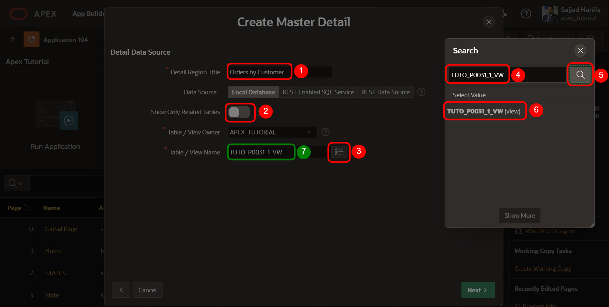
 
- Klicken Sie anschließend auf den Button **Next**.
 
- Füllen Sie hier die Felder wie folgt aus und klicken Sie anschließend auf **Create Page**:

  | | | 
  |--|--|
  | Primary Key Column | ORDER_ID |
  | Master Column | CTMR_ID |
  | Detail Column | ORDR__CTMR_ID |
  | | |

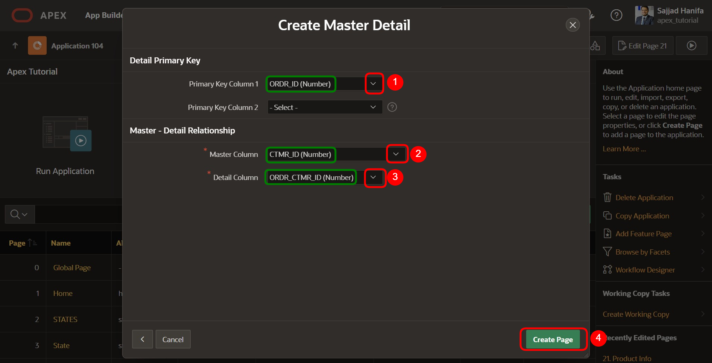

- Ihnen wird nun der **Page Designer** der **Seite** ***31*** angezeigt. Über den **Run**-Button können Sie Ihre soeben erstellte Seite betrachten.

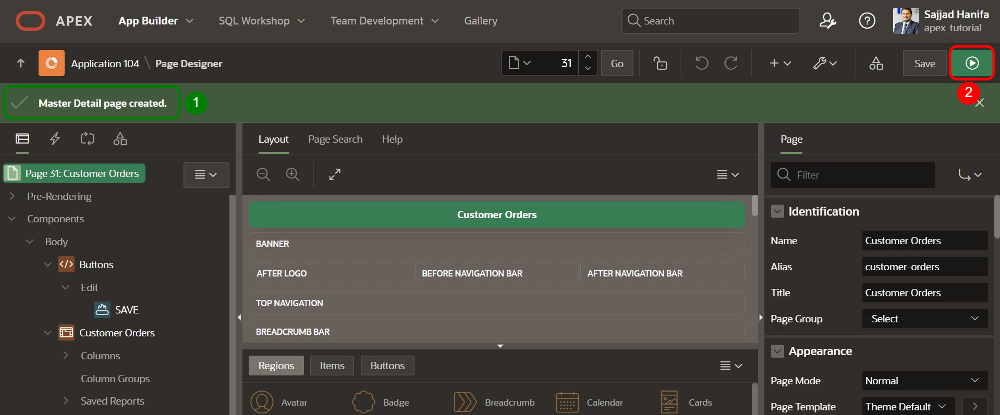

- Zur besseren Lesbarkeit der Spalten empfiehlt es sich, die **Spaltenüberschriften** anzupassen. Klicken Sie dazu auf die jeweiligen Spalten in den Interactive Grids (z.B. CTMR_FRST_NAME im Grid Customer Orders) und ändern Sie die Spaltenüberschrift bei Heading rechts in den Spalteneigenschaften. 

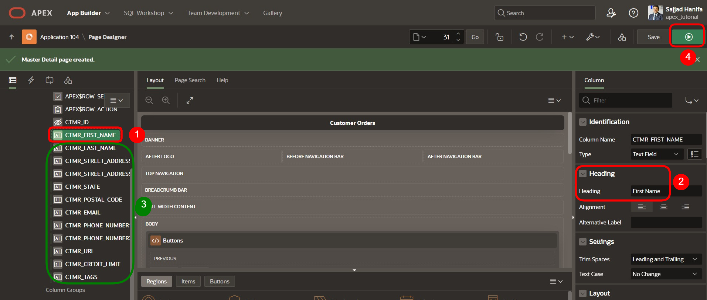

- Wiederholen Sie den Vorgang für die weiteren Spalten. Über den **Run**-Button können Sie die veränderte Seite betrachten.

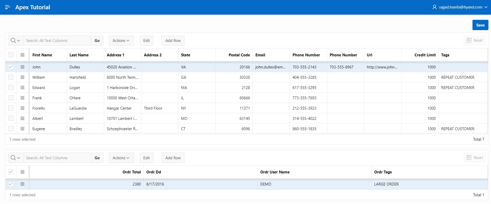

- Da bisher jedoch lediglich eine **Master-Detail** Seite erstellt wurde, wird nun eine weitere **Detail-Region** benötigt. Klicken Sie mit der **rechten Maustaste** auf die **Region** ***Orders by Customer*** und wählen Sie den Eintrag **Create Region Below** aus. 

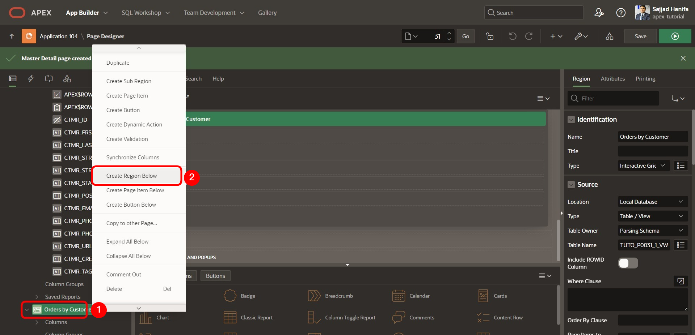

- Ändern Sie anschließend den **Title** zu ***Items in Order*** und den **Type** zu ***Interactive Grid***. Ändern Sie anschließend unter Source den **Type** zu ***SQL Query***.


- APEX markiert nun unter Source das Feld für die **SQL Query** rot. Hier muss eine entsprechende Query hinterlegt werden, um die Seite lauffähig zu speichern. Sie können entweder direkt in dem Feld tippen oder den Code Editor als modalen Dialog anzeigen lassen. Klicken Sie auf den Button über dem Feld, um den Code Editor aufzurufen.

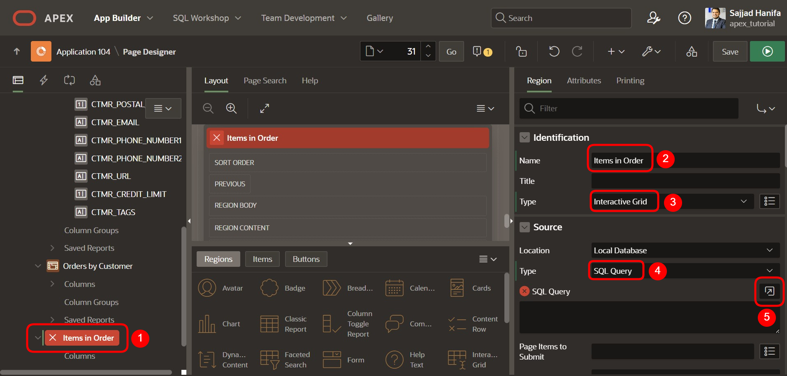

- Der Code Editor ermöglicht das komfortable Schreiben von SQL-Code und unterstützt den Entwickler mit Zusatzfunktionen wie z. B. Syntax Highlighting und der Validierung des Codes. Geben Sie folgenden Code in dem Code-Editor ein:
  ```sql
  select ordr_item_id,
         ordr_item_ordr_id,
         ordr_item_prdt_info_id,
         ordr_item_unit_price,
         ordr_item_quantity
  from TUTO_P0031_2_VW
  ```
- Anschließend können Sie auf das Häkchen im Code-Editor klicken und die Query von APEX validieren lassen. Sollte alles korrekt sein, wird APEX Ihnen eine entsprechende Rückmeldung geben. 

- Klicken Sie anschließend auf den Button **OK**.

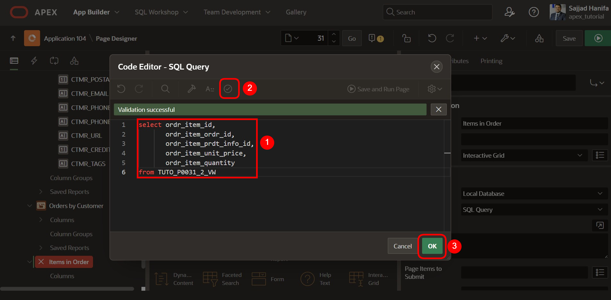

- Wählen Sie bei **Master Detail** die Region ***Orders by Customer*** als Master Region aus.

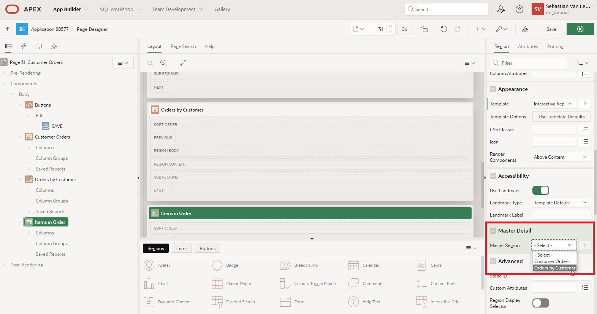

- Klicken Sie nun im linken Bereich des Page Designers in der Region **Items in Order** unter Columns auf die Spalte **ORDR_ITEM_ORDR_ID**. Wählen Sie anschließend im rechten Bereich die Spalte **ORDR_ID** als **Master Column** aus. Dadurch wird die Verknüpfung zwischen den zwei Regionen hergestellt. 

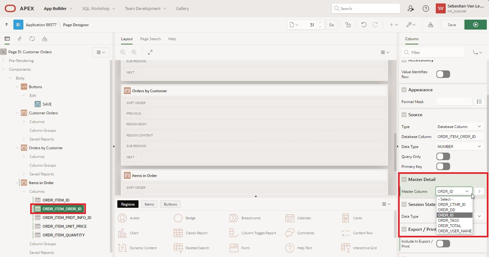

- Speichern Sie die Änderungen, indem Sie den Button **Save** drücken. Alternativ können Sie direkt den Button **Run** klicken, um zu speichern und daraufhin die Seite aufzurufen.

- Auf der von Ihnen erstellten Seite sind nun drei **Interactive Grids** zu sehen. Wählen Sie in der obersten Region einen beliebigen Eintrag (Kunden) aus.


- In der mittleren Region werden nun alle Bestellungen dieses Kunden angezeigt. Wählen Sie auch hier einen beliebigen Eintrag (Bestellung) aus.

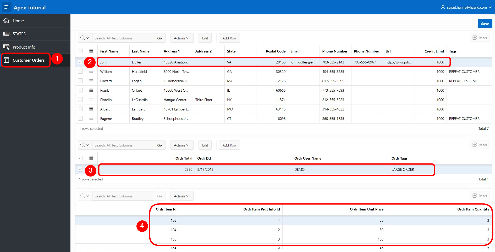

In der untersten Region werden alle Artikel aus der ausgewählten Bestellung angezeigt. Auch wenn hier, wie in den oberen Regionen, ein **Interactive Grid** verwendet wird, ist standardmäßig der Edit-Modus nicht verfügbar, wenn das **Interactive Grid** ohne den Assistenten erstellt wurde. Außerdem wird dem Nutzer zwar die ID der bestellten Artikel aber nicht deren Artikelname angezeigt.  

Um dies zu ändern, wird das **Interactive Grid** in den nächsten Schritten entsprechend angepasst. 

- Öffnen Sie erneut den **Page Designer**. Wählen Sie den **Eintrag** ***Attributes*** bei der **Region** ***Items in Order***. Setzen Sie anschließend den Wert von **Enabled** in dem Bereich **Edit** auf ***Yes***. Dies aktiviert den **Edit-Modus** für das **Interactive Grid**.

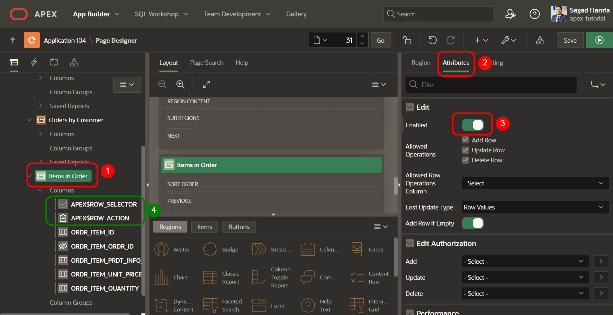

- Anschließend muss noch ein Primary Key für das Interactive Grid **Items in Order** festgelegt werden. Dazu klicken Sie auf die Column **ORDR_ITEM_ID** und setzen unter Source den **Primary Key** auf ***Yes***.


 
- Wählen Sie nun die Spalte **ORDR_ITEM_PRDT_INFO_ID** bei der Region **Items in Order** aus. Ändern Sie den **Type** zu ***Select List***.  
Eine Select List ist eine Auflistung von Daten, die es dem Benutzer ermöglicht, einen bestimmten Wert auszuwählen.


- APEX meldet, dass eine *List of Values* hinterlegt werden muss. Wenn Sie oben auf das **Message Icon** klicken, erhalten Sie zusätzliche Informationen dazu. 


- Ändern Sie den **Type** der *List of Values* zu ***SQL Query***.

*List of Values* sind Abfragen bestehend aus zwei Werten: einem Anzeigewert, der dem Benutzer angezeigt wird und einem Rückgabewert, mit dem APEX in der Datenbank gearbeitet wird.

Nun müssen Sie eine SQL Query hinterlegen. Hinweise zur Erstellung der korrekten Query erhalten Sie über den Reiter **Help**. 

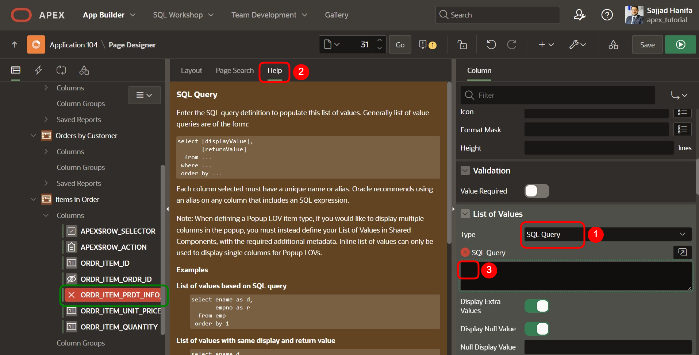

Hinterlegen Sie folgenden Code in dem Feld **SQL Query**:
```sql
select prdt_info_name as d,
       prdt_info_id as r
from TUTO_P0031_3_VW
```


- Klicken Sie anschließend erst auf den Button **Save** und dann auf den Button **Run**, um die Seite zu speichern und auszuführen.


Sie sehen nun, dass in der untersten **Region** statt der **ID** die zugehörigen **Namen** der Artikel angezeigt werden. Durch eine **Select List** lassen sich nun die entsprechenden Artikel auswählen und ändern. Geändert wurde lediglich das **angezeigte Element**.  
APEX hinterlegt weiterhin in der Datenbank die **ID**. 


## <a name="popup-list-of-values"></a>5.3 Popup List of Values
**List of Values** können auch als Popup-Fenster angezeigt werden. In APEX 23.1 wurden hierfür einige Funktionen optimiert und erweitert. Diese sollen im Folgenden an einem Beispiel angewendet werden.

Die Felder der Spalte **State** im **Interactive Grid** können bislang über eine Texteingabe geändert werden. Stattdessen soll nun dort eine Auswahlliste angezeigt werden, entsprechend der Einträge in der Datenbanktabelle **States**.

- Für die Bearbeitung dieser Aufgabe wird eine weitere **View** benötigt. Erstellen Sie diese gemäß der folgenden Angaben:
  - TUTO_P0031_5_VW
    ```sql
    select STTS_ID,
           STTS_ST
           STTS_STATE_NAME
      from STATES
    ```

- Öffnen Sie den **Page Designer** für die Seite ***31 Customer Orders***. Wählen Sie dort in der Region **Customer Orders** unter **Columns** die Spalte **CTMR_STATE** aus und ändern sie den **Type** zu ***Popup LOV***. Setzen Sie unter **List of Values** den **Type** auf ***SQL Query*** und geben Sie als **Query** folgendes SQL Statement ein:
    ```sql
    select STTS_ST as r,
           STTS_ST as d
    from TUTO_P0031_5_VW
    ```

- In diesem Fall wird dieselbe Tabellenspalte als Anzeige- und Rückgabewert verwendet, da anders als beim vorherigen Fall ein Text und keine Nummer als Eingabe erwartet wird. 

- Speichern Sie Ihre Änderungen durch den Button **Save** und klicken Sie dann auf den Button **Run**, um die Seite auszuführen.

- Wird nun ein Feld in der Spalte editiert, öffnet sich durch den **Pfeil**-Button rechts ein Auswahlmenü, das durch ein eigenes Eingabefeld nach Einträgen durchsucht werden kann.

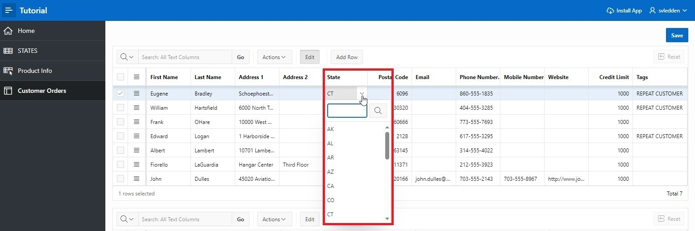

- APEX bietet weitere Optionen, um das Popupfenster anzupassen. Wechseln Sie zurück in den **Page Designer**, um einige von ihnen auszuprobieren. Ändern Sie von der Column **CTMR_STATE** die Einstellung **Display as** auf ***Modal Dialog***. Aktivieren Sie außerdem die Option **Search as You Type**. 


- Speichern Sie und rufen Sie die Seite erneut auf.

- Das Auswahlfenster öffnet sich nun in einem separaten, modalen Dialog, außerdem fällt der **Search**-Button weg. Stattdessen werden die Einträge direkt bei einer Eingabe in das Textfeld durchsucht.


- Neben den gezeigten Anpassungen ist es außerdem möglich, die Auswahl mehrerer Einträge zu ermöglichen. Dies funktioniert über die Option **Multiple Values**. Die ausgewählten Werte werden dann wie unten gezeigt aneinandergereiht und können einzeln wieder gelöscht werden. Hierbei sollte jedoch immer beachtet werden, ob das Datenmodell mehrwertige Attribute unterstützt.

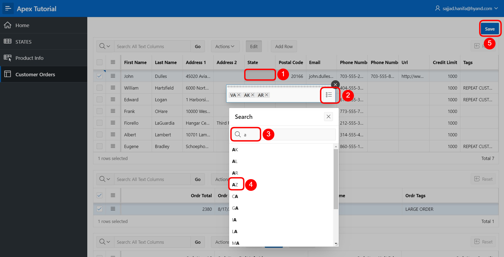

- Weiterhin ist es möglich, Einträge als Tupel mit mehreren Attributen anzuzeigen. Hierfür muss die List of Values als **Shared Components** in der Anwendung hinterlegt sein.

- Öffnen Sie den **App Builder**, wählen Sie Ihre Anwendung und klicken Sie auf **Shared Components**. 


*Shared Components* sind allgemeine Elemente, die auf einer oder beliebig vielen Seiten einer Anwendung benutzt werden können.

- Klicken Sie auf den Eintrag **List of Values**.

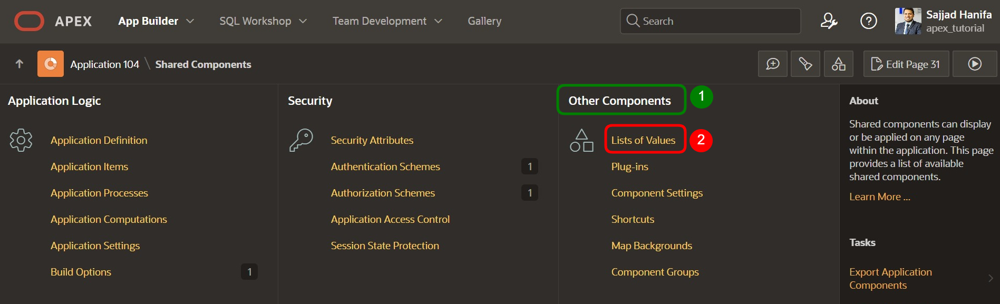

- Sie sehen eine Auflistung der angelegten Listen. Klicken Sie **Create**, um eine neue List of Values anzulegen.


- Wählen Sie die Option **From Scratch** und klicken Sie auf **Next**.

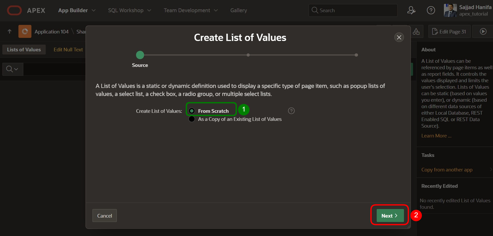

- Geben Sie als Namen der Liste **States** ein und wählen Sie die Option **Dynamic**. Klicken Sie anschließend auf **Next**.

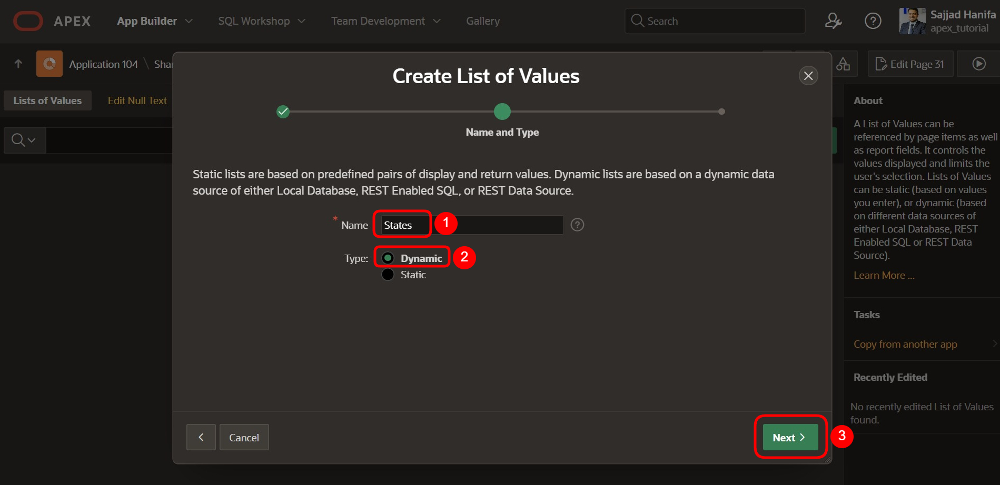

- Wählen Sie die unter dem Punkt **Table/View Name** die zuvor erstellte View (*TUTO_P00031_5_VW*) aus und klicken Sie auf **Next**.


- Wählen Sie sowohl als **Return Column** als auch als **Display Column** die Spalte ***STTS_ST*** aus und klicken Sie auf **Create**.

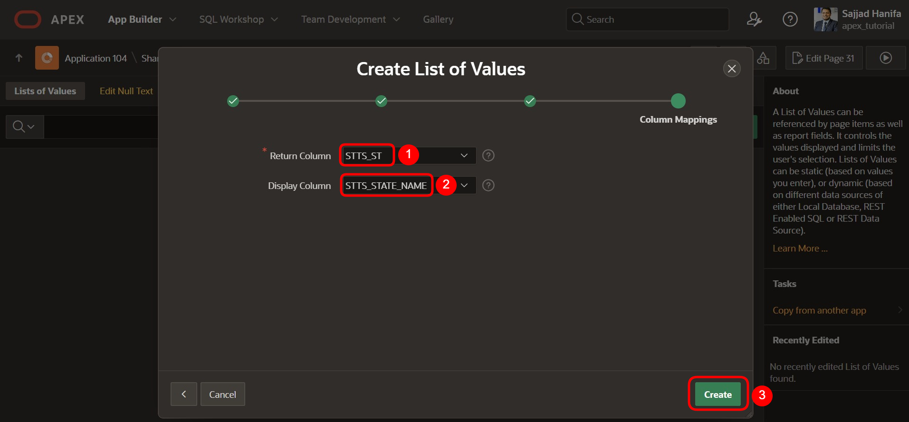

- Um mehrere Spalten als angezeigte Spalten zu hinterlegen, sind nachträgliche Anpassungen an der List of Value notwendig. Klicken Sie dafür auf den zugehörigen Eintrag.


- Klicken Sie auf den Button **Select Columns** im unteren Teil des Bildschirms.

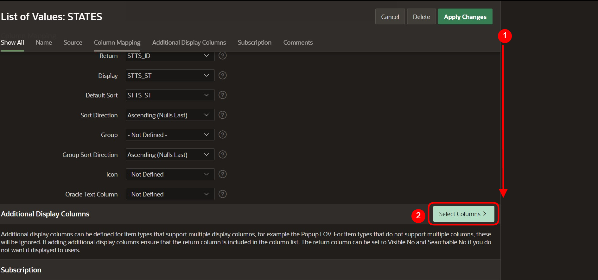

- Verschieben Sie im sich öffnenden Fenster den Eintrag zur Spalte **STTS_STATE_NAME** in das rechte Feld, indem Sie den Eintrag auswählen und auf die Pfeil-Schaltfläche in der Mitte klicken. Klicken Sie anschließend auf den Button **Update**.


- Damit auch die bislang dargestellte Spalte STATE weiterhin sichtbar ist, geben Sie in der zugehörigen Zeile unter **Heading** ***State*** ein und ändern Sie die Optionen **Visible** und **Searchable** auf ***On*** bzw. ***Enabled***. Ändern Sie das Heading in der Zeile darunter auf **State Name**.

- Klicken Sie abschließend den Button **Apply Changes** um die Änderungen zu speichern.


- Klicken Sie auf die Schaltfläche mit dem **Stiftsymbol** und der Seitennummer **31**, um direkt in den **Page Designer** zurückzukehren.

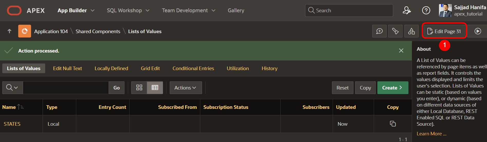

- Ändern Sie dort für die Region Customers in der Spalte **CTMR_STATE** den **Type** im Reiter List of Values in ***Shared Components*** und den Wert von **List of Values** in ***STATES***.


- Speichern Sie die Seite und aktualisieren den Tab mit der geöffneten Anwendung. Im Dialogfenster werden nun zu jedem Eintrag die Attributwerte zu **State** und **State Name** angezeigt.


# <a name="charts"></a>6. Charts
Charts/Diagramme dienen zur grafischen Darstellung von Zahlenwerten. APEX unterstützt standardmäßig u.a. Kuchen-Diagramme, Linien-Diagramme, Blasen-Diagramme, Streu-Diagramme und Balken-Diagramme.

Ziel dieses Kapitels ist es, ein Chart zu erstellen, welches das Verhältnis der Käufe sortiert nach Kategorien anzeigt.

## <a name="charts-erstellung-der-view"></a>6.1 Erstellung der View
- Für die Bearbeitung dieser Aufgabe wird eine **View** benötigt. 

- Geben Sie Ihrer **View** den Namen ***TUTO_P0001_VW***
  ```sql
  select o.ordr_id,
         o.ordr_ctmr_id,
         o.ordr_total,
         o.ordr_dd,
         o.ordr_user_name,
         oi.ordr_item_id,
         oi.ordr_item_prdt_info_id,
         oi.ordr_item_unit_price,
         oi.ordr_item_quantity,
         p.prdt_info_name,
         p.prdt_info_descr,
         p.prdt_info_category,
         p.prdt_info_avail,
         p.prdt_info_list_price
    from order_items oi
    join product_info p
      on oi.ordr_item_prdt_info_id = p.prdt_info_id
    join orders o
      on oi.ordr_item_ordr_id = o.ordr_id
  ```
## <a name="charts-region"></a>6.2 Charts Region
- Öffnen Sie zunächst den **App Builder** für Ihre **Anwendung**. Klicken Sie anschließend auf die **Seite 1 -** ***Home***.

- **Breadcrumbs** können meist nach dem Anlegen gelöscht werden. Sie nehmen viel Platz ein und bringen i. d. R. keinen Mehrwert für den Endanwender. **Breadcrumbs** sind hierarchische Listen von Links und bieten eine hierarchische Navigation.

- Klicken Sie mit der rechten Maustaste auf die *Breadcrumb* **TUTORIAL 23.2** und wählen Sie **Delete** aus. 

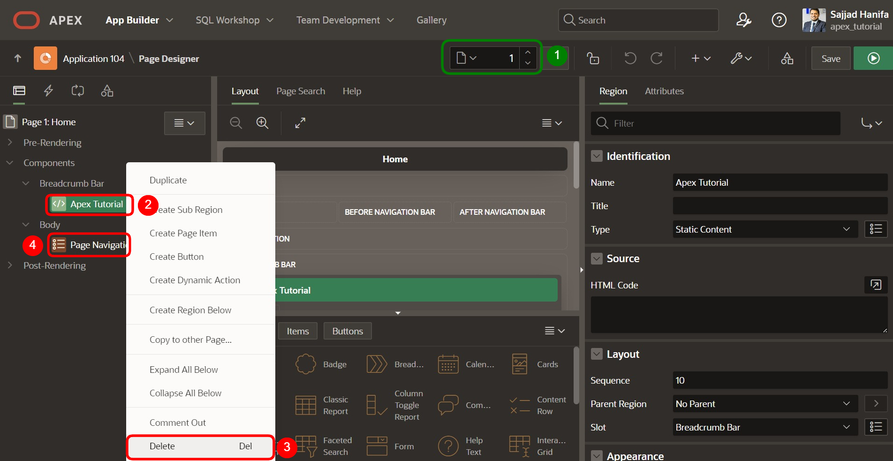

- Löschen Sie ebenfalls die Region **Page Navigation**.

- Klicken Sie mit der rechten Maustaste auf den Eintrag **Components**. Wählen Sie hier **Create Region**.

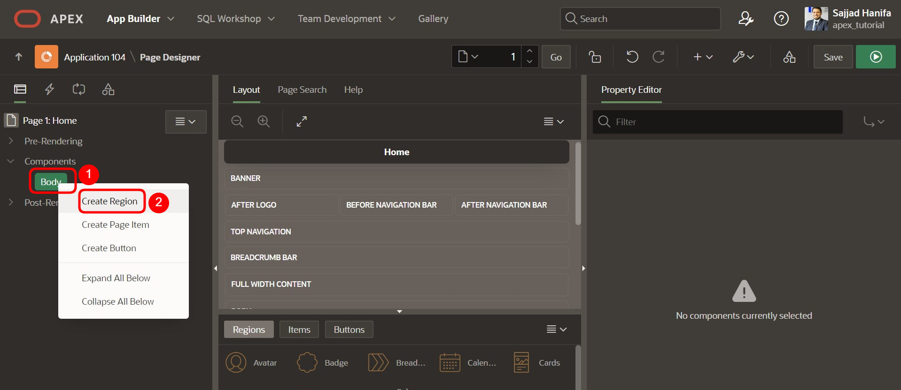

- Wählen Sie nun die von Ihnen erstellte Region aus und ändern Sie den **Title** zu ***Orders per Category*** und den **Type** zu ***Chart***.


- Wählen Sie nun den Eintrag **NEW** unter Series aus und ändern Sie den **Titel** in ***Orders***. 
- Unter Source wählen Sie als **Location** die Einstellung ***Local Database*** aus und geben als **Table Name** die soeben erstellte View (***TUTO_P0001_VW***).


- Ändern Sie nun den Wert für **Label** zu der Spalte ***PRDT_INFO_CATEGORY*** und den Wert für **Value** zu der Spalte ***ORDR_TOTAL***.


- Wechseln Sie nun bei Orders per Category zu in den Reiter **Attributes**. Ändern Sie den **Type** zu ***Pie***. Nun wird Ihr Diagramm als Kreisdiagramm dargestellt. Kreis/Kuchen-Diagramme sind Darstellungsformen für Teilwerte eines Ganzen in Form eines Kreises. Der gesamte Kreis steht für die Summe der einzelnen Kreissektoren. 

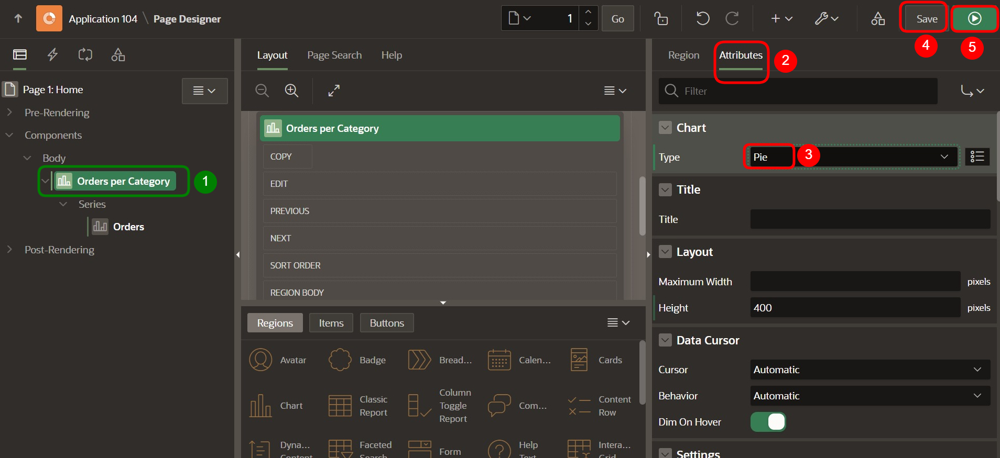

- Klicken Sie anschließend auf den Button **Run**.

- Sie sehen nun, dass auf Ihrer Startseite das Verhältnis der Käufe sortiert nach Kategorien angezeigt wird. 


# <a name="features-fuer-mobile-endgeraete"></a>7. Features für mobile Endgeräte
## <a name="reflow-report--column-toggle-report"></a>7.1 Reflow Report & Column Toggle Report
Zwei Reporttypen, die dabei helfen, dass APEX Anwendungen auch auf mobilen Endgeräten angenehm genutzt werden können, sind der **Reflow Report** und der **Column Toggle** Report.

Der Reflow Report zeigt Tabellenspalten vertikal an, wenn nicht genügend Platz vorhanden ist, um sie horizontal anzuzeigen. Der **Column Toggle** Report ermöglicht es, Spalten mit verschiedenen Prioritäten zu belegen. Dabei werden Spalten mit geringer Priorität schmaler angezeigt und früher ausgeblendet als Spalten mit einer hohen Priorität.

### <a name="mobile-view-erstellen"></a>7.1.1 View erstellen
- Für die Bearbeitung dieser Aufgabe wird eine **View** benötigt. 

- Geben Sie Ihrer **View** den Namen ***TUTO_P0032_VW***:
  ```sql
  select o.ordr_id,
         o.ordr_ctmr_id,
         o.ordr_total,
         o.ordr_dd,
         o.ordr_user_name,
         oi.ordr_item_id,
         oi.ordr_item_prdt_info_id,
         oi.ordr_item_unit_price,
         oi.ordr_item_quantity,
         p.prdt_info_name,
         p.prdt_info_descr,
         p.prdt_info_category,
         p.prdt_info_avail,
         p.prdt_info_list_price
    from order_items oi
    join product_info p
      on oi.ordr_item_prdt_info_id = p.prdt_info_id
    join orders o
      on oi.ordr_item_ordr_id = o.ordr_id
  ```

### <a name="mobile-report-erstellen"></a>7.1.2 Report erstellen
- Erstellen Sie eine neue Seite. Navigieren Sie dazu in den **App Builder** und klicken Sie dort auf **Create Page**. 
- Wählen Sie als **Page Type** ***Interactive Report*** aus. 

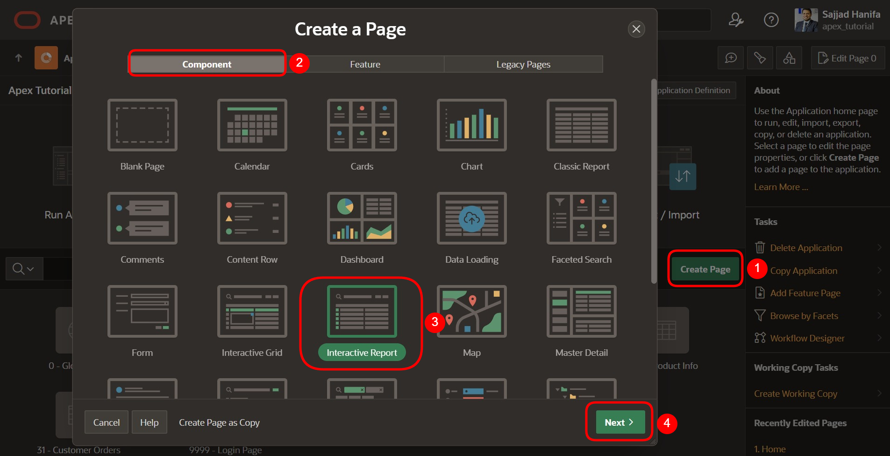

- Geben Sie als **Page Number** ***32*** ein und als **Page Name** ***Customer Orders for Mobile***.
- Wählen Sie als **Data Source** ***Local Database*** aus sowie als **Table / View Name** die von Ihnen erstellte View ***TUTO_P0032_VW***. 
- Deaktivieren Sie im Bereich Navigation die *Breadcrumb* und klicken Sie auf **Create Page**.

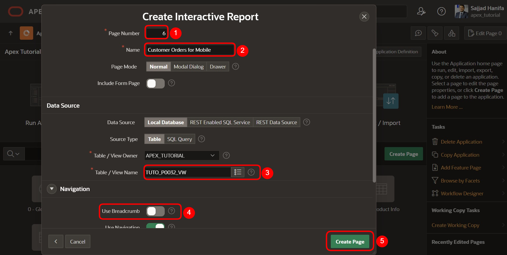

- Im Page Designer wählen Sie anschließend auf der linken Seite Ihren Report ***Customer Orders for Mobile*** aus. Auf der rechten Seite können Sie den **Type** ändern. Wählen Sie zunächst die Einstellung ***Reflow Report*** aus und klicken auf den Button **Run**.


Die dargestellte Tabelle ist „responsive“, das heißt die Darstellung der Tabellenspalten passt sich automatisch der Bildschirmgröße des Endgeräts an.


Wenn Sie das Browserfenster zusammenschieben, verkleinert sich auch der Anzeigebereich der Webseite. Ab einer Breite des Anzeigebildschirms von ≤ 560 Pixeln werden die Tabellenspalten nicht mehr nebeneinander, sondern untereinander dargestellt. 

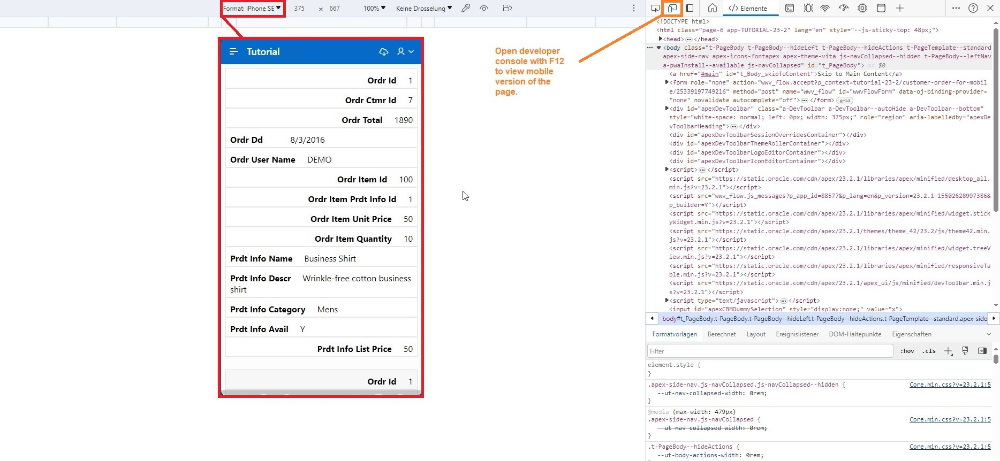

- Wechseln Sie zurück in den Page Designer und wählen Sie als **Type** jetzt ***Column Toggle Report*** aus und klicken Sie auf **Run**.

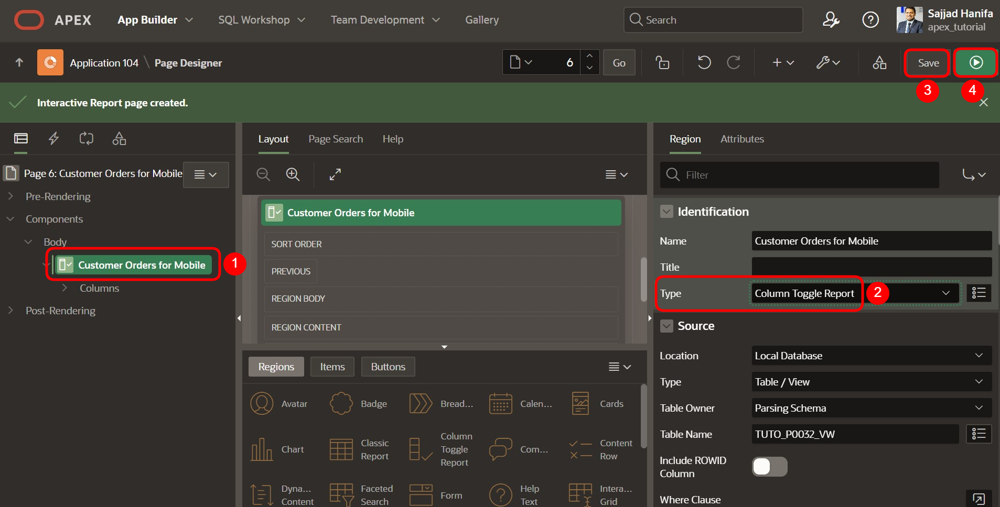

- In diesem Fall können Sie einstellen, welche Tabellenspalten angezeigt werden sollen. Klicken Sie dazu auf den Button **Columns** und wählen Sie die gewünschten Spalten aus.

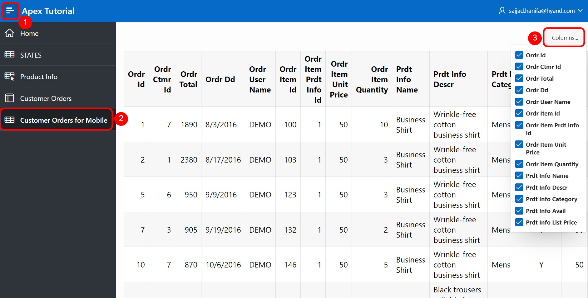

Es handelt sich hierbei um eine temporäre personalisierte Einstellung der Tabellenspalten. Andere Nutzer sind von dieser Einstellung nicht betroffen. Die Einstellung bleibt über ein neu laden der Webseite ***nicht*** gespeichert.
 

## <a name="progressive-web-apps"></a>7.2 Progressive Web Apps
Durch das Auswählen des Features „Install Progressive Web App“ beim Erstellen der Anwendung, kann diese nun als Desktopanwendung installiert werden.

Progressive Webanwendungen sind schnellere Apps, da sie einen speziellen Browsercache nutzen, um Ressourcen effizienter zu speichern, wodurch Seiten schneller geladen werden.

Wenn es sich um eine progressive Web App handelt, ist in der Navigationsleiste ein neuer Eintrag **Install App** zu sehen:

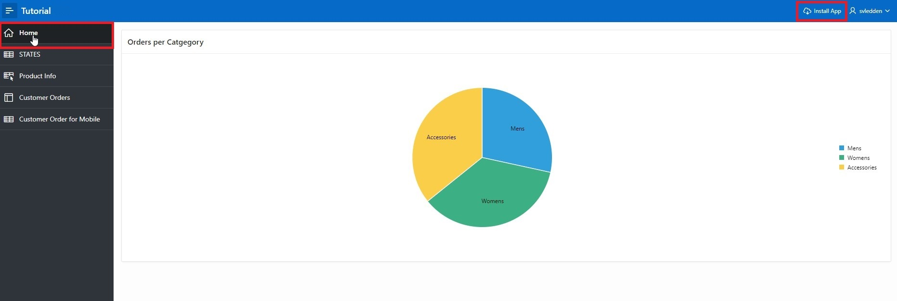

- Klicken Sie auf den Button **Install App**. Es erscheint ein Popup, indem Sie bestätigen, dass Sie die Anwendung installieren möchten.


Nachdem Installation abgeschlossen ist, öffnet sich die Anwendung in einem eigenen Fenster, unabhängig vom Browser, in dem Sie sich befinden. Unter Windows lassen sich - wie im nächsten Screenshot zu sehen - noch einige Anpassungen zur Installation vornehmen, z.B. eine Verknüpfung zur App auf dem Desktop.


Die Anwendung kann nun auch über das Startmenü gefunden und gestartet werden.

Es können auch bestehende Anwendungen, die ab der APEX Version 21.2 erstellt wurden, in progressive Web Apps umgewandelt bzw. als solche genutzt werden. Hierzu müssen die folgenden Einstellungen angepasst werden:

- Öffnen Sie die Seitenübersicht Ihrer Anwendung und klicken Sie auf **Edit Application Definition**.

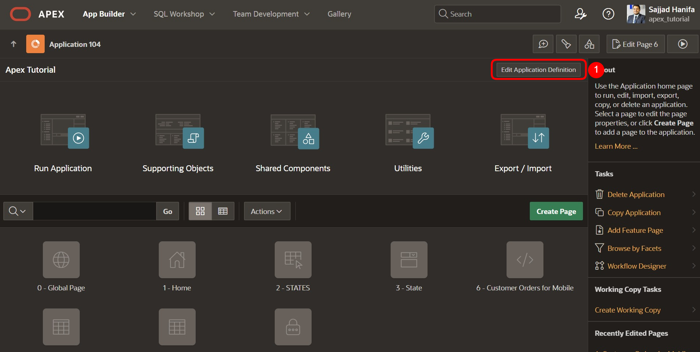

- Hier klicken Sie auf **Progressive Web App** und aktivieren die Option **Installable**. 


Es öffnet sich ein Bereich mit weitern Einstellungen, die zum Anpassen des User Interface der Progressive Web App genutzt werden können.


## <a name="persistent-authentication"></a>7.3 Persistent Authentication
Für Progressive Web Apps gibt es seit Version 23.1 von APEX eine neue Authentifizierungsmethode namens „Persistent Authentication“.

Im Gegensatz zu normalen APEX Anwendungen, erscheint hier auf dem Login Bildschirm eine „**Remember me**“-Checkbox, diese ist nicht zu verwechseln mit „**Remember Username**“.


Wenn die Option „**Remember me**“ aktiviert ist, merkt APEX sich die Logindaten für einen gewissen Zeitraum (30 Tage). In dieser Zeit kann der Nutzer die gewünschte Seite aufrufen, ohne sich erneut anmelden zu müssen. Wenn eine Session abgelaufen ist, wird automatisch eine neue Session bereitgestellt.


# <a name="cards-region"></a>8. Cards Region

Cards sind eine beliebte Form im Webdesign, um Informationen übersichtlich und anschaulich darzustellen. Die Cards in APEX lassen sich vielfältig gestalten. So kann man einer Card Icons hinzufügen, Bilder oder Videos in dieser anzeigen oder Aktionen für die Card definieren (z.B. über Links oder Buttons). 

In diesem Kapitel erstellen wir eine Seite, die auf einer Cards Region aufbaut. Im ersten Schritt erstellen wir eine Default Cards Region, im zweiten Kapitel bearbeiten wir diese so, dass ein Bild in der Karte angezeigt wird.  

## <a name="cards-view-erstellen"></a>8.1	View erstellen

Für die Bearbeitung dieser Aufgabe wird eine **View** benötigt.  
**View Name: *TUTO_P0041_VW***
**Query**:

```sql
select prdt_info_id as product_id,
       prdt_info_name as product_name,
       prdt_info_descr as product_description,
       prdt_info_category as category,
       prdt_info_product_image as product_image,
       prdt_info_list_price as list_price 
from product_info
 ```

## <a name="cards-seite-erstellen"></a>8.2	Seite erstellen

- Öffnen Sie den **App Builder** über die Navigationsleiste, wählen Sie Ihre Anwendung aus und klicken Sie auf den Button **Create Page**.  
- Wählen Sie den Seitentypen **Report** aus.  
- Wählen Sie den Bereichstypen **Cards** aus.  


- Geben Sie als **Page Number *41*** und als **Page Name *Products*** ein. Klicken Sie anschließend auf den Button **Next**.  
- Wählen Sie die unter dem Punkt **Table/View Name** die zuvor erstellte View (TUTO_P0041_VW) aus.  
- Deaktivieren Sie im Bereich **Navigation** die *Breadcrumb* und klicken Sie auf **Next**.  

 

- Anschließend geben Sie die Attribute Ihrer Card an. Als Format zur Anordnung nehmen Sie **Grid**. Das sorgt dafür, dass die Karten in einem gleichmäßigen Raster angeordnet werden.   

Nun müssen Sie noch angeben, welche Daten, wo in der Card angezeigt werden. Eine Card besteht zwingend aus einem Titelbereich. Außerdem kann man ihr einen Body, ein Icon und ein Badge hinzufügen.  
- Geben Sie folgendes ein:   

  |  |  |
  |--|--|
  |**Title Column** | PRDT_INFO_NAME |
  |**Body Column** | PRDT_INFO_DESCR |
  |**Icon Initials Column** | PRDT_INFO_CATEGORY |
  |**Badge Column** | PRDT_INFO_LIST_PRICE |
  |  |  |  

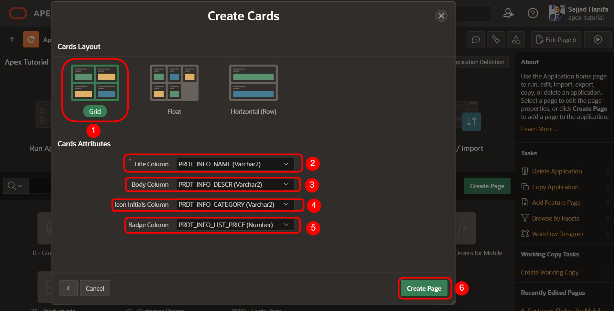  

- Klicken Sie auf **Run** und rufen Sie Ihre neu erstellte Seite auf.  

 

Sie sehen, dass die Produkte nun in Form von Cards dargestellt werden. Der Title der Card ist der Produktname, im Body wird das Produkt kurz beschrieben. Die Initialen zeigen die Kategorie des Produkts an (z.B. AC für Accessoires) und in der Badge sehen Sie den Preis des Produkts.  

Oben auf der Seite befindet sich eine Select List zur Auswahl, wie die Cards sortiert werden sollen. Um die angezeigten Namen der Sortierfelder anzupassen, wechseln Sie auf die Seite im Page Designer und navigieren zum Page Item **P41_ORDER_BY**. Rechts in den Eigenschaften des Page Items öffnen Sie die **Static Values** im Punkt **List of Values**. 

 

Hier können SIe die angezeigten Sortierkriterien unter Display Value anpassen. Tragen Sie hier die folgenden Werte aus der linken Spalte ein und bestätigen mit **OK**.

  |  |  |
  |--|--|
  |Product Name | **PRDT_INFO_NAME** |
  |Product Description | **PRDT_INFO_DESCR** |
  |Product List Price | **PRDT_INFO_LIST_PRICE** |
    |  |  | 

 

- Mit einem Klick auf **Run** können Sie sich die Veränderung auf der Seite anschauen.

 
 
## <a name="cards-mit-bild-erstellen"></a>8.3	Cards mit Bild erstellen

In diesem Schritt werden Sie das Aussehen der Cards ändern und die Titelbilder der Filme anzeigen.  
- Klicken Sie hierfür auf **Attributes** und scrollen Sie dann nach unten zu **Media**.  

- Wählen Sie als **Source *BLOB Column*** und dann unter **BLOB_Column *PRDT_INFO_PRODUCT_IMAGE*** aus. 


- Legen Sie außerdem ***PRDT_INFO_ID*** als **Primary Key Column 1** fest.  

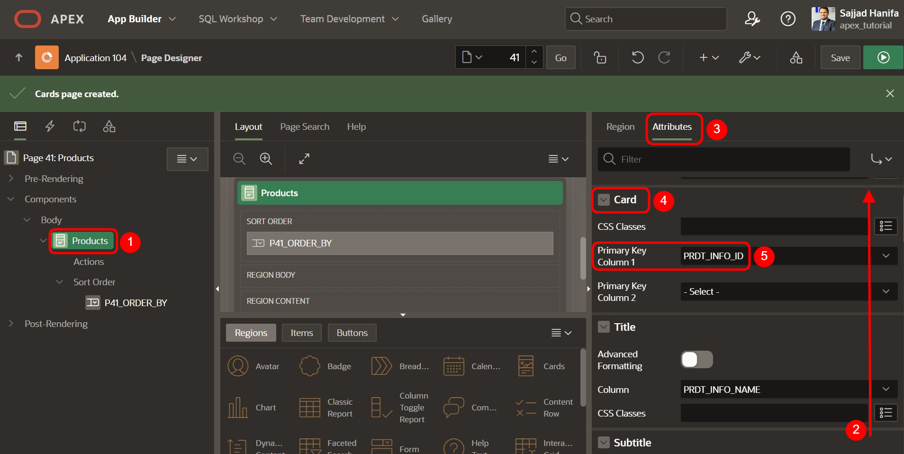

- Rufen Sie anschließend die Seite über den **Run**-Button auf.  

- In den Cards werden nun zusätzlich die Produktbilder angezeigt. 


# <a name="faceted-search"></a>9. Faceted Search

Bei der **Faceted Search** handelt es sich um eine Funktion zur dynamischen Filterung der angezeigten Datensätze und der gezielten Suche darin. Sie findet häufig Anwendung in Onlineshops und zeichnet sich meist durch eine fixierte Leiste am Seitenrand aus, in welcher sich die unterschiedlichen Filter in Form von Checkboxen, Slidern und Eingabefeldern befinden.

## <a name="fs-erstellung-der-view"></a>9.1	Erstellung der View

Für die Bearbeitung dieser Aufgabe wird eine **View** benötigt.

**View Name: *TUTO_P0051_VW***

**Query**:

 ```sql
select prdt_info_id,
       prdt_info_name,
       prdt_info_descr,
       prdt_info_category,
       prdt_info_avail,
       prdt_info_list_price 
from product_info
 ```
 
## <a name="fs-create-page"></a>9.2	Create Page

- Öffnen Sie den **App Builder** über die Navigationsleiste, wählen Sie Ihre Anwendung aus und klicken Sie auf den Button **Create Page**.
- Wählen Sie den Seitentypen **Component** aus.
- Wählen Sie den Bereichstypen **Faceted Search** aus.
 
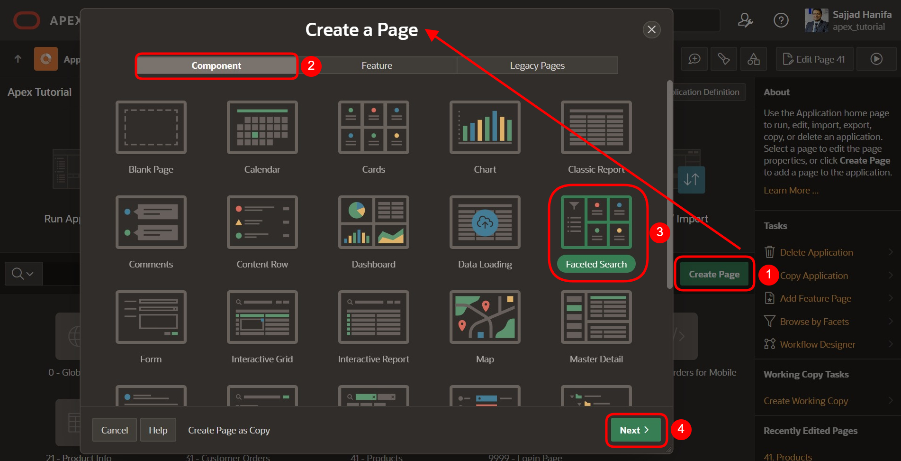 

- Geben Sie als **Page Number *51*** ein und als **Page Name *Product Search***. 
- Wählen Sie die unter dem Punkt **Table/View Name** die zuvor erstellte View (TUTO_P0051_VW) aus.
- Deaktivieren Sie im Bereich **Navigation** die *Breadcrumb* und klicken Sie auf **Next**.

 
  
- Deaktivieren Sie im letzten Schritt alle Facets und klicken Sie auf den Button **Create Page**.

 

- Rufen Sie anschließend die Seite über den **Run**-Button auf. 

Die Daten werden im rechten Seitenbereich als **Classic Report** dargestellt. Links davon befindet sich die Such- bzw. Filterleiste, in der sich bislang nur ein Suchfeld befindet, mit dem nach bestimmten Daten gesucht werden kann. Im Folgenden sollen dort weitere Optionen in Form von Facets hinzugefügt werden.

 

## <a name="fs-create-facets"></a>9.3	Create Facets

- Wechseln Sie zurück in den **Page Designer** und erstellen Sie ein neues **Facet**, indem Sie einen Rechtsklick auf den Eintrag **Facets** machen und anschließend **Create Facet** auswählen. 

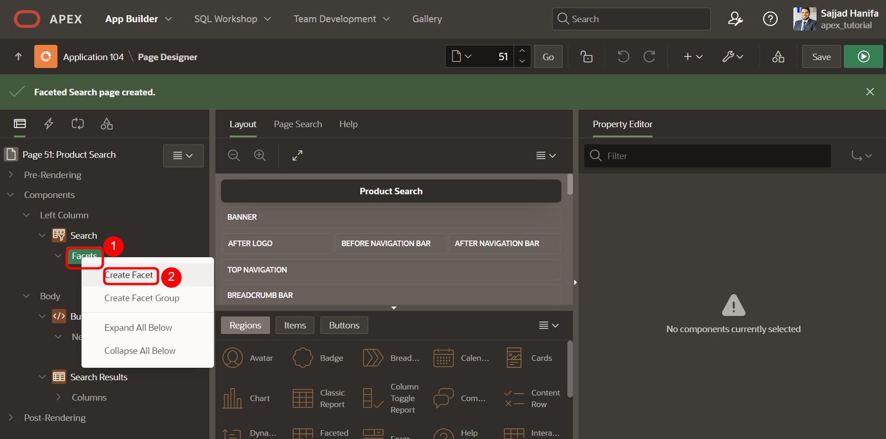 

- Wählen Sie das Item aus und ändern Sie die folgenden Felder wie angegeben ab:

| | |  
|--|--|
| **Identification**|  |
| Name | *P51_CATEGORY* |
| Type| *Checkbox Group*| 
| **Label** | *Category*| 
| **List of Values**|  |
| Type | *SQL Query* |
| SQL Query | select distinct prdt_info_category as d, <br> prdt_info_category as r <br> from TUTO_P0051_VW| 
| | |

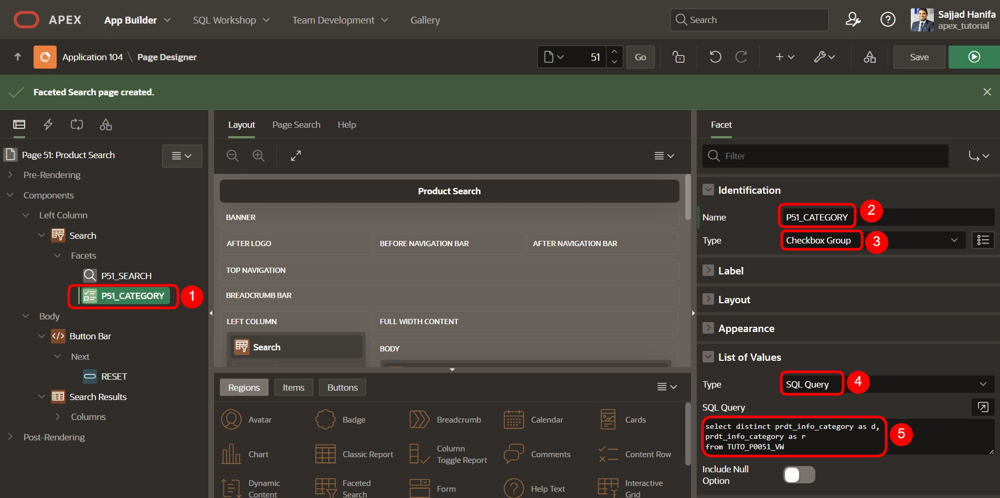 

Scrollen Sie weiter bis zum Abschnitt **Source**. Ändern Sie die Database Column auf **PRDT_INFO_CATEGORY**.

 

- Starten Sie die **Seite**, indem Sie auf den **Run**-Button klicken.

In der Faceted Search Region befindet sich jetzt ein neues Element mit drei Checkboxen. Durch diese können die angezeigten Daten rechts anhand der Werte in der Spalte *Category* dynamisch gefiltert werden.

 

- Wechseln Sie wieder in den **Page Designer**, um ein neues **Facet** zu erstellen. Dieses modifizieren Sie nach den folgenden Vorgaben:

  | | |  
  |--|--|
  | **Identification** |  |
  | Name | *P51_LIST_PRICE* |
  | Type | *Range* | 
  | **Label** | *List Price*| 
  | **Settings** |  |
  | Select Multiple | *Enabled* |
  | Manual Entry | *Enabled* | 
  | **List of Values** |  |
  | Type | *Static Values* | 
  | | |

 

- Zur Eingabe der **List of Values** – Werte klicken Sie auf die Schaltfläche neben **Static Values**. Daraufhin öffnet sich folgendes Fenster, in dem Sie die angegebenen Werte eintragen:
 
 

- Setzen Sie unter **Source** die **Database Column** auf **PRDT_INFO_LIST_PRICE** und den **Data Type** für die Spalte **LIST_PRICE** auf ****NUMBER****.  

- Speichern Sie und rufen Sie erneut die Seite auf. 

 

Das neu erstellte Facet enthält wie auch das *Category-Facet* diverse Checkboxen, um die angezeigten Daten zu filtern. Darunter befinden sich zwei Eingabefelder, in die manuell Werte als Ober- und Untergrenze eingetragen werden können.

 
 

# <a name="smart-filters"></a>10. Smart Filters
Die **Smart Filters** bieten die Möglichkeit, Daten mithilfe von Filtervorschlägen oder Suchbegriffen leicht einzugrenzen. Diese werden als Chips unter der Suchleiste oder als Vorschläge während des Tippens angezeigt.
## <a name="sf-erstellung-der-view"></a>10.1 Erstellung der View
Für die Bearbeitung dieser Aufgabe wird eine **View** benötigt. 
**View Name: TUTO_P0091_VW**
Query:
 ```sql
select prdt_info_id,
       prdt_info_name,
       prdt_info_descr,
       prdt_info_category,
       prdt_info_avail,
       prdt_info_list_price
from product_info
```

## <a name="sf-create-page"></a>10.2 Create Page
- Öffnen Sie den **App Builder** über die Navigationsleiste, wählen Sie Ihre Anwendung aus und klicken Sie auf den Button **Create Page**.  
- Wählen Sie den Seitentypen **Component** aus.  
- Wählen Sie den Bereichstypen **Smart Filters** aus.  
 
  

- Geben Sie als **Page Number 91** ein und als **Page Name Product Filter**. 
- Wählen Sie die unter dem Punkt **Table/View Name** die zuvor erstellte View (TUTO_P0091_VW) aus.  
- Deaktivieren Sie im Bereich **Navigation** die *Breadcrumb* und klicken Sie auf **Next**.  
  
  

- Deaktivieren Sie im letzten Schritt alle Filter und klicken Sie auf den Button **Create Page**.  
 
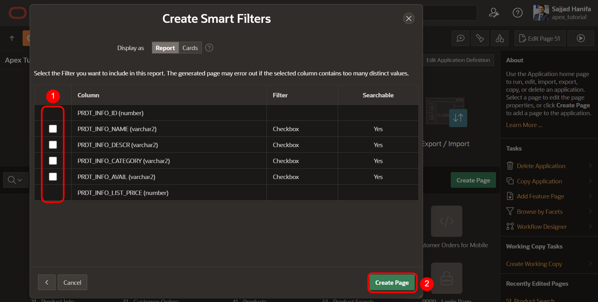  

- Rufen Sie anschließend die Seite über den **Run**-Button auf.  
Die Daten werden als **Classic Report** dargestellt. Darüber befindet sich eine Suchleiste, unter welcher die Filter als Chips angezeigt werden, die im Folgenden hinzugefügt werden.  

  
 
## <a name="sf-create-filters"></a>10.3 Create Filters
- Wechseln Sie zurück in den **Page Designer** und erstellen Sie einen neuen Filter, indem Sie einen Rechtsklick auf den Eintrag **Filters** machen und anschließend **Create Filter** auswählen.  

  

- Wählen Sie das Item aus und ändern Sie die folgenden Felder wie angegeben ab:  

  | | |  
  |--|--|
  | **Identification** |  |
  | Name | *P91_PRDT_INFO_NAME* |
  | Type | *Checkbox Group* |  
  | **Label**| *Product Name* |
  | **List of Values** |  |
  | Type | *Distinct Values* |
  | | |  

- Starten Sie die Seite, indem Sie auf den Run Button klicken.  

  

Beim Klicken in die Suchleiste, erscheint der Filter *Product Name*. Wenn Sie auf den Filter klicken, werden alle Filteroptionen basierend auf den Werten der Spalte angezeigt. Klicken Sie auf den angezeigten Vorschlag, wird dieser als Filter in die Suchleiste übernommen.  

- Wechseln Sie wieder in den **Page Designer**, um einen weiteren Filter zu erstellen. Diesen modifizieren Sie nach den folgenden Vorgaben:  

  | | |  
  |--|--|
  | **Identification** |
  | Name | *P91_CATEGORY* |
  | Type | *Checkbox Group*|  
  | **Label**| *Category* |
  | **List of Values** |  |
  | Type | *Distinct Values* |
  | | |  

  

- Speichern Sie und rufen Sie erneut die Seite auf.  
Die erstellten Filter für *Product Name* und *Category* werden nun beim Klick in die Suchleiste angezeigt.  

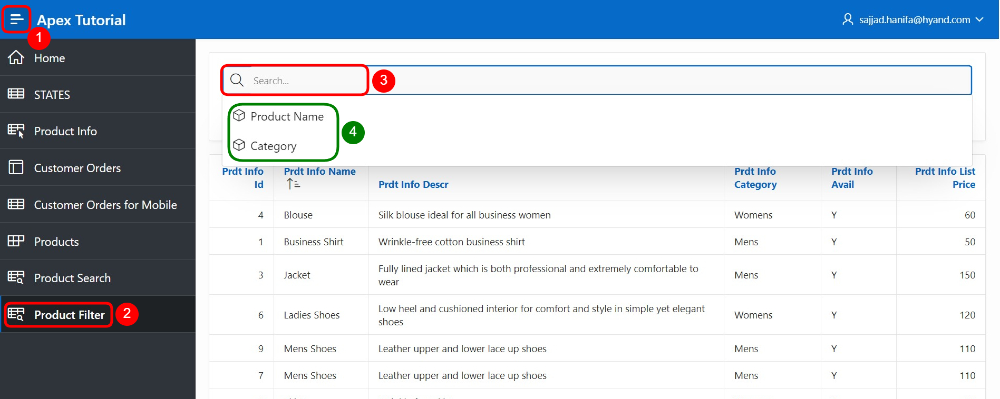  


# <a name="optische-anpassungen"></a> 11. Optische Anpassungen
Unterschiedliche Anwendungsfälle bringen unterschiedliche Anforderungen an das User Interface einer Anwendung mit. Im Standard ist das Interface von APEX eher schlicht gehalten, es lässt sich jedoch durch Kombination von Einstellungen der Komponenten und eigenem CSS-Code umfangreich anpassen.

CSS-Code ermöglicht es Entwicklern, die gestalterischen Attribute von Seiten, Regionen und Items über den Standard hinaus anzupassen. CSS besteht aus einer Liste von Regeln, die dem Web-Browser beschreiben, wie bestimmte Elemente einer Webseite dargestellt werden sollen. Damit nicht für jedes Element eine eigene Liste an Regeln definiert werden muss, können identische Elemente in Klassen zusammengefasst werden.  

## <a name="dark-mode"></a>11.1 Dark-Mode
Sowohl für die Entwicklungsumgebung als auch für die fertige Anwendung lässt sich ein Dark-Mode aktivieren. Für letztere wird dieser in den Theme-Einstellungen der Anwendung festgelegt.
- Öffnen Sie zunächst Ihre **Anwendung** aus dem APP Builder. Klicken Sie in der Leiste am unteren Bildschirmrand auf **Customize** und dann auf **Theme Roller**. Sollte die untere Leiste versteckt sein, bewegen Sie den Mauszeiger an den unteren Rand des Browsers. Über die Leiste können Sie das Theme ändern sowie weitere CSS-Anpassungen durchführen.  

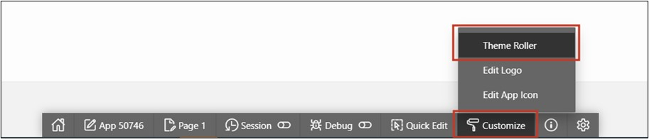 

- Wählen Sie unter **Style** das Theme **Vita – Dark** und setzen Sie es als aktuelles Theme, indem sie auf den **Save** Button klicken.  

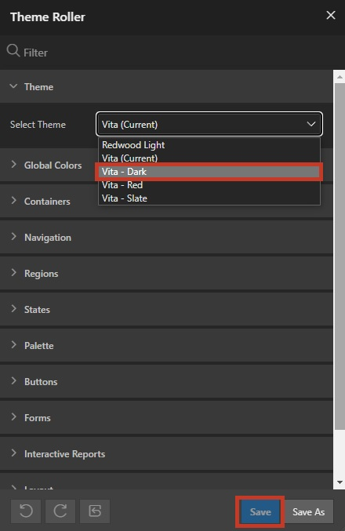 

Ihre erstellte Anwendung sollte nun wie folgt aussehen:  

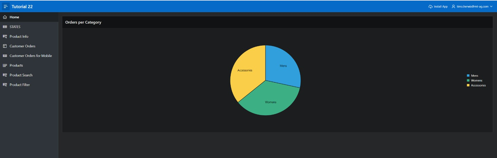 
 
## <a name="anpassung-des-login-screens"></a>11.2 Anpassung des Login-Screens
Nach diesem Kapitel hat Ihr Login-Screen ein Hintergrundbild und sieht somit ansprechender aus.
- Öffnen Sie zunächst den **App Builder** und klicken Sie anschließend auf die von Ihnen erstellte **Anwendung**. 
- Klicken Sie auf die **Seite 9999 - *Login Page***. 

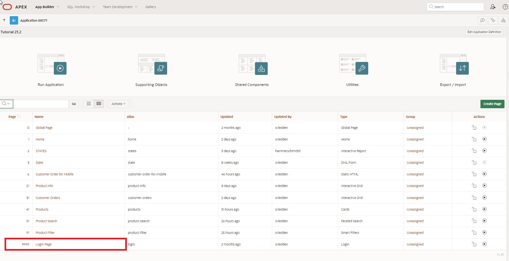 

Ein Template enthält alle Elemente, die Benutzer zum Erstellen eine Seite benötigen, inklusive von Beispielen zu den Elementen, damit Entwickler sehen können, wie die einzelnen Elemente zu verwenden sind. Immer wenn eine neue Seite in APEX angelegt wird, muss für diese ein Template ausgewählt werden. Entwickler haben die Möglichkeit, vorhandene Templates zu bearbeiten oder neue anzulegen.  
- Wählen Sie die **Region TUTORIAL23.2** aus. Ändern Sie dort den **Namen** zu ***Log In***. 

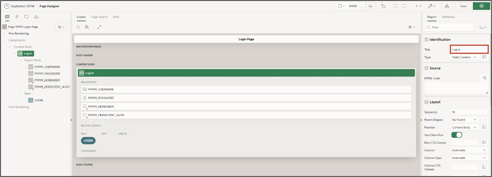 

- Wählen Sie das **Item *P9999_USERNAME*** aus. Löschen Sie den Wert des Feldes **Label** und ändern Sie den Wert für **Icon** zu **fa-user**.  
- Wählen Sie das **Item *P9999_PASSWORD*** aus. Löschen Sie dort den Wert des Feldes **Label** und ändern Sie den Wert für **Icon** zu **fa-lock-password**.
- Abschließend speichern Sie die Seite.

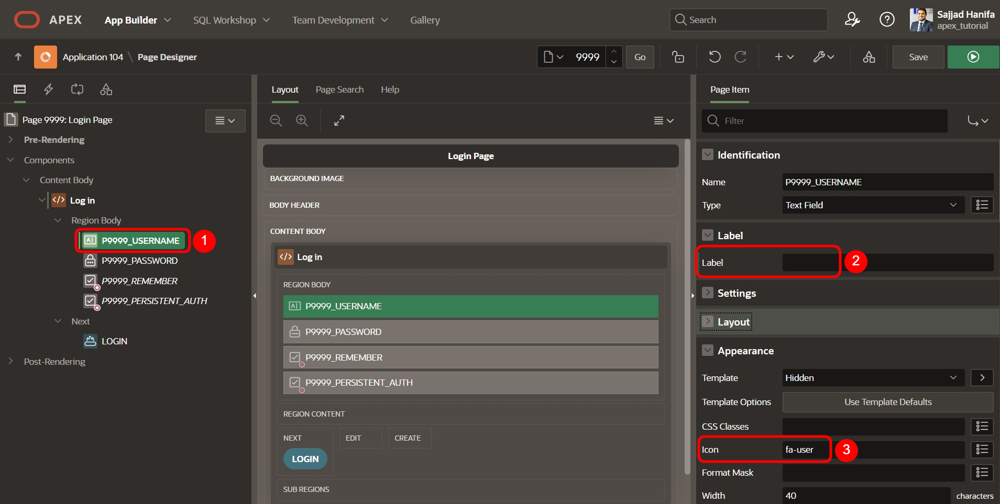 

- Das Application Icon kann in den ***Shared Components*** geändert werden. 

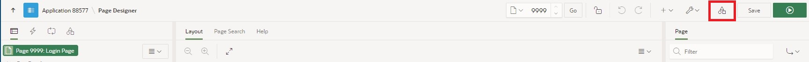 

- Klicken Sie unter **User Interface** auf den Eintrag ***User Interfaces Attributes***.

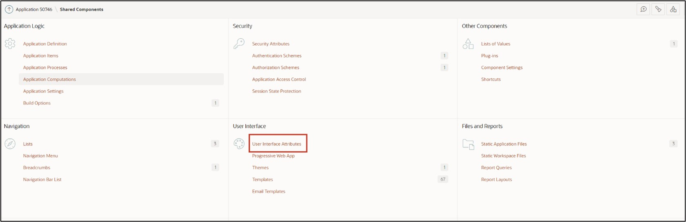  

- Klicken Sie hier auf ***Change Icon***.

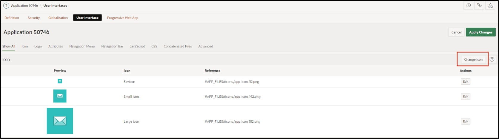 

- Hier können Sie ein eigenes Logo hochladen oder eins von den vorhanden auswählen. Ebenfalls können Sie hier die Farbe des Logos bestimme. Wählen Sie beispielsweise das ***APEX Icon in blau*** und klicken anschließend ***Save Icon***.  

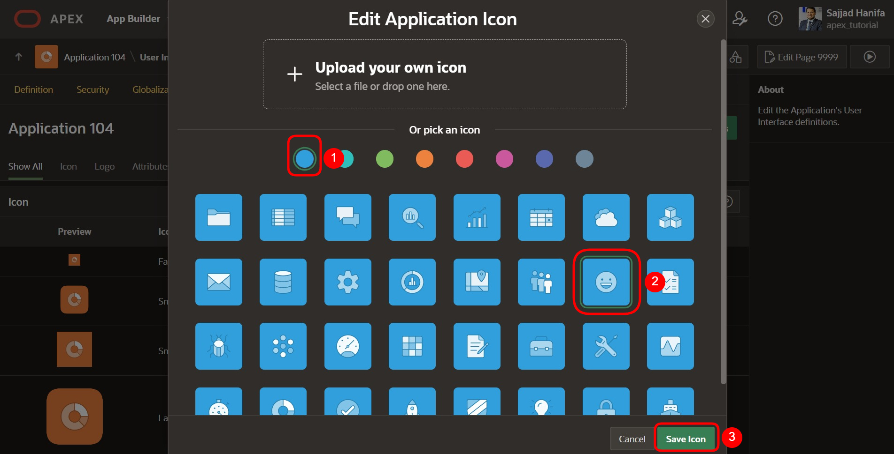  

Sie können nun die getätigten Veränderungen auf Ihrer Seite sehen. Die Region wird mit einem anderen Template dargestellt und die Felder Username und Password werden mit einem Icon und einem Platzhalter dargestellt. 

Außerdem wird über dem Titel der Region ein Icon angezeigt, das die Identifikation der Anwendung unterstützen kann. 

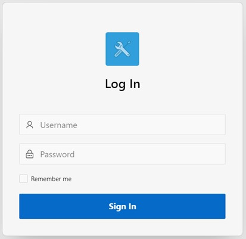  

- Das Hintergrundbild für die Login Seite muss als nächstes in der Anwendung hochgeladen werden. Klicken sie hierzu wieder auf ***Shared Components***.  
- Klicken Sie dann unter **Files** auf den Eintrag ***Static Application Files***.

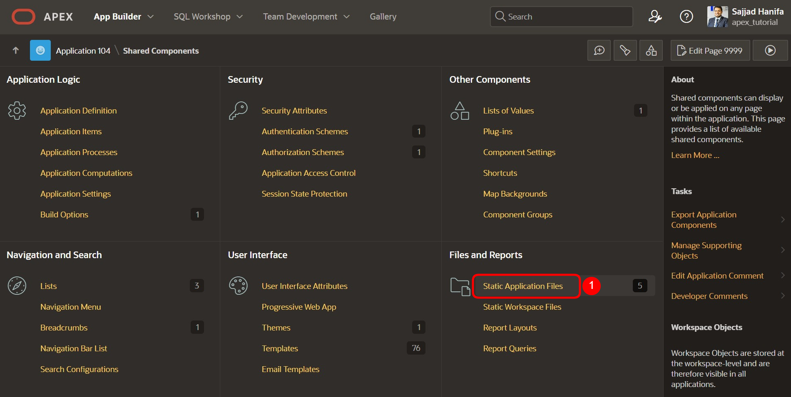  

Unter den Static Application Files können Sie Ihre eigenen Dateien hochladen und verwalten. Dies bietet sich besonders bei Bildern, CSS- und JavaScript-Dateien an. Dateien unter Static Application Files werden bei Anwendungsexporten mit exportiert. 
- Klicken Sie auf den Button **Create File**. 

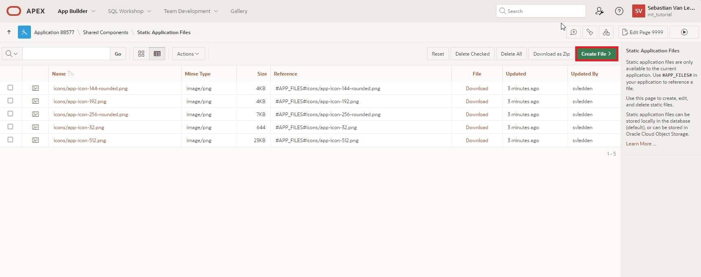

- **Directory** stellt in Textform den Ordnerpfad zu Ihrer Datei dar. Geben Sie hier ***img*** ein, damit Ihre Datei in den **Ordner *img*** geladen wird. Laden Sie die Datei background.jpg in dem Feld **Content** hoch. Klicken Sie anschließend auf **Create**.  

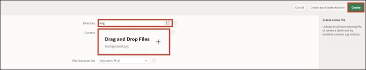  

- Ihre hochgeladene Datei wird nun angezeigt. 
Klicken Sie anschließend auf den **Edit Page 9999** Button in der **Breadcrumb Leiste**, um direkt in den Page Designer zur Login Page zu kommen. 

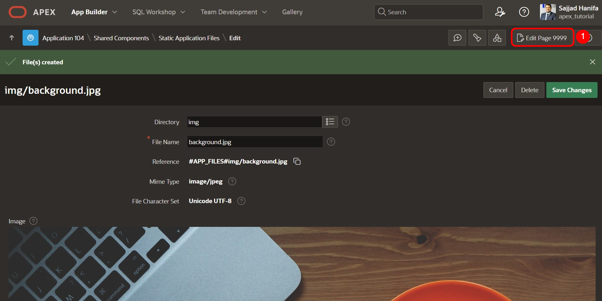

- Ihre hochgeladene Datei wird nun angezeigt. 
Klicken Sie anschließend auf den **Edit Page 9999** Button in der **Breadcrumb Leiste**, um direkt in den Page Designer zur Login Page zu kommen. 
- Fügen Sie als nächstes eine **Static Content Region** zur Position **Background Image** hinzu und nennen diese Image.

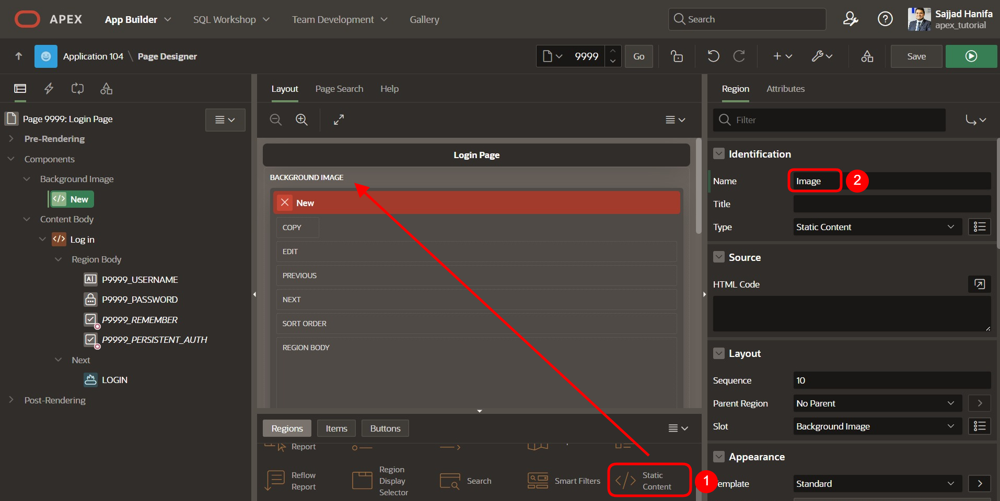

- Ändern Sie das **Template** der Region zu **Image**. Zuletzt muss noch die **File URL** vom zuvor hochgeladen Image angegeben werden. Geben Sie hier bitte **#APP_FILES#img/background.jpg** ein.

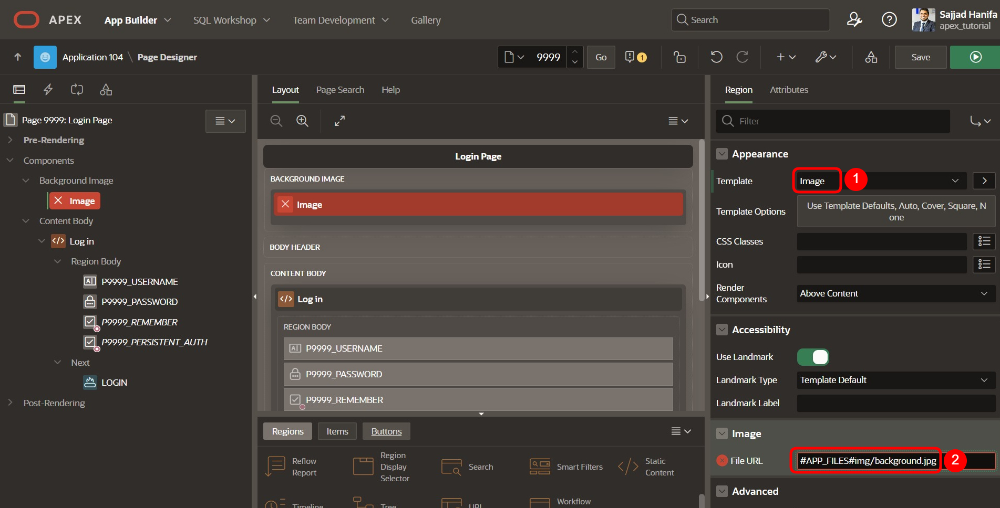

- Im Folgenden wird zusätzlicher **CSS-Code** verwendet, um die **Region *Log In*** transparent darzustellen. Klicken Sie links auf den Eintrag **Page 9999: Login Page** und wählen Sie rechts bei den Seiteneigenschaften unter **CSS** das Feld **Inline**.

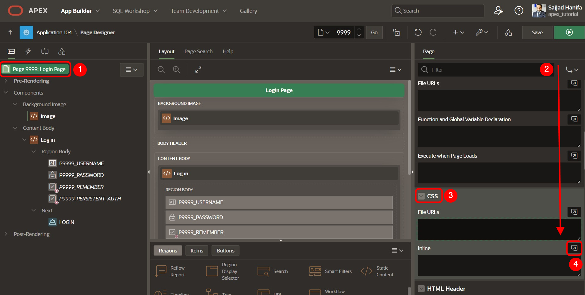

- Klicken Sie auf das **Icon** rechts über dem Feld, um den Code Editor zu starten. Geben Sie dort die folgenden CSS-Vorgaben ein:
 ```css
.t-Login-region {
    opacity: 0.9;
}
 ```  

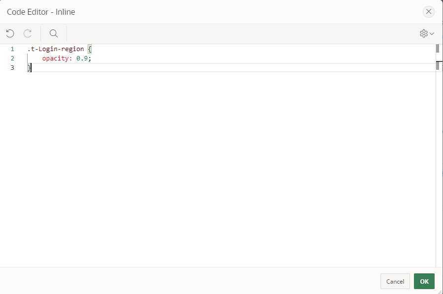  

- Klicken Sie auf den Button **Save and Run Page**, um sich die überarbeitete Seite anzuschauen. 
Sie sehen nun die von Ihnen getätigten Änderungen. 

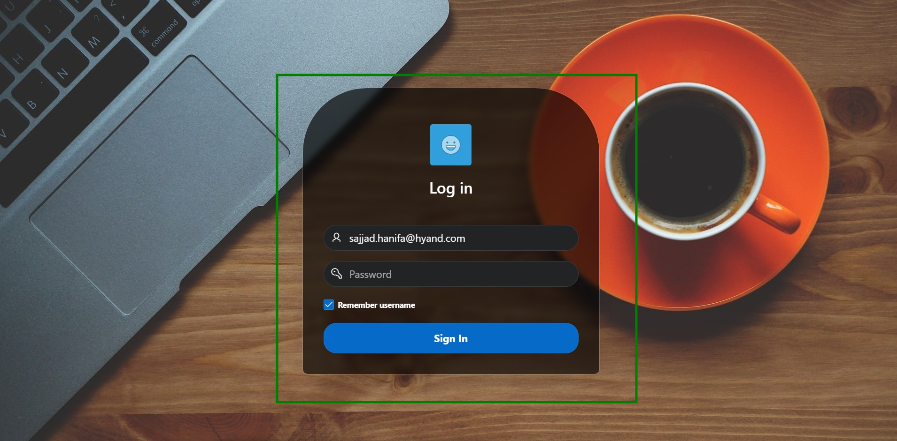 


# <a name="plug-ins"></a>12. Plug-Ins

## <a name="pi-einleitung"></a>12.1 Einleitung

Plug-Ins sind Erweiterungen und ermöglichen es, APEX um benutzerdefinierte Elementtypen, Regionstypen, Prozesse und dynamische Aktionen zu erweitern. Komponenten, die auf Plug-Ins basieren, werden ähnlich wie die Standard APEX-Komponenten erstellt und gepflegt. Mit Plug-Ins können Entwickler angepasste Komponenten erstellen, um die Funktionalität, das Erscheinungsbild und die Benutzerfreundlichkeit Ihrer Anwendungen zu verbessern.  

Plug-Ins können dabei helfen, die Anwendung benutzerfreundlicher zu gestalten und Extras hinzuzufügen. Im Rahmen dieser Aufgabe werden zwei Plug-Ins eingebaut.  
Im Folgenden werden Sie Plug-Ins in Ihre Anwendung einbinden.  

>Weitere Plug-Ins außer die hier erwähnten finden Sie z.B. auf apex.world:  
[https://apex.world/ords/f?p=100:700](https://apex.world/ords/f?p=100:700)

## <a name="pi-plug-ins"></a>12.2 Plug-Ins

Für die Bearbeitung dieser Aufgaben werden wir ein Plug-In von folgender Seite verwenden: 

[https://api.github.com/repos/Dani3lSun/apex-plugin-apextooltip/zipball](https://api.github.com/repos/Dani3lSun/apex-plugin-apextooltip/zipball)  

Dieses Plugin ermöglicht es dem Entwickler, Tooltips bei Buttons, Feldern, Regionen, Berichten und weiteren Komponenten einzubauen.  
Das Plug-In muss zunächst heruntergeladen und entpackt werden.  

### <a name="plug-in-importieren"></a>12.2.1	Plug-In importieren

- Öffnen Sie zunächst den **App Builder** und Ihre **Anwendung**. Klicken Sie anschließend auf **Shared Components**.   

- Klicken Sie unter **Other Components** auf **Plug-Ins**.  

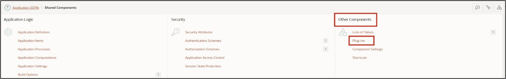 

- Klicken Sie auf **Import**.  

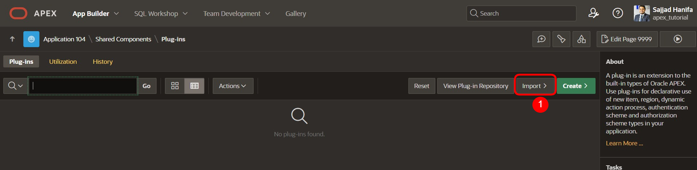 

- Laden Sie das Plug-In hoch. Es sollte in dem Ordner liegen, in welchen Sie das Plug-In entpackt haben:   
**…source\dynamic_action_plugin_de_danielh_apextooltip.sql**.

  Ziehen Sie diese Datei per **Drag and Drop** in das entsprechend Feld. Wählen Sie **Plug-in** als **File Type** und klicken Sie anschließend auf **Next**.  
  
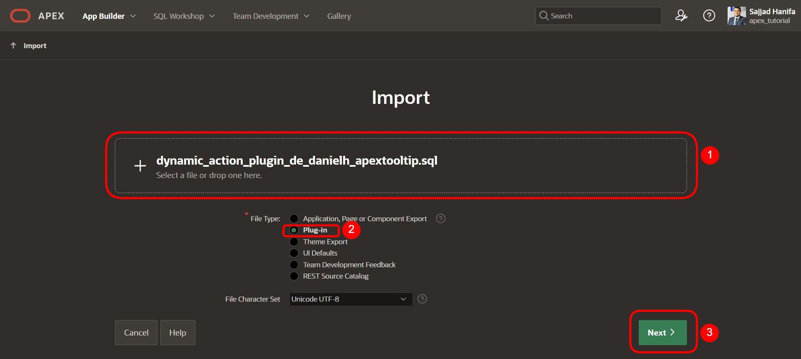  


- Klicken Sie erneut auf **Next**.  
 

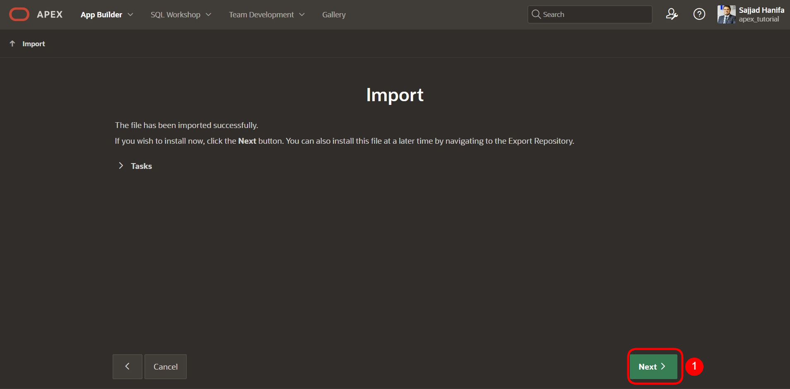


- Wählen Sie die Applikation aus, mit der Sie dieses Tutorial durchführen und klicken Sie auf **Install Plug-In**.  

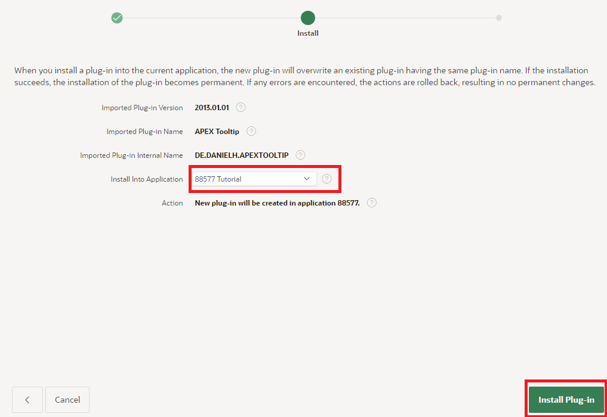

### <a name="plugin-einbinden"></a>12.2.2	Plugin einbinden

- Das Plug-In wurde nun installiert. Klicken Sie auf Ihre Applikation, um zurück zu gelangen. 

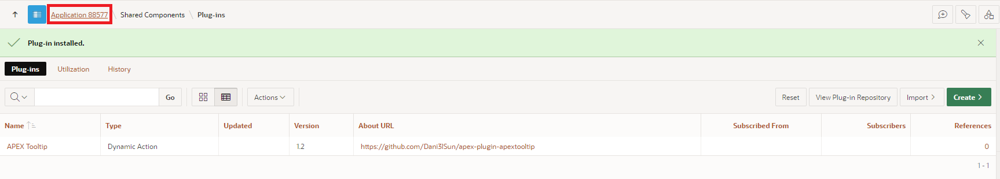  

- Wählen Sie die Seite 2 - **STATES** aus.  

- Klicken Sie auf **Dynamic Actions** (Blitz-Symbol) und klicken Sie mit der **rechten Maustaste** unter **Page Load** auf **Create Dynamic Action**.  

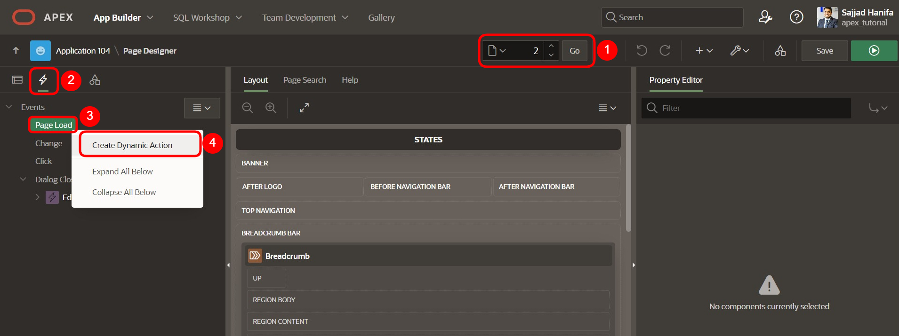

Dynamic Actions ermöglichen es Entwicklern, clientseitiges Verhalten ohne JavaScript festzulegen. Mit dem Assistenten zum Erstellen kann festgelegt werden, wann bestimmte Aktionen ausgeführt werden sollen und welche Elemente von diesen Aktionen betroffen sind.  
- Ändern Sie den Namen der Dynamic Action zu **Tooltip** und klicken Sie anschließend auf **Show**.  

- Ändern Sie nun die folgenden Felder:  
  | | |  
  |--|--|
  | **Identification** |
  | Action | APEX Tooltip [Plug-In]|  
  | **Settings** | 
  | Theme | *Light* |
  | Content Text | *Staat anlegen* |
  | **Affected Elements** |
  | Selection Type | *Button* | 
  | Button  |  *CREATE* |
  | | |

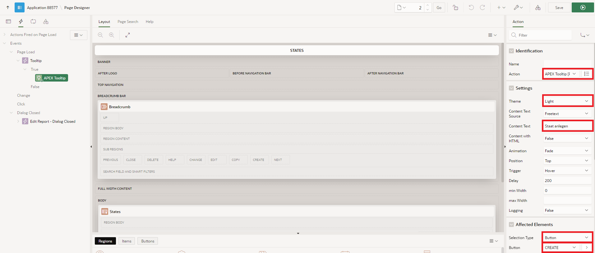

- Starten Sie nun über den **Run** Button die Anwendung.  
- Wenn Sie nun mit der Maus über den Create Button fahren (hovern), wird der Tooltip eingeblendet.  

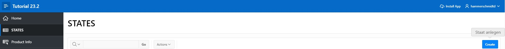

Es gibt noch viele weitere Einstellungen bzw. **Plug-In Settings**, die Sie wie oben beschrieben, beliebig verwenden können. Probieren Sie gerne einige davon aus.

### <a name="quality-assurance-plugin"></a>12.2.3	Quality Assurance Plugin 

- Gehen Sie wie in 12.2.1 beschrieben vor, um ein weiteres Plug-In zu installieren. 
Das Plug-In ermöglicht es, Entwicklungsvorgaben zu definieren und zeigt anschließend Verstöße hiergegen automatisch auf der jeweiligen Seite an.  

> Das Plug-In können Sie hier herunterladen: 
[https://github.com/mt-ag/apex-qa-plugin/archive/master.zip](https://github.com/mt-ag/apex-qa-plugin/archive/master.zip)  

- Importieren Sie das Plugin. Es sollte dann in dem Ordner liegen, in welchen Sie das Plug-In entpackt haben: 
**…src\APEX\region_type_plugin_com_mtag_olemm_qa_region.sql**

- Zusätzlich müssen für das Plug-In mithilfe eines SQL-Skriptes Datenbankobjekte erzeugt werden. Dazu klicken Sie unter **SQL Workshop** auf **SQL-Scripts**. Klicken Sie dort auf den **Upload** Button   

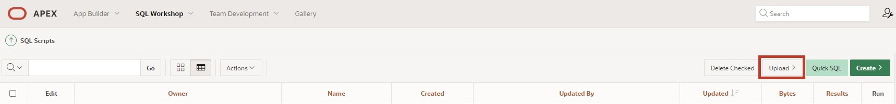

- Laden Sie die Datei **…\src\plugin_qa_install.sql** aus dem Plug-in Ordner hoch.  

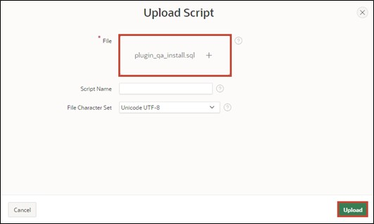  

- Mit dem **Run** Button und dem anschließendem **Run Now** kann das Skript nun ausgeführt werden.  

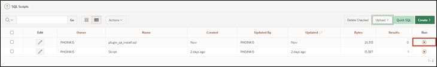  

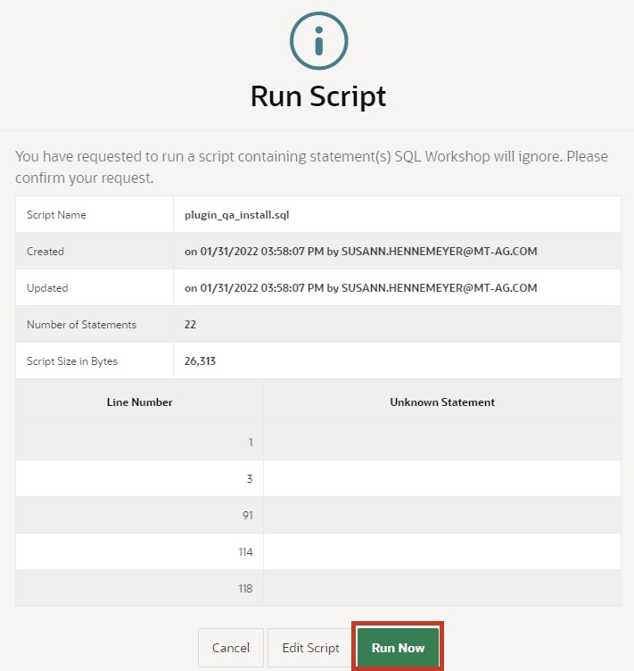  

- Über den **App Builder** können Sie nun zurück in die Anwendung navigieren und **Page 0** (Global Page – Desktop) aufrufen.  

- Legen Sie per Rechtsklick auf den Reiter **Components** mit **Create Region** eine neue Region an.

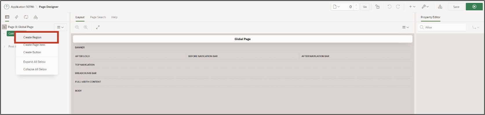  

- Ändern Sie nun die folgenden Felder und drücken Sie dann auf Save:
  | | |  
  |--|--|
  | **Identification** |
  | Title | **QA** |
  | Type | **Quality Assurance – Region [Plug-In]**|  
  | | |

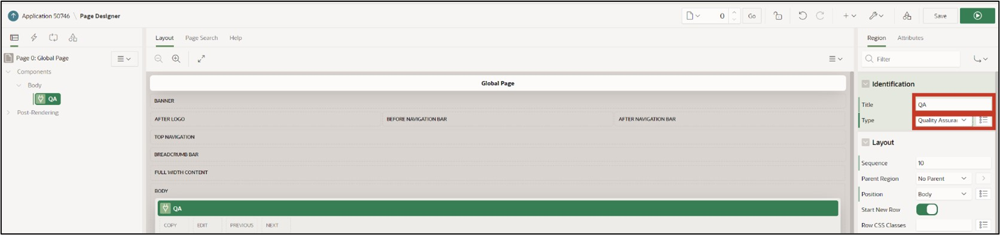

Da diese Region auf der **Global Page – 0** angelegt wurde, wird nun auf jeder Seite der Anwendung diese Region angezeigt.

Damit das Plug-In Verstöße gegen die Guidelines anzeigen kann, müssen diese definiert werden. Beim Download des **Plug-Ins** werden bereits einige Beispielregeln mitgeliefert. 
- Wie zuvor muss nun über den **SQL Workshop** ein **SQL-Skript** hochgeladen und eingespielt werden. Das Skript finden Sie unter: **…src\DML\plugin_qa_rules.sql**
 
- Wenn Sie nun in die Anwendung wechseln und eine Seite aufrufen, werden am Ende der Seite in der Region QS die Regelverstöße angezeigt.  

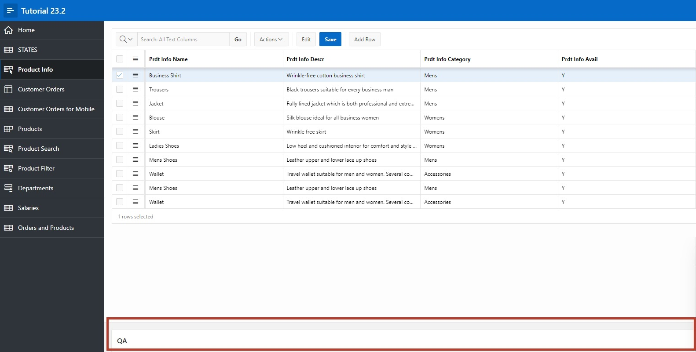  

Für eigene Projekte können Sie Ihre individuellen Regeln für dieses Plug-In definieren und so für die Einhaltung der Vorgaben sorgen.


# <a name="rest-data-sources"></a>13. REST Data Sources
Data Sources ermöglichen die Einbindung von REST-Services. Die empfangenen Daten können in APEX Komponenten wie Reports oder Forms verwendet werden. Die Daten werden dabei als JSON-Objekte zwischen der Anwendung und der REST Source transportiert. Es gibt verschiedene Operationen entsprechend der HTTP-Methoden (GET, POST, PUT, DELETE), die mit der jeweiligen Datenbankoperation (SELECT, INSERT, UPDATE, DELETE) verknüpft werden können.

## <a name="restful-service-erstellen"></a>13.1 RESTful Service erstellen
In dieser Aufgabe erstellen Sie einen eigenen RESTful Service. Diesen können Sie aus dem Internet aufrufen sowie in anderen Diensten nutzen. 
- Um den RestFul Service zu erstellen, klicken Sie auf den **SQL Workshop** und dann auf **RESTful Services**. 

- Beim erstmaligen Anlegen eines RESTFUL Services, müssen Sie zuerst Ihr Schema mit ORDS (Oracle Data Service registrieren), indem Sie auf den Button **Register Schema with ORDS** klicken. 

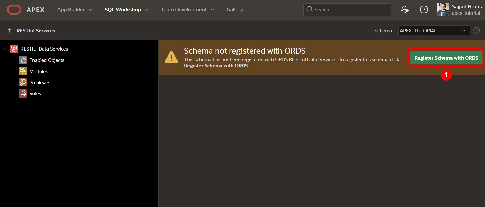

- Klicken Sie im sich öffnenden Dialog auf **Save Schema Attributes**.


Jetzt sehen Sie die folgende Übersichtsseite:


- Klicken Sie in dieser auf **Modules** und anschließend auf den **Create Module** Button. 


- Geben Sie als **Module Name *tutorial.company.example*** und als **Base Path */organisation/*** ein. Klicken Sie danach auf **Create Module**.

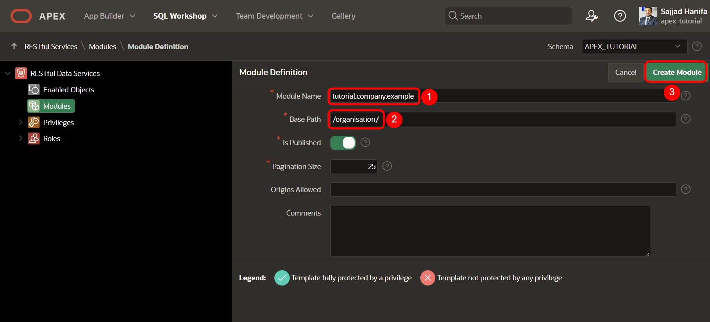

- Nachdem Ihr Module erstellt wurde, legen Sie für dieses nun ein Template an. Klicken Sie dafür auf den Button **Create Template**. 


- Geben Sie als **URI Template *departments/*** an und erstellen Sie Ihr Template, indem Sie auf **Create Template** klicken. 


- Klicken Sie nun auf **Create Handler**, um die *Resource Handler* anzulegen. In diesem Tutorial werden Sie zwei Handler (für GET und POST) anlegen.


- Im ersten Schritt werden Sie die GET-Methode anlegen. Wählen Sie hierfür als **Method** im Handler ***GET*** aus. Kontrollieren Sie, dass als **Source Type *Collection Query*** ausgewählt ist. 
- Geben Sie anschließend bei **Source** die folgende SQL-Abfrage ein: 

 ```sql
select dept_id,
	     dept_name,
       dept_location
from departments
 ```  
- Jetzt haben Sie alle, für die GET-Abfrage notwendigen Informationen eingegeben. Sie können nun den Handler durch Klicken auf **Create Handler** erstellen. 

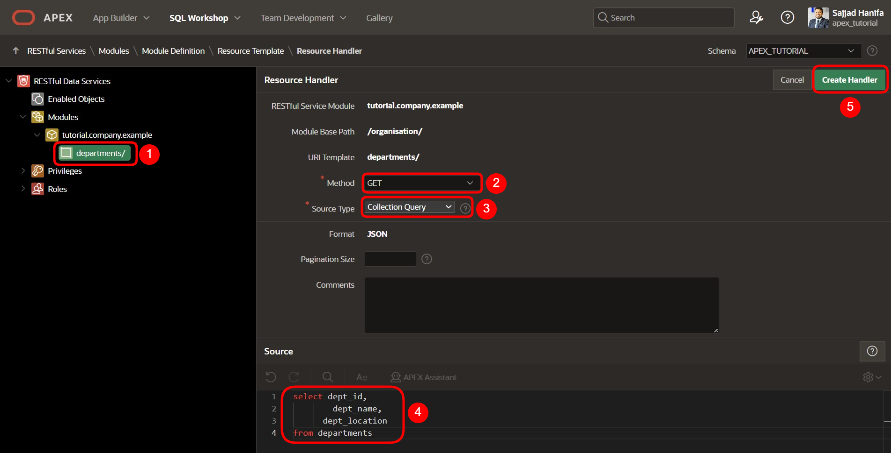

- Im nächsten Schritt legen Sie das POST-Handling an. Klicken Sie dafür auf Ihr Template **departments/** und dann auf **Create Handler**. 


 
- Wählen Sie als **Method *POST*** aus 

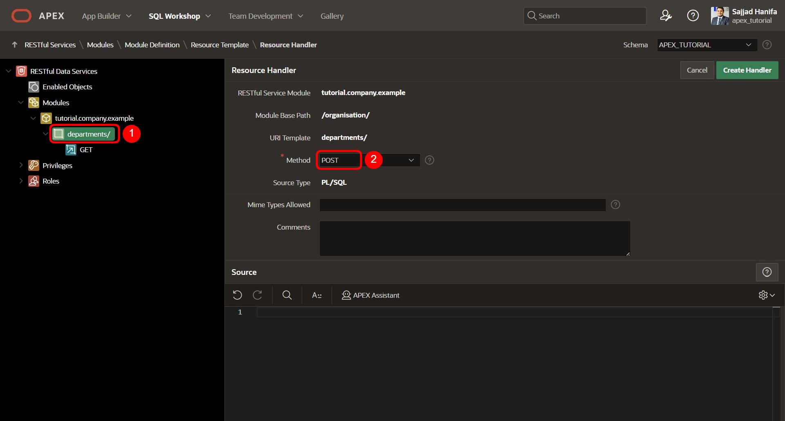

- Geben Sie unter **Source** den folgenden PL/SQL-Code ein:
 ```sql
begin
  	insert into departments (
  		dept_name,
 		dept_location)
  	values (
 		:dept_name, 
 		:dept_location);
end;
 ```


- Scrollen Sie nach unten zu **Parameters** und klicken Sie dort auf **Add Row**. 
- Geben Sie die folgenden Informationen ein: 

  |  |  |
  |--|--|
  | **Name** | dept_name |
  | **Bind Variable** | dept_name |
  | **Access Method** | IN |
  | **Source Type** | HTTP HEADER | 
  | **Data Type** | STRING | 
  |  |  |

- Fügen Sie anschließend auch für die Location einen Parameter ein, indem Sie wieder auf Add Row klicken. Geben Sie die folgenden Daten ein:  

  |  |  |
  |--|--|
  | **Name** | dept_location |
  | **Bind Variable** | dept_location |
  | **Access Method** | IN |
  | **Source Type** | HTTP HEADER | 
  | **Data Type** | STRING | 
  |  |  |

- Wenn Sie dies erledigt haben, scrollen Sie wieder nach oben und klicken dort auf **Create Handler**. 

  

- Hiermit ist Ihr Module fertig definiert. Rufen Sie zur Kontrolle die URL, die Sie unter **Full URL** bei **departments/** sehen mit Ihrem Browser auf. Sie sollten nun die Inhalte der GET-Abfrage und damit die ID, den Namen und die Location der Departments sehen.  

 ```json
"items": [
    {
      "dept_id": 15,
      "dept_name": "Accounting",
      "dept_location": "New York"
    },
    {
      "dept_id": 16,
      "dept_name": "Research",
      "dept_location": "Dalls"
    },
    {
      "dept_id": 17,
      "dept_name": "Sales",
      "dept_location": "Chicago"
    },
    {
      "dept_id": 18,
      "dept_name": "Operations",
      "dept_location": "Boston"
    }
  ]
 ```
  
## <a name="rest-data-source-erstellen"></a>13.2 REST Data Source erstellen
Nachdem Sie im vorherigen Kapitel einen eigenen RESTful Service erstellt haben, werden wir diesen in APEX als REST Data Source nutzen. Die Vorgehensweise, die im Folgenden gezeigt wird, gilt ähnlich auch für REST Datenquellen, die Sie nicht selbst erstellt haben.  
Um die **REST Data Source** anzulegen, gehen Sie in die **Shared Components** Ihrer Anwendung. 

- Die **REST Data Sources** befinden sich in den **Shared Components** unter dem Punkt **Data Sources**.  

  

- Über den **Create** Button können Sie eine neue REST Datenquelle anlegen.  

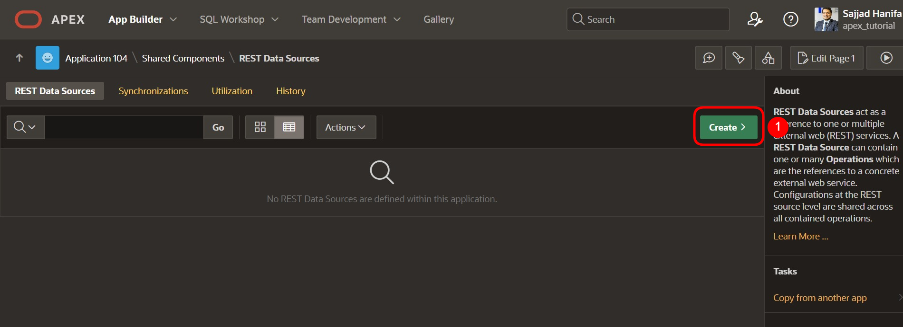
 
- Da in dieser Anwendung bisher noch keine REST Data Sources vorhanden sind, müssen Sie diese neu erstellen, wählen Sie also **From Scratch** aus. Klicken Sie auf **Next**.

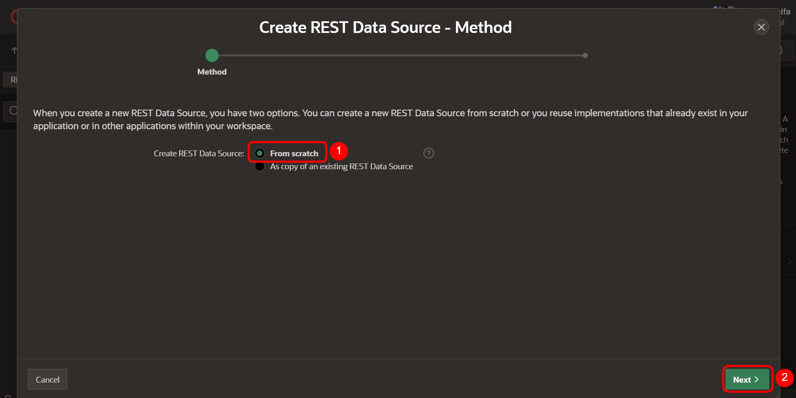 

- Wählen Sie als **REST Data Source Type *Oracle REST Data Service*** aus. 
Geben Sie der REST Data Source den **Namen *Departments***. Zudem müssen Sie den URL Endpunkt definieren. Den URL Endpunkt finden Sie in Ihrem RESTful Service-Modul.  
- Klicken Sie anschließend auf den Button **Next**.
   
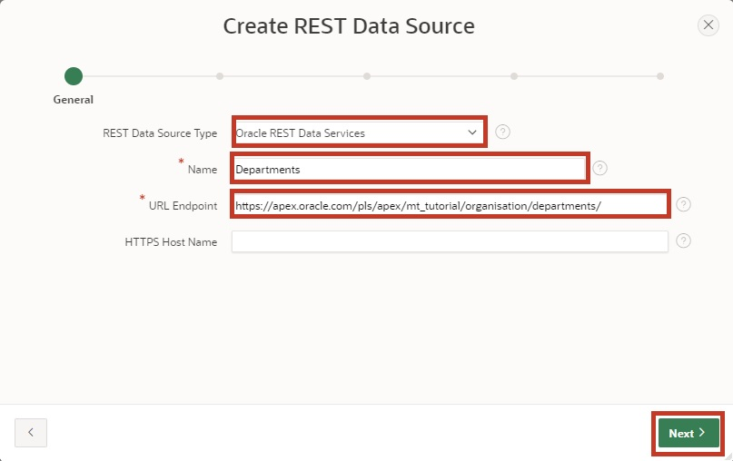
 
- Im zweiten Schritt des Assistenten müssen Sie den Service URL Path einrichten, also die Weiterleitung innerhalb der API. Hier müsste bereits automatisch der richtige Pfad voreingestellt worden sein, dementsprechend müssen Sie dort nichts ändern und nur auf **Next** klicken.
  


- Den Punkt **Authentication Required** lassen Sie ausgeschaltet, da die angelegte REST Datenquelle keine Authentication erfordert. Klicken Sie auf den **Discover** Button.
  

 
- Klicken Sie im anschließenden Fenster auf **Create REST Data Source**. 
 


- Nun sehen Sie Ihre soeben erstellte REST Datenquelle in der Übersicht. 
- Sie können sich nun Ihre Rest Source ansehen. Klicken Sie dafür auf den Link Departments. 


 
- Ihre Rest Source sollte ähnlich wie in der folgenden Abbildung aussehen:


- Kontrollieren Sie, dass Ihre Einstellungen im **Data Profile** wie im Bild gezeigt aussehen und, dass bei **Operations** die beiden Operations ***GET*** und ***POST*** angelegt wurden. 
 
## <a name="senden-von-daten-an-eine-rest-datenquelle"></a>13.3 Senden von Daten an eine REST-Datenquelle
In diesem Kapitel werden wir die zuvor erstellte REST Source nutzen, um eigene Daten senden. Konkret werden wir dabei neue Departments hinzufügen. Dafür wird die HTTP-POST-Methode verwendet, welche in der REST Data Source als Operation definiert wurde. 
- Öffnen Sie den **App Builder** und Ihre Anwendung. Klicken Sie auf **Create Page** und erstellen Sie eine neue Seite, indem Sie auf **Create Page** klicken. 

- Wählen Sie als Page Type **Form** aus. 
  


- Geben Sie als **Page Number *61*** und als **Page Name *Departments*** an.   
- Wählen Sie bei **Data Source *REST Data Source*** an und wählen Sie anschließend ***Departments*** als **REST Data Source** aus.  
- Deaktivieren Sie im Bereich **Navigation** die *Breadcrumb* und klicken Sie auf **Next**.   

  

- Wählen Sie bei der **Primary Key Column *DEPT_ID*** aus. 
- Geben Sie bei **Branch Here on Submit *61*** ein und bei **Cancel and Go to Page** ebenfalls ***61***.
- Erstellen Sie nun Ihre Seite, indem Sie auf den **Create Page** Button klicken. 


- Rufen Sie die Seite über den **Run**-Button auf. 

- Über das Form können Sie nun neue Departments hinzufügen. 

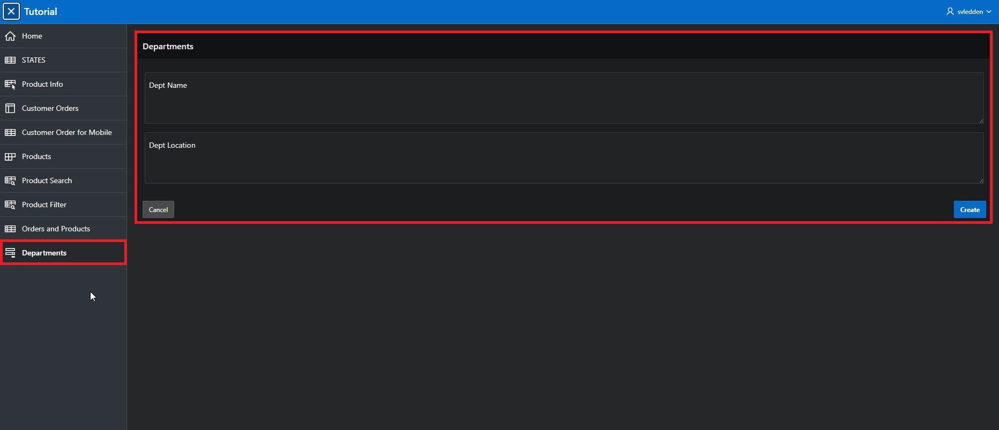

## <a name="abrufen-von-daten-aus-einer-rest-data-source"></a>13.4 Abrufen von Daten aus einer REST Data Source
Nun möchten wir die REST Data Source nicht nur zum Hinzufügen von Daten nutzen, sondern auch, um Daten abzurufen und diese anzeigen zu lassen. Dafür wird die HTTP-GET-Methode verwendet, welche in der REST Data Source als Operation definiert wurde.  
- Über das in Kapitel 13.3 erstellte Form ist es nun möglich, neue Departments anzulegen. Um direkt zu erkennen, ob das Hinzufügen erfolgreich war, werden Sie zusätzlich einen Report auf der Seite erstellen. 

- Klicken Sie im Page Designer auf der linken Seite auf Departments und machen Sie dann einen Rechtsklick auf Body. Wählen Sie hier **Create Region** aus.  

- Wählen Sie als **Type** Ihrer Region ***Classic Report*** aus und geben Sie ihr den **Title *Alle Departments***. Wählen Sie unter Source ***REST Source*** als **Location** aus und anschließend ***Departments*** als **REST Source**.  


 
- Rufen Sie die Seite über den **Run**-Button auf.  
- Der Report zeigt Ihnen jetzt alle Departments an.  
 


> Eine weitere Demo-Anwendung der MT - IT Solutions auf Basis von REST Data Sources finden Sie hier:  
[https://apex.oracle.com/pls/apex/mt_apisearch/r/datasources](https://apex.oracle.com/pls/apex/mt_apisearch/r/datasources)


# <a name="exkurs-datenmodellierung-mittels-quick-sql"></a>14. Exkurs: Datenmodellierung mittels Quick SQL

Mit Quick SQL können Datenmodelle schnell entworfen werden, indem eine **Markdown-artige Kurzschriftsyntax** verwendet wird. Hauptdetailbeziehungen können über ein **ERM** („Entity-Relationship-Modell“) dargestellt werden.  

> Weitere Informationen erhalten Sie unter [https://apex.oracle.com/en/quicksql/](https://apex.oracle.com/en/quicksql/) (Login erforderlich).

## <a name="ex-erstellung-der-datenbank-tabelle"></a>14.1 Erstellung der Datenbank-Tabelle

- Navigieren Sie auf **SQL Workshop** und klicken Sie anschließend auf **SQL Scripts**.

- Klicken Sie oben rechts auf **Quick SQL**.


 
- Auf der folgenden Seite geben Sie im linken Textbereich folgenden **Quick SQL-Code** ein:

 ```sql
SALARIES /insert 5
    SARY_ID int/pk
    SARY_EMPLOYEE_NAME vc255/values Mueller, Vogel, Schneider, Fischer, Schmidt
    SARY_DEPARTMENT vc30/check SALE DEV MAN SUP
    SARY_SALARY num/between 500 and 4000
 ```

>! Achten Sie bitte bei der Eingabe auf die oben dargestellten Einzüge!  

- Der Code wird automatisch in SQL-Code übersetzt. Im rechten Textbereich wird der erzeugte SQL-Code angezeigt. 


- Klicken Sie auf **Save SQL Script**, um den Code zu speichern. 
- Es öffnet sich ein Fenster, in dem Sie einen Namen für das Skript vergeben müssen. Benennen Sie das **Skript** als ***salaries*** und klicken Sie danach auf **Save Script**. 


- Klicken Sie anschließend auf **Review and Run**. 

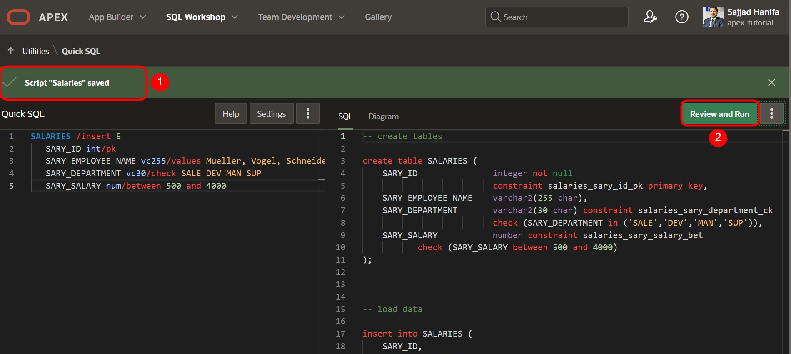

- Sie sehen eine Vorschau Ihres SQL-Codes. Starten Sie das Skript, indem Sie auf den Button **Run** klicken. 

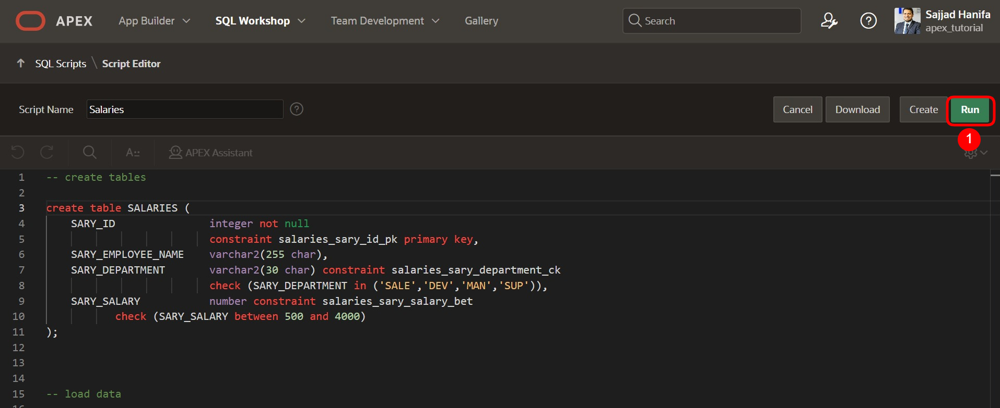

- Klicken Sie auf **Run Now**.  

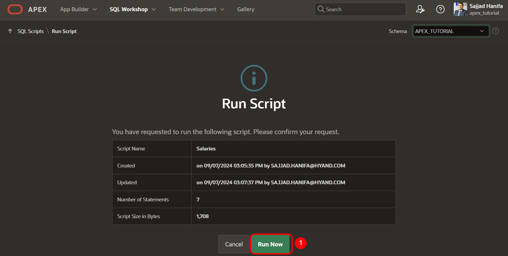 
 
- Nach dem erfolgreichen Import sollten Sie folgende Ausgabe sehen:

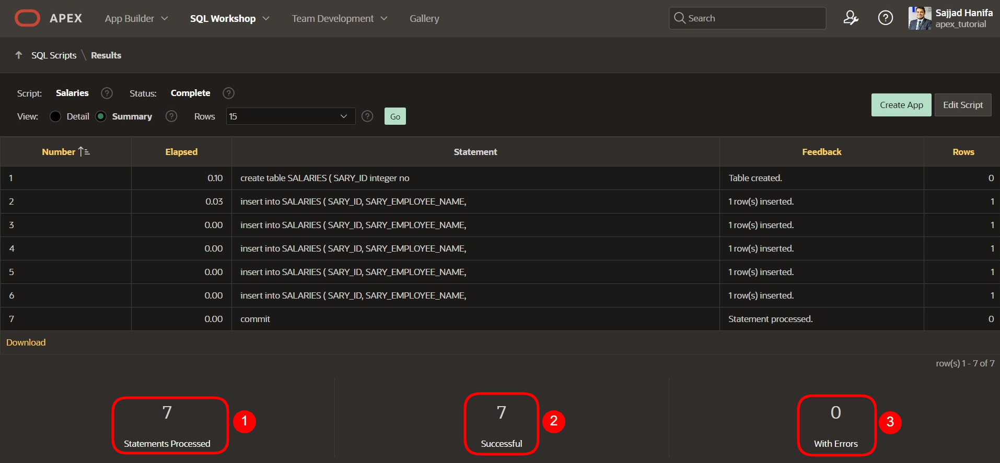
 
## <a name="ex-erstellung-eines-interactive-reports"></a>14.2 Erstellung eines Interactive Reports

Zur Visualisierung der eben erstellten Daten legen Sie in dieser Aufgabe einen Interactive Report an.
- Dazu gehen Sie wieder in den **App Builder**, dann auf Ihre **Anwendung** und anschließend klicken Sie auf **Create Page** und wählen **Interactive Report** aus.

 
 
- Im folgenden Fenster geben Sie als **Page Number *71*** und bei **Page Name *Salaries*** ein.
- Als **Table / View Name** wählen Sie ***SALARIES*** aus.
- Deaktivieren Sie im Bereich Navigation die *Breadcrumb* und klicken auf **Create Page**.

 

- Der Page Designer öffnet sich. Wenn Sie auf **Run** klicken, wird die Seite geladen und Sie sehen den Report, den Sie eben per Quick SQL angelegt haben.

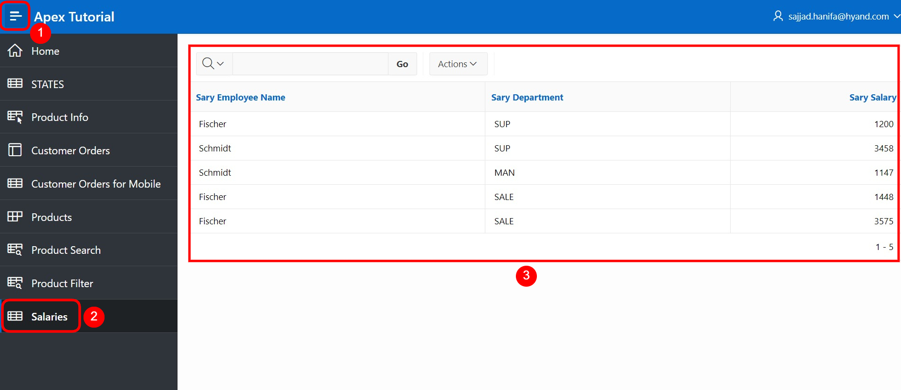

## <a name="beispieldaten-mittels-data-generator-generieren"></a>14.3 Beispieldaten mittels Data Generator generieren

Verwenden Sie das Dienstprogramm Data Generator, um **Blueprints** zu erstellen und anschließend Beispieldaten zu generieren.
- Navigieren Sie auf **SQL Workshop** und klicken Sie anschließend auf **Utilities**.
- Klicken Sie dann auf **Data Generator**.

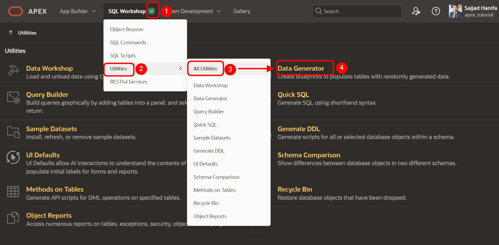

- Klicken Sie hier auf **Create Blueprint**.

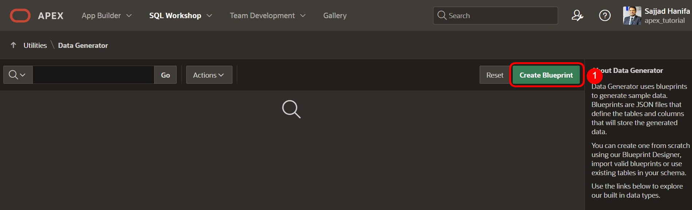

- Im nächsten Schritt wählen Sie **Use Existing** Tables, um Beispieldaten in einer bereits bestehenden Tabelle einzufügen.


- Im nächsten Schritt wählen geben Sie dem *Blueprint* den Namen **Salaries Blueprint**, und wählen die zuvor erstellte Tabelle **Salaries** aus. Abschließend klicken Sie auf **Create Blueprint**.

 

- Jetzt werden Sie automatisch zum Blueprint Designer weitergeleitet. Von hier aus können Sie definieren was für Beispieldaten generiert werden sollen.
- Wählen Sie für **SARY_EMPLOYEE_NAME** den Data Source Built-In und den **Built-In** Typen **Last Name**. Da keine null Werte eingefügt werden sollen muss noch **required** gesetzt werden. Zuletzt muss Maximum Length laut der Tabellenvorgabe mit varchar(9) auf **9** gesetzt werden.

 
 
- Wählen Sie für **SARY_SALARY** den Data Source **Built-In** und den Built-In Typen **Number** (nach number.random suchen). Als Minimum Value geben wir **500** vor und als Maximum Value **4000**. Da auch hier keine null Werte eingefügt werden sollen muss auch hier noch **required** gesetzt werden.


- Der Blueprint für die Beispieldaten wäre jetzt fertig konfiguriert. Speichern Sie diesen zunächst, indem Sie auf **Save** klicken. 

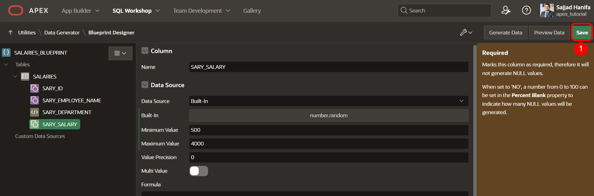

- Klicken Sie nun auf **Preview Data** um eine Vorschau der generierten Daten zu erhalten.

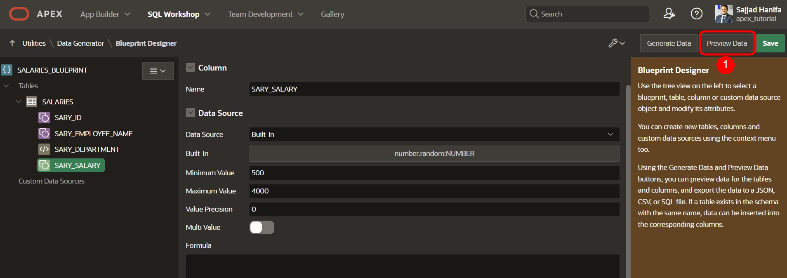

- Um die Beispieldaten final zu generieren, klicken Sie als nächstes auf **Generate Data**.


- Wählen Sie hier **Insert into Database** und die Insert Method Insert Into um die Daten direkt in die Datenbanktabelle einzufügen. Anschließend klicken Sie auf **Insert Data**.
 

 
- Um das Ergebnis des Inserts kontrollieren zu können, rufen Sie erneut die zuvor erstellte Page 71 im App-Builder auf. Wenn Sie jetzt auf **Run** klicken, wird die Seite geladen und Sie sehen den Report, mit den neu eingefügten Daten.


# <a name="karten-erstellen"></a>15. Karten erstellen 
In dieser Aufgabe werden Sie eine Anwendungsseite mit einer Weltkarte erstellen. Die nötigen Daten dafür erlangen wir über eine (in Kapitel 13.2 vorgestellte) REST Data Source.
Das Ziel ist es, alle Erdbeben auf der Erde, die in den letzten 24 Stunden stattfanden, auf einer Karte in APEX darzustellen.

## <a name="karten-rest-data-source"></a>15.1	REST Data Source 
Um später die Erdbebendaten der Karte aktuell zu halten, richten Sie nun eine REST Data Source ein. Die detaillierten Schritte dieses Unterkapitels können Sie sich mit Screenshots bei Bedarf erneut in Kapitel 13.2 anschauen, im Folgenden werden die Schritte darum nur grob beschrieben.

Zu Beginn erstellen Sie im App-Builder eine neue Anwendung und nennen diese **Earthquakes**. Sie brauchen keine weiteren Einstellungen vorzunehmen. In der Anwendungsübersicht wählen Sie dann **Shared Components** aus.

Dort angelangt klicken Sie unter der Kategorie **Data Sources** die Option **REST Data Sources** an.

Klicken Sie nun auf die **Create** Schaltfläche, im Pop-Up Fenster lassen Sie die Auswahl bei **From Scratch** und geben im nächsten Schritt als Name **EarthquakeData** ein. Unter URL Endpoint fügen Sie folgende URL ein:  [https://earthquake.usgs.gov/earthquakes/feed/v1.0/summary/all_day.geojson](https://earthquake.usgs.gov/earthquakes/feed/v1.0/summary/all_day.geojson)  

Nun klicken Sie, ohne etwas zu verändern, so lange auf weiter, bis sich das Fenster wieder schließt und die REST Data Source erstellt wurde. 

Damit die Daten jeden Tag mit einer lokalen Tabelle aktualisiert werden, werden Sie nun eine Synchronisierung einrichten. Dazu wählen Sie die gerade erstellte REST Data Source aus. Klicken Sie jetzt auf das im Bild gezeigte Feld:

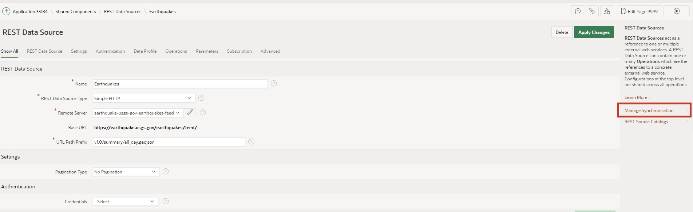

Nun ändern Sie bis auf den Namen nichts und tippen in dem Namensfeld **Table Name** den Namen **EarthquakeData** ein. Nachdem Sie zum Speichern auf **Save** geklickt haben, werden Sie auf die im Bild zu sehenden Optionen stoßen. 
Klicken Sie auf das markierte Feld: 

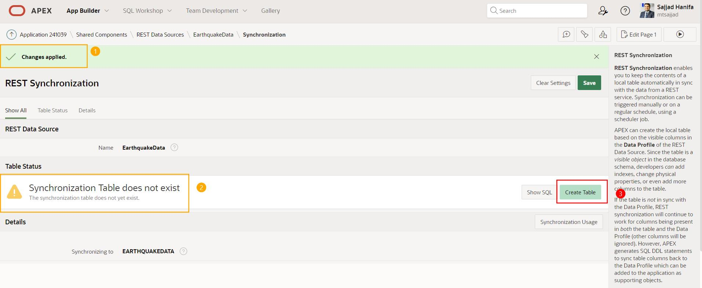

Dadurch haben Sie nun eine Tabelle erstellt, in welche die Daten, die aus der zuvor eingegebenen URL abgerufen werden, zukünftig gespeichert werden. Jetzt stellen Sie die Synchronisierungszeiten der Daten ein. Dazu klicken Sie erneut auf die im nächsten Bild markierten Felder:


Nach dem Sie auf das zweite Feld geklickt haben, öffnet sich ein Pop-Up Fenster, in welchem Sie nun die Synchronisierung konfigurieren können. Da wir die Daten jeden Tag einmal auffrischen möchten, wählen Sie nun **daily** aus. Die Felder **Execution Hour** und **Execution Minute** füllen Sie nun jeweils mit einer beliebigen Zeit auf. Nachdem Sie auf **Set Execution Interval** geklickt haben, klicken Sie noch auf das Feld **Save and Run**, wodurch nun einmal die erstellte Tabelle mit Daten gefüllt wird. Jetzt wird die Tabelle jeden Tag aktualisiert.  

Die Tabelle mitsamt der aktuellen Erdbebendaten ist nun im **Object Browser** vorzufinden.  
 
## <a name="erstellen-der-karte-auf-einer-neuen-anwendungsseite"></a>15.2	Erstellen der Karte auf einer neuen Anwendungsseite
Stellen Sie sicher, dass Sie nun auf die Anwendungsübersicht jener Anwendung navigieren, die Sie zu Beginn erstellt haben.  

- Dort wählen Sie **Create Page**.  

- Klicken Sie im geöffneten Pop-Up Fenster auf das **Map** und anschießend auf **Next**.  
  
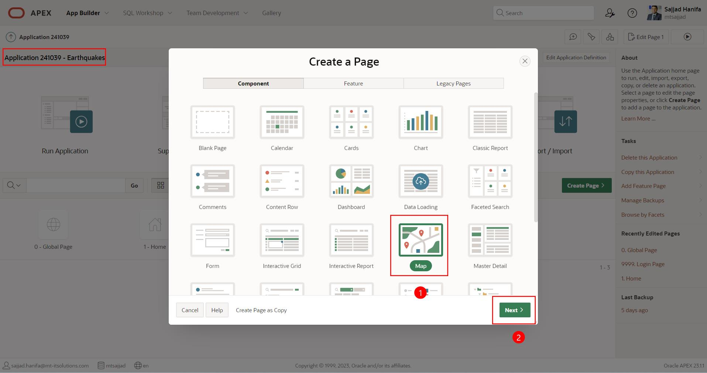  
 
- In der daraufhin gezeigten Übersicht geben Sie einen beliebigen Seitennamen ein.  
- Unter **Local Database** wählen Sie unter **Table / View Name** die eben erstellte Tabelle **EARTHQUAKEDATA** aus.  
- Deaktivieren Sie im Bereich Navigation die *Breadcrumb* und klicken auf **Next**.   

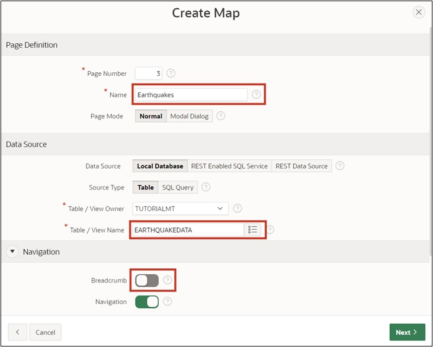  

In der nächsten Übersicht, können Sie zwischen unterschiedlichen Anzeigemöglichkeiten wählen, wie die Orte Dargestellt werden sollen.  
- Da Sie dabei sind, eine Übersicht über Erdbeben zu erstellen, wählen Sie nun nicht **Points**, wodurch nur die Orte der Erdbeben markiert werden würden, sondern wählen Sie **Heat Map**, um den Ort und ein gewissen Eindruck des Ausmaßes später auf der Karte erkennen zu können. 

- Nun müssen Sie nur noch von den dort angezeigten Auswahlmöglichkeiten das Feld **Geometry-Column** ändern. Dort wählen Sie die Spalte **Geometry** aus.  

 

Nachdem Sie auf **Create Page** geklickt haben, können Sie die Anwendung starten und auf die erstellte Seite navigieren.

Dort sehen Sie nun alle gespeicherten Erdbeben und bekommen einen Eindruck über das Ausmaß derer vermittelt.

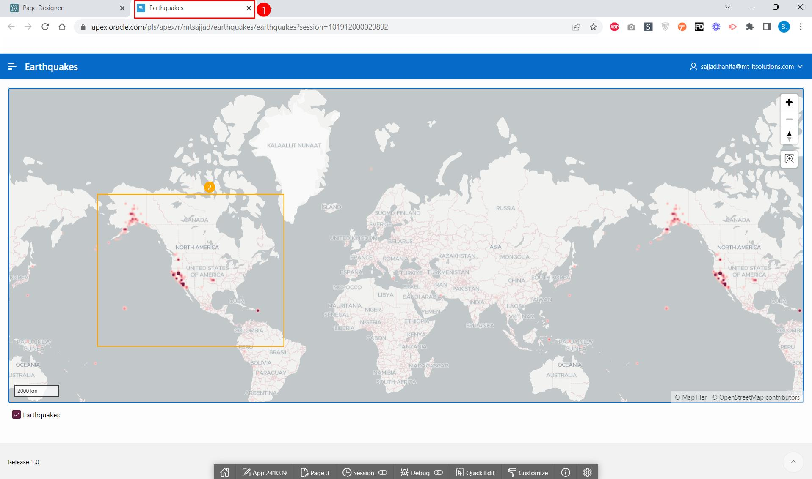


# <a name="genehmigungsprozess-erstellen"></a>16. Genehmigungsprozess erstellen

In dieser Aufgabe werden Sie eine Anwendung erstellen, die dazu dient, Gehälter von Mitarbeiter anzupassen. Die nötigen Daten dafür haben wir bereits in Kapitel 14 eingefügt.
Das Ziel ist es, dass jeder Mitarbeiter sein Gehalt entsprechend anpassen kann, wodurch ein Genehmigungsprozess startet. Anschließend muss der Vorgesetzte den Prozess bearbeiten und entweder zustimmen oder ablehnen.

## <a name="task-erstellen-einer-anwendung"></a>16.1 Erstellen einer Anwendung

- Für diese Aufgabe wird eine **Anwendung** erstellt. Öffnen Sie hierzu als erstes den **App Builder** und klicken Sie auf den Button **Create**. Der App Builder zeigt alle installierten Anwendungen an.

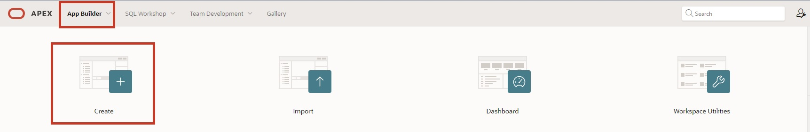

- Der Assistent zur Erstellung von Anwendungen wird gestartet. Klicken Sie auf **New Application**, um eine neue Anwendung zu erstellen.

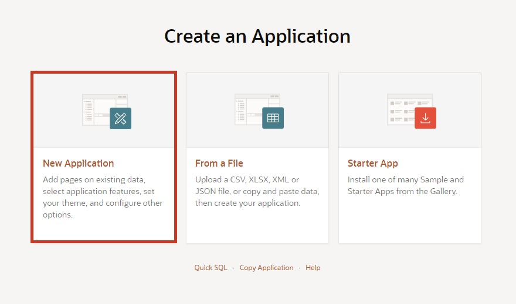 
 
- Geben Sie jetzt den Namen der Anwendung ein (z.B. Tutorial Approvals).

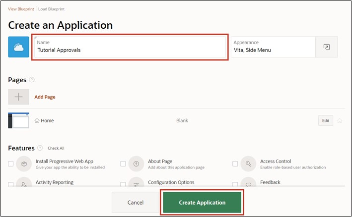 

- Sie brauchen vorerst keine weiteren Einstellungen vorzunehmen. Klicken Sie **Create Application** um die neue Anwendung zu erstellen.

## <a name="erstellen-einer-task-definition"></a>16.2 Erstellen einer Task Definition

- Klicken Sie anschließend auf **Shared Components**. 
 
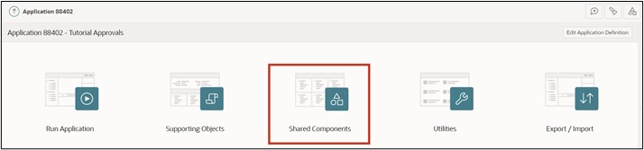 

- Klicken Sie unter **Workflows and Automations** auf **Task Definitions**.

 

- Klicken Sie unter **Workflows and Automations** auf **Task Definitions**.   
- Klicken Sie hier auf **Create**.  

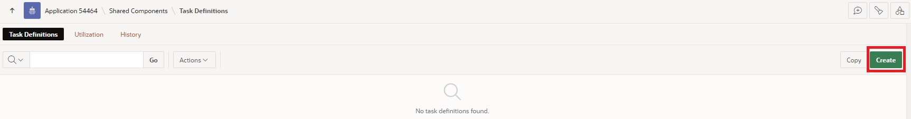  

- Geben Sie hier folgende Werte ein:  

  | | |  
  |--|--|
  | **Name** | *Salary Request* | 
  | **Subject** | *Salary Request for &EMPLOYEE_NAME. from &SALARY. to &P_NEW_SALARY.*| 
  | **Priority** | *2-High*  | 
  | | |  

- Klicken Sie anschließend auf **Create**.  

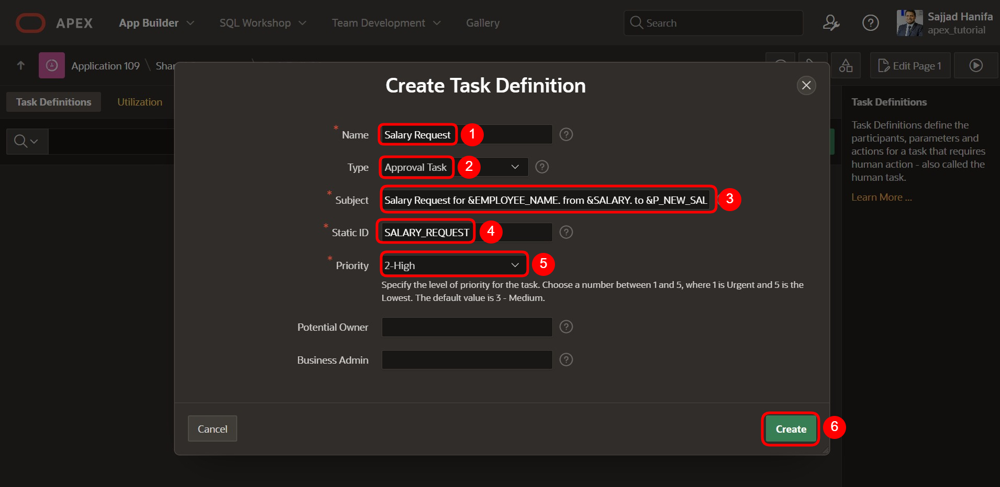

- Nachdem der Task erstellt wurde, erhalten Sie eine Übersicht. 
- Ändern Sie hier die Action Source auf **SQL Query** und geben das folgende **Action SQL Query** ein.

 ```sql
select initcap(sary_employee_name) as employee_name,
       sary_salary as salary 
  from salaries
 where sary_id = :APEX$TASK_PK
 ```  

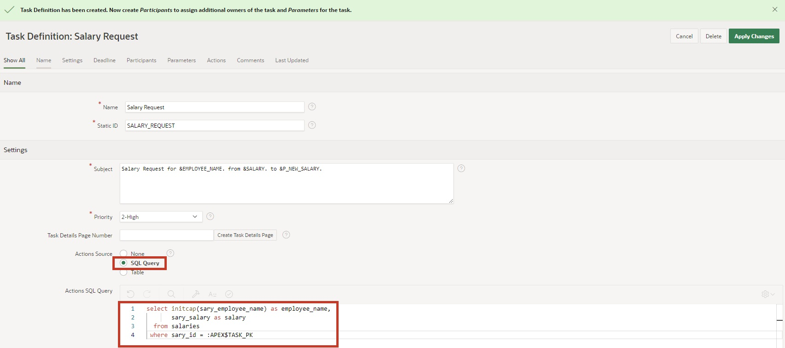 
 
- Als nächstes wird die **Task Details Page** erstellt. Klicken Sie dafür den Button **Create Task Detail Page**.  

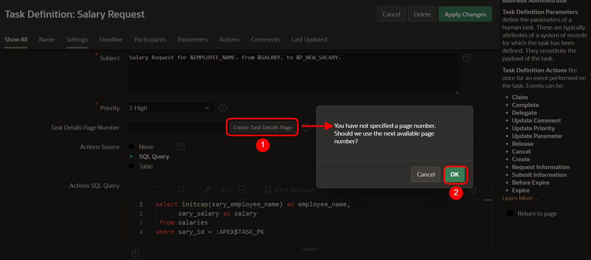  

- Der aufkommende Dialog kann mit **OK** bestätigt werden.  
- Sie gelangen jetzt wieder zur Übersicht Ihrer Tasks. Klicken Sie auf den zuvor angelegten Task **Salary Request** um im nächsten Schritt Teilnehmer hinzuzufügen.  

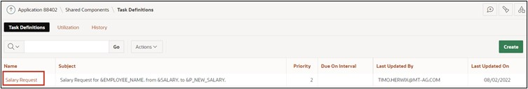  

- Im Bereich Participants wählen Sie für den **Potential Owner** den Value Type **Static** und geben den Value **SCHNEIDER** ein.  

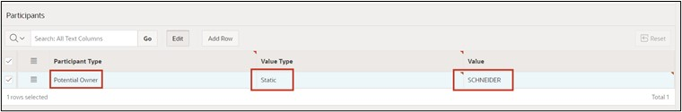  

- Als Parameter geben Sie **P_NEW_SALARY** mit dem Label **Salary Proposal** und den Data Type **String** ein.  

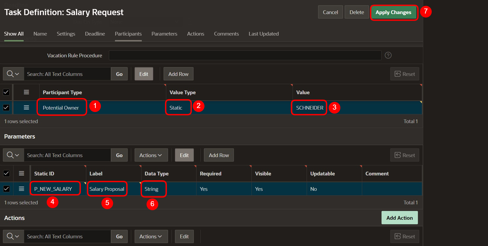 
 
- Klicken Sie jetzt **Apply Changes** um alle Eingaben zu speichern und wechseln Sie anschließend erneut in den Task um eine Action hinzuzufügen. Klicken Sie dafür im unteren Bereich auf **Add Action**.  
 
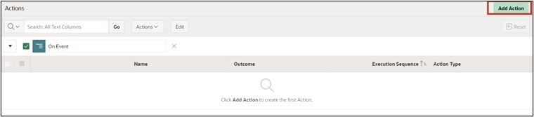  

- Ein neuer Dialog für die Action wird geöffnet.  
- Geben Sie hier folgende Eingaben ein:  

  | | |  
  |--|--|
  | **Name** | *ON_APPROVE* | 
  | **Type** | *Execute Code* | 
  | **Executoin Sequence** | *1*  | 
  | **On Event** | *Complete*  | 
  | **Outcome** | *Approved*  | 
  | **Success Message** | *Salary change approved*  | 
  | | |  


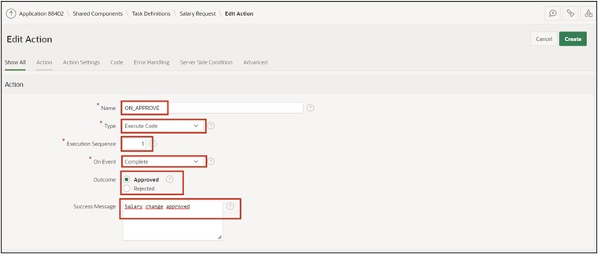  

- Zuletzt noch das folgende SQL Query eingeben.  

 ```sql
update salaries
   set sary_salary = :P_NEW_SALARY
 where sary_id = :APEX$TASK_PK;
 ```  
 
- Abschließend auf **Create** klicken.  

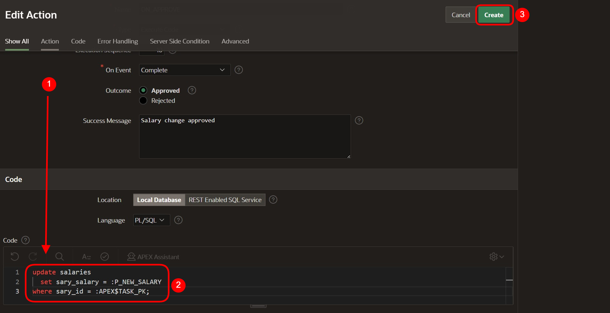  

- Der Task ist nun fertiggestellt, so dass Sie als nächstes wieder zur Anwendungsübersicht wechseln können.  
 
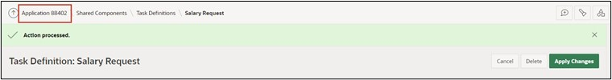  

## <a name="erstellen-der-my-approvals-und-my-request-seite"></a>16.3 Erstellen der „My Approvals“ und „My Request“ Seite

- Klicken Sie auf **Create Page** und wählen **Unified Task List** aus. Anschließend klicken Sie **Next**.  

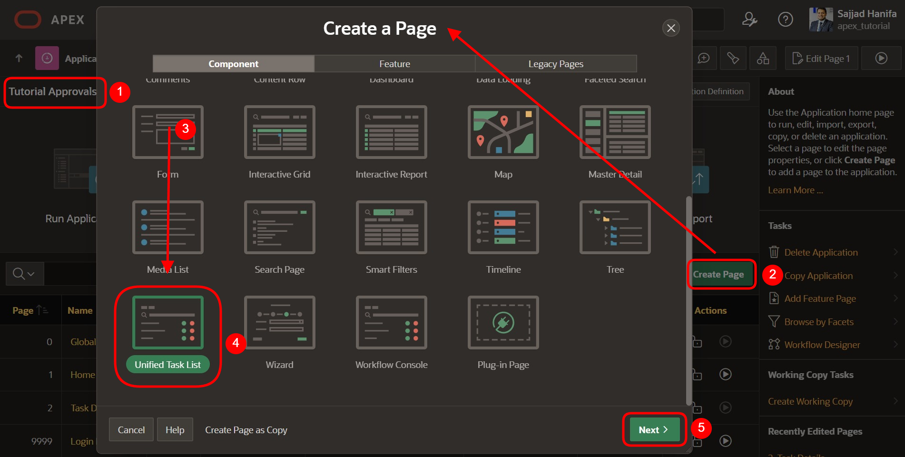  

- Geben Sie folgende Werte ein:  

|  |  |
|--|--|
| **Page Number** | 4 |
| **Page Name** | My Approvals |
| **Request Context** | My Tasks |
|  |  |  

- Klicken Sie dann auf **Create Page**.  

 

- Die Seite wird nun erstellt und angezeigt. Wechseln Sie wieder zur Seitenübersicht und klicken erneut auf **Create Page**.  

 
- Wählen Sie auch hier wieder die Component **Unified Task List** aus.  

- Geben Sie dann folgende Werte ein:  

|  |  |
|--|--|
| **Page Number** | 5 |
| **Page Name** | My Requests |
| **Request Context** | Initiated by Me |
|  |  |  

- Klicken Sie dann auf **Create Page**.  
 
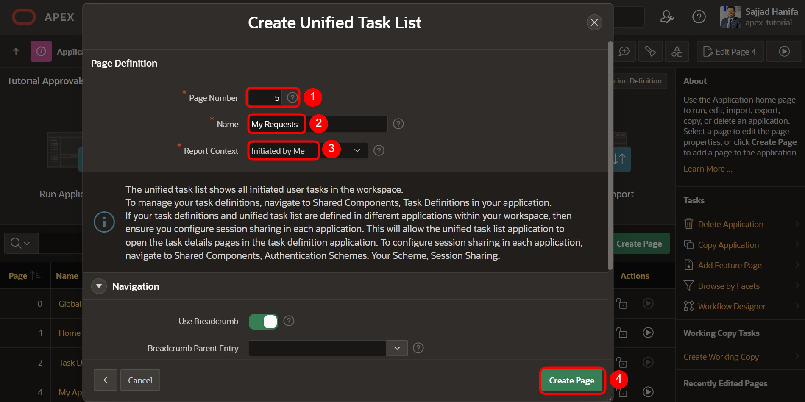  
 
## <a name="erstellen-der-salary-change-seite"></a>16.4	Erstellen der „Salary Change“ Seite

- Klicken Sie auf **Create Page** und wählen **Blank Page** aus.  
- Anschließend klicken Sie **Next**.  

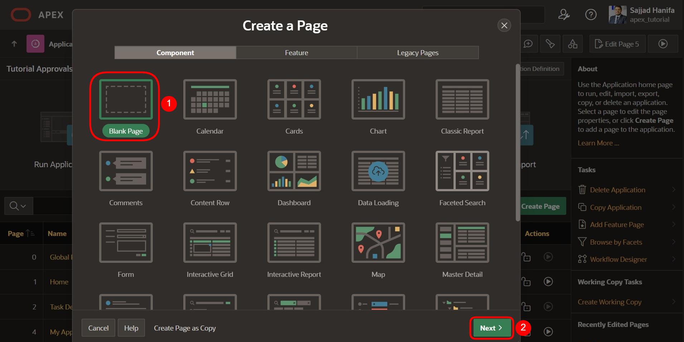

- Geben Sie die Page Number 6 ein und den Page Name **Salary Change**.   
- Deaktivieren Sie hier die *Breadcrumb* und klicken Sie anschließend auf den Button **Create Page**.  
 
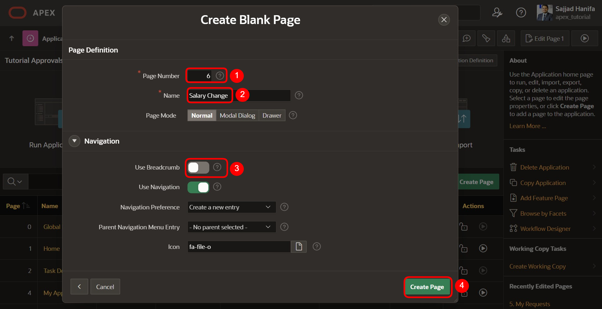  
 
- Sie gelangen nun zum Page Editor.  
- Fügen Sie eine Region Form zum Bereich **Body** hinzu.
- Den Title ändern Sie auf **Salary Change**.
- Unter Source wählen Sie den Table **Salaries** aus.
- Ändern Sie das Page Items **P6_SARY_ID** wie folgt:
  - Type: Hidden
  - Primary Key: True
- Ändern Sie das Page Items **P6_SARY_EMPLOYEE_NAME** wie folgt:
  - Type: Display Only
  - Label: Employee Name
- Ändern Sie das Page Items **P6_SARY_ DEPARTMENT** wie folgt:
  - Type: Display Only
  - Label: Department
- Ändern Sie das Page Items **P6_SARY_ Salary** wie folgt:
  - Type: Display Only
  - Label: Current Salary
- Fügen Sie dann ein neues Page Item **P6_NEW_SALARY** hinzu:
  - Type: Number Field
  - Label: New Salary
  - Minimum Value: 500
  - Maximum Value: 4000
  - Number Alignment: Start

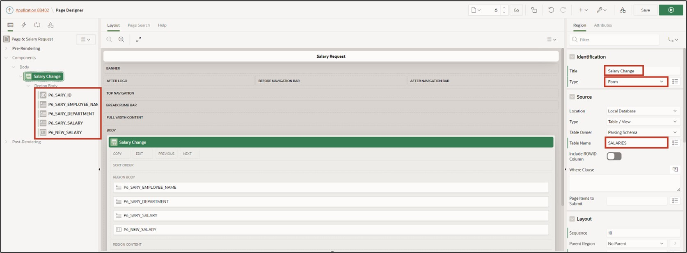

- Ändern Sie im Bereich **Pre-Rendering** den Process **Initialize form Salary Request**.  
- Den Namen ändern Sie bitte auf **Fetch Employee Details for User**.  
- Den Type ändern Sie auf **Execute Code**.  
- Im PL/SQL Code Editor geben Sie bitte folgendes SQL-Query ein:  

 ```sql
select sary_id, sary_employee_name, sary_department, sary_salary
  into :P6_SARY_ID, :P6_SARY_EMPLOYEE_NAME, :P6_SARY_DEPARTMENT, :P6_SARY_SALARY
  from salaries
 where initcap(sary_employee_name) = initcap(:APP_USER);
 ```

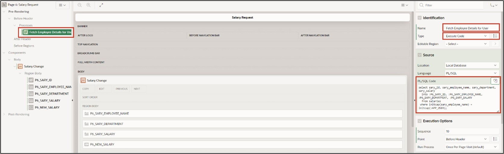  

- Fügen Sie dann der Seite einen Button hinzu und nennen diesen **Submit**.  
- Den Button platzieren Sie zur Position **Create** und aktivieren **Hot**.  

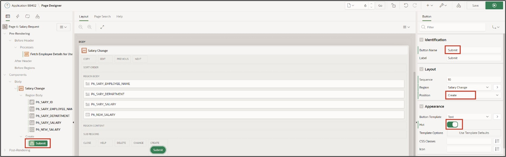  

- Wechseln Sie dann zu **Processes** und fügen Sie dort einen neue Process hinzu.  
- Den *Process* nennen Sie **Submit Task** und ändern folgende Werte:  
  - Type: Human Task - Create  
  - Definition: Salary Request  
  - Details Primary Key Item: P6_SARY_ID  
  - When Button pressed: Submit  

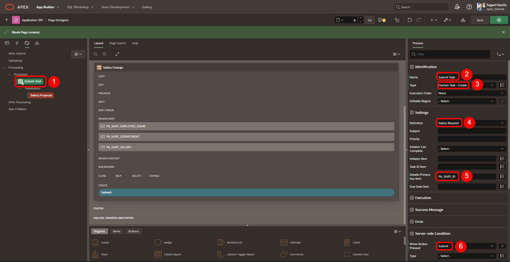  

- Der zum Process angelegte Parameter **Salary Proposal** entsprechend anpassen:
  - Type: Item
  - Item: P6_NEW_SALARY

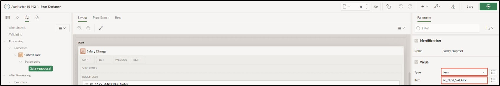

- Zuletzt fügen Sie noch ein **After Processing Branch** hinzu und nennen diesen **Go To Page 5**.
- Als Target wählen Sie die **Page 5**.
- Anschließend die Seite mit Klick auf den **Save** Button speichern.

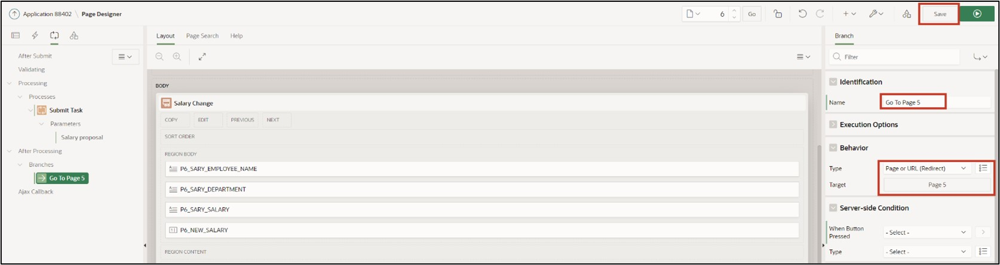

Die Anwendung ist jetzt fertig erstellt.

## <a name="task-user-erstellen"></a>16.5	User erstellen

Bevor die Anwendung jetzt gestartet und simuliert werden kann, müssen im Workspace noch entsprechende User erstellt werden. In diesem Beispiel wird ein Mitarbeiter erstellt, der eine Gehaltsanpassung beantragen kann, sowie ein Admin User, der den Prozess bearbeiten kann.  

Wichtig ist, dass Sie als Administrator in Ihrem Workspace angemeldet sind, so dass Ihnen die Berechtigung gegeben ist neue User zu erstellen.
- Wechseln Sie dazu wieder in den **Application Builder** und klicken oben rechts auf das **Administration** Icon und wählen dort den Eintrag **Manage Users and Groups**.

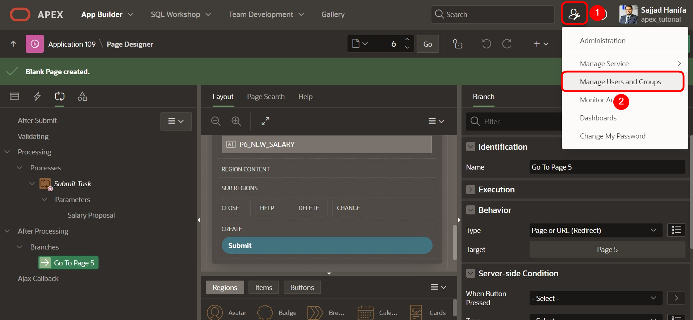

- Klicken Sie hier auf **Create User**.

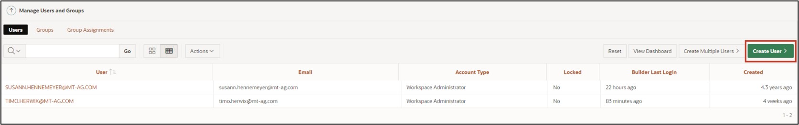

- Geben Sie hier folgendes ein:
  - Name: FISCHER
  - Email Address: fischer@fischer.de
  - Password: 12345678
  - Confirm Password: 12345678
  - Require Change of Password on First Use: No
- Klicken Sie anschließend auf **Create and Create Another** und wiederholen die Eingaben für den User **SCHNEIDER**.

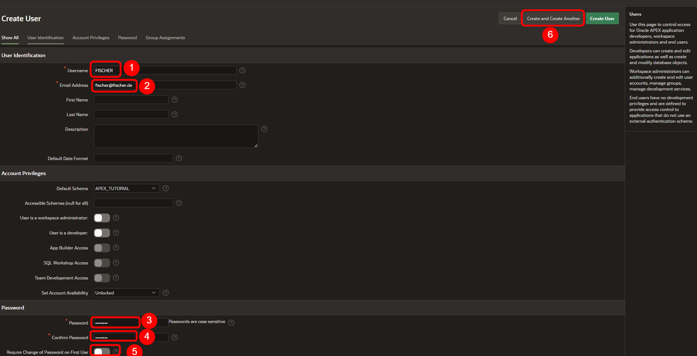

- Beenden Sie hier die Eingabe mit Klick auf **Create User**.
 
## <a name="task-anwendung-ausfuehren"></a>16.6	Anwendung ausführen

- Wechseln Sie jetzt wieder zum Application Builder und starten von dort aus die zuvor erstellte Anwendung **Tutorial Approvals**. 
- Melden Sie sich zunächst als Mitarbeiter **FISCHER** an.

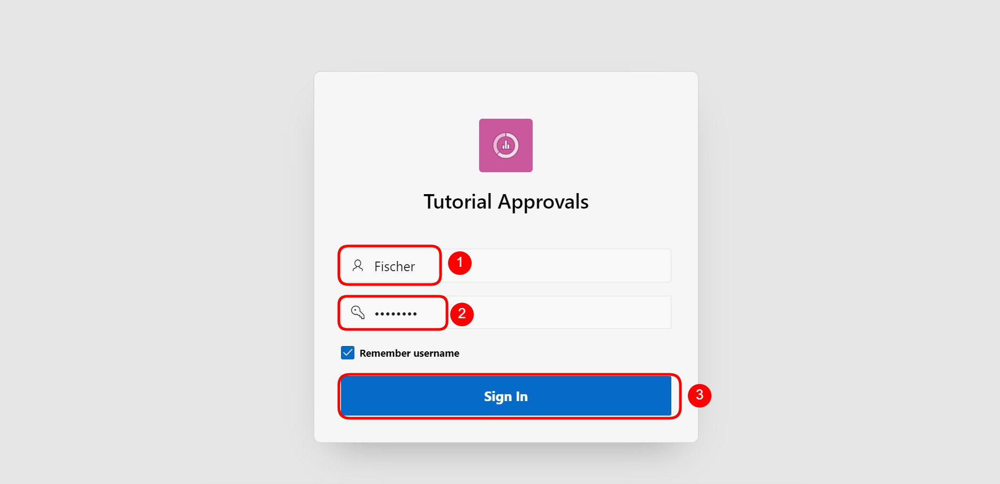

- Wechseln Sie hier zur Seite **Salary Change** und geben dort den Wert **3900** bei **New Salary** ein.  
- Anschließend klicken Sie **Submit**.  

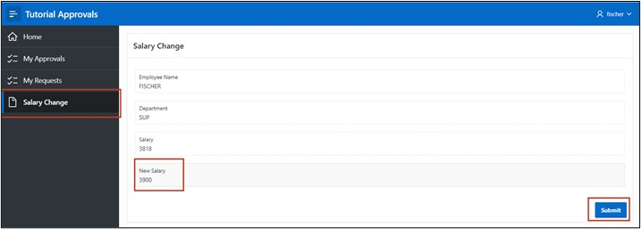  

- Sie gelangen von dort aus zur Seite **My Requests** und sehen dort die soeben angeforderte Gehaltsanpassung.   
 
- Klicken Sie jetzt auf den Titel der Anfrage. Es erscheint dann ein Slider mit allen Task Details.  

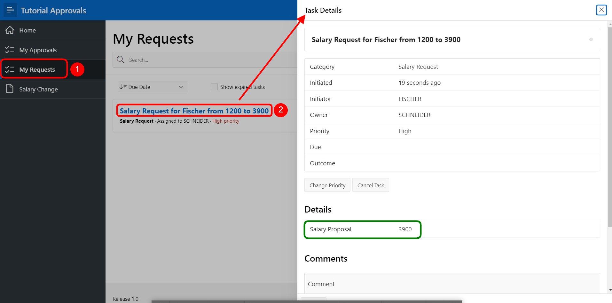  

- Als nächstes melden Sie sich von der Anwendung ab.  

- Melden Sie sich jetzt mit dem User SCHNEIDER an.  
 
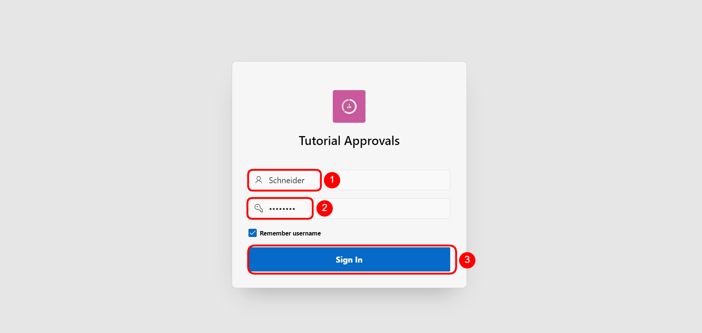  

- Wechseln Sie hier zur Seite **My Approvals**. Sie sehen dort alle Anfragen.  

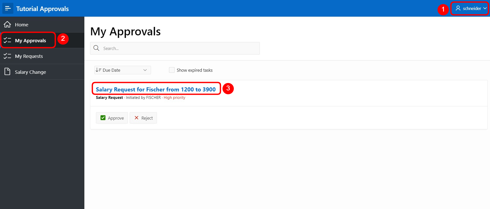  

- Klicken Sie jetzt auf den Titel der Anfrage. Es erscheint ein Slider mit allen Task Details.  
- Wenn Sie jetzt auf **Approve** klicken wird der Antrag genehmigt. Ein Klick auf **Reject** würden die Anfrage ablehnen. Klicken Sie auf **Approve**.  

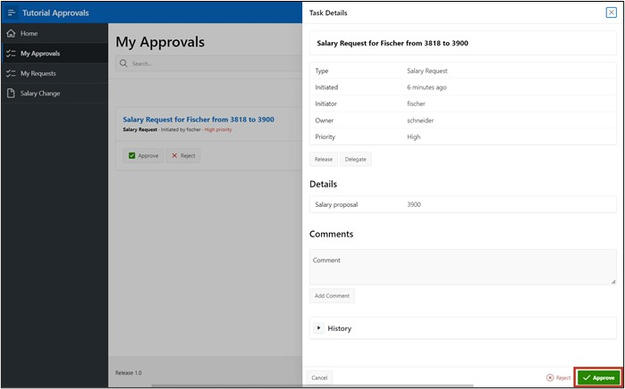  

- Der Antrag wurde genehmigt und das Gehalt vom Mitarbeiter **FISCHER** entsprechend angepasst.  


# 17. <a name="application-search-suchregionen-und-suchkonfigurationen-erstellen"></a>Application Search: Suchregionen und Suchkonfigurationen erstellen

In dieser Aufgabe werden Sie eine Suchregion und Suchkonfigurationen erstellen, die in mehreren Datenquellen nach Ergebnissen sucht. Dazu benötigen Sie die in Kapitel 13 beschriebenen Kenntnisse.  

Ziel ist es, Ihren Benutzern eine leistungsstarke Funktion im Stil einer Suchmaschine zur Verfügung stellen, die in Minutenschnelle mehrere Datenquellen nach Ergebnissen durchsucht und diese in einer einzigen einheitlichen Suchergebnisregion anzeigt.  

## <a name="erstellen-eine-suchkonfiguration"></a>17.1 Erstellen eine Suchkonfiguration 

Diese neue gemeinsame Komponente definiert die zu durchsuchenden Datenquellen und die Anzeige der Ergebnisse. Die Suche kann auf lokalen Daten, APEX-Listen, REST-fähigen SQL-Services oder REST-Services basieren.  

In den folgenden zwei Beispielen wird die Suche einmal in den lokalen Daten und einmal mit einer REST-Datenquelle durchgeführt.  

### <a name="lokalen-daten-datenquelle"></a>17.1.1 Lokalen Daten Datenquelle

- Für die Bearbeitung dieser Aufgabe wird eine **View** benötigt.  

- Geben Sie Ihrer **View** den Namen ***TUTO_P0081_VW***:  
  Query:  
  ```sql
  select prdt_info_id,
         prdt_info_name,
         prdt_info_descr,
         prdt_info_category,
         prdt_info_avail,
         prdt_info_list_price,
         prdt_info_product_image,
         prdt_info_mimetype,
         prdt_info_filename,
         prdt_info_image_last_update,
         prdt_info_tags
    from product_info
  ```

- Öffnen Sie den **App Builder**, wählen Sie Ihre Anwendung (siehe Kapitel 2) und klicken Sie auf **Shared Components**.  

- Klicken Sie auf den Eintrag **Search Configurations** unter **Navigation and Search**.  

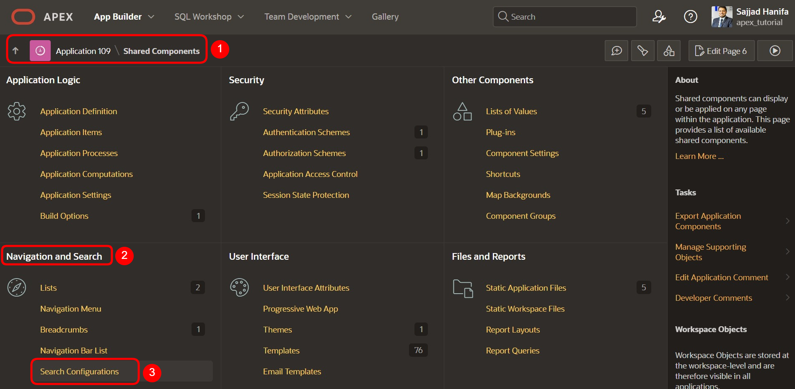  

- Klicken Sie auf **Create**.  

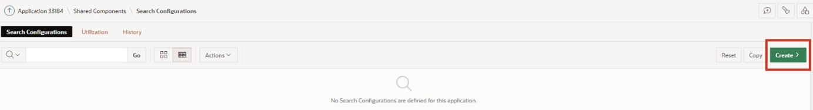  

- Geben Sie hier folgende Werte ein und klicken Sie auf **Next**:  

  | | |  
  |--|--|
  | **Name** | *Product_Search* | 
  | **Search Type** | *Standard*| 
  | | |

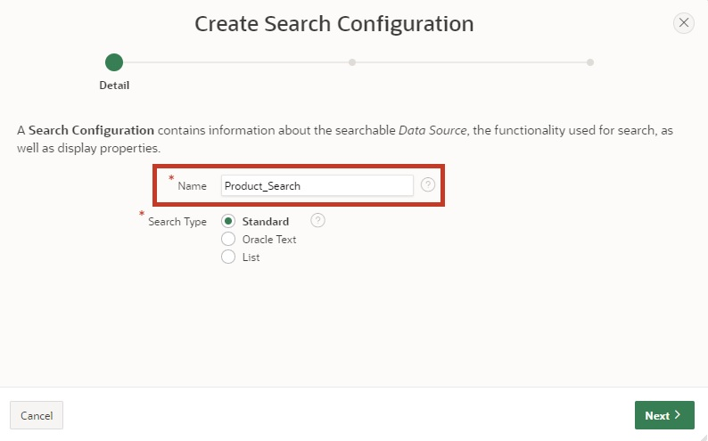  

- Wählen Sie hier folgende Werte aus klicken Sie dann auf **Next**:  

  | | |  
  |--|--|
  | **Data Source** | *Local Database* | 
  | **Source Type** | *Table*| 
  | **Table / View Name** | *TUTO_P0081_VW*| 
  | | |  

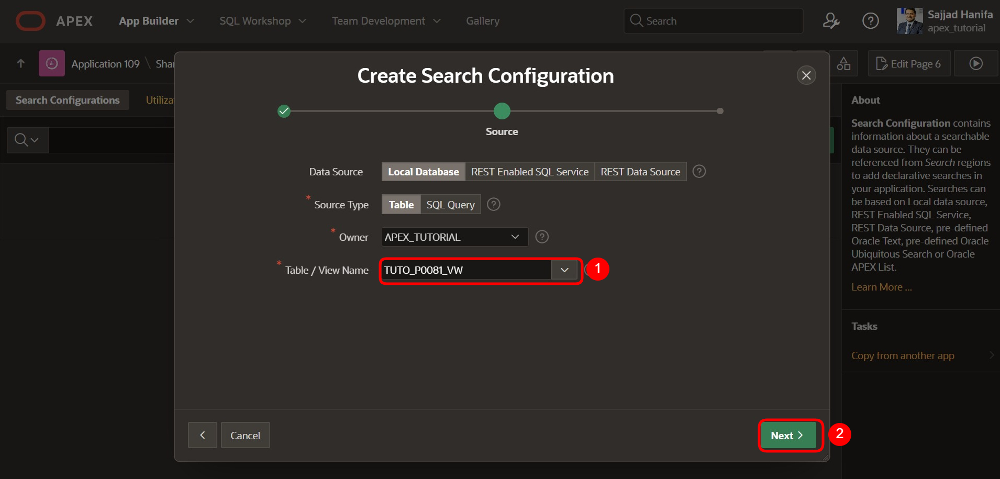  

- Wählen Sie hier folgende Werte aus, klicken Sie anschließend auf **Create Search Configuration**:  

  | | |  
  |--|--|
  | **Primary Key Column** | *PRDT_INFO_ID* | 
  | **Title Column** | *PRDT_INFO_NAME*| 
  | **Description Column** | *PRDT_INFO_DESCR*| 
  | **Icon Source** | *Initials*| 
  | | |  

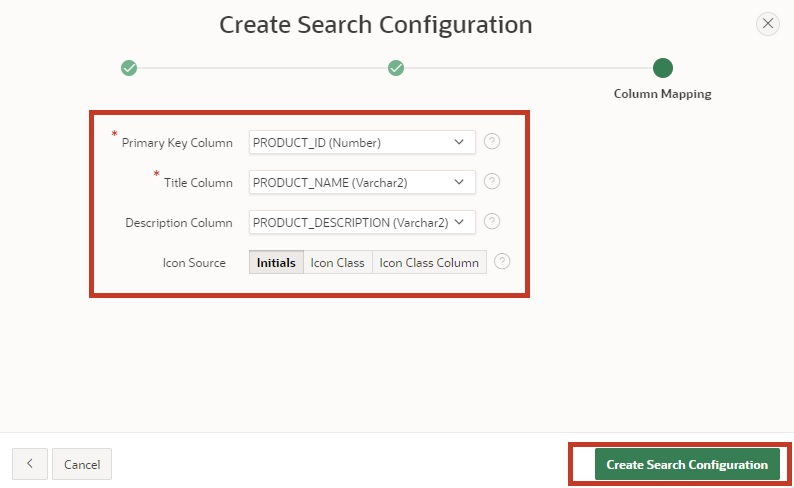  

  Beachten Sie, dass die durchsuchbare(n) Spalte(n) varchar-Spalten sein müssen.  

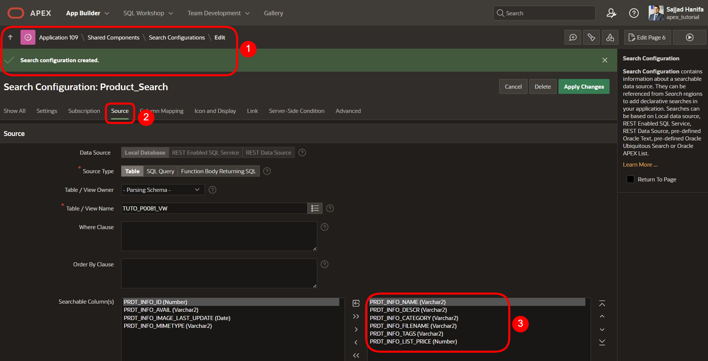

  Das **Column Mapping** stellt die Spalten dar, die in der Benutzeroberfläche angezeigt werden:
  Eine Zahlenspalte (z.B. Spalte **PRDT_INFO_LIST_PRICE**) kann für die **Score Column** verwendet werden, die zur Bewertung des Suchergebnisses dient.  

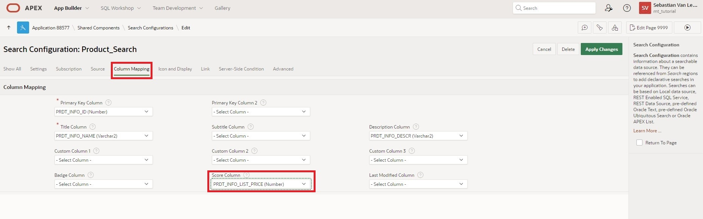  

- Wählen Sie unter **Icon and Display** folgende Werte aus:  

  | | |  
  |--|--|
  | **Icon Source** | *Image BLOB Column* | 
  | **Icon BLOB Column Name** | *PRDT_INFO_PRODUCT_IMAGE*| 
  | **Icon Mime Type Column Name** | *PRDT_INFO_MIMETYPE*| 
  | | |  

  Weiter unten kann ebenfall eine **No Results Found Message** hinzugefügt werden.  

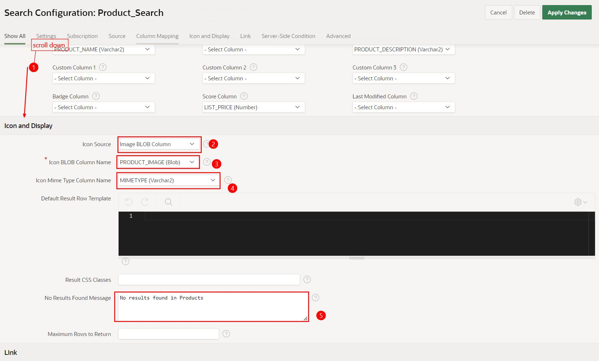  

- Klicken Sie abschließend den Button **Apply Changes** um die Änderungen zu speichern.  

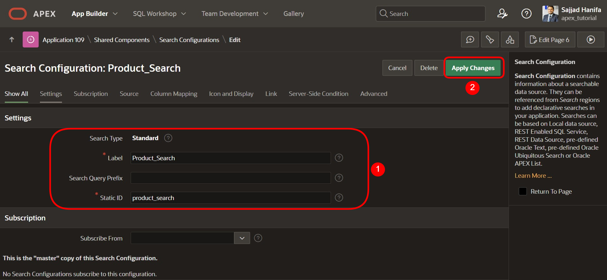  
    
### <a name="suche-rest-datenquelle"></a>17.1.2 REST-Datenquelle

Über den in Kapitel 13 erstellten RESTful Service und die REST-Datenquelle erstellen wir eine Suchkonfiguration, die auf der REST-Datenquelle **Departments** basiert.  

- Klicken Sie auf **Shared Components**  

- Klicken Sie auf den Eintrag **Search Configurations** unter **Navigation and Search**.  

- Klicken Sie auf **Create**.  

- Geben Sie hier folgende Werte ein und klicken Sie auf **Next**:  

  | | |  
  |--|--|
  | **Name** | *Department_Search* | 
  | **Search Type** | *Standard*| 
  | | |  

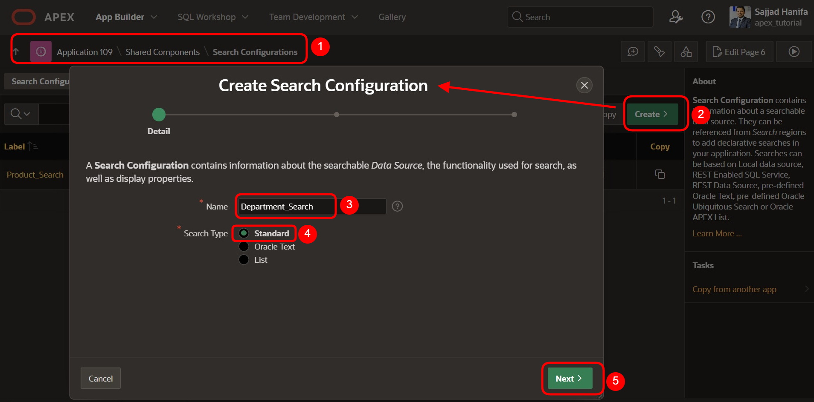  

- Wählen Sie hier folgende Werte aus, dann klicken Sie auf **Next**:  

  | | |  
  |--|--|
  | **Data Source** | *REST Data Source* | 
  | **REST Data Source** | *Departments*| 
  | | |  

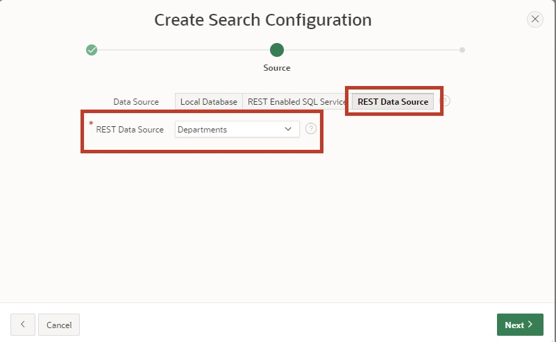  

- Wählen Sie hier folgende Werte aus. Anschließend klicken Sie auf **Create Search Configuration**:  

  | | |  
  |--|--|
  | **Primary Key Column** | *DEPT_ID* | 
  | **Title Column** | *DEPT_NAME*| 
  | **Description Column** | *DEPT_LOCATION*| 
  | **Icon Source** | *Icon Class*| 
  | **Icon CSS Classes** | *fa-sitemap*| 
  | | |  

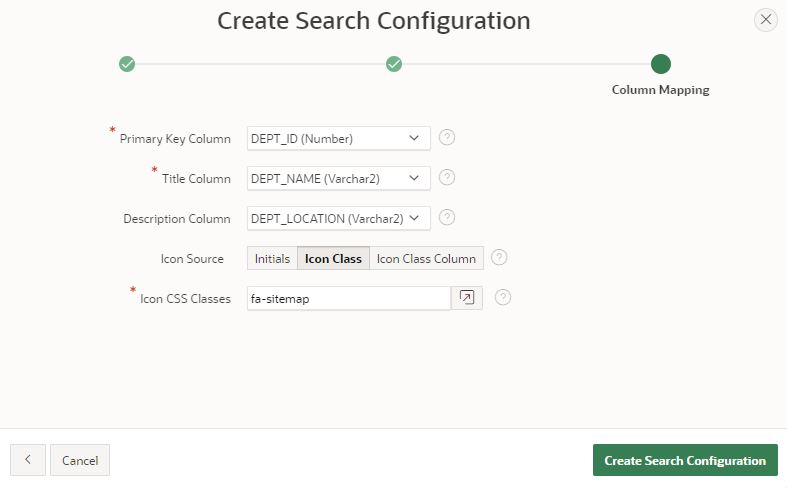  

## <a name="suchkonfigurationen-in-der-anwendung-verwenden"></a>17.2 Suchkonfigurationen in der Anwendung verwenden  

Um die Suchkonfigurationen zu verwenden, erstellen Sie eine Seite, auf der die Suchergebnisse angezeigt werden und ein Suchfeld, in das Sie den Suchbegriff eingeben können.  

### <a name="suchseite-erstellen"></a>17.2.1 Suchseite erstellen 

- Im **App Builder** klicken Sie auf **Create Page**.  
- Wählen Sie den Seitentypen **Component** aus.  
- Wählen Sie den Bereichstypen **Search Page** aus.  

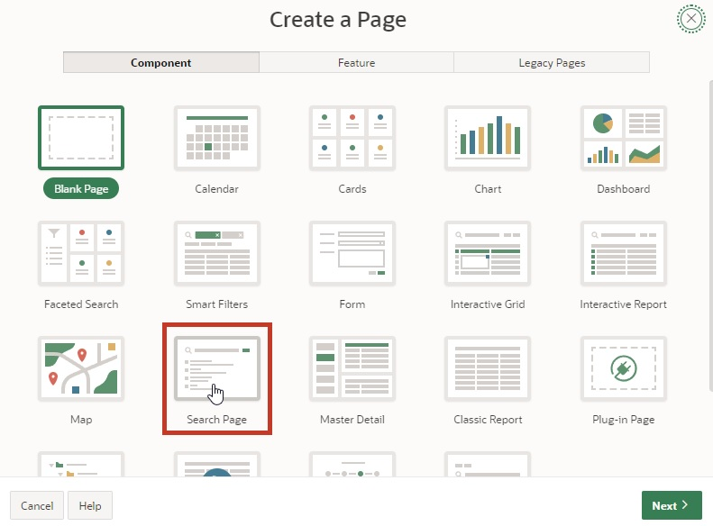  

- Geben Sie als **Page Number**: **81** ein und als **Page Name**: **My Search Results**. 
Eine Suchkonfigurationsliste ist bereits verfügbar. Wählen Sie die Suchkonfigurationen **Department_Search** und **Product_Search** aus. Die Seite kann mehrere Konfigurationen durchsuchen. 

- Unter **Navigation** schalten Sie **Use Breadcrumb** und **Use Navigation** aus und klicken Sie anschließend auf **Create Page**. Die Seite wird erstellt.  
  
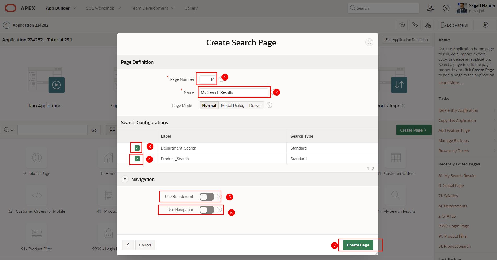  

- Unter **Body** klicken Sie auf **Search Results** Region, und dann auf **Attributes**.  
- Geben Sie als **No Results Found Message** *No Results found* ein.  
- Klicken Sie auf **Save und Run Page**.  

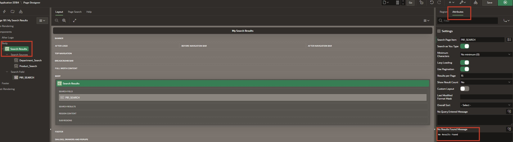  

- Geben Sie **shoe** in das Suchfeld ein. Das Suchergebnis wird direkt auf der **My Search Results** Seite angezeigt.  

  


## <a name="suchfeld-in-die-navigationsleiste-einbauen"></a>17.3 Suchfeld in die Navigationsleiste einbauen  

- Erstellen Sie auf der globalen Seite ein Item mit den folgenden Einstellungen:  

  | | |  
  |--|--|
  | **Name** | *P0_SEARCH* | 
  | **Type** | *Text Field*| 
  | **Label** | *Search*| 
  | **Position** | *After Logo*| 
  | **Icon** | *fa-search*| 
  | | |  
  
-  In **Template Options** wählen Sie **Stretch Form Item** und **Size Large** aus.  
  
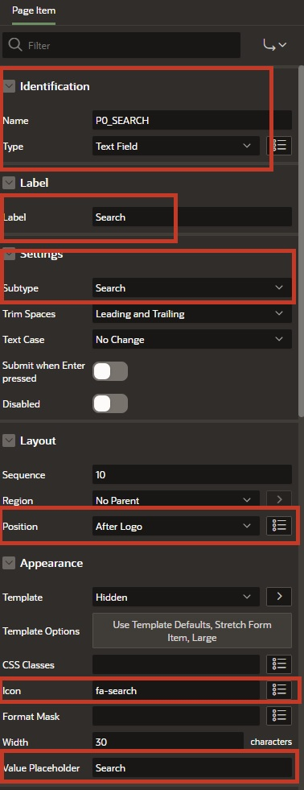  

- Unter **Advanced** verhindern Sie mit **Ignore** bei **Warn on unsaved changes** Meldungen zum Datenverlust beim verlassen von Seiten.

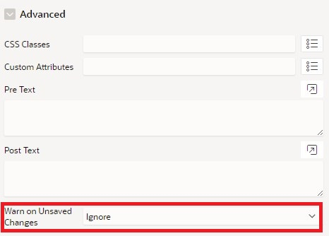 

- Erstellen Sie eine **Dynamic Action** auf dem **P0_SEARCH** Item mit den folgenden Einstellungen:  

  | | |  
  |--|--|
  | **Name** | *Redirect to Results* | 
  | **Event** | *Key Press*| 
  | **Client-side Condition** | *JavaScript expression*| 
  | **JavaScript Expression** | *this.browserEvent.keyCode === 13*| 
  | | |  

  

Die **Dynamic Action** umfasst drei **True Actions**:  

  

- Die erste Aktion ist vom Type *Execute JavaScript Code* mit den folgenden Einstellungen:  

  | | |  
  |--|--|
  | **Name** | *Prevent Default Page Submit* | 
  | **Action** | *Execute JavaScript Code*| 
  | **Code** | *this.browserEvent.preventDefault();*| 
  | | |  


- Die zweite Aktion ist vom Type *Execute Server-side Code* mit den folgenden Einstellungen:

  | | |  
  |--|--|
  | **Name** | *Submit Search Item* | 
  | **Action** | *Execute Server-side Code*| 
  | **Language** | *PL/SQL*| 
  | **PL/SQL Code** | *null;*| 
  | **Items to Submit** | *P0_SEARCH*| 
  | | | 


- Und die dritte Aktion ist wieder vom Type *Execute JavaScript Code* mit den folgenden Einstellungen:

  | | |  
  |--|--|
  | **Name** | *Redirect to Results Page* | 
  | **Action** | *Execute JavaScript Code*| 
  | **Code** | *apex.navigation.redirect ( "f?p=&APP_ID.:81:&APP_SESSION.::NO:RP::" );*| 
  | | |  

  


- Löschen Sie das Searchfeld **P81_SEARCH** auf der **Seite 81**.  

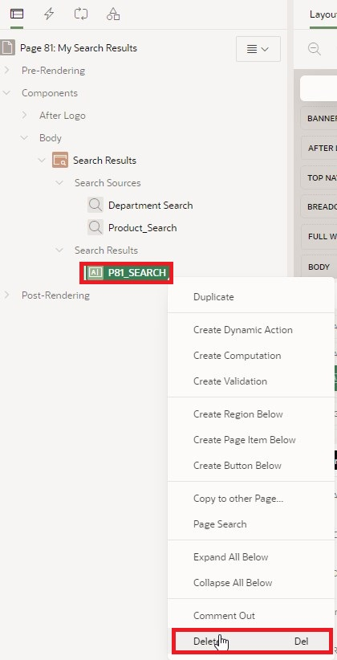  

- Unter **Body** klicken Sie auf **Search Results** Region, und dann auf **Attributes**.  

- Geben Sie als **Search Page Item**: **P0_SEARCH** ein und klicken Sie anschließend auf **Save**.  

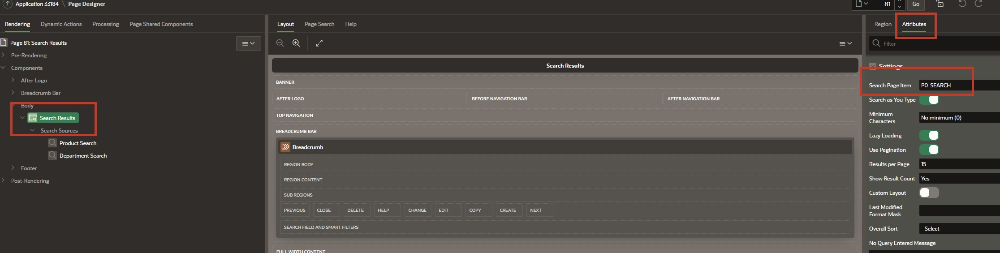  
    

<br>  

Das Suchfeld taucht nun in der Navigationsleiste auf, ist auf jeder Seite verfügbar und leitet Sie auf die Suchergebnisseite weiter, wenn ein Suchwert eingegeben und die Eingabetaste gedrückt wird.  


# <a name="invoke-api-process-type"></a>18. Invoke API Process Type

Der *Process Type* **Invoke API** ermöglicht die komplett deklarative Ausführung von Prozeduren und Funktionen, ohne PL/SQL-Code schreiben zu müssen. Prozeduren und Funktionen können eigenständig oder Teil eines Packages sein. Der **Page Designer** legt die Parameter automatisch vorab fest und ordnet sie den entsprechenden Seitenelementen oder Spalten interaktiver Grids zu, wenn verfügbar.  

Ein Beispiel für einen API-Aufrufprozess ist auf der **Login Page** in der Anwendung zu sehen, wo der Prozess **Set Username Cookie** und der **Login**-Prozess den API-Aufrufprozess verwenden.

- Öffnen Sie den **App Builder**, wählen Sie Ihre Anwendung (siehe Kapitel 2) und die **Login Page**

- Klicken Sie auf die Registerkarte **Processing**, um die Prozesse mit dem Typ **Invoke API** anzusehen.


In diesem Kapitel wird eine Prozedur angelegt, um die oben genannten Funktionen nutzen zu können.

## <a name="api-erstellung-der-benoetigten-objekte"></a>18.1 Erstellung der benötigten Objekte 

Für dieses Kapitel muss zuerst eine **Prozedur** und eine **View** erstellt werden.

### <a name="api-erstellung-der-view"></a>18.1.1 Erstellung der View 

- Für die Bearbeitung dieser Aufgabe wird eine **View** benötigt. 

- Geben Sie Ihrer **View** den Namen ***TUTO_P0101_VW***
  ```sql
  select o.ordr_id,
         o.ordr_ctmr_id,
         o.ordr_total,
         o.ordr_dd,
         o.ordr_user_name,
         oi.ordr_item_id,
         oi.ordr_item_prdt_info_id,
         oi.ordr_item_unit_price,
         oi.ordr_item_quantity,
         p.prdt_info_name,
         p.prdt_info_descr,
         p.prdt_info_category,
         p.prdt_info_avail,
         p.prdt_info_list_price
    from order_items oi
    join product_info p
      on oi.ordr_item_prdt_info_id = p.prdt_info_id
    join orders o
      on oi.ordr_item_ordr_id = o.ordr_id
  ```
  
### <a name="api-erstellung-der-prozedur"></a>18.1.2 Erstellung der Prozedur 

- Analog zur Erstellung einer **View** starten Sie den Assistenten zum Erstellen einer **Prozedur**. Öffnen Sie dazu das Dropdown-Menü über das **+** und klicken auf den Eintrag **Procedure**.  
  
> Weitere Informationen zu einer Prozedur finden Sie unter dem folgenden Link:   
[Oracle Documentation CREATE PROCEDURE Statement](https://docs.oracle.com/en/database/oracle/oracle-database/21/lnpls/CREATE-PROCEDURE-statement.html#GUID-5F84DB47-B5BE-4292-848F-756BF365EC54)  
  


Es öffnet sich das Fenster zur Erstellung einer Prozedur.  
Geben Sie hier den entsprechenden Namen **PR_UPDATE_ORDER_ITEMS** ein. Um eine einheitliche Benennung über verschiedene Anwendungen hinweg zu erzielen, empfiehlt sich die Verwendung von Namenskonventionen.

In diesem Fall setzt sich die Bezeichnung der View wie folgt zusammen:  
**PR_<FACHL.NAME>**


- Klicken Sie dann auf den Button **Create Procedure**.

- Fügen Sie im folgenden Fenster den Code für die Prozedur ein.
    ```sql
      create or replace procedure "PR_UPDATE_ORDER_ITEMS"
  ( p_ordr_item_id            IN  NUMBER, 
    p_ordr_item_unit_price    IN  NUMBER, 
    p_ordr_item_quantity      IN  NUMBER, 
    p_prdt_info_id            IN  NUMBER,
    p_prdt_info_category      IN  VARCHAR2, 
    p_prdt_info_avail         IN  VARCHAR2, 
    p_prdt_info_list_price    IN  NUMBER   
  )
  as
  begin

        update order_items
          set ordr_item_unit_price   = p_ordr_item_unit_price
            , ordr_item_quantity     = p_ordr_item_quantity
        where ordr_item_id           = p_ordr_item_id;
    
        update product_info
          set prdt_info_category    = p_prdt_info_category
            , prdt_info_avail       = p_prdt_info_avail
            , prdt_info_list_price  = p_prdt_info_list_price
        where prdt_info_id          = p_prdt_info_id;

  end "PR_UPDATE_ORDER_ITEMS";
  /
    ```


- Klicken Sie dann auf den Button **Save and Compile**. Es wir eine Meldung eingeblendet, dass die Prozedur erfolgreich kompiliert werden konnte.

- Erstellen Sie eine weitere Prozedur **PR_DELETE_ORDER_ITEMS** mit dem folgenden Code:

  ```sql
  create or replace procedure "PR_DELETE_ORDER_ITEMS"
  (
      p_ordr_item_id    IN  NUMBER
  )
  as
  begin
      delete 
        from order_items
        where ordr_item_id = p_ordr_item_id;
  end "PR_DELETE_ORDER_ITEMS";
  /
  ```

  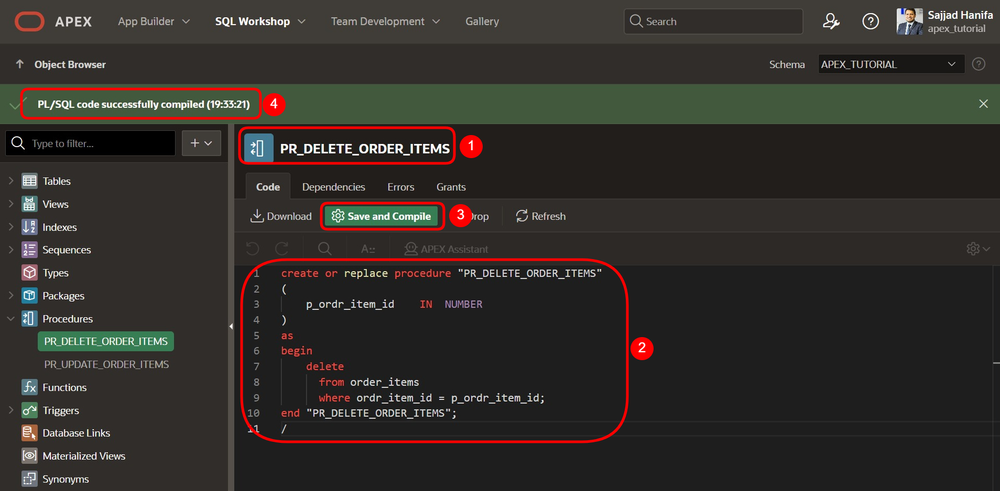

- Klicken Sie anschließend wieder auf **Save and Compile**.

## <a name="invoke-api-process-verwenden"></a>18.2 Invoke API Process verwenden

- Um einen Invoke API Process zu verwenden, erstellen Sie eine editierbare Seite.

- Im **App Builder** klicken Sie auf **Create Page** .
- Wählen Sie den Seitentypen **Component** aus.
- Wählen Sie den Bereichstypen **Interactive Report** aus.


- Geben Sie als **Page Number**: *101* ein und als **Page Name**: *Orders and Products*. 
- Schalten Sie **Include Form Page** ein.
- Geben Sie als **Form Page Number**: *102* ein und als **Form Page Name**: *Manage Orders* und **Form Page Mode**: *Normal*.

- Wählen Sie als **Data Source** die View **TUTO_P0101_VW**.

- Unter **Navigation** schalten Sie **Use Breadcrumb** aus und dann klicken Sie auf **Next**.


- Wählen Sie **ORDR_ITEM_ID** als Primärschlüssel und anschließend klicken Sie auf **Create Page**.


  
- Wenn die Seite erstellt ist, löschen Sie den Button **Create**


  
- Klicken Sie auf **Save** und navigieren Sie dann zu **Seite 102**

- Entfernen Sie ebenfalls den Button **Create** auf **Seite 102**

- Setzen Sie den Type der folgenden Elemente auf **Hidden**:

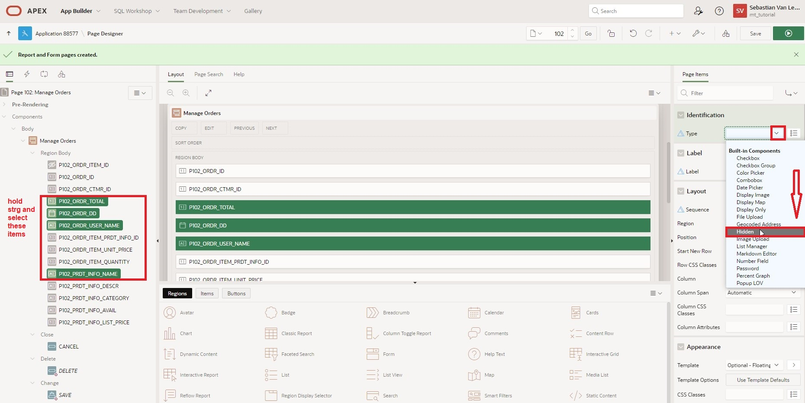
  
- Setzen Sie den **Read Only** Type der folgenden Elemente auf **Always**: 

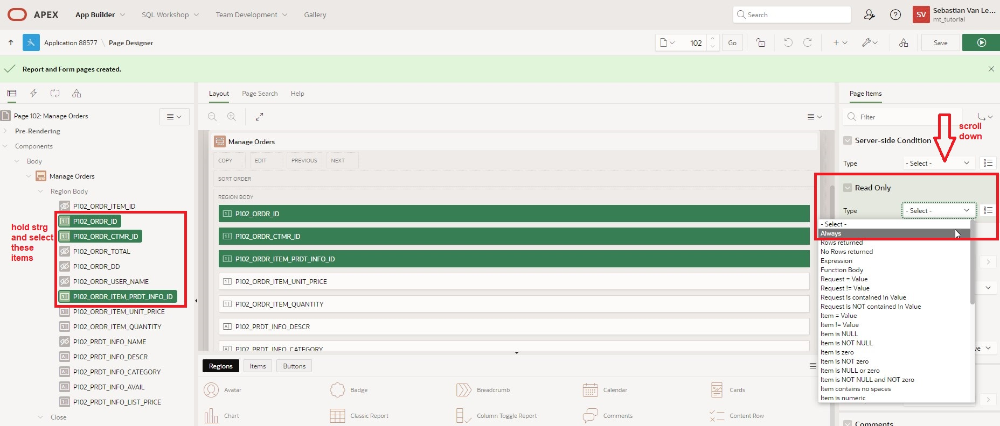
  
- Entfernen Sie den Standardprozess und erstellen Sie zwei neue Prozesse unter **Proccessing**:


  
- Einen Prozess mit den folgenden Einstellungen (über die rechte Maustaste und **Create Process**):


  
- Der Page Designer legt die Parameter automatisch vorab fest. Prüfen Sie, ob jeden Parameter dem entsprechenden Element/Wert zugeordnet wurde.

  | | |  
  |--|--|
  | **p_ordr_item_id** | *P102_ORDR_ITEM_ID*| 
  | **p_ordr_item_unit_price** | *P102_ORDR_ITEM_UNIT_PRICE*| 
  | **p_ordr_item_quantity** | *P102_ORDRD_ITEM_QUANTITY*| 
  | **p_prdt_info_id** | *P102_PRDT_INFO_ID*| 
  | **p_prdt_info_category** | *P102_PRDT_INFO_CATEGORY*| 
  | **p_prdt_info_avail** | *P102_PRDT_INFO_AVAIL*| 
  | **p_prdt_info_list_price** | *P102_PRDT_INFO_LIST_PRICE*| 
  | | |

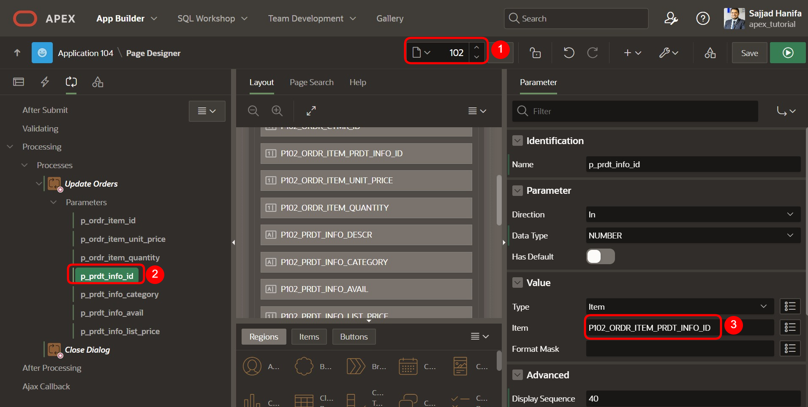
  
- Erstellen Sie einen zweiten Prozess mit den folgenden Einstellungen:


- Überprüfen Sie auch hier, ob der Parameter dem entsprechenden Element/Wert zugeordnet wurde.

  | | |  
  |--|--|
  | **p_ordr_item_id** | *P102_ORDR_ITEM_ID*| 
  | | |


- Klicken Sie auf **Save** und führen Sie von Seite 101 aus die Anwendung aus.

- Navigieren Sie zur Seite **Orders and Products**. 
- Wählen Sie ein **Order Item** aus.


  
- Bearbeiten Sie die markierten Felder oder löschen Sie das ausgewählte **Order Item**  

  


# <a name="template-components"></a>19. Template Components

**Template Components** sind ein neuer Plug-In-Typ in APEX. Sie ermöglichen es Ihnen, eine HTML-Vorlage (mit oder ohne zusätzliches CSS und JavaScript) zu definieren und Platzhalter zu verwenden. Sie sind viel einfacher zu verwenden als ein vollständiges Regions-Plug-In, bei dem Sie keine tiefgreifenden Kenntnisse der Plug-In-APIs benötigen.

Auf jeder Seite können Sie dann einen Bereich dieses Plug-In-Typs erstellen, eine Abfrage platzieren und dann eine Instanz dieser Vorlage erhalten, die mit den Daten für jede zurückgegebene Zeile gefüllt wird. Sie können auch eine einzelne Instanz in einer Region rendern oder sie sogar in Spalten interaktiver Berichte verwenden.

## <a name="erstellung-eines-template-components-apex-plugin"></a>19.1 Erstellung eines "Template Components" (APEX Plugin) 

1. Öffnen Sie den **Shared Components**, klicken sie auf **Plug-ins** und anschlißend auf **create**

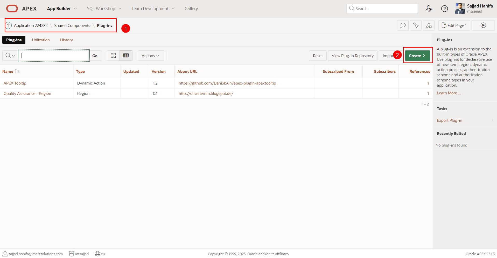

2. Klicken sie auf **Next**

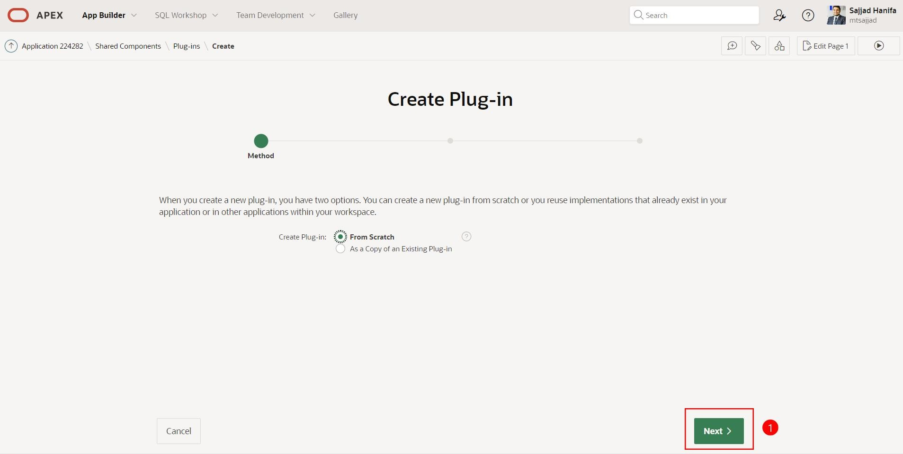

3. Geben Sie die Werte wie folgt ein:

| | | |
|--|--|--|
| **Field Name** | **Value** |
| Name | Progress Bars | 
| Internal Name | PROGRESS_BARS | 
| Type | Template Components | 
| Available as Single | Checkbox: YES | 
| Available as Multiple | Checkbox: YES | 
| | |

Abschlißend drücken Sie auf **Create Plug-in** Button


4. Im nächsten Schritt fügen Sie folgenden code in **Partial**, **Report Body** und **Report Row** an den entsprechenden stellen gemäß Screenshot ein. Abschlißend drücken Sie auf **Create Plug-in** Button.


Fügen Sie den HTML-Code im **Partial** ein
   ```html
    {if APEX$IS_LAZY_LOADING/}
       <p>loading...</p>
    {else/}
       <div class="mb-1 flex justify-between">
         <span class="text-base font-medium">#SKILL#</span>
         <span class="text-sm font-medium">#PCT#%</span>
       </div>
   
       <div class="h-2.5 w-full rounded-full bg-gray-200 ">
          <div class="h-2.5 rounded-full bg-blue-600" style="width: #PCT#%; background: {if COLOR_INDEX%assigned/}var(--u-color-#COLOR_INDEX#);{else/}var(--u-color-1);{endif/}">
          </div>
       </div>
   {endif/}
  ```

Fügen Sie den HTML-Code im **Report Body** ein

   ```html
    <div class="progress-list">#APEX$ROWS#</div>
  ```
Fügen Sie den HTML-Code im **Report Row** ein

   ```html
    <div #APEX$ROW_IDENTIFICATION# style="margin-top: 1lh;">#APEX$PARTIAL#</div>
  ```

5. Sie haben den **Progress Bars** Plugin Erfolgreich erstellt. Klicken auf den Plugin-Namen **Progress Bars** um weiter zu bearbeiten.

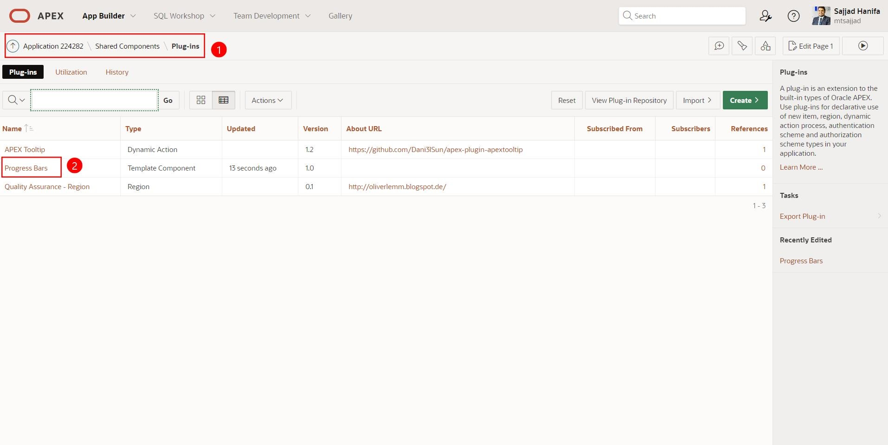

6. Im nächsten Schritt scrollen runter zum punkt **Custom Attributes** und löschen sie alle vorhandenen attribute und klicken sie auf **Synchronize from Templates**. 

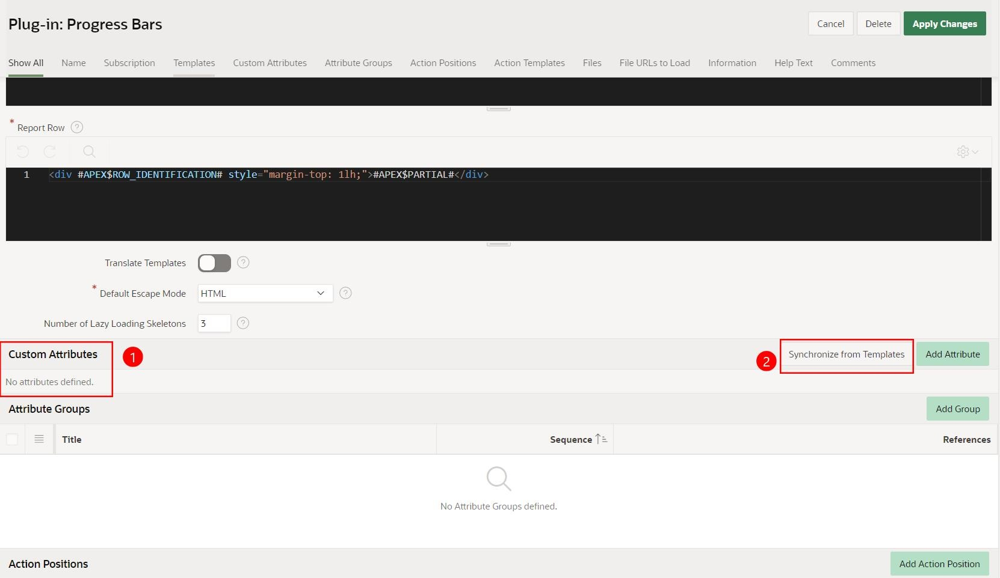

7. Nun sollten nur 3 Attribute zu sehen sein. Klicken sie auf dem ersten Attribute **Color Index**


8. Geben Sie die Werte für die 3 Attribute wie folgt ein und drücken auf **Apply Changes**.

| | | |
|--|--|--|
| **Color Index** | **Value** |
| Static ID | COLOR_INDEX | 
| Required | YES | 
| Data Types | Number |  
| | |

| | | |
|--|--|--|
| **Pct** | **Value** |
| Static ID | PCT | 
| Required | YES | 
| Data Types | Number |  
| | |

| | | |
|--|--|--|
| **Skill** | **Value** |
| Static ID | SKILL | 
| Required | YES | 
| Data Types | Varchar2 |  
| | |

9. Im nächsten Schrtt wird eine **CSS Datei** erstellt.


10. Die **CSS Datei** wir mit folgendem Namen erstellt.

| | | |
|--|--|--|
| **Input-Field** | **Value** |
| File Name | styles.css |   
| | |

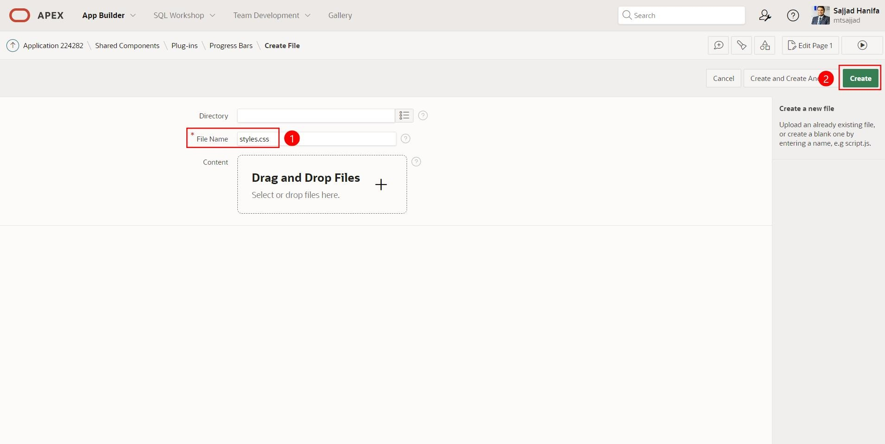


11. Kopieren Sie den unten stehenden **CSS Code** und fügen sie den in APEX ein. Notieren sie am ende den **Reference** Link, den brauchen wie gleich.


   ```css
.progress-list:first-child {
    margin-top: 0px;
}

.mb-1 {
  margin-bottom: 0.25rem;
}

.flex {
  display: flex;
}

.h-2 {
  height: 0.5rem;
}

.h-2\.5 {
  height: 0.625rem;
}

.w-full {
  width: 100%;
}

.justify-between {
  justify-content: space-between;
}

.rounded-full {
  border-radius: 9999px;
}

.bg-blue-600 {
  --tw-bg-opacity: 1;
  background-color: rgb(37 99 235 / var(--tw-bg-opacity));
}

.bg-gray-200 {
  --tw-bg-opacity: 1;
  background-color: rgb(229 231 235 / var(--tw-bg-opacity));
}

.text-base {
  font-size: 1rem;
  line-height: 1.5rem;
}

.text-sm {
  font-size: 0.875rem;
  line-height: 1.25rem;
}

.font-medium {
  font-weight: 500;
}

.text-blue-700 {
  --tw-text-opacity: 1;
  color: rgb(29 78 216 / var(--tw-text-opacity));
}

  ```

12. Den kopierten **Reference** Link, wie im Screenshot an der passenden stelle einfügen und speichern.

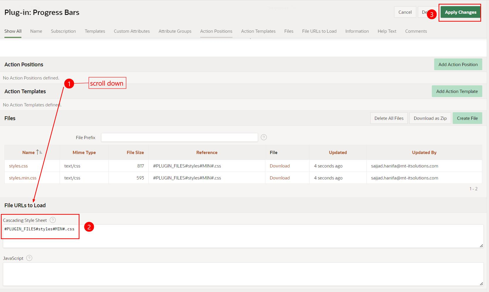

Bis zu diesem Schritt wurde der **Plug-in** Erfolgreich erstellt.

13. Im nächsten schritt wird eine neue APEX-Seite mit dem Plugin erstellt.

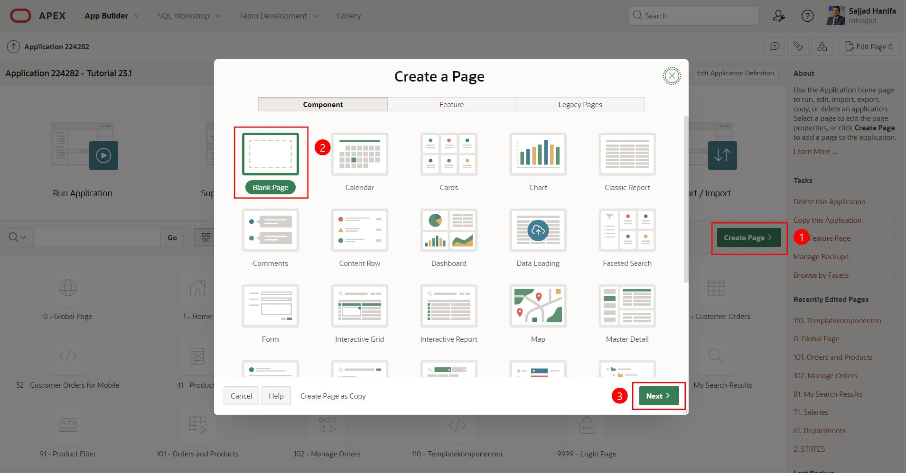

14. Die Neue Seite wie folgt erstellen und auf **create Page** klicken:

| | | |
|--|--|--|
| **Field** | **Value** |
| Page Number | 120 | 
| Name | Progress Bars | 
| Use Breadcrumb | Disable |  
| Icon | fa-bar-chart-horizontal |  
| | |


15. Erstellen Sie auf der Seite eine neue Region mit dem Title: **Progress Bars**. Anschließend wählen sie bei Type das zuvor erstellte Plug-in: **Progress Bars**.


16. Anschließend wählen Sie **SQL Query** als Type aus und fügen sie den unten stehenden SQL-Code im **SQL-Query** ein. Wechseln sie anschließend zum Reiter **Attributes**


   ```sql
WITH web_programming_languages AS (
  SELECT 'JavaScript'   AS language_name FROM DUAL
  UNION ALL
  SELECT 'SQL'          AS language_name FROM DUAL
  UNION ALL
  SELECT 'PL/SQL'       AS language_name FROM DUAL
  UNION ALL
  SELECT 'Python'       AS language_name FROM DUAL
  UNION ALL
  SELECT 'Java'         AS language_name FROM DUAL
  UNION ALL
  SELECT 'C#'           AS language_name FROM DUAL
  UNION ALL
  SELECT 'PHP'          AS language_name FROM DUAL
  UNION ALL
  SELECT 'Ruby'         AS language_name FROM DUAL
  UNION ALL
  SELECT 'TypeScript'   AS language_name FROM DUAL
  UNION ALL
  SELECT 'Swift'        AS language_name FROM DUAL 
)
SELECT language_name                        as SKILLS
     , FLOOR(DBMS_RANDOM.VALUE(0, 100))     as PCT
     , FLOOR(DBMS_RANDOM.VALUE(0, 45))      as COLOR_INDEX
  FROM web_programming_languages
;
  ```

17. Im Reiter **Attributes** passen Sie die Werte wie folgt an:

| | | |
|--|--|--|
| **Field** | **Value** |
| Display | Multiple (Report) | 
| Color Index | COLOR_INDEX | 
| Pct | PCT |  
| Skill | SKILLS |  
| | |


18. Abschließend wird hier nur noch ein Button erstellt und die APEX Seite gespeichert.

Erstellen Sie button mit folgenden Einstellungen:

| | | |
|--|--|--|
| **Field** | **Value** |
| Button Name | P120_REFRESH_PAGE | 
| Label | Refresh Page | 
|   |  
| Region | Progress Bars |  
| Position | Next |  
|   |  
| Button Template | Text with Icon |  
| icon | fa-refresh |  
|   |  
| Action | Submit Page |  
| | |

Klicken Sie auf **Template Options**

| | | |
|--|--|--|
| **Field** | **Value** |
| Type | success | 
| Icon Hover Animation | Push | 
| Width | Stretch |   
| | |


19. Abschließend sieht die Seite wie folgt aus. Drücken Sie auf den Refresh Button, um **Zufällige** Werte neu zuladen.

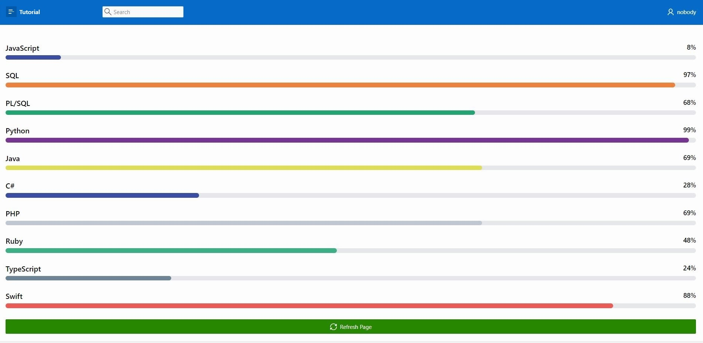


# <a name="working-copy"></a>20. Working Copy

Mit APEX 23.2 hat ein neues kollaboratives Feature Einzug in APEX erhalten - die Working Copy. Mit der Working Copy kann eine Arbeitskopie einer App erstellt werden, an der weiterentwickelt werden kann, während die Hauptversion der App davon unberührt bleibt. Wenn Sie bereits mit anderen Versionsverwaltungen gearbeitet haben, dann wird Ihnen Vieles in diesem Kapitel vertraut vorkommen.

## <a name="arbeitskopie-erstellen"></a>20.1 Arbeitskopie erstellen

Als Ausgangspunkt für die Aufgabe in diesem Kapitel nehmen wir an, dass die Startseite unserer APP überarbeitet werden soll. Konkret geht es um eine weitere Chart zur Summe der Bestellungen aufgeschlüsselt nach Staaten. Die Entwicklung soll jedoch in einem komplett eigenständigen **Branch** geschehen. Deshalb wird eine Arbeitskopie angelegt, in der das Feature (im Team) entwickelt werden kann.   

- Erstellen Sie dazu zunächst eine Working Copy mit dem Befehl **Create Working Copy** im App Builder.


- Geben Sie der Arbeitskopie den Namen **Working Copy Tutorial 23.2** und fügen Sie eine Beschreibung hinzu.  

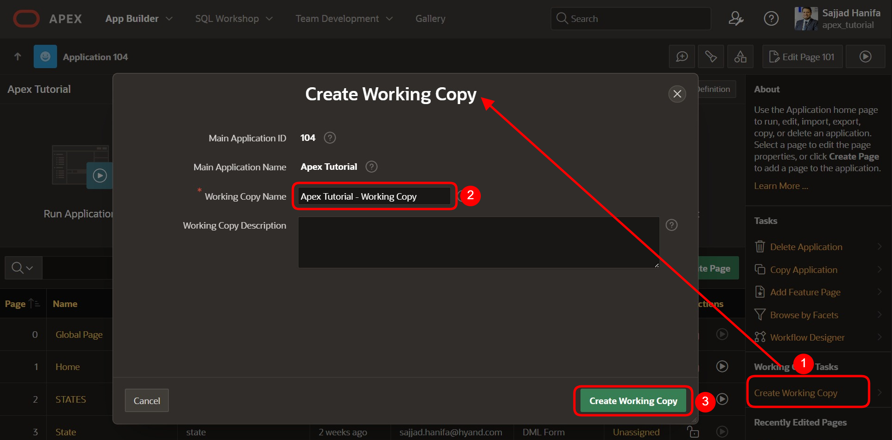

- Die Working Copy wird erstellt. Beachten Sie, dass Sie einige neue Optionen und Informationen im App Builder eingeblendet bekommen.
 Nach der Bereitstellung wechseln Sie automatisch in die Arbeitskopie. Durch die Markierung im App Builder sehen Sie, dass Sie sich in der Arbeitskopie befinden. 

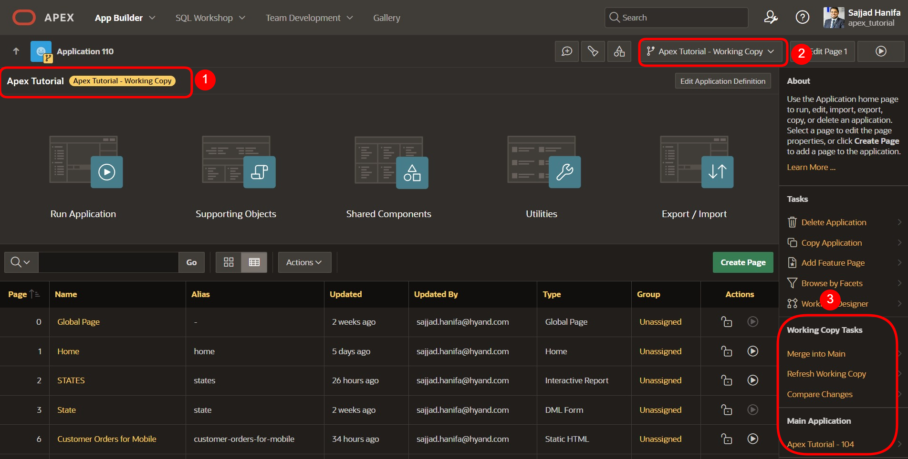

## <a name="arbeitsaufgabe-erledigen"></a>20.2 Arbeitsaufgabe erledigen

- Im nächsten Schritt geht es an die eigentliche Arbeitsaufgabe. Dazu benötigen wir eine weitere **View**.

- Geben Sie Ihrer **View** den Namen ***TUTO_P0001_CHART_2_VW***:  
  Query:  
  ```sql
  select sum(ordr_total) as total,
         stts_state_name
    from orders
    join customers
      on ordr_ctmr_id = ctmr_id
    join states 
      on stts_st = ctmr_state
    group by stts_state_name
    order by stts_state_name;
  ```
- Legen Sie auf Seite 1 der Anwendung eine neue **Region** an. 

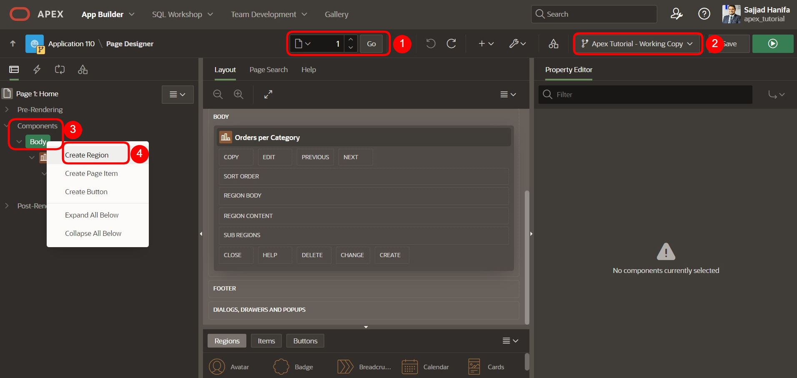

- Nutzen Sie die folgenden Einstellungen in der neuen Region:

  | | |  
  |--|--|
  | **Title** | *Order Totals per State* | 
  | **Type** | *Chart*|
  | **Source** | *Local Database*|
  | **Table Name** | *TUTO_P0001_CHART_2_VW*|  
  | | |

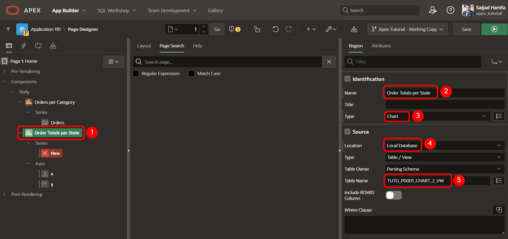

- Unter **Attributes** und **Type** wählen Sie **Pie**.


- Wählen Sie jetzt die **Series**. Hier können Sie den Namen **Totals** verwenden. Auch hier verwenden Sie dieselbe **Source**.

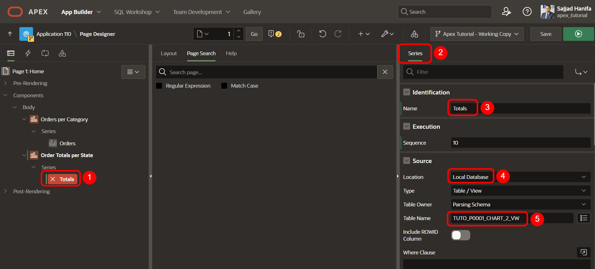

- Im **Column Maping** wählen Sie als Label die Spalte **STTS_STATE_NAME** und für die Wertespalte **TOTAL**.


- Wenn Sie die Seite nun speichern und ausführen, sehen Sie das neu hinzugefügte Tortendiagramm.

## <a name="vergleich-zwischen-branch-und-main"></a>20.3 Vergleich zwischen Branch und Main

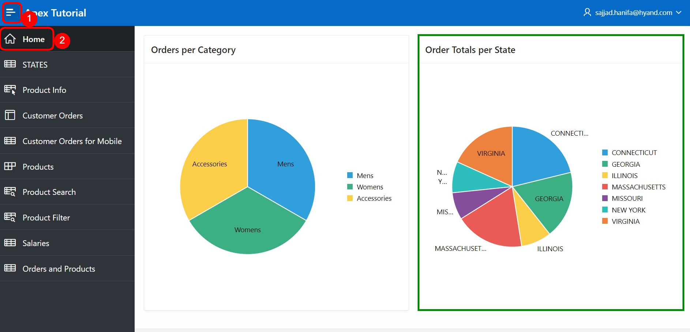

- Kehren Sie zurück auf die Üersichsseite in den App Builder. Im Menü **Tutorial 23.2 Working Copy** können Sie unter dem Punkt **Compare Changes** einen Vergleich zwischen der Hauptversion und der Arbeitsversion durchführen.


- Wählen Sie diesen Punkt und warten kurz, bis der Vergleich erstellt wird.


- Sie sehen eine Liste der Unterschiede zwischen der Arbeitskopie und der Hauptversion. Unter dem Punkt **Diff** können Sie jeweils detaillierter aufschlüsseln, wo die Unterschiede zwischen den Versionen liegen.


- Die grün markierten Änderungen sind gegenüber der Ausgangsversion hinzugefügt. Anhand des Codes ist erkennbar, dass es sich hierbei um die eben erstellte Region auf der Seite handelt.


- Beachten Sie auch, dass die angelegte View keinen Unterschied zwischen den Versionen augelöst hat, sie steht beiden Apps zur Verfügung. Es werden nur Änderungen in der App berücksichtigt.

## <a name="aenderung-in-main"></a>20.4 Änderung in Main

- Schließen Sie die Darstellung und wechseln Sie von der Working Copy in die **Hauptversion der App**. 


- Wir arbeiten in **Main** weiter und schauen uns jetzt kurz an, was passiert, wenn Sie - oder jemand anderers - Änderungen auf derselben Seite in der Hauptversion der App vornimmt, während an der Arbeitskopie gearbeitet wurde. 

- Erstellen Sie dazu zunächst eine **Kopie der View TUTO_P0001_VW**, die Sie **TUTO_P0001_CHART_1_VW** nennen. Der Code der View bleibt ansonsten unverändert. 

- Gehen Sie nun auf Seite 1 der App und ändern die Quelle der der Region-Series **Orders** auf die eben erstellte View **TUTO_P0001_CHART_1_VW**. 


- Speichern Sie die Seite und wechseln dann wieder zurück in die Arbeitskopie.

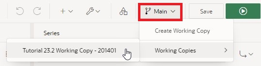

- Nehmen wir nun an, dass die Arbeiten an der Kopie damit erfolgreich erledigt sind und die Version mit der Hauptversion der App zusammengeführt werden kann. Dazu führen Sie als nächstes einen **Merge into Main** der Arbeitskopie und der Hauptversion durch.


- Sie gelangen zu dem bekannten Vergleich der Versionen. Öffnen Sie **Diff** den Versionsvergleich. 


- Im Vergleich sehen Sie, dass nicht nur die Änderungen in der Working Copy aufgeführt sind, sondern auch die neue Quelle der Series **Order** im linken Teil des Vergleichs.


- Kehren Sie auf den Merge-Bildschirm zurück und klicken Sie auf **Next**. Achten Sie darauf, dass die Änderungen, die übernommen werden sollen ausgewählt sind. In diesem Fall nehmen wir alle Änderungen in den Merge.


- Im nächsten Dialog können Sie sicherstellen, dass Ihre Änderungen durch den Merge mit einem **Backup target App first** wieder rückgängig gemacht werden können. Klicken Sie dann auf **Cofirm Merge**. 

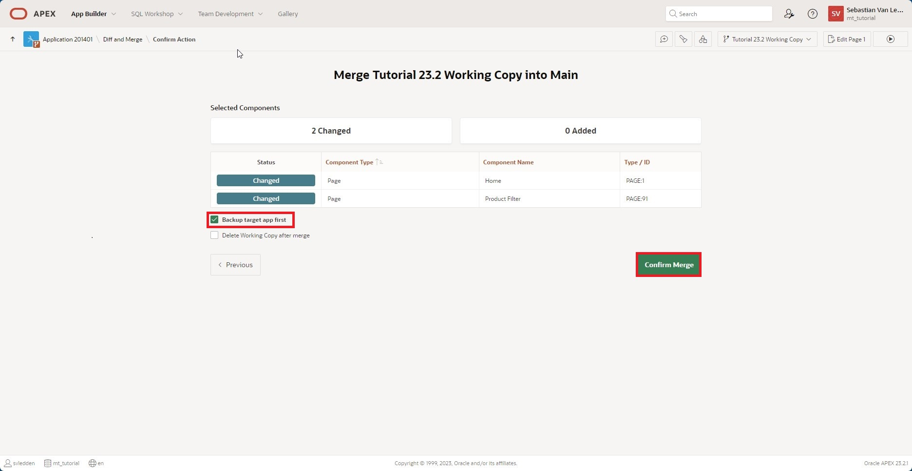

- Sie Sollten eine Erfolgsmeldung erhalten, wenn der Merge durchgeführt wurde.


- Wechseln Sie in der Hauptversion der App auf Seite 1. In der Series **Orders** sehen Sie unter **Table Name** nun, dass die Änderung in der Hauptversion durch den Merge wieder durch die Inhalte der Working Copy überschrieben wurde. 


- Um dies zu verhindern, können Änderungen aus der Hauptversion einer Arbeitskopie zunächst auf den neuesten Stand gebracht werden. Dies geschieht im Arbeitskopie-Menü durch einen **Refresh Working Copy**. 

- Wiederholen Sie dazu zunächst den Arbeitsschritt auf Seite 1 der App und ändern Sie im **Main** die Quelle der der Region-Series **Orders** wieder auf die View **TUTO_P0001_CHART_1_VW**. Wechseln Sie in die Working Copy und lösen eine Aktualisierung aus.


- Sie gelangen zum Refresh-Dialog und können sich hier wieder die Unterschiede zwischen den Versionen anschauen.


- Dieses Mal befindet sich die Hauptversion auf der rechten Seite der geteilten Ansicht, die Änderung der Quelle wird grün angezeigt.


- Schließen Sie die Ansicht und klicken Sie auf **Confirm Refresh**.


- Nachdem die Arbeitskopie auf den Stand der Arbeitsversion gebracht ist, sehen Sie auf Seite 1 der Anwendung in der Arbeitskopie, dass die Quelle der Series **Orders** nun die entsprechende View ist.


- Nachdem alle Arbeiten an der Working Copy abgeschlossen sind und die Versionen erfolgreich zusammengeführt wurden, kann eine Arbeitskopie in der Regel wieder gelöscht werden. Wählen Sie dazu im Menü der Arbeitskope den Punkt **Delete Working Copy** aus. 


- Im folgenden Dialog bestätigen Sie die Löschung der Arbeitskopie. 


- Sie haben damit das Kapitel zur neuen Versionierungsmöglichkeit in APEX 23.2 - der **Working Copy** - erfolgreich abgeschlossen.


# <a name="apex-workflow"></a>21. APEX Workflow

Mit APEX 23.2 werden Workflows direkt in APEX integriert. Mit **APEX Workflow** lassen sich Business-Prozesse mittels der eines grafischen Editors erstellen und ausführen. Nutzer, die Prozesse mittels  **Busines Process Model and Notation (BPMN 2.0)** abbilden wollen, finden mit der eng verwandten Erweiterung **Flows for APEX** von MT - IT Solutions eine passende Erweiterung. Weitere Informationen dazu erhalten Sie unter dem Link [https://flowsforapex.org/](https://flowsforapex.org/). 

In dem folgenden Kapitel nutzen wir Workflows um eine Demoversion einer vereinfachten Reservierung eines Restauranttisches zu erstellen. Die Demo lehnt sich an den Blog-Beitrag **Simplify Business Process Management Using APEX Workflow** von Ananya Chatterjee an. [Link zum Blog](https://blogs.oracle.com/apex/post/simplify-business-process-management-using-apex-workflow-create-doctor-appointment-application)

## <a name="ausgangspunkt-use-case-und-flow-chart"></a>21.1 Ausgangspunkt Use Case und Flow-Chart

Als Ausgangspunkt für die Aufgabe in diesem Kapitel nehmen wir an, dass ein Restaurant ein einfaches Buchungsformular über die Website realisieren möchte. In dem Formular können Gäste eine Reservierungsanfrage für einen Tisch übermitteln. Es wird im nächsten Schritt zunächst vom System geprüft, ob zu dem gewünschten Zeitraum ein Tisch für die gewünschte Anzahl an Personen frei ist. Falls nicht, kommt es sofort zu einer E-Mail an den Gast mit einer Absage des Termins. Wenn ein Tisch frei ist, wird die Anfrage an einen Restaurant-Mitarbeitenden übergeben. Der Mitarbeitende entscheidet, ob die Reservierung angenommen wird. Wird sie abgelehnt, erfolgt wieder eine Absage per E-Mail, wird sie angenommen, wird die Reservierung gespeichert und der Gast über die erfolgreiche Reservierung per E-Mail informiert. 

- Im folgenden **Flow-Chart** wird dieser Use Case visualisiert.


## <a name="workflow-einrichtung-der-benoetigten-elemente"></a>21.2 Einrichtung der benötigten Elemente

- Die benötigten Tabellen und Packages wurden bereits über das **Skript für das Tutorial** in Kapitel 1 mitinstalliert. 

- Für die APP benötigen Sie einen Nutzer mit dem Namen **KOCH**, der später für die Bearbeitung der Reservierungsanfragen zuständig sein soll. Legen Sie einen entsprechenden Nutzer an.

- Klicken Sie dazu oben rechts auf das **Administration** Icon und wählen dort den Eintrag **Manage Users and Groups**.

- Klicken Sie hier auf **Create User**.

- Geben Sie hier folgendes ein:
  - Name: KOCH
  - Email Address: test@abc.com
  - Password: 12345678
  - Confirm Password: 12345678
  - Require Change of Password on First Use: No

- Erstellen Sie dann eine neue APP über den **App Builder** und **Create**. Geben Sie der App den Titel **MT Tutorial - Dinner Reservation**. 


## <a name="erstellen-des-workflows"></a>21.3 Erstellen des Workflows

- Im nächsten Schritt geht es an die eigentliche Arbeitsaufgabe. Dazu erstellen wir zunächst einen **Workflow**.

- Wechseln Sie dazu wieder in den **Application Builder** der neuen App und klicken Sie auf **Shared Components**.


- In den Shared Components wählen Sie **Workflows** im Punkt **Workflows and Automations**. 


- Erstellen Sie hier einen neuen Workflow, indem Sie auf **Create** klicken. Sie werden anschließend zum **Workflow Editor** weitergeleitet. Ein erster Grundsätzlicher Workflow ist bereits mittig im **Diagram Builder** zu sehen.


- Setzen Sie den Namen des Workflows auf **Dinner Reservation** und die **Static ID** auf **DINNERRSVRT**. Den Title legen Sie fest auf: **Workflow for Guest &GUEST_NAME. &GUEST_LAST_NAME.**. 


- Legen Sie die **Workflow Version** auf **1.0** fest.


- Derzeit kommt es noch zu einem Fehler, weil die automatisch angelegte Aktivität noch nicht festgelegt wurde. Um Speichern zu können, löschen Sie die Aktivität. Klicken Sie dazu mit einem Rechtsklick auf die **Activity** in der linken Spalte und wählen Sie **Delete**. Alternativ können Sie auch die Aktivität im Editor auswählen und auf das Symbol mit den drei Punkten klicken. 


- Es bleiben der **Start der Aktivität**, der **Pfeil** und der **Endpunkt** übrig. Ziehen Sie die **Pfeilspitze** im Editor auf den **Endpunkt** und dann speichern Sie.

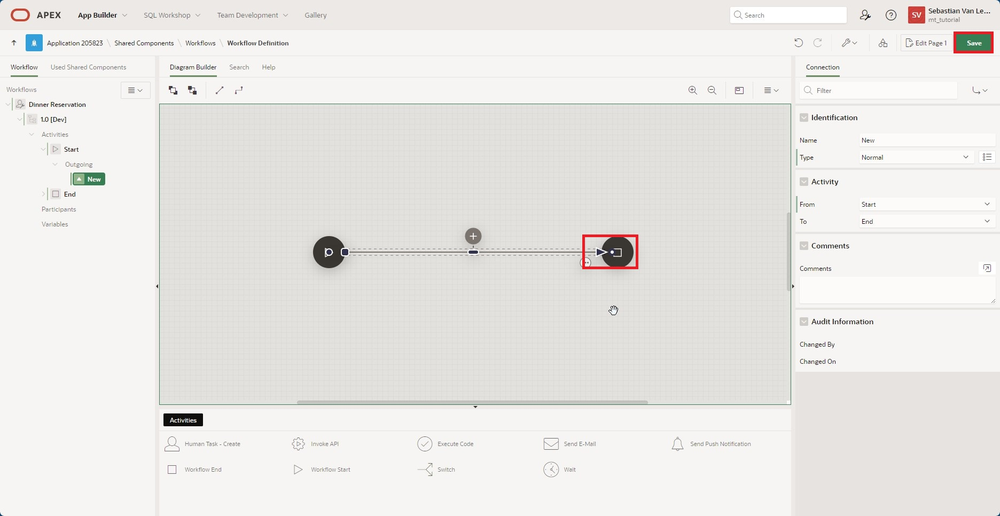

- Im nächsten Schritt erstellen Sie eine Reihe von **Input-Parametern**, die dem Wokflow als Daten bereitgestellt werden. Klicken Sie dazu mit rechts auf den Workflow und wählen Sie **Create Parameter**. 


- Geben Sie dem ersten Parameter die **Static ID: GUEST_NAME**, das **Label: Guest Name**. Es handelt sich dabei um den **Data Type: VARCHAR2**. 


- Legen Sie die folgenden weiteren Parameter an: 

  | | |  
  |--|--|
  | **GUEST_LAST_NAME** | *VARCHAR2*|
  | **GUEST_EMAIL** | *VARCHAR2* | 
  | **GUEST_COUNT** | *NUMBER*|  
  | **REQUEST_START_DATE** | *TIMESTAMP*|
  | **REQUEST_END_DATE** | *TIMESTAMP*|
  | | |

- Die Parameter **REQUEST_START_DATE** und **REQUEST_END_DATE** erhalten die Formatmaske **DD.MM.YYYY HH24:MI** unter **Session State Format Mask**.


- Nun verknüpfen Sie im Workflow 1.0 unter **Additional Data** die Tabelle **T_RESTAURANT_STAFF**. Dies stellt später sicher, dass die erstellen Aufgaben (Tasks) entsprechenden Bearbeitenden zugeordnet werden können. Daneben stehen dadurch die Spalten der Tabelle als Bindvariablen für den Workflow zur Verfügung. Wählen Sie als **Primary Key Column** die Spalte **RST_ID**.


- Neben den Input-Parametern brauchen Sie in dem Workflow auch veränderliche Variablen, die im Prozess genutzt werden können. Dazu erstellen Sie im nächsten Schritt **Workflow Variables**. Dazu rechtsklicken Sie wieder auf den Workflow 1.0 und wählen **Create Variable**.


- Geben Sie der erste Variable die **Static ID: RESERVATION_ID** und das **Label: Reservation ID**. Der **Data Type** ist **NUMBER**. Der Variable wird erst zu einem späteren Zeitpunkt ein Wert zugewiesen, der **Value** ist deshalb zunächst **Null**.

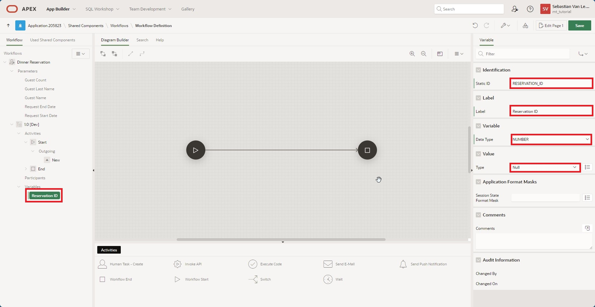

- Legen Sie die nun die Variable **TABLE_ID** nach dem gleichen Schema an: **Static ID: TABLE_ID**, **Label: Table ID** und **Data Type** ist **NUMBER**. Auch hier setzen Sie **Value** auf **Null**.


- Als nächste Variable erstellen Sie **AVAILABILITY**. Sie ist vom Typ **BOOLEAN**. Unter **True Value** tragen Sie **AVAIL** ein und unter **False Value** darunter **UNAVAIL**. Dies sind die beiden möglichen Rückgabewerte einer Funktion, die später in den Workflow eingebunden wird. Danach speichern Sie den Workflow über **Save**.

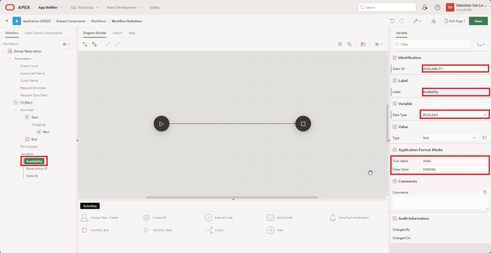

## <a name="task-zur-reservierungsanfrage-erstellen"></a>21.4 Task zur Reservierungsanfrage erstellen

- Im nächsten Schritt erstellen Sie den Task zu Bestätigung (oder Ablehnung) der Reservierungsanfrage. Wechseln Sie dazu in die **Shared Components** und zu den **Task Definitions**. Klicken Sie auf **Create** um einen neuen Task zu erstellen.

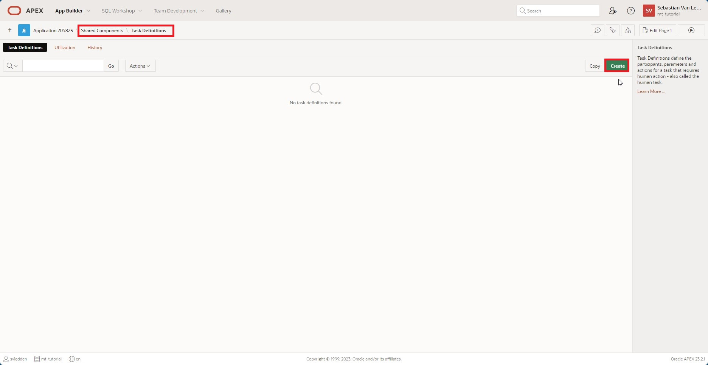

- Im Dialogfenster zum Erstellen der **Task Definition** geben Sie der Task den Namen **Reservation Request** und das **Subject: Reservation for Guest &GUEST_NAME. &GUEST_LAST_NAME.**. Die **Static ID** lautet **RESERVATION_REQUEST**. Klicken Sie danach auf **Create**.


- Im nächsten Schritt setzen Sie die **Action Source** auf **SQL Query**. In das Feld für die Query tragen Sie die folgende Query ein:

```sql
  select * from t_restaurant_staff where rst_id = :APEX$TASK_PK
  ```


- Erstellen Sie eine neue Zeile in der Tabelle **Participants**. Der **Participant Type** ist **Potential Owner**, der **Value Type** ist **Expression** und der **Value** ist **:RST_NAME**. Dies bezieht sich auf die entsprechende Spalte in der Mitarbeitertabelle **T_RESTAURANT_STAFF** die dadurch jeweils Tasks bearbeiten dürfen.

 

- Auch für den Task werden **Parameter** bereitgestellt. Fügen Sie jeweils die folgenden Reihen zur Parameter-Tabelle hinzu:

  | | | |  
  |--|--|--|
  | **NAME_GUEST** | Name Guest | *String* |
  | **LAST_NAME_GUEST** | Last Name Guest | *String* | 
  | **COUNT_GUEST** | Count Guest | *String*|  
  | **RESERVATION_DATE_START** | Reservation Date Start | *String* |
  | **RESERVATION_DATE_END** | Reservation Date End | *String* |
  | | | |


- Bestätigen Sie die Ergänzungen an der Task über den Button **Apply Changes**. Sie gelangen zunächst zurück zu den **Task Definitions**. Wechseln Sie aber noch einmal zurück in die Task **Reservation Request** und legen Sie unter dem Punkt **Task Details Page** eine neue Seite an. Geben Sie der Seite die Nummer **11**.

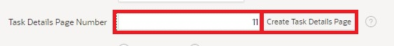

## <a name="fertigstellung-des-workflows"></a>21.5 Fertigstellung des Workflows

- Im nächsten Schritt geht es mit der Arbeit am Workflow weiter. Wechseln Sie dafür wieder in die **Workflows** in den **Shared Components** und klicken Sie auf **Dinner Reservation**. 


- Erstellen Sie im **Workflow 1.0** unter **Activities** mit einem Rechtsklick eine neue Aktivität.


- Geben Sie der neuen Aktivität den Namen **Check Availability** und den Typ **Invoke API**. Wählen Sie das Package **DINNER_RESERVATION_DEMO** und daraus die Function **CHECK_AVAILABILITY**. 


- Das Ergebnis der Funktion übergeben Sie im Parameter **Function Result**, und zwar in **Item** über die **Version Variable** **Availability**. 


- Für die Paramater **pi_guest_count**, **pi_start_date** und **pi_end_date** legen Sie, unter **Value** auf Type **Item** und dann auf die folgenden **Workflow Parameters** und **Format Masks** fest:

  | Parameter | Item | Format Mask |
  | --- | --- | --- |  
  | **pi_guest_count** | GUEST_COUNT | |
  | **pi_start_date** | REQUEST_START_DATE | DD.MM.YYYY HH24:MI |
  | **pi_end_date** | REQUEST_END_DATE | DD.MM.YYYY HH24:MI |
  | | | |


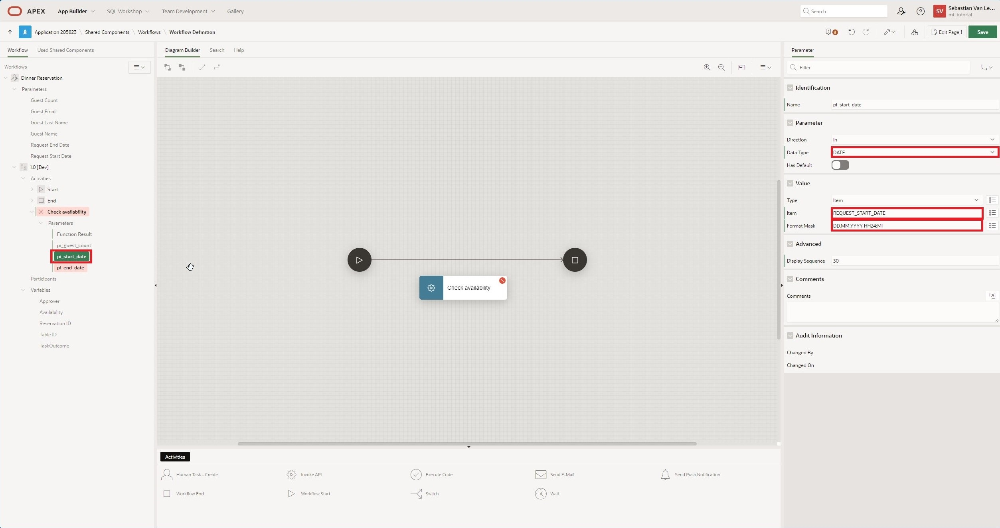


- Verbinden Sie den Pfeil vom Start des Workflows mit der Aktivität.


- Um mit dem Ergebnis der Abfrage-Aktivität umzugehen, benötigen Sie nun einen **Switch**. Legen Sie einen an, z.B. indem Sie ihn in den Diagram Builder ziehen.


- Neuer **Name** des Switch wird **Decide availability**. Unter **Condition** wählen Sie den **Condition Type: Workflow Variable = Value** und die **Workflow Variable: AVAILABILTY** und den Wert **AVAIL**, den die Funktion ausgibt, wenn an dem gewünschten Datum ein Tisch für die gewünschte Anzahl von Personen frei ist.


- Verbinden Sie nun die beiden Aktivitäten **Check availability** und **Decide availability** miteinander. Über das Plus-Zeichen können Sie einen neuen Pfeil einzeichnen und mit der Zielaktivität verbinden.

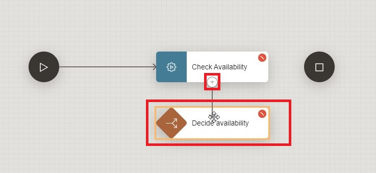

- Es geht weiter mit dem ersten möglichen Ergebnis des Checks: Der Fall, der eintritt, wenn die Prüfung ergeben hat, dass **kein Tisch** frei ist. In diesem Fall soll eine E-Mail verschickt werden, die dem Anfragenden mitteilt, dass kein Tisch frei ist. Legen Sie dazu eine **Send E-Mail Aktivität** an.


- Name dieser Aktivität wird **Send Mail unavailable**. Im **To-Feld** tragen Sie mit **&GUEST_EMAIL.** den Parameter mit der E-Mail des Gastes ein. In das Feld **Subject** kommt der E-Mail-Betreff. Setzen Sie es auf **Your reservation: No table available**. Tragen Sie den folgenden Mail-Text im Feld **Body Plain Text** ein: 

```
Dear &GUEST_NAME. &GUEST_LAST_NAME., 

unfortunately there is no table available at the requested time. Please try another time! 

With kind regards
The Restaurant Team
```


- Verbinden Sie den Switch per Pfeil mit der E-Mail-Aktivität. 


- Wählen Sie den Pfeil und geben Sie der Verbindung unter **Name** den Titel **Unavailable**. Die **Condition** ist in diesem Fall **FALSE**, da die Mail dann geschickt werden soll, wenn die Prüfung ergibt, dass kein Tisch vorhanden ist.


- Erstellen Sie ein weiteres **Workflow End** und verbinden es mit der Mail-Send-Activity. Danach können Sie den Workflow zwischenspeichern.

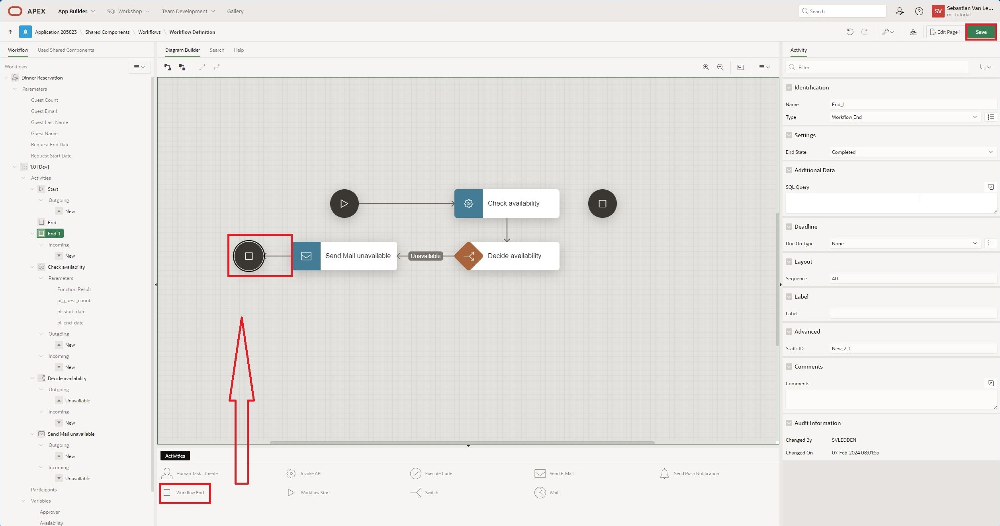

- Jetzt geht es weiter mit dem Fall, dass die erste Prüfung ergibt, dass ein Tisch frei ist. Für diesen Fall soll ein Mitarbeitender entscheiden, ob die Reservierung angenommen wird. Dazu erstellen Sie zunächst eine **Human Task - Create** Aktivität. Geben Sie der Aktivität den Namen **Create Reservation Request**, in **Definition** wählen Sie den eben erstellten Task **Reservation Request**. Die **Details Primary Key Item** legen Sie auf **RST_ID** fest. Für **Outcome** wählen Sie die automatisch über die Task erstellte **Variable** **TASK_OUTCOME** und in **Owner** die - ebenfalls automatisch erstellte - **Variable** **APPROVER**. 


- Als nächstes legen Sie die **Parameter** dieser Aktivität auf die folgenden Werte fest:

  | Name | Type | Item |
  | --- | --- | --- |  
  | **Count Guest** | Item | *GUEST_COUNT*|
  | **Last Name Guest** | Item | *GUEST_LAST_NAME*| 
  | **Name Guest** | Item | *GUEST_NAME*|  
  | **Reservation Date Start** | Item | *REQUEST_START_DATE*|
  | **Reservation Date End** | Item | *REQUEST_END_DATE*|
  | | | |

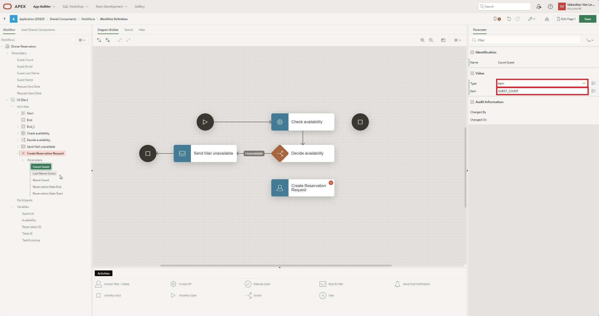

- Verbinden Sie den Switch **Decide availabilty** mit der Aktivität **Create Reservation Request** per neuem Pfeil. Diese Verbindung erhält den Namen **Available** und die **Condition** when **True**.


- Um die Entscheidung aus dem Task zu verarbeiten, braucht es nun wieder einen **Switch**. Erstellen Sie einen neuen Switch und geben Sie ihm den Namen **Decide Reservation approved**. Der **Switch-Type** ist **Check Workflow Variable**. Die Variable, die in **Compare Variable** verglichen wird, stellen Sie als **TASK_OUTCOME** ein.


- Verbinden Sie **Create Reservation Request** per Pfeil mit **Decide Reservation approved**. 


- Da auch im Falle einer Ablehnung der Reservierung durch den Mitarbeiter eine Absage-Mail verschickt werden soll, verbinden Sie **Decide Reservation approved** mit der **Send Mail unavailable**. Legen Sie den Namen auf **Rejected** fest. der **Operator** lautet **Is Equal to** und der **Value** ist das Ergebnis **REJECTED** aus der Human Task. Danach können Sie wieder zwischenspeichern.

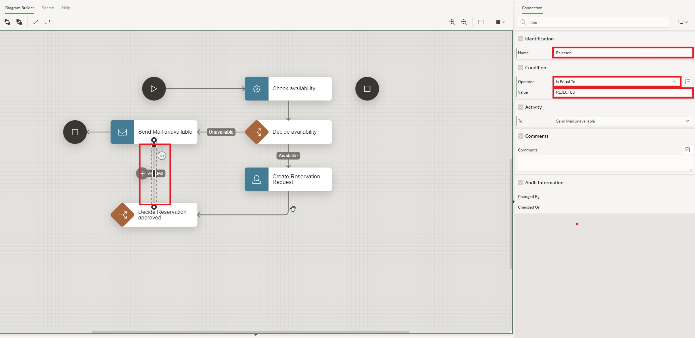

- Im Falle einer Genehmigung wird mit der nächsten Aktivität nun eine freie Tischnummer ermittelt, die der Reservierung zugeordnet wird. Fügen Sie eine **Invoke API**-Activität hinzu. Geben Sie ihr den Namen **Get free table**. Das zugehörige Package ist wieder **DINNER_RESERVATION_DEMO**, die **Function** ist **GET_FREE_TABLE_ID**.  

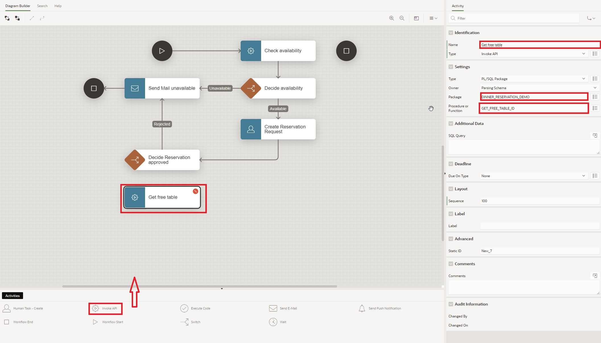

- **Function Result** der Aktivität wird unter **Item** in die Variable **TABLE_ID** übergeben. 


- Legen Sie die weiteren Parameter auf die folgenden Werte fest (analog zu **Check availabilty**). 

  | Parameter | Item | Format Mask |
  | --- | --- | --- |  
  | **pi_guest_count** | GUEST_COUNT | |
  | **pi_start_date** | REQUEST_START_DATE | DD.MM.YYYY HH24:MI |
  | **pi_end_date** | REQUEST_END_DATE | DD.MM.YYYY HH24:MI |
  | | | |

- Verbinden Sie den Switch **Decide Reservation approved** mit der **Get free table**-Aktivität. Legen Sie den Namen der Verbindung auf **Approved**, den Operator auf **Is Equal to** und den Value auf **APPROVED** fest. 


- Jetzt liegen alle Informationen vor, die benötigt werden um die genehmigte Reservierung zu speichern. Dazu Legen Sie eine weitere **Invoke API**-Aktivität an. Geben Sie ihr den Namen **Set reservation**. Das zugehörige Package ist **DINNER_RESERVATION_DEMO**, die **Function** ist **SET_RESERVATION**.


- Das Ergebnis der Funktion unter **Function Result** in den **Parameters** legen Sie auf die Variable **RESERVATION_ID** fest. Die weiteren Parameter füllen Sie folgendermaßen aus: 

  | Parameter | Item | Format Mask |
  | --- | --- | --- |  
  | **pi_dining_table_id** | TABLE_ID | |
  | **pi_guest_count** | GUEST_COUNT | |
  | **pi_guest_name** | GUEST_NAME | |
  | **pi_guest_last_name** | GUEST_LAST_NAME | |
  | **pi_guest_email** | GUEST_EMAIL | |
  | **pi_start_date** | REQUEST_START_DATE | DD.MM.YYYY HH24:MI |
  | **pi_end_date** | REQUEST_END_DATE | DD.MM.YYYY HH24:MI |
  | | | |

- Die **pi_workflow_id** erwartet die Workflow ID des aktuellen Workflows. Die Workflow ID können Sie der Prozedur über einen **Static Value** ebenfalls übergeben. Tragen Sie hier **&APEX$WORKFLOW_ID.** ein. Verbinden Sie **Get free table** und **Set reservation**. 


- Nach dem Speichern soll der Kunde dann per E-Mail darüber informiert werden, dass die Reservierung angenommen wurde. Die entsprechende **Send E-Mail**-Aktivität legen Sie als nächstes an und geben ihr den Namen **Send confirmation**. Im **To**-Feld tragen Sie - analog zur Absagemail - die **&GUEST_EMAIL.** ein. Das Subject wird **Reservation Confirmation**. Verwenden Sie den folgenden **Body Plain Text**: 

```
Dear &GUEST_NAME. &GUEST_LAST_NAME., 

hereby we confirm your reservation! We are looking forward to your stay on the following date: &REQUEST_START_DATE.!

With kind regards
The Restaurant Team
```


- Verbinden Sie nun noch die Aktivitäten untereinander und binden das freie **Workflow End** als Endpunkt des Workflows mit ein. Danach speichern Sie den Workflow.


## <a name="workflow-erstellen-der-app-seiten"></a>21.6 Erstellen der App-Seiten

- Mit dem erstellten Workflow geht es nun weiter mit dem Aufbau der eigentlichen App. Wechseln Sie dazu zunächst in die **Shared Components** und die **Static Application Files**. 


Fügen Sie als neue Datei im Ordner **images/** das beigefügte Bild **reservation_bckgrnd.jpg** hinzu. 


- Die in **Reference** entstandene Referenz auf die Datei **#APP_FILES#images/reservation_bckgrnd.jpg** werden Sie gleich benötigen. Wechseln Sie zunächst auf die Seite 1 Ihrer Application in den **Page Designer** und fügen Sie den folgenden Code in das **Inline CSS** der Seite ein, der Teil hinter **APP_FILES** ist die Referenz auf die Datei: 

```css
body {
    background: url(#APP_FILES#images/reservation_bckgrnd.jpg) no-repeat center center fixed; 
    -webkit-background-size: cover;
    -moz-background-size: cover;
    -o-background-size: cover;
    background-size: cover;
}
```


- Fügen Sie der Seite nun im Body eine neue Region mit dem Namen **Book a table** hinzu. Stellen Sie die **Column Span** auf **5**. 


- Erstellen Sie nun die folgenden **Page Items** in der neuen Region: 

  | Name | Type | Label |
  | --- | --- | --- |  
  | **P1_GUEST_NAME** | Text Field | Guest Name |
  | **P1_GUEST_LAST_NAME** | Text Field | Guest Last Name|
  | **P1_GUEST_EMAIL** | Text Field | Guest Email |
  | **P1_GUEST_COUNT** | Select List | Guest Count |
  | **P1_START_DATE** | Date Picker | Start Date & Time |
  | **P1_END_DATE** | Date Picker | End Date & Time |
  | | | |

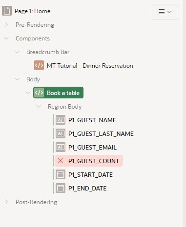

- Setzen Sie den Wert **Value Required** für die Page Items **P1_GUEST_NAME, P1_GUEST_LAST_NAME, P1_GUEST_EMAIL, P1_START_DATE und P1_END_DATE** auf ein.

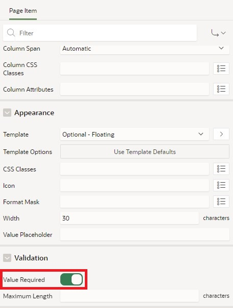

- Die neue Select-List **P1_GUEST_COUNT** befüllen Sie mit **Static Values** von 1 - 8. Deaktivieren Sie **Display Extra Values** und **Display Null Value**. Setzen Sie **Warn on Unsaved Changes** auf **Ignore**.


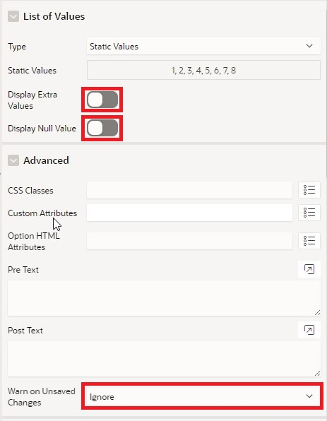

- Fügen Sie der Region einen **Button** mit dem Namen **Request_reservation** und dem Label **Request Reservation** hinzu. Aktivieren Sie **Hot** und unter **Template Options** den **Style** **Simple**. Das **Behavior** ist **Submit Page**.


- Für den Zweck der Demo wird an dieser Stelle noch eine Einstellungsmöglichkeit des Mitarbeitenden eingefügt, der die Entscheidung über die Reservierung trifft. Fügen Sie der Seite ein weiteres Page Item **P1_APPROVER** hinzu. Die **Column Span** legen Sie ebenfalls auf **5** fest. Unter **List of Value** legen Sie das folgende **SQL-Query** fest: 

```sql
select rst_name as d, rst_id as r from tutowf_staff_vw
```
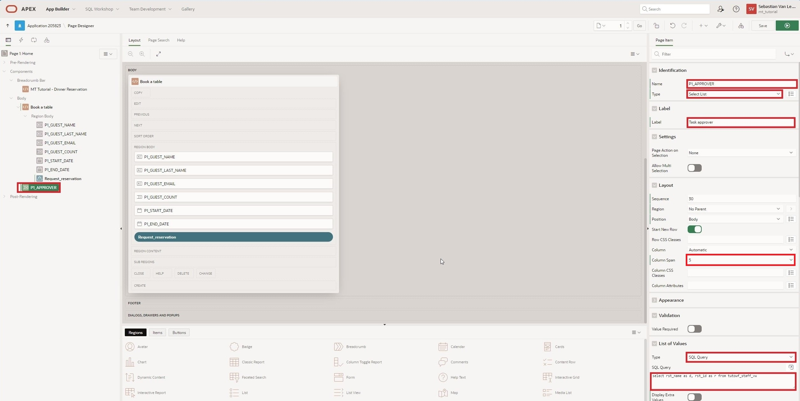

- Deaktivieren Sie **Display Extra Values** und **Display Null Value** und legen den **Default** auf **Static** und den Wert auf **1** fest.

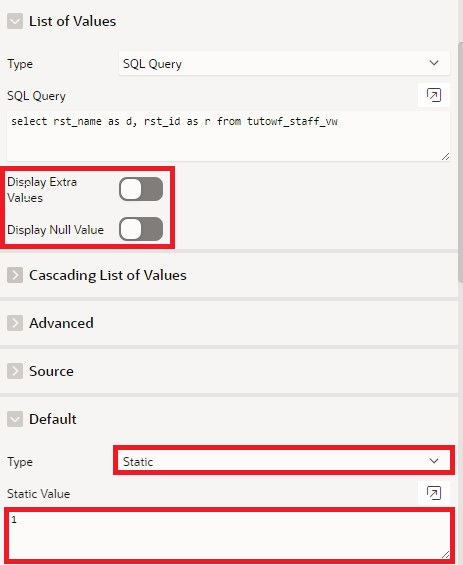

- Das nächste Page Item nennen Sie **P1_TODAY** und setzen den Type auf **Hidden**. 


- Legen Sie für das Page Item eine Computation an. Verwenden Sie dabei die folgende **SQL Query (return single value)**: 

```sql
select to_char(systimestamp, 'DD.MM.YYYY HH24:MI') from dual
```


- Schalten Sie im die Page Item **P1_START_DATE** **Show Time** ein. Bei **Minimum Date** wählen Sie **Item** und das **Minimum Item** wird **P1_TODAY**. Unter **Format Mask** tragen Sie **DD.MM.YYYY HH24:MI** ein. 


- Schalten Sie auch beim im die Page Item **P1_END_DATE** **Show Time** ein. Hier wählen Sie das **Minimum Item** wird **P1_START_DATE**. Unter **Format Mask** tragen Sie auch hier **DD.MM.YYYY HH24:MI** ein.


- Wechseln Sie auf der Seite in den Reiter Processing und legen einen neuen Process an. Nennen Sie den Process **Submit Reservation Workflow**, der **Type** ist **Workflow**, die **Definition** ist unser Workflow **Dinner Reservation**. Das **Details Primary Key Item** ist **P1_APPROVER** - hierdurch wird der Task entsprechend an den Mitarbeidenten zugewiesen, der in dem Page Item ausgewählt wurde. Tragen Sie in der **Success Message** den folgenden Text ein: **Reservation request successfully submitted!**. Die Error Message ist **Something went wrong**. Die **Server-side Condition** ist **When Button Pressed** und der Button **Request_reservation**. 

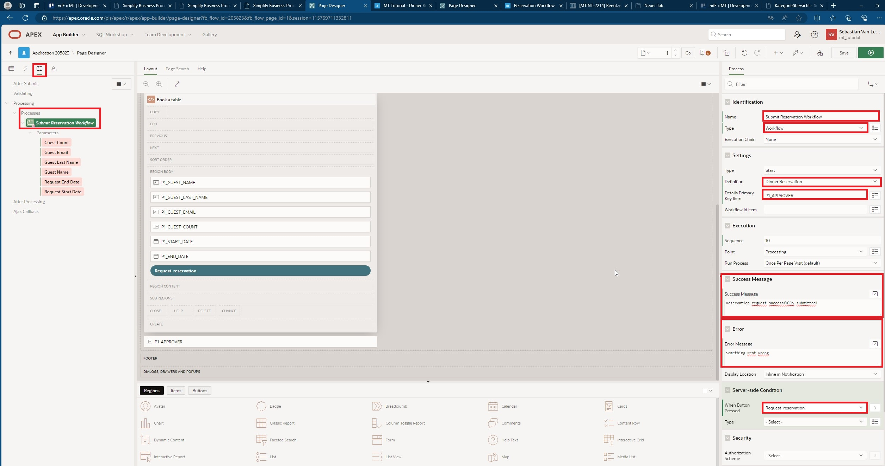

- Legen Sie die **Parameters** folgendermaßen fest, **Type** ist jeweils **Item**: 

  | Parameter | Item |
  | -- | -- |  
  | **Guest Count** | *P1_GUEST_COUNT* |   
  | **Guest Email** | *P1_GUEST_EMAIL* |
  | **Guest Last Name** | *P1_GUEST_LAST_NAME* |
  | **Guest Name**| *P1_GUEST_NAME* |
  | **Request Start Date** | *P1_END_DATE* |
  | **Request End Date** | *P1_START_DATE* |
  | | |
 
 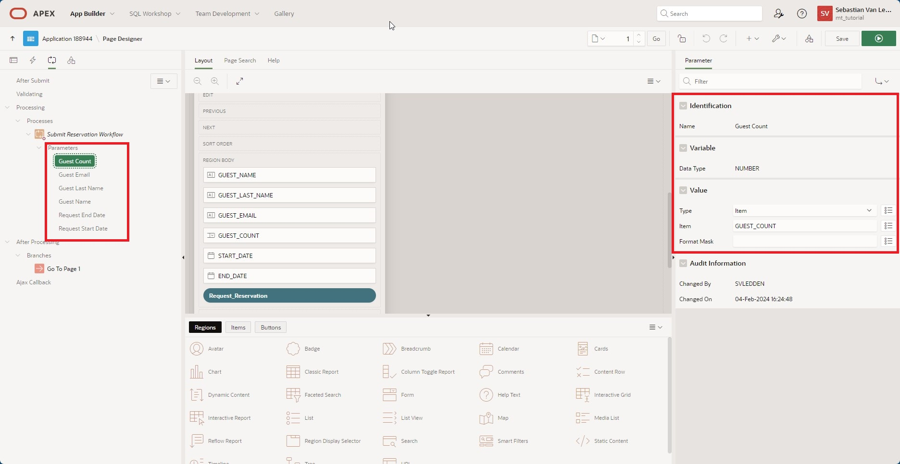

 - Erstellen Sie unter **After Processing** einen neuen **Branch** mit dem Namen **Go to Page 1**. Das **Behavior** ist **Type Page or URL (Redirect)**.
 
  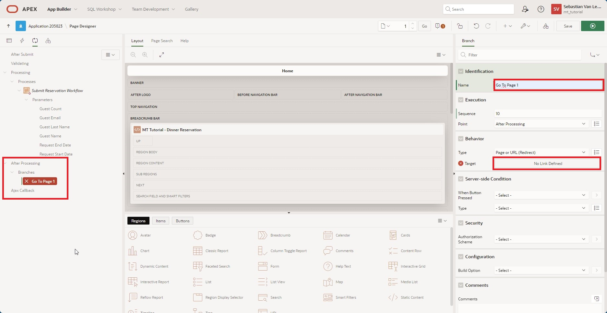
 
 - Target stellen Sie auf Page 1 ein. Der Cache der Seite 1 soll dabei geleert werden. Speichern Sie die Seite dann ab.

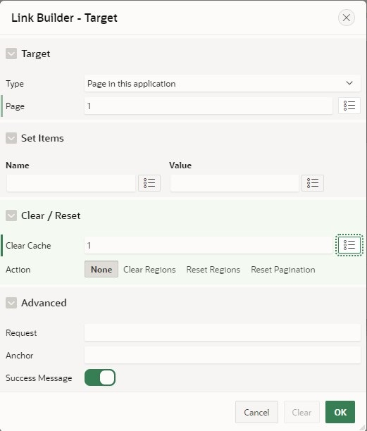

- Wechseln Sie nun in den App Builder und erstellen Sie eine neue Seite in Ihrer Application. Erstellen Sie als Page 2 der Application eine **Kalenderseite**.

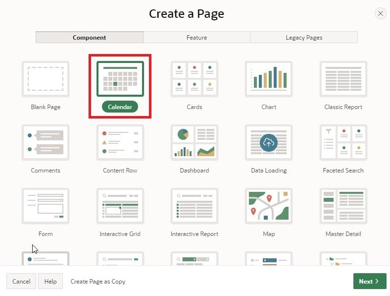

- Titel der Seite wird **Reservations**, die verwendete View ist **TUTOWF_RESERVATION_VW**. Nutzen Sie die **Navigation** und stellen das **Parent Navigation Menu Entry** auf **Home**. 

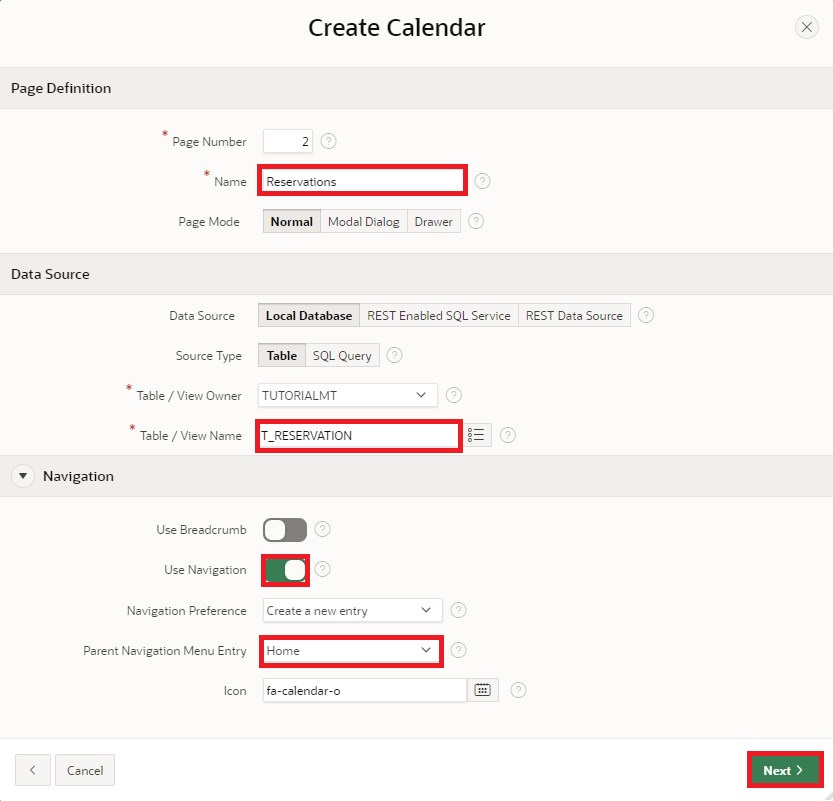

- Wählen Sie nun die folgenden Einstellungen: 

  | | |  
  |--|--|
  | **Display Column** | *RES_GUEST_LAST_NAME*|
  | **Start Date Column** | *RES_START_DATE* | 
  | **End Date Column** | *RES_END_DATE*|  
  | **Show Time** | *Yes*|
  | | |

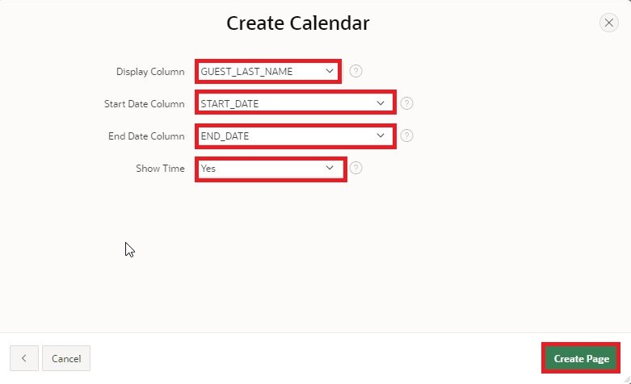

- Auf der neuen Seite 2 wählen Sie die **Region** **Reservations** aus. Setzen Sie unter **Attributes** die **Primary Key Column** auf **ID**. Unter **Supplemental Information** tragen Sie den folgenden Text ein: 

```
Table &RES_DINING_TABLE_ID.: &RES_GUEST_NAME. &RES_GUEST_LAST_NAME. with &RES_GUEST_COUNT. guests.
```
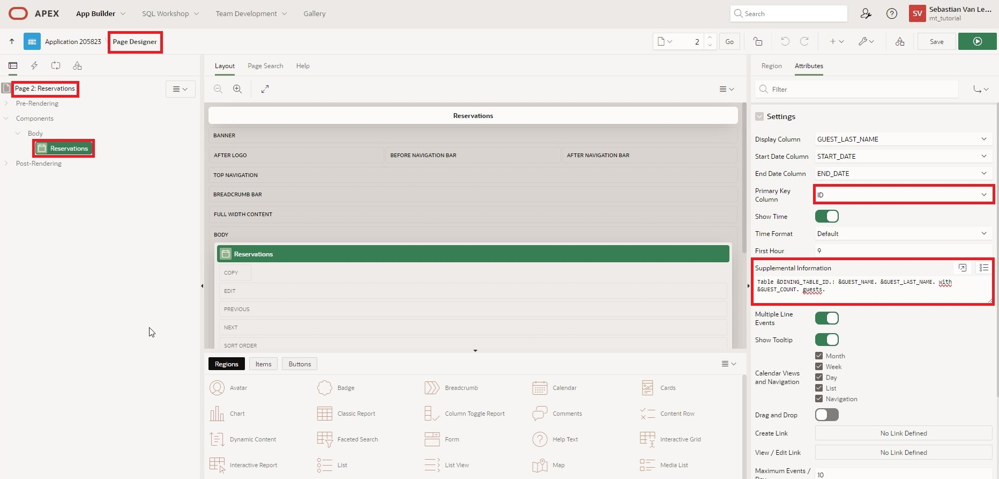

## <a name="workflow-anlegen-einer-unified-task-list"></a>21.7 Anlegen einer Unified Task List

- Legen Sie nun eine weitere neue Seite an, eine **Unified Task List**. Über diese Task List kann das Restaurant-Personal die eingegangenen Reservierungsanfragen ansehen und entscheiden.

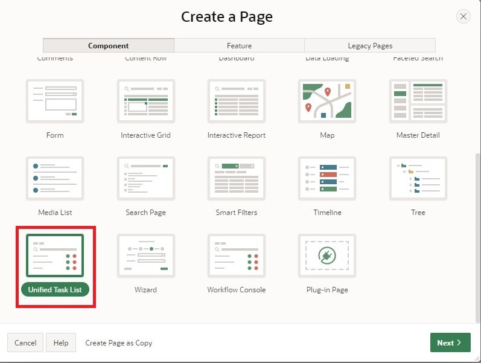

- Geben Sie der Seite den Namen **Incoming Reservations**, der **Report Context** ist **My Tasks**. Die Navigation stellen Sei auf **Create a new entry** unter dem Parent Entry **Home**. 

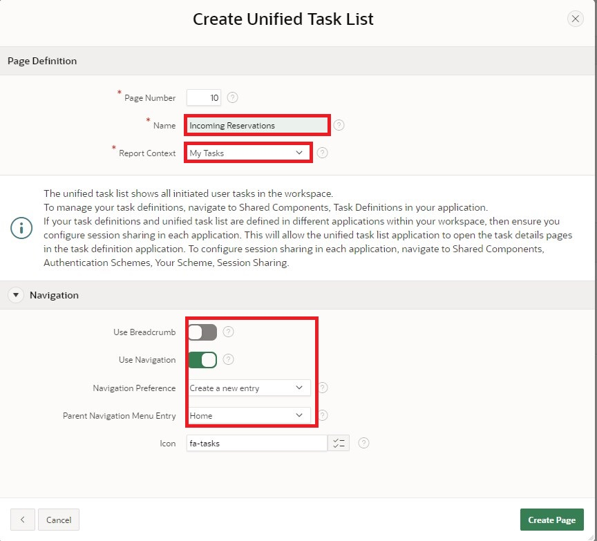

## <a name="anlegen-der-workflow-console"></a>21.8 Anlegen der Workflow Console

- Erstellen Sie im **App Builder** eine weitere Seite - Sie benötigen noch die **Workflow Console** mit der Sie eine Übersicht zum Stand der initiierten Workflows erhalten. 

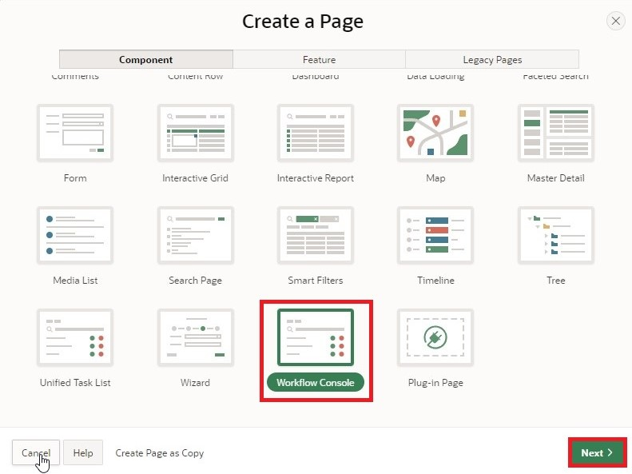

- Geben Sie der neuen Seite die Nummer **20** und den Namen **Workflows**. Der **Report Context** ist **Initiated by me**. Zu der Konsole wird direkt eine Detailseite erstellt. Geben Sie dieser **Form Page** die Nummer **21** und den Namen **Reservation Workflow Details**. In der Navigation können Sie wieder **Home** als neuen **Parent Navigation Menu Entry** auswählen.

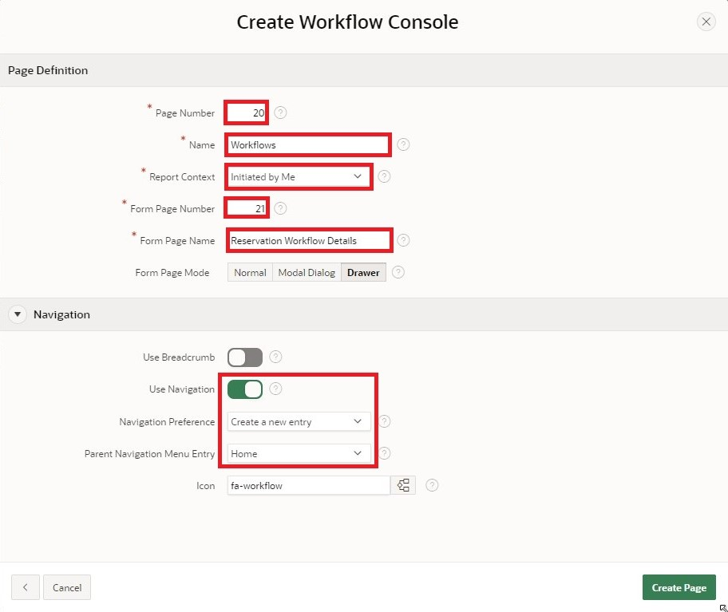

## <a name="workflow-application-logo-anpassen"></a>21.9 Application Logo anpassen

- Um die App noch etwas abzurunden, stellen Sie unter **Shared Components** unter **Application Definition** und dem Punkt **User Interface** ein neues Icon ein

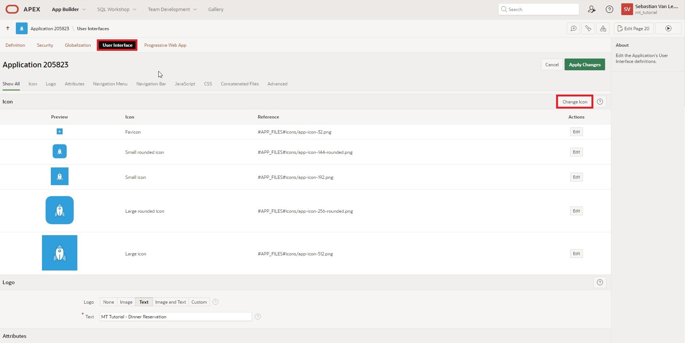

- Wählen Sie das Icon, das einem Kalender ähnelt und speichern Sie die Änderung.

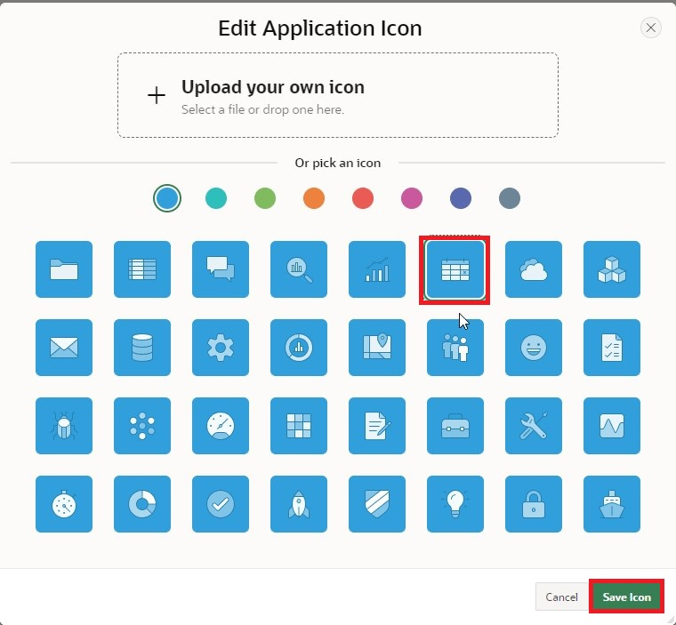

- Starten Sie die App und stellen unter **Customize** im **Theme Roller** das Theme auf **Vita - Dark**.

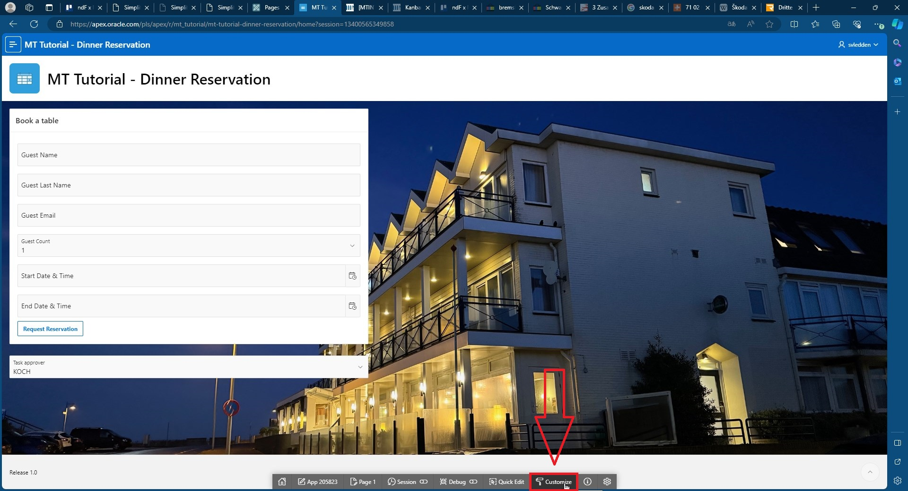

- Speichern Sie die Einstellungen.

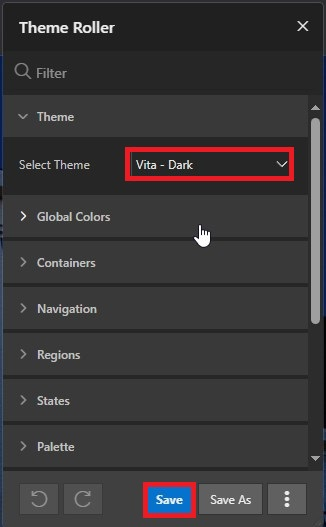

- Mit diesem Schritt ist die Application fertiggestellt! Im nächsten Abschnitt geht es noch auf eine kurze Erkundungstour durch die Reservierungsdemo.

## <a name="workflow-tour-durch-die-neue-app"></a>21.10 Tour durch die neue App

- Starten Sie die Tour mit einem Log-In mit Ihrem Account. Besuchen Sie das Reservierungsformular und schreiben eine Eingabe, die ähnlich der folgenden sein könnte (verwenden Sie idealerweise Ihre eigene E-Mailadresse). Schicken Sie die vollständige Eingabe ab.

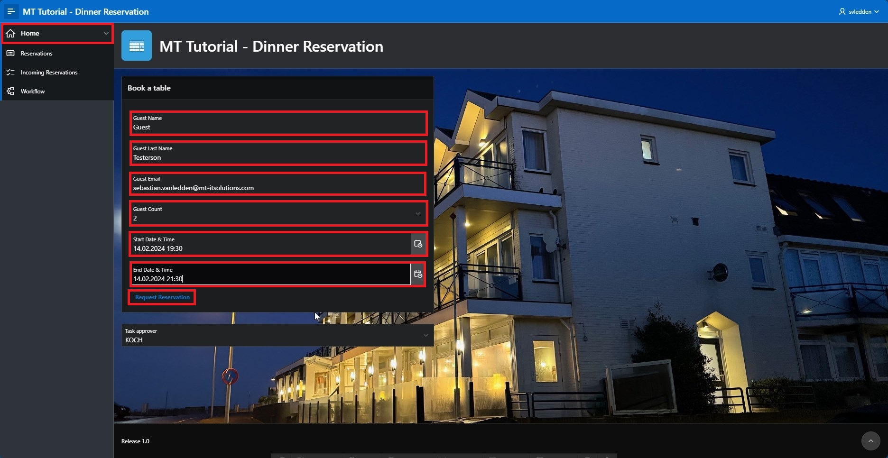

- Melden Sie sich danacht mit Ihrem Nutzer ab und danach als Nutzer **KOCH** wieder ein.

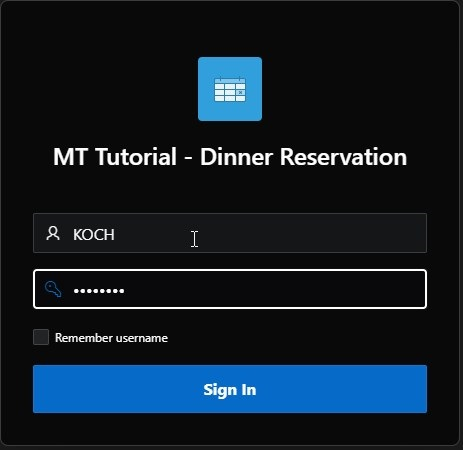

- Auf der Seite **Incoming Reservations** sollten Sie nun die eben erstellte Test-Reservierung sehen können.  

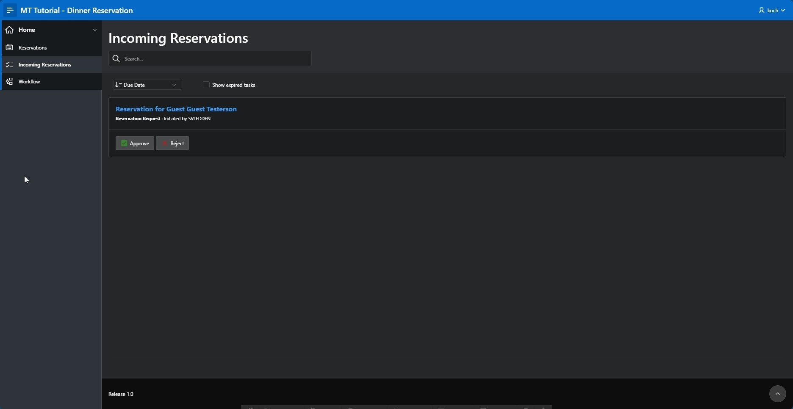

- Ein Klick auf den Titel führt zu den Details der Reservierung.

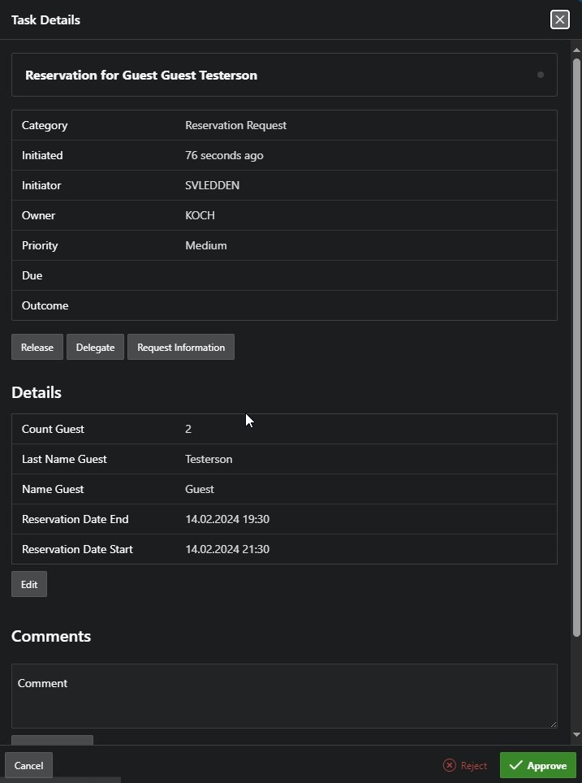

- Bestätigen Sie die Reservierung entweder über die Detail- oder die Übersichtsseite. Danach wechseln Sie auf die Seite **Reservations**. Die Testreservierung sollte nun im Kalender sichtbar sein. 

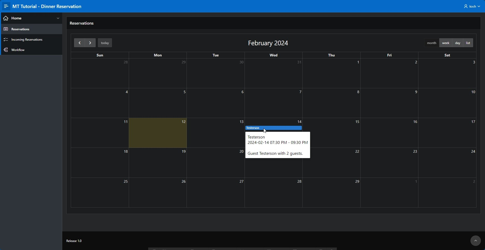

- Loggen Sie den Nutzer wieder aus und mit Ihrem eigenen Nutzernamen wieder ein. Auf der Seite **Workflows** erhalten Sie eine Übersicht zu den erstellten Workflows. Sie sollte jetzt den komplettierten Workflow aus der Test-Reservierung enthalten.

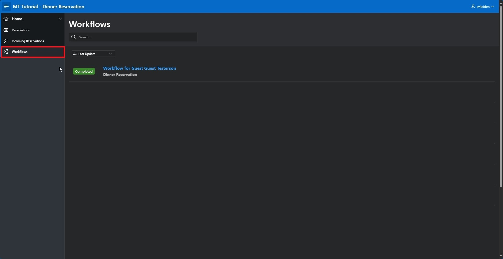

- Ein Klick auf den Titel des Workflows ruft die Detailsseite **Reservation Workflow Details** auf. Hier sehen Sie den Ablauf des Workflows und können Inhalte der Variablen und Parameter einsehen. 


- Zwischenzeitlich könnte die E-Mail bei Ihnen eingetroffen sein, mit der die Reservierung bestätigt wird. Sie sollte etwa folgendermaßen aussehen. 


- Damit haben Sie die Einführung in APEX Workflow erfolgreich beendet. Wir hoffen, dass wir Ihnen mit diesem Kapitel einen kleinen Einblick in die Möglichkeiten von APEX Workflow geben konnten!


# <a name="AI-basierte-Artikelgenerierung"></a>22. AI-basierte Artikelgenerierung für Webshops

In diesem Tutorial zeigen wir Ihnen, wie Sie mithilfe von KI automatisch Artikel für einen Webshop erstellen. Die KI wird verwendet, um für jedes Produkt Folgendes zu generieren:

- **Artikelname** 
- **Artikelbeschreibung** 
- **Artikelpreis** 
- **Artikelbild (als URL)**

## <a name="Eine-View-erstellen"></a>1. Eine View erstellen

- Für die Bearbeitung dieser Aufgabe wird eine **View** benötigt. 

- Geben Sie Ihrer **View** den Namen ***TUTO_P0200_VW***:  

```sql
CREATE VIEW TUTO_P0200_VW AS
SELECT AIGE_ID
     , AIGE_NAME
     , AIGE_DESCRIPTION
     , AIGE_PRICE
     , AIGE_URL
     , AIGE_IMAGE
     , AIGE_MIME_TYPE
  FROM AI_GENERATED_ARTICLE
;
```

1. Anschließend erstellen Sie eine neue Seite mit **Cards**:
  


## <a name="Konfiguration-des-Kartenlayouts"></a>2. Konfiguration des Kartenlayouts

1. Erstellen Sie die Seite mit der Nummer 200 und wählen Sie die View ***TUTO_P0200_VW*** aus. Klicken Sie anschließend auf **Next**:

  | | |  
  |--|--|
  | **Page Number** | *200* | 
  | **Name** | *Webshop*| 
  | **Table/View Name** | *TUTO_P0200_VW*| 
  | | |


2. Wählen Sie auf der Seite das **Grid-Layout** für die Karten aus und definieren Sie es wie folgt:

  | | |  
  |--|--|
  | **Title** | *AIGE_NAME* | 
  | **Body** | *AIGE_DESCRIPTION*| 
  | **Badge** | *AIGE_PRICE*| 
  | | |

3. Klicken Sie anschließend auf **Create Page**:


## <a name="Region-Erstellen"></a>3. Region Erstellen

1. Erstellen Sie eine neue Region mit dem Namen: **Define a new Article**:
  
  | | |  
  |--|--|
  | **Name** | *Define a new Article* |  
  | | |


## <a name="Erstellung-eines-Textfelds-und-eines-Buttons"></a>4. Erstellung eines Textfelds und eines Buttons

1. Erstellen Sie ein neues APEX **Text Item** mit dem Namen: `P200_NEW_ARTICLE`

  | | |  
  |--|--|
  | **Name** | *P200_NEW_ARTICLE* | 
  | **Label** | *New Article*| 
  | | |


2. Erstellen Sie einen neuen Button mit dem Namen: `P200_ADD_ARTICLE`

  | | |  
  |--|--|
  | **Button Name** | *P200_ADD_ARTICLE* | 
  | **Label** | *Add Article*| 
  | **Button Template** | *Text with Icon*| 
  | **Icon** | *fa-cart-plus*|  
  | | |


3. Setzen Sie die folgenden Einstellungen für das Button-Design fest:
  
  | | |  
  |--|--|
  | **Size** | *Large* | 
  | **Type** | *Success*| 
  | **Icon Hover Animation** | *Push*| 
  | **Width** | *Stretch*|  
  | | |


4. Speichern Sie die Seite und öffnen Sie die Vorschau. Jetzt sollten Sie ein Sucheingabefeld und einen **Add**-Button sehen, jedoch ist die **Card Report**-Region noch leer. Das Ziel besteht darin, die Artikel mithilfe einer Funktion hinzuzufügen.
  


## <a name="Erstellung-eines-Pakets-für-den-AI-Webshop"></a>5. Erstellung eines Pakets für den AI-Webshop

1. Als Nächstes erstellen Sie ein Paket, um die Funktionen und Prozeduren zur automatisierten Artikelerstellung zu speichern:

- 1. Klicken Sie auf **SQL Workshop**.
- 2. Wählen Sie anschließend **Object Browser** aus.
- 3. Klicken Sie auf das kleine **Plus-Symbol** neben der Suchleiste.
- 4. Wählen Sie dann **Package** aus, um ein neues Paket zu erstellen.
  


2. Als Nächstes öffnet sich ein **Popup-Fenster**. Tragen Sie hier den Namen **AI_WEBSHOP** ein. 
Schalten Sie die Option **Include Sample Code** aus, sodass sie grau wird. Drücken Sie anschließend auf **Create Package**.


### <a name="Erstellung-der-Paketspezifikation">5.1. Erstellung der Paketspezifikation (Package Specification)

1. Hier ist der Code für die Paketspezifikation, um die Funktionen und Prozeduren zu speichern:

```sql
create or replace PACKAGE AI_WEBSHOP AS

    -- Function to get a response from ChatGPT (returns text as CLOB)
    FUNCTION get_chatgpt_response(p_prompt IN VARCHAR2) 
    RETURN CLOB;

    -- Function to get an image URL from DALL·E (returns the image URL as VARCHAR2)
    FUNCTION get_dalle_image(p_prompt IN VARCHAR2) 
    RETURN VARCHAR2;

    -- Procedure to generate an article and store it in the database
    PROCEDURE generate_article(
        p_new_article IN VARCHAR2
    );

END AI_WEBSHOP;
/
```
2. Nachdem Sie den Code eingefügt haben, klicken Sie auf den Button **Speichern und Kompilieren**.
  


### <a name="Erstellung-des-Package-Body">5.2. Erstellung des Package Body

1. Hier ist der Code für den Package Body:

Hinweis: Suchen Sie im Code nach der Variable **l_api_key** in den Funktionen **get_chatgpt_response** und **get_dalle_image**. 
Ersetzen Sie dort den Platzhalter `'Bearer API_KEY'` durch Ihren gültigen API-Schlüssel.

In beiden Funktionen an folgender Stelle: 
```sql
l_api_key VARCHAR2(500) := 'Bearer API_KEY';
```


```sql
create or replace PACKAGE BODY AI_WEBSHOP AS

    -- Function to get a response from ChatGPT (returns text as CLOB)
    FUNCTION get_chatgpt_response(p_prompt IN VARCHAR2) 
    RETURN CLOB
    IS
        l_response          CLOB;
        l_url               VARCHAR2(500) := 'https://api.openai.com/v1/chat/completions';
        l_body              CLOB;
        l_chat_response     CLOB; -- Variable to store the chat response
        l_api_key           VARCHAR2(500) := 'Bearer API_KEY'; -- An dieser Stelle muss der gültige API-Schlüssel eingefügt werden:
    BEGIN
        -- Set necessary headers for JSON Content-Type and Authorization
        apex_web_service.g_request_headers(1).name := 'Content-Type';
        apex_web_service.g_request_headers(1).value := 'application/json';
        apex_web_service.g_request_headers(2).name := 'Authorization';
        apex_web_service.g_request_headers(2).value := l_api_key; 
        
        -- Body for the POST request with the prompt, provided by the user
        l_body := '{
            "model": "gpt-3.5-turbo",
            "messages": [{"role": "user", "content": "' || p_prompt || '"}],
            "max_tokens": 100
        }';

        -- Execute the POST request
        l_response := apex_web_service.make_rest_request(
            p_url => l_url,
            p_http_method => 'POST',
            p_body => l_body
        );

        -- Parse the response using JSON_TABLE to extract the description
        FOR r IN (
            SELECT message_content
            FROM JSON_TABLE(
                l_response, '$'
                COLUMNS (
                    message_content CLOB PATH '$.choices[0].message.content'
                )
            )
        ) LOOP
            -- Store the chat response in the variable
            l_chat_response := r.message_content;
        END LOOP;

        -- Return the extracted response
        RETURN l_chat_response;

    EXCEPTION
        WHEN OTHERS THEN
            RETURN 'Error: ' || SQLERRM;
    END;


    -- Function to get an image URL from DALL·E (returns the image URL as VARCHAR2)
    FUNCTION get_dalle_image(p_prompt IN VARCHAR2) 
    RETURN VARCHAR2
    IS
        l_response          CLOB;
        l_url               VARCHAR2(500) := 'https://api.openai.com/v1/images/generations';
        l_body              CLOB;
        l_image_url         VARCHAR2(1000);                     -- To store the image URL from the API response
        l_blob              BLOB;                               -- To store the downloaded image as BLOB
        l_api_key           VARCHAR2(500) := 'Bearer API_KEY';  -- An dieser Stelle muss der gültige API-Schlüssel eingefügt werden:
    BEGIN
        -- Set necessary headers for JSON Content-Type and Authorization
        apex_web_service.g_request_headers(1).name := 'Content-Type';
        apex_web_service.g_request_headers(1).value := 'application/json';
        apex_web_service.g_request_headers(2).name := 'Authorization';
        apex_web_service.g_request_headers(2).value := l_api_key;
        
        -- Body for the POST request with the prompt, provided by the user
        l_body := '{
            "prompt": "' || p_prompt || '",
            "n": 1,
            "size": "256x256"
        }';

        -- Execute the POST request to generate the image
        l_response := apex_web_service.make_rest_request(
            p_url => l_url,
            p_http_method => 'POST',
            p_body => l_body
        );

        -- Parse the response to extract the image URL
        FOR r IN (
            SELECT image_url
            FROM JSON_TABLE(
                l_response, '$'
                COLUMNS (
                    image_url VARCHAR2(1000) PATH '$.data[0].url'
                )
            )
        ) LOOP
            -- Store the image URL in the variable
            l_image_url := r.image_url;
        END LOOP;

        -- Return the URL containing the image
        RETURN l_image_url;

    EXCEPTION
        WHEN OTHERS THEN
            -- If an error occurs, return NULL or handle it accordingly
            RETURN NULL;
    END;


    -- Procedure to generate an article and store it in the database
    PROCEDURE generate_article(
        p_new_article IN VARCHAR2
    ) 
    IS
        v_article        CLOB;
        v_article_desc   CLOB;
        v_AIGE_URL       VARCHAR2(1000);
        v_AIGE_PRICE     CLOB;
        v_AIGE_PRICE_nr  NUMBER;
    BEGIN

        -- Get the article name from ChatGPT
        v_article := get_chatgpt_response(
            'I have an online shop. Please provide the perfect name for this product, limited to a maximum of 80 characters. The product is: ' || p_new_article
        );

        -- Get the article description from ChatGPT
        v_article_desc := get_chatgpt_response(
            'I have an online shop. Please provide the perfect description for this product, limited to a maximum of 4000 characters. The product is: ' || p_new_article
        );

        -- Get the image URL from DALL·E
        v_AIGE_URL := get_dalle_image(
            'I have an online shop. Please generate the perfect image for this product. The product is: ' || p_new_article
        );

        -- Get the price from ChatGPT
        v_AIGE_PRICE := get_chatgpt_response(
            'I have an online shop. Please provide the perfect price for this product as a number, formatted like 22.40 with no currency symbol. The product is: ' || p_new_article
        );


        -- Convert the price to a number
        v_AIGE_PRICE_nr := TO_NUMBER(v_AIGE_PRICE);

        -- Insert the generated article into the AI_GENERATED_ARTICLE table
        INSERT INTO AI_GENERATED_ARTICLE (AIGE_NAME, AIGE_DESCRIPTION, AIGE_URL, AIGE_PRICE)
        VALUES (v_article, v_article_desc, v_AIGE_URL, v_AIGE_PRICE_nr);

        -- Commit the transaction
        COMMIT;

        DBMS_OUTPUT.put_line('Article successfully generated and stored.');

    EXCEPTION
        WHEN OTHERS THEN
            DBMS_OUTPUT.put_line('Error: ' || SQLERRM);
            ROLLBACK;
    END generate_article;

END AI_WEBSHOP;
/
```
2. Nachdem Sie den API-Schlüssel eingefügt haben, klicken Sie auf den Button **Speichern und Kompilieren**.
  


Zusammenfassung:
- **`get_chatgpt_response`** → Diese Funktion holt eine Antwort von der KI für den Artikelnamen und die Beschreibung.
- **`get_dalle_image`** → Diese Funktion holt eine URL für das KI-generierte Bild.
- **`generate_article`** → Diese Prozedur generiert den Artikel basierend auf dem Artikelnamen und speichert ihn in der Datenbank.

## <a name="Erstellung-des-Prozesses-zum-Hinzufügen-eines-Artikels">6. Erstellung des Prozesses zum Hinzufügen eines Artikels

1. Gehen Sie nun zurück zum **Page Designer** auf Seite 200 und erstellen Sie einen neuen Prozess mit den folgenden Einstellungen:

  | | |  
  |--|--|
  | **Page** | *200* | 
  | **Process Name** | *Generate new article*| 
  | **Type** | *Invoke API*| 
  | **Package** | *AI_WEBSHOP*|  
  | **Procedure or Function** | *GENERATE_ARTICLE*|  
  | | |


2. Fügen Sie eine Erfolgsmeldung hinzu und stellen Sie sicher, dass der Prozess nur ausgeführt wird, wenn der entsprechende Button geklickt wird.
  
  | | |  
  |--|--|
  | **Success Message** | *The article has been successfully generated by AI and is now available in the webshop!* | 
  | **When Button Pressed** | *P200_ADD_ARTICLE*| 
  | | |


## <a name="Erstellung-des-Prozesses-zum-Hinzufügen-eines-Artikels">7. Überprüfung des Parameters `p_new_article`

1. Stellen Sie sicher, dass der Parameter `p_new_article` korrekt mit dem Item verbunden ist. Falls dies nicht der Fall ist, kann die Verbindung manuell vorgenommen werden.
  
  | | |  
  |--|--|
  | **Name** | *p_new_article* | 
  | **Item** | *P200_NEW_ARTICLE*| 
  | | |


## <a name="Endgültige-Seitenvorschau">8. Endgültige Seitenvorschau

1. Sobald die Benutzeroberfläche vollständig ist, sollte die Seite in etwa so aussehen. Sie können nun einen Artikelnamen eingeben und auf den **Artikel hinzufügen**-Button klicken.
  


2. Nach etwa 5-10 Sekunden wird die KI den Artikel generieren, und Sie sollten den Artikel in der **Kartenansicht** sehen können, jedoch zunächst ohne Bild.
  


## <a name="Bild-URL-hinzufügen">9. Bild-URL hinzufügen

1. Um das Bild als URL zu integrieren, setzen Sie die folgenden Einstellungen, speichern Sie und laden Sie die Seite neu.
    
  | | |  
  |--|--|
  | **Card Region** | *Webshop* | 
  | **Media** | **| 
  | **Source** | *URL Column*| 
  | **Appearance** | *Widescreen*| 
  | **Sizing** | *Cover*| 
  | | |


2. Jetzt können Sie weitere Artikel erstellen, und das Endergebnis sollte in etwa so aussehen:
  


<br><br>
Herzlichen Glückwunsch!  
Sie haben das Tutorial erfolgreich beendet.
 
Falls Sie noch mehr über APEX lernen wollen, schauen Sie doch mal auf unserem APEX Portal vorbei:  
[apex.mt-itsolutions.com/from-zero-to-hero](https://apex.mt-itsolutions.com/from-zero-to-hero)

Wenn Sie die nächsten Schritte mit APEX gehen oder Ihre Kenntnisse im Bereich JavaScript oder Continous Integration erweitern wollen, bieten wir Ihnen individuelle Schulung an!
Besuchen Sie dazu unser Trainingsportal [https://apex.mt-itsolutions.com/ords/r/portal/apex/training](https://apex.mt-itsolutions.com/ords/r/portal/apex/training).
