# Inhaltsverzeichnis

- [Vorbereitung](#vorbereitung)
- [1. Import der benötigten Daten](#datenimport)
    - [1.1 Skript](#skript)
    - [1.2 Import des Skripts](#skriptimport)
    - [1.3 Datenmodellierung mittels Quick SQL](#datenmodellierung)
- [2. Create App Wizard](#create)
    - [Erstellen einer Anwendung](erstelleneineranwendung)
    - [Report](#report)
    - [Create Application](#createapplication)
    - [Run Page](#runpage)
- [3. Zugriff auf Views statt auf Tabellen vornehmen](#views)
    - [Tools](#tools)
    - [Page Processes](#pageprocesses)
- [4. Interactive Grid](#interactivegrid)
    - [Erstellung der View](#gridview)
    - [Create Page](#gridcreatepage)
- [5. Master-Detail-Detail](#master-detail-detail)
    - [Erstellung der Views](#erstellung-der-views)
    - [Erstellung einer Master-Detail-Detail Seite](#erstellung-einer-master-detail-detail-seite)
    - [Popup List of Values](#popup-list-of-values)
- [6. Charts](#charts)
    - [Erstellung der View](#charts-erstellung-der-view)
    - [Charts Region](#charts-region) 
- [7. Cards Region](#cards-region)
    - [View erstellen](#cards-view-erstellen)
    - [Seite erstellen](#cards-seite-erstellen)
    - [Cards mit Bild erstellen](#cards-mit-bild-erstellen)
- [8. Faceted Search](#faceted-search)
    - [Erstellung der View](#fs-erstellung-der-view)
    - [Create Page](#fs-create-page)
    - [Create Facets](#fs-create-facets)
- [9. Smart Filters](#smart-filters)
    - [Erstellung der View](#sf-erstellung-der-view)
    - [Create Page](#sf-create-page)
    - [Create Filters](#sf-create-filters)  
- [10. REST Data Sources](#rest-data-sources)
    - [RESTful Service erstellen](#restful-service-erstellen)
    - [REST Data Source erstellen](#rest-data-source-erstellen)
    - [Senden von Daten an eine REST-Datenquelle](#senden-von-daten-an-eine-rest-datenquelle)
    - [Abrufen von Daten aus einer REST Data Source](#abrufen-von-daten-aus-einer-rest-data-source) 
- [11. Karten erstellen](#karten-erstellen)
    - [REST Data Source](#karten-rest-data-source)
    - [Erstellen der Karte auf einer neuen Anwendungsseite](#erstellen-der-karte-auf-einer-neuen-anwendungsseite) 

# Vorbereitung

Herzlich Willkommen bei dem Workshop „Hands-On APEX 24.1“ der Hyand.
Bevor Sie mit der Bearbeitung dieses Tutorials beginnen können, müssen Sie einen Workspace auf den Servern von Oracle beantragen. Dies können Sie innerhalb weniger Minuten unter [apex.oracle.com](apex.oracle.com) erledigen.

Falls Sie die Möglichkeit nutzen möchten, englischsprachige Tutorials zu bearbeiten, gibt es unter dem folgenden Link die Möglichkeit, dies zu tun. Klicken Sie einfach auf [https://apex.oracle.com/en/learn/tutorials/](https://apex.oracle.com/en/learn/tutorials/) und bearbeiten Sie die von APEX bereitgestellten Tutorials, wenn Sie noch einen größeren Einblick in die Welt von APEX erhalten möchten.  

# <a name="datenimport"></a> 1. Import der benötigten Daten 

## <a name="skript"></a> 1.1 Skript

Ein Skript ist eine Liste von Befehlen zur Automatisierung von Prozessen. In diesem Fall erzeugt das Skript Tabellen und Sequenzen. Außerdem werden die Tabellen durch das Skript mit Daten befüllt.

Tabellen sind die Grundeinheit des Datenspeichers einer Oracle-Datenbank. In ihnen werden Daten in Zeilen und Spalten gespeichert. Eine Zeile ist eine Sammlung von Spalteninformationen, die einem einzelnen Datensatz entsprechen. Die Spalten definieren die Datentypen der einzelnen Daten einer Zeile. 

Bevor Sie mit dem Erstellen der Anwendung starten können, müssen Sie zunächst die benötigten Daten per SQL-Skript in die Datenbank Ihres Workspace laden.

Das Hochladen und Ausführen des Skripts sorgt dafür, dass alle Datenbankobjekte angelegt und alle Daten eingefügt werden. Anschließend können Sie in Ihrer Anwendung auf diese Daten zugreifen.

Verwenden Sie das beigefügte SQL-Skript (**Skript.sql**), um die Daten wie im Folgenden beschrieben zu importieren.

## <a name="skriptimport"></a> 1.2 Import des Skripts

- Navigieren Sie zum **SQL-Workshop**, indem Sie eine der zwei rot markierten Möglichkeiten wählen.

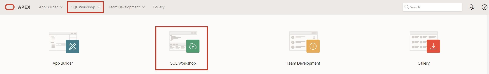 

- Wenn Sie sich im **SQL Workshop** befinden, klicken Sie dort auf **SQL Scripts**.

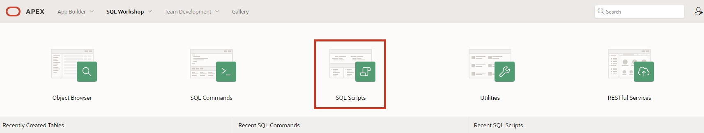

- Klicken Sie nun auf **Upload**.

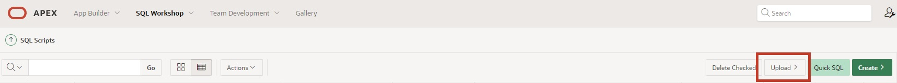

- Wählen Sie das Skript **Skript.sql** aus, welches sich in dem Ordner **Kapitel-01** befindet. Laden Sie das Skript durch Klicken auf den Upload-Button hoch bzw. ziehen Sie es in das vorgesehene Feld.

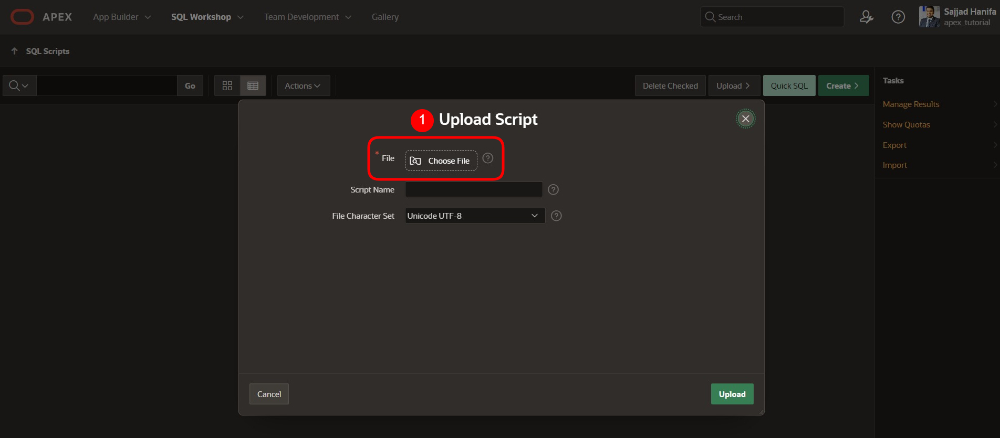

- Starten Sie das Skript, indem Sie auf den **Run**-Button drücken.

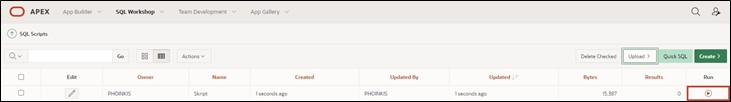

- Klicken Sie auf **Run Now**.

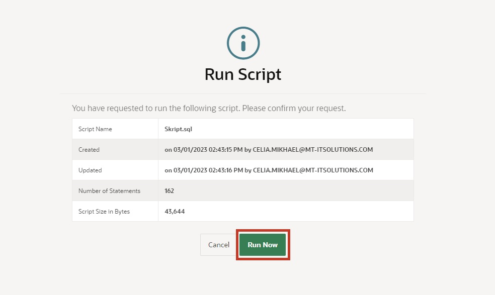

- Nach dem erfolgreichen Import sollten Sie folgendes Ergebnis sehen:

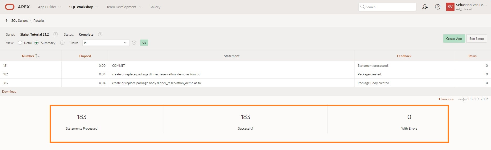

Es sollten jetzt alle Tabellen und Daten, welche für dieses Tutorial benötigt werden, in Ihrem Workspace vorhanden sein.  

## <a name="datenmodellierung"></a>1.3 Datenmodellierung mittels Quick SQL

Eine weitere Möglichkeit, Datenmodelle ohne viel Aufwand anzulegen, bietet Quick SQL.  
Wie das funktioniert, erfahren Sie in der <span style="color:red">**Aufgabe #14: Exkurs: Datenmodellierung mittels Quick SQL**</span>.

# <a name="create"></a>2. Create App Wizard

Der Create App Wizard ist ein Assistent, der es Entwicklern ermöglicht, Standard APEX-Anwendungen schnell zu entwerfen und zu entwickeln. Dabei kann der Assistent verwendet werden, um vollständige Anwendungen zu erstellen, die aus mehreren Seiten und einer Vielzahl von verschiedenen Reports und Forms bestehen.

In diesem Kapitel wird das Grundgerüst der Anwendung und die erste Seite erstellt. Im Create App Wizard geben Sie die Einstellungen für Ihre Anwendung an. Nachdem Sie auf Create Application geklickt haben, erstellt APEX die Anwendung mit Ihren Einstellungen.

## <a name="erstelleneineranwendung"></a>2.1 Erstellen einer Anwendung

- Für die weiteren Aufgaben muss zunächst eine **Anwendung** erstellt werden. Öffnen Sie hierzu als erstes den **App Builder**. Der App Builder zeigt alle installierten Anwendungen an. Klicken Sie nun auf den Button **Create**.

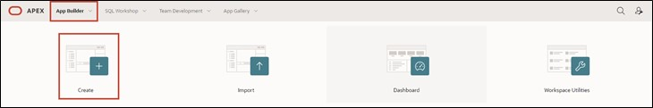

- Der Assistent zur Erstellung von Anwendungen wird gestartet. Klicken Sie auf Use Create App Wizard, um den Assistenten für eine neue Anwendung zu öffnen.

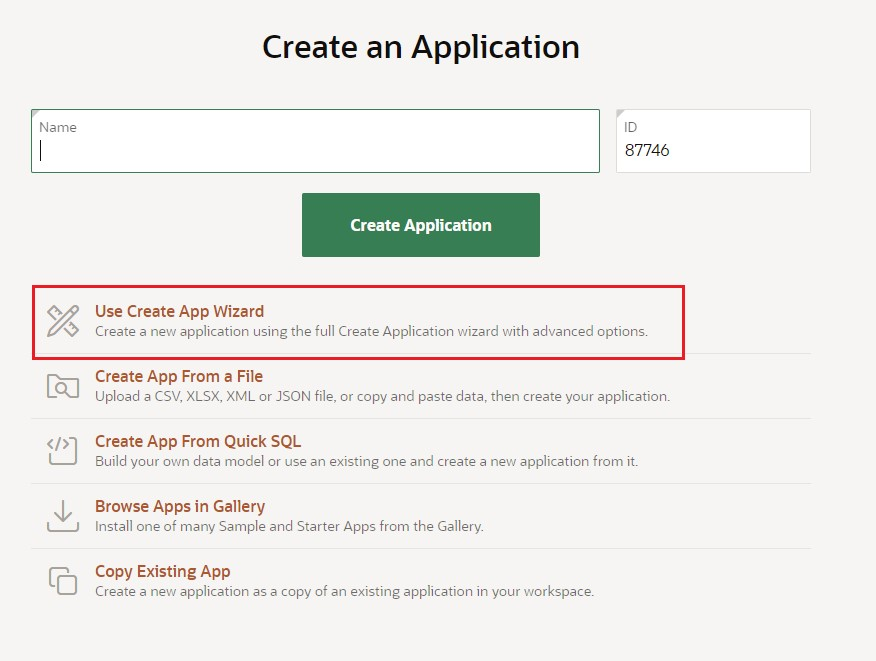

- Geben Sie jetzt den Namen der Anwendung ein (z.B. Tutorial 24.1).

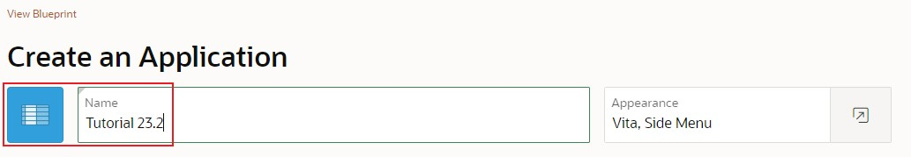

- Wenn gewünscht kann mit einem Klick auf den blauen Briefumschlag, links vom Namen, auch das Application Icon angepasst werden. Es öffnet sich ein Wizard, in dem ein Icon und eine Farbe ausgewählt oder ein eigenes Bild hochgeladen werden kann.

- Im Assistenten können Sie direkt eine erste Seite in Ihrer Anwendung erstellen. Dazu klicken Sie auf das Plus oder auf Add Page.

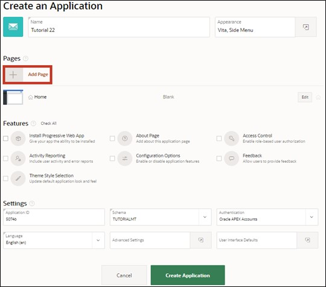

## <a name="report"></a>2.2 Report

In APEX ist ein Report eine formatierte Darstellung einer SQL-Abfrage. Ein Report kann über den Assistenten oder über eine händisch eingegebene SQL-Abfrage generiert werden.

APEX unterscheidet zwischen dem klassischen und dem interaktiven Report. Der Unterschied zwischen den beiden besteht darin, dass der Benutzer beim interaktiven Report die Möglichkeit hat, die Darstellung der Daten durch Suchen, Filtern, Sortieren, Spaltenauswahl, Hervorheben und andere Datenmanipulationen anzupassen.

- Nachdem Sie auf den Button geklickt haben, um eine Seite hinzuzufügen, öffnet sich ein neues Fenster mit einem Assistenten zur Erstellung der Seite. Dort wählen Sie **Interactive Report** aus.

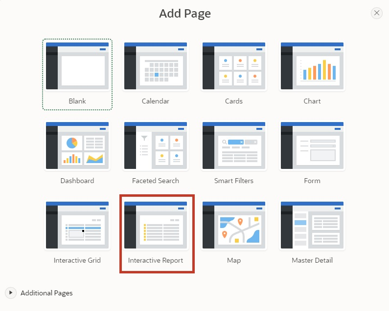

- Es folgen die Eigenschaften der Seite im nächsten Fenster. Als **Page Name** geben Sie ***STATES*** ein.
-	Die Einstellungen **Table or View** und **Interactive Report** sind standardmäßig ausgewählt. Falls das nicht der Fall ist, wählen Sie diese bitte aus.
-	Als nächstes klicken Sie auf das Dropdown-Menü rechts, um eine **Tabelle auszuwählen**, die im Interactive Report angezeigt werden soll. 

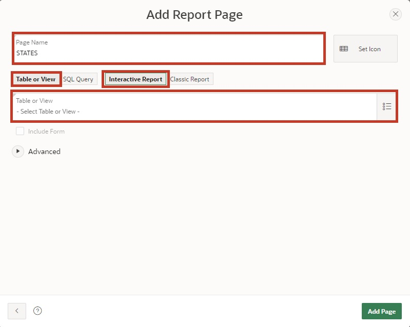

- Es öffnet sich der **Search Dialog**, wo Sie die Tabelle ***STATES*** auswählen.
- Setzen Sie das Häkchen für **Include Form** und klicken Sie anschließend auf den Button **Add Page**.

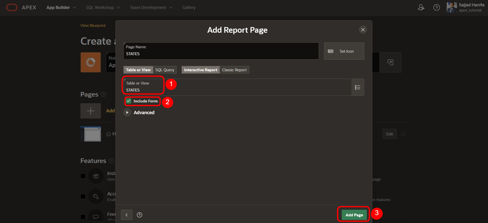
 
## <a name="createapplication"></a>2.3 Create Application

- So sollte Ihr Create App Wizard jetzt aussehen. 

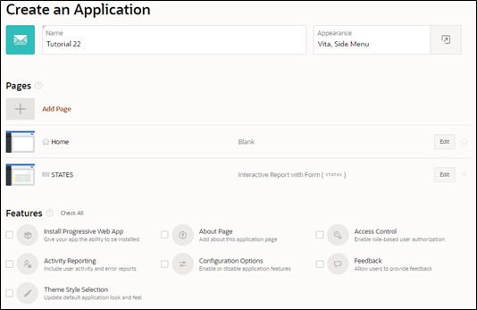

- Setzen Sie nun das Häkchen für das Feature **„Install Progressive Web App“**. Mit diesem Feature können APEX Anwendungen auf mobilen Endgeräten installiert und als eigenständige Anwendung verwendet werden. Mehr dazu erfahren Sie in <span style="color:red">**Aufgabe #07: Features für mobile Endgeräte**</span>. 

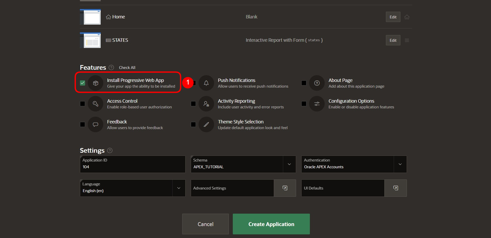

- Wenn Sie herunterscrollen, sehen Sie unter **Settings** die **Application ID**. Da Sie diese im weiteren Verlauf noch brauchen werden, ist es ratsam, sich diese zu notieren.  
Bei der Application ID handelt es sich um eine eindeutige Nummer, über welche die Anwendung im Browser aufgerufen werden kann.

- Nachdem Sie alle anderen Schritte absolviert haben, klicken Sie auf den **Create Application**-Button, um die Anwendung zu erstellen.

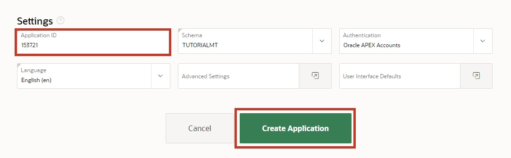
 
## <a name="runpage"></a> 2.4 Run Page

Nachdem Sie die Anwendung erstellt haben, öffnet sich die Seitenübersicht Ihrer Anwendung. 
Sie sehen fünf Seiten: **0 - Global Page - Desktop**, **1 - Home** und **9999 - Login Page** sind Standardseiten, die bei jeder Anwendung erstellt werden. Die Global Page ist eine Masterseite. Sämtliche Komponenten, die auf der Global Page angelegt werden, werden auf allen Seiten der Anwendung angezeigt. 
Die Seiten **2 - STATES** und **3 - State** haben Sie eben über den Add Page – Assistenten erstellt.
- Klicken Sie auf die markierte Schaltfläche, um die **Listenansicht** zu öffnen.

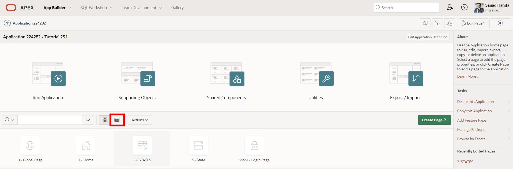

- Klicken Sie auf den **Run-Button** der ***STATES***-Seite, um die erstellte Seite anzusehen.

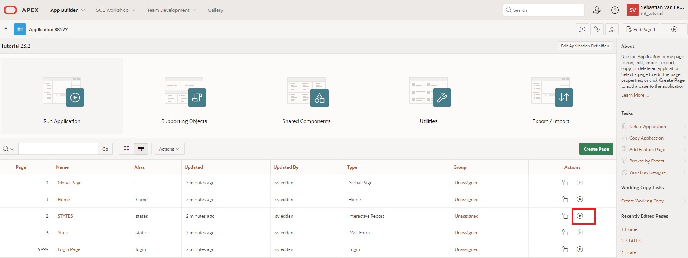

- Es erscheint ein Login-Bildschirm, wo Sie sich mit Ihrem Username und Ihrem Password (selbe Zugangsdaten wie für den Workspace) anmelden.

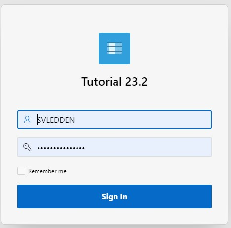

- Nach dem Login erscheint die Seite ***STATES*** mit einem Interactive Report.

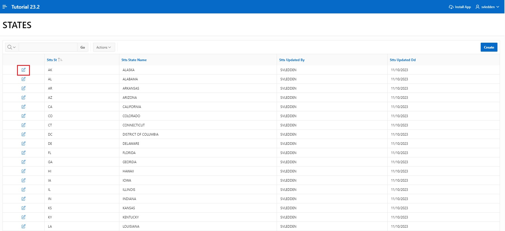

- Wenn Sie auf das **Stiftsymbol** in der linken Spalte klicken, öffnet sich ein modaler Dialog, in dem Sie die Daten ändern können.

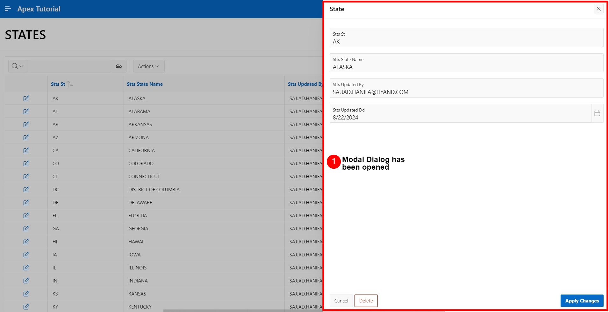

- Fürs Erste lassen wir die Inhalte so wie sie sind und schließen den modalen Dialog wieder (über den **Cancel**-Button oder das x oben in der Ecke).  

- Wechseln Sie nun zurück in den Tab **App Builder**. 

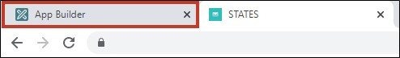

# <a name="views"></a>3. Zugriff auf Views statt auf Tabellen vornehmen

Um einen einheitlichen Zugriff auf die Daten zu gewähren, werden View-Schichten genutzt.  

Mit Views kann man leicht aus großen Tabellen nur die wichtigsten Spalten selektieren, um diese anzuzeigen.  

Bei einer View handelt es sich um eine in einer Datenbank gespeicherte SQL-Abfrage für Daten, welche von den Datenbankbenutzern genauso abgefragt werden kann, wie die Daten in einer Tabelle. Damit ist das Ergebnis einer View eine Art virtuelle Tabelle, die dynamisch aus Daten in der Datenbank generiert wird, wenn der Zugriff auf die View angefordert wird. Ändern sich Daten in der Tabelle, werden die Änderungen auf die View gespiegelt.   

  

Es bietet sich an, die Views auf zwei verschiedene Arten einzusetzen: Für jede APEX-Seite werden seitenspezifische Views erstellt. Diese enthalten die Informationen, die auf der spezifischen Seite angezeigt werden. Für jede Seite sollten daher eine oder mehrere Views angelegt werden.  

Sollen Views seitenübergreifend verwendet werden, sollte eine Business View erstellt werden.  

In diesem Tutorial wird ausschließlich auf seitenspezifische Views zurückgegriffen.   

Im Folgenden werden nun die Views erstellt und die Zugriffe, die auf die Tabellen erfolgen, auf die Views umgestellt.  
 
## <a name="tools"></a>3.1 Tools
Im SQL Workshop werden Werkzeuge bereitgestellt, mit denen Datenbankobjekte angezeigt, erstellt und verwaltet werden können.  

Eines der Werkzeuge ist **SQL-Commands**. In diesem können direkt SQL-Befehle eingegeben und ausgeführt werden.   

Ein weiters Werkzeug ist der **Object Browser**. Mit diesem können Objekteigenschaften angezeigt und bearbeitet werden. Ebenso können hierüber neue Objekte erstellt werden.   
Der **Object Browser** ist in zwei Bereiche unterteilt. Auf der linken Seite wird der Objektauswahlbereich angezeigt. Dort werden alle Datenbankobjekte eines bestimmten Typs aufgelistet, die im aktuellen Schema vorhanden sind. Auf der rechten Seite werden detaillierte Informationen zu den einzelnen Objekten angezeigt.   

- Navigieren Sie über das Dropdown-Menü **SQL Workshop** zu dem Eintrag **Object Browser**.   

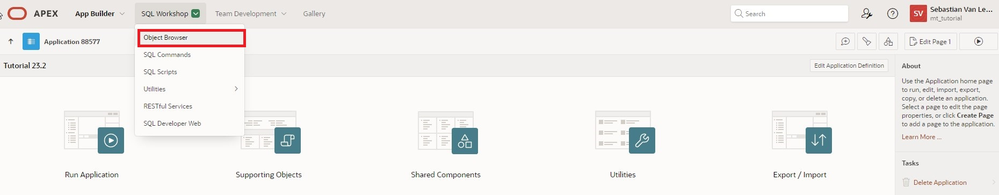  

- Starten Sie den Assistenten zum Erstellen einer View. Öffnen Sie dazu das Dropdown-Menü über das + und klicken auf den Eintrag View.  

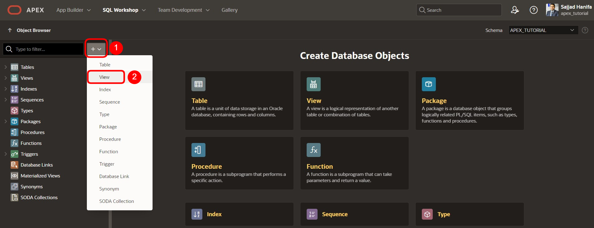  

Es öffnet sich ein Assistent zur Erstellung der View.    
Nun müssen Sie den entsprechenden Code sowie einen Namen für die View hinterlegen. Um eine einheitliche Benennung über verschiedene Anwendungen hinweg zu erzielen, empfiehlt sich die Verwendung von Namenskonventionen.  

In diesem Fall setzt sich die Bezeichnung der View wie folgt zusammen:  
**<APP_KUERZEL>_P<PAGE_ID>_VW**  

- Ersetzen Sie die Platzhalter mit den folgenden Werten:
  - <APP_KUERZEL>: Kürzel für Ihre Anwendung, z.B. TUTO für Tutorial
  - <PAGE_ID>: 0003 (Seitennummer, für die die View erstellt wird)  

- So könnte Ihre View beispielsweise **TUTO_P0003_VW** heißen.  
  Als **Query** (eine Abfrage, die gezielt nach Daten sucht) fügen Sie folgenden Code ein:
  ```sql
  select stts_id,
        stts_st,
        stts_state_name
  from states
  ```

- Achten Sie beim Einfügen auf die Formatierung der Abfrage. Sollte Ihre Formatierung nicht wie gezeigt aussehen, formatieren Sie sie entsprechend.  

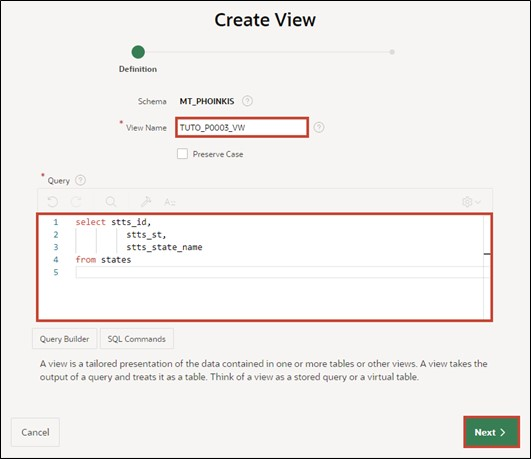

- Abschließend klicken Sie auf den Button **Create View**.  

- So sollte Ihre fertige View aussehen:  

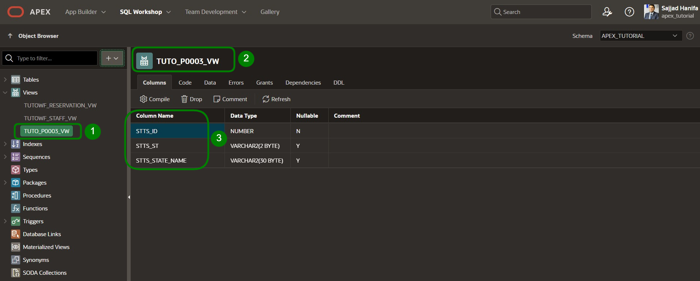  

## <a name="pageprocesses"></a>3.2 Page Processes
**Page Processes** werden zu bestimmten, festgelegten Zeitpunkten ausgeführt, beispielsweise beim Aufrufen der Seite oder beim Speichern. Durch sie werden Aufrufe der Applikationslogik oder Datenbank-Operationen realisiert. Für die Verarbeitung eines Formulars sind in APEX zwei Prozesse verantwortlich: **Form – Initialization** und **Form – Automatic Row Processing (DML)**.  

Beide werden automatisch beim Erstellen einer Formular-Seite mithilfe des Wizards generiert und sorgen dafür, dass die Eingabefelder beim Aufruf die richtigen Daten enthalten und dass die Werte beim Abschicken des Formulars in der entsprechenden Datenquelle gespeichert werden.  

Im Folgenden wird die erstellte View dem DML-Prozess zugeordnet und einige kleinere Änderungen am Formular vorgenommen.  

- Gehen Sie in den Page Designer, indem Sie oben in der Leiste auf den **App Builder** klicken, dann auf Ihre **Anwendung** und dann auf die Seite 3 - ***State***.  

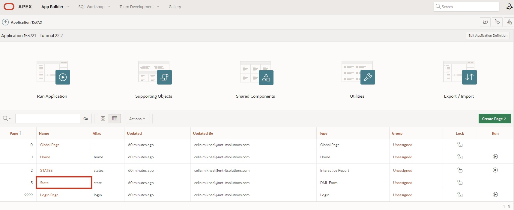  
  
- Klicken Sie auf die Region **State** und ändern Sie den **Table Name** auf die eben erstellte View ***TUTO_P0003_VW***.  

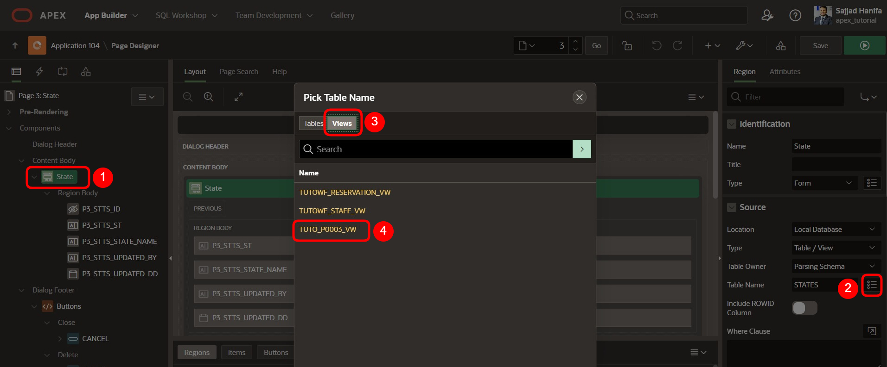  

- Klicken Sie nun auf den Reiter **Processing** (die beiden Pfeile links oben)  

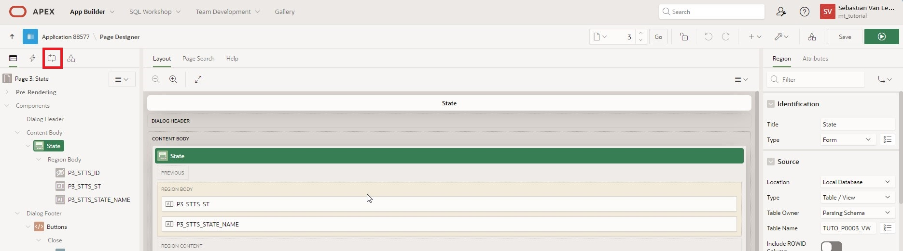  

- Wählen Sie den Process **Process form State** aus, um das Processing anzupassen.  

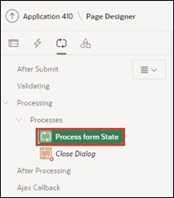  

- Ändern Sie den **Target Type** auf ***Region Source***.  

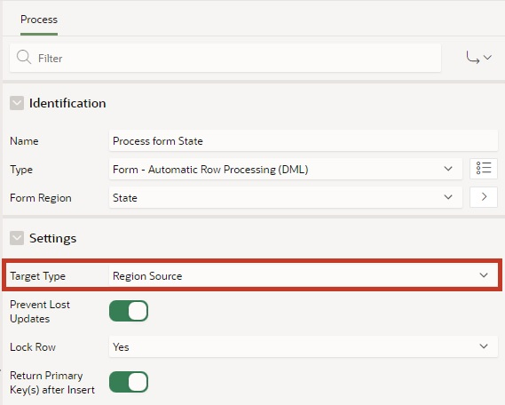  

Dies sorgt nun dafür, dass für das Processing die gleiche Quelle verwendet wird, wie für die Region. In unserem Fall ist das die eben erstellte View. 
Wird in der Zukunft die Datenquelle der Region geändert, muss das Processing nicht mehr angepasst werden.   

Wenn man in APEX Reports und Forms über den Wizard erstellt, werden die benötigten Standard-Processings (z.B. zum Einfügen oder Updaten von Daten) automatisiert erstellt.  

- Gehen Sie danach wieder in den ersten Reiter **Rendering** mit der Übersicht der Elemente auf der Seite und klicken Sie unter State – Items auf **P3_STTS_ID**. Prüfen Sie, ob der **Type** ***Hidden*** ist. Wenn nicht, ändern Sie ihn entsprechend ab.   

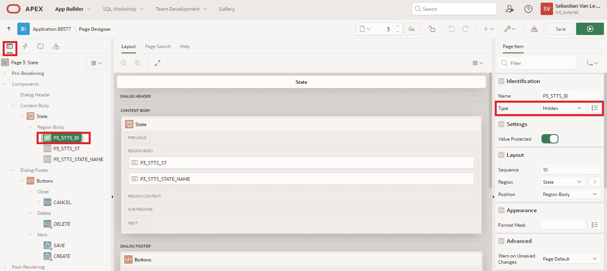  

- Klicken Sie anschließend auf **Save**.   

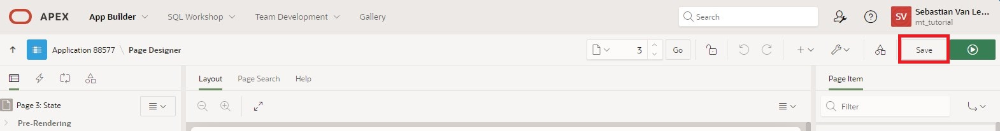  

- Wechseln Sie zur Seite ***STATES***, indem Sie den **Dialog** in der **Breadcrumb-Leiste** aufrufen und dort die Seite 2 ***STATES*** auswählen.  
 
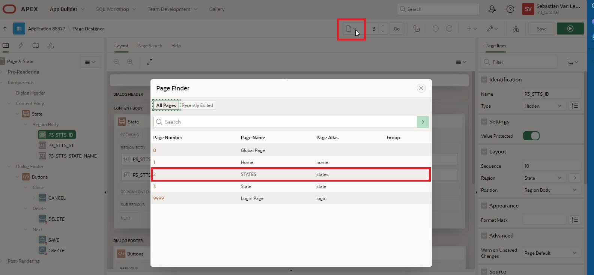  

- Im Page Designer klicken Sie im Bereich **States** unter Columns auf **STTS_UPDATED_BY** und setzen den **Type** auf ***Hidden Column***. Das gleiche wiederholen Sie für die Spalte **STTS_UPDATED_DD** und klicken anschließend auf **Save**. Nun werden die entsprechenden Spalten im Report ausgeblendet.  

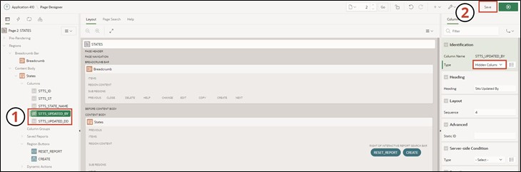  

- Wenn Sie jetzt die Anwendung im anderen Tab aktualisieren, können Sie Ihre Änderungen sehen.  

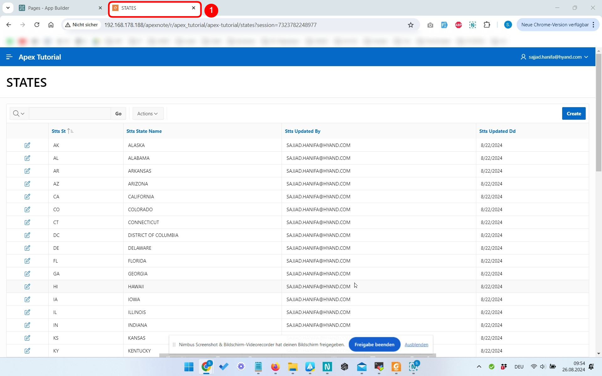


# <a name="interactivegrid"></a>4. Interactive Grid

Ein **Interactive Grid** zeigt dem Datenbankbenutzer eine Reihe von festgelegten Datensätzen in einem durchsuchbaren, anpassbaren Bericht an. In diesem Bericht können die Datensätze geändert und aktualisiert werden. Außerdem ist es möglich, neue Datensätze hinzuzufügen und alte zu löschen.

In dieser Aufgabe wird ein **Interactive Grid** angelegt, um die oben genannten Funktionen nutzen zu können.

## <a name="gridview"></a>4.1	Erstellung der View
- Für diese Aufgabe muss zuerst eine **View** erstellt werden.
Dazu gehen Sie wie in Aufgabe #03 über den **SQL Workshop** in den **Object Browser** und starten über das + den Assistenten zur Erstellung der **View**.  
Dort geben Sie folgende Daten ein:

- **View Name**: ***TUTO_P0021_VW***  
- **Query**:
  ```sql
  select PRDT_INFO_ID,
         PRDT_INFO_NAME,
         PRDT_INFO_DESCR,
         PRDT_INFO_CATEGORY,
         PRDT_INFO_AVAIL,
         PRDT_INFO_LIST_PRICE
  from PRODUCT_INFO
  ```

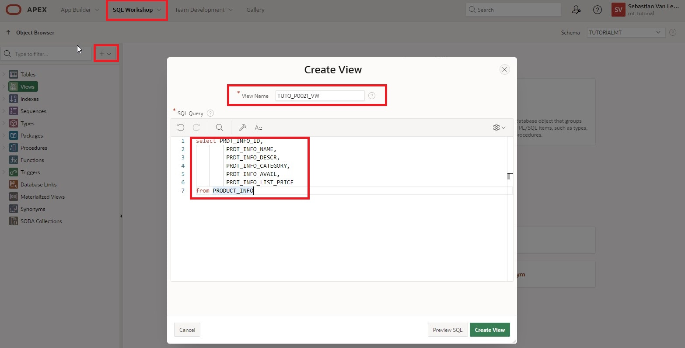

- Klicken Sie anschließend auf den Button **Next** und dann auf **Create View**.

## <a name="gridcreatepage"></a>4.2	Create Page
- Öffnen Sie den **App Builder** über die Navigationsleiste, wählen Sie Ihre Anwendung aus und klicken Sie auf den Button **Create Page**. 


- Es startet der **Assistent** zum Erstellen einer **Seite**.  
Wählen Sie den Seitentypen **Interactive Grid** aus. Der Wechsel zur nächsten Seite erfolgt automatisch, ansonsten klicken Sie auf den Button **Next**. 

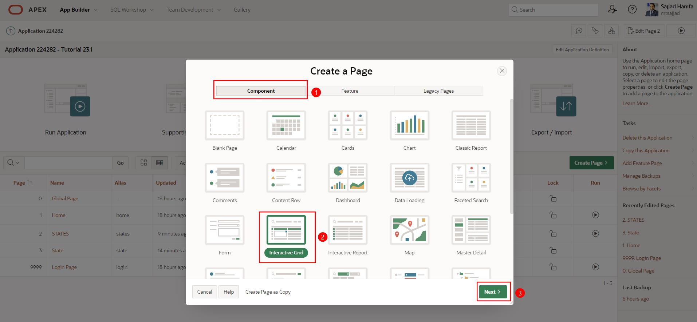

- Geben Sie als **Page Number** ***21*** ein und als **Page Name** ***Product Info***.
- Wählen Sie im Bereich Data Source die erstellte View zur *Product Info* als **Table / View** Name aus und aktivieren Sie nun die Bearbeitung im **Interactive Grid**, indem Sie **Editing Enabled** auf ***enabled*** stellen.  
Dies ist besonders wichtig, damit die Spalte APEX$ROW_SELECTOR erstellt werden kann.
- Öffnen Sie anschließend den Navigationsbereich.

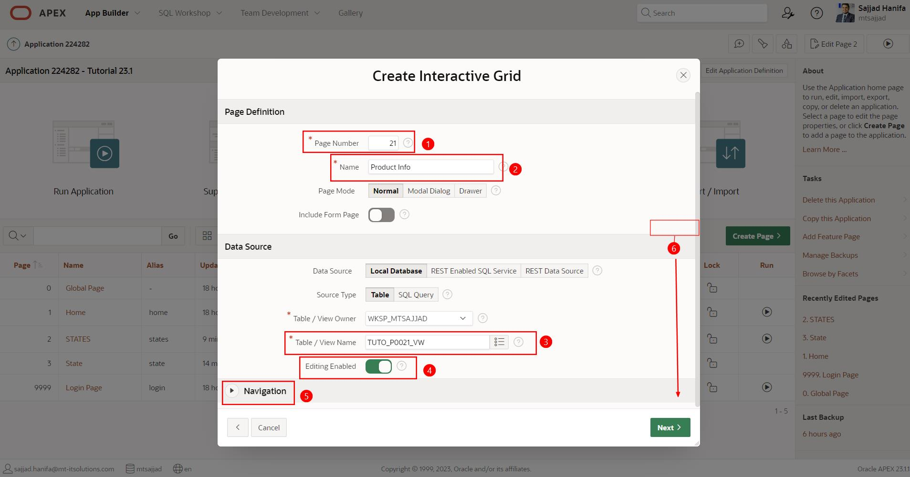

- Deaktivieren Sie hier die Breadcrumb und klicken Sie anschließend auf den Button **Next**. 

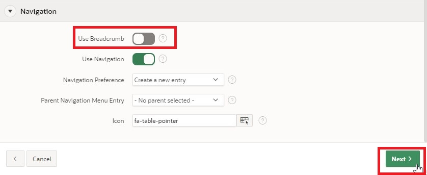

- Wählen Sie die Spalte ***PRDT_INFO_ID (Number)*** als **Primary Key Column 1** aus.

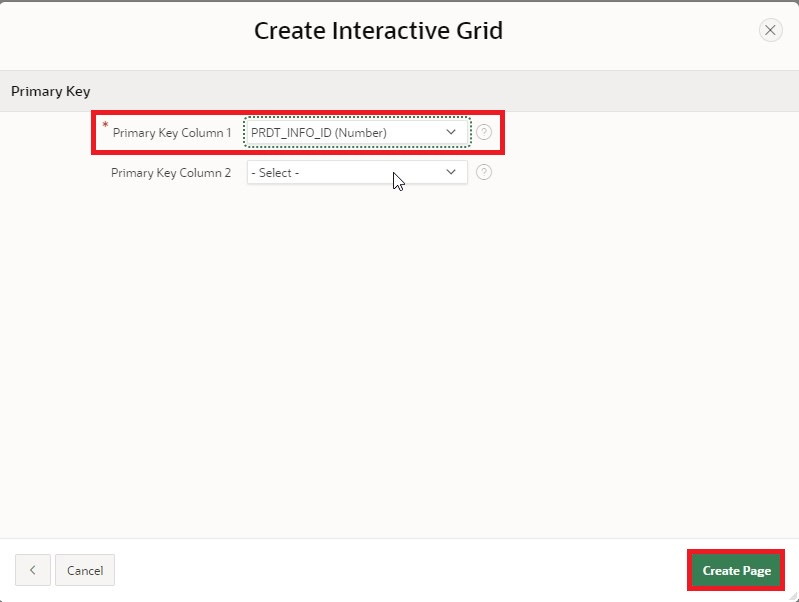

- Klicken Sie abschließend auf den Button **Create Page**.

- Die **Seite** mit dem **Interactive Grid** wurde erfolgreich erstellt. Starten Sie nun die **Seite**, indem Sie auf den **Run**-Button klicken

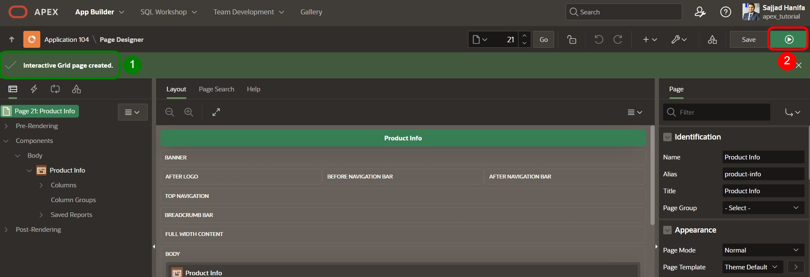

- Sie sehen nun das **Interactive Grid**. Zunächst bietet Ihnen das **Interactive Grid** einen Bericht über die bestehenden Daten. Über den Button **Add Row** können Sie einen neuen Datensatz direkt in dieser Tabelle anlegen.

- Außerdem können Sie bestehende Datensätze editieren. Hierzu können Sie mit einem **Doppelklick** einen Eintrag auswählen, woraufhin der Cursor in dem entsprechenden Feld angezeigt wird. Wenn der Edit-Modus aktiviert ist, reicht auch ein einfacher Klick aus. Über den Button **Edit** lässt sich dieser Modus aktivieren bzw. deaktivieren.

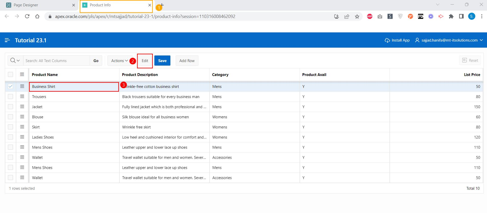

- Die von Ihnen durchgeführten Änderungen finden zunächst nur in Ihrem Browser statt. Um die Änderungen zu speichern, klicken Sie auf den Button **Save**. Alternativ können Sie auch unerwünschte Änderungen widerrufen, indem Sie das **Dropdown-Menü** ***Actions*** öffnen und hier den Eintrag ***Refresh*** unter ***Data*** auswählen. So werden die ursprünglichen Daten aus der Datenbank erneut geladen.

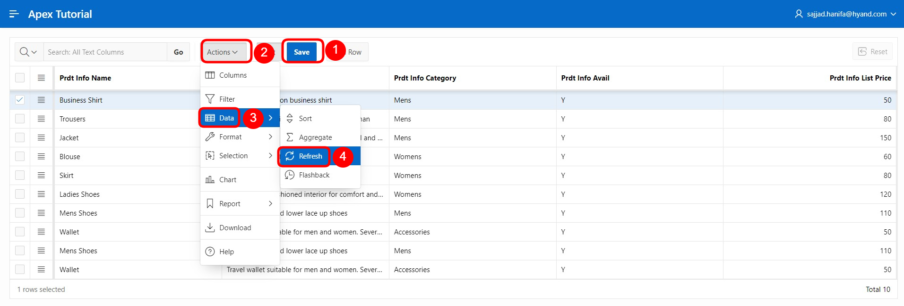

- Des Weiteren steht Ihnen eine Detailansicht einzelner Datensätze zur Verfügung. Klicken Sie dafür auf den kleinen Button links neben einem Datensatz und wählen Sie den Eintrag ***Single Row View***. 

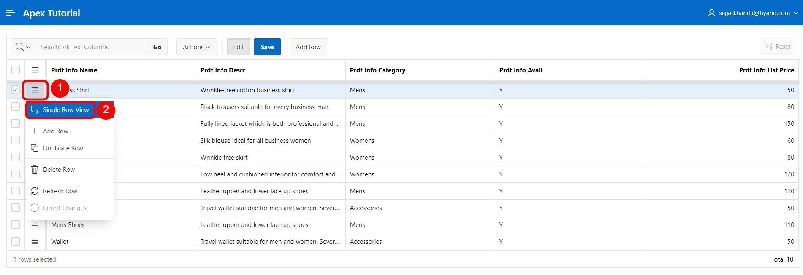

- Nun sehen Sie nur noch die Daten zum ausgewählten Datensatz. Über den Button **Report View** gelangen Sie wieder zurück zur Tabellenansicht.

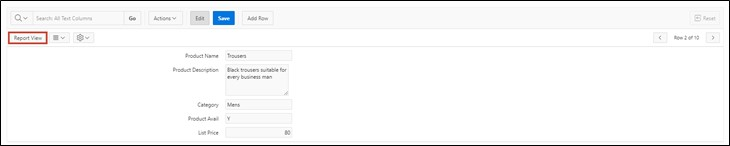

- Je nach Auflösung und Menge der angezeigten Spalten kann es passieren, dass horizontales Scrolling nötig wird

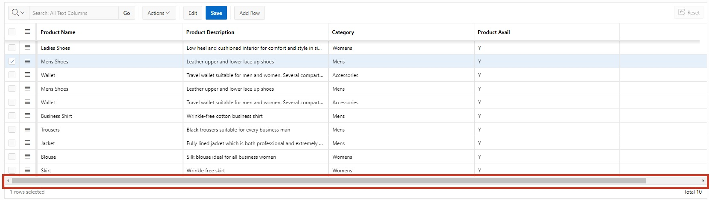

- Um dennoch den Überblick zu behalten, lassen sich Spalten fixieren. **Fixierte Spalten** bleiben bei horizontalem Scrollen stehen. Klicken Sie auf die **Spalte** ***Product Name*** und wählen das **Symbol** für ***Freeze*** aus.

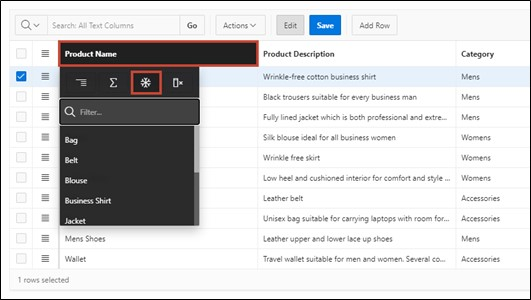
 
- Nun wird die Spalte *Product Name* fixiert dargestellt und es bleibt auch bei horizontalem Scrolling ersichtlich, auf welches Produkt sich die übrigen Spalten beziehen.

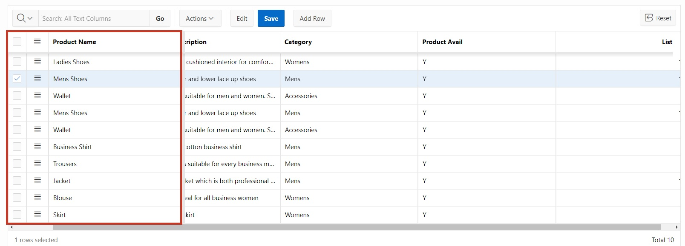


# <a name="master-detail-detail"></a>5. Master-Detail-Detail
Master – Detail Regionen sind praktisch, wenn man auf einer Seite Daten aus voneinander abhängigen Tabellen darstellen möchte.

In diesem Beispiel enthält die erste Tabelle die Kundendaten, die zweite Tabelle die Bestellungen pro Kunde und die dritte Tabelle die Artikel (Items) der Bestellung.

Beim Auswählen eines Datensatzes ändern sich die Inhalte der Tabellen und man kann für einen Kunden alle Bestellungen und nach Auswahl einer Bestellung jeweils alle zugehörigen Artikel auf einer Seite einsehen.

## <a name="erstellung-der-views"></a>5.1 Erstellung der Views
- Für die Bearbeitung dieser Aufgabe werden vier Views benötigt. Erstellen Sie diese nach den folgenden Vorgaben:

  - TUTO_P0031_1_VW
    ```sql
    select ordr_id, 
           ordr_ctmr_id, 
           ordr_total, 
           ordr_dd, 
           ordr_user_name, 
           ordr_tags 
      from orders
    ```
  - TUTO_P0031_2_VW
    ```sql
    select ordr_item_id,
           ordr_item_ordr_id,
           ordr_item_prdt_info_id,
           ordr_item_unit_price,
           ordr_item_quantity
      from order_items
    ```
  - TUTO_P0031_3_VW
    ```sql
    select prdt_info_id,
           prdt_info_name,
           prdt_info_descr,
           prdt_info_category,
           prdt_info_avail,
           prdt_info_list_price,
           prdt_info_product_image,
           prdt_info_mimetype,
           prdt_info_filename,
           prdt_info_image_last_update,
           prdt_info_tags
      from product_info
    ```
  - TUTO_P0031_4_VW
    ```sql
    select ctmr_id,
           ctmr_frst_name,
           ctmr_last_name,
           ctmr_street_address1,
           ctmr_street_address2,
           ctmr_state,
           ctmr_postal_code,
           ctmr_email,
           ctmr_phone_number1,
           ctmr_phone_number2,
           ctmr_url,
           ctmr_credit_limit,
           ctmr_tags
      from customers
    ```


## <a name="erstellung-einer-master-detail-detail-seite"></a>5.2 Erstellung einer Master-Detail-Detail Seite
- Öffnen Sie den **App Builder** über die Navigationsleiste, wählen Sie Ihre Anwendung aus und klicken Sie auf den Button **Create Page**.

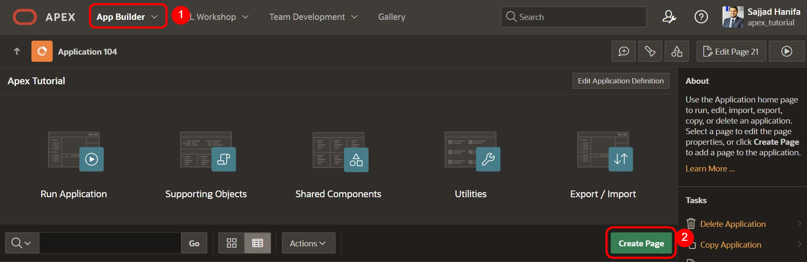

- Wählen Sie als Seitentypen **Master Detail** aus.

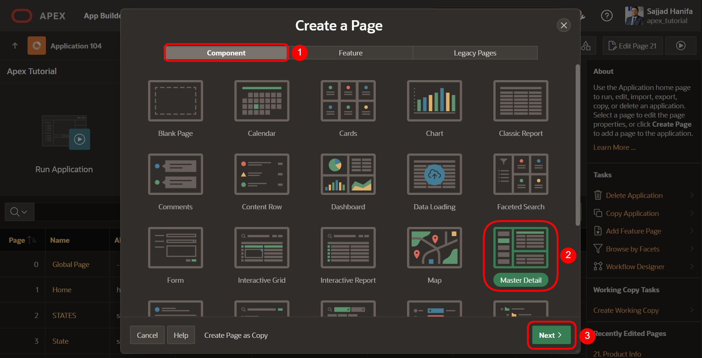

- Wählen Sie als Bereichstypen **Stacked** aus.


- Geben Sie als **Page Number** ***31*** ein und als **Page Name** ***Customer Orders***. 
- Wählen Sie im Bereich Master Data Source zunächst die erstellte View für die Master Region als **Table / View** Name aus (*TUTO_P0031_4_VW*).
- Öffnen Sie anschließend den Navigationsbereich.


- Deaktivieren Sie hier die **Breadcrumb** und klicken Sie anschließend auf den Button **Next**. 

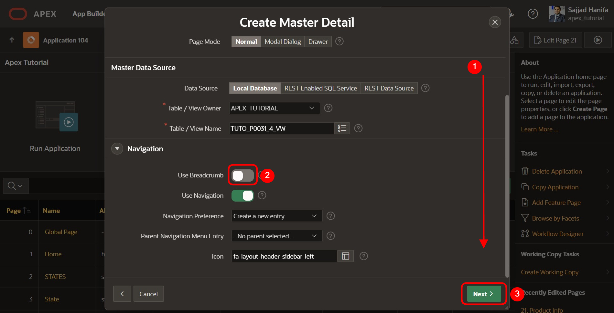

- Wählen Sie als **Primary Key Column 1** die Spalte ***CTMR_ID (Number)*** und klicken Sie auf den Button **Next**.


Eine Region ist ein Bereich auf einer Seite, der als Container für Inhalte dient. Diese Inhalte können z.B. Items oder Unterregionen sein. Regionen können verwendet werden, um Seitenelemente zu gruppieren. Jede Seite in APEX kann eine beliebige Anzahl von Regionen beinhalten. 

- Als nächstes wird die **Detail Region** konfiguriert. Ändern Sie dazu die folgende Felder wie angegeben ab:  

  | | |  
  |--|--|
  | Detail Region Title | Orders by Customer |  
  | Show Only Related Tables | No |  
  | Table / View Name | View zur Tabelle Orders (*TUTO_P0031_1_VW*) |
  | | |


 
- Klicken Sie anschließend auf den Button **Next**.
 
- Füllen Sie hier die Felder wie folgt aus und klicken Sie anschließend auf **Create Page**:

  | | | 
  |--|--|
  | Primary Key Column | ORDER_ID |
  | Master Column | CTMR_ID |
  | Detail Column | ORDR__CTMR_ID |
  | | |


- Ihnen wird nun der **Page Designer** der **Seite** ***31*** angezeigt. Über den **Run**-Button können Sie Ihre soeben erstellte Seite betrachten.


- Zur besseren Lesbarkeit der Spalten empfiehlt es sich, die **Spaltenüberschriften** anzupassen. Klicken Sie dazu auf die jeweiligen Spalten in den Interactive Grids (z.B. CTMR_FRST_NAME im Grid Customer Orders) und ändern Sie die Spaltenüberschrift bei Heading rechts in den Spalteneigenschaften. 


- Wiederholen Sie den Vorgang für die weiteren Spalten. Über den **Run**-Button können Sie die veränderte Seite betrachten.


- Da bisher jedoch lediglich eine **Master-Detail** Seite erstellt wurde, wird nun eine weitere **Detail-Region** benötigt. Klicken Sie mit der **rechten Maustaste** auf die **Region** ***Orders by Customer*** und wählen Sie den Eintrag **Create Region Below** aus. 


- Ändern Sie anschließend den **Title** zu ***Items in Order*** und den **Type** zu ***Interactive Grid***. Ändern Sie anschließend unter Source den **Type** zu ***SQL Query***.


- APEX markiert nun unter Source das Feld für die **SQL Query** rot. Hier muss eine entsprechende Query hinterlegt werden, um die Seite lauffähig zu speichern. Sie können entweder direkt in dem Feld tippen oder den Code Editor als modalen Dialog anzeigen lassen. Klicken Sie auf den Button über dem Feld, um den Code Editor aufzurufen.


- Der Code Editor ermöglicht das komfortable Schreiben von SQL-Code und unterstützt den Entwickler mit Zusatzfunktionen wie z. B. Syntax Highlighting und der Validierung des Codes. Geben Sie folgenden Code in dem Code-Editor ein:
  ```sql
  select ordr_item_id,
         ordr_item_ordr_id,
         ordr_item_prdt_info_id,
         ordr_item_unit_price,
         ordr_item_quantity
  from TUTO_P0031_2_VW
  ```
- Anschließend können Sie auf das Häkchen im Code-Editor klicken und die Query von APEX validieren lassen. Sollte alles korrekt sein, wird APEX Ihnen eine entsprechende Rückmeldung geben. 

- Klicken Sie anschließend auf den Button **OK**.


- Wählen Sie bei **Master Detail** die Region ***Orders by Customer*** als Master Region aus.


- Klicken Sie nun im linken Bereich des Page Designers in der Region **Items in Order** unter Columns auf die Spalte **ORDR_ITEM_ORDR_ID**. Wählen Sie anschließend im rechten Bereich die Spalte **ORDR_ID** als **Master Column** aus. Dadurch wird die Verknüpfung zwischen den zwei Regionen hergestellt. 


- Speichern Sie die Änderungen, indem Sie den Button **Save** drücken. Alternativ können Sie direkt den Button **Run** klicken, um zu speichern und daraufhin die Seite aufzurufen.

- Auf der von Ihnen erstellten Seite sind nun drei **Interactive Grids** zu sehen. Wählen Sie in der obersten Region einen beliebigen Eintrag (Kunden) aus.

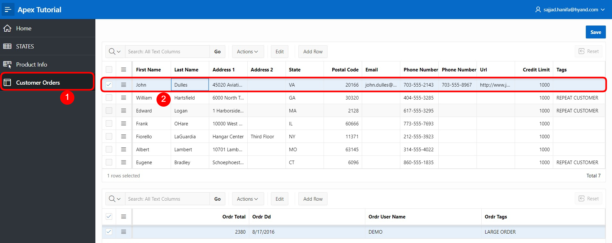

- In der mittleren Region werden nun alle Bestellungen dieses Kunden angezeigt. Wählen Sie auch hier einen beliebigen Eintrag (Bestellung) aus.


In der untersten Region werden alle Artikel aus der ausgewählten Bestellung angezeigt. Auch wenn hier, wie in den oberen Regionen, ein **Interactive Grid** verwendet wird, ist standardmäßig der Edit-Modus nicht verfügbar, wenn das **Interactive Grid** ohne den Assistenten erstellt wurde. Außerdem wird dem Nutzer zwar die ID der bestellten Artikel aber nicht deren Artikelname angezeigt.  

Um dies zu ändern, wird das **Interactive Grid** in den nächsten Schritten entsprechend angepasst. 

- Öffnen Sie erneut den **Page Designer**. Wählen Sie den **Eintrag** ***Attributes*** bei der **Region** ***Items in Order***. Setzen Sie anschließend den Wert von **Enabled** in dem Bereich **Edit** auf ***Yes***. Dies aktiviert den **Edit-Modus** für das **Interactive Grid**.


- Anschließend muss noch ein Primary Key für das Interactive Grid **Items in Order** festgelegt werden. Dazu klicken Sie auf die Column **ORDR_ITEM_ID** und setzen unter Source den **Primary Key** auf ***Yes***.


 
- Wählen Sie nun die Spalte **ORDR_ITEM_PRDT_INFO_ID** bei der Region **Items in Order** aus. Ändern Sie den **Type** zu ***Select List***.  
Eine Select List ist eine Auflistung von Daten, die es dem Benutzer ermöglicht, einen bestimmten Wert auszuwählen.


- APEX meldet, dass eine *List of Values* hinterlegt werden muss. Wenn Sie oben auf das **Message Icon** klicken, erhalten Sie zusätzliche Informationen dazu. 


- Ändern Sie den **Type** der *List of Values* zu ***SQL Query***.

*List of Values* sind Abfragen bestehend aus zwei Werten: einem Anzeigewert, der dem Benutzer angezeigt wird und einem Rückgabewert, mit dem APEX in der Datenbank gearbeitet wird.

Nun müssen Sie eine SQL Query hinterlegen. Hinweise zur Erstellung der korrekten Query erhalten Sie über den Reiter **Help**. 


Hinterlegen Sie folgenden Code in dem Feld **SQL Query**:
```sql
select prdt_info_name as d,
       prdt_info_id as r
from TUTO_P0031_3_VW
```

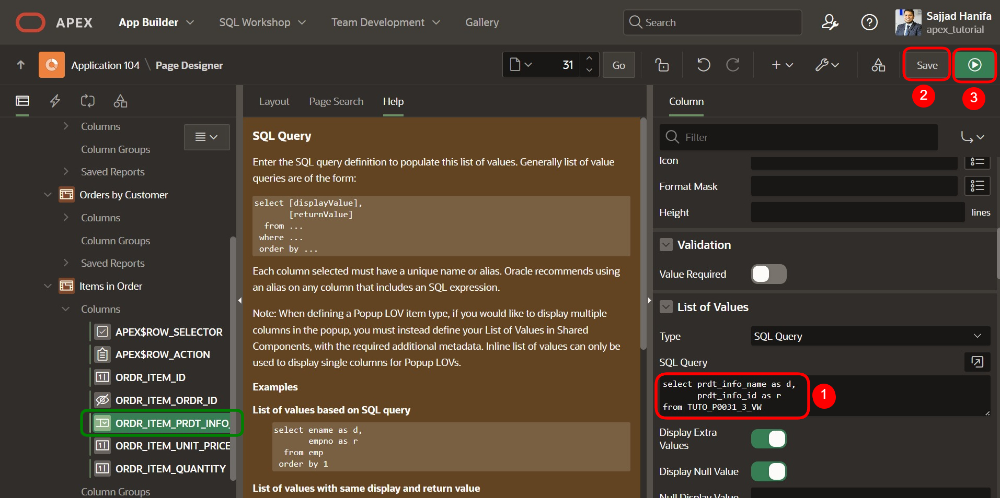

- Klicken Sie anschließend erst auf den Button **Save** und dann auf den Button **Run**, um die Seite zu speichern und auszuführen.


Sie sehen nun, dass in der untersten **Region** statt der **ID** die zugehörigen **Namen** der Artikel angezeigt werden. Durch eine **Select List** lassen sich nun die entsprechenden Artikel auswählen und ändern. Geändert wurde lediglich das **angezeigte Element**.  
APEX hinterlegt weiterhin in der Datenbank die **ID**. 


## <a name="popup-list-of-values"></a>5.3 Popup List of Values
**List of Values** können auch als Popup-Fenster angezeigt werden. In APEX wurden hierfür einige Funktionen optimiert und erweitert. Diese sollen im Folgenden an einem Beispiel angewendet werden.

Die Felder der Spalte **State** im **Interactive Grid** können bislang über eine Texteingabe geändert werden. Stattdessen soll nun dort eine Auswahlliste angezeigt werden, entsprechend der Einträge in der Datenbanktabelle **States**.

- Für die Bearbeitung dieser Aufgabe wird eine weitere **View** benötigt. Erstellen Sie diese gemäß der folgenden Angaben:
  - TUTO_P0031_5_VW
    ```sql
    select STTS_ID,
           STTS_ST
           STTS_STATE_NAME
      from STATES
    ```

- Öffnen Sie den **Page Designer** für die Seite ***31 Customer Orders***. Wählen Sie dort in der Region **Customer Orders** unter **Columns** die Spalte **CTMR_STATE** aus und ändern sie den **Type** zu ***Popup LOV***. Setzen Sie unter **List of Values** den **Type** auf ***SQL Query*** und geben Sie als **Query** folgendes SQL Statement ein:
    ```sql
    select STTS_ST as r,
           STTS_ST as d
    from TUTO_P0031_5_VW
    ```

- In diesem Fall wird dieselbe Tabellenspalte als Anzeige- und Rückgabewert verwendet, da anders als beim vorherigen Fall ein Text und keine Nummer als Eingabe erwartet wird. 

- Speichern Sie Ihre Änderungen durch den Button **Save** und klicken Sie dann auf den Button **Run**, um die Seite auszuführen.

- Wird nun ein Feld in der Spalte editiert, öffnet sich durch den **Pfeil**-Button rechts ein Auswahlmenü, das durch ein eigenes Eingabefeld nach Einträgen durchsucht werden kann.


- APEX bietet weitere Optionen, um das Popupfenster anzupassen. Wechseln Sie zurück in den **Page Designer**, um einige von ihnen auszuprobieren. Ändern Sie von der Column **CTMR_STATE** die Einstellung **Display as** auf ***Modal Dialog***. Aktivieren Sie außerdem die Option **Search as You Type**. 

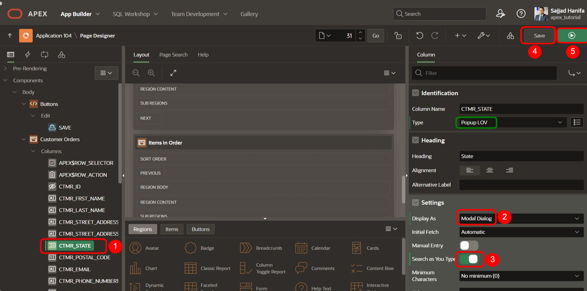

- Speichern Sie und rufen Sie die Seite erneut auf.

- Das Auswahlfenster öffnet sich nun in einem separaten, modalen Dialog, außerdem fällt der **Search**-Button weg. Stattdessen werden die Einträge direkt bei einer Eingabe in das Textfeld durchsucht.

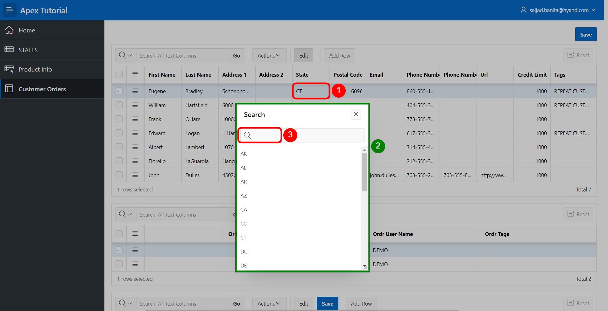

- Neben den gezeigten Anpassungen ist es außerdem möglich, die Auswahl mehrerer Einträge zu ermöglichen. Dies funktioniert über die Option **Multiple Values**. Die ausgewählten Werte werden dann wie unten gezeigt aneinandergereiht und können einzeln wieder gelöscht werden. Hierbei sollte jedoch immer beachtet werden, ob das Datenmodell mehrwertige Attribute unterstützt.


- Weiterhin ist es möglich, Einträge als Tupel mit mehreren Attributen anzuzeigen. Hierfür muss die List of Values als **Shared Components** in der Anwendung hinterlegt sein.

- Öffnen Sie den **App Builder**, wählen Sie Ihre Anwendung und klicken Sie auf **Shared Components**. 

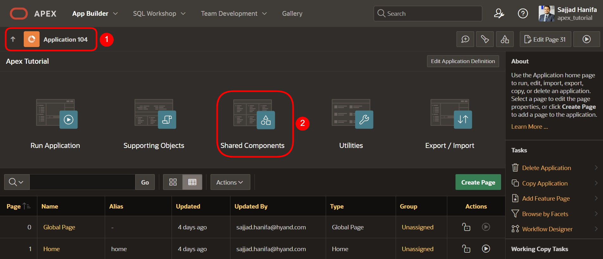

*Shared Components* sind allgemeine Elemente, die auf einer oder beliebig vielen Seiten einer Anwendung benutzt werden können.

- Klicken Sie auf den Eintrag **List of Values**.


- Sie sehen eine Auflistung der angelegten Listen. Klicken Sie **Create**, um eine neue List of Values anzulegen.


- Wählen Sie die Option **From Scratch** und klicken Sie auf **Next**.


- Geben Sie als Namen der Liste **States** ein und wählen Sie die Option **Dynamic**. Klicken Sie anschließend auf **Next**.


- Wählen Sie die unter dem Punkt **Table/View Name** die zuvor erstellte View (*TUTO_P00031_5_VW*) aus und klicken Sie auf **Next**.


- Wählen Sie sowohl als **Return Column** als auch als **Display Column** die Spalte ***STTS_ST*** aus und klicken Sie auf **Create**.


- Um mehrere Spalten als angezeigte Spalten zu hinterlegen, sind nachträgliche Anpassungen an der List of Value notwendig. Klicken Sie dafür auf den zugehörigen Eintrag.


- Klicken Sie auf den Button **Select Columns** im unteren Teil des Bildschirms.


- Verschieben Sie im sich öffnenden Fenster den Eintrag zur Spalte **STTS_STATE_NAME** in das rechte Feld, indem Sie den Eintrag auswählen und auf die Pfeil-Schaltfläche in der Mitte klicken. Klicken Sie anschließend auf den Button **Update**.

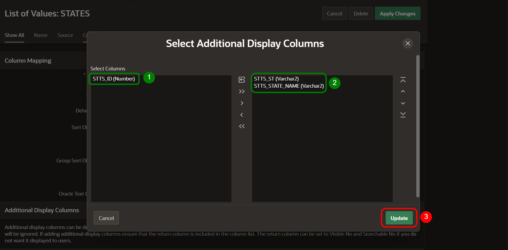

- Damit auch die bislang dargestellte Spalte STATE weiterhin sichtbar ist, geben Sie in der zugehörigen Zeile unter **Heading** ***State*** ein und ändern Sie die Optionen **Visible** und **Searchable** auf ***On*** bzw. ***Enabled***. Ändern Sie das Heading in der Zeile darunter auf **State Name**.

- Klicken Sie abschließend den Button **Apply Changes** um die Änderungen zu speichern.

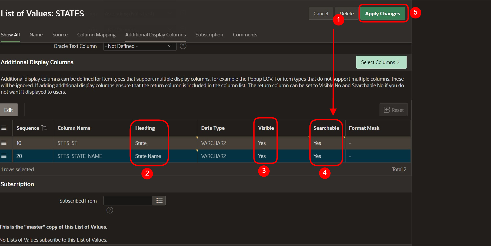

- Klicken Sie auf die Schaltfläche mit dem **Stiftsymbol** und der Seitennummer **31**, um direkt in den **Page Designer** zurückzukehren.


- Ändern Sie dort für die Region Customers in der Spalte **CTMR_STATE** den **Type** im Reiter List of Values in ***Shared Components*** und den Wert von **List of Values** in ***STATES***.

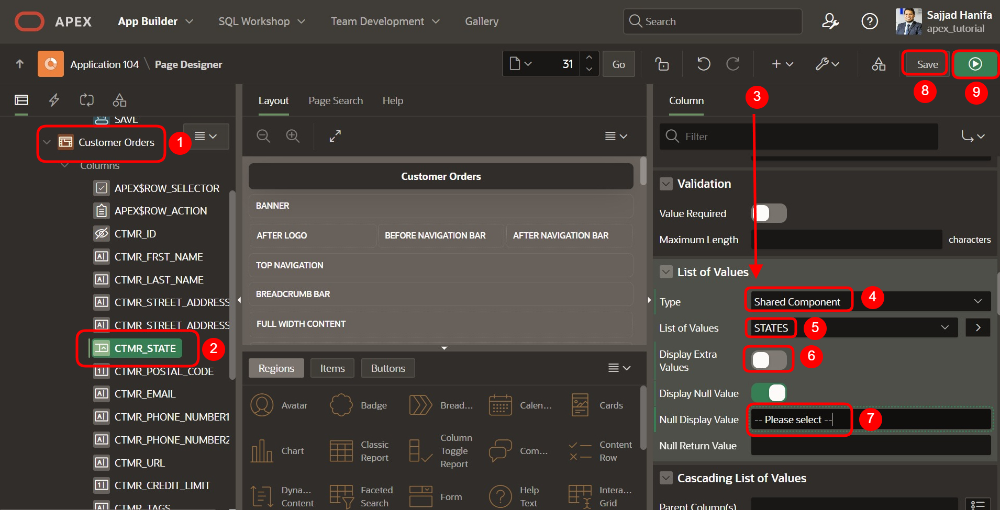

- Speichern Sie die Seite und aktualisieren den Tab mit der geöffneten Anwendung. Im Dialogfenster werden nun zu jedem Eintrag die Attributwerte zu **State** und **State Name** angezeigt.


# <a name="charts"></a>6. Charts
Charts/Diagramme dienen zur grafischen Darstellung von Zahlenwerten. APEX unterstützt standardmäßig u.a. Kuchen-Diagramme, Linien-Diagramme, Blasen-Diagramme, Streu-Diagramme und Balken-Diagramme.

Ziel dieses Kapitels ist es, ein Chart zu erstellen, welches das Verhältnis der Käufe sortiert nach Kategorien anzeigt.

## <a name="charts-erstellung-der-view"></a>6.1 Erstellung der View
- Für die Bearbeitung dieser Aufgabe wird eine **View** benötigt. 

- Geben Sie Ihrer **View** den Namen ***TUTO_P0001_VW***
  ```sql
  select o.ordr_id,
         o.ordr_ctmr_id,
         o.ordr_total,
         o.ordr_dd,
         o.ordr_user_name,
         oi.ordr_item_id,
         oi.ordr_item_prdt_info_id,
         oi.ordr_item_unit_price,
         oi.ordr_item_quantity,
         p.prdt_info_name,
         p.prdt_info_descr,
         p.prdt_info_category,
         p.prdt_info_avail,
         p.prdt_info_list_price
    from order_items oi
    join product_info p
      on oi.ordr_item_prdt_info_id = p.prdt_info_id
    join orders o
      on oi.ordr_item_ordr_id = o.ordr_id
  ```
## <a name="charts-region"></a>6.2 Charts Region
- Öffnen Sie zunächst den **App Builder** für Ihre **Anwendung**. Klicken Sie anschließend auf die **Seite 1 -** ***Home***.

- **Breadcrumbs** können meist nach dem Anlegen gelöscht werden. Sie nehmen viel Platz ein und bringen i. d. R. keinen Mehrwert für den Endanwender. **Breadcrumbs** sind hierarchische Listen von Links und bieten eine hierarchische Navigation.

- Klicken Sie mit der rechten Maustaste auf die *Breadcrumb* **TUTORIAL 24.1** und wählen Sie **Delete** aus. 


- Löschen Sie ebenfalls die Region **Page Navigation**.

- Klicken Sie mit der rechten Maustaste auf den Eintrag **Components**. Wählen Sie hier **Create Region**.

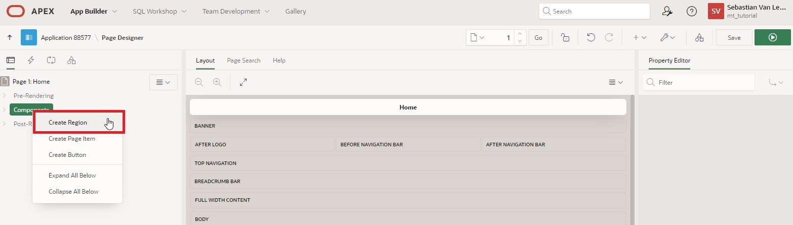

- Wählen Sie nun die von Ihnen erstellte Region aus und ändern Sie den **Title** zu ***Orders per Category*** und den **Type** zu ***Chart***.

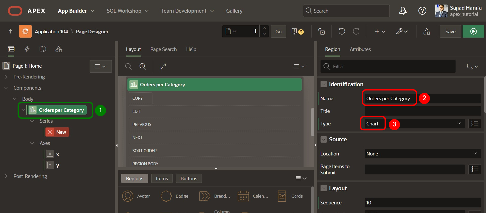

- Wählen Sie nun den Eintrag **NEW** unter Series aus und ändern Sie den **Titel** in ***Orders***. 
- Unter Source wählen Sie als **Location** die Einstellung ***Local Database*** aus und geben als **Table Name** die soeben erstellte View (***TUTO_P0001_VW***).

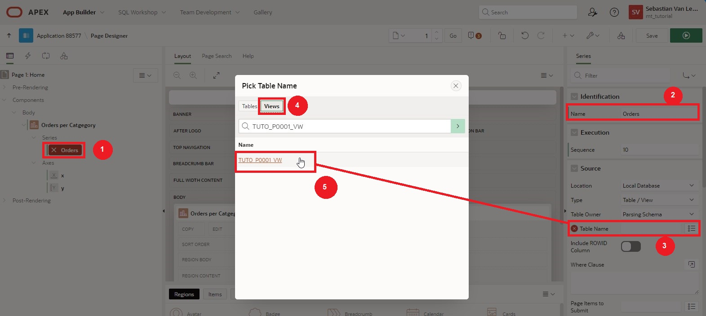

- Ändern Sie nun den Wert für **Label** zu der Spalte ***PRDT_INFO_CATEGORY*** und den Wert für **Value** zu der Spalte ***ORDR_TOTAL***.

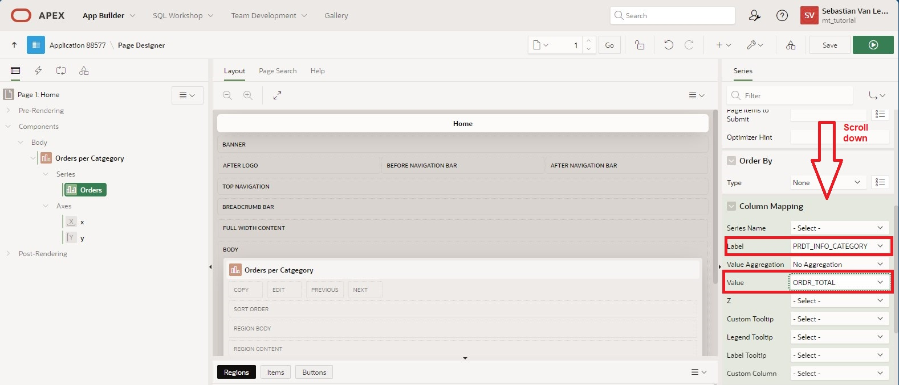

- Wechseln Sie nun bei Orders per Category zu in den Reiter **Attributes**. Ändern Sie den **Type** zu ***Pie***. Nun wird Ihr Diagramm als Kreisdiagramm dargestellt. Kreis/Kuchen-Diagramme sind Darstellungsformen für Teilwerte eines Ganzen in Form eines Kreises. Der gesamte Kreis steht für die Summe der einzelnen Kreissektoren. 

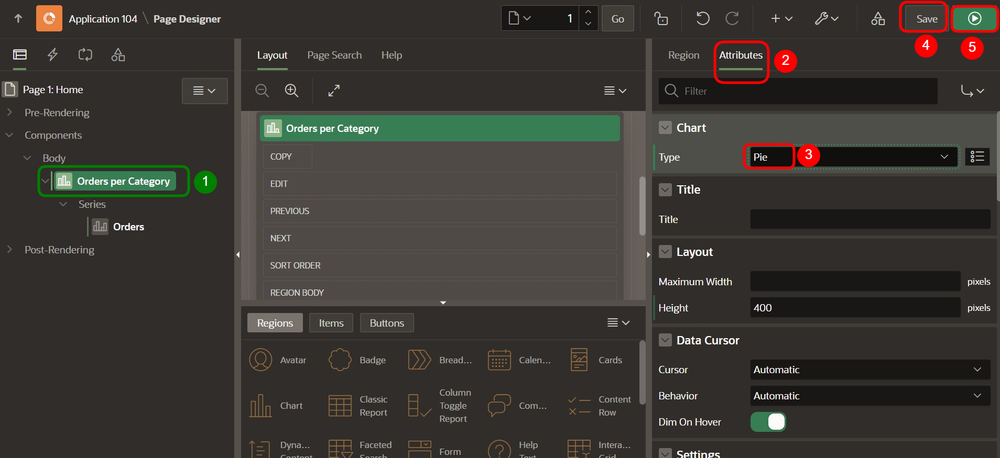

- Klicken Sie anschließend auf den Button **Run**.

- Sie sehen nun, dass auf Ihrer Startseite das Verhältnis der Käufe sortiert nach Kategorien angezeigt wird. 

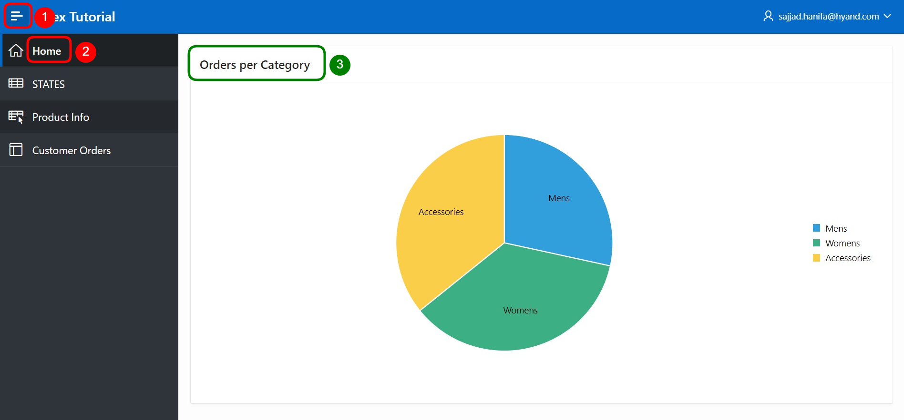

 
# <a name="cards-region"></a>7. Cards Region

Cards sind eine beliebte Form im Webdesign, um Informationen übersichtlich und anschaulich darzustellen. Die Cards in APEX lassen sich vielfältig gestalten. So kann man einer Card Icons hinzufügen, Bilder oder Videos in dieser anzeigen oder Aktionen für die Card definieren (z.B. über Links oder Buttons). 

In diesem Kapitel erstellen wir eine Seite, die auf einer Cards Region aufbaut. Im ersten Schritt erstellen wir eine Default Cards Region, im zweiten Kapitel bearbeiten wir diese so, dass ein Bild in der Karte angezeigt wird.  

## <a name="cards-view-erstellen"></a>7.1	View erstellen

Für die Bearbeitung dieser Aufgabe wird eine **View** benötigt.  
**View Name: *TUTO_P0041_VW***
**Query**:

```sql
select prdt_info_id as product_id,
       prdt_info_name as product_name,
       prdt_info_descr as product_description,
       prdt_info_category as category,
       prdt_info_product_image as product_image,
       prdt_info_list_price as list_price 
from product_info
 ```

## <a name="cards-seite-erstellen"></a>7.2	Seite erstellen

- Öffnen Sie den **App Builder** über die Navigationsleiste, wählen Sie Ihre Anwendung aus und klicken Sie auf den Button **Create Page**.  
- Wählen Sie den Seitentypen **Report** aus.  
- Wählen Sie den Bereichstypen **Cards** aus.  

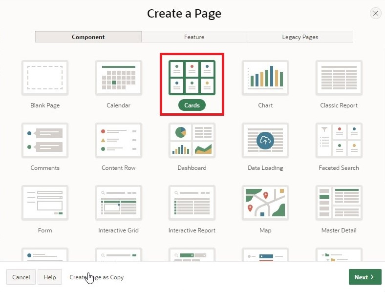

- Geben Sie als **Page Number *41*** und als **Page Name *Products*** ein. Klicken Sie anschließend auf den Button **Next**.  
- Wählen Sie die unter dem Punkt **Table/View Name** die zuvor erstellte View (TUTO_P0041_VW) aus.  
- Deaktivieren Sie im Bereich **Navigation** die *Breadcrumb* und klicken Sie auf **Next**.  

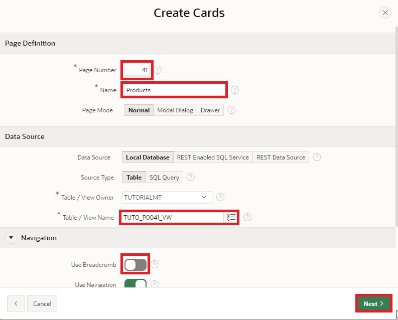 

- Anschließend geben Sie die Attribute Ihrer Card an. Als Format zur Anordnung nehmen Sie **Grid**. Das sorgt dafür, dass die Karten in einem gleichmäßigen Raster angeordnet werden.   

Nun müssen Sie noch angeben, welche Daten, wo in der Card angezeigt werden. Eine Card besteht zwingend aus einem Titelbereich. Außerdem kann man ihr einen Body, ein Icon und ein Badge hinzufügen.  
- Geben Sie folgendes ein:   

  |  |  |
  |--|--|
  |**Title Column** | PRDT_INFO_NAME |
  |**Body Column** | PRDT_INFO_DESCR |
  |**Icon Initials Column** | PRDT_INFO_CATEGORY |
  |**Badge Column** | PRDT_INFO_LIST_PRICE |
  |  |  |  

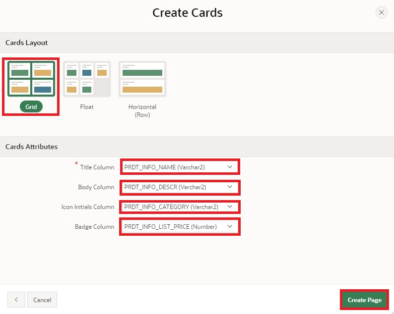  

- Klicken Sie auf **Run** und rufen Sie Ihre neu erstellte Seite auf.  

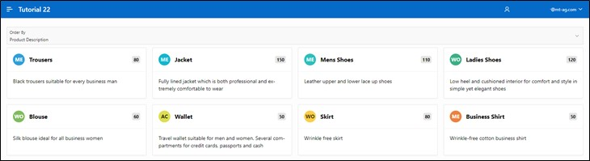 

Sie sehen, dass die Produkte nun in Form von Cards dargestellt werden. Der Title der Card ist der Produktname, im Body wird das Produkt kurz beschrieben. Die Initialen zeigen die Kategorie des Produkts an (z.B. AC für Accessoires) und in der Badge sehen Sie den Preis des Produkts.  

Oben auf der Seite befindet sich eine Select List zur Auswahl, wie die Cards sortiert werden sollen. Um die angezeigten Namen der Sortierfelder anzupassen, wechseln Sie auf die Seite im Page Designer und navigieren zum Page Item **P41_ORDER_BY**. Rechts in den Eigenschaften des Page Items öffnen Sie die **Static Values** im Punkt **List of Values**. 

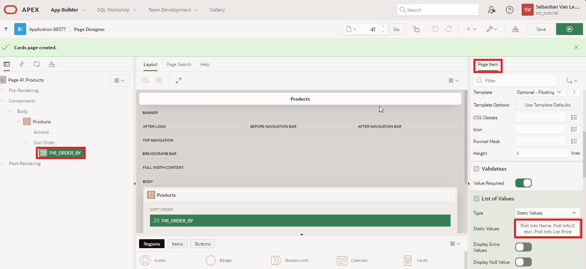 

Hier können SIe die angezeigten Sortierkriterien unter Display Value anpassen. Tragen Sie hier die folgenden Werte aus der linken Spalte ein und bestätigen mit **OK**.

  |  |  |
  |--|--|
  |Product Name | **PRDT_INFO_NAME** |
  |Product Description | **PRDT_INFO_DESCR** |
  |Product List Price | **PRDT_INFO_LIST_PRICE** |
    |  |  | 

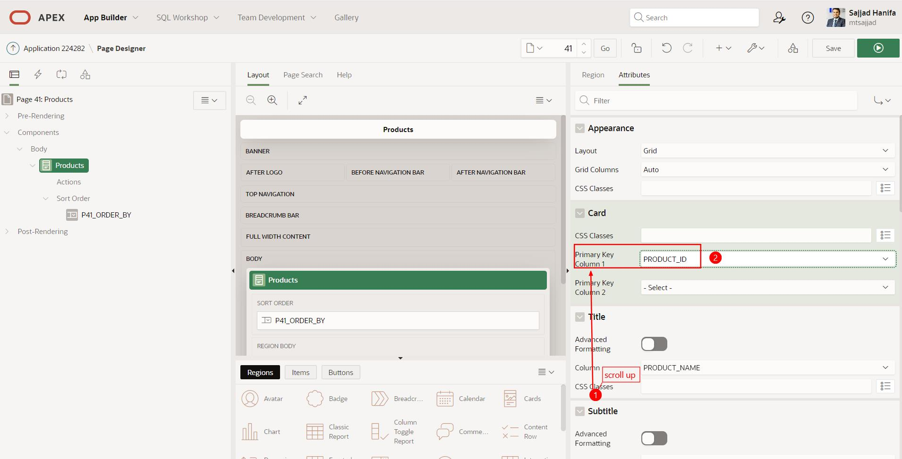 

- Mit einem Klick auf **Run** können Sie sich die Veränderung auf der Seite anschauen.

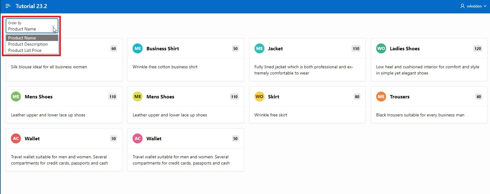 
 
## <a name="cards-mit-bild-erstellen"></a>7.3	Cards mit Bild erstellen

In diesem Schritt werden Sie das Aussehen der Cards ändern und die Titelbilder der Filme anzeigen.  
- Klicken Sie hierfür auf **Attributes** und scrollen Sie dann nach unten zu **Media**.  

- Wählen Sie als **Source *BLOB Column*** und dann unter **BLOB_Column *PRDT_INFO_PRODUCT_IMAGE*** aus. 

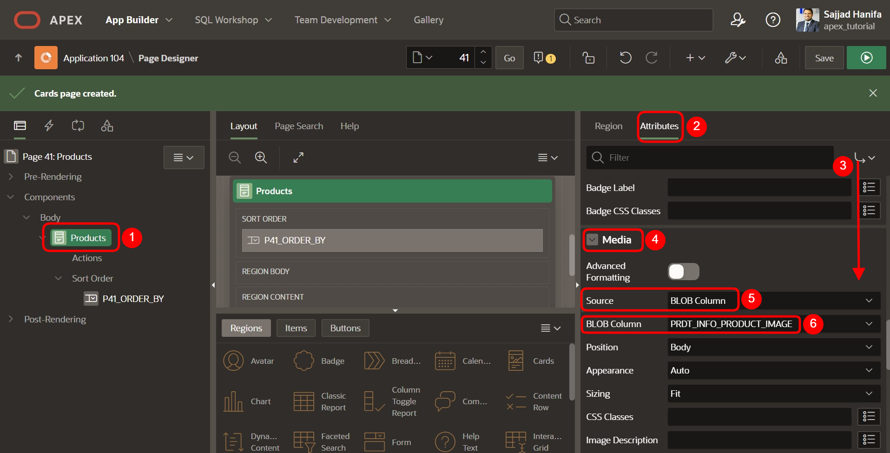

- Legen Sie außerdem ***PRDT_INFO_ID*** als **Primary Key Column 1** fest.  

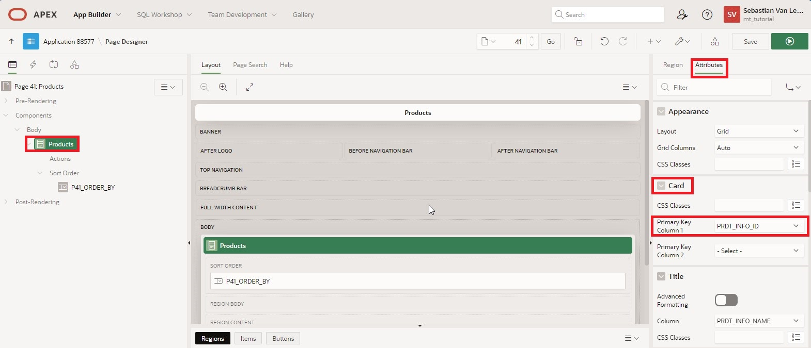

- Rufen Sie anschließend die Seite über den **Run**-Button auf.  

- In den Cards werden nun zusätzlich die Produktbilder angezeigt. 

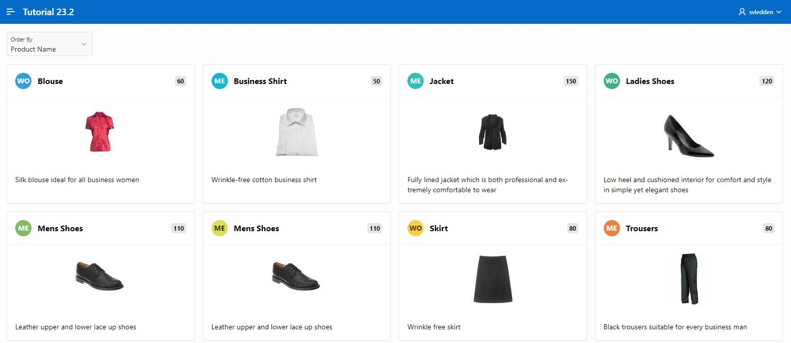


# <a name="faceted-search"></a>8. Faceted Search

Bei der **Faceted Search** handelt es sich um eine Funktion zur dynamischen Filterung der angezeigten Datensätze und der gezielten Suche darin. Sie findet häufig Anwendung in Onlineshops und zeichnet sich meist durch eine fixierte Leiste am Seitenrand aus, in welcher sich die unterschiedlichen Filter in Form von Checkboxen, Slidern und Eingabefeldern befinden.

## <a name="fs-erstellung-der-view"></a>8.1	Erstellung der View

Für die Bearbeitung dieser Aufgabe wird eine **View** benötigt.

**View Name: *TUTO_P0051_VW***

**Query**:

 ```sql
select prdt_info_id,
       prdt_info_name,
       prdt_info_descr,
       prdt_info_category,
       prdt_info_avail,
       prdt_info_list_price 
from product_info
 ```
 
## <a name="fs-create-page"></a>8.2	Create Page

- Öffnen Sie den **App Builder** über die Navigationsleiste, wählen Sie Ihre Anwendung aus und klicken Sie auf den Button **Create Page**.
- Wählen Sie den Seitentypen **Component** aus.
- Wählen Sie den Bereichstypen **Faceted Search** aus.
 
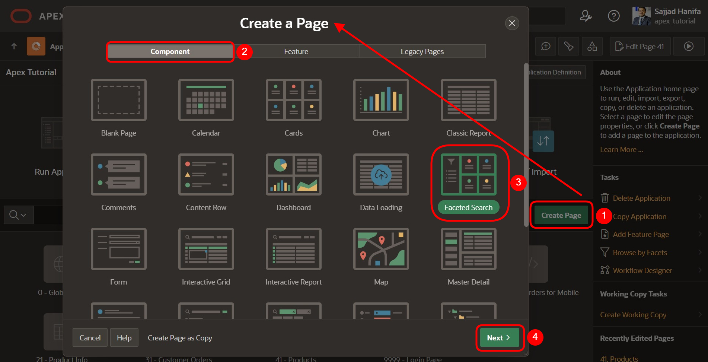 

- Geben Sie als **Page Number *51*** ein und als **Page Name *Product Search***. 
- Wählen Sie die unter dem Punkt **Table/View Name** die zuvor erstellte View (TUTO_P0051_VW) aus.
- Deaktivieren Sie im Bereich **Navigation** die *Breadcrumb* und klicken Sie auf **Next**.

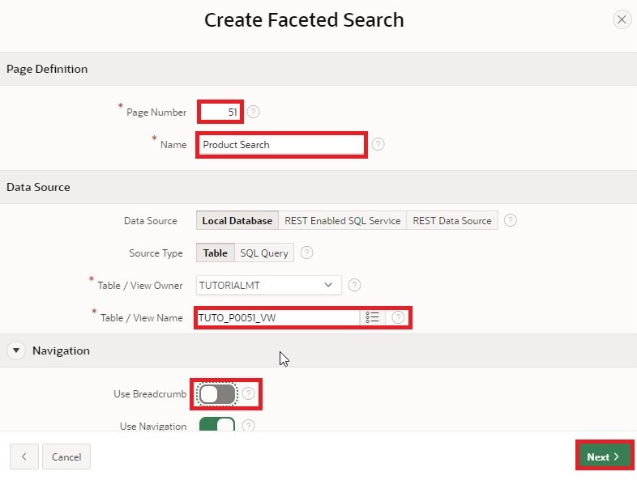 
  
- Deaktivieren Sie im letzten Schritt alle Facets und klicken Sie auf den Button **Create Page**.

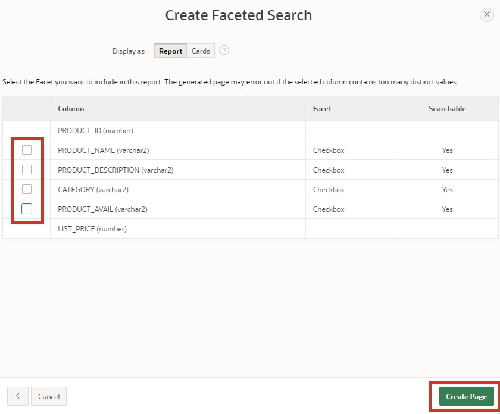 

- Rufen Sie anschließend die Seite über den **Run**-Button auf. 

Die Daten werden im rechten Seitenbereich als **Classic Report** dargestellt. Links davon befindet sich die Such- bzw. Filterleiste, in der sich bislang nur ein Suchfeld befindet, mit dem nach bestimmten Daten gesucht werden kann. Im Folgenden sollen dort weitere Optionen in Form von Facets hinzugefügt werden.

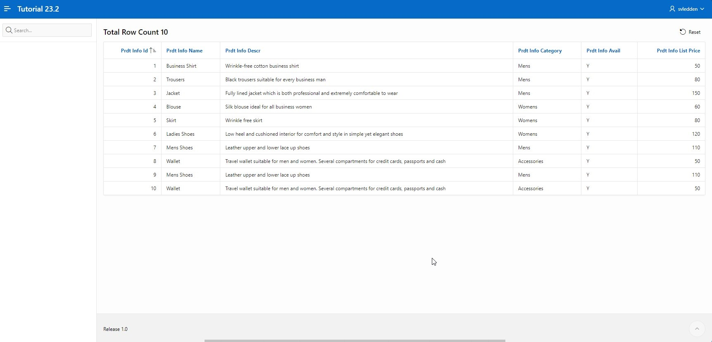 

## <a name="fs-create-facets"></a>8.3	Create Facets

- Wechseln Sie zurück in den **Page Designer** und erstellen Sie ein neues **Facet**, indem Sie einen Rechtsklick auf den Eintrag **Facets** machen und anschließend **Create Facet** auswählen. 

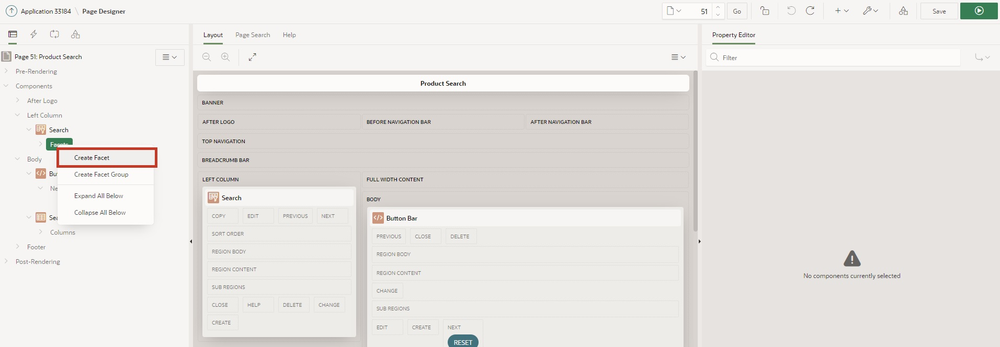 

- Wählen Sie das Item aus und ändern Sie die folgenden Felder wie angegeben ab:

| | |  
|--|--|
| **Identification**|  |
| Name | *P51_CATEGORY* |
| Type| *Checkbox Group*| 
| **Label** | *Category*| 
| **List of Values**|  |
| Type | *SQL Query* |
| SQL Query | select distinct prdt_info_category as d, <br> prdt_info_category as r <br> from TUTO_P0051_VW| 
| | |

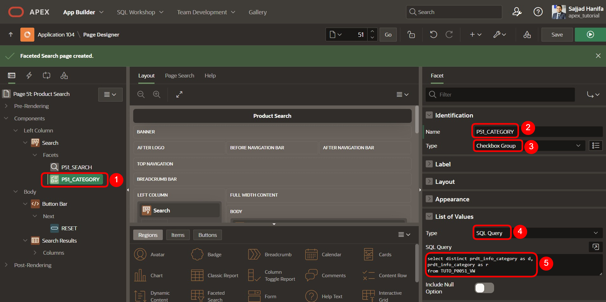 

Scrollen Sie weiter bis zum Abschnitt **Source**. Ändern Sie die Database Column auf **PRDT_INFO_CATEGORY**.

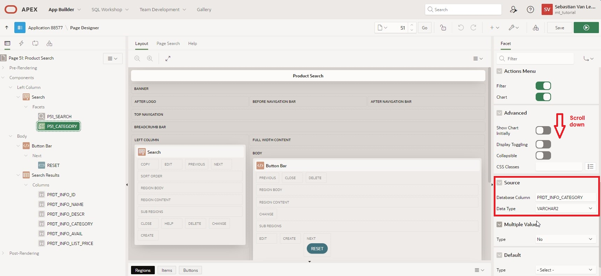 

- Starten Sie die **Seite**, indem Sie auf den **Run**-Button klicken.

In der Faceted Search Region befindet sich jetzt ein neues Element mit drei Checkboxen. Durch diese können die angezeigten Daten rechts anhand der Werte in der Spalte *Category* dynamisch gefiltert werden.

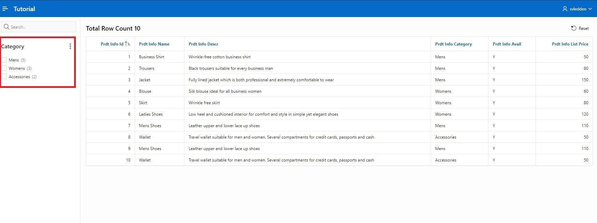 

- Wechseln Sie wieder in den **Page Designer**, um ein neues **Facet** zu erstellen. Dieses modifizieren Sie nach den folgenden Vorgaben:

  | | |  
  |--|--|
  | **Identification** |  |
  | Name | *P51_LIST_PRICE* |
  | Type | *Range* | 
  | **Label** | *List Price*| 
  | **Settings** |  |
  | Select Multiple | *Enabled* |
  | Manual Entry | *Enabled* | 
  | **List of Values** |  |
  | Type | *Static Values* | 
  | | |

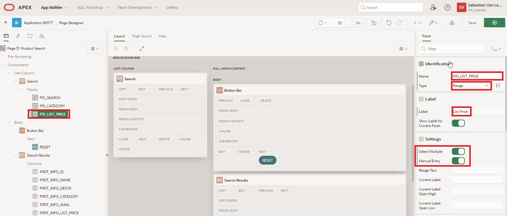 

- Zur Eingabe der **List of Values** – Werte klicken Sie auf die Schaltfläche neben **Static Values**. Daraufhin öffnet sich folgendes Fenster, in dem Sie die angegebenen Werte eintragen:
 
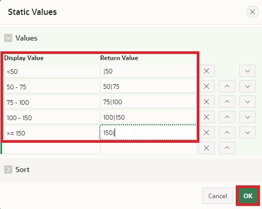 

- Setzen Sie unter **Source** die **Database Column** auf **PRDT_INFO_LIST_PRICE** und den **Data Type** für die Spalte **LIST_PRICE** auf ****NUMBER****.  

- Speichern Sie und rufen Sie erneut die Seite auf. 

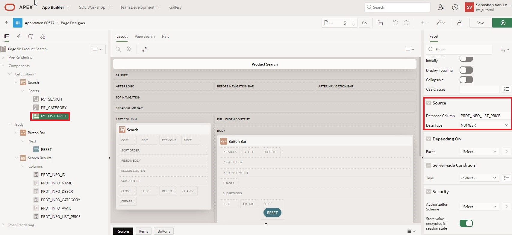 

Das neu erstellte Facet enthält wie auch das *Category-Facet* diverse Checkboxen, um die angezeigten Daten zu filtern. Darunter befinden sich zwei Eingabefelder, in die manuell Werte als Ober- und Untergrenze eingetragen werden können.

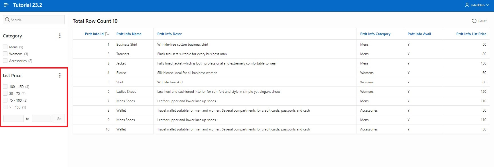 
 

# <a name="smart-filters"></a>9. Smart Filters
Die **Smart Filters** bieten die Möglichkeit, Daten mithilfe von Filtervorschlägen oder Suchbegriffen leicht einzugrenzen. Diese werden als Chips unter der Suchleiste oder als Vorschläge während des Tippens angezeigt.
## <a name="sf-erstellung-der-view"></a>9.1 Erstellung der View
Für die Bearbeitung dieser Aufgabe wird eine **View** benötigt. 
**View Name: TUTO_P0091_VW**
Query:
 ```sql
select prdt_info_id,
       prdt_info_name,
       prdt_info_descr,
       prdt_info_category,
       prdt_info_avail,
       prdt_info_list_price
from product_info
```

## <a name="sf-create-page"></a>9.2 Create Page
- Öffnen Sie den **App Builder** über die Navigationsleiste, wählen Sie Ihre Anwendung aus und klicken Sie auf den Button **Create Page**.  
- Wählen Sie den Seitentypen **Component** aus.  
- Wählen Sie den Bereichstypen **Smart Filters** aus.  
 
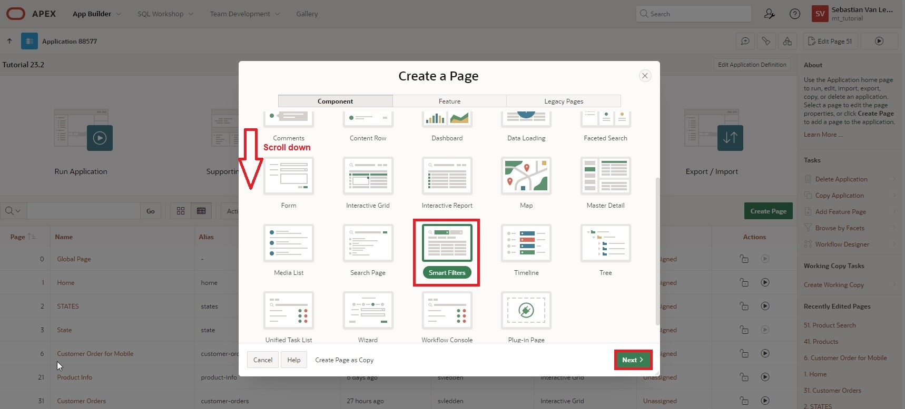  

- Geben Sie als **Page Number 91** ein und als **Page Name Product Filter**. 
- Wählen Sie die unter dem Punkt **Table/View Name** die zuvor erstellte View (TUTO_P0091_VW) aus.  
- Deaktivieren Sie im Bereich **Navigation** die *Breadcrumb* und klicken Sie auf **Next**.  
  
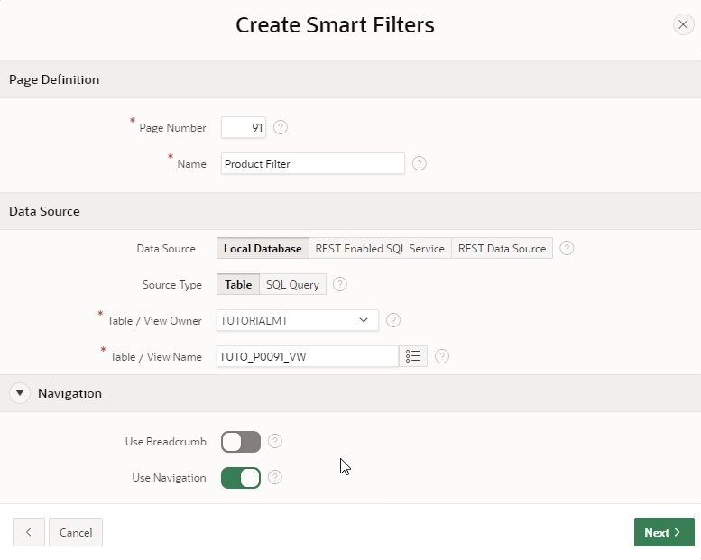  

- Deaktivieren Sie im letzten Schritt alle Filter und klicken Sie auf den Button **Create Page**.  
 
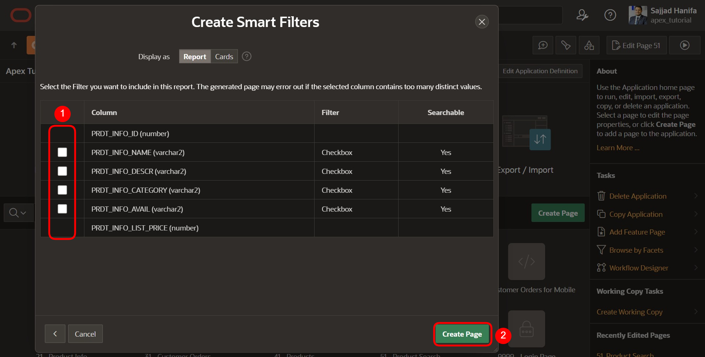  

- Rufen Sie anschließend die Seite über den **Run**-Button auf.  
Die Daten werden als **Classic Report** dargestellt. Darüber befindet sich eine Suchleiste, unter welcher die Filter als Chips angezeigt werden, die im Folgenden hinzugefügt werden.  

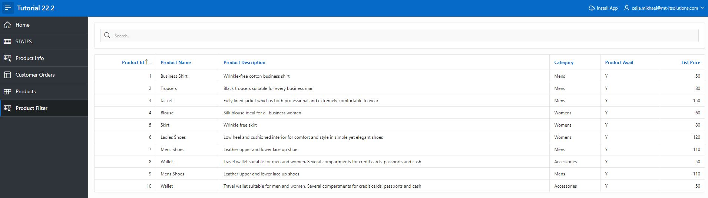  
 
## <a name="sf-create-filters"></a>9.3 Create Filters
- Wechseln Sie zurück in den **Page Designer** und erstellen Sie einen neuen Filter, indem Sie einen Rechtsklick auf den Eintrag **Filters** machen und anschließend **Create Filter** auswählen.  

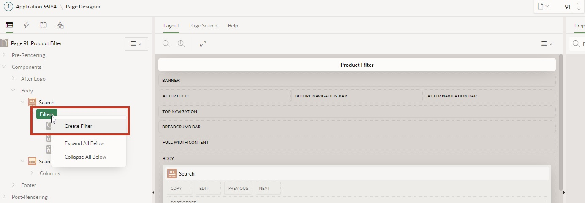  

- Wählen Sie das Item aus und ändern Sie die folgenden Felder wie angegeben ab:  

  | | |  
  |--|--|
  | **Identification** |  |
  | Name | *P91_PRDT_INFO_NAME* |
  | Type | *Checkbox Group* |  
  | **Label**| *Product Name* |
  | **List of Values** |  |
  | Type | *Distinct Values* |
  | | |  

- Starten Sie die Seite, indem Sie auf den Run Button klicken.  

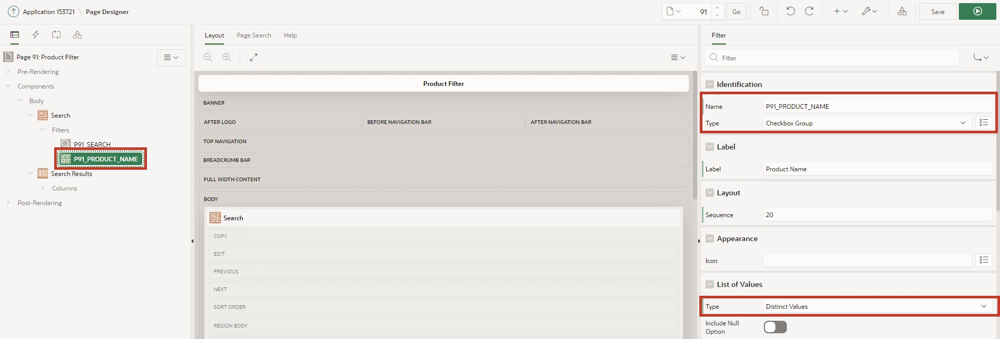  

Beim Klicken in die Suchleiste, erscheint der Filter *Product Name*. Wenn Sie auf den Filter klicken, werden alle Filteroptionen basierend auf den Werten der Spalte angezeigt. Klicken Sie auf den angezeigten Vorschlag, wird dieser als Filter in die Suchleiste übernommen.  

- Wechseln Sie wieder in den **Page Designer**, um einen weiteren Filter zu erstellen. Diesen modifizieren Sie nach den folgenden Vorgaben:  

  | | |  
  |--|--|
  | **Identification** |
  | Name | *P91_CATEGORY* |
  | Type | *Checkbox Group*|  
  | **Label**| *Category* |
  | **List of Values** |  |
  | Type | *Distinct Values* |
  | | |  

  

- Speichern Sie und rufen Sie erneut die Seite auf.  
Die erstellten Filter für *Product Name* und *Category* werden nun beim Klick in die Suchleiste angezeigt.  

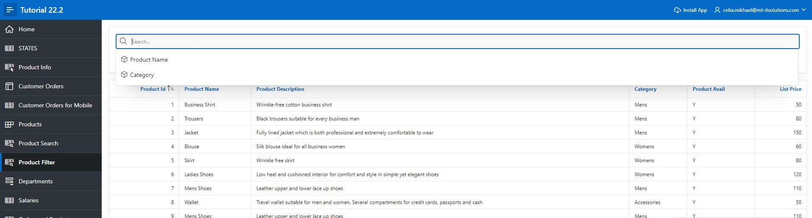  

 
 
# <a name="rest-data-sources"></a>10. REST Data Sources
Data Sources ermöglichen die Einbindung von REST-Services. Die empfangenen Daten können in APEX Komponenten wie Reports oder Forms verwendet werden. Die Daten werden dabei als JSON-Objekte zwischen der Anwendung und der REST Source transportiert. Es gibt verschiedene Operationen entsprechend der HTTP-Methoden (GET, POST, PUT, DELETE), die mit der jeweiligen Datenbankoperation (SELECT, INSERT, UPDATE, DELETE) verknüpft werden können.

## <a name="restful-service-erstellen"></a>10.1 RESTful Service erstellen
In dieser Aufgabe erstellen Sie einen eigenen RESTful Service. Diesen können Sie aus dem Internet aufrufen sowie in anderen Diensten nutzen. 
- Um den RestFul Service zu erstellen, klicken Sie auf den **SQL Workshop** und dann auf **RESTful Services**. 

- Beim erstmaligen Anlegen eines RESTFUL Services, müssen Sie zuerst Ihr Schema mit ORDS (Oracle Data Service registrieren), indem Sie auf den Button **Register Schema with ORDS** klicken. 

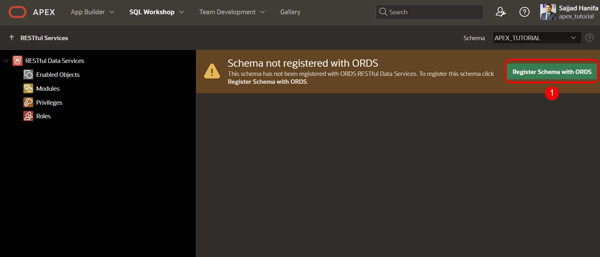

- Klicken Sie im sich öffnenden Dialog auf **Save Schema Attributes**.


Jetzt sehen Sie die folgende Übersichtsseite:

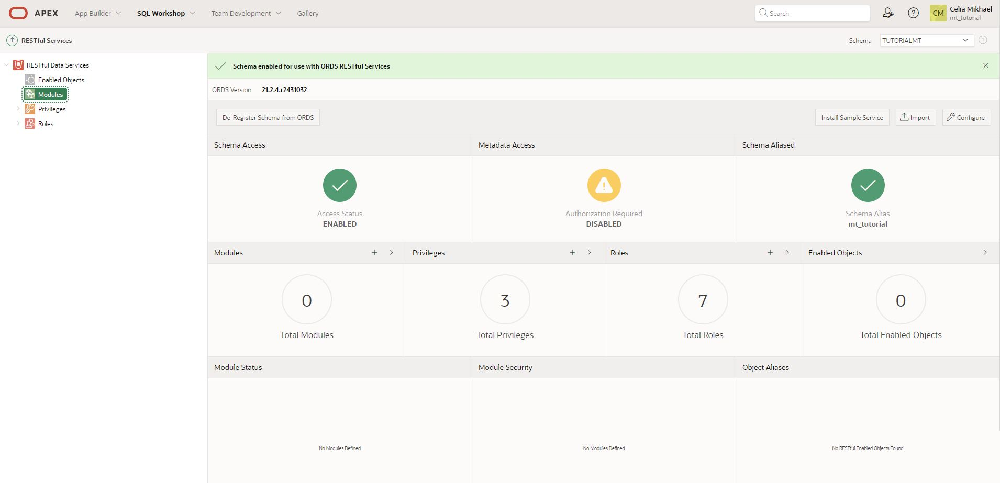

- Klicken Sie in dieser auf **Modules** und anschließend auf den **Create Module** Button. 

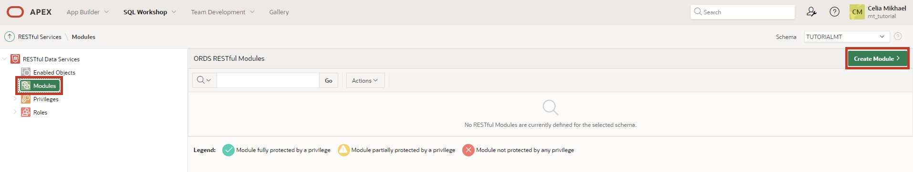

- Geben Sie als **Module Name *tutorial.company.example*** und als **Base Path */organisation/*** ein. Klicken Sie danach auf **Create Module**.

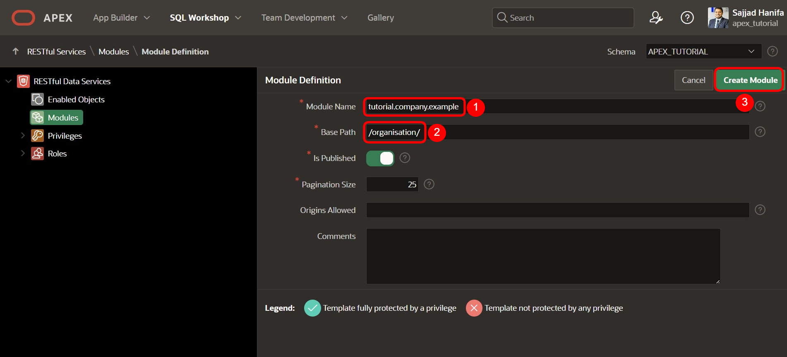

- Nachdem Ihr Module erstellt wurde, legen Sie für dieses nun ein Template an. Klicken Sie dafür auf den Button **Create Template**. 

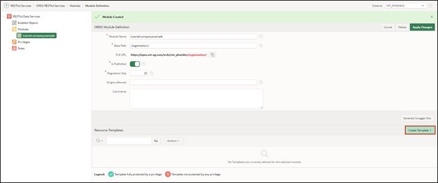

- Geben Sie als **URI Template *departments/*** an und erstellen Sie Ihr Template, indem Sie auf **Create Template** klicken. 

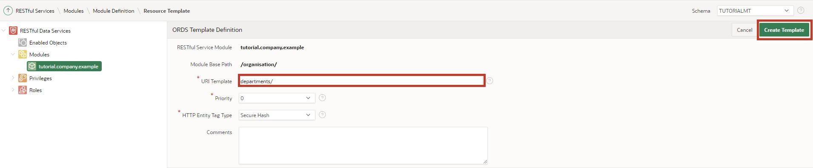

- Klicken Sie nun auf **Create Handler**, um die *Resource Handler* anzulegen. In diesem Tutorial werden Sie zwei Handler (für GET und POST) anlegen.

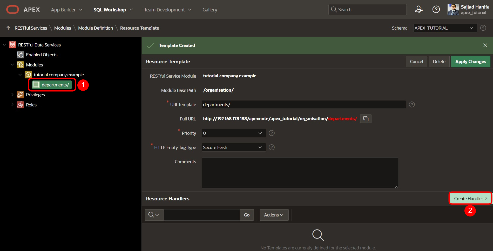

- Im ersten Schritt werden Sie die GET-Methode anlegen. Wählen Sie hierfür als **Method** im Handler ***GET*** aus. Kontrollieren Sie, dass als **Source Type *Collection Query*** ausgewählt ist. 
- Geben Sie anschließend bei **Source** die folgende SQL-Abfrage ein: 

 ```sql
select dept_id,
	     dept_name,
       dept_location
from departments
 ```  
- Jetzt haben Sie alle, für die GET-Abfrage notwendigen Informationen eingegeben. Sie können nun den Handler durch Klicken auf **Create Handler** erstellen. 

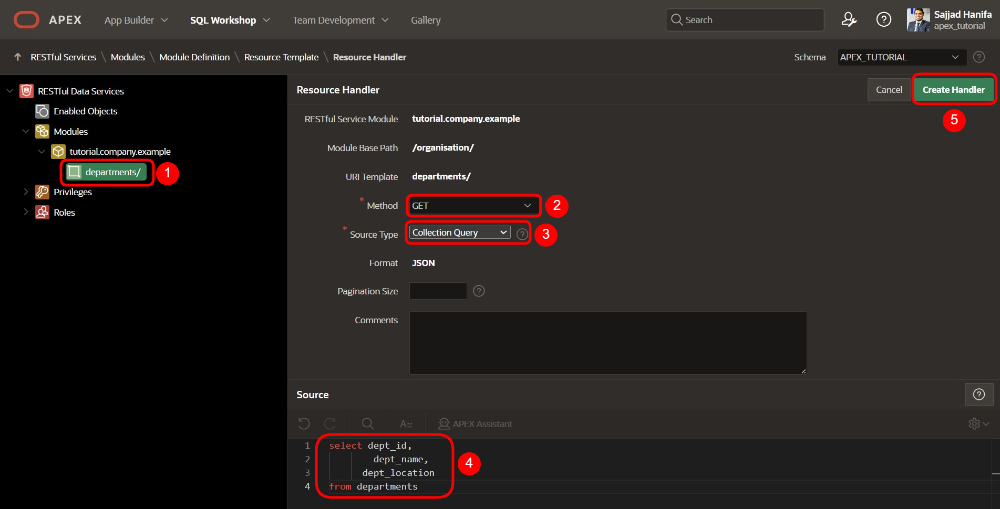

- Im nächsten Schritt legen Sie das POST-Handling an. Klicken Sie dafür auf Ihr Template **departments/** und dann auf **Create Handler**. 

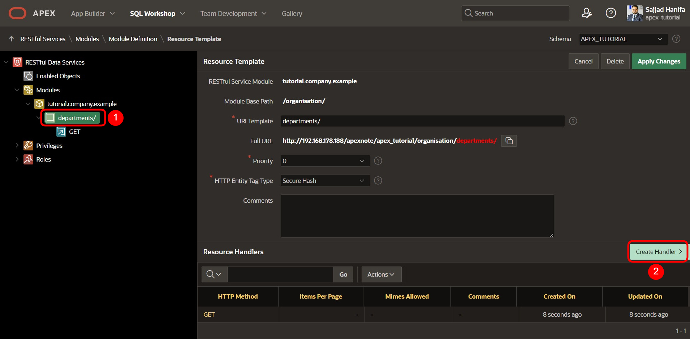
 
- Wählen Sie als **Method *POST*** aus 

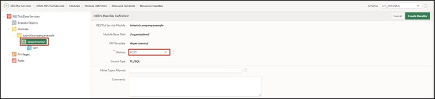

- Geben Sie unter **Source** den folgenden PL/SQL-Code ein:
 ```sql
begin
  	insert into departments (
  		dept_name,
 		dept_location)
  	values (
 		:dept_name, 
 		:dept_location);
end;
 ```

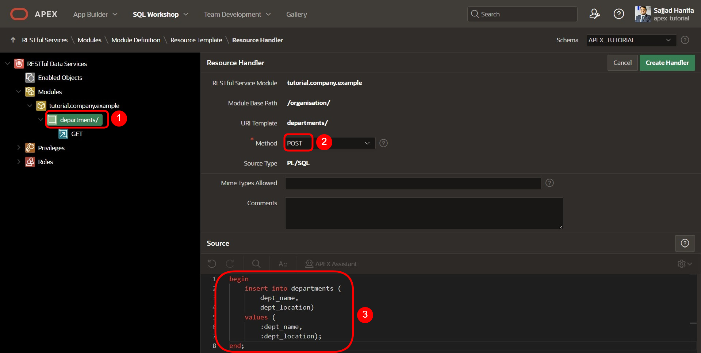

- Scrollen Sie nach unten zu **Parameters** und klicken Sie dort auf **Add Row**. 
- Geben Sie die folgenden Informationen ein: 

  |  |  |
  |--|--|
  | **Name** | dept_name |
  | **Bind Variable** | dept_name |
  | **Access Method** | IN |
  | **Source Type** | HTTP HEADER | 
  | **Data Type** | STRING | 
  |  |  |

- Fügen Sie anschließend auch für die Location einen Parameter ein, indem Sie wieder auf Add Row klicken. Geben Sie die folgenden Daten ein:  

  |  |  |
  |--|--|
  | **Name** | dept_location |
  | **Bind Variable** | dept_location |
  | **Access Method** | IN |
  | **Source Type** | HTTP HEADER | 
  | **Data Type** | STRING | 
  |  |  |

- Wenn Sie dies erledigt haben, scrollen Sie wieder nach oben und klicken dort auf **Create Handler**. 

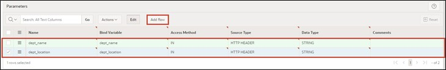  

- Hiermit ist Ihr Module fertig definiert. Rufen Sie zur Kontrolle die URL, die Sie unter **Full URL** bei **departments/** sehen mit Ihrem Browser auf. Sie sollten nun die Inhalte der GET-Abfrage und damit die ID, den Namen und die Location der Departments sehen.  

 ```json
"items": [
    {
      "dept_id": 15,
      "dept_name": "Accounting",
      "dept_location": "New York"
    },
    {
      "dept_id": 16,
      "dept_name": "Research",
      "dept_location": "Dalls"
    },
    {
      "dept_id": 17,
      "dept_name": "Sales",
      "dept_location": "Chicago"
    },
    {
      "dept_id": 18,
      "dept_name": "Operations",
      "dept_location": "Boston"
    }
  ]
 ```
  
## <a name="rest-data-source-erstellen"></a>10.2 REST Data Source erstellen
Nachdem Sie im vorherigen Kapitel einen eigenen RESTful Service erstellt haben, werden wir diesen in APEX als REST Data Source nutzen. Die Vorgehensweise, die im Folgenden gezeigt wird, gilt ähnlich auch für REST Datenquellen, die Sie nicht selbst erstellt haben.  
Um die **REST Data Source** anzulegen, gehen Sie in die **Shared Components** Ihrer Anwendung. 

- Die **REST Data Sources** befinden sich in den **Shared Components** unter dem Punkt **Data Sources**.  

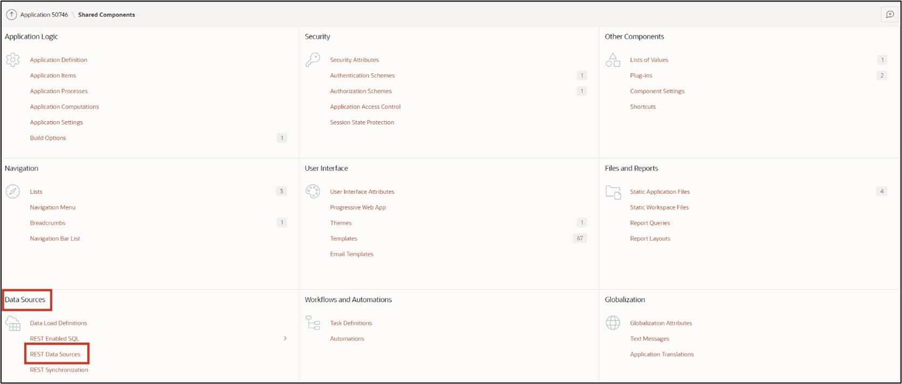  

- Über den **Create** Button können Sie eine neue REST Datenquelle anlegen.  

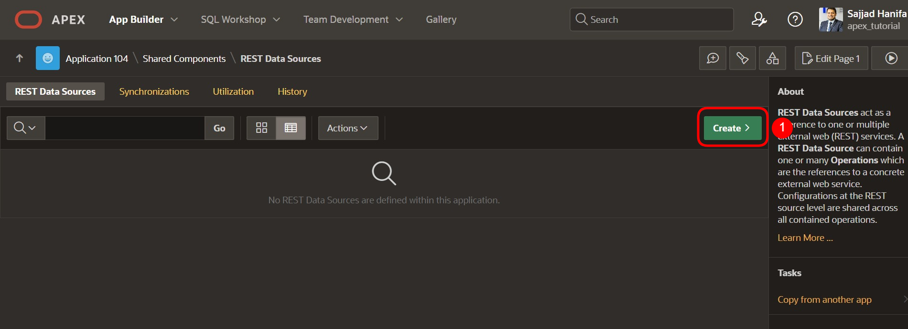
 
- Da in dieser Anwendung bisher noch keine REST Data Sources vorhanden sind, müssen Sie diese neu erstellen, wählen Sie also **From Scratch** aus. Klicken Sie auf **Next**.

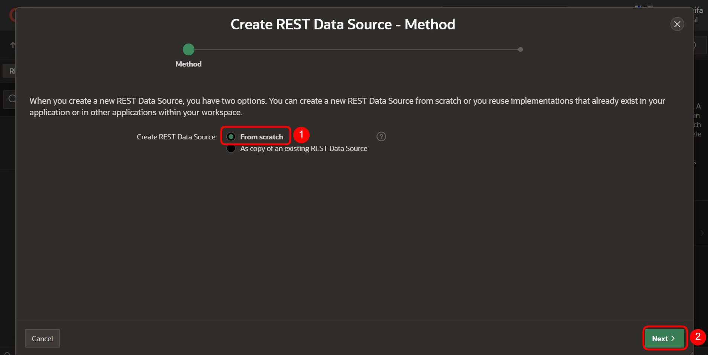 

- Wählen Sie als **REST Data Source Type *Oracle REST Data Service*** aus. 
Geben Sie der REST Data Source den **Namen *Departments***. Zudem müssen Sie den URL Endpunkt definieren. Den URL Endpunkt finden Sie in Ihrem RESTful Service-Modul.  
- Klicken Sie anschließend auf den Button **Next**.
   
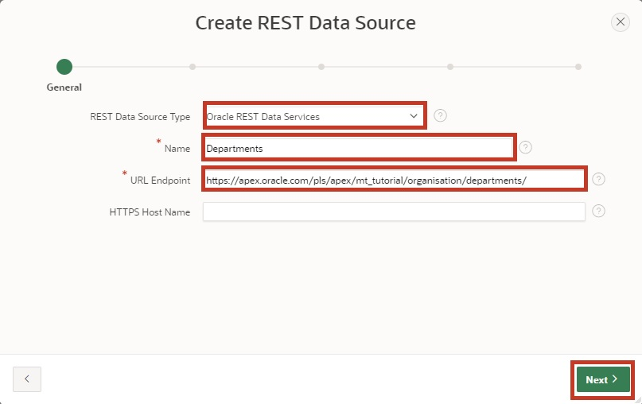
 
- Im zweiten Schritt des Assistenten müssen Sie den Service URL Path einrichten, also die Weiterleitung innerhalb der API. Hier müsste bereits automatisch der richtige Pfad voreingestellt worden sein, dementsprechend müssen Sie dort nichts ändern und nur auf **Next** klicken.
  
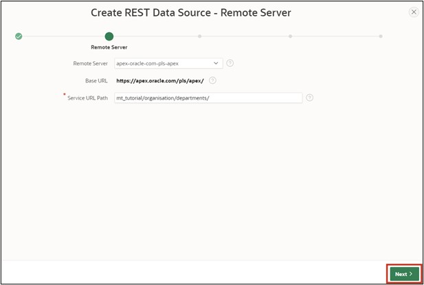

- Den Punkt **Authentication Required** lassen Sie ausgeschaltet, da die angelegte REST Datenquelle keine Authentication erfordert. Klicken Sie auf den **Discover** Button.
  
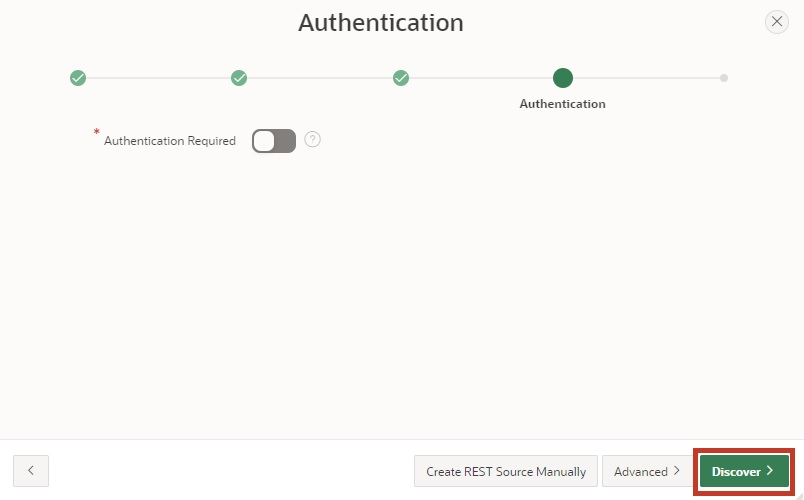
 
- Klicken Sie im anschließenden Fenster auf **Create REST Data Source**. 
 
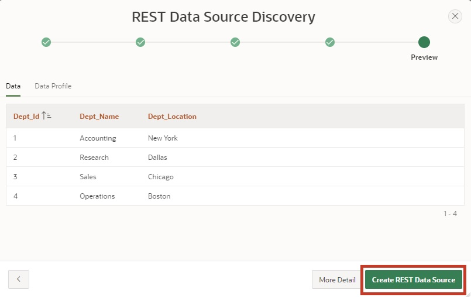

- Nun sehen Sie Ihre soeben erstellte REST Datenquelle in der Übersicht. 
- Sie können sich nun Ihre Rest Source ansehen. Klicken Sie dafür auf den Link Departments. 

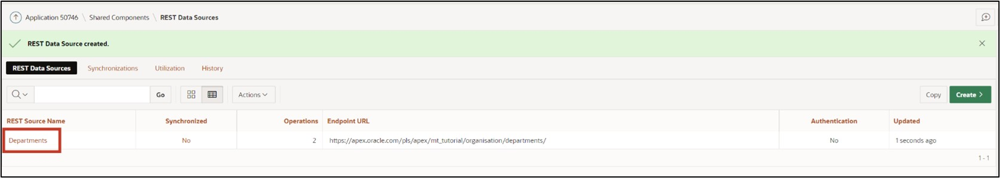
 
- Ihre Rest Source sollte ähnlich wie in der folgenden Abbildung aussehen:

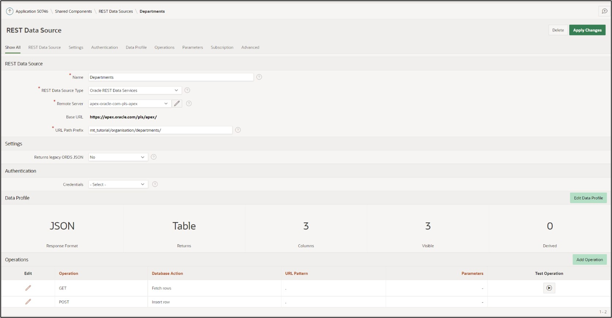

- Kontrollieren Sie, dass Ihre Einstellungen im **Data Profile** wie im Bild gezeigt aussehen und, dass bei **Operations** die beiden Operations ***GET*** und ***POST*** angelegt wurden. 
 
## <a name="senden-von-daten-an-eine-rest-datenquelle"></a>10.3 Senden von Daten an eine REST-Datenquelle
In diesem Kapitel werden wir die zuvor erstellte REST Source nutzen, um eigene Daten senden. Konkret werden wir dabei neue Departments hinzufügen. Dafür wird die HTTP-POST-Methode verwendet, welche in der REST Data Source als Operation definiert wurde. 
- Öffnen Sie den **App Builder** und Ihre Anwendung. Klicken Sie auf **Create Page** und erstellen Sie eine neue Seite, indem Sie auf **Create Page** klicken. 

- Wählen Sie als Page Type **Form** aus. 
  
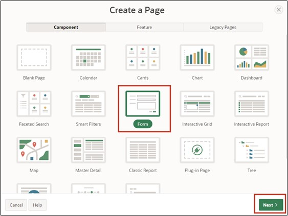

- Geben Sie als **Page Number *61*** und als **Page Name *Departments*** an.   
- Wählen Sie bei **Data Source *REST Data Source*** an und wählen Sie anschließend ***Departments*** als **REST Data Source** aus.  
- Deaktivieren Sie im Bereich **Navigation** die *Breadcrumb* und klicken Sie auf **Next**.   

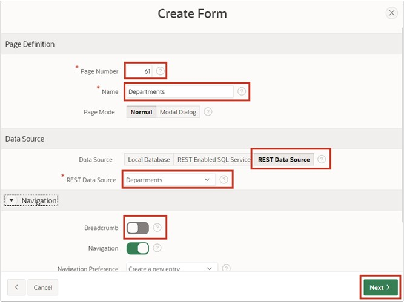  

- Wählen Sie bei der **Primary Key Column *DEPT_ID*** aus. 
- Geben Sie bei **Branch Here on Submit *61*** ein und bei **Cancel and Go to Page** ebenfalls ***61***.
- Erstellen Sie nun Ihre Seite, indem Sie auf den **Create Page** Button klicken. 

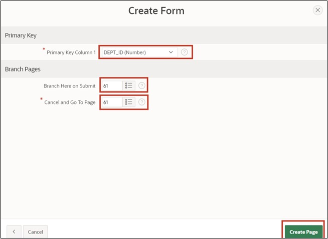

- Rufen Sie die Seite über den **Run**-Button auf. 

- Über das Form können Sie nun neue Departments hinzufügen. 

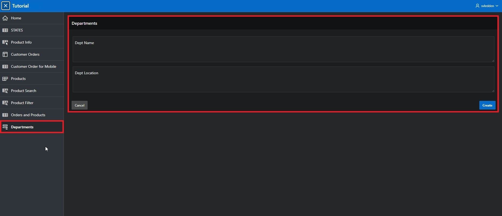

## <a name="abrufen-von-daten-aus-einer-rest-data-source"></a>10.4 Abrufen von Daten aus einer REST Data Source
Nun möchten wir die REST Data Source nicht nur zum Hinzufügen von Daten nutzen, sondern auch, um Daten abzurufen und diese anzeigen zu lassen. Dafür wird die HTTP-GET-Methode verwendet, welche in der REST Data Source als Operation definiert wurde.  
- Über das in Kapitel 13.3 erstellte Form ist es nun möglich, neue Departments anzulegen. Um direkt zu erkennen, ob das Hinzufügen erfolgreich war, werden Sie zusätzlich einen Report auf der Seite erstellen. 

- Klicken Sie im Page Designer auf der linken Seite auf Departments und machen Sie dann einen Rechtsklick auf Body. Wählen Sie hier **Create Region** aus.  

- Wählen Sie als **Type** Ihrer Region ***Classic Report*** aus und geben Sie ihr den **Title *Alle Departments***. Wählen Sie unter Source ***REST Source*** als **Location** aus und anschließend ***Departments*** als **REST Source**.  

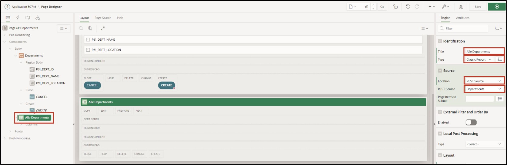
 
- Rufen Sie die Seite über den **Run**-Button auf.  
- Der Report zeigt Ihnen jetzt alle Departments an.  
 
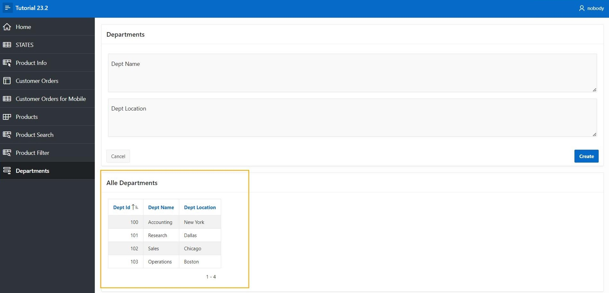

> Eine weitere Demo-Anwendung der MT - IT Solutions auf Basis von REST Data Sources finden Sie hier:  
[https://apex.oracle.com/pls/apex/mt_apisearch/r/datasources](https://apex.oracle.com/pls/apex/mt_apisearch/r/datasources)


# <a name="karten-erstellen"></a>11. Karten erstellen 
In dieser Aufgabe werden Sie eine Anwendungsseite mit einer Weltkarte erstellen. Die nötigen Daten dafür erlangen wir über eine (in Kapitel 13.2 vorgestellte) REST Data Source.
Das Ziel ist es, alle Erdbeben auf der Erde, die in den letzten 24 Stunden stattfanden, auf einer Karte in APEX darzustellen.

## <a name="karten-rest-data-source"></a>11.1	REST Data Source 
Um später die Erdbebendaten der Karte aktuell zu halten, richten Sie nun eine REST Data Source ein. Die detaillierten Schritte dieses Unterkapitels können Sie sich mit Screenshots bei Bedarf erneut in Kapitel 13.2 anschauen, im Folgenden werden die Schritte darum nur grob beschrieben.

Zu Beginn erstellen Sie im App-Builder eine neue Anwendung und nennen diese **Earthquakes**. Sie brauchen keine weiteren Einstellungen vorzunehmen. In der Anwendungsübersicht wählen Sie dann **Shared Components** aus.

Dort angelangt klicken Sie unter der Kategorie **Data Sources** die Option **REST Data Sources** an.

Klicken Sie nun auf die **Create** Schaltfläche, im Pop-Up Fenster lassen Sie die Auswahl bei **From Scratch** und geben im nächsten Schritt als Name **EarthquakeData** ein. Unter URL Endpoint fügen Sie folgende URL ein:  [https://earthquake.usgs.gov/earthquakes/feed/v1.0/summary/all_day.geojson](https://earthquake.usgs.gov/earthquakes/feed/v1.0/summary/all_day.geojson)  

Nun klicken Sie, ohne etwas zu verändern, so lange auf weiter, bis sich das Fenster wieder schließt und die REST Data Source erstellt wurde. 

Damit die Daten jeden Tag mit einer lokalen Tabelle aktualisiert werden, werden Sie nun eine Synchronisierung einrichten. Dazu wählen Sie die gerade erstellte REST Data Source aus. Klicken Sie jetzt auf das im Bild gezeigte Feld:

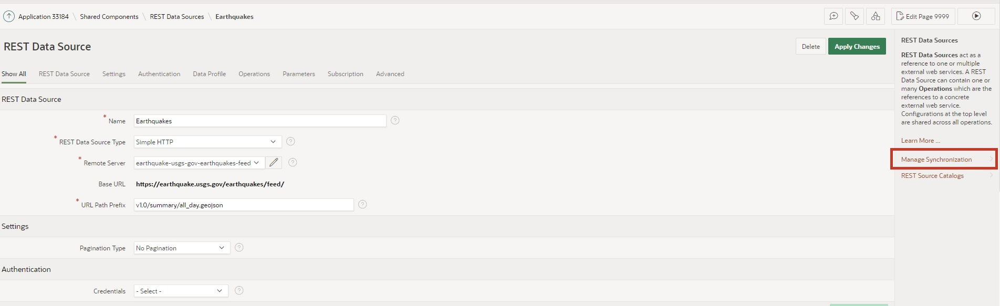

Nun ändern Sie bis auf den Namen nichts und tippen in dem Namensfeld **Table Name** den Namen **EarthquakeData** ein. Nachdem Sie zum Speichern auf **Save** geklickt haben, werden Sie auf die im Bild zu sehenden Optionen stoßen. 
Klicken Sie auf das markierte Feld: 

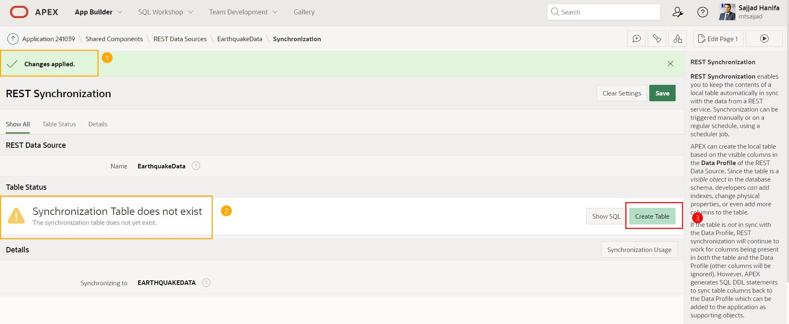

Dadurch haben Sie nun eine Tabelle erstellt, in welche die Daten, die aus der zuvor eingegebenen URL abgerufen werden, zukünftig gespeichert werden. Jetzt stellen Sie die Synchronisierungszeiten der Daten ein. Dazu klicken Sie erneut auf die im nächsten Bild markierten Felder:

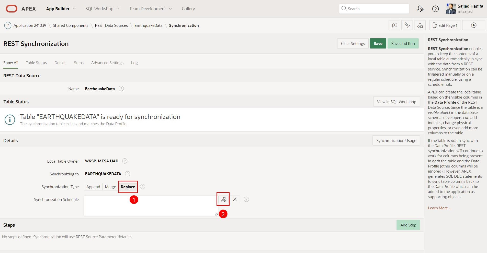

Nach dem Sie auf das zweite Feld geklickt haben, öffnet sich ein Pop-Up Fenster, in welchem Sie nun die Synchronisierung konfigurieren können. Da wir die Daten jeden Tag einmal auffrischen möchten, wählen Sie nun **daily** aus. Die Felder **Execution Hour** und **Execution Minute** füllen Sie nun jeweils mit einer beliebigen Zeit auf. Nachdem Sie auf **Set Execution Interval** geklickt haben, klicken Sie noch auf das Feld **Save and Run**, wodurch nun einmal die erstellte Tabelle mit Daten gefüllt wird. Jetzt wird die Tabelle jeden Tag aktualisiert.  

Die Tabelle mitsamt der aktuellen Erdbebendaten ist nun im **Object Browser** vorzufinden.  
 
## <a name="erstellen-der-karte-auf-einer-neuen-anwendungsseite"></a>11.2	Erstellen der Karte auf einer neuen Anwendungsseite
Stellen Sie sicher, dass Sie nun auf die Anwendungsübersicht jener Anwendung navigieren, die Sie zu Beginn erstellt haben.  

- Dort wählen Sie **Create Page**.  

- Klicken Sie im geöffneten Pop-Up Fenster auf das **Map** und anschießend auf **Next**.  
  
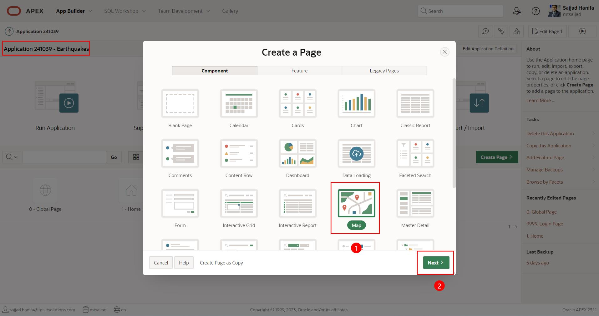  
 
- In der daraufhin gezeigten Übersicht geben Sie einen beliebigen Seitennamen ein.  
- Unter **Local Database** wählen Sie unter **Table / View Name** die eben erstellte Tabelle **EARTHQUAKEDATA** aus.  
- Deaktivieren Sie im Bereich Navigation die *Breadcrumb* und klicken auf **Next**.   

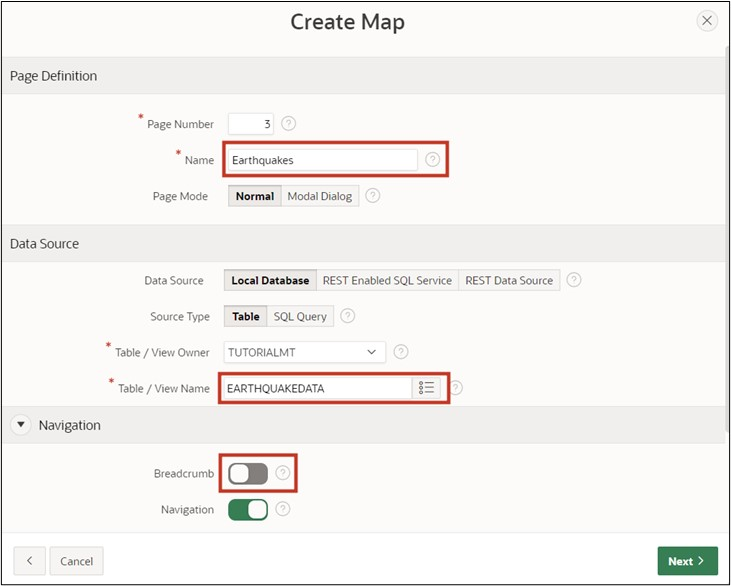  

In der nächsten Übersicht, können Sie zwischen unterschiedlichen Anzeigemöglichkeiten wählen, wie die Orte Dargestellt werden sollen.  
- Da Sie dabei sind, eine Übersicht über Erdbeben zu erstellen, wählen Sie nun nicht **Points**, wodurch nur die Orte der Erdbeben markiert werden würden, sondern wählen Sie **Heat Map**, um den Ort und ein gewissen Eindruck des Ausmaßes später auf der Karte erkennen zu können. 

- Nun müssen Sie nur noch von den dort angezeigten Auswahlmöglichkeiten das Feld **Geometry-Column** ändern. Dort wählen Sie die Spalte **Geometry** aus.  

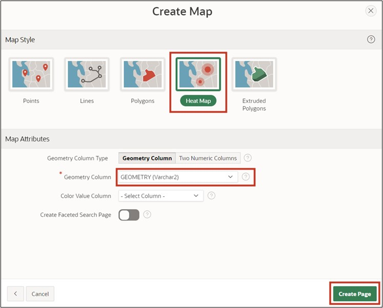 

Nachdem Sie auf **Create Page** geklickt haben, können Sie die Anwendung starten und auf die erstellte Seite navigieren.

Dort sehen Sie nun alle gespeicherten Erdbeben und bekommen einen Eindruck über das Ausmaß derer vermittelt.

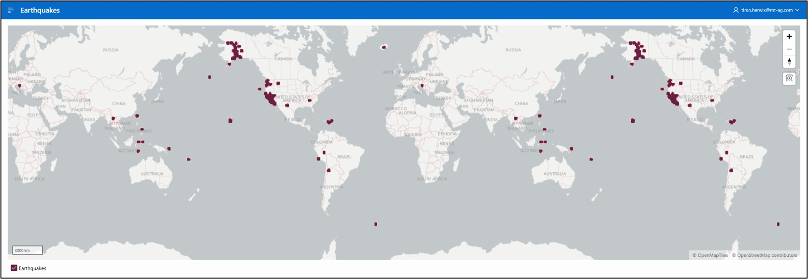


 

<br><br>
Herzlichen Glückwunsch!  
Sie haben das Tutorial erfolgreich beendet.
 
Falls Sie noch mehr über APEX lernen wollen, schauen Sie doch mal auf unserem APEX Portal vorbei:  
[apex.mt-itsolutions.com/from-zero-to-hero](https://apex.mt-itsolutions.com/from-zero-to-hero)

Wenn Sie die nächsten Schritte mit APEX gehen oder Ihre Kenntnisse im Bereich JavaScript oder Continous Integration erweitern wollen, bieten wir Ihnen individuelle Schulung an!
Besuchen Sie dazu unser Trainingsportal [https://apex.mt-itsolutions.com/ords/r/portal/apex/training](https://apex.mt-itsolutions.com/ords/r/portal/apex/training).
