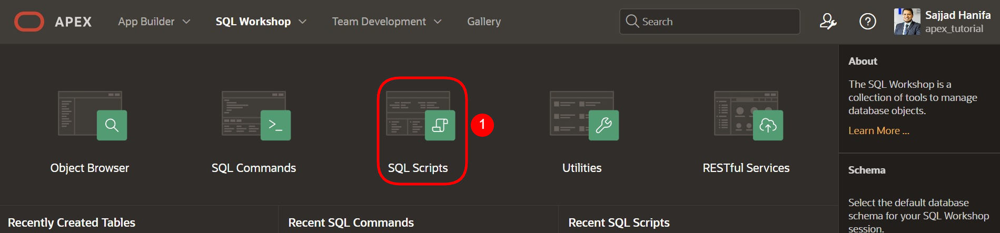
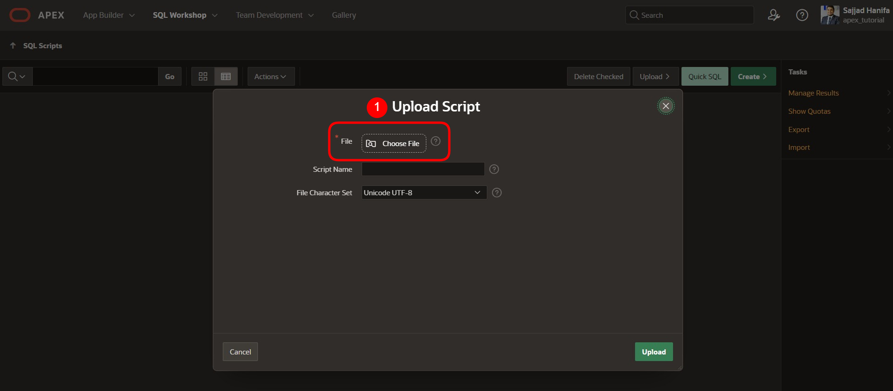

# Vorbereitung

Herzlich Willkommen bei dem Workshop „Hands-On APEX 22.1“ der MT AG.
Bevor Sie mit der Bearbeitung dieses Tutorials beginnen können, müssen Sie einen Workspace auf den Servern von Oracle beantragen. Dies können Sie innerhalb weniger Minuten unter [apex.oracle.com](apex.oracle.com) erledigen.

Falls Sie die Möglichkeit nutzen möchten, englischsprachige Tutorials zu bearbeiten, gibt es unter dem folgenden Link die Möglichkeit, dies zu tun. Klicken Sie einfach auf [https://apex.oracle.com/en/learn/tutorials/](https://apex.oracle.com/en/learn/tutorials/) und bearbeiten Sie die von APEX bereitgestellten Tutorials, wenn Sie noch einen größeren Einblick in die Welt von APEX erhalten möchten.  

# 1. Import der benötigten Daten

## 1.1. Skript

Ein Skript ist eine Liste von Befehlen zur Automatisierung von Prozessen. In diesem Fall erzeugt das Skript Tabellen und Sequenzen. Außerdem werden die Tabellen durch das Skript mit Daten befüllt.

Tabellen sind die Grundeinheit des Datenspeichers einer Oracle-Datenbank. In ihnen werden Daten in Zeilen und Spalten gespeichert. Eine Zeile ist eine Sammlung von Spalteninformationen, die einem einzelnen Datensatz entsprechen. Die Spalten definieren die Datentypen der einzelnen Daten einer Zeile. 

Bevor Sie mit dem Erstellen der Anwendung starten können, müssen Sie zunächst die benötigten Daten per SQL-Skript in die Datenbank Ihres Workspace laden.

Das Hochladen und Ausführen des Skripts sorgt dafür, dass alle Datenbankobjekte angelegt und alle Daten eingefügt werden. Anschließend können Sie in Ihrer Anwendung auf diese Daten zugreifen.

Verwenden Sie das beigefügte SQL-Skript (**Skript.sql**), um die Daten wie im Folgenden beschrieben zu importieren.

## 1.2. Import des Skripts

- Navigieren Sie zum **SQL-Workshop**, indem Sie eine der zwei rot markierten Möglichkeiten wählen.

- Wenn Sie sich im **SQL Workshop** befinden, klicken Sie dort auf **SQL Scripts**.

- Klicken Sie nun auf **Upload**.

- Wählen Sie das Skript **Skript.sql** aus, welches sich in dem Ordner **Kapitel-01** befindet. Laden Sie das Skript durch Klicken auf den Upload-Button hoch bzw. ziehen Sie es in das vorgesehene Feld.

- Starten Sie das Skript, indem Sie auf den **Run**-Button drücken.

- Klicken Sie auf **Run Now**.

- Nach dem erfolgreichen Import sollten Sie folgendes Ergebnis sehen:

Es sollten jetzt alle Tabellen und Daten, welche für dieses Tutorial benötigt werden, in Ihrem Workspace vorhanden sein.  

## 1.3. Datenmodellierung mittels Quick SQL

Eine weitere Möglichkeit, Datenmodelle ohne viel Aufwand anzulegen, bietet Quick SQL. Wie das funktioniert, erfahren Sie in der **Aufgabe #14: Exkurs: Datenmodellierung mittels Quick SQL**. 
