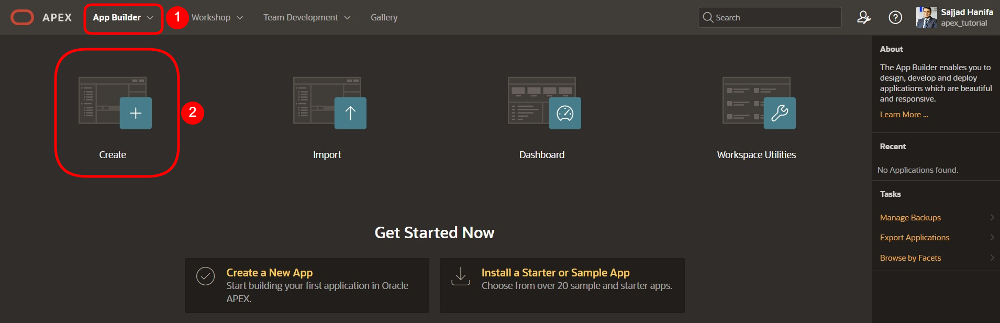
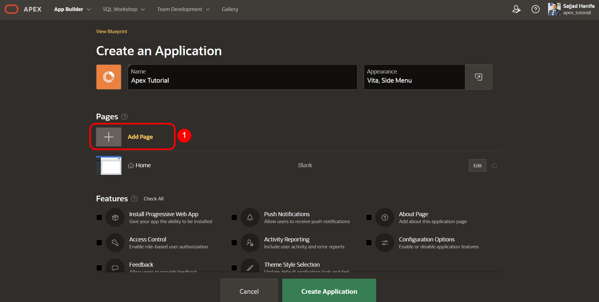
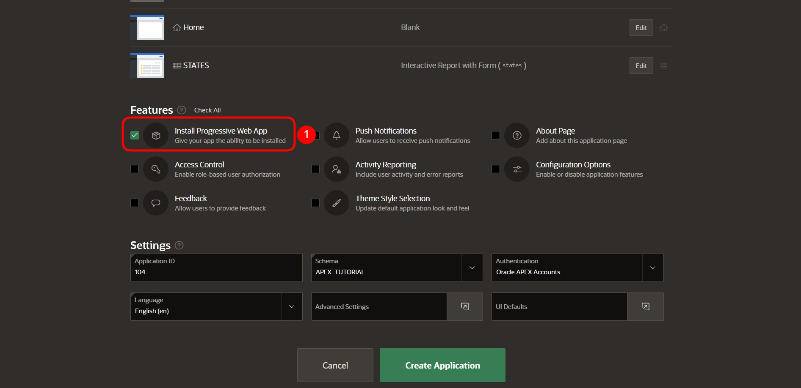
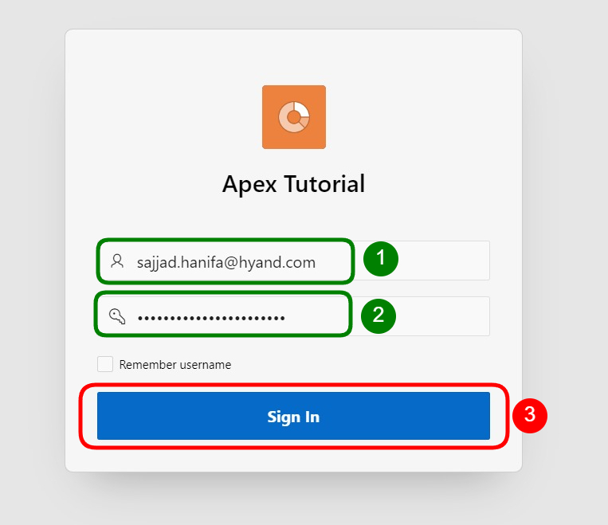

# 2. Create App Wizard

Der Create App Wizard ist ein Assistent, der es Entwicklern ermöglicht, Standard APEX-Anwendungen schnell zu entwerfen und zu entwickeln. Dabei kann der Assistent verwendet werden, um vollständige Anwendungen zu erstellen, die aus mehreren Seiten und einer Vielzahl von verschiedenen Reports und Forms bestehen.

In diesem Kapitel wird das Grundgerüst der Anwendung und die erste Seite erstellt. Im Create App Wizard geben Sie die Einstellungen für Ihre Anwendung an. Nachdem Sie auf Create Application geklickt haben, erstellt APEX die Anwendung mit Ihren Einstellungen.

## 2.1. Erstellen einer Anwendung

- Für die weiteren Aufgaben muss zunächst eine **Anwendung** erstellt werden. Öffnen Sie hierzu als erstes den **App Builder** und klicken Sie auf den Button **Create**. Der App Builder zeigt alle installierten Anwendungen an.

- Der Assistent zur Erstellung von Anwendungen wird gestartet. Klicken Sie auf New Application, um eine neue Anwendung zu erstellen.

- Geben Sie jetzt den Namen der Anwendung ein (z.B. Tutorial 22).

- Wenn gewünscht kann mit einem Klick auf den blauen Briefumschlag, links vom Namen, auch das Application Icon angepasst werden. Es öffnet sich ein Wizard, in dem ein Icon und eine Farbe ausgewählt oder ein eigenes Bild hochgeladen werden kann.

- Im Assistenten können Sie direkt eine erste Seite in Ihrer Anwendung erstellen. Dazu klicken Sie auf das Plus oder auf Add Page.

## 2.2. Report

In APEX ist ein Report eine formatierte Darstellung einer SQL-Abfrage. Ein Report kann über den Assistenten oder über eine händisch eingegebene SQL-Abfrage generiert werden.

APEX unterscheidet zwischen dem klassischen und dem interaktiven Report. Der Unterschied zwischen den beiden besteht darin, dass der Benutzer beim interaktiven Report die Möglichkeit hat, die Darstellung der Daten durch Suchen, Filtern, Sortieren, Spaltenauswahl, Hervorheben und andere Datenmanipulationen anzupassen.

- Nachdem Sie auf den Button geklickt haben, um eine Seite hinzuzufügen, öffnet sich ein neues Fenster mit einem Assistenten zur Erstellung der Seite. Dort wählen Sie **Interactive Report** aus.

- Es folgen die Eigenschaften der Seite im nächsten Fenster. Als **Page Name** geben Sie ***STATES*** ein.
-	Die Einstellungen **Table or View** und **Interactive Report** sind standardmäßig ausgewählt. Falls das nicht der Fall ist, wählen Sie diese bitte aus.
-	Als nächstes klicken Sie auf das Dropdown-Menü rechts, um eine **Tabelle auszuwählen**, die im Interactive Report angezeigt werden soll. 

-	Es öffnet sich der **Search Dialog**, wo Sie die Tabelle ***STATES*** auswählen.
-	Setzen Sie das Häkchen für **Include Form** und klicken Sie anschließend auf den Button **Add Page**.

 
## 2.3. Create Application

-	So sollte Ihr Create App Wizard jetzt aussehen. 

-	Setzen Sie nun das Häkchen für das Feature **„Install Progressive Web App“**. Mit diesem Feature können APEX Anwendungen auf mobilen Endgeräten installiert und als eigenständige Anwendung verwendet werden. Mehr dazu erfahren Sie in **Aufgabe #07: Features für mobile Endgeräte**. 

-	Wenn Sie herunterscrollen, sehen Sie unter **Settings** die **Application ID**. Da Sie diese im weiteren Verlauf noch brauchen werden, ist es ratsam, sich diese zu notieren.  
Bei der Application ID handelt es sich um eine eindeutige Nummer, über welche die Anwendung im Browser aufgerufen werden kann.

-	Nachdem Sie alle anderen Schritte absolviert haben, klicken Sie auf den **Create Application**-Button, um die Anwendung zu erstellen. 

 
## 2.4. Run Page

Nachdem Sie die Anwendung erstellt haben, öffnet sich die Seitenübersicht Ihrer Anwendung. 
Sie sehen fünf Seiten: **0 - Global Page - Desktop**, **1 - Home** und **9999 - Login Page** sind Standardseiten, die bei jeder Anwendung erstellt werden. Die Global Page ist eine Masterseite. Sämtliche Komponenten, die auf der Global Page angelegt werden, werden auf allen Seiten der Anwendung angezeigt. 
Die Seiten **2 - STATES** und **3 - State** haben Sie eben über den Add Page – Assistenten erstellt.
-	Klicken Sie auf die markierte Schaltfläche, um die **Listenansicht** zu öffnen

-	Klicken Sie auf den **Run-Button** der ***STATES***-Seite, um die erstellte Seite anzusehen.

-	Es erscheint ein Login-Bildschirm, wo Sie sich mit Ihrem Username und Ihrem Password (selbe Zugangsdaten wie für den Workspace) anmelden.

-	Nach dem Login erscheint die Seite ***STATES*** mit einem Interactive Report.

-	Wenn Sie auf das **Stiftsymbol** in der linken Spalte klicken, öffnet sich ein modaler Dialog, in dem Sie die Daten ändern können. 

-	Fürs Erste lassen wir die Inhalte so wie sie sind und schließen den modalen Dialog wieder (über den **Cancel**-Button oder das x oben in der Ecke). 
-	Wechseln Sie nun zurück in den Tab **App Builder**. 
