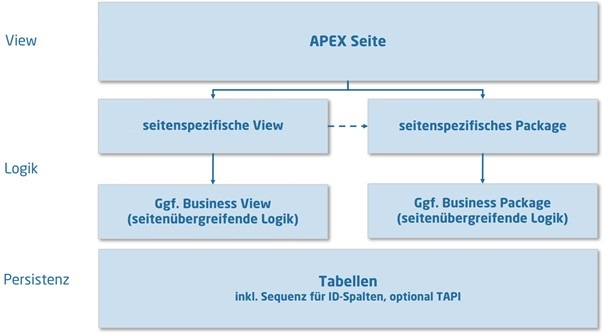
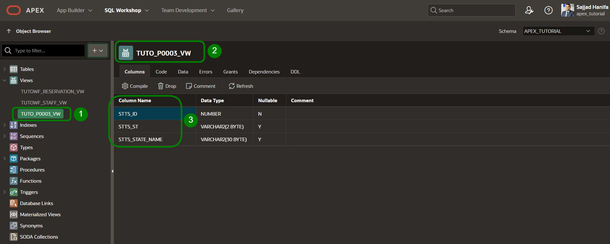
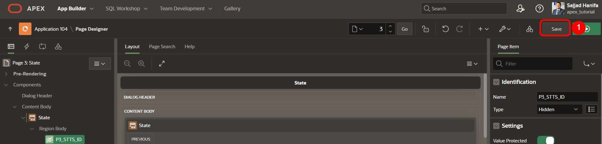
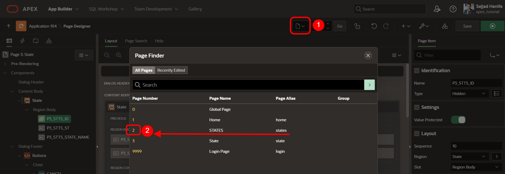
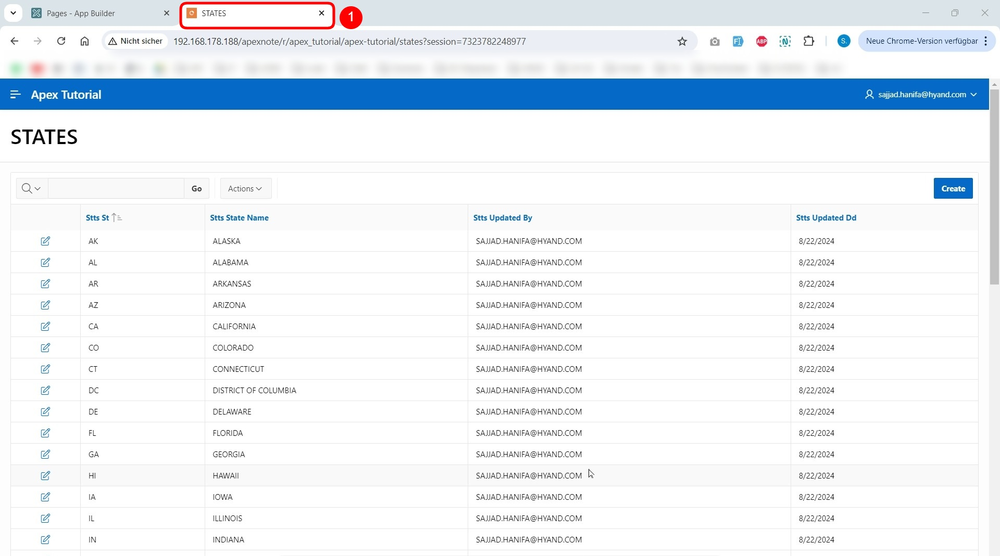

# 3. Zugriff auf Views statt auf Tabellen vornehmen

Um einen einheitlichen Zugriff auf die Daten zu gewähren, werden View-Schichten genutzt.  

Mit Views kann man leicht aus großen Tabellen nur die wichtigsten Spalten selektieren, um diese anzuzeigen.  

Bei einer View handelt es sich um eine in einer Datenbank gespeicherte SQL-Abfrage für Daten, welche von den Datenbankbenutzern genauso abgefragt werden kann, wie die Daten in einer Tabelle. Damit ist das Ergebnis einer View eine Art virtuelle Tabelle, die dynamisch aus Daten in der Datenbank generiert wird, wenn der Zugriff auf die View angefordert wird. Ändern sich Daten in der Tabelle, werden die Änderungen auf die View gespiegelt.   

  

Es bietet sich an, die Views auf zwei verschiedene Arten einzusetzen: Für jede APEX-Seite werden seitenspezifische Views erstellt. Diese enthalten die Informationen, die auf der spezifischen Seite angezeigt werden. Für jede Seite sollten daher eine oder mehrere Views angelegt werden.  

Sollen Views seitenübergreifend verwendet werden, sollte eine Business View erstellt werden.  

In diesem Tutorial wird ausschließlich auf seitenspezifische Views zurückgegriffen.   

Im Folgenden werden nun die Views erstellt und die Zugriffe, die auf die Tabellen erfolgen, auf die Views umgestellt.  
 
## 3.1. Tools
Im SQL Workshop werden Werkzeuge bereitgestellt, mit denen Datenbankobjekte angezeigt, erstellt und verwaltet werden können.  

Eines der Werkzeuge ist **SQL-Commands**. In diesem können direkt SQL-Befehle eingegeben und ausgeführt werden.   

Ein weiters Werkzeug ist der **Object Browser**. Mit diesem können Objekteigenschaften angezeigt und bearbeitet werden. Ebenso können hierüber neue Objekte erstellt werden.   
Der **Object Browser** ist in zwei Bereiche unterteilt. Auf der linken Seite wird der Objektauswahlbereich angezeigt. Dort werden alle Datenbankobjekte eines bestimmten Typs aufgelistet, die im aktuellen Schema vorhanden sind. Auf der rechten Seite werden detaillierte Informationen zu den einzelnen Objekten angezeigt.   

- Navigieren Sie über das Dropdown-Menü **SQL Workshop** zu dem Eintrag **Object Browser**.   

  

- Starten Sie den Assistenten zum Erstellen einer View. Öffnen Sie dazu das Dropdown-Menü über das + und klicken auf den Eintrag View.  

  

Es öffnet sich ein Assistent zur Erstellung der View.    
Nun müssen Sie den entsprechenden Code sowie einen Namen für die View hinterlegen. Um eine einheitliche Benennung über verschiedene Anwendungen hinweg zu erzielen, empfiehlt sich die Verwendung von Namenskonventionen.  

In diesem Fall setzt sich die Bezeichnung der View wie folgt zusammen:  
**<APP_KUERZEL>_P<PAGE_ID>_VW**  

- Ersetzen Sie die Platzhalter mit den folgenden Werten:
  - <APP_KUERZEL>: Kürzel für Ihre Anwendung, z.B. TUTO für Tutorial
  - <PAGE_ID>: 0003 (Seitennummer, für die die View erstellt wird)  

- So könnte Ihre View beispielsweise **TUTO_P0003_VW** heißen.  
  Als **Query** (eine Abfrage, die gezielt nach Daten sucht) fügen Sie folgenden Code ein:
  ```sql
  select stts_id,
        stts_st,
        stts_state_name
  from states
  ```

- Achten Sie beim Einfügen auf die Formatierung der Abfrage. Sollte Ihre Formatierung nicht wie gezeigt aussehen, formatieren Sie sie entsprechend.  


- Abschließend klicken Sie auf den Button **Create View**.  

- So sollte Ihre fertige View aussehen:  

  

 
## 3.2. Page Processes
**Page Processes** werden zu bestimmten, festgelegten Zeitpunkten ausgeführt, beispielsweise beim Aufrufen der Seite oder beim Speichern. Durch sie werden Aufrufe der Applikationslogik oder Datenbank-Operationen realisiert. Für die Verarbeitung eines Formulars sind in APEX zwei Prozesse verantwortlich: **Form – Initialization** und **Form – Automatic Row Processing (DML)**.  

Beide werden automatisch beim Erstellen einer Formular-Seite mithilfe des Wizards generiert und sorgen dafür, dass die Eingabefelder beim Aufruf die richtigen Daten enthalten und dass die Werte beim Abschicken des Formulars in der entsprechenden Datenquelle gespeichert werden.  

Im Folgenden wird die erstellte View dem DML-Prozess zugeordnet und einige kleinere Änderungen am Formular vorgenommen.  

- Gehen Sie in den Page Designer, indem Sie oben in der Leiste auf den **App Builder** klicken, dann auf Ihre **Anwendung** und dann auf die Seite 3 - ***State***.  

  
  
- Klicken Sie auf die Region **State** und ändern Sie den **Table Name** auf die eben erstellte View ***TUTO_P0003_VW***.  

  

- Klicken Sie nun auf den Reiter **Processing** (die beiden Pfeile links oben)  

  

- Wählen Sie den Process **Process form State** aus, um das Processing anzupassen.  

  

- Ändern Sie den **Target Type** auf ***Region Source***.  

  

Dies sorgt nun dafür, dass für das Processing die gleiche Quelle verwendet wird, wie für die Region. In unserem Fall ist das die eben erstellte View. 
Wird in der Zukunft die Datenquelle der Region geändert, muss das Processing nicht mehr angepasst werden.   

Wenn man in APEX Reports und Forms über den Wizard erstellt, werden die benötigten Standard-Processings (z.B. zum Einfügen oder Updaten von Daten) automatisiert erstellt.  

- Gehen Sie danach wieder in den ersten Reiter **Rendering** mit der Übersicht der Elemente auf der Seite und klicken Sie unter State – Items auf **P3_STTS_ID**. Prüfen Sie, ob der **Type** ***Hidden*** ist. Wenn nicht, ändern Sie ihn entsprechend ab.   

  

- Klicken Sie anschließend auf **Save**.   

  

- Wechseln Sie zur Seite ***STATES***, indem Sie den **Dialog** in der **Breadcrumb-Leiste** aufrufen und dort die Seite 2 ***STATES*** auswählen.  
 
  

- Im Page Designer klicken Sie im Bereich **States** unter Columns auf **STTS_UPDATED_BY** und setzen den **Type** auf ***Hidden Column***. Das gleiche wiederholen Sie für die Spalte **STTS_UPDATED_DD** und klicken anschließend auf **Save**. Nun werden die entsprechenden Spalten im Report ausgeblendet.  

  

- Wenn Sie jetzt die Anwendung im anderen Tab aktualisieren, können Sie Ihre Änderungen sehen.  


