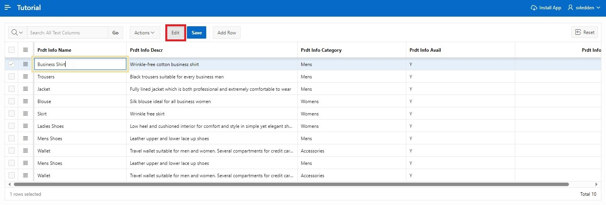
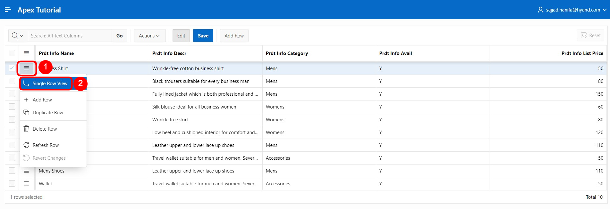

# 4. Interactive Grid

Ein **Interactive Grid** zeigt dem Datenbankbenutzer eine Reihe von festgelegten Datensätzen in einem durchsuchbaren, anpassbaren Bericht an. In diesem Bericht können die Datensätze geändert und aktualisiert werden. Außerdem ist es möglich, neue Datensätze hinzuzufügen und alte zu löschen.

In dieser Aufgabe wird ein **Interactive Grid** angelegt, um die oben genannten Funktionen nutzen zu können.

## 4.1.	Erstellung der View
- Für diese Aufgabe muss zuerst eine **View** erstellt werden.
Dazu gehen Sie wie in Aufgabe #03 über den **SQL Workshop** in den **Object Browser** und starten über das + den Assistenten zur Erstellung der **View**.  
Dort geben Sie folgende Daten ein:

- **View Name**: ***TUTO_P0021_VW***  
- **Query**:
  ```sql
  select PRDT_INFO_ID as PRODUCT_ID,
         PRDT_INFO_NAME AS PRODUCT_NAME,
         PRDT_INFO_DESCR AS PRODUCT_DESCRIPTION,
         PRDT_INFO_CATEGORY AS CATEGORY,
         PRDT_INFO_AVAIL AS PRODUCT_AVAIL,
         PRDT_INFO_LIST_PRICE AS LIST_PRICE
  from PRODUCT_INFO
  ```


- Klicken Sie anschließend auf den Button **Next** und dann auf **Create View**.

## 4.2.	Create Page
- Öffnen Sie den **App Builder** über die Navigationsleiste, wählen Sie Ihre Anwendung aus und klicken Sie auf den Button **Create Page**. 


- Es startet der **Assistent** zum Erstellen einer **Seite**.  
Wählen Sie den Seitentypen **Interactive Grid** aus. Der Wechsel zur nächsten Seite erfolgt automatisch, ansonsten klicken Sie auf den Button **Next**. 


- Geben Sie als **Page Number** ***21*** ein und als **Page Name** ***Product Info***.
- Wählen Sie im Bereich Data Source die erstellte View zur *Product Info* als **Table / View** Name aus und aktivieren Sie nun die Bearbeitung im **Interactive Grid**, indem Sie **Editing Enabled** auf ***enabled*** stellen.  
Dies ist besonders wichtig, damit die Spalte APEX$ROW_SELECTOR erstellt werden kann.
- Öffnen Sie anschließend den Navigationsbereich.


- Deaktivieren Sie hier die Breadcrumb und klicken Sie anschließend auf den Button **Next**. 


- Wählen Sie die Spalte ***Product ID (Number)*** als **Primary Key Column 1** aus.


- Klicken Sie abschließend auf den Button **Create Page**.

- Die **Seite** mit dem **Interactive Grid** wurde erfolgreich erstellt. Starten Sie nun die **Seite**, indem Sie auf den **Run**-Button klicken


- Sie sehen nun das **Interactive Grid**. Zunächst bietet Ihnen das **Interactive Grid** einen Bericht über die bestehenden Daten. Über den Button **Add Row** können Sie einen neuen Datensatz direkt in dieser Tabelle anlegen.

- Außerdem können Sie bestehende Datensätze editieren. Hierzu können Sie mit einem **Doppelklick** einen Eintrag auswählen, woraufhin der Cursor in dem entsprechenden Feld angezeigt wird. Wenn der Edit-Modus aktiviert ist, reicht auch ein einfacher Klick aus. Über den Button **Edit** lässt sich dieser Modus aktivieren bzw. deaktivieren.



- Die von Ihnen durchgeführten Änderungen finden zunächst nur in Ihrem Browser statt. Um die Änderungen zu speichern, klicken Sie auf den Button **Save**. Alternativ können Sie auch unerwünschte Änderungen widerrufen, indem Sie das **Dropdown-Menü** ***Actions*** öffnen und hier den Eintrag ***Refresh*** unter ***Data*** auswählen. So werden die ursprünglichen Daten aus der Datenbank erneut geladen.


- Des Weiteren steht Ihnen eine Detailansicht einzelner Datensätze zur Verfügung. Klicken Sie dafür auf den kleinen Button links neben einem Datensatz und wählen Sie den Eintrag ***Single Row View***. 



- Nun sehen Sie nur noch die Daten zum ausgewählten Datensatz. Über den Button **Report View** gelangen Sie wieder zurück zur Tabellenansicht.


- Je nach Auflösung und Menge der angezeigten Spalten kann es passieren, dass horizontales Scrolling nötig wird


- Um dennoch den Überblick zu behalten, lassen sich Spalten fixieren. **Fixierte Spalten** bleiben bei horizontalem Scrollen stehen. Klicken Sie auf die **Spalte** ***Product Name*** und wählen das **Symbol** für ***Freeze*** aus.


 
- Nun wird die Spalte *Product Name* fixiert dargestellt und es bleibt auch bei horizontalem Scrolling ersichtlich, auf welches Produkt sich die übrigen Spalten beziehen.


