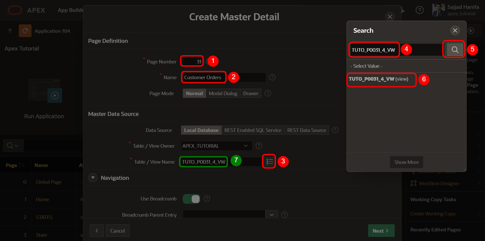
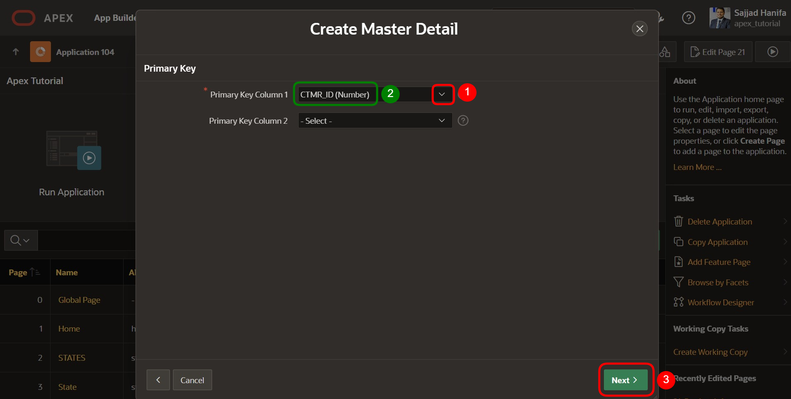
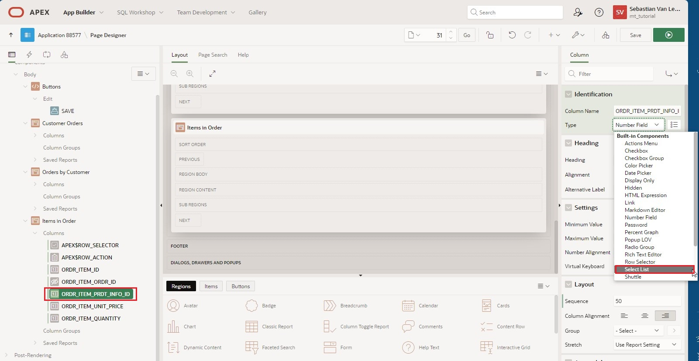
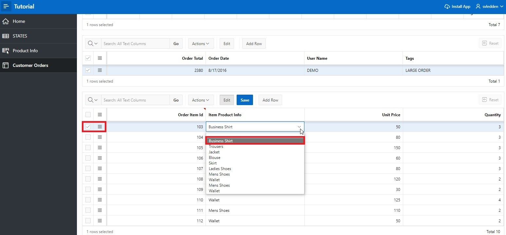
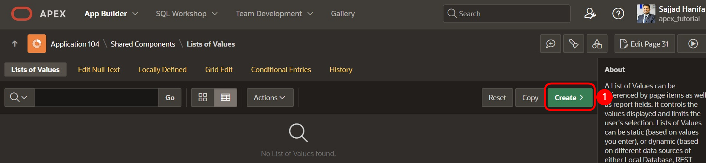
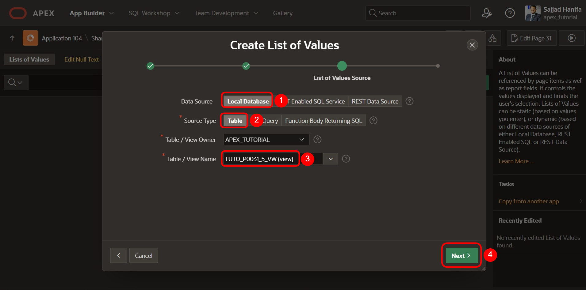

# 5. Master-Detail-Detail
Master – Detail Regionen sind praktisch, wenn man auf einer Seite Daten aus voneinander abhängigen Tabellen darstellen möchte.

In diesem Beispiel enthält die erste Tabelle die Kundendaten, die zweite Tabelle die Bestellungen pro Kunde und die dritte Tabelle die Artikel (Items) der Bestellung.

Beim Auswählen eines Datensatzes ändern sich die Inhalte der Tabellen und man kann für einen Kunden alle Bestellungen und nach Auswahl einer Bestellung jeweils alle zugehörigen Artikel auf einer Seite einsehen.

## 5.1. Erstellung der Views
- Für die Bearbeitung dieser Aufgabe werden vier Views benötigt. Erstellen Sie diese nach den folgenden Vorgaben:

  - TUTO_P0031_1_VW
    ```sql
    select ordr_id, 
           ordr_ctmr_id, 
           ordr_total, 
           ordr_dd, 
           ordr_user_name, 
           ordr_tags 
      from orders
    ```
  - TUTO_P0031_2_VW
    ```sql
    select ordr_item_id,
           ordr_item_ordr_id,
           ordr_item_prdt_info_id,
           ordr_item_unit_price,
           ordr_item_quantity
      from order_items
    ```
  - TUTO_P0031_3_VW
    ```sql
    select prdt_info_id,
           prdt_info_name,
           prdt_info_descr,
           prdt_info_category,
           prdt_info_avail,
           prdt_info_list_price,
           prdt_info_product_image,
           prdt_info_mimetype,
           prdt_info_filename,
           prdt_info_image_last_update,
           prdt_info_tags
      from product_info
    ```
  - TUTO_P0031_4_VW
    ```sql
    select ctmr_id,
           ctmr_frst_name,
           ctmr_last_name,
           ctmr_street_address1,
           ctmr_street_address2,
           ctmr_state,
           ctmr_postal_code,
           ctmr_email,
           ctmr_phone_number1,
           ctmr_phone_number2,
           ctmr_url,
           ctmr_credit_limit,
           ctmr_tags
      from customers
    ```


## 5.2. Erstellung einer Master-Detail-Detail Seite
- Öffnen Sie den **App Builder** über die Navigationsleiste, wählen Sie Ihre Anwendung aus und klicken Sie auf den Button **Create Page**.


- Wählen Sie als Seitentypen **Master Detail** aus.


- Wählen Sie als Bereichstypen **Stacked** aus.


- Geben Sie als **Page Number** ***31*** ein und als **Page Name** ***Customer Orders***. 
- Wählen Sie im Bereich Master Data Source zunächst die erstellte View für die Master Region als **Table / View** Name aus (*TUTO_P0031_4_VW*).
- Öffnen Sie anschließend den Navigationsbereich.



- Deaktivieren Sie hier die **Breadcrumb** und klicken Sie anschließend auf den Button **Next**. 


- Wählen Sie als **Primary Key Column 1** die Spalte ***CTMR_ID (Number)*** und klicken Sie auf den Button **Next**.



Eine Region ist ein Bereich auf einer Seite, der als Container für Inhalte dient. Diese Inhalte können z.B. Items oder Unterregionen sein. Regionen können verwendet werden, um Seitenelemente zu gruppieren. Jede Seite in APEX kann eine beliebige Anzahl von Regionen beinhalten. 

- Als nächstes wird die **Detail Region** konfiguriert. Ändern Sie dazu die folgende Felder wie angegeben ab:  

  | | |  
  |--|--|
  | Detail Region Title | Orders by Customer |  
  | Show Only Related Tables | No |  
  | Table / View Name | View zur Tabelle Orders (*TUTO_P0031_1_VW*) |
  | | |


 
- Klicken Sie anschließend auf den Button **Next**.
 
- Füllen Sie hier die Felder wie folgt aus und klicken Sie anschließend auf **Create Page**:

  | | | 
  |--|--|
  | Primary Key Column | ORDER_ID |
  | Master Column | CTMR_ID |
  | Detail Column | ORDR__CTMR_ID |
  | | |


- Ihnen wird nun der **Page Designer** der **Seite** ***31*** angezeigt. Über den **Run**-Button können Sie Ihre soeben erstellte Seite betrachten.


- Zur besseren Lesbarkeit der Spalten empfiehlt es sich, die **Spaltenüberschriften** anzupassen. Klicken Sie dazu auf die jeweiligen Spalten in den Interactive Grids (z.B. CTMR_FRST_NAME im Grid Customer Orders) und ändern Sie die Spaltenüberschrift bei Heading rechts in den Spalteneigenschaften. 


- Wiederholen Sie den Vorgang für die weiteren Spalten. Über den **Run**-Button können Sie die veränderte Seite betrachten.


- Da bisher jedoch lediglich eine **Master-Detail** Seite erstellt wurde, wird nun eine weitere **Detail-Region** benötigt. Klicken Sie mit der **rechten Maustaste** auf die **Region** ***Orders by Customer*** und wählen Sie den Eintrag **Create Region Below** aus. 


- Ändern Sie anschließend den **Title** zu ***Items in Order*** und den **Type** zu ***Interactive Grid***. Ändern Sie anschließend unter Source den **Type** zu ***SQL Query***.


- APEX markiert nun unter Source das Feld für die **SQL Query** rot. Hier muss eine entsprechende Query hinterlegt werden, um die Seite lauffähig zu speichern. Sie können entweder direkt in dem Feld tippen oder den Code Editor als modalen Dialog anzeigen lassen. Klicken Sie auf den Button über dem Feld, um den Code Editor aufzurufen.


- Der Code Editor ermöglicht das komfortable Schreiben von SQL-Code und unterstützt den Entwickler mit Zusatzfunktionen wie z. B. Syntax Highlighting und der Validierung des Codes. Geben Sie folgenden Code in dem Code-Editor ein:
  ```sql
  select ordr_item_id,
         ordr_item_ordr_id,
         ordr_item_prdt_info_id,
         ordr_item_unit_price,
         ordr_item_quantity
  from TUTO_P0031_2_VW
  ```
- Anschließend können Sie auf das Häkchen im Code-Editor klicken und die Query von APEX validieren lassen. Sollte alles korrekt sein, wird APEX Ihnen eine entsprechende Rückmeldung geben. 

- Klicken Sie anschließend auf den Button **OK**.


- Wählen Sie bei **Master Detail** die Region ***Orders by Customer*** als Master Region aus.


- Klicken Sie nun im linken Bereich des Page Designers in der Region **Items in Order** unter Columns auf die Spalte **ORDR_ITEM_ORDR_ID**. Wählen Sie anschließend im rechten Bereich die Spalte **ORDR_ID** als **Master Column** aus. Dadurch wird die Verknüpfung zwischen den zwei Regionen hergestellt. 


- Speichern Sie die Änderungen, indem Sie den Button **Save** drücken. Alternativ können Sie direkt den Button **Run** klicken, um zu speichern und daraufhin die Seite aufzurufen.

- Auf der von Ihnen erstellten Seite sind nun drei **Interactive Grids** zu sehen. Wählen Sie in der obersten Region einen beliebigen Eintrag (Kunden) aus.


- In der mittleren Region werden nun alle Bestellungen dieses Kunden angezeigt. Wählen Sie auch hier einen beliebigen Eintrag (Bestellung) aus.


In der untersten Region werden alle Artikel aus der ausgewählten Bestellung angezeigt. Auch wenn hier, wie in den oberen Regionen, ein **Interactive Grid** verwendet wird, ist standardmäßig der Edit-Modus nicht verfügbar, wenn das **Interactive Grid** ohne den Assistenten erstellt wurde. Außerdem wird dem Nutzer zwar die ID der bestellten Artikel aber nicht deren Artikelname angezeigt.  

Um dies zu ändern, wird das **Interactive Grid** in den nächsten Schritten entsprechend angepasst. 

- Öffnen Sie erneut den **Page Designer**. Wählen Sie den **Eintrag** ***Attributes*** bei der **Region** ***Items in Order***. Setzen Sie anschließend den Wert von **Enabled** in dem Bereich **Edit** auf ***Yes***. Dies aktiviert den **Edit-Modus** für das **Interactive Grid**.


- Anschließend muss noch ein Primary Key für das Interactive Grid **Items in Order** festgelegt werden. Dazu klicken Sie auf die Column **ORDR_ITEM_ID** und setzen unter Source den **Primary Key** auf ***Yes***.


 
- Wählen Sie nun die Spalte **ORDR_ITEM_PRDT_INFO_ID** bei der Region **Items in Order** aus. Ändern Sie den **Type** zu ***Select List***.  
Eine Select List ist eine Auflistung von Daten, die es dem Benutzer ermöglicht, einen bestimmten Wert auszuwählen.



- APEX meldet, dass eine *List of Values* hinterlegt werden muss. Wenn Sie oben auf das **Message Icon** klicken, erhalten Sie zusätzliche Informationen dazu. 


- Ändern Sie den **Type** der *List of Values* zu ***SQL Query***.

*List of Values* sind Abfragen bestehend aus zwei Werten: einem Anzeigewert, der dem Benutzer angezeigt wird und einem Rückgabewert, mit dem APEX in der Datenbank gearbeitet wird.

Nun müssen Sie eine SQL Query hinterlegen. Hinweise zur Erstellung der korrekten Query erhalten Sie über den Reiter **Help**. 


Hinterlegen Sie folgenden Code in dem Feld **SQL Query**:
```sql
select prdt_info_name as d,
       prdt_info_id as r
from TUTO_P0031_3_VW
```


- Klicken Sie anschließend erst auf den Button **Save** und dann auf den Button **Run**, um die Seite zu speichern und auszuführen.



Sie sehen nun, dass in der untersten **Region** statt der **ID** die zugehörigen **Namen** der Artikel angezeigt werden. Durch eine **Select List** lassen sich nun die entsprechenden Artikel auswählen und ändern. Geändert wurde lediglich das **angezeigte Element**.  
APEX hinterlegt weiterhin in der Datenbank die **ID**. 


## 5.3. Popup List of Values
**List of Values** können auch als Popup-Fenster angezeigt werden. In APEX 23.1 wurden hierfür einige Funktionen optimiert und erweitert. Diese sollen im Folgenden an einem Beispiel angewendet werden.

Die Felder der Spalte **State** im **Interactive Grid** können bislang über eine Texteingabe geändert werden. Stattdessen soll nun dort eine Auswahlliste angezeigt werden, entsprechend der Einträge in der Datenbanktabelle **States**.

- Für die Bearbeitung dieser Aufgabe wird eine weitere **View** benötigt. Erstellen Sie diese gemäß der folgenden Angaben:
  - TUTO_P0031_5_VW
    ```sql
    select STTS_ID,
           STTS_ST
           STTS_STATE_NAME
      from STATES
    ```

- Öffnen Sie den **Page Designer** für die Seite ***31 Customer Orders***. Wählen Sie dort in der Region **Customer Orders** unter **Columns** die Spalte **CTMR_STATE** aus und ändern sie den **Type** zu ***Popup LOV***. Setzen Sie unter **List of Values** den **Type** auf ***SQL Query*** und geben Sie als **Query** folgendes SQL Statement ein:
    ```sql
    select STTS_ST as r,
           STTS_ST as d
    from TUTO_P0031_5_VW
    ```

- In diesem Fall wird dieselbe Tabellenspalte als Anzeige- und Rückgabewert verwendet, da anders als beim vorherigen Fall ein Text und keine Nummer als Eingabe erwartet wird. 

- Speichern Sie Ihre Änderungen durch den Button **Save** und klicken Sie dann auf den Button **Run**, um die Seite auszuführen.

- Wird nun ein Feld in der Spalte editiert, öffnet sich durch den **Pfeil**-Button rechts ein Auswahlmenü, das durch ein eigenes Eingabefeld nach Einträgen durchsucht werden kann.


- APEX bietet weitere Optionen, um das Popupfenster anzupassen. Wechseln Sie zurück in den **Page Designer**, um einige von ihnen auszuprobieren. Ändern Sie von der Column **CTMR_STATE** die Einstellung **Display as** auf ***Modal Dialog***. Aktivieren Sie außerdem die Option **Search as You Type**. 


- Speichern Sie und rufen Sie die Seite erneut auf.

- Das Auswahlfenster öffnet sich nun in einem separaten, modalen Dialog, außerdem fällt der **Search**-Button weg. Stattdessen werden die Einträge direkt bei einer Eingabe in das Textfeld durchsucht.


- Neben den gezeigten Anpassungen ist es außerdem möglich, die Auswahl mehrerer Einträge zu ermöglichen. Dies funktioniert über die Option **Multiple Values**. Die ausgewählten Werte werden dann wie unten gezeigt aneinandergereiht und können einzeln wieder gelöscht werden. Hierbei sollte jedoch immer beachtet werden, ob das Datenmodell mehrwertige Attribute unterstützt.


- Weiterhin ist es möglich, Einträge als Tupel mit mehreren Attributen anzuzeigen. Hierfür muss die List of Values als **Shared Components** in der Anwendung hinterlegt sein.

- Öffnen Sie den **App Builder**, wählen Sie Ihre Anwendung und klicken Sie auf **Shared Components**. 


*Shared Components* sind allgemeine Elemente, die auf einer oder beliebig vielen Seiten einer Anwendung benutzt werden können.

- Klicken Sie auf den Eintrag **List of Values**.


- Sie sehen eine Auflistung der angelegten Listen. Klicken Sie **Create**, um eine neue List of Values anzulegen.



- Wählen Sie die Option **From Scratch** und klicken Sie auf **Next**.


- Geben Sie als Namen der Liste **States** ein und wählen Sie die Option **Dynamic**. Klicken Sie anschließend auf **Next**.


- Wählen Sie die unter dem Punkt **Table/View Name** die zuvor erstellte View (*TUTO_P00031_5_VW*) aus und klicken Sie auf **Next**.



- Wählen Sie sowohl als **Return Column** als auch als **Display Column** die Spalte ***STTS_ST*** aus und klicken Sie auf **Create**.


- Um mehrere Spalten als angezeigte Spalten zu hinterlegen, sind nachträgliche Anpassungen an der List of Value notwendig. Klicken Sie dafür auf den zugehörigen Eintrag.


- Klicken Sie auf den Button **Select Columns** im unteren Teil des Bildschirms.


- Verschieben Sie im sich öffnenden Fenster den Eintrag zur Spalte **STTS_STATE_NAME** in das rechte Feld, indem Sie den Eintrag auswählen und auf die Pfeil-Schaltfläche in der Mitte klicken. Klicken Sie anschließend auf den Button **Update**.


- Damit auch die bislang dargestellte Spalte STATE weiterhin sichtbar ist, geben Sie in der zugehörigen Zeile unter **Heading** ***State*** ein und ändern Sie die Optionen **Visible** und **Searchable** auf ***On*** bzw. ***Enabled***. Ändern Sie das Heading in der Zeile darunter auf **State Name**.

- Klicken Sie abschließend den Button **Apply Changes** um die Änderungen zu speichern.


- Klicken Sie auf die Schaltfläche mit dem **Stiftsymbol** und der Seitennummer **31**, um direkt in den **Page Designer** zurückzukehren.


- Ändern Sie dort für die Region Customers in der Spalte **CTMR_STATE** den **Type** im Reiter List of Values in ***Shared Components*** und den Wert von **List of Values** in ***STATES***.


- Speichern Sie die Seite und aktualisieren den Tab mit der geöffneten Anwendung. Im Dialogfenster werden nun zu jedem Eintrag die Attributwerte zu **State** und **State Name** angezeigt.


