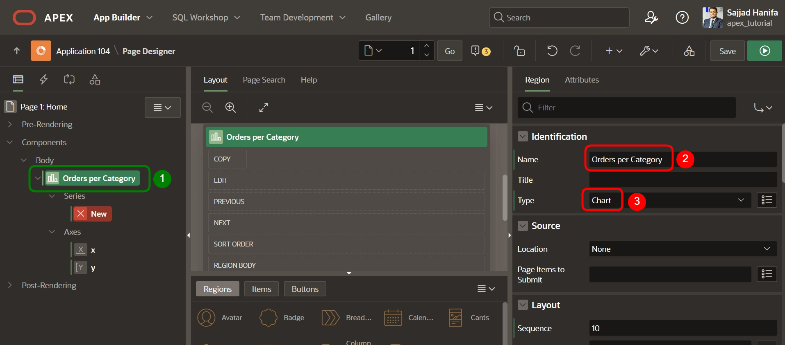

# 6. Charts
Charts/Diagramme dienen zur grafischen Darstellung von Zahlenwerten. APEX unterstützt standardmäßig u.a. Kuchen-Diagramme, Linien-Diagramme, Blasen-Diagramme, Streu-Diagramme und Balken-Diagramme.

Ziel dieses Kapitels ist es, ein Chart zu erstellen, welches das Verhältnis der Käufe sortiert nach Kategorien anzeigt.


## 6.1. Erstellung der View
- Für die Bearbeitung dieser Aufgabe wird eine **View** benötigt. 

- Geben Sie Ihrer **View** den Namen ***TUTO_P0001_VW***
  ```sql
  select o.ordr_id as order_id,
         o.ordr_ctmr_id as customer_id,
         o.ordr_total as order_total,
         o.ordr_dd as order_date,
         o.ordr_user_name as user_name,
         oi.ordr_item_id as order_item_id,
         oi.ordr_item_prdt_info_id as product_id,
         oi.ordr_item_unit_price as unit_price,
         oi.ordr_item_quantity as quantity,
         p.prdt_info_name as product_name,
         p.prdt_info_descr as product_description,
         p.prdt_info_category as category,
         p.prdt_info_avail as product_avail,
         p.prdt_info_list_price as list_price
    from order_items oi
    join product_info p
      on oi.ordr_item_prdt_info_id = p.prdt_info_id
    join orders o
      on oi.ordr_item_ordr_id = o.ordr_id
  ```
## 6.2. Charts Region
- Öffnen Sie zunächst den **App Builder** für Ihre **Anwendung**. Klicken Sie anschließend auf die **Seite 1 -** ***Home***.

- **Breadcrumbs** können meist nach dem Anlegen gelöscht werden. Sie nehmen viel Platz ein und bringen i. d. R. keinen Mehrwert für den Endanwender. **Breadcrumbs** sind hierarchische Listen von Links und bieten eine hierarchische Navigation.

- Klicken Sie mit der rechten Maustaste auf die *Breadcrumb* **TUTORIAL 23.2** und wählen Sie **Delete** aus. 


- Löschen Sie ebenfalls die Region **Page Navigation**.

- Klicken Sie mit der rechten Maustaste auf den Eintrag **Components**. Wählen Sie hier **Create Region**.


- Wählen Sie nun die von Ihnen erstellte Region aus und ändern Sie den **Title** zu ***Orders per Category*** und den **Type** zu ***Chart***.



- Wählen Sie nun den Eintrag **NEW** unter Series aus und ändern Sie den **Titel** in ***Orders***. 
- Unter Source wählen Sie als **Location** die Einstellung ***Local Database*** aus und geben als **Table Name** die soeben erstellte View (***TUTO_P0001_VW***).


- Ändern Sie nun den Wert für **Label** zu der Spalte ***PRDT_INFO_CATEGORY*** und den Wert für **Value** zu der Spalte ***ORDR_TOTAL***.


- Wechseln Sie nun bei Orders per Category zu in den Reiter **Attributes**. Ändern Sie den **Type** zu ***Pie***. Nun wird Ihr Diagramm als Kreisdiagramm dargestellt. Kreis/Kuchen-Diagramme sind Darstellungsformen für Teilwerte eines Ganzen in Form eines Kreises. Der gesamte Kreis steht für die Summe der einzelnen Kreissektoren. 


- Klicken Sie anschließend auf den Button **Run**.

- Sie sehen nun, dass auf Ihrer Startseite das Verhältnis der Käufe sortiert nach Kategorien angezeigt wird. 


