# 7. Features für mobile Endgeräte
## 7.1. Reflow Report & Column Toggle Report
Zwei Reporttypen, die dabei helfen, dass APEX Anwendungen auch auf mobilen Endgeräten angenehm genutzt werden können, sind der **Reflow Report** und der **Column Toggle** Report.

Der Reflow Report zeigt Tabellenspalten vertikal an, wenn nicht genügend Platz vorhanden ist, um sie horizontal anzuzeigen. Der **Column Toggle** Report ermöglicht es, Spalten mit verschiedenen Prioritäten zu belegen. Dabei werden Spalten mit geringer Priorität schmaler angezeigt und früher ausgeblendet als Spalten mit einer hohen Priorität.

### 7.1.1. View erstellen
- Für die Bearbeitung dieser Aufgabe wird eine **View** benötigt. 

- Geben Sie Ihrer **View** den Namen ***TUTO_P0032_VW***:
  ```sql
  select o.ordr_id,
         o.ordr_ctmr_id,
         o.ordr_total,
         o.ordr_dd,
         o.ordr_user_name,
         oi.ordr_item_id,
         oi.ordr_item_prdt_info_id,
         oi.ordr_item_unit_price,
         oi.ordr_item_quantity,
         p.prdt_info_name,
         p.prdt_info_descr,
         p.prdt_info_category,
         p.prdt_info_avail,
         p.prdt_info_list_price
    from order_items oi
    join product_info p
      on oi.ordr_item_prdt_info_id = p.prdt_info_id
    join orders o
      on oi.ordr_item_ordr_id = o.ordr_id
  ```

### 7.1.2. Report erstellen
- Erstellen Sie eine neue Seite. Navigieren Sie dazu in den **App Builder** und klicken Sie dort auf **Create Page**. 
- Wählen Sie als **Page Type** ***Interactive Report*** aus. 

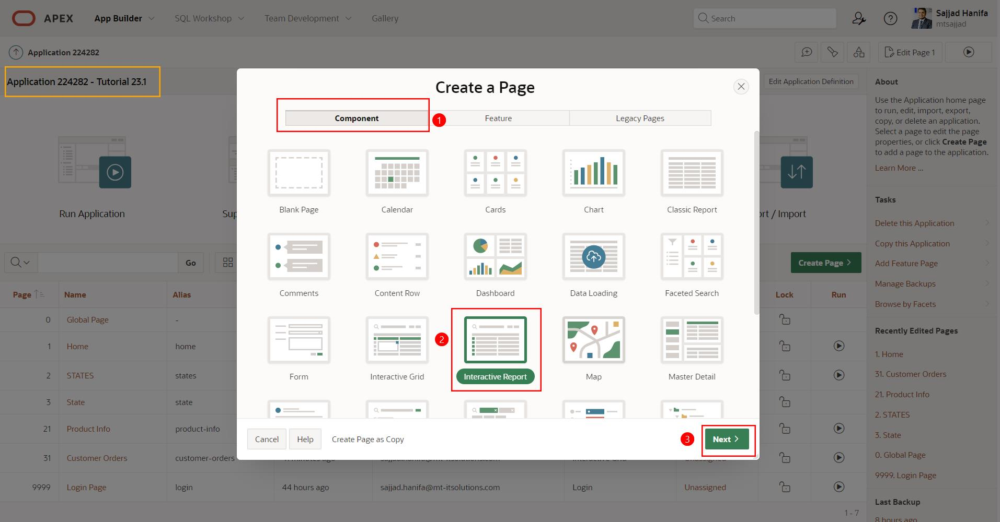

- Geben Sie als **Page Number** ***32*** ein und als **Page Name** ***Customer Orders for Mobile***.
- Wählen Sie als **Data Source** ***Local Database*** aus sowie als **Table / View Name** die von Ihnen erstellte View ***TUTO_P0032_VW***. 
- Deaktivieren Sie im Bereich Navigation die *Breadcrumb* und klicken Sie auf **Create Page**.

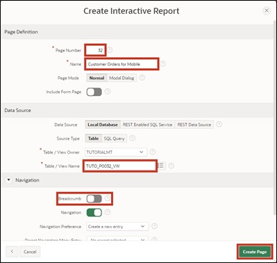

- Im Page Designer wählen Sie anschließend auf der linken Seite Ihren Report ***Customer Orders for Mobile*** aus. Auf der rechten Seite können Sie den **Type** ändern. Wählen Sie zunächst die Einstellung ***Reflow Report*** aus und klicken auf den Button **Run**.

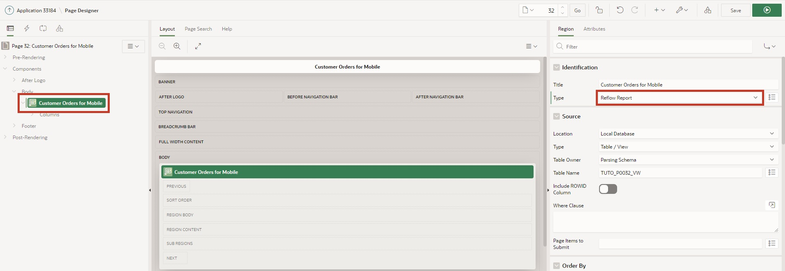

Die dargestellte Tabelle ist „responsive“, das heißt die Darstellung der Tabellenspalten passt sich automatisch der Bildschirmgröße des Endgeräts an.

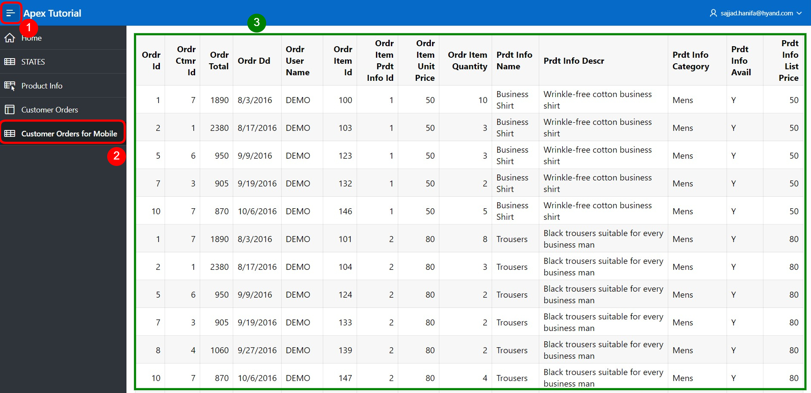

Wenn Sie das Browserfenster zusammenschieben, verkleinert sich auch der Anzeigebereich der Webseite. Ab einer Breite des Anzeigebildschirms von ≤ 560 Pixeln werden die Tabellenspalten nicht mehr nebeneinander, sondern untereinander dargestellt. 

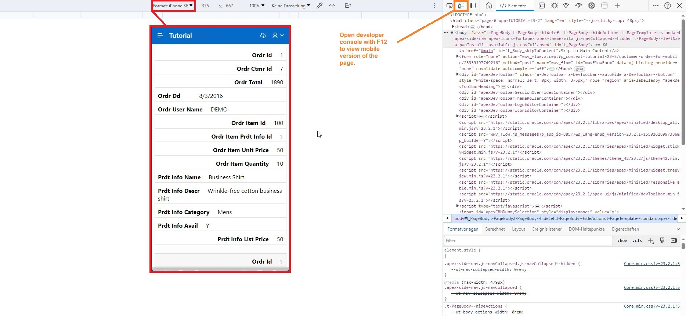

- Wechseln Sie zurück in den Page Designer und wählen Sie als **Type** jetzt ***Column Toggle Report*** aus und klicken Sie auf **Run**.

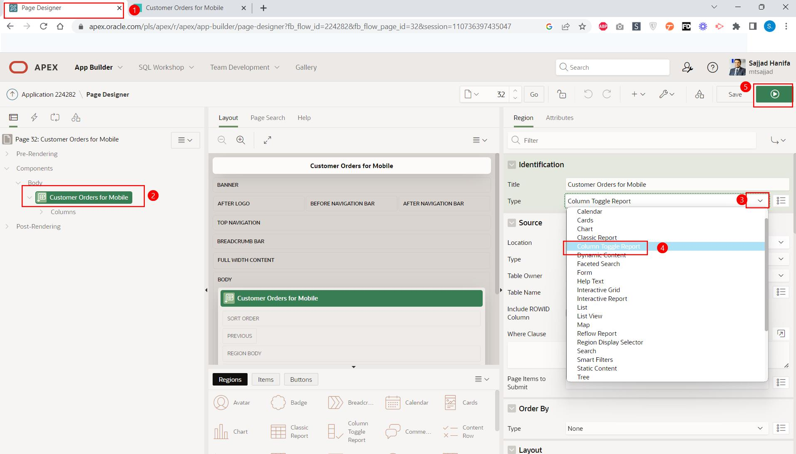

- In diesem Fall können Sie einstellen, welche Tabellenspalten angezeigt werden sollen. Klicken Sie dazu auf den Button **Columns** und wählen Sie die gewünschten Spalten aus.

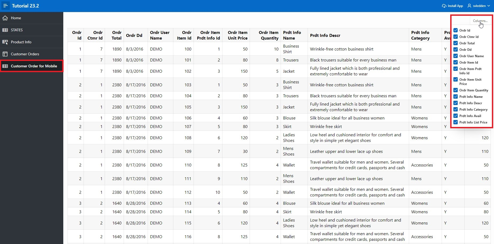

Es handelt sich hierbei um eine temporäre personalisierte Einstellung der Tabellenspalten. Andere Nutzer sind von dieser Einstellung nicht betroffen. Die Einstellung bleibt über ein neu laden der Webseite ***nicht*** gespeichert.
 

## 7.2. Progressive Web Apps
Durch das Auswählen des Features „Install Progressive Web App“ beim Erstellen der Anwendung, kann diese nun als Desktopanwendung installiert werden.

Progressive Webanwendungen sind schnellere Apps, da sie einen speziellen Browsercache nutzen, um Ressourcen effizienter zu speichern, wodurch Seiten schneller geladen werden.

Wenn es sich um eine progressive Web App handelt, ist in der Navigationsleiste ein neuer Eintrag **Install App** zu sehen:

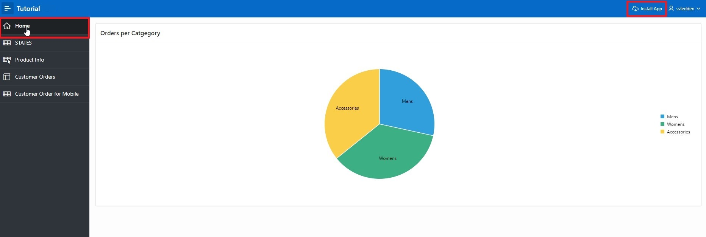

- Klicken Sie auf den Button **Install App**. Es erscheint ein Popup, indem Sie bestätigen, dass Sie die Anwendung installieren möchten.

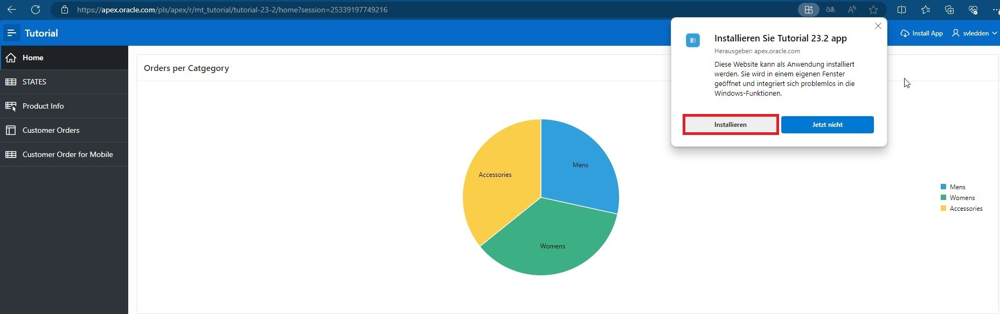

Nachdem Installation abgeschlossen ist, öffnet sich die Anwendung in einem eigenen Fenster, unabhängig vom Browser, in dem Sie sich befinden. Unter Windows lassen sich - wie im nächsten Screenshot zu sehen - noch einige Anpassungen zur Installation vornehmen, z.B. eine Verknüpfung zur App auf dem Desktop.

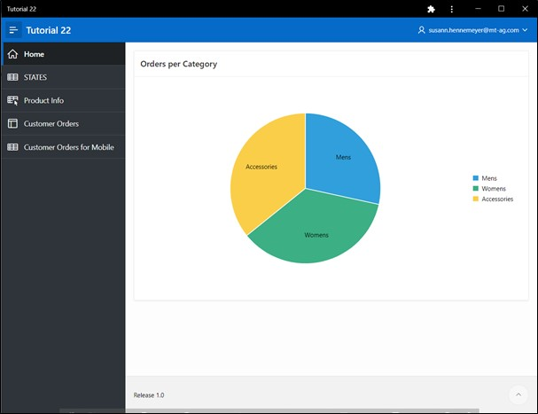

Die Anwendung kann nun auch über das Startmenü gefunden und gestartet werden.

Es können auch bestehende Anwendungen, die ab der APEX Version 21.2 erstellt wurden, in progressive Web Apps umgewandelt bzw. als solche genutzt werden. Hierzu müssen die folgenden Einstellungen angepasst werden:

- Öffnen Sie die Seitenübersicht Ihrer Anwendung und klicken Sie auf **Edit Application Definition**.

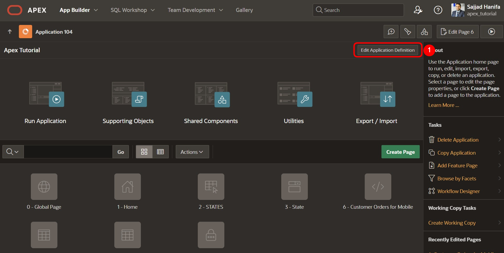

- Hier klicken Sie auf **Progressive Web App** und aktivieren die Option **Installable**. 

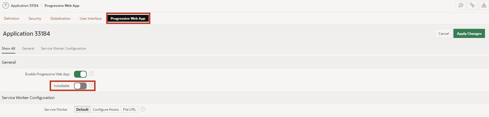

Es öffnet sich ein Bereich mit weitern Einstellungen, die zum Anpassen des User Interface der Progressive Web App genutzt werden können.

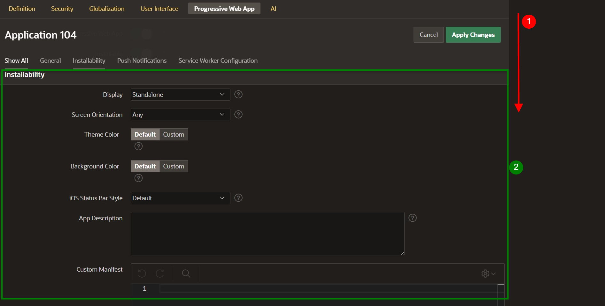


## 7.3. Persistent Authentication
Für Progressive Web Apps gibt es seit Version 23.1 von APEX eine neue Authentifizierungsmethode namens „Persistent Authentication“.

Im Gegensatz zu normalen APEX Anwendungen, erscheint hier auf dem Login Bildschirm eine „**Remember me**“-Checkbox, diese ist nicht zu verwechseln mit „**Remember Username**“.

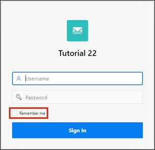

Wenn die Option „**Remember me**“ aktiviert ist, merkt APEX sich die Logindaten für einen gewissen Zeitraum (30 Tage). In dieser Zeit kann der Nutzer die gewünschte Seite aufrufen, ohne sich erneut anmelden zu müssen. Wenn eine Session abgelaufen ist, wird automatisch eine neue Session bereitgestellt.
