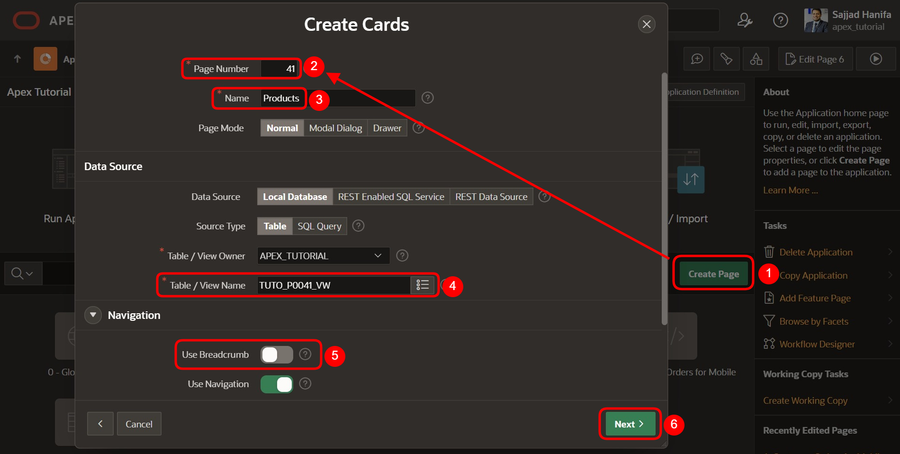
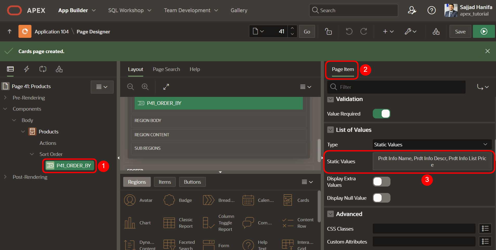
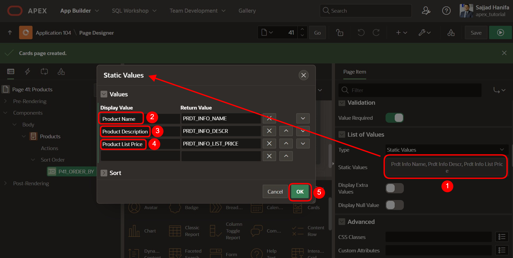
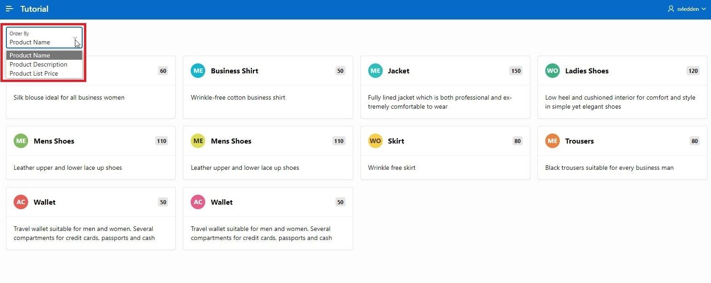
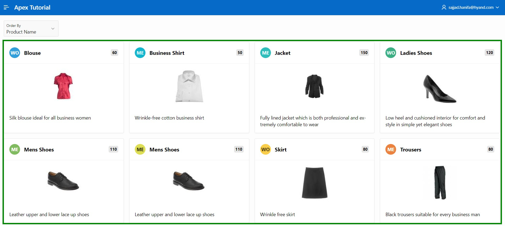

# <a name="cards-region"></a>8. Cards Region

Cards sind eine beliebte Form im Webdesign, um Informationen übersichtlich und anschaulich darzustellen. Die Cards in APEX lassen sich vielfältig gestalten. So kann man einer Card Icons hinzufügen, Bilder oder Videos in dieser anzeigen oder Aktionen für die Card definieren (z.B. über Links oder Buttons). 

In diesem Kapitel erstellen wir eine Seite, die auf einer Cards Region aufbaut. Im ersten Schritt erstellen wir eine Default Cards Region, im zweiten Kapitel bearbeiten wir diese so, dass ein Bild in der Karte angezeigt wird.  

## <a name="cards-view-erstellen"></a>8.1	View erstellen

Für die Bearbeitung dieser Aufgabe wird eine **View** benötigt.  
**View Name: *TUTO_P0041_VW***
**Query**:

```sql
select prdt_info_id,
       prdt_info_name,
       prdt_info_descr,
       prdt_info_category,
       prdt_info_product_image,
       prdt_info_list_price
from product_info
 ```

## <a name="cards-seite-erstellen"></a>8.2	Seite erstellen

- Öffnen Sie den **App Builder** über die Navigationsleiste, wählen Sie Ihre Anwendung aus und klicken Sie auf den Button **Create Page**.  
- Wählen Sie den Seitentypen **Report** aus.  
- Wählen Sie den Bereichstypen **Cards** aus.  


- Geben Sie als **Page Number *41*** und als **Page Name *Products*** ein. Klicken Sie anschließend auf den Button **Next**.  
- Wählen Sie die unter dem Punkt **Table/View Name** die zuvor erstellte View (TUTO_P0041_VW) aus.  
- Deaktivieren Sie im Bereich **Navigation** die *Breadcrumb* und klicken Sie auf **Next**.  

 

- Anschließend geben Sie die Attribute Ihrer Card an. Als Format zur Anordnung nehmen Sie **Grid**. Das sorgt dafür, dass die Karten in einem gleichmäßigen Raster angeordnet werden.   

Nun müssen Sie noch angeben, welche Daten, wo in der Card angezeigt werden. Eine Card besteht zwingend aus einem Titelbereich. Außerdem kann man ihr einen Body, ein Icon und ein Badge hinzufügen.  
- Geben Sie folgendes ein:   

  |  |  |
  |--|--|
  |**Title Column** | PRDT_INFO_NAME |
  |**Body Column** | PRDT_INFO_DESCR |
  |**Icon Initials Column** | PRDT_INFO_CATEGORY |
  |**Badge Column** | PRDT_INFO_LIST_PRICE |
  |  |  |  

  

- Klicken Sie auf **Run** und rufen Sie Ihre neu erstellte Seite auf.  

 

Sie sehen, dass die Produkte nun in Form von Cards dargestellt werden. Der Title der Card ist der Produktname, im Body wird das Produkt kurz beschrieben. Die Initialen zeigen die Kategorie des Produkts an (z.B. AC für Accessoires) und in der Badge sehen Sie den Preis des Produkts.  

Oben auf der Seite befindet sich eine Select List zur Auswahl, wie die Cards sortiert werden sollen. Um die angezeigten Namen der Sortierfelder anzupassen, wechseln Sie auf die Seite im Page Designer und navigieren zum Page Item **P41_ORDER_BY**. Rechts in den Eigenschaften des Page Items öffnen Sie die **Static Values** im Punkt **List of Values**. 

 

Hier können SIe die angezeigten Sortierkriterien unter Display Value anpassen. Tragen Sie hier die folgenden Werte aus der linken Spalte ein und bestätigen mit **OK**.

  |  |  |
  |--|--|
  |Product Name | **PRDT_INFO_NAME** |
  |Product Description | **PRDT_INFO_DESCR** |
  |Product List Price | **PRDT_INFO_LIST_PRICE** |
  |  |  | 

 

- Mit einem Klick auf **Run** können Sie sich die Veränderung auf der Seite anschauen.

 
 
## <a name="cards-mit-bild-erstellen"></a>8.3	Cards mit Bild erstellen

In diesem Schritt werden Sie das Aussehen der Cards ändern und die Titelbilder der Produkte anzeigen.  
- Klicken Sie hierfür auf **Attributes** und scrollen Sie dann nach unten zu **Media**.  

- Wählen Sie als **Source *BLOB Column*** und dann unter **BLOB_Column *PRDT_INFO_PRODUCT_IMAGE*** aus. 


- Legen Sie außerdem ***PRDT_INFO_ID*** als **Primary Key Column 1** fest.  


- Rufen Sie anschließend die Seite über den **Run**-Button auf.  

- In den Cards werden nun zusätzlich die Produktbilder angezeigt. 

