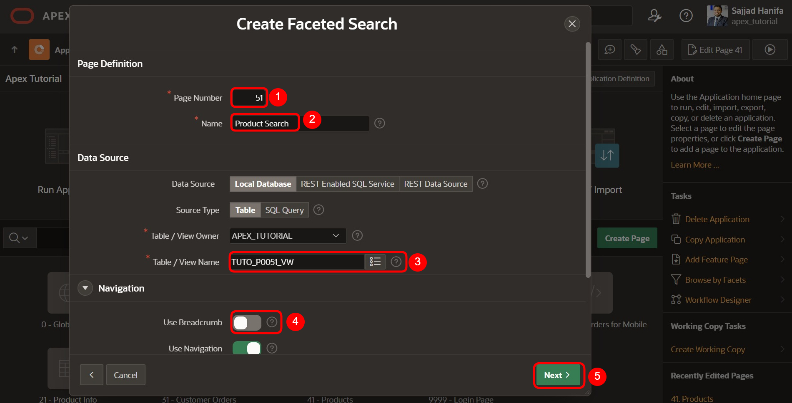
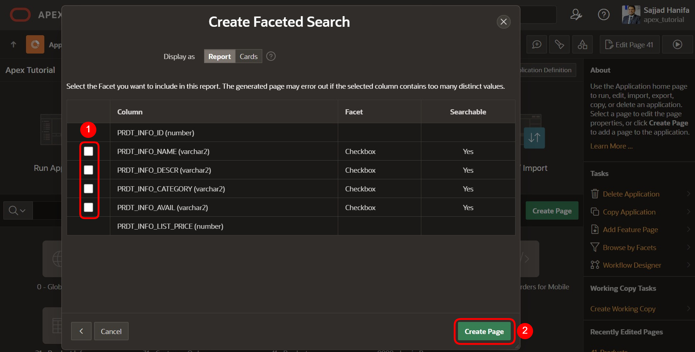
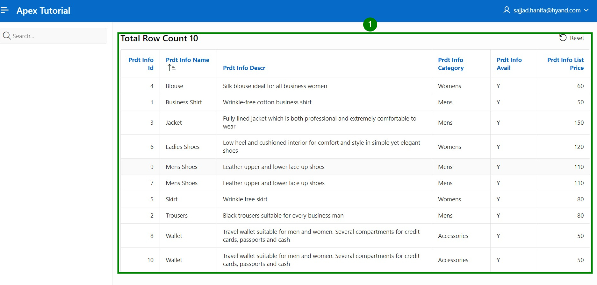
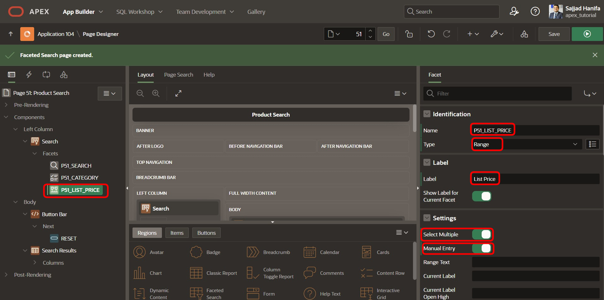
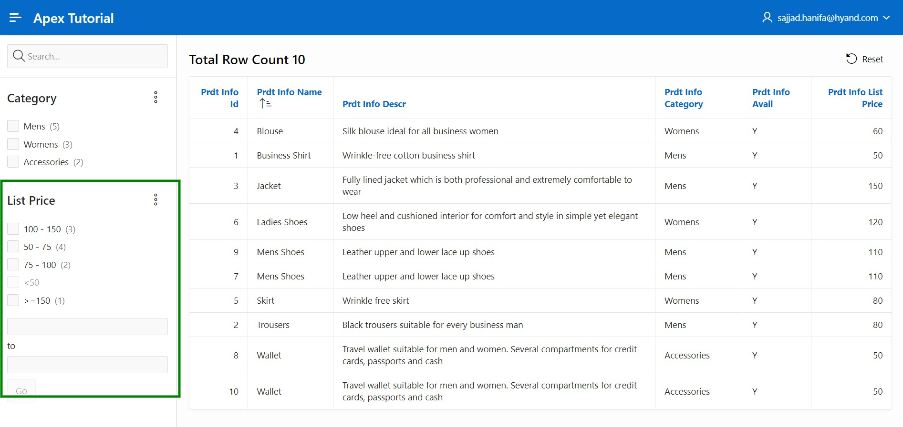

# 9. Faceted Search

Bei der Faceted Search handelt es sich um eine Funktion zur dynamischen Filterung der angezeigten Datensätze und der gezielten Suche darin. Sie findet häufig Anwendung in Onlineshops und zeichnet sich meist durch eine fixierte Leiste am Seitenrand aus, in welcher sich die unterschiedlichen Filter in Form von Checkboxen, Slidern und Eingabefeldern befinden.

## 9.1.	Erstellung der View

Für die Bearbeitung dieser Aufgabe wird eine **View** benötigt.

**View Name: *TUTO_P0051_VW***

**Query**:

 ```sql
select prdt_info_id as product_id,
       prdt_info_name as product_name,
       prdt_info_descr as product_description,
       prdt_info_category as category,
       prdt_info_avail as product_avail,
       prdt_info_list_price as list_price 
from product_info
 ```
 
## 9.2.	Create Page

- Öffnen Sie den **App Builder** über die Navigationsleiste, wählen Sie Ihre Anwendung aus und klicken Sie auf den Button **Create Page**.
- Wählen Sie den Seitentypen **Component** aus.
- Wählen Sie den Bereichstypen **Faceted Search** aus.
 
 

- Geben Sie als **Page Number *51*** ein und als **Page Name *Product Search***. 
- Wählen Sie die unter dem Punkt **Table/View Name** die zuvor erstellte View (TUTO_P0051_VW) aus.
- Deaktivieren Sie im Bereich **Navigation** die Breadcrumb und klicken Sie auf **Next**.

 
  
- Deaktivieren Sie im letzten Schritt alle Facets und klicken Sie auf den Button **Create Page**.

 

- Rufen Sie anschließend die Seite über den **Run**-Button auf. 

Die Daten werden im rechten Seitenbereich als **Classic Report** dargestellt. Links davon befindet sich die Such- bzw. Filterleiste, in der sich bislang nur ein Suchfeld befindet, mit dem nach bestimmten Daten gesucht werden kann. Im Folgenden sollen dort weitere Optionen in Form von Facets hinzugefügt werden.

 

## 9.3.	Create Facets

- Wechseln Sie zurück in den **Page Designer** und erstellen Sie ein neues Facet, indem Sie einen Rechtsklick auf den Eintrag **Facets** machen und anschließend **Create Facet** auswählen. 

 

- Wählen Sie das Item aus und ändern Sie die folgenden Felder wie angegeben ab:

| | |  
|--|--|
| **Identification**|  |
| Name | *P51_CATEGORY* |
| Type| *Checkbox Group*| 
| **Label** | *Category*| 
| **List of Values**|  |
| Type | *SQL Query* |
| SQL Query | select distinct category as d, <br/> category as r <br/> from TUTO_P0051_VW| 
| | |


 

- Starten Sie die **Seite**, indem Sie auf den **Run**-Button klicken.

In der Faceted Search Region befindet sich jetzt ein neues Element mit drei Checkboxen. Durch diese können die angezeigten Daten rechts anhand der Werte in der Spalte Category dynamisch gefiltert werden.

 

- Wechseln Sie wieder in den **Page Designer**, um ein neues **Facet** zu erstellen. Dieses modifizieren Sie nach den folgenden Vorgaben:

  | | |  
  |--|--|
  | **Identification** |  |
  | Name | *P51_LIST_PRICE* |
  | Type | *Range* | 
  | **Label** | *List Price*| 
  | **Settings** |  |
  | Select Multiple | *Enabled* |
  | Manual Entry | *Enabled* | 
  | **List of Values** |  |
  | Type | *Static Values* | 
  | | |

 

- Zur Eingabe der List of Values – Werte klicken Sie auf die Schaltfläche neben **Static Values**. Daraufhin öffnet sich folgendes Fenster, in dem Sie die angegebenen Werte eintragen:
 
 

- Setzen Sie den **Data Type** für die Spalte **LIST_PRICE** auf ****NUMBER****.
- Speichern Sie und rufen Sie erneut die Seite auf. 

 

Das neu erstellte Facet enthält wie auch das Category-Facet diverse Checkboxen, um die angezeigten Daten zu filtern. Darunter befinden sich zwei Eingabefelder, in die manuell Werte als Ober- und Untergrenze eingetragen werden können.

 
 
