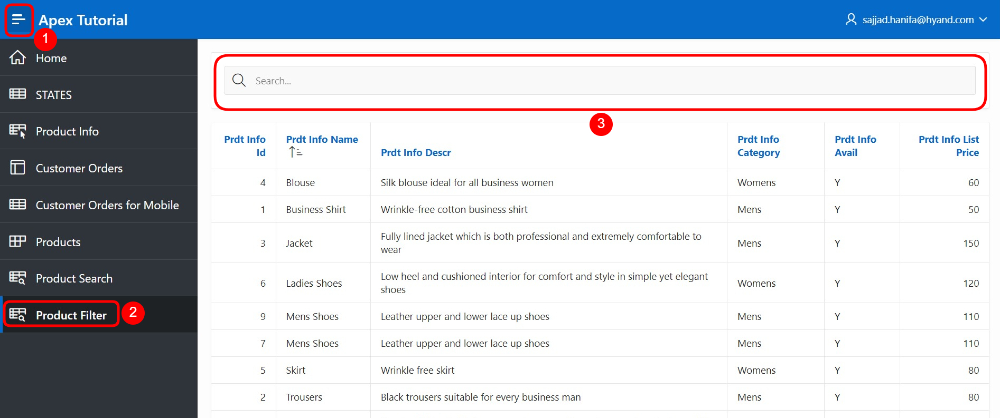
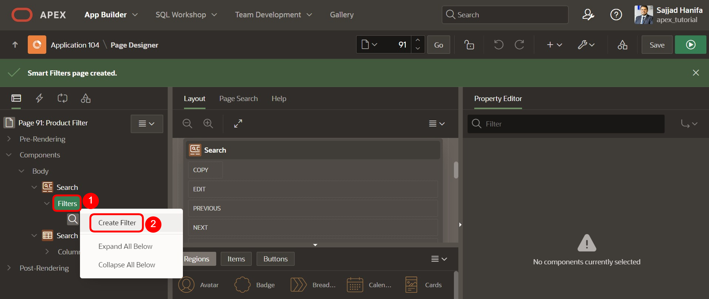

# 10. Smart Filters
Die **Smart Filters** bieten die Möglichkeit, Daten mithilfe von Filtervorschlägen oder Suchbegriffen leicht einzugrenzen. Diese werden als Chips unter der Suchleiste oder als Vorschläge während des Tippens angezeigt.
## 10.1. Erstellung der View
Für die Bearbeitung dieser Aufgabe wird eine **View** benötigt. 
**View Name: TUTO_P0091_VW**
Query:
 ```sql
select prdt_info_id,
       prdt_info_name,
       prdt_info_descr,
       prdt_info_category,
       prdt_info_avail,
       prdt_info_list_price
from product_info
```

## 10.2. Create Page
- Öffnen Sie den **App Builder** über die Navigationsleiste, wählen Sie Ihre Anwendung aus und klicken Sie auf den Button **Create Page**.  
- Wählen Sie den Seitentypen **Component** aus.  
- Wählen Sie den Bereichstypen **Smart Filters** aus.  
 
  

- Geben Sie als **Page Number 91** ein und als **Page Name Product Filter**. 
- Wählen Sie die unter dem Punkt **Table/View Name** die zuvor erstellte View (TUTO_P0091_VW) aus.  
- Deaktivieren Sie im Bereich **Navigation** die *Breadcrumb* und klicken Sie auf **Next**.  
  
  

- Deaktivieren Sie im letzten Schritt alle Filter und klicken Sie auf den Button **Create Page**.  
 
  

- Rufen Sie anschließend die Seite über den **Run**-Button auf.  
Die Daten werden als **Classic Report** dargestellt. Darüber befindet sich eine Suchleiste, unter welcher die Filter als Chips angezeigt werden, die im Folgenden hinzugefügt werden.  

  
 
## 10.3. Create Filters
- Wechseln Sie zurück in den **Page Designer** und erstellen Sie einen neuen Filter, indem Sie einen Rechtsklick auf den Eintrag **Filters** machen und anschließend **Create Filter** auswählen.  

  

- Wählen Sie das Item aus und ändern Sie die folgenden Felder wie angegeben ab:  

  | | |  
  |--|--|
  | **Identification** |  |
  | Name | *P91_PRDT_INFO_NAME* |
  | Type | *Checkbox Group* |  
  | **Label**| *Product Name* |
  | **List of Values** |  |
  | Type | *Distinct Values* |
  | | |  

- Starten Sie die Seite, indem Sie auf den Run Button klicken.  

  

Beim Klicken in die Suchleiste, erscheint der Filter *Product Name*. Wenn Sie auf den Filter klicken, werden alle Filteroptionen basierend auf den Werten der Spalte angezeigt. Klicken Sie auf den angezeigten Vorschlag, wird dieser als Filter in die Suchleiste übernommen.  

- Wechseln Sie wieder in den **Page Designer**, um einen weiteren Filter zu erstellen. Diesen modifizieren Sie nach den folgenden Vorgaben:  

  | | |  
  |--|--|
  | **Identification** |
  | Name | *P91_CATEGORY* |
  | Type | *Checkbox Group*|  
  | **Label**| *Category* |
  | **List of Values** |  |
  | Type | *Distinct Values* |
  | | |  

  

- Speichern Sie und rufen Sie erneut die Seite auf.  
Die erstellten Filter für *Product Name* und *Category* werden nun beim Klick in die Suchleiste angezeigt.  

  
