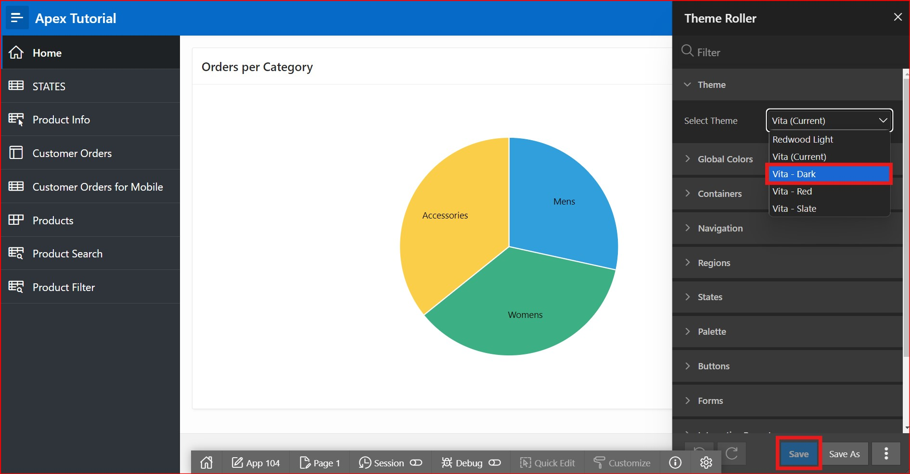
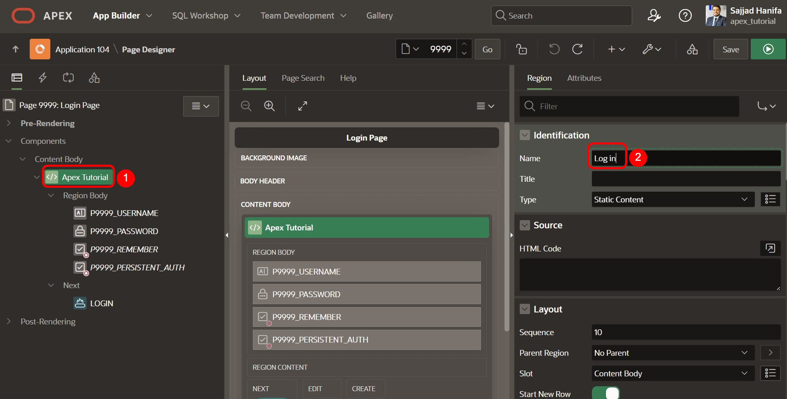
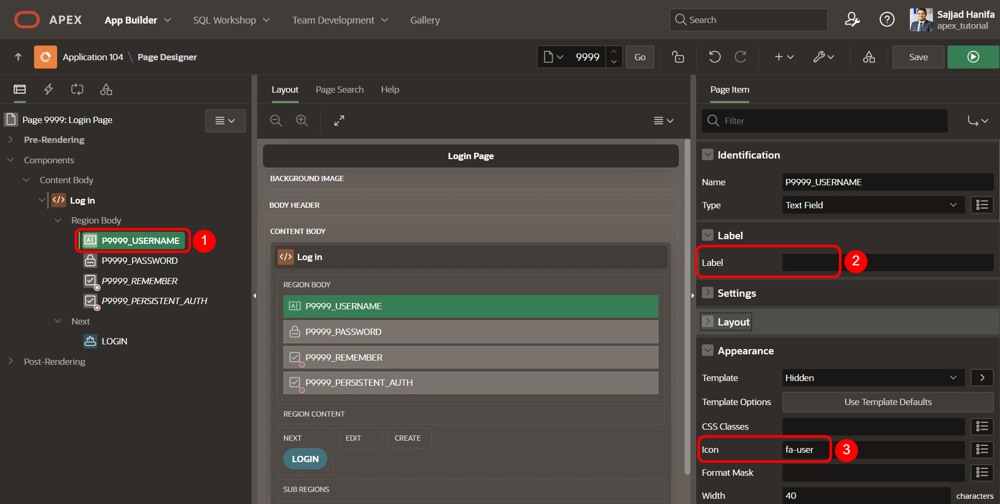
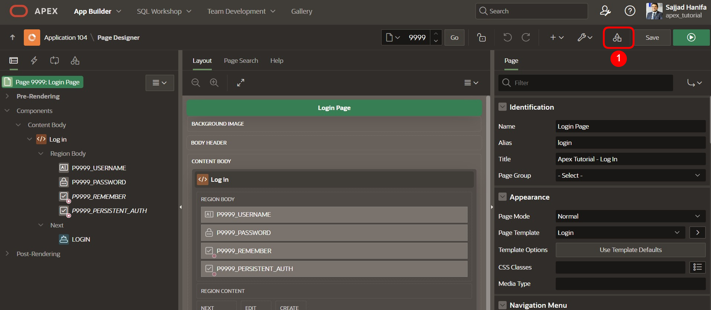
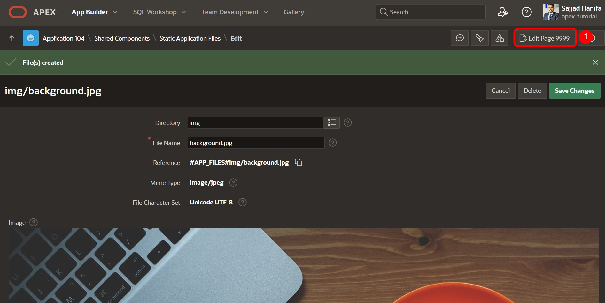
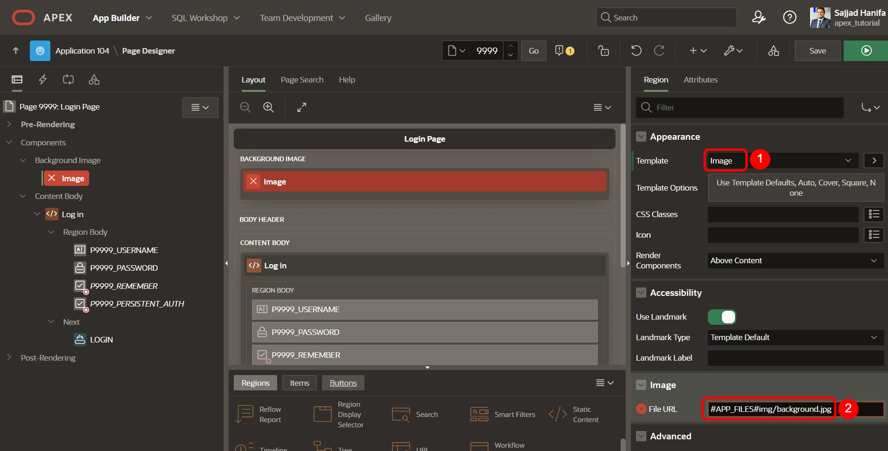
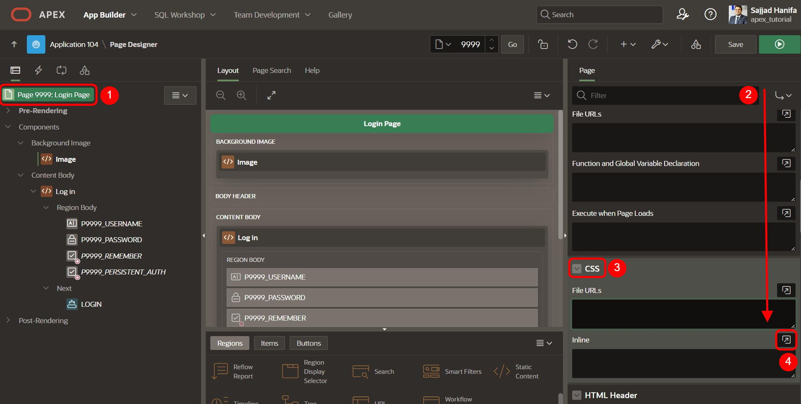
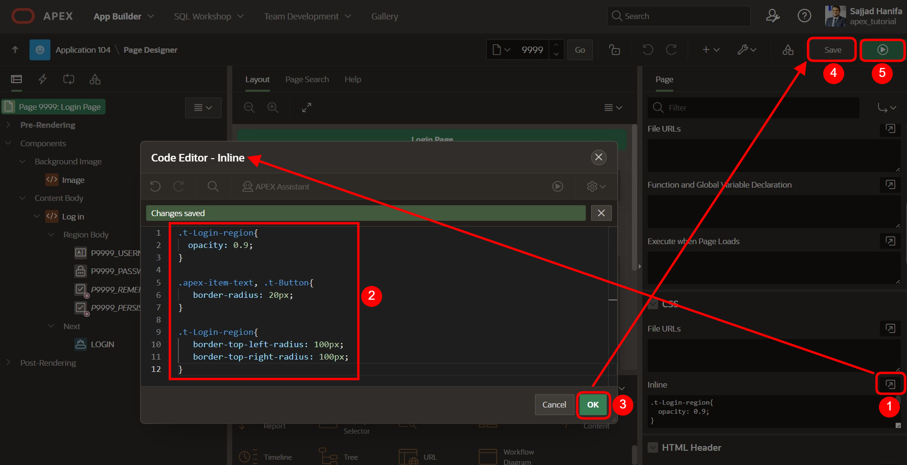

# 11. Optische Anpassungen
Unterschiedliche Anwendungsfälle bringen unterschiedliche Anforderungen an das User Interface einer Anwendung mit. Im Standard ist das Interface von APEX eher schlicht gehalten, es lässt sich jedoch durch Kombination von Einstellungen der Komponenten und eigenem CSS-Code umfangreich anpassen.

CSS-Code ermöglicht es Entwicklern, die gestalterischen Attribute von Seiten, Regionen und Items über den Standard hinaus anzupassen. CSS besteht aus einer Liste von Regeln, die dem Web-Browser beschreiben, wie bestimmte Elemente einer Webseite dargestellt werden sollen. Damit nicht für jedes Element eine eigene Liste an Regeln definiert werden muss, können identische Elemente in Klassen zusammengefasst werden.  

## 11.1. Dark-Mode
Sowohl für die Entwicklungsumgebung als auch für die fertige Anwendung lässt sich ein Dark-Mode aktivieren. Für letztere wird dieser in den Theme-Einstellungen der Anwendung festgelegt.
- Öffnen Sie zunächst Ihre **Anwendung**. Klicken Sie in der Leiste am unteren Bildschirmrand auf **Customize** und dann auf **Theme Roller**. Hierüber können Sie das Theme ändern sowie weitere CSS-Anpassungen durchführen.  

 

- Wählen Sie unter **Style** das Theme **Vita – Dark** und setzen Sie es als aktuelles Theme, indem sie auf den **Save** Button klicken.  

 

Ihre erstellte Anwendung sollte nun wie folgt aussehen:  

 
 
## 11.2. Anpassung des Login-Screens
Nach diesem Kapitel hat Ihr Login-Screen ein Hintergrundbild und sieht somit ansprechender aus.
- Öffnen Sie zunächst den **App Builder** und klicken Sie anschließend auf die von Ihnen erstellte **Anwendung**. 
- Klicken Sie auf die **Seite 9999 - *Login Page***. 

 

Ein Template enthält alle Elemente, die Benutzer zum Erstellen eine Seite benötigen, inklusive von Beispielen zu den Elementen, damit Entwickler sehen können, wie die einzelnen Elemente zu verwenden sind. Immer wenn eine neue Seite in APEX angelegt wird, muss für diese ein Template ausgewählt werden. Entwickler haben die Möglichkeit, vorhandene Templates zu bearbeiten oder neue anzulegen.  
- Wählen Sie die **Region TUTORIAL23** aus. Ändern Sie dort den **Namen** zu ***Log In***. 

 

- Wählen Sie das **Item *P9999_USERNAME*** aus. Löschen Sie den Wert des Feldes **Label** und ändern Sie den Wert für **Icon** zu **fa-user**.  
- Wählen Sie das **Item *P9999_PASSWORD*** aus. Löschen Sie dort den Wert des Feldes **Label** und ändern Sie den Wert für **Icon** zu **fa-lock-password**. 

 

- Das Application Icon kann in den ***Shared Components*** geändert werden. 

 

- Klicken Sie unter **User Interface** auf den Eintrag ***User Interfaces Attributes***.

  

- Klicken Sie hier auf ***Change Icon***.

 

- Hier können Sie ein eigenes Logo hochladen oder eins von den vorhanden auswählen. Ebenfalls können Sie hier die Farbe des Logos bestimme. Wählen Sie beispielsweise das ***APEX Icon in blau*** und klicken anschließend ***Save Icon***.  

  

Sie können nun die getätigten Veränderungen auf Ihrer Seite sehen. Die Region wird mit einem anderen Template dargestellt und die Felder Username und Password werden mit einem Icon und einem Platzhalter dargestellt. 

Außerdem wird über dem Titel der Region ein Icon angezeigt, das die Identifikation der Anwendung unterstützen kann. 

  

- Das Hintergrundbild für die Login Seite muss als nächstes in der Anwendung hochgeladen werden. Klicken sie hierzu wieder auf ***Shared Components***.  
- Klicken Sie dann unter **Files** auf den Eintrag ***Static Application Files***.

  

Unter den Static Application Files können Sie Ihre eigenen Dateien hochladen und verwalten. Dies bietet sich besonders bei Bildern, CSS- und JavaScript-Dateien an. Dateien unter Static Application Files werden bei Anwendungsexporten mit exportiert. 
- Klicken Sie auf den Button **Create File**. 


- **Directory** stellt in Textform den Ordnerpfad zu Ihrer Datei dar. Geben Sie hier ***img*** ein, damit Ihre Datei in den **Ordner *img*** geladen wird. Laden Sie die Datei background.jpg in dem Feld **Content** hoch. Klicken Sie anschließend auf **Create**.  

  

- Ihre hochgeladene Datei wird nun angezeigt. 
Klicken Sie anschließend auf den **Edit Page 9999** Button in der **Breadcrumb Leiste**, um direkt in den Page Designer zur Login Page zu kommen. 



- Ihre hochgeladene Datei wird nun angezeigt. 
Klicken Sie anschließend auf den **Edit Page 9999** Button in der **Breadcrumb Leiste**, um direkt in den Page Designer zur Login Page zu kommen. 
- Fügen Sie als nächstes eine **Static Content Region** zur Position **Background Image** hinzu und nennen diese Image.


- Ändern Sie das **Template** der Region zu **Image**. Zuletzt muss noch die **File URL** vom zuvor hochgeladen Image angegeben werden. Geben Sie hier bitte **„#APP_FILES#img/background.jpg“** ein.



- Im Folgenden wird zusätzlicher **CSS-Code** verwendet, um die **Region *Log In*** transparent darzustellen. Klicken Sie links auf den Eintrag **Page 9999: Login Page** und wählen Sie rechts bei den Seiteneigenschaften unter **CSS** das Feld **Inline**.



- Klicken Sie auf das **Icon** rechts über dem Feld, um den Code Editor zu starten. Geben Sie dort die folgenden CSS-Vorgaben ein:
 ```css
.t-Login-region {
    opacity: 0.9;
}
 ```  

  

- Klicken Sie auf den Button **Run**, um sich die überarbeitete Seite anzuschauen. 
Sie sehen nun die von Ihnen getätigten Änderungen. 

 
