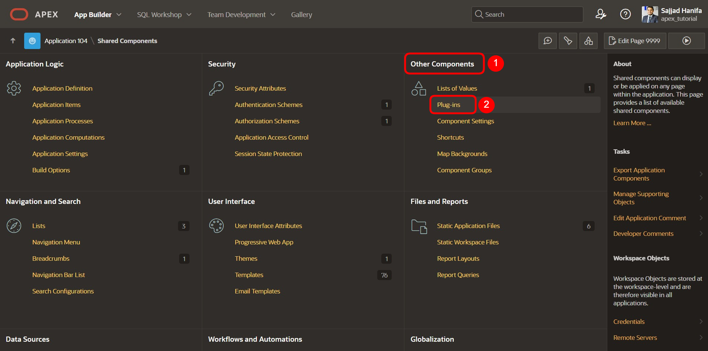
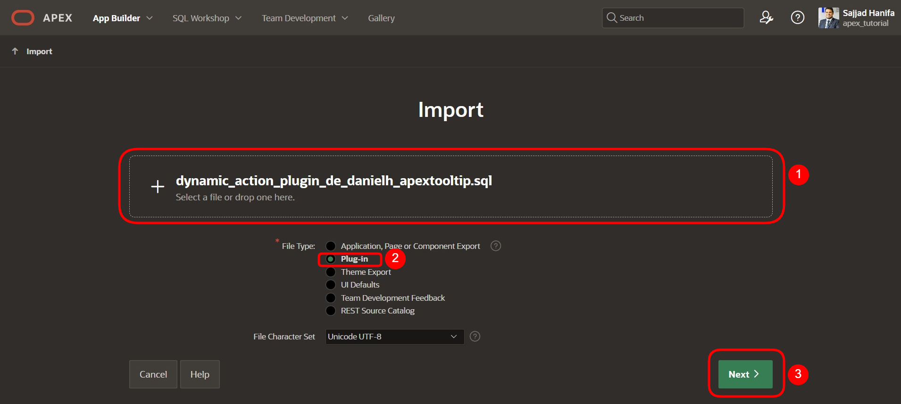
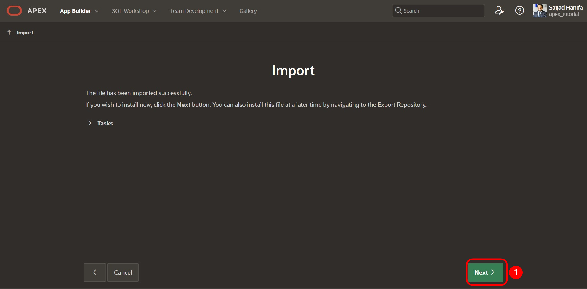
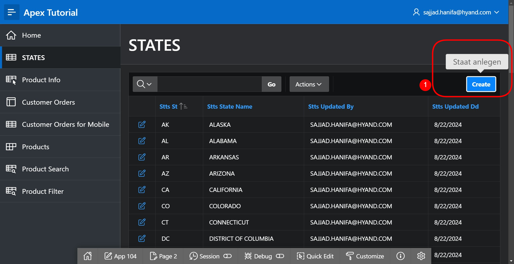
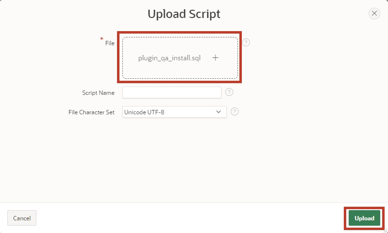
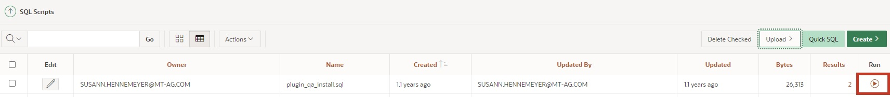
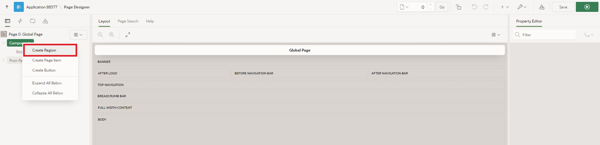
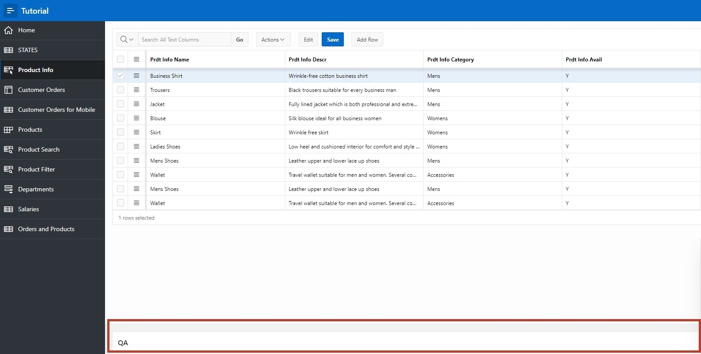

# 12. Plug-Ins

## 12.1. Einleitung

Plug-Ins sind Erweiterungen und ermöglichen es, APEX um benutzerdefinierte Elementtypen, Regionstypen, Prozesse und dynamische Aktionen zu erweitern. Komponenten, die auf Plug-Ins basieren, werden ähnlich wie die Standard APEX-Komponenten erstellt und gepflegt. Mit Plug-Ins können Entwickler angepasste Komponenten erstellen, um die Funktionalität, das Erscheinungsbild und die Benutzerfreundlichkeit Ihrer Anwendungen zu verbessern.
Plug-Ins können dabei helfen, die Anwendung benutzerfreundlicher zu gestalten und Extras hinzuzufügen. Im Rahmen dieser Aufgabe werden zwei Plug-Ins eingebaut.
Im Folgenden werden Sie Plug-Ins in Ihre Anwendung einbinden. Weitere Plug-Ins außer die hier erwähnten finden Sie z.B. auf apex.world:

https://apex.world/ords/f?p=100:700

## 12.2.	Plug-Ins

Für die Bearbeitung dieser Aufgaben werden wir ein Plug-In von folgender Seite verwenden: 

https://api.github.com/repos/Dani3lSun/apex-plugin-apextooltip/zipball.

Dieses Plugin ermöglicht es dem Entwickler, Tooltips bei Buttons, Feldern, Regionen, Berichten und weiteren Komponenten einzubauen.
Das Plug-In muss zunächst heruntergeladen und entpackt werden.

### 12.2.1.	Plug-In importieren

- Öffnen Sie zunächst den **App Builder** und Ihre **Anwendung**. Klicken Sie anschließend auf **Shared Components**. 

- Klicken Sie unter **Other Components** auf **Plug-Ins**.

 

- Klicken Sie auf **Import**.

 

- Laden Sie das Plug-In hoch. Es sollte in dem Ordner liegen, in welchen Sie das Plug-In entpackt haben: 
**…source\dynamic_action_plugin_de_danielh_apextooltip.sql**.

Ziehen Sie diese Datei per **Drag and Drop** in das entsprechend Feld. Wählen Sie **Plug-in** als **File Type** und klicken Sie anschließend auf **Next**.

- Klicken Sie erneut auf **Next**.
 

- Wählen Sie die Applikation aus, mit der Sie dieses Tutorial durchführen und klicken Sie auf **Install Plug-In**.

 

### 12.2.2.	Plugin einbinden

- Das Plug-In wurde nun installiert. Klicken Sie auf Ihre Applikation, um zurück zu gelangen. 

- Wählen Sie die Seite 2 - **STATES** aus. 

- Klicken Sie auf **Dynamic Actions** (Blitz-Symbol) und klicken Sie mit der **rechten Maustaste** unter **Page Load** auf **Create Dynamic Action**. 

Dynamic Actions ermöglichen es Entwicklern, clientseitiges Verhalten ohne JavaScript festzulegen. Mit dem Assistenten zum Erstellen kann festgelegt werden, wann bestimmte Aktionen ausgeführt werden sollen und welche Elemente von diesen Aktionen betroffen sind.
- Ändern Sie den Namen der Dynamic Action zu **Tooltip** und klicken Sie anschließend auf **Show**.

- Ändern Sie nun die folgenden Felder:
  | | |  
  |--|--|
  | **Identification**   Action | APEX Tooltip [Plug-In]|  
  | **Settings**   | Theme   Content Text| |
  | **Affected Elements**   Selection Type   Button | Button     CREATE |

- Starten Sie nun über den **Run** Button die Anwendung.
- Wenn Sie nun mit der Maus über den Create Button fahren (hovern), wird der Tooltip eingeblendet.

Es gibt noch viele weitere Einstellungen bzw. **Plug-In Settings**, die Sie wie oben beschrieben, beliebig verwenden können. Probieren Sie gerne einige davon aus.

### 12.2.3.	Quality Assurance Plugin 

- Gehen Sie wie in 12.2.1 beschrieben vor, um ein weiteres Plug-In zu installieren. 
Das Plug-In ermöglicht es, Entwicklungsvorgaben zu definieren und zeigt anschließend Verstöße hiergegen automatisch auf der jeweiligen Seite an.
Das Plug-In können Sie hier herunterladen: 
https://github.com/mt-ag/apex-qa-plugin/archive/master.zip

- Importieren Sie das Plugin. Es sollte dann in dem Ordner liegen, in welchen Sie das Plug-In entpackt haben: 
**…src\APEX\region_type_plugin_com_mtag_olemm_qa_region.sql**

- Zusätzlich müssen für das Plug-In mithilfe eines SQL-Skriptes Datenbankobjekte erzeugt werden. Dazu klicken Sie unter **SQL Workshop** auf **SQL-Scripts**. Klicken Sie dort auf den **Upload** Button 

 

- Laden Sie die Datei **…\src\plugin_qa_install.sql** aus dem Plug-in Ordner hoch.
 

 

- Mit dem **Run** Button und dem anschließendem **Run Now** kann das Skript nun ausgeführt werden.

 
 

 

- Über den **App Builder** können Sie nun zurück in die Anwendung navigieren und **Page 0** (Global Page – Desktop) aufrufen.
- Legen Sie per Rechtsklick auf den Reiter **Components** mit **Create Region** eine neue Region an.

- Ändern Sie nun die folgenden Felder und drücken Sie dann auf Save:
  | | |  
  |--|--|
  | **Identification**   Title   Type | **QA**   **Quality Assurance – Region [Plug-In]**|  

Da diese Region auf der **Global Page – 0** angelegt wurde, wird nun auf jeder Seite der Anwendung diese Region angezeigt.

Damit das Plug-In Verstöße gegen die Guidelines anzeigen kann, müssen diese definiert werden. Beim Download des **Plug-Ins** werden bereits einige Beispielregeln mitgeliefert. 
- Wie zuvor muss nun über den **SQL Workshop** ein **SQL-Skript** hochgeladen und eingespielt werden. Das Skript finden Sie unter: **…src\DML\plugin_qa_rules.sql**

 
- Wenn Sie nun in die Anwendung wechseln und eine Seite aufrufen, werden am Ende der Seite in der Region QS die Regelverstöße angezeigt.

 

Für eigene Projekte können Sie Ihre individuellen Regeln für dieses Plug-In definieren und so für die Einhaltung der Vorgaben sorgen.
