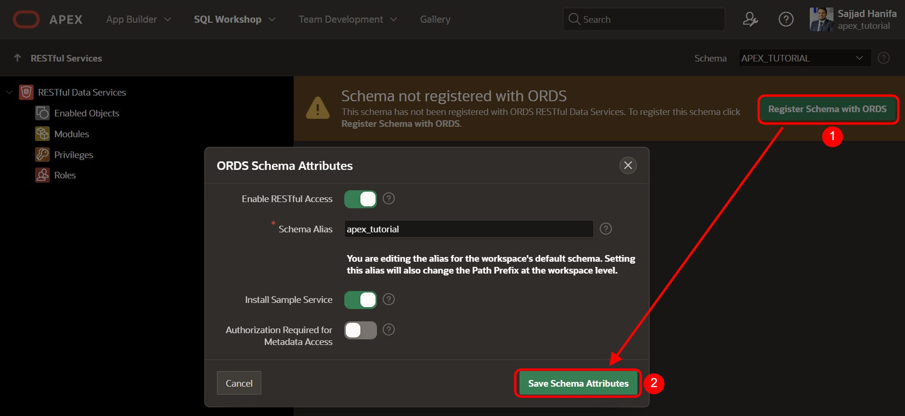
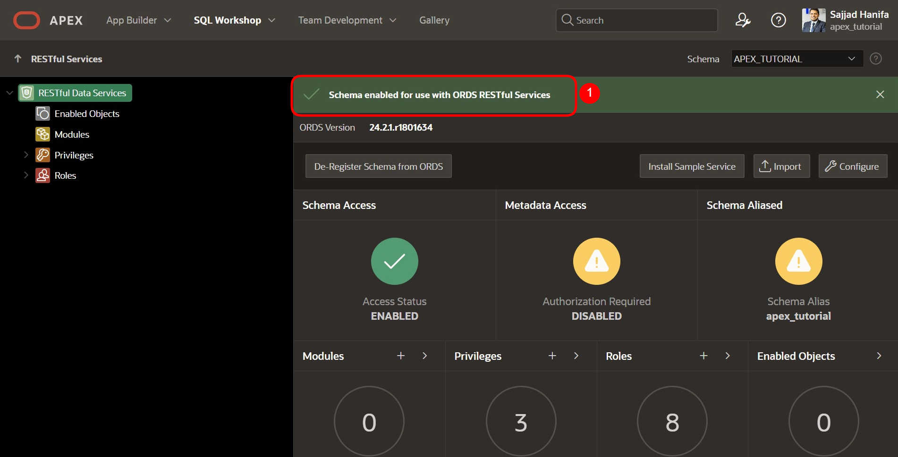
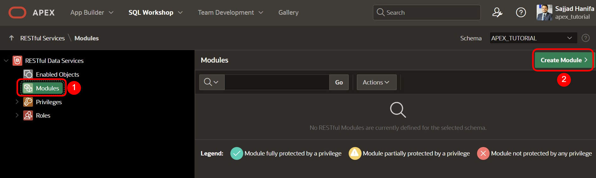
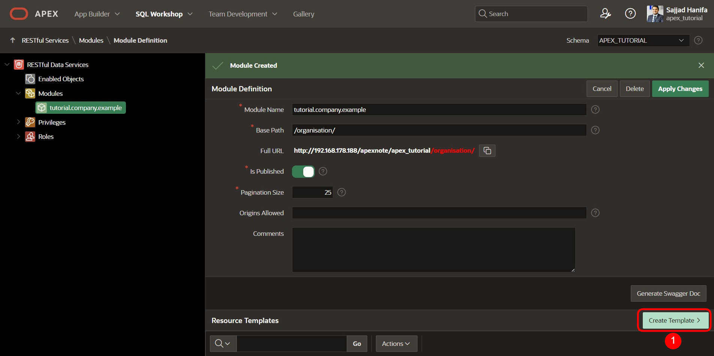
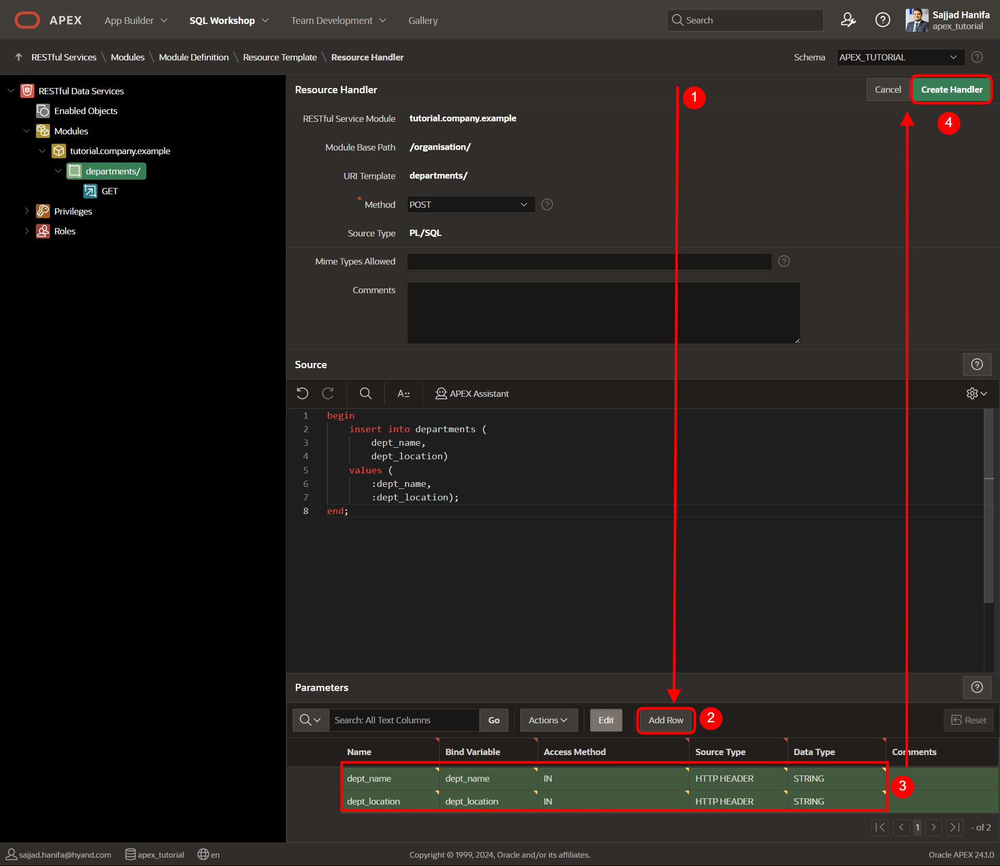
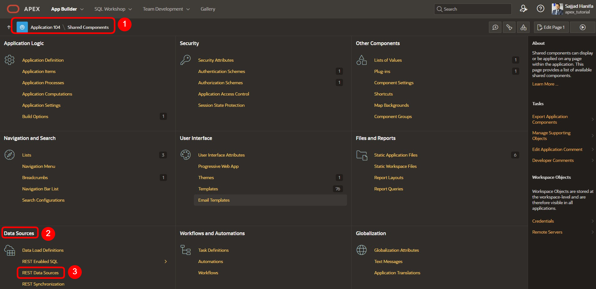
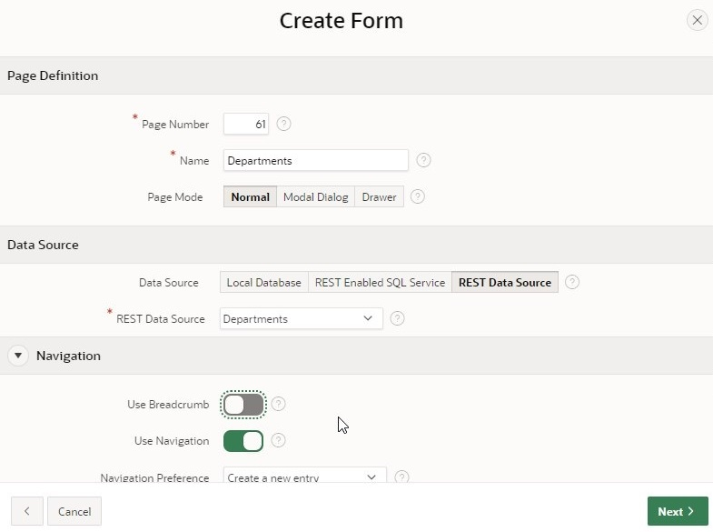

# 13. REST Data Sources
Data Sources ermöglichen die Einbindung von REST-Services. Die empfangenen Daten können in APEX Komponenten wie Reports oder Forms verwendet werden. Die Daten werden dabei als JSON-Objekte zwischen der Anwendung und der REST Source transportiert. Es gibt verschiedene Operationen entsprechend der HTTP-Methoden (GET, POST, PUT, DELETE), die mit der jeweiligen Datenbankoperation (SELECT, INSERT, UPDATE, DELETE) verknüpft werden können.

## 13.1. RESTful Service erstellen
In dieser Aufgabe erstellen Sie einen eigenen RESTful Service. Diesen können Sie aus dem Internet aufrufen sowie in anderen Diensten nutzen. 
- Um den RestFul Service zu erstellen, klicken Sie auf den **SQL Workshop** und dann auf **RESTful Services**. 

- Beim erstmaligen Anlegen eines RESTFUL Services, müssen Sie zuerst Ihr Schema mit ORDS (Oracle Data Service registrieren), indem Sie auf den Button **Register Schema with ORDS** klicken. 


- Klicken Sie im sich öffnenden Dialog auf **Save Schema Attributes**.



Jetzt sehen Sie die folgende Übersichtsseite:



- Klicken Sie in dieser auf **Modules** und anschließend auf den **Create Module** Button. 



- Geben Sie als **Module Name *tutorial.company.example*** und als **Base Path */organisation/*** ein. Klicken Sie danach auf **Create Module**.


- Nachdem Ihr Module erstellt wurde, legen Sie für dieses nun ein Template an. Klicken Sie dafür auf den Button **Create Template**. 



- Geben Sie als **URI Template *departments/*** an und erstellen Sie Ihr Template, indem Sie auf **Create Template** klicken. 


- Klicken Sie nun auf **Create Handler**, um die Resource Handler anzulegen. In diesem Tutorial werden Sie zwei Handler (für GET und POST) anlegen.


- Im ersten Schritt werden Sie die GET-Methode anlegen. Wählen Sie hierfür als **Method** im Handler ***GET*** aus. Kontrollieren Sie, dass als **Source Type *Collection Query*** ausgewählt ist. 
- Geben Sie anschließend bei **Source** die folgende SQL-Abfrage ein: 

 ```sql
select dept_id,
	    dept_name,
        dept_location
from departments
 ```
- Jetzt haben Sie alle, für die GET-Abfrage notwendigen Informationen eingegeben. Sie können nun den Handler durch Klicken auf **Create Handler** erstellen. 


- Im nächsten Schritt legen Sie das POST-Handling an. Klicken Sie dafür auf Ihr Template **departments/** und dann auf **Create Handler**. 


 
- Wählen Sie als **Method *POST*** aus 


- Geben Sie unter **Source** den folgenden PL/SQL-Code ein:
 ```sql
begin
  	insert into departments (
  		dept_name,
 		dept_location)
  	values (
 		:dept_name, 
 		:dept_location);
end;
 ```


- Scrollen Sie nach unten zu **Parameters** und klicken Sie dort auf **Add Row**. 
- Geben Sie die folgenden Informationen ein: 

**Name: *dept_name***

**Bind Variable: *dept_name***

**Access Method: *IN***

**Source Type: *HTTP HEADER***

**Data Type: *STRING***

- Fügen Sie anschließend auch für die Location einen Parameter ein, indem Sie wieder auf Add Row klicken. Geben Sie die folgenden Daten ein:

**Name: *dept_location***

**Bind Variable: *dept_location***

**Access Method: *IN***

**Source Type: *HTTP HEADER***

**Data Type: *STRING***

- Wenn Sie dies erledigt haben, scrollen Sie wieder nach oben und klicken dort auf Create Handler. 



- Hiermit ist Ihr Module fertig definiert. Rufen Sie zur Kontrolle die URL, die Sie unter Full URL bei departments/ sehen mit Ihrem Browser auf. Sie sollten nun die Inhalte der GET-Abfrage und damit die ID, den Namen und die Location der Departments sehen.

 ```json
"items": [
    {
      "dept_id": 15,
      "dept_name": "Accounting",
      "dept_location": "New York"
    },
    {
      "dept_id": 16,
      "dept_name": "Research",
      "dept_location": "Dalls"
    },
    {
      "dept_id": 17,
      "dept_name": "Sales",
      "dept_location": "Chicago"
    },
    {
      "dept_id": 18,
      "dept_name": "Operations",
      "dept_location": "Boston"
    }
  ]
 ```
  
## 13.2.	REST Data Source erstellen
Nachdem Sie im vorherigen Kapitel einen eigenen RESTful Service erstellt haben, werden wir diesen in APEX als REST Data Source nutzen. Die Vorgehensweise, die im Folgenden gezeigt wird, gilt ähnlich auch für REST Datenquellen, die Sie nicht selbst erstellt haben. 
Um die REST Data Source anzulegen, gehen Sie in die Shared Components Ihrer Anwendung. 

- Die **REST Data Sources** befinden sich in den **Shared Components** unter dem Punkt **Data Sources**.



- Über den **Create** Button können Sie eine neue REST Datenquelle anlegen


 
- Da in dieser Anwendung bisher noch keine REST Data Sources vorhanden sind, müssen Sie diese neu erstellen, wählen Sie also **From Scratch** aus. Klicken Sie auf **Next**.

 

- Wählen Sie als **REST Data Source Type *Oracle REST Data Service*** aus. 
Geben Sie der REST Data Source den **Namen *Departments***. Zudem müssen Sie den URL Endpunkt definieren. Den URL Endpunkt finden Sie in Ihrem RESTful Service-Modul.  
- Klicken Sie anschließend auf den Button **Next**.
   

 
- Im zweiten Schritt des Assistenten müssen Sie den Service URL Path einrichten, also die Weiterleitung innerhalb der API. Hier müsste bereits automatisch der richtige Pfad voreingestellt worden sein, dementsprechend müssen Sie dort nichts ändern und nur auf **Next** klicken.
  


- Den Punkt **Authentication Required** lassen Sie ausgeschaltet, da die angelegte REST Datenquelle keine Authentication erfordert. Klicken Sie auf den **Discover** Button.
  

 
Klicken Sie im anschließenden Fenster auf **Create REST Data Source**. 
 


- Nun sehen Sie Ihre soeben erstellte REST Datenquelle in der Übersicht. 
- Sie können sich nun Ihre Rest Source ansehen. Klicken Sie dafür auf den Link Departments. 


 
- Ihre Rest Source sollte ähnlich wie in der folgenden Abbildung aussehen:


- Kontrollieren Sie, dass Ihre Einstellungen im **Data Profile** wie im Bild gezeigt aussehen und, dass bei **Operations** die beiden Operations ***GET*** und ***POST*** angelegt wurden. 
 
## 13.3.	Senden von Daten an eine REST-Datenquelle
In diesem Kapitel werden wir die zuvor erstellte REST Source nutzen, um eigene Daten senden. Konkret werden wir dabei neue Departments hinzufügen. Dafür wird die HTTP-POST-Methode verwendet, welche in der REST Data Source als Operation definiert wurde. 
- Öffnen Sie den **App Builder** und Ihre Anwendung. Klicken Sie auf **Create Page** und erstellen Sie eine neue Seite, indem Sie auf **Create Page** klicken. 

- Wählen Sie als Page Type **Form** aus. 
  


- Geben Sie als **Page Number *61*** und als **Page Name *Departments*** an. 
- Wählen Sie bei **Data Source *REST Data Source*** an und wählen Sie anschließend ***Departments*** als **REST Data Source** aus.
- Deaktivieren Sie im Bereich **Navigation** die Breadcrumb und klicken Sie auf **Next**. 

  

- Wählen Sie bei der **Primary Key Column *DEPT_ID*** aus. 
- Geben Sie bei **Branch Here on Submit *61*** ein und bei **Cancel and Go to Page** ebenfalls ***61***.
- Erstellen Sie nun Ihre Seite, indem Sie auf den **Create Page** Button klicken. 


- Rufen Sie die Seite über den **Run**-Button auf. 

- Über das Form können Sie nun neue Departments hinzufügen. 


## 13.4.	Abrufen von Daten aus einer REST Data Source
Nun möchten wir die REST Data Source nicht nur zum Hinzufügen von Daten nutzen, sondern auch, um Daten abzurufen und diese anzeigen zu lassen. Dafür wird die HTTP-GET-Methode verwendet, welche in der REST Data Source als Operation definiert wurde. 
- Über das in Kapitel 13.3 erstellte Form ist es nun möglich, neue Departments anzulegen. Um direkt zu erkennen, ob das Hinzufügen erfolgreich war, werden Sie zusätzlich einen Report auf der Seite erstellen.

- Klicken Sie im Page Designer auf der linken Seite auf Departments und machen Sie dann einen Rechtsklick auf Departments. Wählen Sie hier **Create Region** aus. 

- Wählen Sie als **Type** Ihrer Region ***Classic Report*** aus und geben Sie ihr den **Title *Alle Departments***. Wählen Sie unter Source ***REST Source*** als **Location** aus und anschließend ***Departments*** als **REST Source**. 


 
- Rufen Sie die Seite über den **Run**-Button auf. 
- Der Report zeigt Ihnen jetzt alle Departments an. 


Eine weitere Demo-Anwendung der MT AG auf Basis von REST Data Sources finden Sie hier: https://apex.oracle.com/pls/apex/mt_apisearch/r/datasources
