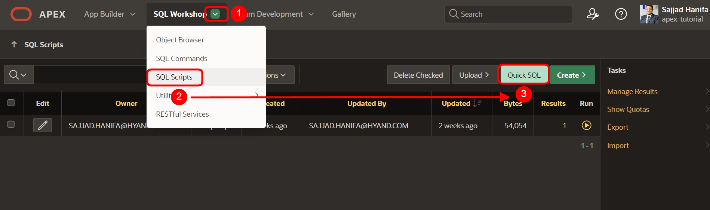
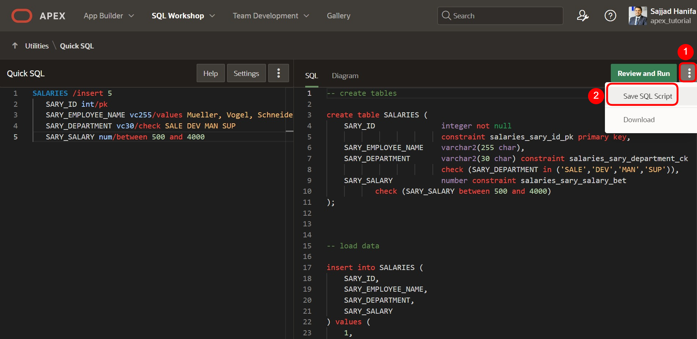
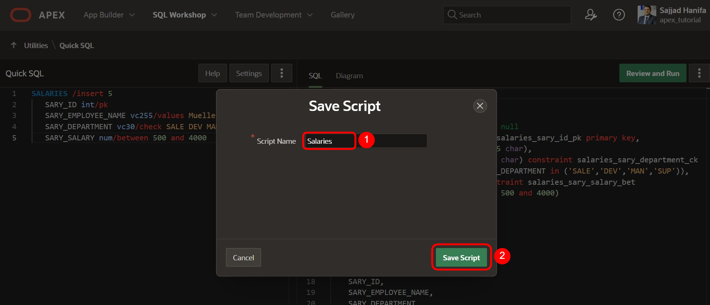
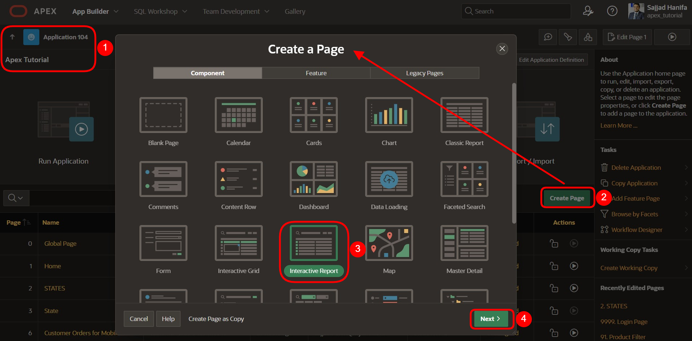
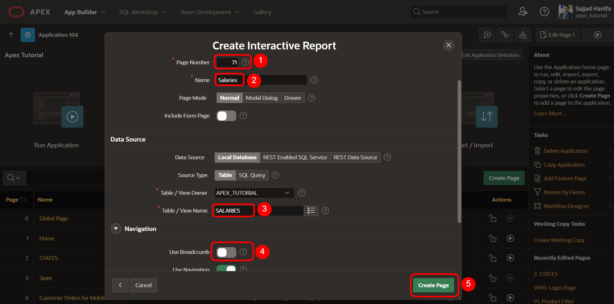
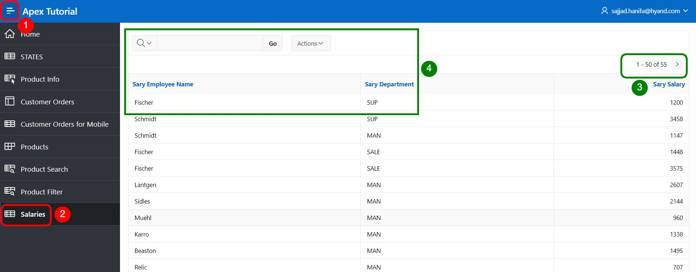

# 14. Exkurs: Datenmodellierung mittels Quick SQL

Mit Quick SQL können Datenmodelle schnell entworfen werden, indem eine **Markdown-artige Kurzschriftsyntax** verwendet wird. Hauptdetailbeziehungen können über ein **ERM** („Entity-Relationship-Modell“) dargestellt werden.  

> Weitere Informationen erhalten Sie unter [https://apex.oracle.com/en/quicksql/](https://apex.oracle.com/en/quicksql/) (Login erforderlich).

## 14.1. Erstellung der Datenbank-Tabelle

- Navigieren Sie auf **SQL Workshop** und klicken Sie anschließend auf **SQL Scripts**.

- Klicken Sie oben rechts auf **Quick SQL**.


 
- Auf der folgenden Seite geben Sie im linken Textbereich folgenden **Quick SQL-Code** ein:

 ```sql
SALARIES /insert 5
    SARY_ID int/pk
    SARY_EMPLOYEE_NAME vc255/values Mueller, Vogel, Schneider, Fischer, Schmidt
    SARY_DEPARTMENT vc30/check SALE DEV MAN SUP
    SARY_SALARY num/between 500 and 4000
 ```

>! Achten Sie bitte bei der Eingabe auf die oben dargestellten Einzüge!  

- Klicken Sie anschließend auf **Generate SQL**, damit der Code in SQL-Code übersetzt wird. Im rechten Textbereich wird daraufhin der erzeugte SQL-Code angezeigt. 



- Klicken Sie auf **Save SQL Script**, um den Code zu speichern. 
- Es öffnet sich ein Fenster, in dem Sie einen Namen für das Skript vergeben müssen. Benennen Sie das **Skript** als ***salaries*** und klicken Sie danach auf **Save Script**. 



- Klicken Sie anschließend auf **Review and Run**. 


- Sie sehen eine Vorschau Ihres SQL-Codes. Starten Sie das Skript, indem Sie auf den Button **Run** klicken. 


- Klicken Sie auf **Run Now**.  

 
 
- Nach dem erfolgreichen Import sollten Sie folgende Ausgabe sehen:


 
## 14.2. Erstellung eines Interactive Reports

Zur Visualisierung der eben erstellten Daten legen Sie in dieser Aufgabe einen Interactive Report an.
- Dazu gehen Sie wieder in den **App Builder**, dann auf Ihre **Anwendung** und anschließend klicken Sie auf **Create Page** und wählen **Interactive Report** aus.

 
 
- Im folgenden Fenster geben Sie als **Page Number *71*** und bei **Page Name *Salaries*** ein.
- Als **Table / View Name** wählen Sie ***SALARIES*** aus.
- Deaktivieren Sie im Bereich Navigation die *Breadcrumb* und klicken auf **Create Page**.

 

- Der Page Designer öffnet sich. Wenn Sie auf **Run** klicken, wird die Seite geladen und Sie sehen den Report, den Sie eben per Quick SQL angelegt haben.


## 14.3. Beispieldaten mittels Data Generator generieren

Verwenden Sie das Dienstprogramm Data Generator, um **Blueprints** zu erstellen und anschließend Beispieldaten zu generieren.
- Navigieren Sie auf **SQL Workshop** und klicken Sie anschließend auf **Utilities**.
- Klicken Sie dann auf **Data Generator**.


- Klicken Sie hier auf **Create Blueprint**.


- Im nächsten Schritt wählen Sie **Use Existing** Tables, um Beispieldaten in einer bereits bestehenden Tabelle einzufügen.


- Im nächsten Schritt wählen geben Sie dem *Blueprint* den Namen **Salaries Blueprint**, und wählen die zuvor erstellte Tabelle **Salaries** aus. Abschließend klicken Sie auf **Create Blueprint**.

 

- Jetzt werden Sie automatisch zum Blueprint Designer weitergeleitet. Von hier aus können Sie definieren was für Beispieldaten generiert werden sollen.
- Wählen Sie für **SARY_EMPLOYEE_NAME** den Data Source Built-In und den **Built-In** Typen **Last Name**. Da keine null Werte eingefügt werden sollen muss noch **required** gesetzt werden. Zuletzt muss Maximum Length laut der Tabellenvorgabe mit varchar(9) auf **9** gesetzt werden.

 
 
- Wählen Sie für **SARY_SALARY** den Data Source **Built-In** und den Built-In Typen **Number** (nach number.random suchen). Als Minimum Value geben wir **500** vor und als Maximum Value **4000**. Da auch hier keine null Werte eingefügt werden sollen muss auch hier noch **required** gesetzt werden.


- Der Blueprint für die Beispieldaten wäre jetzt fertig konfiguriert. Speichern Sie diesen zunächst, indem Sie auf **Save** klicken. 


- Klicken Sie nun auf **Preview Data** um eine Vorschau der generierten Daten zu erhalten.


- Um die Beispieldaten final zu generieren, klicken Sie als nächstes auf **Generate Data**.


- Wählen Sie hier **Insert into Database** und die Insert Method Insert Into um die Daten direkt in die Datenbanktabelle einzufügen. Anschließend klicken Sie auf **Insert Data**.
 

 
- Um das Ergebnis des Inserts kontrollieren zu können, rufen Sie erneut die zuvor erstellte Page 71 im App-Builder auf. Wenn Sie jetzt auf **Run** klicken, wird die Seite geladen und Sie sehen den Report, mit den neu eingefügten Daten.


