# <a name="genehmigungsprozess-erstellen"></a>16. Genehmigungsprozess erstellen

In dieser Aufgabe werden Sie eine Anwendung erstellen, die dazu dient, Gehälter von Mitarbeiter anzupassen. Die nötigen Daten dafür haben wir bereits in Kapitel 14 eingefügt.
Das Ziel ist es, dass jeder Mitarbeiter sein Gehalt entsprechend anpassen kann, wodurch ein Genehmigungsprozess startet. Anschließend muss der Vorgesetzte den Prozess bearbeiten und entweder zustimmen oder ablehnen.

## <a name="task-erstellen-einer-anwendung"></a>16.1 Erstellen einer Anwendung

- Für diese Aufgabe wird eine **Anwendung** erstellt. Öffnen Sie hierzu als erstes den **App Builder** und klicken Sie auf den Button **Create**. Der App Builder zeigt alle installierten Anwendungen an.

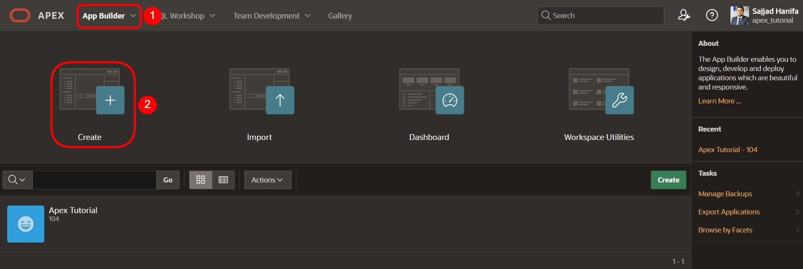

- Der Assistent zur Erstellung von Anwendungen wird gestartet. Klicken Sie auf **New Application**, um eine neue Anwendung zu erstellen.

 
 
- Geben Sie jetzt den Namen der Anwendung ein (z.B. Tutorial Approvals).

 

- Sie brauchen vorerst keine weiteren Einstellungen vorzunehmen. Klicken Sie **Create Application** um die neue Anwendung zu erstellen.

## <a name="erstellen-einer-task-definition"></a>16.2 Erstellen einer Task Definition

- Klicken Sie anschließend auf **Shared Components**. 
 
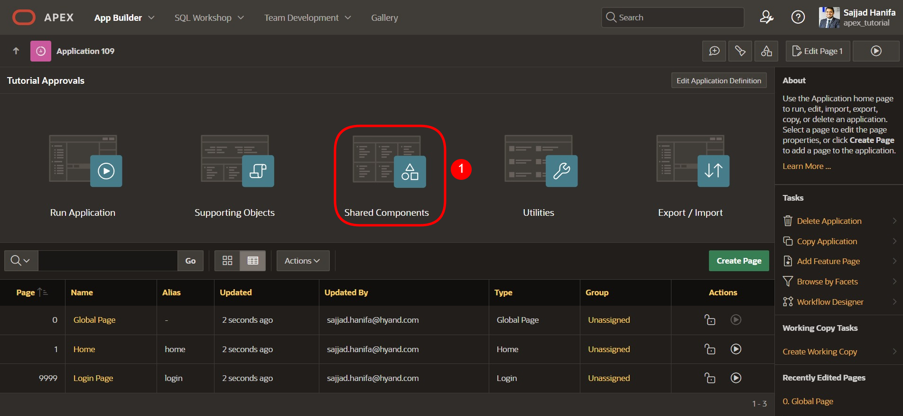 

- Klicken Sie unter **Workflows and Automations** auf **Task Definitions**.

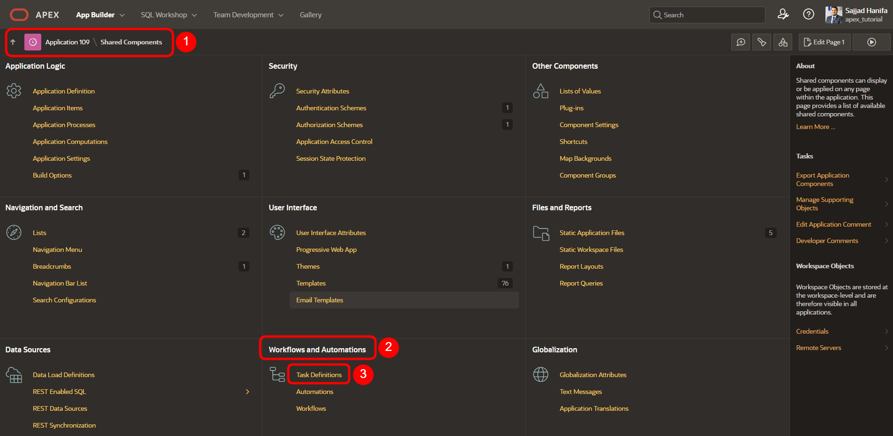 

- Klicken Sie unter **Workflows and Automations** auf **Task Definitions**.   
- Klicken Sie hier auf **Create**.  

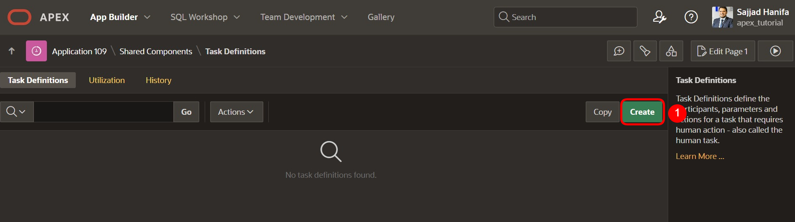  

- Geben Sie hier folgende Werte ein:  

  | | |  
  |--|--|
  | **Name** | *Salary Request* | 
  | **Subject** | *Salary Request for &EMPLOYEE_NAME. from &SALARY. to &P_NEW_SALARY.*| 
  | **Priority** | *2-High*  | 
  | | |  

- Klicken Sie anschließend auf **Create**.  


- Nachdem der Task erstellt wurde, erhalten Sie eine Übersicht. 
- Ändern Sie hier die Action Source auf **SQL Query** und geben das folgende **Action SQL Query** ein.

 ```sql
select initcap(sary_employee_name) as employee_name,
       sary_salary as salary 
  from salaries
 where sary_id = :APEX$TASK_PK
 ```  

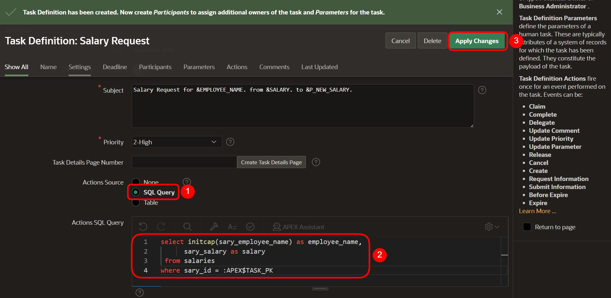 
 
- Als nächstes wird die **Task Details Page** erstellt. Klicken Sie dafür den Button **Create Task Detail Page**.  

  

- Der aufkommende Dialog kann mit **OK** bestätigt werden.  
- Sie gelangen jetzt wieder zur Übersicht Ihrer Tasks. Klicken Sie auf den zuvor angelegten Task **Salary Request** um im nächsten Schritt Teilnehmer hinzuzufügen.  

  

- Im Bereich Participants wählen Sie für den **Potential Owner** den Value Type **Static** und geben den Value **SCHNEIDER** ein.  

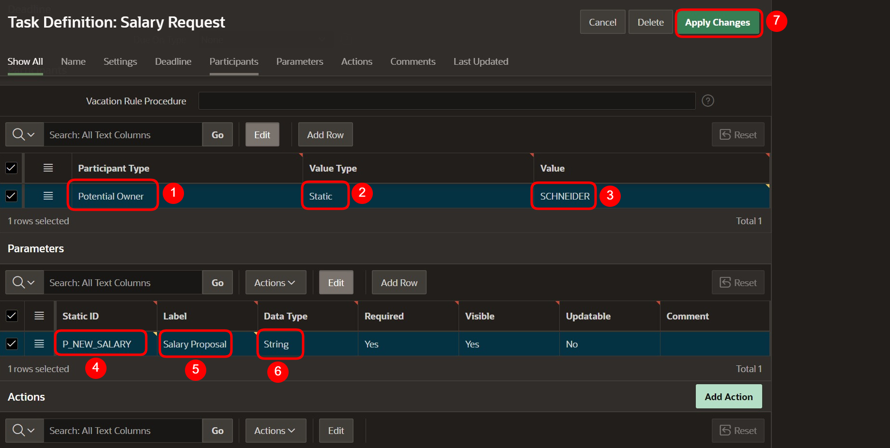  

- Als Parameter geben Sie **P_NEW_SALARY** mit dem Label **Salary Proposal** und den Data Type **String** ein.  

 
 
- Klicken Sie jetzt **Apply Changes** um alle Eingaben zu speichern und wechseln Sie anschließend erneut in den Task um eine Action hinzuzufügen. Klicken Sie dafür im unteren Bereich auf **Add Action**.  
 
  

- Ein neuer Dialog für die Action wird geöffnet.  
- Geben Sie hier folgende Eingaben ein:  

  | | |  
  |--|--|
  | **Name** | *ON_APPROVE* | 
  | **Type** | *Execute Code* | 
  | **Executoin Sequence** | *1*  | 
  | **On Event** | *Complete*  | 
  | **Outcome** | *Approved*  | 
  | **Success Message** | *Salary change approved*  | 
  | | |  


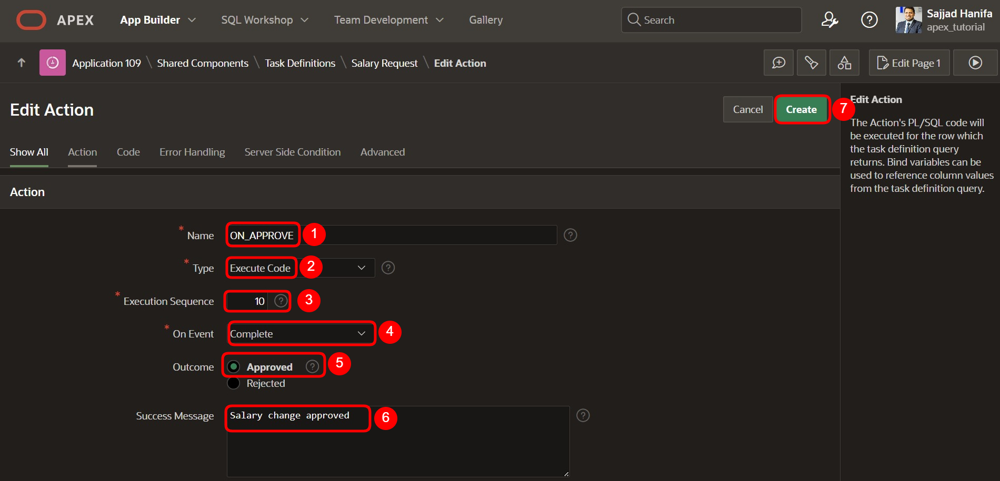  

- Zuletzt noch das folgende SQL Query eingeben.  

 ```sql
update salaries
   set sary_salary = :P_NEW_SALARY
 where sary_id = :APEX$TASK_PK;
 ```  
 
- Abschließend auf **Create** klicken.  

  

- Der Task ist nun fertiggestellt, so dass Sie als nächstes wieder zur Anwendungsübersicht wechseln können.  
 
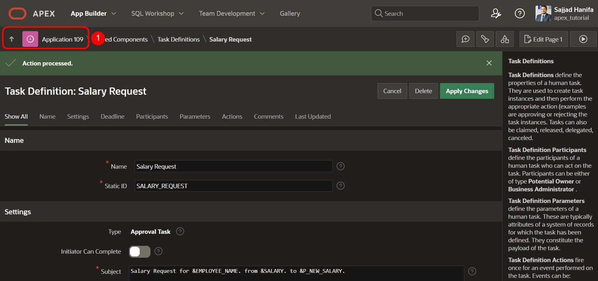  

## <a name="erstellen-der-my-approvals-und-my-request-seite"></a>16.3 Erstellen der „My Approvals“ und „My Request“ Seite

- Klicken Sie auf **Create Page** und wählen **Unified Task List** aus. Anschließend klicken Sie **Next**.  

  

- Geben Sie folgende Werte ein:  

|  |  |
|--|--|
| **Page Number** | 4 |
| **Page Name** | My Approvals |
| **Request Context** | My Tasks |
|  |  |  

- Klicken Sie dann auf **Create Page**.  

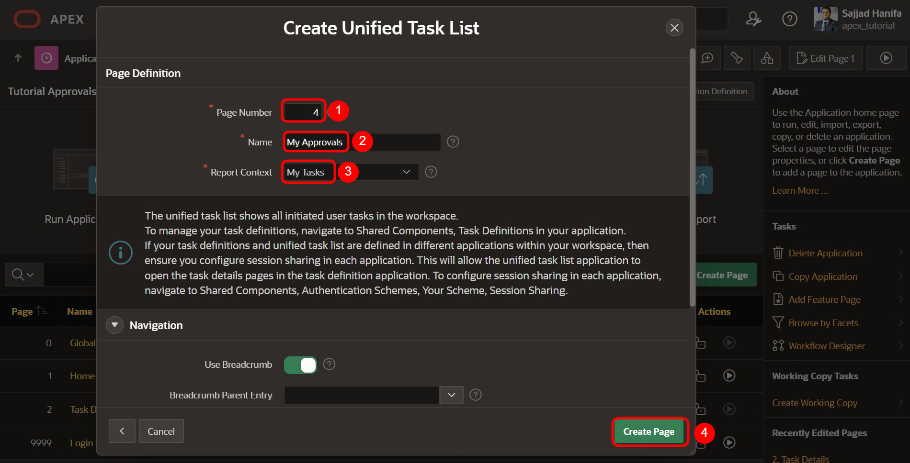 

- Die Seite wird nun erstellt und angezeigt. Wechseln Sie wieder zur Seitenübersicht und klicken erneut auf **Create Page**.  

 
- Wählen Sie auch hier wieder die Component **Unified Task List** aus.  

- Geben Sie dann folgende Werte ein:  

|  |  |
|--|--|
| **Page Number** | 5 |
| **Page Name** | My Requests |
| **Request Context** | Initiated by Me |
|  |  |  

- Klicken Sie dann auf **Create Page**.  
 
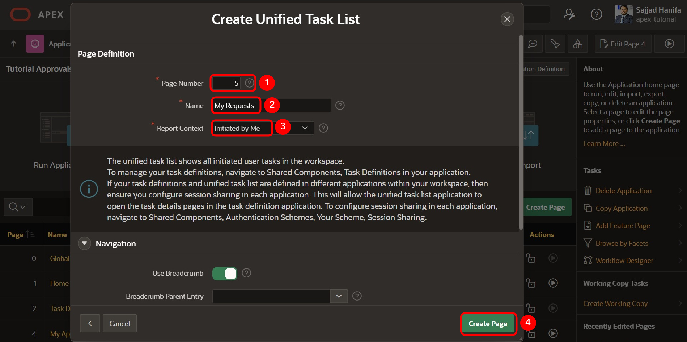  
 
## <a name="erstellen-der-salary-change-seite"></a>16.4	Erstellen der „Salary Change“ Seite

- Klicken Sie auf **Create Page** und wählen **Blank Page** aus.  
- Anschließend klicken Sie **Next**.  

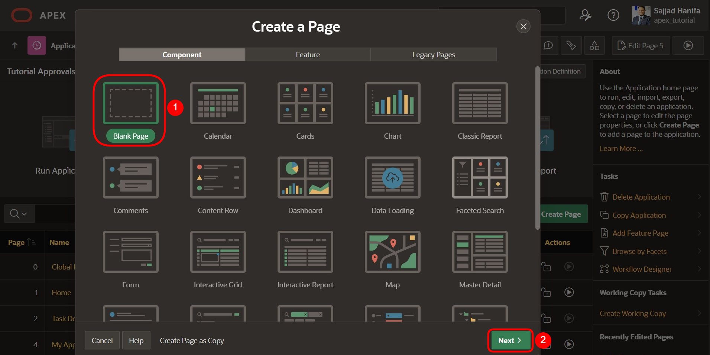

- Geben Sie die Page Number 6 ein und den Page Name **Salary Change**.   
- Deaktivieren Sie hier die *Breadcrumb* und klicken Sie anschließend auf den Button **Create Page**.  
 
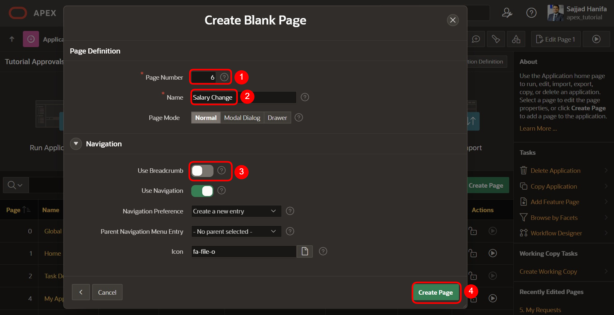  
 
- Sie gelangen nun zum Page Editor.  
- Fügen Sie eine Region Form zum Bereich **Body** hinzu.
- Den Title ändern Sie auf **Salary Change**.
- Unter Source wählen Sie den Table **Salaries** aus.
- Ändern Sie das Page Items **P6_SARY_ID** wie folgt:
  - Type: Hidden
  - Primary Key: True
- Ändern Sie das Page Items **P6_SARY_EMPLOYEE_NAME** wie folgt:
  - Type: Display Only
  - Label: Employee Name
- Ändern Sie das Page Items **P6_SARY_ DEPARTMENT** wie folgt:
  - Type: Display Only
  - Label: Department
- Ändern Sie das Page Items **P6_SARY_ Salary** wie folgt:
  - Type: Display Only
  - Label: Current Salary
- Fügen Sie dann ein neues Page Item **P6_NEW_SALARY** hinzu:
  - Type: Number Field
  - Label: New Salary
  - Minimum Value: 500
  - Maximum Value: 4000
  - Number Alignment: Start

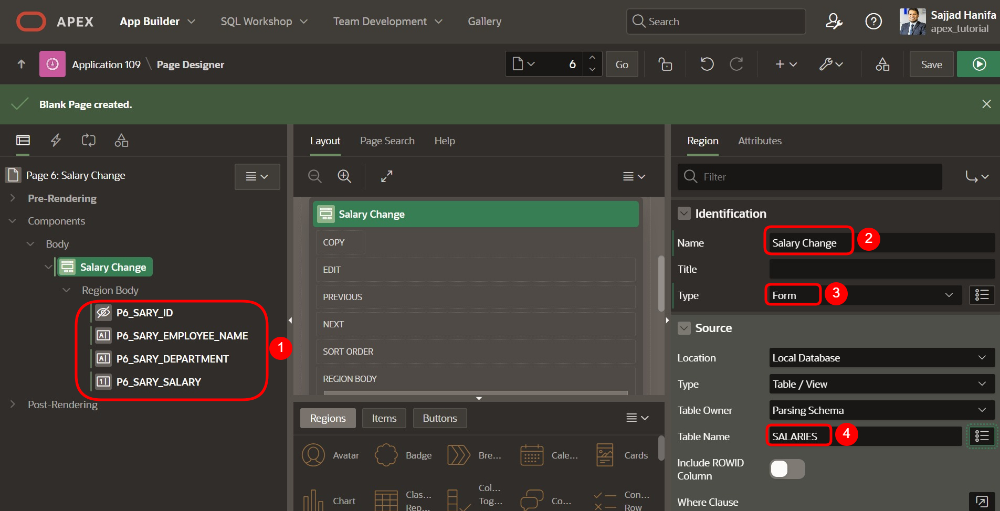

- Ändern Sie im Bereich **Pre-Rendering** den Process **Initialize form Salary Request**.  
- Den Namen ändern Sie bitte auf **Fetch Employee Details for User**.  
- Den Type ändern Sie auf **Execute Code**.  
- Im PL/SQL Code Editor geben Sie bitte folgendes SQL-Query ein:  

 ```sql
select sary_id, sary_employee_name, sary_department, sary_salary
  into :P6_SARY_ID, :P6_SARY_EMPLOYEE_NAME, :P6_SARY_DEPARTMENT, :P6_SARY_SALARY
  from salaries
 where initcap(sary_employee_name) = initcap(:APP_USER);
 ```

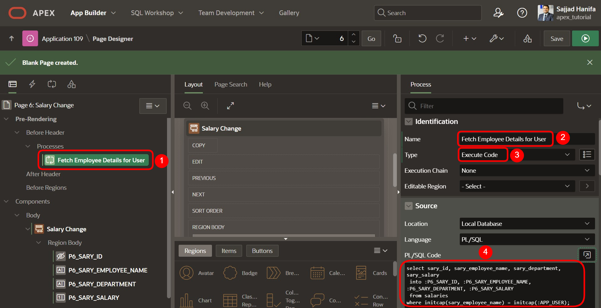  

- Fügen Sie dann der Seite einen Button hinzu und nennen diesen **Submit**.  
- Den Button platzieren Sie zur Position **Create** und aktivieren **Hot**.  

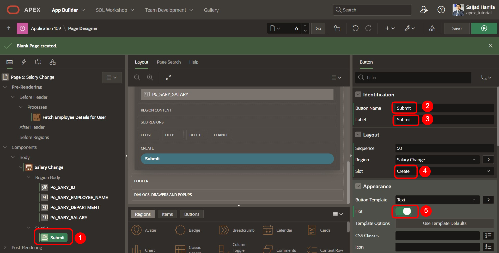  

- Wechseln Sie dann zu **Processes** und fügen Sie dort einen neue Process hinzu.  
- Den *Process* nennen Sie **Submit Task** und ändern folgende Werte:  
  - Type: Human Task - Create  
  - Definition: Salary Request  
  - Details Primary Key Item: P6_SARY_ID  
  - When Button pressed: Submit  

  

- Der zum Process angelegte Parameter **Salary Proposal** entsprechend anpassen:
  - Type: Item
  - Item: P6_NEW_SALARY


- Zuletzt fügen Sie noch ein **After Processing Branch** hinzu und nennen diesen **Go To Page 5**.
- Als Target wählen Sie die **Page 5**.
- Anschließend die Seite mit Klick auf den **Save** Button speichern.

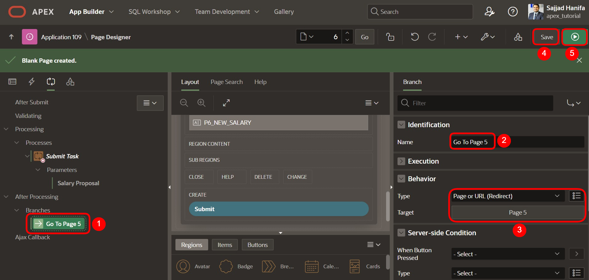

Die Anwendung ist jetzt fertig erstellt.

## <a name="task-user-erstellen"></a>16.5	User erstellen

Bevor die Anwendung jetzt gestartet und simuliert werden kann, müssen im Workspace noch entsprechende User erstellt werden. In diesem Beispiel wird ein Mitarbeiter erstellt, der eine Gehaltsanpassung beantragen kann, sowie ein Admin User, der den Prozess bearbeiten kann.  

Wichtig ist, dass Sie als Administrator in Ihrem Workspace angemeldet sind, so dass Ihnen die Berechtigung gegeben ist neue User zu erstellen.
- Wechseln Sie dazu wieder in den **Application Builder** und klicken oben rechts auf das **Administration** Icon und wählen dort den Eintrag **Manage Users and Groups**.


- Klicken Sie hier auf **Create User**.


- Geben Sie hier folgendes ein:
  - Name: FISCHER
  - Email Address: fischer@fischer.de
  - Password: 12345678
  - Confirm Password: 12345678
  - Require Change of Password on First Use: No
- Klicken Sie anschließend auf **Create and Create Another** und wiederholen die Eingaben für den User **SCHNEIDER**.

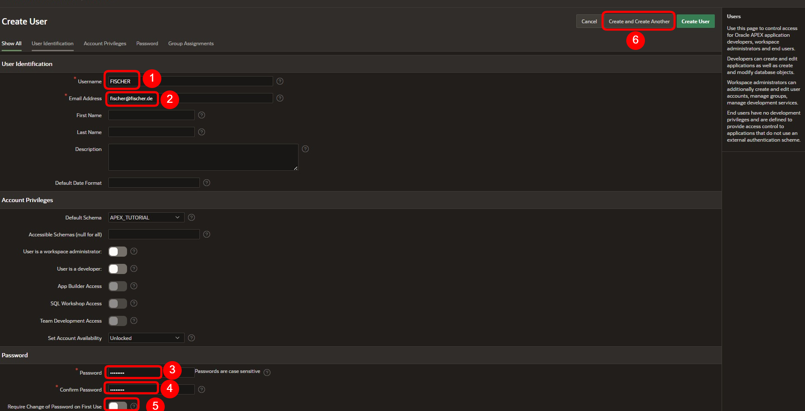

- Beenden Sie hier die Eingabe mit Klick auf **Create User**.
 
## <a name="task-anwendung-ausfuehren"></a>16.6	Anwendung ausführen

- Wechseln Sie jetzt wieder zum Application Builder und starten von dort aus die zuvor erstellte Anwendung **Tutorial Approvals**. 
- Melden Sie sich zunächst als Mitarbeiter **FISCHER** an.

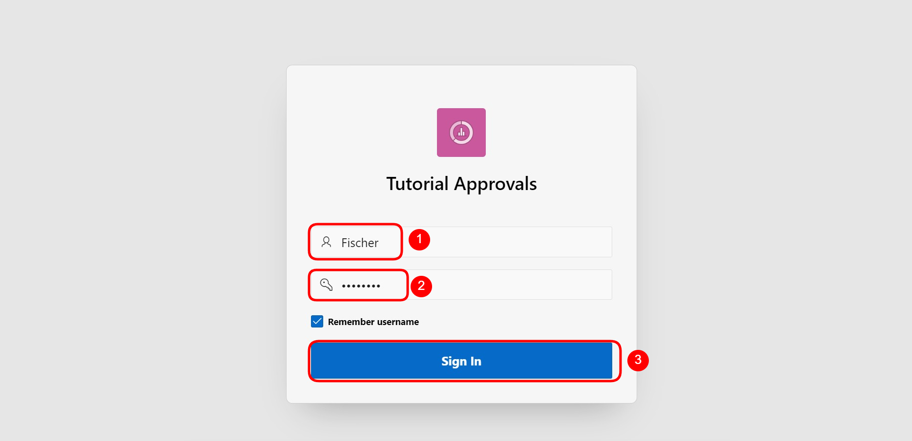

- Wechseln Sie hier zur Seite **Salary Change** und geben dort den Wert **3900** bei **New Salary** ein.  
- Anschließend klicken Sie **Submit**.  

  

- Sie gelangen von dort aus zur Seite **My Requests** und sehen dort die soeben angeforderte Gehaltsanpassung.   
 
- Klicken Sie jetzt auf den Titel der Anfrage. Es erscheint dann ein Slider mit allen Task Details.  

  

- Als nächstes melden Sie sich von der Anwendung ab.  

- Melden Sie sich jetzt mit dem User SCHNEIDER an.  
 
  

- Wechseln Sie hier zur Seite **My Approvals**. Sie sehen dort alle Anfragen.  

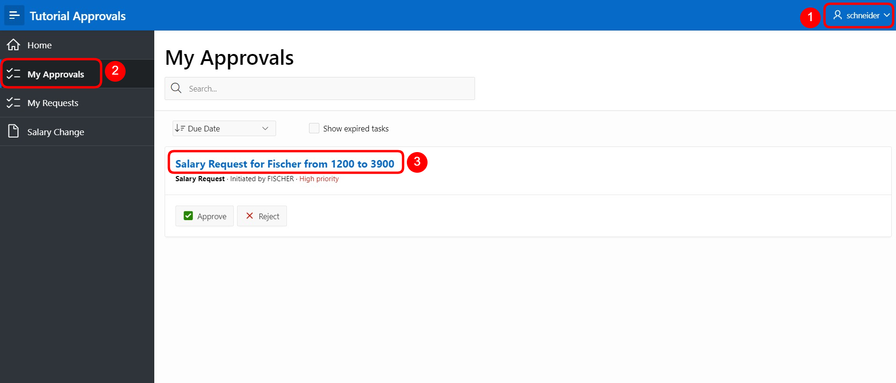  

- Klicken Sie jetzt auf den Titel der Anfrage. Es erscheint ein Slider mit allen Task Details.  
- Wenn Sie jetzt auf **Approve** klicken wird der Antrag genehmigt. Ein Klick auf **Reject** würden die Anfrage ablehnen. Klicken Sie auf **Approve**.  

  

- Der Antrag wurde genehmigt und das Gehalt vom Mitarbeiter **FISCHER** entsprechend angepasst.