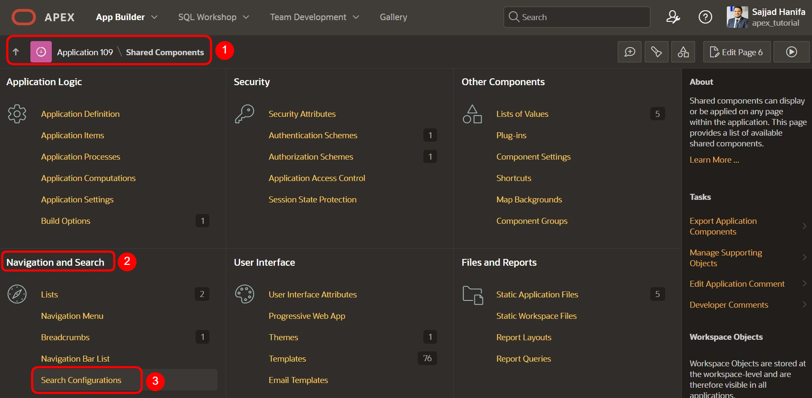
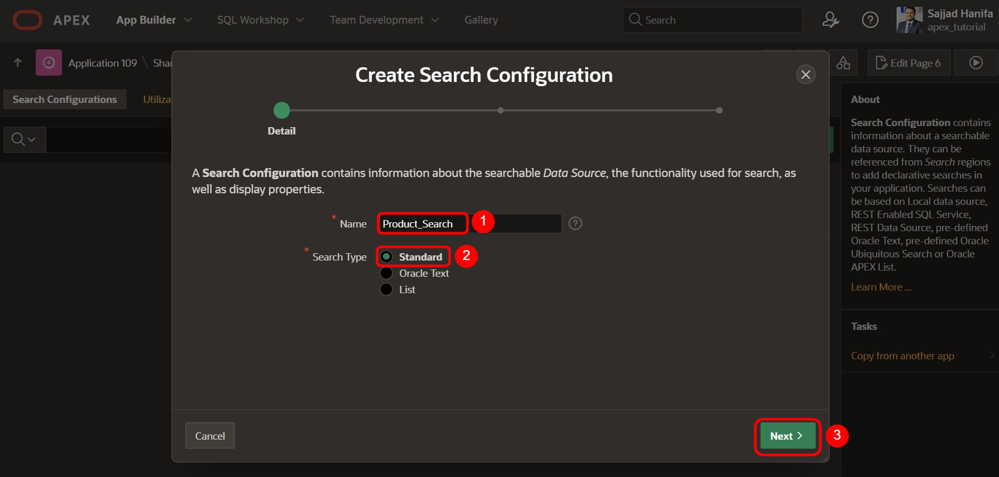
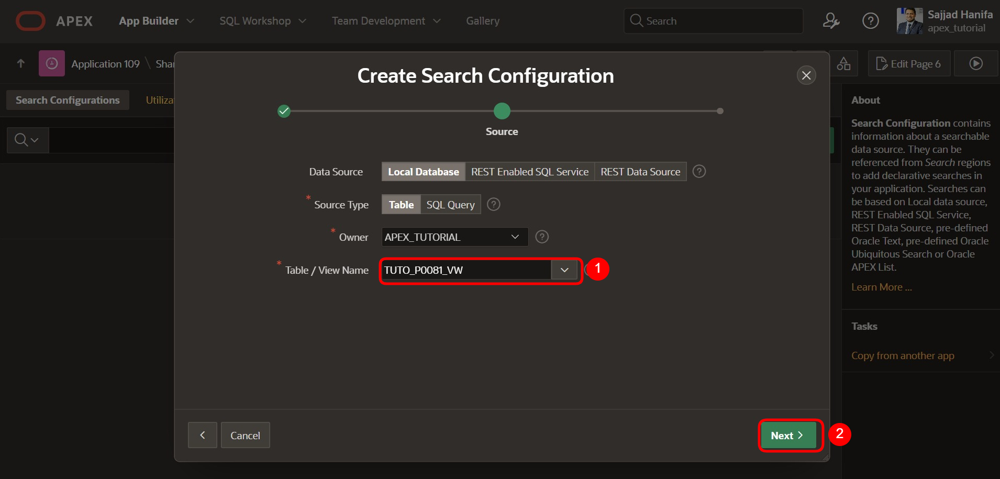
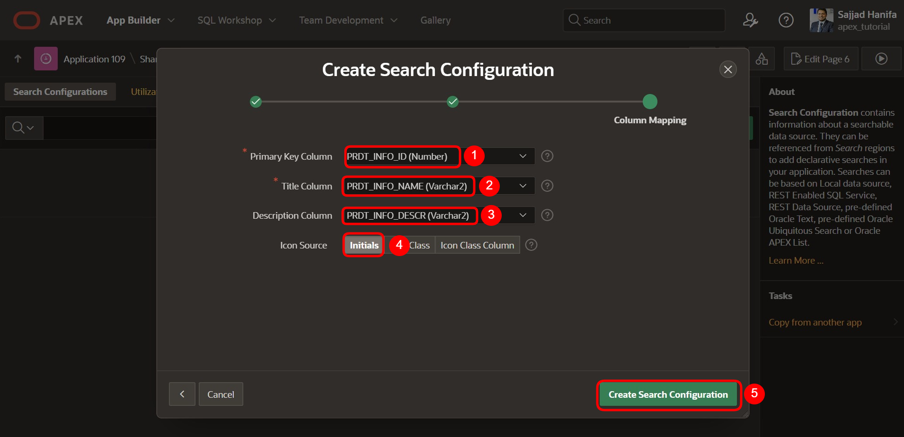
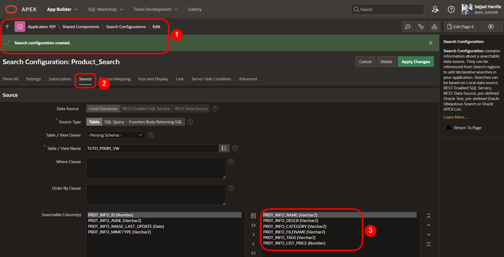
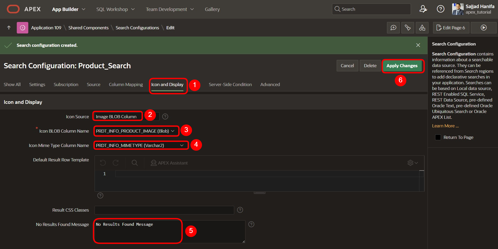
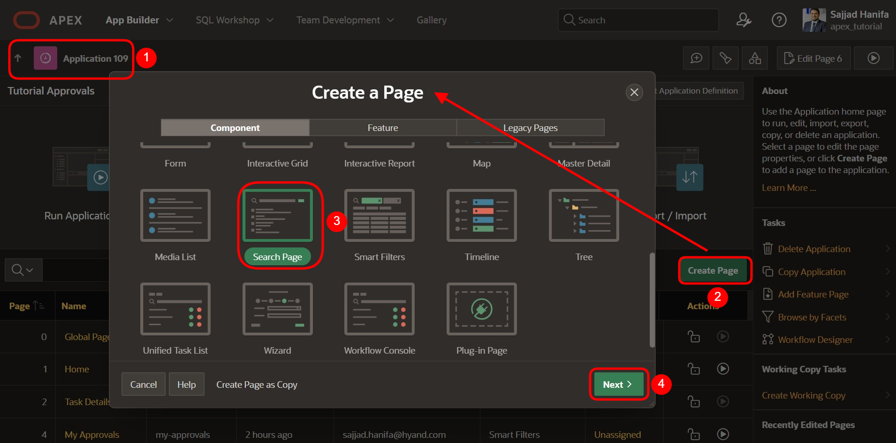
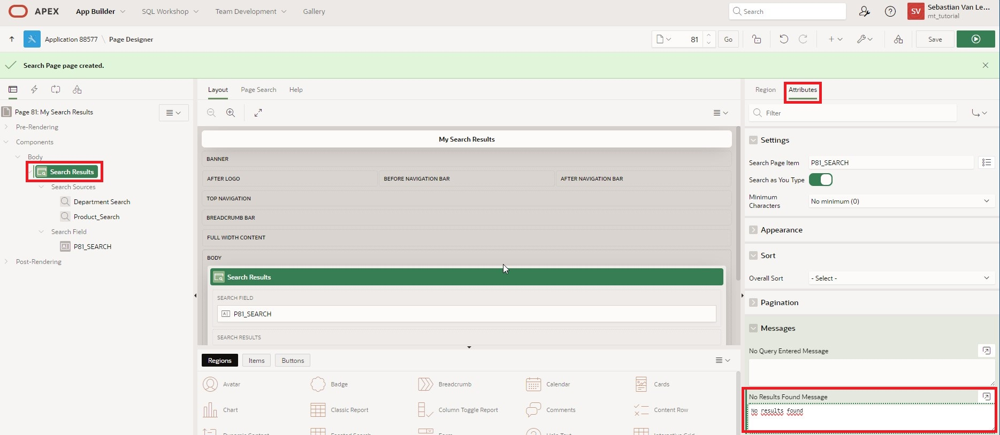
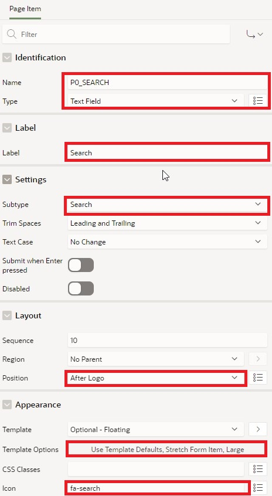
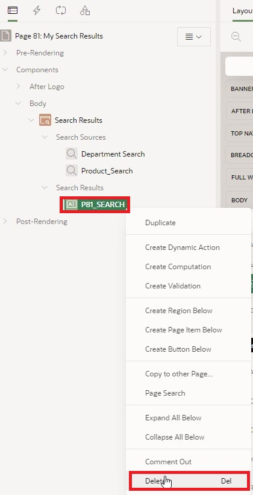

# 17. Application Search: Suchregionen und Suchkonfigurationen erstellen

In dieser Aufgabe werden Sie eine Suchregion und Suchkonfigurationen erstellen, die in mehreren Datenquellen nach Ergebnissen sucht. Dazu benötigen Sie die in Kapitel 13 beschriebenen Kenntnisse.  

Ziel ist es, Ihren Benutzern eine leistungsstarke Funktion im Stil einer Suchmaschine zur Verfügung stellen, die in Minutenschnelle mehrere Datenquellen nach Ergebnissen durchsucht und diese in einer einzigen einheitlichen Suchergebnisregion anzeigt.  

## 17.1. Erstellen eine Suchkonfiguration 

Diese neue gemeinsame Komponente definiert die zu durchsuchenden Datenquellen und die Anzeige der Ergebnisse. Die Suche kann auf lokalen Daten, APEX-Listen, REST-fähigen SQL-Services oder REST-Services basieren.  

In den folgenden zwei Beispielen wird die Suche einmal in den lokalen Daten und einmal mit einer REST-Datenquelle durchgeführt.  

### 17.1.1. Lokalen Daten Datenquelle

- Für die Bearbeitung dieser Aufgabe wird eine **View** benötigt.  

- Geben Sie Ihrer **View** den Namen ***TUTO_P0081_VW***:  
  Query:  
  ```sql
  select prdt_info_id,
         prdt_info_name,
         prdt_info_descr,
         prdt_info_category,
         prdt_info_avail,
         prdt_info_list_price,
         prdt_info_product_image,
         prdt_info_mimetype,
         prdt_info_filename,
         prdt_info_image_last_update,
         prdt_info_tags
    from product_info
  ```

- Öffnen Sie den **App Builder**, wählen Sie Ihre Anwendung (siehe Kapitel 2) und klicken Sie auf **Shared Components**.  

- Klicken Sie auf den Eintrag **Search Configurations** unter **Navigation and Search**.  

  

- Klicken Sie auf **Create**.  

  

- Geben Sie hier folgende Werte ein und klicken Sie auf **Next**:  

  | | |  
  |--|--|
  | **Name** | *Product_Search* | 
  | **Search Type** | *Standard*| 
  | | |

  

- Wählen Sie hier folgende Werte aus klicken Sie dann auf **Next**:  

  | | |  
  |--|--|
  | **Data Source** | *Local Database* | 
  | **Source Type** | *Table*| 
  | **Table / View Name** | *TUTO_P0081_VW*| 
  | | |  

  

- Wählen Sie hier folgende Werte aus, klicken Sie anschließend auf **Create Search Configuration**:  

  | | |  
  |--|--|
  | **Primary Key Column** | *PRDT_INFO_ID* | 
  | **Title Column** | *PRDT_INFO_NAME*| 
  | **Description Column** | *PRDT_INFO_DESCR*| 
  | **Icon Source** | *Initials*| 
  | | |  

  

  Beachten Sie, dass die durchsuchbare(n) Spalte(n) varchar-Spalten sein müssen.  



  Das **Column Mapping** stellt die Spalten dar, die in der Benutzeroberfläche angezeigt werden:
  Eine Zahlenspalte (z.B. Spalte **PRDT_INFO_LIST_PRICE**) kann für die **Score Column** verwendet werden, die zur Bewertung des Suchergebnisses dient.  

  

- Wählen Sie unter **Icon and Display** folgende Werte aus:  

  | | |  
  |--|--|
  | **Icon Source** | *Image BLOB Column* | 
  | **Icon BLOB Column Name** | *PRDT_INFO_PRODUCT_IMAGE*| 
  | **Icon Mime Type Column Name** | *PRDT_INFO_MIMETYPE*| 
  | | |  

  Weiter unten kann ebenfall eine **No Results Found Message** hinzugefügt werden.  

  

- Klicken Sie abschließend den Button **Apply Changes** um die Änderungen zu speichern.  

  
    
### 17.1.2. REST-Datenquelle

Über den in Kapitel 13 erstellten RESTful Service und die REST-Datenquelle erstellen wir eine Suchkonfiguration, die auf der REST-Datenquelle **Departments** basiert.  

- Klicken Sie auf **Shared Components**  

- Klicken Sie auf den Eintrag **Search Configurations** unter **Navigation and Search**.  

- Klicken Sie auf **Create**.  

- Geben Sie hier folgende Werte ein und klicken Sie auf **Next**:  

  | | |  
  |--|--|
  | **Name** | *Department_Search* | 
  | **Search Type** | *Standard*| 
  | | |  

  

- Wählen Sie hier folgende Werte aus, dann klicken Sie auf **Next**:  

  | | |  
  |--|--|
  | **Data Source** | *REST Data Source* | 
  | **REST Data Source** | *Departments*| 
  | | |  

  

- Wählen Sie hier folgende Werte aus. Anschließend klicken Sie auf **Create Search Configuration**:  

  | | |  
  |--|--|
  | **Primary Key Column** | *DEPT_ID* | 
  | **Title Column** | *DEPT_NAME*| 
  | **Description Column** | *DEPT_LOCATION*| 
  | **Icon Source** | *Icon Class*| 
  | **Icon CSS Classes** | *fa-sitemap*| 
  | | |  

  

## 17.2. Suchkonfigurationen in der Anwendung verwenden  

Um die Suchkonfigurationen zu verwenden, erstellen Sie eine Seite, auf der die Suchergebnisse angezeigt werden und ein Suchfeld, in das Sie den Suchbegriff eingeben können.  

### 17.2.1. Suchseite erstellen 

- Im **App Builder** klicken Sie auf **Create Page**.  
- Wählen Sie den Seitentypen **Component** aus.  
- Wählen Sie den Bereichstypen **Search Page** aus.  

  

- Geben Sie als **Page Number**: **81** ein und als **Page Name**: **My Search Results**. 
Eine Suchkonfigurationsliste ist bereits verfügbar. Wählen Sie die Suchkonfigurationen **Department_Search** und **Product_Search** aus. Die Seite kann mehrere Konfigurationen durchsuchen. 

- Unter **Navigation** schalten Sie **Use Breadcrumb** und **Use Navigation** aus und klicken Sie anschließend auf **Create Page**. Die Seite wird erstellt.  
  
  

- Unter **Body** klicken Sie auf **Search Results** Region, und dann auf **Attributes**.  
- Geben Sie als **No Results Found Message** *No Results found* ein.  
- Klicken Sie auf **Save und Run Page**.  

  

- Geben Sie **shoe** in das Suchfeld ein. Das Suchergebnis wird direkt auf der **My Search Results** Seite angezeigt.  

  


## 17.3. Suchfeld in die Navigationsleiste einbauen  

- Erstellen Sie auf der globalen Seite ein Item mit den folgenden Einstellungen:  

  | | |  
  |--|--|
  | **Name** | *P0_SEARCH* | 
  | **Type** | *Text Field*| 
  | **Label** | *Search*| 
  | **Position** | *After Logo*| 
  | **Icon** | *fa-search*| 
  | | |  
  
-  In **Template Options** wählen Sie **Stretch Form Item** und **Size Large** aus.  
  
  

- Unter **Advanced** verhindern Sie mit **Ignore** bei **Warn on unsaved changes** Meldungen zum Datenverlust beim verlassen von Seiten.

 

- Erstellen Sie eine **Dynamic Action** auf dem **P0_SEARCH** Item mit den folgenden Einstellungen:  

  | | |  
  |--|--|
  | **Name** | *Redirect to Results* | 
  | **Event** | *Key Press*| 
  | **Client-side Condition** | *JavaScript expression*| 
  | **JavaScript Expression** | *this.browserEvent.keyCode === 13*| 
  | | |  

  

Die **Dynamic Action** umfasst drei **True Actions**:  

  

- Die erste Aktion ist vom Type *Execute JavaScript Code* mit den folgenden Einstellungen:  

  | | |  
  |--|--|
  | **Name** | *Prevent Default Page Submit* | 
  | **Action** | *Execute JavaScript Code*| 
  | **Code** | *this.browserEvent.preventDefault();*| 
  | | |  


- Die zweite Aktion ist vom Type *Execute Server-side Code* mit den folgenden Einstellungen:

  | | |  
  |--|--|
  | **Name** | *Submit Search Item* | 
  | **Action** | *Execute Server-side Code*| 
  | **Language** | *PL/SQL*| 
  | **PL/SQL Code** | *null;*| 
  | **Items to Submit** | *P0_SEARCH*| 
  | | | 


- Und die dritte Aktion ist wieder vom Type *Execute JavaScript Code* mit den folgenden Einstellungen:

  | | |  
  |--|--|
  | **Name** | *Redirect to Results Page* | 
  | **Action** | *Execute JavaScript Code*| 
  | **Code** | *apex.navigation.redirect ( "f?p=&APP_ID.:81:&APP_SESSION.::NO:RP::" );*| 
  | | |  

  


- Löschen Sie das Searchfeld **P81_SEARCH** auf der **Seite 81**.  

  

- Unter **Body** klicken Sie auf **Search Results** Region, und dann auf **Attributes**.  

- Geben Sie als **Search Page Item**: **P0_SEARCH** ein und klicken Sie anschließend auf **Save**.  

  
    

<br>  

Das Suchfeld taucht nun in der Navigationsleiste auf, ist auf jeder Seite verfügbar und leitet Sie auf die Suchergebnisseite weiter, wenn ein Suchwert eingegeben und die Eingabetaste gedrückt wird.  


