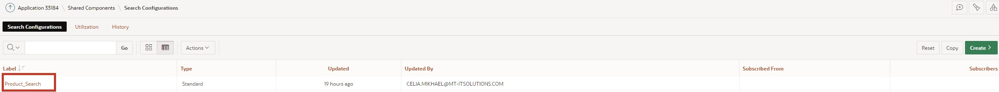

# 17. Antragssuche: Suchregionen und Suchkonfigurationen erstellen

In dieser Aufgabe werden Sie eine Suchregion und Suchkonfigurationen erstellen, die in mehreren Datenquellen nach Ergebnissen sucht. Dazu benötigen Sie die in Kapitel 13 beschriebenen Kenntnisse..
Das Ziel ist es, Ihren Benutzern eine leistungsstarke Funktion im Stil einer Suchmaschine zur Verfügung stellen, die in Minutenschnelle mehrere Datenquellen nach Ergebnissen sucht und diese in einem einzigen einheitlichen Suchergebnisregion anzeigt.

## 17.1. Erstellen eine Suchkonfiguration 

Diese neue gemeinsame Komponente definiert die zu durchsuchenden Datenquellen und die Anzeige der Ergebnisse. Die Suche kann auf lokalen Daten, APEX-Listen, REST-fähigen SQL-Services oder REST-Services basieren. In den folgenden 2 Beispielen wird die Suche einmal in den lokalen Daten und einmal in den REST-Datenquelle durchgeführt.

### 17.1.1. Lokalen Daten Datenquelle

- Für die Bearbeitung dieser Aufgabe wird eine **View** benötigt. 

- Geben Sie Ihrer **View** den Namen ***TUTO_P0081_VW***:
  Query:
  ```sql
  select prdt_info_id as product_id,
         prdt_info_name as product_name,
         prdt_info_descr as product_description,
         prdt_info_category as category,
         prdt_info_avail as product_avail,
         prdt_info_list_price as list_price,
         prdt_info_product_image as product_image,
         prdt_info_mimetype as mimetype,
         prdt_info_filename as filename,
         prdt_info_image_last_update as image_last_update,
         prdt_info_tags as tags
    from product_info
  ```

  - Öffnen Sie den **App Builder**, wählen Sie Ihre Anwendung (siehe Kapitel 2) und klicken Sie auf **Shared Components**.

  - Klicken Sie auf den Eintrag **Search Configurations** unter **Navigation and Search**.

  

  - Klicken Sie auf **Create**.

  

  - Geben Sie hier folgende Werte ein dann klicken Sie auf **Next**:

  | | |  
  |--|--|
  | **Name** | *Product_Search* | 
  | **Search Type** | *Standard*| 

  

  - Wählen Sie hier folgende Werte aus dann klicken Sie auf **Next**:

  | | |  
  |--|--|
  | **Data Source** | *Local Database* | 
  | **Source Type** | *Table*| 
  | **Table / View Name** | *TUTO_P0081_VW*| 

  

  - Wählen Sie hier folgende Werte aus anschließend klicken Sie auf **Create Search Configuration**:

  | | |  
  |--|--|
  | **Primary Key Column** | *PRODUCT_ID* | 
  | **Title Column** | *PRODUCT_NAME*| 
  | **Description Column** | *PRODUCT_DESCRIPTION*| 
  | **Icon Source** | *Initials*| 

  

  - Klicken Sie auf die erstellte Suchkonfiguration **Product_Search** um die Einstellungen anzupassen.

  
  
  Beachten Sie, dass die durchsuchbare(n) Spalte(n) Varchar-Spalten sind.

  

  **Column Mapping** stellt die Spalten dar, die in der Benutzeroberfläche angezeigt werden:
  Eine Zahlenspalte (z.B. Spalte **PRDT_INFO_LIST_PRICE**) kann für die **Score Column** verwendet werden, die zur Bewertung des Suchergebnisses dient.

  

  - Wählen Sie unter **Icon and Display** folgende Werte aus:

  | | |  
  |--|--|
  | **Icon Source** | *Image BLOB Column* | 
  | **Icon BLOB Column Name** | *PRDT_INFO_PRODUCT_IMAGE*| 
  | **Icon Mime Type Column Name** | *PRDT_INFO_MIMETYPE*| 

  **No Results Found Message** kann hinzugefügt werden:

  

- Klicken Sie abschließend den Button **Apply Changes** um die Änderungen zu speichern.

  


### 17.1.2. REST-Datenquelle

Über das in Kapitel 13 erstellten RESTful Service und REST-Datenquelle erstellen wir eine Suchkonfiguration basiert auf REST-Datenquelle **Departments**.

- Klicken Sie auf **Shared Components**

- Klicken Sie auf den Eintrag **Search Configurations** unter **Navigation and Search**.

- Klicken Sie auf **Create**.

- Geben Sie hier folgende Werte ein dann klicken Sie auf **Next**:

| | |  
|--|--|
| **Name** | *Department_Search* | 
| **Search Type** | *Standard*| 

  

  - Wählen Sie hier folgende Werte aus dann klicken Sie auf **Next**:

  | | |  
  |--|--|
  | **Data Source** | *REST Data Source* | 
  | **REST Data Source** | *Departments*| 

  

  - Wählen Sie hier folgende Werte aus anschließend klicken Sie auf **Create Search Configuration**:

  | | |  
  |--|--|
  | **Primary Key Column** | *DEPT_ID* | 
  | **Title Column** | *DEPT_NAME*| 
  | **Description Column** | *DEPT_LOCATION*| 
  | **Icon Source** | *Icon Class*| 
  | **Icon CSS Classes** | *fa-sitemap*| 

  

## 17.2. Suchkonfigurationen in der Anwendung verwenden

Um die Suchkonfigurationen zu verwenden, erstellen Sie eine Seite, auf der die Suchergebnisse angezeigt werden, und ein Suchfeld, in das Sie die Suche eingeben können.

### 17.2.1. Suchseite erstellen 

- In der **App Builder** klicken Sie auf **Create Page** .
- Wählen Sie den Seitentypen **Component** aus.
- Wählen Sie den Bereichstypen **Search Page** aus.

  

- Geben Sie als **Page Number 81** ein und als **Page Name**: **My Search Results**. 
Ein Suchkonfigurationsliste ist bereits verfügbar. Wählen Sie die Suchkonfigurationen **Department_Search** und **Product_Search** aus. Die Seite kann mehrere Konfigurationen durchsuchen. 

- Unter **Navigation** schalten Sie **Use Breadcrumb** und **Use Navigation** aus und anschließend klicken Sie auf **Create Page**.

  


- Die Seite wird erstellt. 
- Unter **Body** klicken Sie auf **Search Results** Region, und dann auf **Attributes**.
- Geben Sie **No Results Found** Meldung ein.
- Klicken Sie auf **Save und Run Page**.

  

- Geben Sie **shoe** in der Suchfeld ein. Das Suchergebnis wird direkt in der **My Search Results** Seite angezeigt.

  


## 17.3. Suchfeld in die Navigationsleiste einbauen

- Erstellen Sie auf der globalen Seite einen Item mit den folgenden Einstellungen:

  | | |  
  |--|--|
  | **Name** | *P0_SEARCH* | 
  | **Type** | *Text Field*| 
  | **Label** | *Search*| 
  | **Position** | *After Logo*| 
  | **Icon** | *fa-search*| 
  | **Value Placeholder** | *Search*| 

-  In **Template Options** wählen Sie **Stretch Form Item** und **Size Large** aus.

  

- Erstellen Sie ein **Dynamic Action** auf das **P0_SEARCH** Item mit den folgenden Einstellungen:

  | | |  
  |--|--|
  | **Name** | *Redirect to Results* | 
  | **Event** | *Key Press*| 
  | **Client-side Condition** | *JavaScript expression*| 
  | **JavaScript Expression** | *this.browserEvent.keyCode === 13*| 

  

  Die **Dynamic Action** umfasst 3 **True Actions**:

  

  - Erste Aktion ist ein **Execute JavaScript Code** mit den folgenden Einstellungen:

  | | |  
  |--|--|
  | **Name** | *Prevent Default Page Submit* | 
  | **Action** | *Execute JavaScript Code*| 
  | **Code** | *this.browserEvent.preventDefault();*| 

  

  - Zweite Aktion ist ein **Execute Server-side Code** mit den folgenden Einstellungen:

  | | |  
  |--|--|
  | **Name** | *Submit Search Item* | 
  | **Language** | *PL/SQL*| 
  | **PL/SQL Code** | *null;*| 
  | **Items to Submit** | *P0_SEARCH*| 

  

  - Dritte Aktion ist ein **Execute JavaScript Code** mit den folgenden Einstellungen:

  | | |  
  |--|--|
  | **Name** | *Redirect to Results Page* | 
  | **Action** | *Execute JavaScript Code*| 
  | **Code** | *apex.navigation.redirect ( "f?p=&APP_ID.:81:&APP_SESSION.::NO:RP::" );*| 

  


- Auf Seite 81 löschen Sie das Searchfeld **P81_SEARCH**

  

- Unter **Body** klicken Sie auf **Search Results** Region, und dann auf **Attributes**.

- Geben Sie als **Search Page Item**: **P0_SEARCH** ein und anschließend klichen Sie auf **Save**.

  

Das Suchfeld taucht auf jeder Seite in der Navigationsleiste und leitet auf die Suchergebnissenseite weiter, wenn ein Suchwert eingegeben und die Eingabetaste gedrückt ist.

  

  
 
Herzlichen Glückwunsch!
Sie haben das Tutorial erfolgreich beendet.
Falls Sie noch mehr über APEX lernen wollen, schauen Sie doch mal auf unserem APEX Portal vorbei:

https://apex.mt-ag.com/from-zero-to-hero
