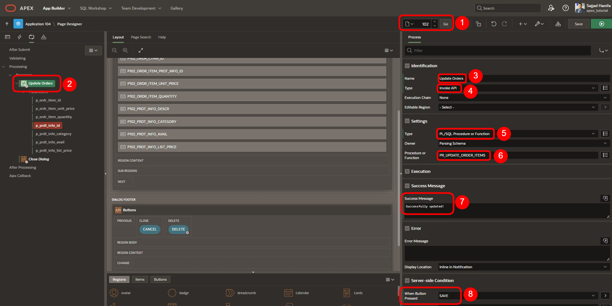
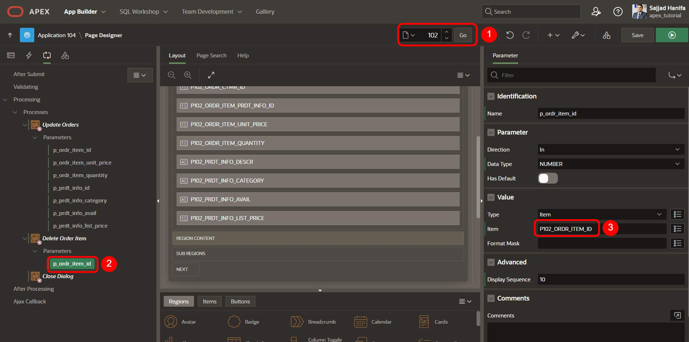
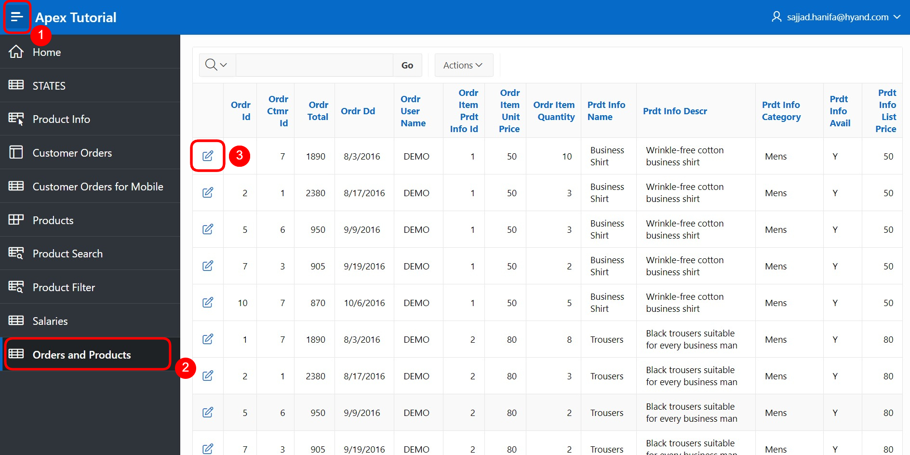
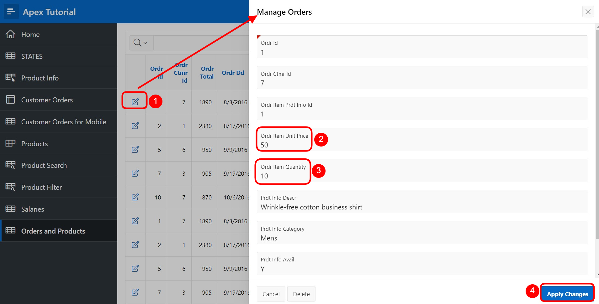

# 18. API Aufrufprozesse

API Aufrufprozesse ermöglicht die komplett deklarative Ausführung von Prozeduren und Funktionen, ohne einen PL/SQL-Code schreiben zu müssen. Prozeduren und Prozeduren können eigenständig oder Teil eines Packages sein. Page Designer legt Parameter automatisch vorab fest und ordnet sie entsprechenden Seitenelementen oder Spalten interaktiver Grids zu, wenn verfügbar. Ein Beispiel für einen API-Aufrufprozess ist auf der **Login Page** in der Anwendung zu sehen, wo der Prozess **Set Username Cookie** und der **Login**-Prozess den API-Aufrufprozess verwenden.

- Öffnen Sie den **App Builder**, wählen Sie Ihre Anwendung (siehe Kapitel 2) und die **Login Page**

- Klicken Sie auf die Registerkarte **Processing**, um die Prozesse mit dem Typ **Invoke API** anzusehen.

  

In dieser Aufgabe wird ein Prozedur angelegt, um die oben genannten Funktionen nutzen zu können.

## 18.1. Erstellung der benötigten Objekte 

Für diese Aufgabe muss zuerst eine **Prozedur** und eine **View** erstellt werden.

### 18.1.1. Erstellung der View 

- Für die Bearbeitung dieser Aufgabe wird eine **View** benötigt. 

- Geben Sie Ihrer **View** den Namen ***TUTO_P0101_VW***
  ```sql
  select o.ordr_id as order_id,
         o.ordr_ctmr_id as customer_id,
         o.ordr_total as order_total,
         o.ordr_dd as order_date,
         o.ordr_user_name as user_name,
         oi.ordr_item_id as order_item_id,
         oi.ordr_item_prdt_info_id as product_id,
         oi.ordr_item_unit_price as unit_price,
         oi.ordr_item_quantity as quantity,
         p.prdt_info_name as product_name,
         p.prdt_info_descr as product_description,
         p.prdt_info_category as category,
         p.prdt_info_avail as product_avail,
         p.prdt_info_list_price as list_price
    from order_items oi
    join product_info p
      on oi.ordr_item_prdt_info_id = p.prdt_info_id
    join orders o
      on oi.ordr_item_ordr_id = o.ordr_id
  ```
  
### 18.1.2. Erstellung der Prozedur 

  - Analog zur Erstellung einer **View** starten Sie den Assistenten zum Erstellen einer **Prozedur**. Öffnen Sie dazu das Dropdown-Menü über das + und klicken auf den Eintrag **Procedure**. Für weitere Informationen zur einer Prozedur finden Sie unter den folgenden Link: [https://docs.oracle.com/en/database/oracle/oracle-database/21/lnpls/CREATE-PROCEDURE-statement.html#GUID-5F84DB47-B5BE-4292-848F-756BF365EC54] (https://docs.oracle.com/en/database/oracle/oracle-database/21/lnpls/CREATE-PROCEDURE-statement.html#GUID-5F84DB47-B5BE-4292-848F-756BF365EC54)

  

  Es öffnet sich ein Assistent zur Erstellung der Prozedur.  
  Nun müssen Sie den entsprechenden Namen **PR_UPDATE_ORDER_ITEMS** sowie den **Return Data Type** als **VARCHAR2** für die Prozedur hinterlegen. Um eine einheitliche Benennung über verschiedene Anwendungen hinweg zu erzielen, empfiehlt sich die Verwendung von Namenskonventionen.

  In diesem Fall setzt sich die Bezeichnung der View wie folgt zusammen:  
  **PR_<FACHL.NAME>**

  

  - Klicken Sie dann auf den Button **Next**.

  - Geben Sie die folgenden Parameter ein:

  | | |  
  |--|--|
  | **Arugement Name** | **In/Out** |  **Argument Type** | 
  | *p_ordr_item_id* | *IN* | *NUMBER*| 
  | *p_ordr_item_unit_price* | *IN* | *NUMBER*| 
  | *p_ordr_item_quantity* | *IN* | *NUMBER*| 
  | *p_prdt_info_id* | *IN* | *NUMBER*| 
  | *p_prdt_info_category* | *IN* | *VARCHAR2*| 
  | *p_prdt_info_avail* | *IN* | *VARCHAR2*| 
  | *p_prdt_info_list_price* | *IN* | *NUMBER*| 

  

  - Legen Sie den entsprechenden Code hinter
  ```sql

  begin

  update order_items
     set ordr_item_unit_price   = p_ordr_item_unit_price
       , ordr_item_quantity     = p_ordr_item_quantity
   where ordr_item_id           = p_ordr_item_id;

   update product_info
      set prdt_info_category    = p_prdt_info_category
        , prdt_info_avail       = p_prdt_info_avail
        , prdt_info_list_price  = p_prdt_info_list_price
    where prdt_info_id          = p_prdt_info_id;

  end;

  ```

  

  - Klicken Sie dann auf den Button **Next** und anschließend klicken Sie auf **Create Procedure**.

  - Erstellen Sie eine weitere Prozedur **PR_DELETE_ORDER_ITEMS** mit **Return Data Type** als **VARCHAR2**.
  
  - Geben Sie die folgenden Parameter ein:

  | | |  
  |--|--|
  | **Arugement Name** | **In/Out** |  **Argument Type** | 
  | *p_ordr_item_id* | *IN* | *NUMBER*| 

  - Legen Sie den entsprechenden Code hinter
    ```sql

    begin
    
    delete 
      from order_items
     where ordr_item_id = p_ordr_item_id;

    end;

    ```

  - Klicken Sie dann auf den Button **Next** und anschließend klicken Sie auf **Create Procedure**.

## 18.2. API Aufrufprozesse verwenden

  - Um die API Aufrufprozesse zu verwenden, erstellen Sie eine editierbare Seite.

  - In der **App Builder** klicken Sie auf **Create Page** .
  - Wählen Sie den Seitentypen **Component** aus.
  - Wählen Sie den Bereichstypen **Interactive Report** aus.

    

  - Geben Sie als **Page Number 101** ein und als **Page Name**: **Orders and Products**. 
  - Schalten Sie **Include Form Page** ein.
  - Geben Sie als **Form Page Number 102** ein und als **Form Page Name**: **Manage Orders** und **Form Page Mode Normal**.

  - Wählen Sie als **Data Source** die View **TUTO_P0101_VW**.

  - Unter **Navigation** schalten Sie **Use Breadcrumb** aus und dann klicken Sie auf **Next**.

    

  - Wählen Sie **ORDER_ITEM_ID** als Primärschlüssel und anschließend klicken Sie auf **Create Page**.

    
  
  - Wenn die Seite erstellt ist, löschen Sie den Button **Create**

    
  
  - Klicken Sie auf **Save** und navigieren Sie dann zu **Seite 102**

  - Entfernen Sie ebenfalls den Button **Create** auf **Seite 102**

  - Setzen Sie den Typ der folgenden Elemente auf **Hidden**:

    
  
  - Setzen Sie den **Read Only** Typ der folgenden Elemente auf **Always**: 

    
  
  - Entfernen Sie den Standardprozess und erstellen Sie 2 neue Prozesse unter **Proccesses**:

    
  
  - Ein Prozess mit den folgenden Einstellungen:

    
  
  - Page Designer legt Parameter automatisch vorab fest. Ordnen Sie jeden Parameter dem entsprechenden Element/Wert zu.

  | | |  
  |--|--|
  | **p_ordr_item_id** | *P102_ORDER_ITEM_ID*| 
  | **p_ordr_item_unit_price** | *P102_UNIT_PRICE*| 
  | **p_ordr_item_quantity** | *P102_QUANTITY*| 
  | **p_prdt_info_id** | *P102_PRODUCT_ID*| 
  | **p_prdt_info_category** | *P102_CATEGORY*| 
  | **p_prdt_info_avail** | *P102_PRODUCT_AVAIL*| 
  | **p_prdt_info_list_price** | *P102_LIST_PRICE*| 

    
  
  - Ein Prozess mit den folgenden Einstellungen:

    

  - Ordnen Sie den Parameter dem entsprechenden Element/Wert zu.

  | | |  
  |--|--|
  | **p_ordr_item_id** | *P102_ORDER_ITEM_ID*| 

    

  - Klicken Sie auf **Save** und führen Sie die Anwendung aus.

  - Navigieren Sie zur Seite **Orders and Products**. 
  - Wählen Sie ein **Order Item** aus.

    
  
  - Bearbeiten Sie die markierten Felder oder löschen Sie die ausgewählte **Order Item**

    

 
Herzlichen Glückwunsch!
Sie haben das Tutorial erfolgreich beendet.
Falls Sie noch mehr über APEX lernen wollen, schauen Sie doch mal auf unserem APEX Portal vorbei:

https://apex.mt-ag.com/from-zero-to-hero
