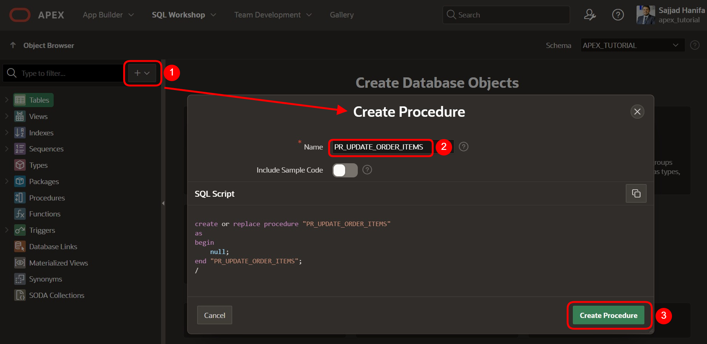
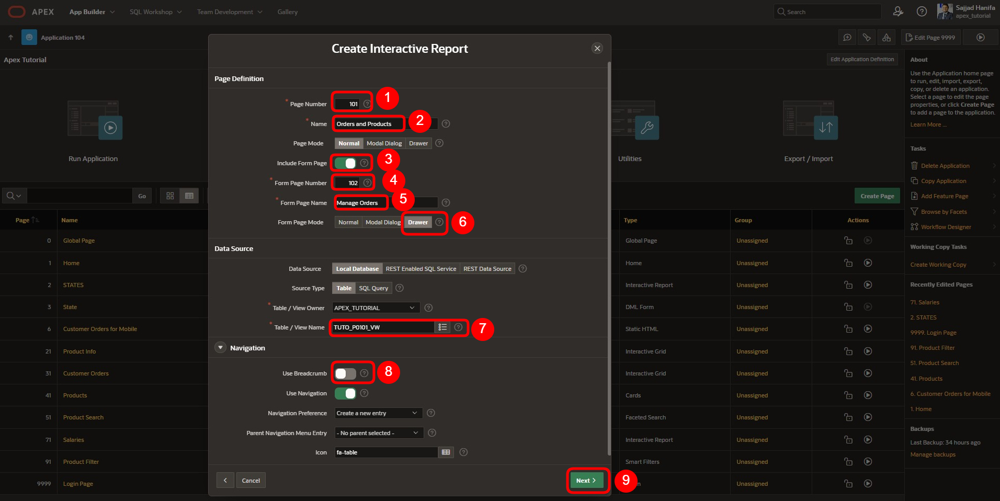
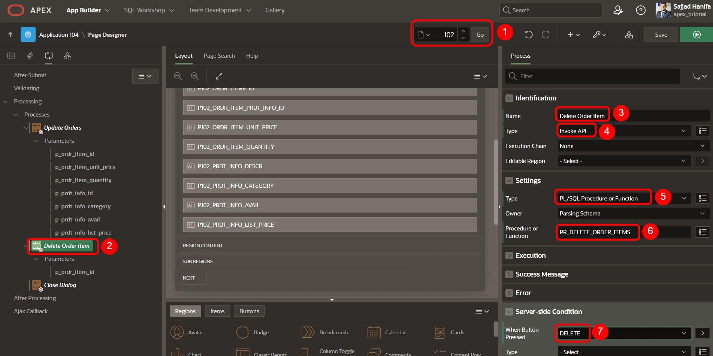

# <a name="invoke-api-process-type"></a>18. Invoke API Process Type

Der *Process Type* **Invoke API** ermöglicht die komplett deklarative Ausführung von Prozeduren und Funktionen, ohne PL/SQL-Code schreiben zu müssen. Prozeduren und Funktionen können eigenständig oder Teil eines Packages sein. Der **Page Designer** legt die Parameter automatisch vorab fest und ordnet sie den entsprechenden Seitenelementen oder Spalten interaktiver Grids zu, wenn verfügbar.  

Ein Beispiel für einen API-Aufrufprozess ist auf der **Login Page** in der Anwendung zu sehen, wo der Prozess **Set Username Cookie** und der **Login**-Prozess den API-Aufrufprozess verwenden.

- Öffnen Sie den **App Builder**, wählen Sie Ihre Anwendung (siehe Kapitel 2) und die **Login Page**

- Klicken Sie auf die Registerkarte **Processing**, um die Prozesse mit dem Typ **Invoke API** anzusehen.


In diesem Kapitel wird eine Prozedur angelegt, um die oben genannten Funktionen nutzen zu können.

## <a name="api-erstellung-der-benoetigten-objekte"></a>18.1 Erstellung der benötigten Objekte 

Für dieses Kapitel muss zuerst eine **Prozedur** und eine **View** erstellt werden.

### <a name="api-erstellung-der-view"></a>18.1.1 Erstellung der View 

- Für die Bearbeitung dieser Aufgabe wird eine **View** benötigt. 

- Geben Sie Ihrer **View** den Namen ***TUTO_P0101_VW***
  ```sql
  select o.ordr_id,
         o.ordr_ctmr_id,
         o.ordr_total,
         o.ordr_dd,
         o.ordr_user_name,
         oi.ordr_item_id,
         oi.ordr_item_prdt_info_id,
         oi.ordr_item_unit_price,
         oi.ordr_item_quantity,
         p.prdt_info_name,
         p.prdt_info_descr,
         p.prdt_info_category,
         p.prdt_info_avail,
         p.prdt_info_list_price
    from order_items oi
    join product_info p
      on oi.ordr_item_prdt_info_id = p.prdt_info_id
    join orders o
      on oi.ordr_item_ordr_id = o.ordr_id
  ```
  
### <a name="api-erstellung-der-prozedur"></a>18.1.2 Erstellung der Prozedur 

- Analog zur Erstellung einer **View** starten Sie den Assistenten zum Erstellen einer **Prozedur**. Öffnen Sie dazu das Dropdown-Menü über das **+** und klicken auf den Eintrag **Procedure**.  
  
> Weitere Informationen zu einer Prozedur finden Sie unter dem folgenden Link:   
[Oracle Documentation CREATE PROCEDURE Statement](https://docs.oracle.com/en/database/oracle/oracle-database/21/lnpls/CREATE-PROCEDURE-statement.html#GUID-5F84DB47-B5BE-4292-848F-756BF365EC54)  
  


Es öffnet sich das Fenster zur Erstellung einer Prozedur.  
Geben Sie hier den entsprechenden Namen **PR_UPDATE_ORDER_ITEMS** ein. Um eine einheitliche Benennung über verschiedene Anwendungen hinweg zu erzielen, empfiehlt sich die Verwendung von Namenskonventionen.

In diesem Fall setzt sich die Bezeichnung der View wie folgt zusammen:  
**PR_<FACHL.NAME>**



- Klicken Sie dann auf den Button **Create Procedure**.

- Fügen Sie im folgenden Fenster den Code für die Prozedur ein.
    ```sql
      create or replace procedure "PR_UPDATE_ORDER_ITEMS"
  ( p_ordr_item_id            IN  NUMBER, 
    p_ordr_item_unit_price    IN  NUMBER, 
    p_ordr_item_quantity      IN  NUMBER, 
    p_prdt_info_id            IN  NUMBER,
    p_prdt_info_category      IN  VARCHAR2, 
    p_prdt_info_avail         IN  VARCHAR2, 
    p_prdt_info_list_price    IN  NUMBER   
  )
  as
  begin

        update order_items
          set ordr_item_unit_price   = p_ordr_item_unit_price
            , ordr_item_quantity     = p_ordr_item_quantity
        where ordr_item_id           = p_ordr_item_id;
    
        update product_info
          set prdt_info_category    = p_prdt_info_category
            , prdt_info_avail       = p_prdt_info_avail
            , prdt_info_list_price  = p_prdt_info_list_price
        where prdt_info_id          = p_prdt_info_id;

  end "PR_UPDATE_ORDER_ITEMS";
  /
    ```


- Klicken Sie dann auf den Button **Save and Compile**. Es wir eine Meldung eingeblendet, dass die Prozedur erfolgreich kompiliert werden konnte.

- Erstellen Sie eine weitere Prozedur **PR_DELETE_ORDER_ITEMS** mit dem folgenden Code:

  ```sql
  create or replace procedure "PR_DELETE_ORDER_ITEMS"
  (
      p_ordr_item_id    IN  NUMBER
  )
  as
  begin
      delete 
        from order_items
        where ordr_item_id = p_ordr_item_id;
  end "PR_DELETE_ORDER_ITEMS";
  /
  ```

  

- Klicken Sie anschließend wieder auf **Save and Compile**.

## <a name="invoke-api-process-verwenden"></a>18.2 Invoke API Process verwenden

- Um einen Invoke API Process zu verwenden, erstellen Sie eine editierbare Seite.

- Im **App Builder** klicken Sie auf **Create Page** .
- Wählen Sie den Seitentypen **Component** aus.
- Wählen Sie den Bereichstypen **Interactive Report** aus.


- Geben Sie als **Page Number**: *101* ein und als **Page Name**: *Orders and Products*. 
- Schalten Sie **Include Form Page** ein.
- Geben Sie als **Form Page Number**: *102* ein und als **Form Page Name**: *Manage Orders* und **Form Page Mode**: *Normal*.

- Wählen Sie als **Data Source** die View **TUTO_P0101_VW**.

- Unter **Navigation** schalten Sie **Use Breadcrumb** aus und dann klicken Sie auf **Next**.



- Wählen Sie **ORDR_ITEM_ID** als Primärschlüssel und anschließend klicken Sie auf **Create Page**.


  
- Wenn die Seite erstellt ist, löschen Sie den Button **Create**


  
- Klicken Sie auf **Save** und navigieren Sie dann zu **Seite 102**

- Entfernen Sie ebenfalls den Button **Create** auf **Seite 102**

- Setzen Sie den Type der folgenden Elemente auf **Hidden**:


  
- Setzen Sie den **Read Only** Type der folgenden Elemente auf **Always**: 


  
- Entfernen Sie den Standardprozess und erstellen Sie zwei neue Prozesse unter **Proccessing**:


  
- Einen Prozess mit den folgenden Einstellungen (über die rechte Maustaste und **Create Process**):


  
- Der Page Designer legt die Parameter automatisch vorab fest. Prüfen Sie, ob jeden Parameter dem entsprechenden Element/Wert zugeordnet wurde.

  | | |  
  |--|--|
  | **p_ordr_item_id** | *P102_ORDR_ITEM_ID*| 
  | **p_ordr_item_unit_price** | *P102_ORDR_ITEM_UNIT_PRICE*| 
  | **p_ordr_item_quantity** | *P102_ORDRD_ITEM_QUANTITY*| 
  | **p_prdt_info_id** | *P102_ORDR_ITEM_PRDT_INFO_ID*| 
  | **p_prdt_info_category** | *P102_PRDT_INFO_CATEGORY*| 
  | **p_prdt_info_avail** | *P102_PRDT_INFO_AVAIL*| 
  | **p_prdt_info_list_price** | *P102_PRDT_INFO_LIST_PRICE*| 
  | | |


  
- Erstellen Sie einen zweiten Prozess mit den folgenden Einstellungen:



- Überprüfen Sie auch hier, ob der Parameter dem entsprechenden Element/Wert zugeordnet wurde.

  | | |  
  |--|--|
  | **p_ordr_item_id** | *P102_ORDR_ITEM_ID*| 
  | | |


- Klicken Sie auf **Save** und führen Sie von Seite 101 aus die Anwendung aus.

- Navigieren Sie zur Seite **Orders and Products**. 
- Wählen Sie ein **Order Item** aus.


  
- Bearbeiten Sie die markierten Felder oder löschen Sie das ausgewählte **Order Item**  


