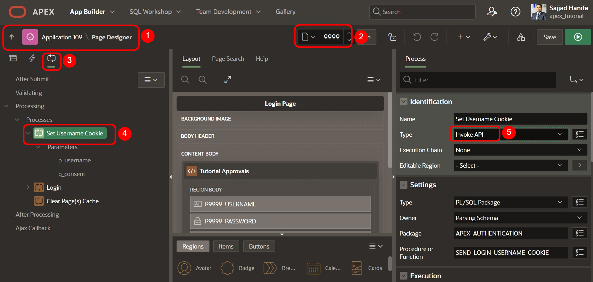
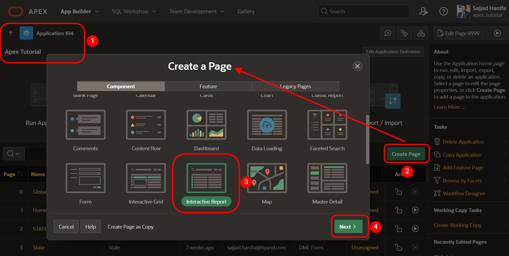
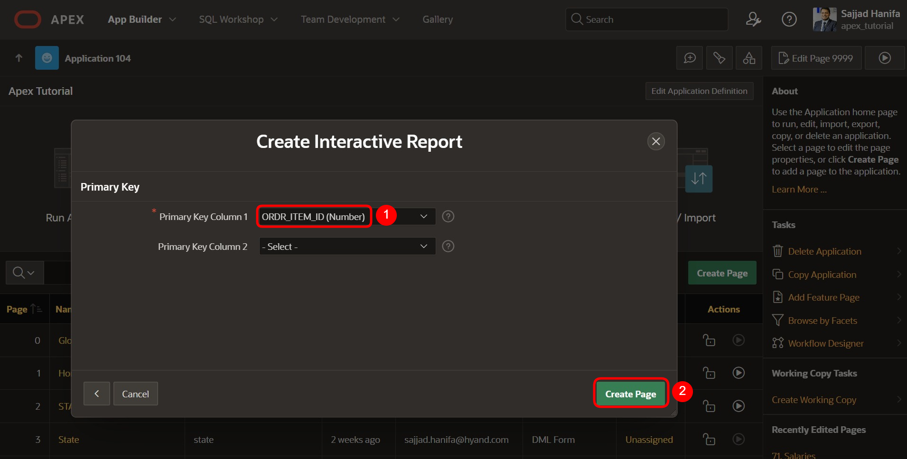

# 19. Template Compnents

**Template Components** sind ein neuer Plug-In-Typ in APEX. Sie ermöglichen es Ihnen, eine HTML-Vorlage (mit oder ohne zusätzliches CSS und JavaScript) zu definieren und Platzhalter zu verwenden. Sie sind viel einfacher zu verwenden als ein vollständiges Regions-Plug-In, bei dem Sie keine tiefgreifenden Kenntnisse der Plug-In-APIs benötigen.

Auf jeder Seite können Sie dann einen Bereich dieses Plug-In-Typs erstellen, eine Abfrage platzieren und dann eine Instanz dieser Vorlage erhalten, die mit den Daten für jede zurückgegebene Zeile gefüllt wird. Sie können auch eine einzelne Instanz in einer Region rendern oder sie sogar in Spalten interaktiver Berichte verwenden.


- Öffnen Sie den **Shared Components**, klicken sie auf **Plug-ins** und anschlißend auf **create**



In diesem Kapitel wird eine Prozedur angelegt, um die oben genannten Funktionen nutzen zu können.

## 18.1. Erstellung der benötigten Objekte 

Für dieses Kapitel muss zuerst eine **Prozedur** und eine **View** erstellt werden.

### 18.1.1. Erstellung der View 

- Für die Bearbeitung dieser Aufgabe wird eine **View** benötigt. 

- Geben Sie Ihrer **View** den Namen ***TUTO_P0101_VW***
  ```sql
  select o.ordr_id as order_id,
         o.ordr_ctmr_id as customer_id,
         o.ordr_total as order_total,
         o.ordr_dd as order_date,
         o.ordr_user_name as user_name,
         oi.ordr_item_id as order_item_id,
         oi.ordr_item_prdt_info_id as product_id,
         oi.ordr_item_unit_price as unit_price,
         oi.ordr_item_quantity as quantity,
         p.prdt_info_name as product_name,
         p.prdt_info_descr as product_description,
         p.prdt_info_category as category,
         p.prdt_info_avail as product_avail,
         p.prdt_info_list_price as list_price
    from order_items oi
    join product_info p
      on oi.ordr_item_prdt_info_id = p.prdt_info_id
    join orders o
      on oi.ordr_item_ordr_id = o.ordr_id
  ```
  
### 18.1.2. Erstellung der Prozedur 

- Analog zur Erstellung einer **View** starten Sie den Assistenten zum Erstellen einer **Prozedur**. Öffnen Sie dazu das Dropdown-Menü über das **+** und klicken auf den Eintrag **Procedure**.  
  
> Weitere Informationen zu einer Prozedur finden Sie unter dem folgenden Link:   
[Oracle Documentation CREATE PROCEDURE Statement](https://docs.oracle.com/en/database/oracle/oracle-database/21/lnpls/CREATE-PROCEDURE-statement.html#GUID-5F84DB47-B5BE-4292-848F-756BF365EC54)  
  


Es öffnet sich ein Assistent zur Erstellung der Prozedur.  
Nun müssen Sie den entsprechenden Namen **PR_UPDATE_ORDER_ITEMS** sowie den **Return Data Type** als **VARCHAR2** für die Prozedur hinterlegen. Um eine einheitliche Benennung über verschiedene Anwendungen hinweg zu erzielen, empfiehlt sich die Verwendung von Namenskonventionen.

In diesem Fall setzt sich die Bezeichnung der View wie folgt zusammen:  
**PR_<FACHL.NAME>**


- Klicken Sie dann auf den Button **Next**.

- Geben Sie die folgenden Parameter ein:

  | | | |
  |--|--|--|
  | **Argument Name** | **In/Out** |  **Argument Type** | 
  | *p_ordr_item_id* | *IN* | *NUMBER*| 
  | *p_ordr_item_unit_price* | *IN* | *NUMBER*| 
  | *p_ordr_item_quantity* | *IN* | *NUMBER*| 
  | *p_prdt_info_id* | *IN* | *NUMBER*| 
  | *p_prdt_info_category* | *IN* | *VARCHAR2*| 
  | *p_prdt_info_avail* | *IN* | *VARCHAR2*| 
  | *p_prdt_info_list_price* | *IN* | *NUMBER*| 
  | | |


- Fügen Sie den entsprechenden Code ein.
    ```sql
    begin
  
      update order_items
        set ordr_item_unit_price   = p_ordr_item_unit_price
          , ordr_item_quantity     = p_ordr_item_quantity
      where ordr_item_id           = p_ordr_item_id;
  
      update product_info
        set prdt_info_category    = p_prdt_info_category
          , prdt_info_avail       = p_prdt_info_avail
          , prdt_info_list_price  = p_prdt_info_list_price
      where prdt_info_id          = p_prdt_info_id;
  
    end;
    ```


- Klicken Sie dann auf den Button **Next** und anschließend auf **Create Procedure**.

- Erstellen Sie eine weitere Prozedur **PR_DELETE_ORDER_ITEMS** mit **Return Data Type** als **VARCHAR2**.

- Geben Sie die folgenden Parameter ein:

  | | | |
  |--|--|--|
  | **Argument Name** | **In/Out** |  **Argument Type** | 
  | *p_ordr_item_id* | *IN* | *NUMBER*| 
  | | |

- Hinterlegen Sie den entsprechenden Code.
  ```sql
  begin
    delete 
      from order_items
      where ordr_item_id = p_ordr_item_id;
  end;
  ```

- Klicken Sie dann auf den Button **Next** und anschließend auf **Create Procedure**.  

## 18.2. Invoke API Process verwenden

- Um einen Invoke API Process zu verwenden, erstellen Sie eine editierbare Seite.

- Im **App Builder** klicken Sie auf **Create Page** .
- Wählen Sie den Seitentypen **Component** aus.
- Wählen Sie den Bereichstypen **Interactive Report** aus.



- Geben Sie als **Page Number**: *101* ein und als **Page Name**: *Orders and Products*. 
- Schalten Sie **Include Form Page** ein.
- Geben Sie als **Form Page Number**: *102* ein und als **Form Page Name**: *Manage Orders* und **Form Page Mode**: *Normal*.

- Wählen Sie als **Data Source** die View **TUTO_P0101_VW**.

- Unter **Navigation** schalten Sie **Use Breadcrumb** aus und dann klicken Sie auf **Next**.


- Wählen Sie **ORDER_ITEM_ID** als Primärschlüssel und anschließend klicken Sie auf **Create Page**.


  
- Wenn die Seite erstellt ist, löschen Sie den Button **Create**


  
- Klicken Sie auf **Save** und navigieren Sie dann zu **Seite 102**

- Entfernen Sie ebenfalls den Button **Create** auf **Seite 102**

- Setzen Sie den Type der folgenden Elemente auf **Hidden**:


  
- Setzen Sie den **Read Only** Type der folgenden Elemente auf **Always**: 


  
- Entfernen Sie den Standardprozess und erstellen Sie zwei neue Prozesse unter **Proccesses**:


  
- Ein Prozess mit den folgenden Einstellungen:


  
- Der Page Designer legt die Parameter automatisch vorab fest. Ordnen Sie jeden Parameter dem entsprechenden Element/Wert zu.

  | | |  
  |--|--|
  | **p_ordr_item_id** | *P102_ORDER_ITEM_ID*| 
  | **p_ordr_item_unit_price** | *P102_UNIT_PRICE*| 
  | **p_ordr_item_quantity** | *P102_QUANTITY*| 
  | **p_prdt_info_id** | *P102_PRODUCT_ID*| 
  | **p_prdt_info_category** | *P102_CATEGORY*| 
  | **p_prdt_info_avail** | *P102_PRODUCT_AVAIL*| 
  | **p_prdt_info_list_price** | *P102_LIST_PRICE*| 
  | | |


  
- Erstellen Sie einen Prozess mit den folgenden Einstellungen:


- Ordnen Sie den Parameter dem entsprechenden Element/Wert zu.

  | | |  
  |--|--|
  | **p_ordr_item_id** | *P102_ORDER_ITEM_ID*| 
  | | |


- Klicken Sie auf **Save** und führen Sie die Anwendung aus.

- Navigieren Sie zur Seite **Orders and Products**. 
- Wählen Sie ein **Order Item** aus.


  
- Bearbeiten Sie die markierten Felder oder löschen Sie das ausgewählte **Order Item**  

  

    
<br><br>
Herzlichen Glückwunsch!  
Sie haben das Tutorial erfolgreich beendet.  
Falls Sie noch mehr über APEX lernen wollen, schauen Sie doch mal auf unserem APEX Portal vorbei:  
[apex.mt-itsolutions.com/from-zero-to-hero](https://apex.mt-itsolutions.com/from-zero-to-hero)
