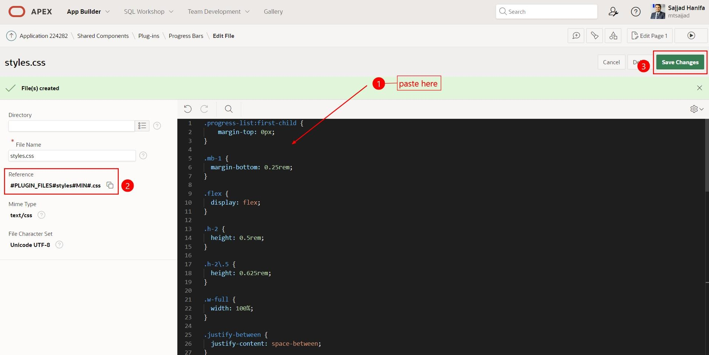

# 19. Template Components

**Template Components** sind ein neuer Plug-In-Typ in APEX. Sie ermöglichen es Ihnen, eine HTML-Vorlage (mit oder ohne zusätzliches CSS und JavaScript) zu definieren und Platzhalter zu verwenden. Sie sind viel einfacher zu verwenden als ein vollständiges Regions-Plug-In, bei dem Sie keine tiefgreifenden Kenntnisse der Plug-In-APIs benötigen.

Auf jeder Seite können Sie dann einen Bereich dieses Plug-In-Typs erstellen, eine Abfrage platzieren und dann eine Instanz dieser Vorlage erhalten, die mit den Daten für jede zurückgegebene Zeile gefüllt wird. Sie können auch eine einzelne Instanz in einer Region rendern oder sie sogar in Spalten interaktiver Berichte verwenden.

## 19.1. Erstellung eines "Template Components" (APEX Plugin) 

1. Öffnen Sie den **Shared Components**, klicken sie auf **Plug-ins** und anschlißend auf **create**


2. Klicken sie auf **Next**


3. Geben Sie die Werte wie folgt ein:

| | | |
|--|--|--|
| **Field Name** | **Value** |
| Name | Progress Bars | 
| Internal Name | PROGRESS_BARS | 
| Type | Template Components | 
| Available as Single | Checkbox: YES | 
| Available as Multiple | Checkbox: YES | 
| | |

Abschlißend drücken Sie auf **Create Plug-in** Button


4. Im nächsten Schritt fügen Sie folgenden code in **Partial**, **Report Body** und **Report Row** an den entsprechenden stellen gemäß Screenshot ein. Abschlißend drücken Sie auf **Create Plug-in** Button.


Fügen Sie den HTML-Code im **Partial** ein
   ```html
    {if APEX$IS_LAZY_LOADING/}
       <p>loading...</p>
    {else/}
       <div class="mb-1 flex justify-between">
         <span class="text-base font-medium">#SKILL#</span>
         <span class="text-sm font-medium">#PCT#%</span>
       </div>
   
       <div class="h-2.5 w-full rounded-full bg-gray-200 ">
          <div class="h-2.5 rounded-full bg-blue-600" style="width: #PCT#%; background: {if COLOR_INDEX%assigned/}var(--u-color-#COLOR_INDEX#);{else/}var(--u-color-1);{endif/}">
          </div>
       </div>
   {endif/}
  ```

Fügen Sie den HTML-Code im **Report Body** ein

   ```html
    <div class="progress-list">#APEX$ROWS#</div>
  ```
Fügen Sie den HTML-Code im **Report Row** ein

   ```html
    <div #APEX$ROW_IDENTIFICATION# style="margin-top: 1lh;">#APEX$PARTIAL#</div>
  ```

5. Sie haben den **Progress Bars** Plugin Erfolgreich erstellt. Klicken auf den Plugin-Namen **Progress Bars** um weiter zu bearbeiten.


6. Im nächsten Schritt scrollen runter zum punkt **Custom Attributes** und löschen sie alle vorhandenen attribute und klicken sie auf **Synchronize from Templates**. 


7. Nun sollten nur 3 Attribute zu sehen sein. Klicken sie auf dem ersten Attribute **Color Index**


8. Geben Sie die Werte für die 3 Attribute wie folgt ein und drücken auf **Apply Changes**.

| | | |
|--|--|--|
| **Color Index** | **Value** |
| Static ID | COLOR_INDEX | 
| Required | YES | 
| Data Types | Number |  
| | |

| | | |
|--|--|--|
| **Pct** | **Value** |
| Static ID | PCT | 
| Required | YES | 
| Data Types | Number |  
| | |

| | | |
|--|--|--|
| **Skill** | **Value** |
| Static ID | SKILL | 
| Required | YES | 
| Data Types | Varchar2 |  
| | |

9. Im nächsten Schrtt wird eine **CSS Datei** erstellt.


10. Die **CSS Datei** wir mit folgendem Namen erstellt.

| | | |
|--|--|--|
| **Input-Field** | **Value** |
| File Name | styles.css |   
| | |


11. Kopieren Sie den unten stehenden **CSS Code** und fügen sie den in APEX ein. Notieren sie am ende den **Reference** Link, den brauchen wie gleich.



   ```css
.progress-list:first-child {
    margin-top: 0px;
}

.mb-1 {
  margin-bottom: 0.25rem;
}

.flex {
  display: flex;
}

.h-2 {
  height: 0.5rem;
}

.h-2\.5 {
  height: 0.625rem;
}

.w-full {
  width: 100%;
}

.justify-between {
  justify-content: space-between;
}

.rounded-full {
  border-radius: 9999px;
}

.bg-blue-600 {
  --tw-bg-opacity: 1;
  background-color: rgb(37 99 235 / var(--tw-bg-opacity));
}

.bg-gray-200 {
  --tw-bg-opacity: 1;
  background-color: rgb(229 231 235 / var(--tw-bg-opacity));
}

.text-base {
  font-size: 1rem;
  line-height: 1.5rem;
}

.text-sm {
  font-size: 0.875rem;
  line-height: 1.25rem;
}

.font-medium {
  font-weight: 500;
}

.text-blue-700 {
  --tw-text-opacity: 1;
  color: rgb(29 78 216 / var(--tw-text-opacity));
}

  ```

12. Den kopierten **Reference** Link, wie im Screenshot an der passenden stelle einfügen und speichern.


Bis zu diesem Schritt wurde der **Plug-in** Erfolgreich erstellt.

13. Im nächsten schritt wird eine neue APEX-Seite mit dem Plugin erstellt.


14. Die Neue Seite wie folgt erstellen und auf **create Page** klicken:

| | | |
|--|--|--|
| **Field** | **Value** |
| Page Number | 120 | 
| Name | Progress Bars | 
| Use Breadcrumb | Disable |  
| Icon | fa-bar-chart-horizontal |  
| | |


15. Erstellen Sie auf der Seite eine neue Region mit dem Title: **Progress Bars**. Anschließend wählen sie bei Type das zuvor erstellte Plug-in: **Progress Bars**.


16. Anschließend wählen Sie **SQL Query** als Type aus und fügen sie den unten stehenden SQL-Code im **SQL-Query** ein. Wechseln sie anschließend zum Reiter **Attributes**


   ```sql
WITH web_programming_languages AS (
  SELECT 'JavaScript'   AS language_name FROM DUAL
  UNION ALL
  SELECT 'SQL'          AS language_name FROM DUAL
  UNION ALL
  SELECT 'PL/SQL'       AS language_name FROM DUAL
  UNION ALL
  SELECT 'Python'       AS language_name FROM DUAL
  UNION ALL
  SELECT 'Java'         AS language_name FROM DUAL
  UNION ALL
  SELECT 'C#'           AS language_name FROM DUAL
  UNION ALL
  SELECT 'PHP'          AS language_name FROM DUAL
  UNION ALL
  SELECT 'Ruby'         AS language_name FROM DUAL
  UNION ALL
  SELECT 'TypeScript'   AS language_name FROM DUAL
  UNION ALL
  SELECT 'Swift'        AS language_name FROM DUAL 
)
SELECT language_name                        as SKILLS
     , FLOOR(DBMS_RANDOM.VALUE(0, 100))     as PCT
     , FLOOR(DBMS_RANDOM.VALUE(0, 45))      as COLOR_INDEX
  FROM web_programming_languages
;
  ```

17. Im Reiter **Attributes** passen Sie die Werte wie folgt an:

| | | |
|--|--|--|
| **Field** | **Value** |
| Display | Multiple (Report) | 
| Color Index | COLOR_INDEX | 
| Pct | PCT |  
| Skill | SKILLS |  
| | |


18. Abschließend wird hier nur noch ein Button erstellt und die APEX Seite gespeichert.

Erstellen Sie button mit folgenden Einstellungen:

| | | |
|--|--|--|
| **Field** | **Value** |
| Button Name | P120_REFRESH_PAGE | 
| Label | Refresh Page | 
|   |  
| Region | Progress Bars |  
| Position | Next |  
|   |  
| Button Template | Text with Icon |  
| icon | fa-refresh |  
|   |  
| Action | Submit Page |  
| | |

Klicken Sie auf **Template Options**

| | | |
|--|--|--|
| **Field** | **Value** |
| Type | success | 
| Icon Hover Animation | Push | 
| Width | Stretch |   
| | |


19. Abschließend sieht die Seite wie folgt aus. Drücken Sie auf den Refresh Button, um **Zufällige** Werte neu zuladen.


<br><br>
Herzlichen Glückwunsch! :)
Sie haben das Tutorial erfolgreich beendet.  
Falls Sie noch mehr über APEX lernen wollen, schauen Sie doch mal auf unserem APEX Portal vorbei:  
[apex.mt-itsolutions.com/from-zero-to-hero](https://apex.mt-itsolutions.com/from-zero-to-hero)
