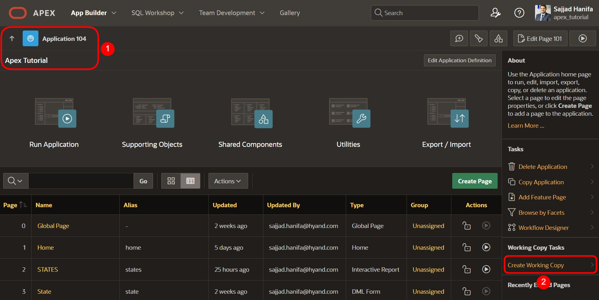
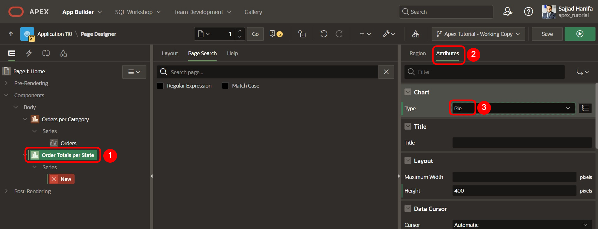
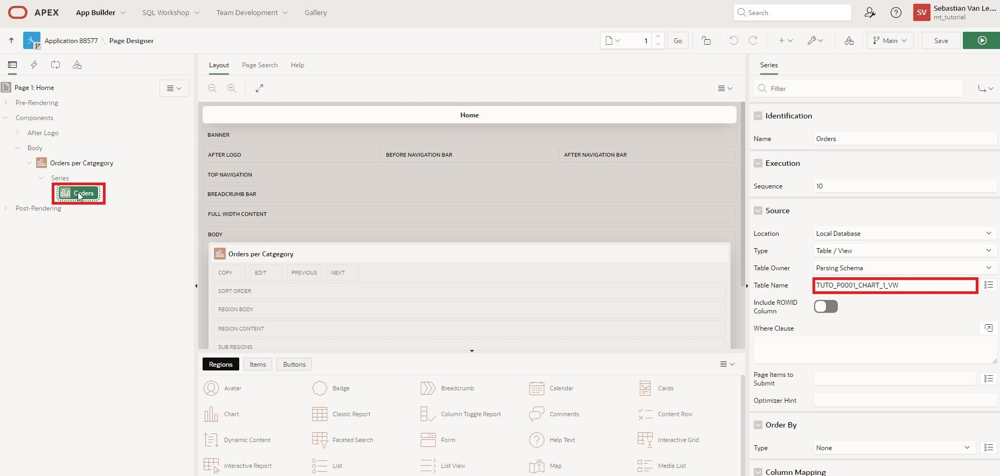

# <a name="working-copy"></a>20. Working Copy

Mit APEX 23.2 hat ein neues kollaboratives Feature Einzug in APEX erhalten - die Working Copy. Mit der Working Copy kann eine Arbeitskopie einer App erstellt werden, an der weiterentwickelt werden kann, während die Hauptversion der App davon unberührt bleibt. Wenn Sie bereits mit anderen Versionsverwaltungen gearbeitet haben, dann wird Ihnen Vieles in diesem Kapitel vertraut vorkommen.

## <a name="arbeitskopie-erstellen"></a>20.1 Arbeitskopie erstellen

Als Ausgangspunkt für die Aufgabe in diesem Kapitel nehmen wir an, dass die Startseite unserer APP überarbeitet werden soll. Konkret geht es um eine weitere Chart zur Summe der Bestellungen aufgeschlüsselt nach Staaten. Die Entwicklung soll jedoch in einem komplett eigenständigen **Branch** geschehen. Deshalb wird eine Arbeitskopie angelegt, in der das Feature (im Team) entwickelt werden kann.   

- Erstellen Sie dazu zunächst eine Working Copy mit dem Befehl **Create Working Copy** im App Builder.



- Geben Sie der Arbeitskopie den Namen **Working Copy Tutorial 24.1** und fügen Sie eine Beschreibung hinzu.  


- Die Working Copy wird erstellt. Beachten Sie, dass Sie einige neue Optionen und Informationen im App Builder eingeblendet bekommen.
 Nach der Bereitstellung wechseln Sie automatisch in die Arbeitskopie. Durch die Markierung im App Builder sehen Sie, dass Sie sich in der Arbeitskopie befinden. 


## <a name="arbeitsaufgabe-erledigen"></a>20.2 Arbeitsaufgabe erledigen

- Im nächsten Schritt geht es an die eigentliche Arbeitsaufgabe. Dazu benötigen wir eine weitere **View**.

- Geben Sie Ihrer **View** den Namen ***TUTO_P0001_CHART_2_VW***:  
  Query:  
  ```sql
  select sum(ordr_total) as total,
         stts_state_name
    from orders
    join customers
      on ordr_ctmr_id = ctmr_id
    join states 
      on stts_st = ctmr_state
    group by stts_state_name
    order by stts_state_name;
  ```
- Legen Sie auf Seite 1 der Anwendung eine neue **Region** an. 


- Nutzen Sie die folgenden Einstellungen in der neuen Region:

  | | |  
  |--|--|
  | **Title** | *Order Totals per State* | 
  | **Type** | *Chart*|
  | **Source** | *Local Database*|
  | **Table Name** | *TUTO_P0001_CHART_2_VW*|  
  | | |


- Unter **Attributes** und **Type** wählen Sie **Pie**.



- Wählen Sie jetzt die **Series**. Hier können Sie den Namen **Totals** verwenden. Auch hier verwenden Sie dieselbe **Source**.


- Im **Column Maping** wählen Sie als Label die Spalte **STTS_STATE_NAME** und für die Wertespalte **TOTAL**.


- Wenn Sie die Seite nun speichern und ausführen, sehen Sie das neu hinzugefügte Tortendiagramm.

## <a name="vergleich-zwischen-branch-und-main"></a>20.3 Vergleich zwischen Branch und Main


- Kehren Sie zurück auf die Üersichsseite in den App Builder. Im Menü **Tutorial 24.1 Working Copy** können Sie unter dem Punkt **Compare Changes** einen Vergleich zwischen der Hauptversion und der Arbeitsversion durchführen.


- Wählen Sie diesen Punkt und warten kurz, bis der Vergleich erstellt wird.


- Sie sehen eine Liste der Unterschiede zwischen der Arbeitskopie und der Hauptversion. Unter dem Punkt **Diff** können Sie jeweils detaillierter aufschlüsseln, wo die Unterschiede zwischen den Versionen liegen.


- Die grün markierten Änderungen sind gegenüber der Ausgangsversion hinzugefügt. Anhand des Codes ist erkennbar, dass es sich hierbei um die eben erstellte Region auf der Seite handelt.


- Beachten Sie auch, dass die angelegte View keinen Unterschied zwischen den Versionen augelöst hat, sie steht beiden Apps zur Verfügung. Es werden nur Änderungen in der App berücksichtigt.

## <a name="aenderung-in-main"></a>20.4 Änderung in Main

- Schließen Sie die Darstellung und wechseln Sie von der Working Copy in die **Hauptversion der App**. 


- Wir arbeiten in **Main** weiter und schauen uns jetzt kurz an, was passiert, wenn Sie - oder jemand anderers - Änderungen auf derselben Seite in der Hauptversion der App vornimmt, während an der Arbeitskopie gearbeitet wurde. 

- Erstellen Sie dazu zunächst eine **Kopie der View TUTO_P0001_VW**, die Sie **TUTO_P0001_CHART_1_VW** nennen. Der Code der View bleibt ansonsten unverändert. 

- Gehen Sie nun auf Seite 1 der App und ändern die Quelle der der Region-Series **Orders** auf die eben erstellte View **TUTO_P0001_CHART_1_VW**. 



- Speichern Sie die Seite und wechseln dann wieder zurück in die Arbeitskopie.


- Nehmen wir nun an, dass die Arbeiten an der Kopie damit erfolgreich erledigt sind und die Version mit der Hauptversion der App zusammengeführt werden kann. Dazu führen Sie als nächstes einen **Merge into Main** der Arbeitskopie und der Hauptversion durch.


- Sie gelangen zu dem bekannten Vergleich der Versionen. Öffnen Sie **Diff** den Versionsvergleich. 


- Im Vergleich sehen Sie, dass nicht nur die Änderungen in der Working Copy aufgeführt sind, sondern auch die neue Quelle der Series **Order** im linken Teil des Vergleichs.


- Kehren Sie auf den Merge-Bildschirm zurück und klicken Sie auf **Next**. Achten Sie darauf, dass die Änderungen, die übernommen werden sollen ausgewählt sind. In diesem Fall nehmen wir alle Änderungen in den Merge.


- Im nächsten Dialog können Sie sicherstellen, dass Ihre Änderungen durch den Merge mit einem **Backup target App first** wieder rückgängig gemacht werden können. Klicken Sie dann auf **Cofirm Merge**. 


- Sie Sollten eine Erfolgsmeldung erhalten, wenn der Merge durchgeführt wurde.


- Wechseln Sie in der Hauptversion der App auf Seite 1. In der Series **Orders** sehen Sie unter **Table Name** nun, dass die Änderung in der Hauptversion durch den Merge wieder durch die Inhalte der Working Copy überschrieben wurde. 


- Um dies zu verhindern, können Änderungen aus der Hauptversion einer Arbeitskopie zunächst auf den neuesten Stand gebracht werden. Dies geschieht im Arbeitskopie-Menü durch einen **Refresh Working Copy**. 

- Wiederholen Sie dazu zunächst den Arbeitsschritt auf Seite 1 der App und ändern Sie im **Main** die Quelle der der Region-Series **Orders** wieder auf die View **TUTO_P0001_CHART_1_VW**. Wechseln Sie in die Working Copy und lösen eine Aktualisierung aus.


- Sie gelangen zum Refresh-Dialog und können sich hier wieder die Unterschiede zwischen den Versionen anschauen.


- Dieses Mal befindet sich die Hauptversion auf der rechten Seite der geteilten Ansicht, die Änderung der Quelle wird grün angezeigt.


- Schließen Sie die Ansicht und klicken Sie auf **Confirm Refresh**.


- Nachdem die Arbeitskopie auf den Stand der Arbeitsversion gebracht ist, sehen Sie auf Seite 1 der Anwendung in der Arbeitskopie, dass die Quelle der Series **Orders** nun die entsprechende View ist.


- Nachdem alle Arbeiten an der Working Copy abgeschlossen sind und die Versionen erfolgreich zusammengeführt wurden, kann eine Arbeitskopie in der Regel wieder gelöscht werden. Wählen Sie dazu im Menü der Arbeitskope den Punkt **Delete Working Copy** aus. 


- Im folgenden Dialog bestätigen Sie die Löschung der Arbeitskopie. 


- Sie haben damit das Kapitel zur Versionierungsmöglichkeit in APEX 24.1 - der **Working Copy** - erfolgreich abgeschlossen.