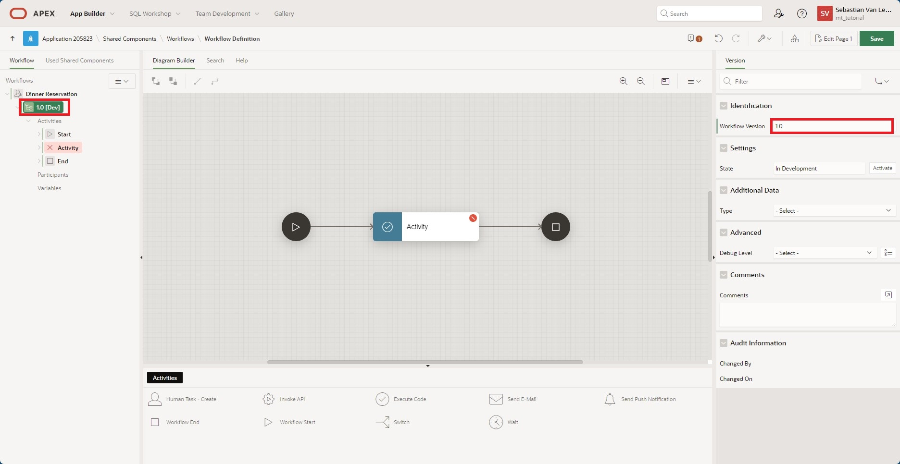
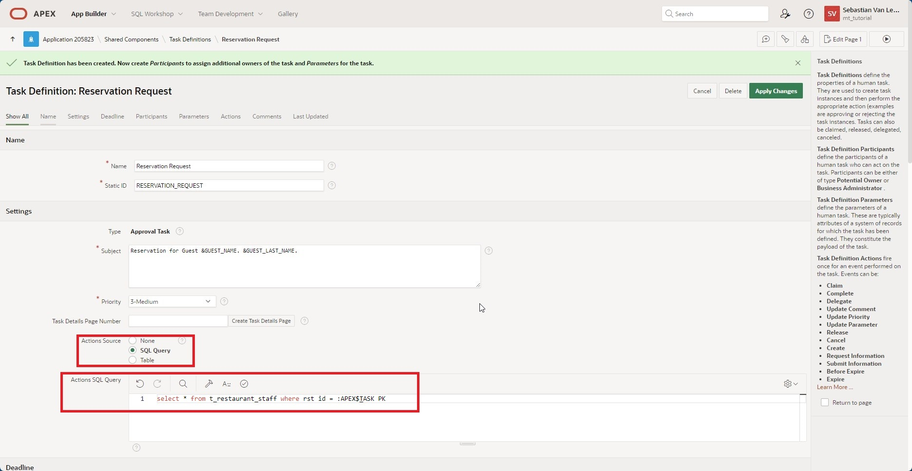
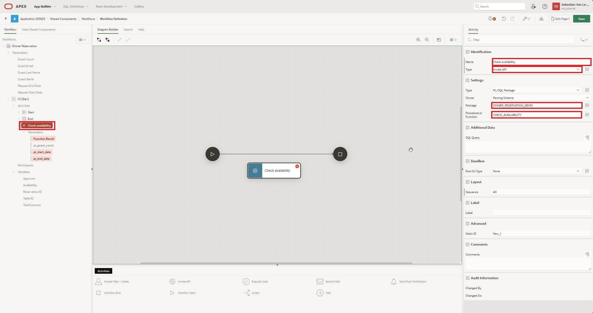
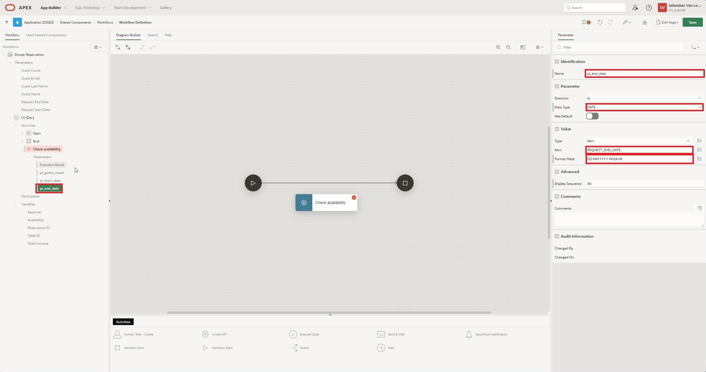

# 21. APEX Workflow

Mit APEX 23.2 werden Workflows direkt in APEX integriert. Mit **APEX Workflow** lassen sich Business-Prozesse mittels der grafischen Spezifikationssprache **Busines Process Model and Notation (BPMN)** darstellen und ausführen. Workflows basiert auf der Erweiterung **Flows for APEX** zu der Sie weitere Informationen unter dem Link https://flowsforapex.org/ erhalten. 

In dem folgenden Kapitel nutzen wir Workflows um eine Demoversion einer vereinfachten Reservierung eines Restauranttisches zu erstellen. Die Demo lehnt sich an den Blog-Beitrag **Simplify Business Process Management Using APEX Workflow** von Ananya Chatterjee an.

## 21.1. Ausgangspunkt Use Case und Flow-Chart

Als Ausgangspunkt für die Aufgabe in diesem Kapitel nehmen wir an, dass ein Restaurant ein einfaches Buchungsformular über die Website realisieren möchte. In dem Formular können Gäste eine Reservierungsanfrage für einen Tisch übermitteln. Es wird im nächsten Schritt zunächst vom System geprüft, ob zu dem gewünschten Zeitraum ein Tisch für die gewünschte Anzahl an Personen frei ist. Falls nicht, kommt es sofort zu einer E-Mail an den Gast mit einer Absage des Termins. Wenn ein Tisch frei ist, wird die Anfrage an einen Restaurant-Mitarbeitenden übergeben. Der Mitarbeitende entscheidet, ob die Reservierung angenommen wird. Wird sie abgelehnt, erfolgt wieder eine Absage per E-Mail, wird sie angenommen, wird die Reservierung gespeichert und der Gast über die erfolgreiche Reservierung per E-Mail informiert. 

- Im folgenden **Flow-Chart** wird dieser Use Case visualisiert.


## 21.2. Einrichtung der benötigten Elemente

- Installieren Sie die beigefügten Skripts **install_workflow_tables.sql**, **install_workflow_package_specification.sql** und **install_workflow_package_body.sql** über den **SQL Workshop** in APEX.

- Erstellen Sie dann eine neue APP über den **App Builder** und **Create**. Geben Sie der App den Titel **MT Tutorial - Dinner Reservation**. 


- Für die APP benötigen Sie einen Nutzer mit dem Namen **KOCH**, der später für die Bearbeitung der Reservierungsanfragen zuständig sein soll. Legen Sie einen entsprechenden Nutzer an.

- Klicken Sie dazu oben rechts auf das **Administration** Icon und wählen dort den Eintrag **Manage Users and Groups**.

- Klicken Sie hier auf **Create User**.

- Geben Sie hier folgendes ein:
  - Name: KOCH
  - Email Address: test@abc.com
  - Password: 12345678
  - Confirm Password: 12345678
  - Require Change of Password on First Use: No

## 21.3. Erstellen des Workflows

- Im nächsten Schritt geht es an die eigentliche Arbeitsaufgabe. Dazu erstellen wir zunächst einen **Workflow**.

- Wechseln Sie dazu wieder in den **Application Builder** der neuen App und klicken Sie auf **Shared Components**.


- In den Shared Components wählen Sie **Workflows** im Punkt **Workflows and Automations**. 


- Erstellen Sie hier einen neuen Workflow, indem Sie auf **Create** klicken. Sie werden anschließend zum **Workflow Editor** weitergeleitet. Ein erster Grundsätzlicher Workflow ist bereits mittig im **Diagram Builder** zu sehen.


- Setzen Sie den Namen des Workflows auf **Dinner Reservation** und die **Static ID** auf **DINNERRSVRT**. Den Title legen Sie fest auf: **Workflow for Guest &GUEST_NAME. &GUEST_LAST_NAME.**. 


- Legen Sie die **Workflow Version** auf **1.0** fest.



- Derzeit kommt es noch zu einem Fehler, weil die automatisch angelegte Aktivität noch nicht festgelegt wurde. Um Speichern zu können, löschen Sie die Aktivität. Klicken Sie dazu mit einem Rechtsklick auf die **Activity** in der linken Spalte und wählen Sie **Delete**. Alternativ können Sie auch die Aktivität im Editor auswählen und auf das Symbol mit den drei Punkten klicken. 


- Es bleiben der **Start der Aktivität**, der **Pfeil** und der **Endpunkt** übrig. Ziehen Sie die **Pfeilspitze** im Editor auf den **Endpunkt** und dann speichern Sie.


- Im nächsten Schritt erstellen Sie eine Reihe von **Input-Parametern**, die dem Wokflow als Daten bereitgestellt werden. Klicken Sie dazu mit rechts auf den Workflow und wählen Sie **Create Parameter**. 


- Geben Sie dem ersten Parameter die **Static ID: GUEST_NAME**, das **Label: Guest Name**. Es handelt sich dabei um den **Data Type: VARCHAR2**. 


- Legen Sie die folgenden weiteren Parameter an: 

  | | |  
  |--|--|
  | **GUEST_LAST_NAME** | *VARCHAR2*|
  | **GUEST_EMAIL** | *VARCHAR2* | 
  | **GUEST_COUNT** | *NUMBER*|  
  | **REQUEST_START_DATE** | *TIMESTAMP*|
  | **REQUEST_END_DATE** | *TIMESTAMP*|
  | | |

- Die Parameter **REQUEST_START_DATE** und **REQUEST_END_DATE** erhalten die Formatmaske **DD.MM.YYYY HH24:MI** unter **Session State Format Mask**.


- Nun verknüpfen Sie im Workflow 1.0 unter **Additional Data** die Tabelle **T_RESTAURANT_STAFF**. Dies stellt später sicher, dass die erstellen Aufgaben (Tasks) entsprechenden Bearbeitenden zugeordnet werden können. Daneben stehen dadurch die Spalten der Tabelle als Bindvariablen für den Workflow zur Verfügung. Wählen Sie als **Primary Key Column** die Spalte **ID**.


- Neben den Input-Parametern braucht brauchen Sie in dem Workflow auch veränderliche Variablen, die im Prozess genutzt werden können. Dazu erstellen Sie im nächsten Schritt **Workflow Variables**. Dazu rechtsklicken Sie wieder auf den Workflow 1.0 und wähle **Create Variable**.


- Geben Sie der erste Variable die **Static ID: RESERVATION_ID** und das **Label: Reservation ID**. Der **Data Type** ist **NUMBER**. Der Variable wird erst zu einem späteren Zeitpunkt ein Wert zugewiesen, der **Value** ist deshalb zunächst **Null**.


- Legen Sie die nun die Variable **TABLE_ID** nach dem gleichen Schema an: **Static ID: TABLE_ID**, **Label: Table ID** und **Data Type** ist **NUMBER**. Auch hier setzen Sie **Value** auf **Null**.


- Als nächste Variable erstellen Sie **AVAILABILITY**. Sie ist vom Typ **BOOLEAN**. Unter **True Value** tragen Sie **AVAIL** ein und unter **False Value** darunter **UNAVAIL**. Dies sind die beiden möglichen Rückgabewerte einer Funktion, die später in den Workflow eingebunden wird. Danach speichern Sie den Workflow üner **Save**.


- Im nächsten Schritt erstellen Sie den Task zu Bestätigung (oder Ablehnung) der Reservierungsanfrage. Wechseln Sie dazu in die **Shared Components** und zu den **Task Definitions**. Klicken Sie auf **Create** um einen neuen Task zu erstellen.


- Im Dialogfenster zum Erstellen der **Task Definition** geben Sie der Task den Namen **Reservation Request** und das **Subject: Reservation for Guest &GUEST_NAME. &GUEST_LAST_NAME.**. Die **Static ID** lautet **RESERVATION REQUEST**. Klicken Sie danach auf **Create**.


- Im nächsten Schritt setzen Sie die **Action Source** auf **SQL Query**. In das Feld für die Query tragen Sie die folgende Query ein:

```sql
  select * from t_restaurant_staff where id = :APEX$TASK_PK
  ```



- Erstellen Sie eine neue Zeile in der Tabelle **Participants**. Der **Participant Type** ist **Potential Owner**, der **Value Type** ist **Expression** und der **Value** ist **:NAME**. Dies bezieht sich auf die entsprechende Spalte in der Mitarbeitertabelle **T_RESTAURANT_STAFF** die dadurch jeweils Tasks bearbeiten dürfen.


- Auch für den Task werden **Parameter** bereitgestellt. Fügen Sie jeweils die folgenden Reihen zur Parameter-Tabelle hinzu:

  | | | |  
  |--|--|--|
  | **NAME_GUEST** | Name Guest | *String* |
  | **LAST_NAME_GUEST** | Last Name Guest | *String* | 
  | **COUNT_GUEST** | Count Guest | *String*|  
  | **RESERVATION_DATE_START** | Reservation Date Start | *String* |
  | **RESERVATION_DATE_END** | Reservation Date End | *String* |
  | | | |


- Bestätigen Sie die Ergänzungen an der Task über den Button **Apply Changes**.

- Im nächsten Schritt geht es mit der Arbeit am Workflow weiter. Wechseln Sie dafür wieder in die **Workflows** in den **Shared Components** und klicken Sie auf **Dinner Reservation**. 


- Erstellen Sie im **Workflow 1.0** unter **Activities** mit einem Rechtsklick eine neue Aktivität.


- Geben Sie der neuen Aktivität den Namen **Check Availability** und udn den Typ **Invoke API**. Wählen Sie das Package **DINNER_RESERVATION_DEMO** und daraus die Function **CHECK_AVAILABILITY**. 



- Das Ergebnis der Funktion übergeben Sie im Parameter **Function Result**, und zwar in **Item** über die **Version Variable** **Availability**. 


- Für die Paramater **pi_guest_count**, **pi_start_date** und **pi_end_date** legen Sie, unter **Value** auf Type **Item** und dann auf die folgenden **Workflow Parameters** und **Format Masks** fest:

  | | | |  
  |Parameter|Item|Format Mask|
  | **pi_guest_count** | GUEST_COUNT | |
  | **pi_start_date** | REQUEST_START_DATE | DD.MM.YYYY HH24:MI |
  | **pi_end_date** | REQUEST_END_DATE | DD.MM.YYYY HH24:MI |
  | | | |




- Verbinden Sie den Pfeil vom Start des Workflows mit der Aktivität.


- Um mit dem Ergebnis der Abfrage-Aktivität umzugehen, benötigen Sie nun einen **Switch**. Legen Sie einen an, z.B. indem Sie ihn in den Diagram Builder ziehen.


- Neuer **Name** des Switch wird **Decide availability**. Unter **Condition** wählen Sie den **Condition Type: Workflow Variable = Value** und die **Workflow Variable: AVAILABILTY** und den Wert **AVAIL**, den die Funktion ausgibt, wenn an dem gewünschten Datum ein Tisch für die gewünschte Anzahl von Personen frei ist.


- Verbinden Sie nun die beiden Aktivitäten **Check availability** und **Decide availability** miteinander. Über das Plus-Zeichen können Sie einen neuen Pfeil einzeichnen und mit der Zielaktivität verbinden.


- Es geht weiter mit dem ersten möglichen Ergebnis des Checks: Der Fall, der eintritt, wenn die ergeben hat, dass **kein Tisch** frei ist. In diesem Fall soll eine E-Mail verschickt werden, die dem Anfragenden mitteilt, dass kein Tisch frei ist. Legen Sie dazu eine **Send E-Mail Aktivität** an.


- Name dieser Aktivität wird **Send Mail unavailable**. Im **To-Feld** tragen Sie mit **&GUEST_EMAIL.** den Paramter mit der E-Mail des Gastes ein. In das Feld **Subject** kommt der E-Mail-Betreff. Setzen Sie es auf **Your reservation: No table available**. Tragen Sie den folgenden Mail-Text im Feld **Body Plain Text** ein: 

```
Dear &GUEST_NAME. &GUEST_LAST_NAME., 

unfortunately there is no table available at the requested time. Please try another time! 

With kind regards
The Restaurant Team
```


- Verbinden Sie den Switch per Pfeil mit der E-Mail-Aktivität. 


- Wählen Sie den Pfeil und geben Sie der Verbindung unter **Name** den Titel **Unavailable**. Die **Condition** ist in diesem Fall **FALSE**, da die Mail dann geschickt werden soll, wenn die Prüfung ergibt, dass kein Tisch vorhanden ist.


- Erstellen Sie ein weiteres **Workflow End** und verbinden es mit der Mail-Send-Activity. Danach können Sie den Workflow zwischenspeichern.


- Jetzt geht es weiter mit dem Fall, dass die erste Prüfung ergibt, dass ein Tisch frei ist. Für diesen Fall soll ein Mitarbeitender entscheiden, ob die Reservierung angenommen wird. Dazu erstellen Sie zunächst eine **Human Task - Create** Aktivität. Geben Sie der Aktivität den Namen **Create Reservation Request**, in **Definition** wählen Sie den eben erstellten Task **Reservation Request**. Für Outcome wählen Sie die automatisch über die Task erstellte **Variable** **TASK_OUTCOME** und in **Owner** die -ebenfalls automatisch erstellte - **Variable** **APPROVER**. 


- Als nächstes legen Sie die **Parameter** dieser Aktivität auf die folgenden Werte fest:

  | | | |  
  |Name|Type|Item|
  | **Count Guest** | Item | *GUEST_COUNT*|
  | **Last Name Guest** | Item | *GUEST_LAST_NAME*| 
  | **Name Guest** | Item | *GUEST_NAME*|  
  | **Reservation Date Start** | Item | *REQUEST_START_DATE*|
  | **Reservation Date End** | Item | *REQUEST_END_DATE*|
  | | | |


- Verbinden Sie den Switch **Decide availabilty** mit der Aktivität **Create Reservation Request** per neuem Pfeil. Diese Verbindung erhält den Namen **Available** und die **Condition** when **True**.


- Um die Entscheidung aus dem Task zu verarbeiten, braucht es nun wieder einen **Switch**. Erstellen Sie einen neuen Switch und geben Sie ihm den Namen **Decide Reservation approved**. Der **Switch-Type** ist **Check Workflow Variable**. Die Variable, die in **Compare Variable** verglichen wird, stellen Sie als **TASK_OUTCOME** ein.


- Verbinden Sie **Create Reservation Request** per Pfeil mit **Decide Reservation approved**. 


- Da auch im Falle einer Ablehnung der Reservierung durch den Mitarbeiter eine Absage-Mail verschickt werden soll, verbinden Sie **Decide Reservation approved** mit der **Send Mail unavailable**. Legen Sie den Namen auf **Rejected** fest. der **Operator** lautet **Is Equal to** und der **Value** ist das Ergebnis **REJECTED** aus der Human Task. Danach können Sie wieder zwischenspeichern.


- Im Falle einer Genehmigung wird mit der nächsten Aktivität nun eine freie Tischnummer ermittelt, die der Reservierung zugeordnet wird. Fügen Sie eine **Invoke API**-Activity hinzu. Geben Sie ihr den Namen **Get free table**. Das zugehörige Package ist wieder **DINNER_RESERVATION_DEMO**, die **Function** ist **GET_FREE_TABLE_ID**.  


- **Function Result** der Aktivität wird unter **Item** in die Variable **TABLE_ID** übergeben. 


- Legen Sie die weiteren Parameter auf die folgenden Werte fest (analog zu **Check availabilty**). 

  | | | |  
  |Parameter|Item|Format Mask|
  | **pi_guest_count** | GUEST_COUNT | |
  | **pi_start_date** | REQUEST_START_DATE | DD.MM.YYYY HH24:MI |
  | **pi_end_date** | REQUEST_END_DATE | DD.MM.YYYY HH24:MI |
  | | | |

- Verbinden Sie den Switch **Decide Reservation approved** mit der **Get free table**-Aktivität. Legen Sie den Namen der Verbindung auf **Approved**, den Operator auf **Is Equal to** und den Value auf **APPROVED** fest. 


- Jetzt liegen alle Informationen vor, die benötigt werden um die genehmigte Reservierung zu speichern. Dazu Legen Sie eine weitere **Invoke API**-Aktivität an. Geben Sie ihr den Namen **Set reservation**. Das zugehörige Package ist **DINNER_RESERVATION_DEMO**, die **Function** ist **SET_RESERVATION**.


- Das Ergebnis der Funktion unter **Function Result** in den **Parameters** legen Sie auf die Variable **RESERVATION_ID** fest. Die weiteren Parameter füllen Sie folgendermaßen aus: 

  | | | |  
  |Parameter|Item|Format Mask|
  | **pi_dining_table_id** | TABLE_ID | |
  | **pi_guest_count** | GUEST_COUNT | |
  | **pi_guest_name** | GUEST_NAME | |
  | **pi_guest_last_name** | GUEST_LAST_NAME | |
  | **pi_guest_email** | GUEST_EMAIL | |
  | **pi_start_date** | REQUEST_START_DATE | DD.MM.YYYY HH24:MI |
  | **pi_end_date** | REQUEST_END_DATE | DD.MM.YYYY HH24:MI |
  | | | |

- Die **pi_workflow_id** erwartet die Workflow ID des aktuellen Workflows. Die Workflow ID können Sie der Prozedur über einen **Static Value** ebenfalls übergeben. Tragen Sie hier **&APEX$WORKFLOW_ID.** ein. Verbinden Sie **Get free table** und **Set reservation**. 


- Nach dem Speichern soll der Kunde dann per E-Mail darüber informiert werden, dass die Reservierung angenommen wurde. Die entsprechende **Send E-Mail**-Aktivität legen Sie als nächstes an und geben ihr den Namen **Send confirmation**. Im **To**-Feld tragen Sie - analog zur Absagemail - die **&GUEST_EMAIL.** ein. Das Subject wird **Reservation Confirmation**. Verwenden Sie den folgeneden **Body Plain Text**: 

```
Dear &GUEST_NAME. &GUEST_LAST_NAME., 

hereby we confirm your reservation! We are looking forward to your stay on the following date: &REQUEST_START_DATE.!

With kind regards
The Restaurant Team
```


- Verbinden Sie nun noch die Aktivitäten untereinander und binden das freie **Workflow End** als Endpunkt des Workflows mit ein. Danach speichern Sie den Workflow.


- Mit dem erstellten Workflow geht es nun weiter mit dem Aufbau der eigentlichen App. Wechseln Sie dazu zunächst in die **Shared Components** und die **Static Application Files**. 


Fügen Sie als neue Datei im Ordner **images/** das beigefügte Bild **reservation_bckgrnd.jpg** hinzu. 


- Die in **Reference** entstandene Referenz auf die Datei **#APP_FILES#images/reservation_bckgrnd.jpg** werden Sie gleich benötigen. Wechseln Sie zunächst auf die Seite 1 Ihrer Application in den **Page Deisgner** und fügen Sie den folgenden Code in das **Inline CSS** der Seite ein: 


```css
body {
    background: url(#APP_FILES#images/reservation_bckgrnd.jpg) no-repeat center center fixed; 
    -webkit-background-size: cover;
    -moz-background-size: cover;
    -o-background-size: cover;
    background-size: cover;
}
```


- Fügen Sie der Seite nun im Body eine neue Region mit dem Namen **Book a table** hinzu. Stellen Sie die **Column Span** auf **5**. 


- Erstellen Sie nun die folgenden **Page Items** in der neuen Region: 

  | | | |  
  |Name|Type|Label|
  | **P1_GUEST_NAME** | Text Field | Guest Name |
  | **P1_GUEST_LAST_NAME** | Text Field | Guest Last Name|
  | **P1_GUEST_EMAIL** | Text Field | Guest Email |
  | **P1_GUEST_COUNT** | Select List | Guest Count |
  | **P1_START_DATE** | Date Picker | Start Date & Time |
  | **P1_END_DATE** | Date Picker | End Date & Time |
  | | | |


- Die neue Select-List **P1_GUEST_COUNT** befüllen Sie mit **Static Values** von 1 - 8. Deaktivieren Sie **Display Extra Values** und **Display Null Value**.


- Fügen Sie der Region einen **Button** mit dem Namen **Request_reservation** und dem Label **Request Reservation** hinzu. Aktivieren Sie **Hot** und unter **Template Options** den **Style** **Simple**. Das **Behavior** ist **Submit Page**.


- Für den Zweck der Demo wird an dieser Stelle noch eine Einstellungsmöglichkeit des Mitarbeitenden eingefügt, die die Entscheidung über die Reservierung trifft. Fügen Sie der Seite ein weiteres Page Item **P1_APPROVER** hinzu. Die **Column Span** legen Sie ebenfalls auf **5** fest. Unter **List of Value** legen Sie das folgende **SQL-Query** fest. Deaktivieren **Display Extra Values** und **Display Null Value** und legen den **Default** auf **Static** und den Wert auf **1** fest: 

```sql
select name as d, id as r from t_restaurant_staff
```


- Das nächste Page Item nennen Sie **P1_TODAY** und setzen den Type auf **Hidden**. 


- Legen Sie für das Page Item eine Computation an. Verwenden Sie dabei die folgende **SQL Query (return single value)**: 

```sql
select to_char(systimestamp, 'DD.MM.YYYY HH24:MI') from dual
```


- Schalten Sie im die Page Item **P1_START_DATE** **Show Time** ein. Bei **Minimum Date** wählen Sie **Item** und das **Minimum Item** wird **P1_TODAY**. Unter **Format Mask** tragen Sie **DD.MM.YYYY HH24:MI** ein. 


- Schalten Sie auch beim im die Page Item **P1_END_DATE** **Show Time** ein. Hier wählen Sie das **Minimum Item** wird **P1_START_DATE**. Unter **Format Mask** tragen Sie auch hier **DD.MM.YYYY HH24:MI** ein.


- 