# <a name="AI Integration"></a>22. Kapitel-22 - AI Artikelerstellung für den Webshop

In this tutorial, we will demonstrate how to generate articles with the help of AI for a webshop. We will use AI to generate the following for each product:

- **Article Name** 
- **Article Description** 
- **Article Price** 
- **Article Image (as URL)**

## 1. Create the View

```sql
CREATE VIEW TUTO_P0200_VW AS
SELECT AIGE_ID
     , AIGE_NAME
     , AIGE_DESCRIPTION
     , AIGE_PRICE
     , AIGE_URL
     , AIGE_IMAGE
     , AIGE_MIME_TYPE
  FROM AI_GENERATED_ARTICLE
;
```

Next, we create a new page with **Cards**:
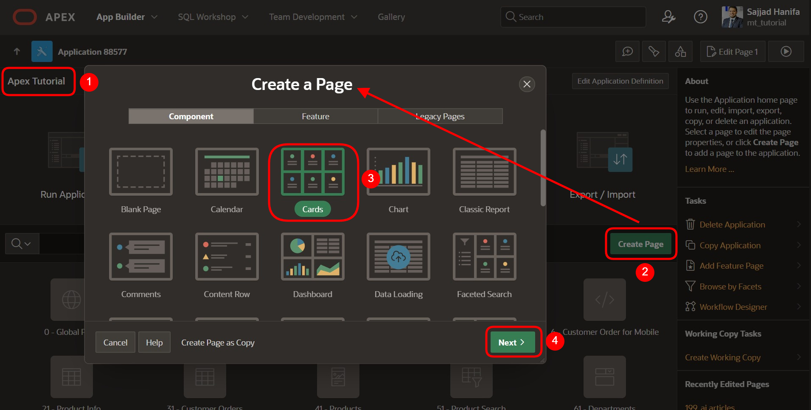

## 2. Configure the Cards Layout

Create the page with number 200 and select the view `200`. Press **Next**:
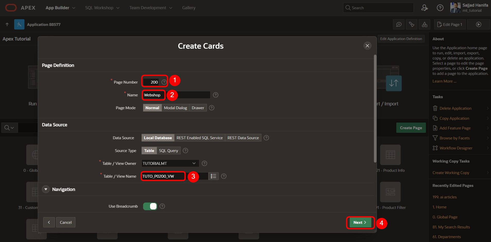

On the page, select the **Grid** layout for the cards and define it as follows:
- **Title**: AIGE_NAME
- **Body**: AIGE_DESCRIPTION
- **Badge**: AIGE_PRICE

Then, press **Create Page**:
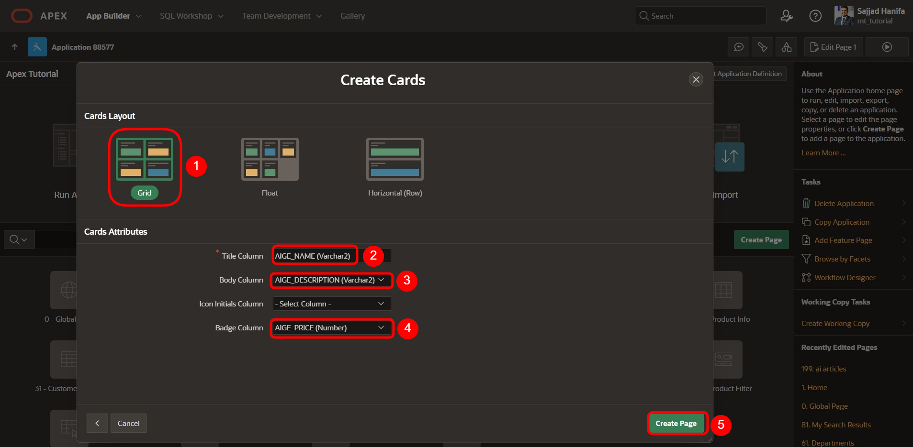

## 3. Define a New Article Region

Create a new region with the name: **Define a new Article**:
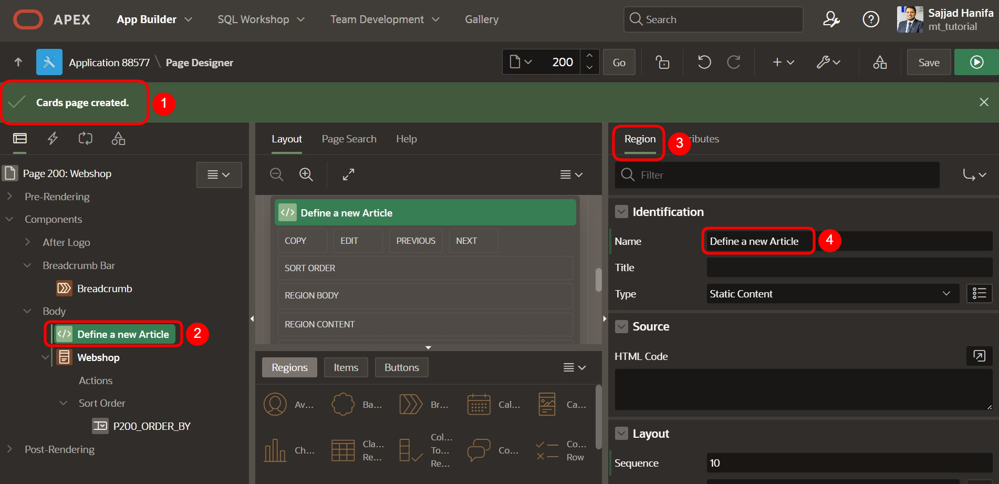

## 4. Create a Text Item and Button

1. Create a new APEX **Text Item** with the name: `P200_NEW_ARTICLE`
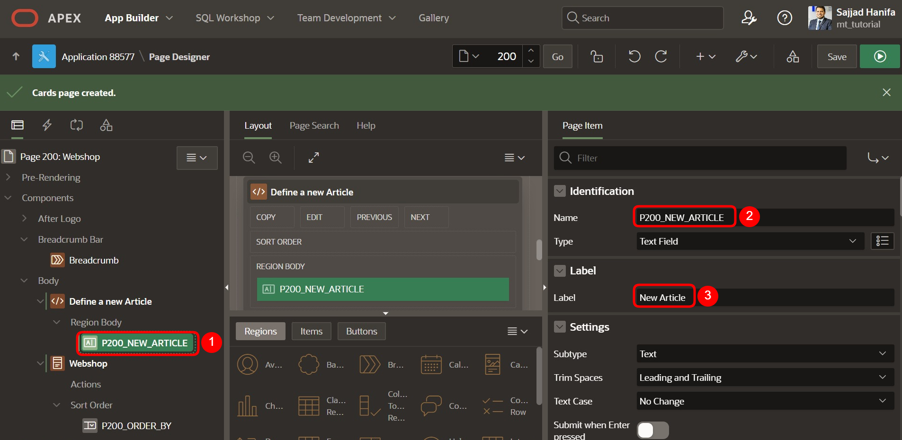

2. Create a new button with the name: `P200_ADD_ARTICLE`
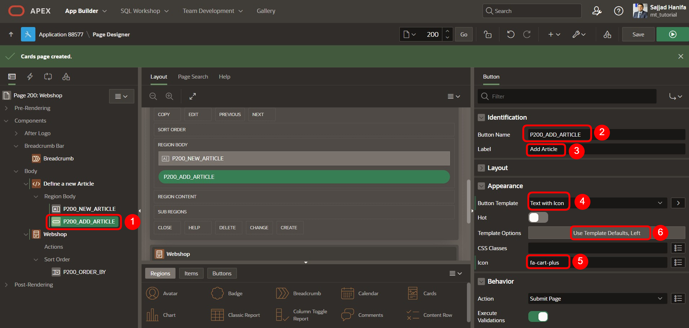

Set the following settings for the button appearance:
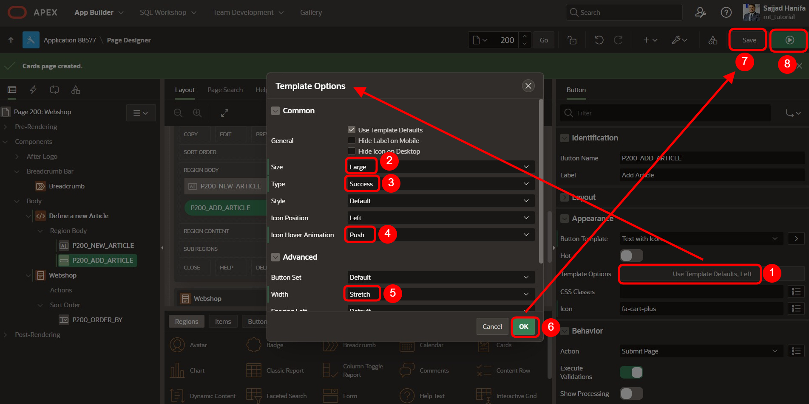

Save and preview the page. Now you will see a search input and an **Add** button, but the **Card Report** region is empty. The goal is to automate the addition of articles via a function.
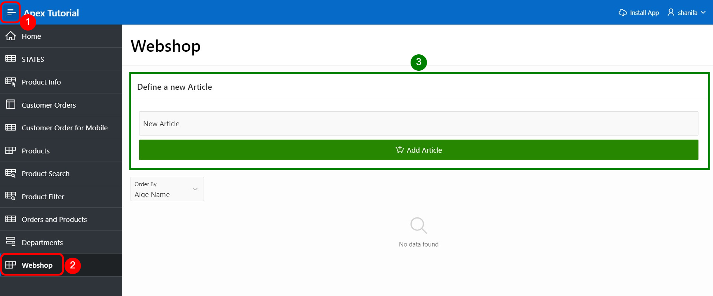

## 5. Create a Package for AI Webshop

Next, we need a package to store the functions and procedures for automating article generation:
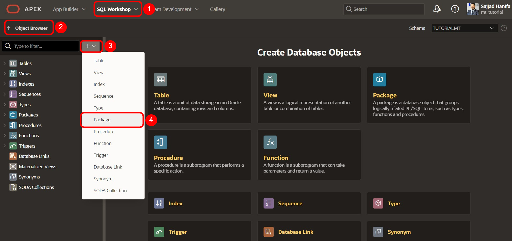

### 5.1. Create the Package Specification

Here is the specification code to store the functions and procedure:

```pascal
-- Insert my code here manually
```

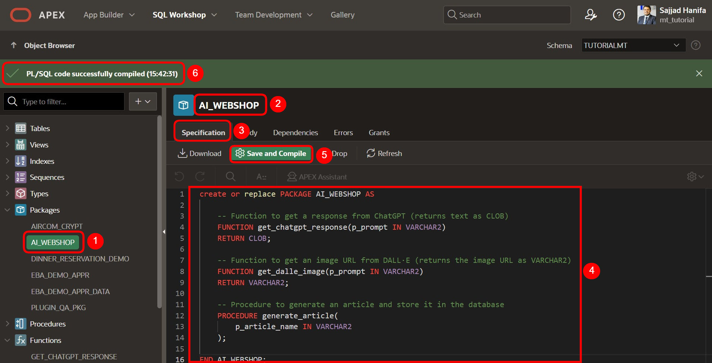

### 5.2. Create the Package Body

Here is the code for the package body:

```sql
-- Insert my code here manually
```

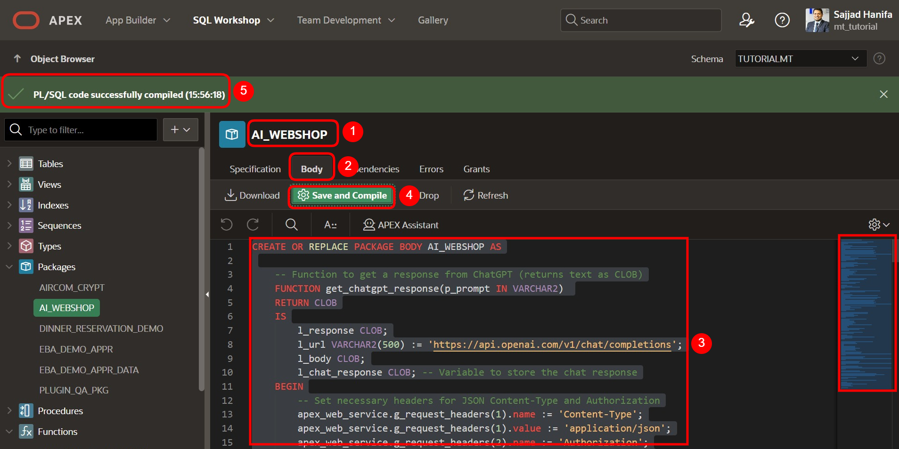

In summary:
- **`get_chatgpt_response`** → Used to get a response from the AI for the article name and description.
- **`get_dalle_image`** → Used to get a URL for the AI-generated image.
- **`generate_article`** → This procedure generates the article based on the article name and stores it in the database.

## 6. Create the Process for Adding an Article

Now, go back to the **Page Designer** on page 200 and create a new process with the following settings:
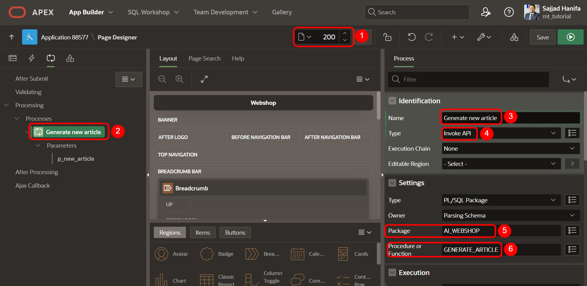

Assign a success message and set the process to run when the button is clicked.
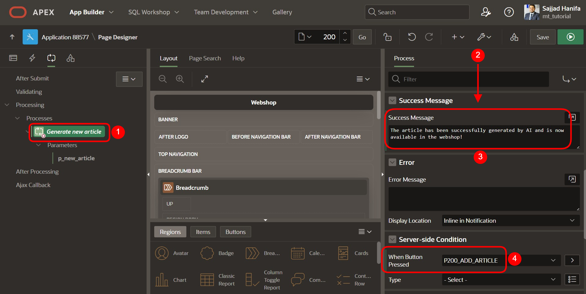

## 7. Verify the `p_new_article` Parameter

Make sure the parameter `p_new_article` is correctly connected to the item. Otherwise, it can be done manually.
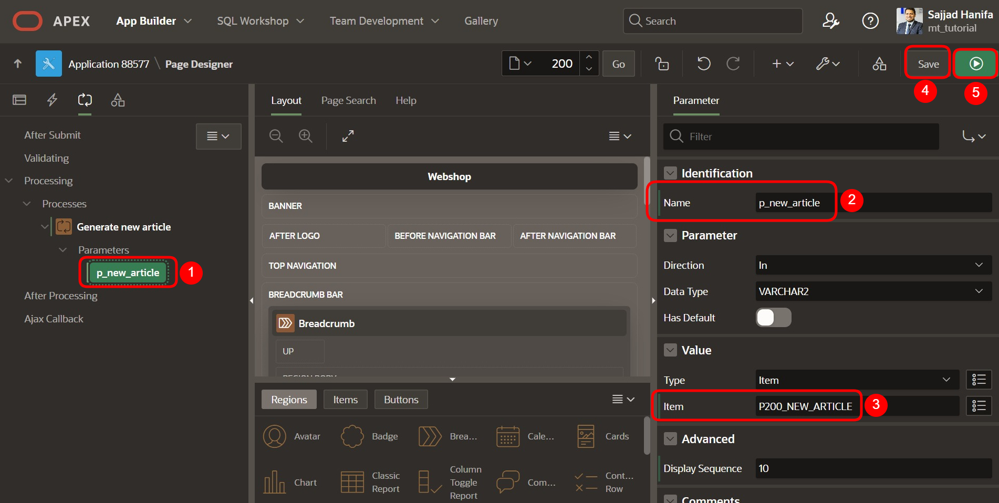

## 8. Final Page Preview

Once the UI is complete, you will see something like this, where you can input an article name and click the **Add Article** button.
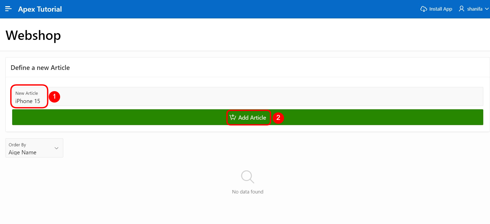

After 5-10 seconds, AI will generate the article, and you should be able to view the article in the **Card** layout, though without the image initially.
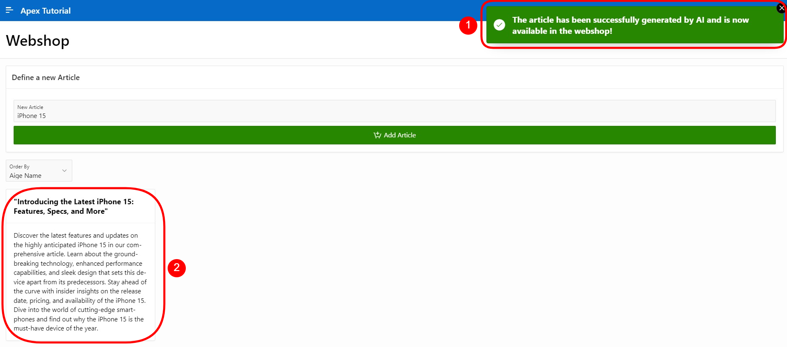

## 9. Add the Image URL

To integrate the image as a URL, set the following, then save and reload the page.
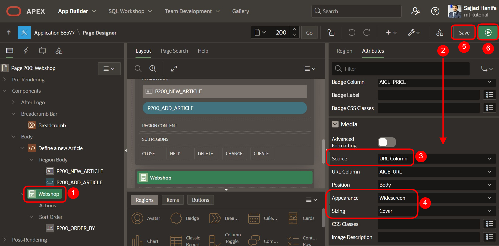

You can now create more articles, and the final result should look like this:
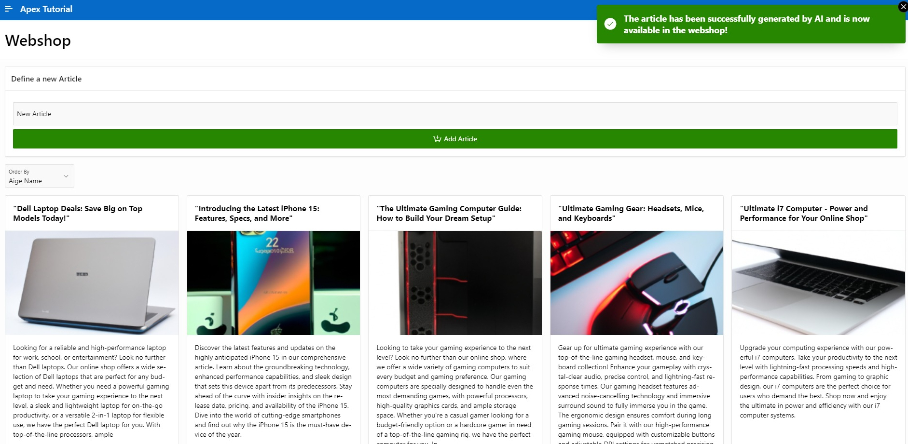

