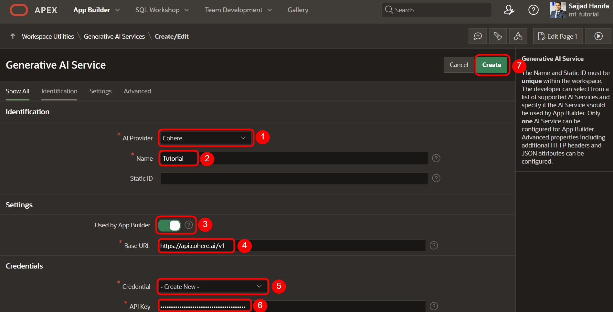

# <a name="oracle-apex-und-ai"></a> 22. Oracle APEX und AI
# <a name="testen-von-funktionen-oracle-apex-und-ai"></a>22.1 Teil 1: Testen von drei verschiedenen Funktionen mit Oracle APEX und AI

In diesem Kapitel werden wir drei verschiedene Funktionen von AI in Kombination mit Oracle APEX testen. Dabei konzentrieren wir uns auf den Einsatz von AI zur Unterstützung bei der SQL-Erstellung, zur App-Generierung und zur Übernahme von Aufgaben innerhalb einer Anwendung.

## <a name="unterstuetzung-bei-der-erstellung-von-abfragen"></a>1. Unterstützung bei der Erstellung von SQL-Abfragen

In diesem Abschnitt testen wir, wie AI uns bei der Erstellung von SQL-Abfragen unterstützen kann. Die AI wird genutzt, um komplexe SQL-Queries effizient und fehlerfrei zu generieren, die auf den Anforderungen der Datenbanktabellen und Geschäftslogik basieren.

**Ziel:** Erstellen Sie verschiedene SQL-Abfragen, die auf den Datenbanken laufen, und optimieren Sie den Prozess durch die Einbindung von AI.

##  <a name="automatisierte-app-erstellung"></a>2. Automatisierte App-Erstellung mit AI

Der zweite Test konzentriert sich auf die Fähigkeit von AI, eine vollständige Anwendung mit Oracle APEX zu generieren. Diese Anwendung wird verschiedene Tabellen miteinander verknüpfen und die Verwaltung der Daten ermöglichen, einschließlich der Funktionen für **Insert**, **Update** und **Delete**. Darüber hinaus sollen folgende Features in der App enthalten sein:

- **Report-Seite**: Ein Bericht, der die Daten aus den Tabellen anzeigt und gefiltert werden kann.
- **Dashboard**: Ein Dashboard mit wichtigen Metriken, wie z. B. die Anzahl der Kunden, Bestellungen oder Verkäufe, visualisiert durch Diagramme.
- **Suchfunktion**: Eine Suchseite, auf der nach spezifischen Bestellungen oder Kunden gesucht werden kann.

**Ziel:** Nutzen Sie AI, um eine voll funktionsfähige Applikation in Oracle APEX zu erstellen, die die Verwaltung von Daten aus verschiedenen Tabellen ermöglicht, sowie ein Dashboard, eine Report-Seite und eine Suchfunktion beinhaltet.

## <a name="aufgabenautomatisierung-durch-ai"></a>3. Aufgabenautomatisierung innerhalb der Anwendung durch AI

In der dritten Funktion wird getestet, wie AI Aufgaben innerhalb der Anwendung übernehmen kann. Hier wird speziell darauf abgezielt, dass die AI eingehende E-Mails verarbeitet und automatische Antworten generiert. Wenn beispielsweise eine E-Mail eintrifft, soll die AI darauf basierend eine Antwort verfassen.

**Ziel:** Verwenden Sie AI, um automatisch E-Mail-Antworten zu generieren. Diese Funktion soll die Effizienz steigern, indem die AI kontextbezogene Antworten erstellt.


## <a name="schritt-zugriff-auf-den-app-builder"></a>Schritt 1: Zugriff auf den App Builder

Um mit der Erstellung des AI-Dienstes zu beginnen, navigieren Sie zunächst zum **App Builder**.

1. Klicken Sie im Hauptmenü auf **App Builder**.
2. Wählen Sie dann **Workspace Utilities**, um weitere Tools zu nutzen.


---

## <a name="schritt-zugriff-auf-den-ai-generator"></a>Schritt 2: Zugriff auf den AI-Generator

Nachdem Sie im Bereich **Workspace Utilities** sind:

1. Klicken Sie auf **Generator AI**, um den AI-Dienst zu starten.


---

## <a name="schritt-erstellen-eines-ai-services"></a>Schritt 3: Erstellen eines AI-Services

Um den AI-Service zu konfigurieren:

1. Klicken Sie auf den **Create**-Button, um einen neuen AI-Service zu erstellen.


---

## <a name="schritt-ai-service-konfigurieren"></a>Schritt 4: AI-Service konfigurieren

Definieren Sie die Einstellungen für den AI-Service wie auf dem Bild gezeigt:



---

## <a name="schritt-wechsel-zum-sql-workshop"></a>Schritt 5: Wechsel zum SQL Workshop

Nachdem der AI-Service festgelegt wurde, navigieren Sie zum **SQL Workshop**.

1. Gehen Sie zum **SQL Commands**-Bereich.
2. Klicken Sie auf den Button **APEX Assistant**, um Unterstützung für SQL-Abfragen zu erhalten.


---

## <a name="schritt-nutzung-des-apex-assistant"></a>Schritt 6: Nutzung des APEX Assistant für SQL-Abfragen

Im **APEX Assistant**-Feld können Sie Hilfestellung zur Erstellung von SQL-Queries erhalten. Geben Sie z. B. den folgenden Beispieltext ein:

**Beschreibung der Abfrage:**  
> Erstelle eine SQL-Abfrage, die alle Kunden aus der Tabelle "CUSTOMERS" findet, deren Kreditlimit größer als 5000 ist. Gib dabei nur die wichtigsten Informationen wie Name, Stadt, E-Mail und Kreditlimit der Kunden zurück.

```sql
select ctmr_frst_name,
       ctmr_last_name,
       ctmr_city,
       ctmr_email,
       ctmr_credit_limit
  from customers
 where ctmr_credit_limit > 5000
```


---

## <a name="schritt-sql-query-vorschlaege"></a>Schritt 7: SQL-Query Vorschläge

Nachdem Sie den Text eingegeben haben, erhalten Sie Vorschläge für SQL-Queries. Hier ist ein Beispiel:

**Beschreibung der Abfrage:** 
> Suche nach allen Kunden und gib den vollständigen Namen des Kunden (Vorname und Nachname), seine E-Mail-Adresse und die Anzahl der Bestellungen, die jeder Kunde aufgegeben hat, zurück. Verwende die Daten aus den Tabellen "CUSTOMERS" und "ORDERS", wobei die Kunden in der Tabelle "CUSTOMERS" und ihre Bestellungen in der Tabelle "ORDERS" gespeichert sind. Verknüpfe die beiden Tabellen anhand der Kunden-ID. Gib nur den vollständigen Namen, die E-Mail-Adresse und die Anzahl der Bestellungen aus.

```sql
select ctmr.ctmr_frst_name || ' ' || ctmr.ctmr_last_name as full_name,
       ctmr.ctmr_email,
       count(ord.ordr_id)                          as order_count
  from customers ctmr
  left join orders ord
    on ctmr.ctmr_id = ord.ordr_ctmr_id
 group by ctmr.ctmr_frst_name,
          ctmr.ctmr_last_name,
          ctmr.ctmr_email
```


---

## <a name="schritt-weiteres-sql-beispiel"></a>Schritt 8: Weiteres SQL-Beispiel

Hier ist ein weiteres Beispiel für eine SQL-Query:

**Beschreibung der Abfrage:** 
> Suche nach allen Kunden und gib den vollständigen Namen des Kunden (Vorname und Nachname), seine E-Mail-Adresse sowie die Anzahl der Bestellungen zurück, die jeder Kunde seit dem Jahr 2016 aufgegeben hat. Berücksichtige dabei nur Bestellungen, die einen Gesamtwert (ORDR_TOTAL) von mehr als 100 aufweisen. Die Kundeninformationen stammen aus der Tabelle "CUSTOMERS", und die Bestellungen sind in der Tabelle "ORDERS" gespeichert. Verknüpfe die beiden Tabellen anhand der Kunden-ID. Gib nur die folgenden Informationen zurück: vollständiger Name, E-Mail-Adresse und die Anzahl der qualifizierten Bestellungen seit 2016.

```sql
select ctmr.ctmr_frst_name || ' ' || ctmr.ctmr_last_name as full_name,
       ctmr.ctmr_email,
       count(ordr.ordr_id)                     as order_count
  from customers           ctmr
  join orders              ordr
    on ctmr.ctmr_id = ordr.ordr_ctmr_id
 where ordr.ordr_dd >= to_date('2016-01-01', 'YYYY-MM-DD')
   and ordr.ordr_total > 100
 group by ctmr.ctmr_frst_name,
          ctmr.ctmr_last_name,
          ctmr.ctmr_email
```


--- 

Das war der erste Teil der Anleitung, der zeigt, wie die AI Ihnen bei der Erstellung von SQL-Queries basierend auf Ihrer eigenen Datenbank helfen kann.

# <a name="erstellen-einer-app-mit-ai"></a>22.1 Teil 2: Erstellen einer App mit Hilfe von AI in Oracle APEX

## <a name="schritt-zugriff-auf-den-app-builder-2"></a>Schritt 1: Zugriff auf den App Builder

Um eine Anwendung mit Hilfe von AI zu erstellen, gehen Sie wie folgt vor:

1. Navigieren Sie zum **App Builder**.
2. Klicken Sie auf **Create**, um den Prozess zur Erstellung einer neuen App zu starten.


---

## <a name="schritt-app-erstellung-mit-ai-starten"></a>Schritt 2: App-Erstellung mit AI starten

Anstatt einen Namen für die Anwendung einzugeben, klicken Sie auf **Create app using generative AI**.


---

## <a name="schritt-eingeben-eines-prompts"></a>Schritt 3: Eingeben eines Prompts

In der Suchleiste können Sie nun einen Prompt eingeben, der die Anwendung beschreibt, die Sie erstellen möchten. Geben Sie z. B. eine Beschreibung Ihrer Tabellen und Anforderungen ein und klicken Sie auf den kleinen Pfeil.

**Beschreibung des Prompts:** 
> Create a full application to manage the following tables: CUSTOMERS, ORDERS, ORDER_ITEMS, PRODUCT_INFO, STATES, and DEPARTMENTS. The application should allow me to create, update, and delete records for all these tables.
> 
> Additionally, provide the following functionalities:
> 
> Search Page: Create a search page where I can search for the orders of any customer by customer name, order date, or other relevant criteria.
> 
> Report Page: Create a report page that shows how many sales I have made, including the total revenue. The report should allow filtering by date range, customer, and product.
> 
> Dashboard: Create a dashboard that displays key metrics, such as the total number of customers, total sales, and the most frequently ordered products. Visualize this data with charts and summary figures.
> 
> Ensure the application has a user-friendly interface with the ability to easily navigate between the search page, report page, and dashboard. Include necessary validations, dynamic actions, and form handling where appropriate. Also, provide a security mechanism that allows role-based access to certain features, such as administrative actions.


---

## <a name="schritt-app-wird-generiert"></a>Schritt 4: App wird generiert

Sobald Sie den Prompt eingegeben haben, beginnt AI damit, die App zu erstellen. Sie sehen die Fortschrittsanzeige anhand von Punkten, die den Status des Erstellungsprozesses darstellen.


---

## <a name="ueberpruefung-der-generierten-app"></a>Schritt 5: Überprüfung der generierten App

Nachdem die App generiert wurde, erhalten Sie eine Übersicht aller Tabellen sowie der Seiten, die die App beinhaltet. Hier können Sie sehen, welche Funktionen für welche Tabellen vorgesehen sind. Falls alles korrekt ist, klicken Sie einfach auf **Create Application**.


---

## <a name="schritt-seitenuebersicht-anpassen"></a>Schritt 6: Seitenübersicht anpassen

Auf der nächsten Seite wird Ihnen eine kurze Übersicht über die automatisch erstellten Seiten angezeigt. Falls Sie Änderungen vornehmen möchten, können Sie dies hier tun. Ansonsten klicken Sie auf **Create Application**.


---

## <a name="schritt-erstellung-der-app"></a>Schritt 7: Erstellung der App

Innerhalb weniger Sekunden wird die Anwendung erstellt.


---

## <a name="schritt-starten-der-anwendung"></a>Schritt 8: Die Anwendung starten

Wenn Sie die Anwendung ausführen, können Sie auf der Navigationsleiste mehrere Schaltflächen sehen. Über diese können Sie nun durch die Anwendung navigieren und verschiedene Daten einfügen, bearbeiten und verwalten. Zudem gibt es eine **Suchseite** sowie eine **Dashboard-Seite**, die zusätzliche Funktionalitäten bieten.


---

Das war der zweite Teil der Anleitung, der zeigt, wie Sie mit Hilfe von AI in Oracle APEX eine Anwendung erstellen können. Dieser Prozess erleichtert die Verwaltung Ihrer Daten und bietet Ihnen die Möglichkeit, Ihre App durch eine generative AI effizient zu erstellen, inklusive Dashboards, Suchseiten und vielem mehr.


# <a name="erstellen-einer-email-reply-funktion-mit-ai"></a>22.1 Teil 3: Erstellen einer E-Mail-Reply-Funktion mit AI in Oracle APEX

## <a name="schritt-erstellen-einer-neuen-leeren-seite"></a>Schritt 1: Erstellen einer neuen leeren Seite

1. Gehen Sie in Ihrer Applikation auf **Create** und erstellen Sie eine neue **Blank Page**.
2. Klicken Sie auf **Next**, um fortzufahren.


---

## <a name="schritt-seiteneinstellungen"></a>Schritt 2: Seiteneinstellungen

Geben Sie die Einstellungen wie im Bild gezeigt ein und klicken Sie auf **Create Page**.


---

## <a name="schritt-erstellen-einer-region"></a>Schritt 3: Erstellen der Region

Erstellen Sie eine Region mit dem Namen **Email Reply**.


---

## <a name="schritt-hinzufuegen-eines-items"></a>Schritt 4: Hinzufügen eines Items

Fügen Sie ein neues Item hinzu:

- **Item Name**: `P50_MAIL`
- **Label**: `MAIL`


Scrollen Sie nach unten und geben Sie die gewünschte E-Mail im **Static Value**-Feld ein. Klicken Sie dann auf **OK**.

> Subject: Urgent: Password Recovery Assistance Required
> 
> Dear Our Company,
> 
> I hope this message finds you well. I am writing to request your urgent assistance in recovering my password for my account with your services. Unfortunately, I am currently unable to access my account and have been unsuccessful in using the standard password recovery options provided.
> 
> Here are my account details for your reference:
> 
> Account Holder Name: John Doe
> Username/Email Associated with Account: john.doe@example.com
> Could you please assist me in resetting my password at your earliest convenience? If there are any additional steps or verification processes required, please let me know so that I can promptly provide the necessary information.
> 
> Thank you for your immediate attention to this matter. I appreciate your help and look forward to resolving this issue as soon as possible.
> 
> Best regards,
> 
> Edward Logan
> 
> Edward.Logan@example.com
> 
> (123) 456-7890


---

## <a name="schritt-erstellen-eines-buttons"></a>Schritt 5: Erstellen eines Buttons

Erstellen Sie einen neuen Button mit den gezeigten Einstellungen.


---

## <a name="schritt-hinzufuegen-einer-dynamic-action"></a>Schritt 6: Hinzufügen einer Dynamic Action

Wählen Sie den zuvor erstellten Button und fügen Sie eine **Dynamic Action** mit dem Namen **click on mail reply button** hinzu.


---

## <a name="schritt-konfigurieren-der-dynamic-action"></a>Schritt 7: Konfigurieren der Dynamic Action

- **Action Name**: `ai mail reply`
- **Action**: Wählen Sie **Open AI Assistant**.
- Wählen Sie den zuvor erstellten AI-Service **Tutorial** aus.

Geben Sie den System Prompt wie folgt ein:

- **System Prompt**: `Here is an E-Mail, please reply the E-Mail`.
- **Display As**: Lassen Sie die Standard-Einstellung auf **Dialog**.


---

## <a name="schritt-system-prompt-und-anzeigeneinstellungen"></a>Schritt 8: System Prompt und Anzeigeeinstellungen

Scrollen Sie nach unten und konfigurieren Sie folgende Einstellungen:

- **Initial Prompt**: Wählen Sie **Item** und dann das Item **P50_MAIL** aus.
- **Message**: Geben Sie hier z. B. ein: `Here is an E-Mail, please reply the E-Mail`.

Speichern Sie anschließend die Seite und führen Sie sie aus.


---

## <a name="schritt-ausfuehren-der-seite"></a>Schritt 9: Ausführen der Seite

Nach dem Speichern sieht die Seite wie folgt aus. Sie können nun auf den Button **Mail Reply** klicken.


---

## <a name="schritt-email-verarbeitung-durch-ai"></a>Schritt 10: E-Mail-Verarbeitung durch AI

Nachdem Sie auf **Here is an E-Mail, Please Reply the E-Mail** geklickt haben, gibt die AI eine Antwort auf die E-Mail.


---

Das war der dritte Teil der Anleitung, in dem Sie gelernt haben, wie Sie eine E-Mail-Reply-Funktion mit AI in Oracle APEX erstellen können.

Vielen Dank, dass Sie diese Anleitung durchgearbeitet haben. Sie haben nun die Werkzeuge an der Hand, um SQL-Abfragen zu erstellen, Anwendungen effizient zu entwickeln und E-Mails automatisch beantworten zu lassen. Dies zeigt, wie leistungsstark Oracle APEX in Kombination mit generativer AI sein kann.

Wir hoffen, dass diese Anleitung Ihnen geholfen hat, die Integration von AI in Oracle APEX besser zu verstehen und produktiv anzuwenden. Sollten Sie weitere Fragen oder neue Herausforderungen haben, stehen wir Ihnen gerne zur Seite.

Viel Erfolg bei Ihren Projekten!