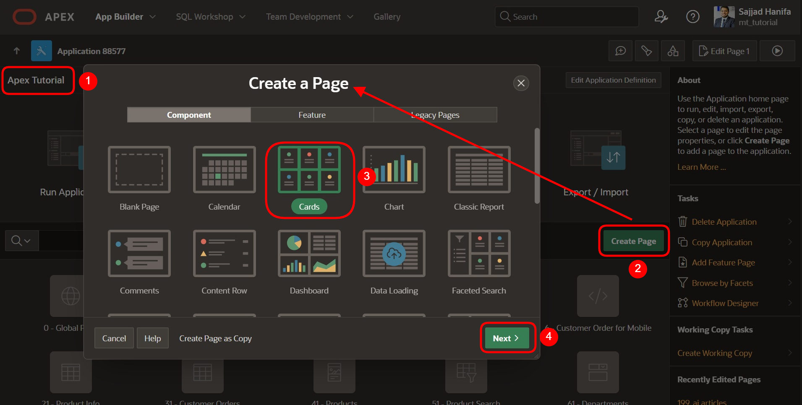
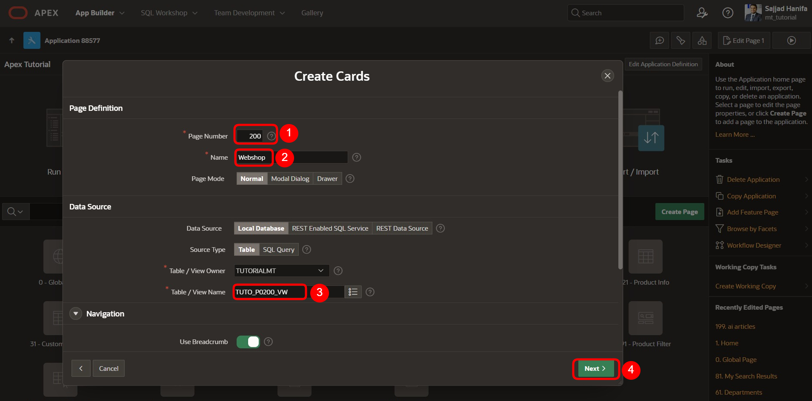
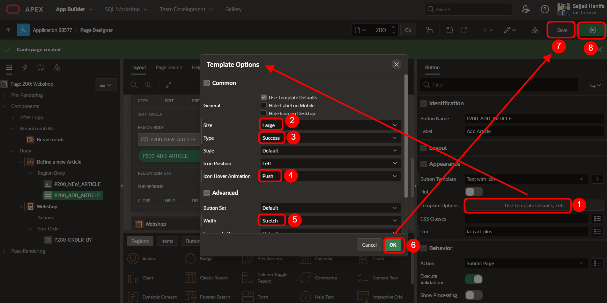
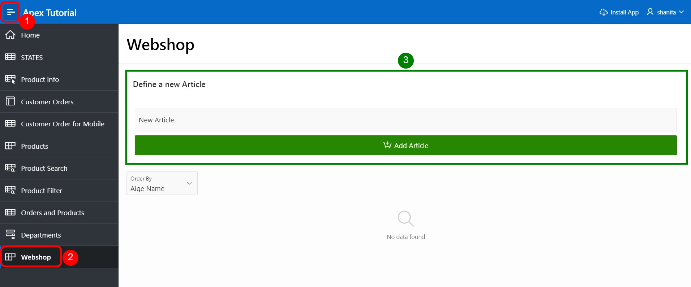
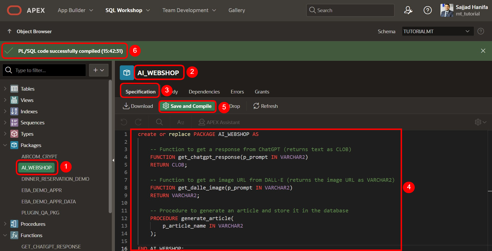
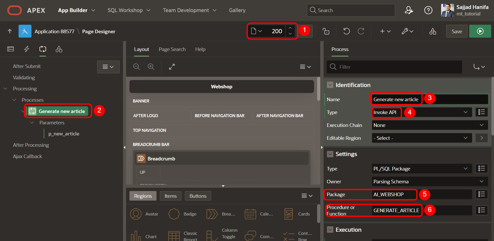
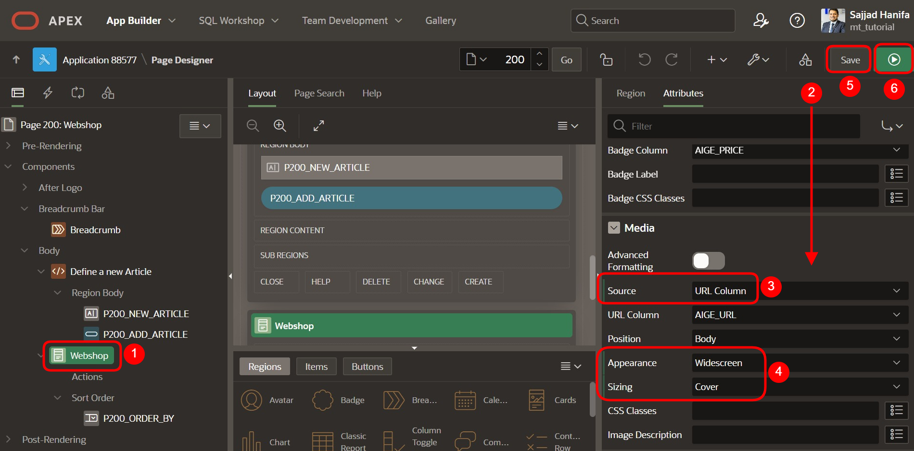
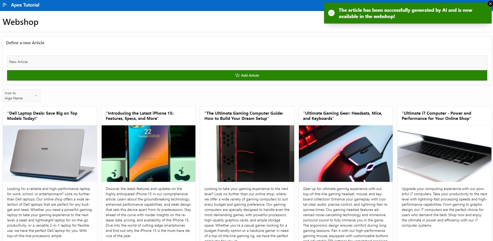

# <a name="ai-basierte-artikelgenerierung"></a>22. AI-basierte Artikelgenerierung für Webshops

In diesem Tutorial zeigen wir Ihnen, wie Sie mithilfe von KI automatisch Artikel für einen Webshop erstellen. Die KI wird verwendet, um für jedes Produkt Folgendes zu generieren:

- **Artikelname** 
- **Artikelbeschreibung** 
- **Artikelpreis** 
- **Artikelbild (als URL)**

## <a name="eine-view-erstellen"></a>1. Eine View erstellen

- Für die Bearbeitung dieser Aufgabe wird eine **View** benötigt. 

- Geben Sie Ihrer **View** den Namen ***TUTO_P0200_VW***:  

```sql
CREATE VIEW TUTO_P0200_VW AS
SELECT AIGE_ID
     , AIGE_NAME
     , AIGE_DESCRIPTION
     , AIGE_PRICE
     , AIGE_URL
     , AIGE_IMAGE
     , AIGE_MIME_TYPE
  FROM AI_GENERATED_ARTICLE
;
```

1. Anschließend erstellen Sie eine neue Seite mit **Cards**:
  


## <a name="konfiguration-des-kartenlayouts"></a>2. Konfiguration des Kartenlayouts

1. Erstellen Sie die Seite mit der Nummer 200 und wählen Sie die View ***TUTO_P0200_VW*** aus. Klicken Sie anschließend auf **Next**:

  | | |  
  |--|--|
  | **Page Number** | *200* | 
  | **Name** | *Webshop*| 
  | **Table/View Name** | *TUTO_P0200_VW*| 
  | | |



2. Wählen Sie auf der Seite das **Grid-Layout** für die Karten aus und definieren Sie es wie folgt:

  | | |  
  |--|--|
  | **Title** | *AIGE_NAME* | 
  | **Body** | *AIGE_DESCRIPTION*| 
  | **Badge** | *AIGE_PRICE*| 
  | | |

3. Klicken Sie anschließend auf **Create Page**:


## <a name="region-erstellen"></a>3. Region Erstellen

1. Erstellen Sie eine neue Region mit dem Namen: **Define a new Article**:
  
  | | |  
  |--|--|
  | **Name** | *Define a new Article* |  
  | | |


## <a name="erstellung-eines-textfelds-und-eines-buttons"></a>4. Erstellung eines Textfelds und eines Buttons

1. Erstellen Sie ein neues APEX **Text Item** mit dem Namen: `P200_NEW_ARTICLE`

  | | |  
  |--|--|
  | **Name** | *P200_NEW_ARTICLE* | 
  | **Label** | *New Article*| 
  | | |


2. Erstellen Sie einen neuen Button mit dem Namen: `P200_ADD_ARTICLE`

  | | |  
  |--|--|
  | **Button Name** | *P200_ADD_ARTICLE* | 
  | **Label** | *Add Article*| 
  | **Button Template** | *Text with Icon*| 
  | **Icon** | *fa-cart-plus*|  
  | | |


3. Setzen Sie die folgenden Einstellungen für das Button-Design fest:
  
  | | |  
  |--|--|
  | **Size** | *Large* | 
  | **Type** | *Success*| 
  | **Icon Hover Animation** | *Push*| 
  | **Width** | *Stretch*|  
  | | |



4. Speichern Sie die Seite und öffnen Sie die Vorschau. Jetzt sollten Sie ein Sucheingabefeld und einen **Add**-Button sehen, jedoch ist die **Card Report**-Region noch leer. Das Ziel besteht darin, die Artikel mithilfe einer Funktion hinzuzufügen.
  


## <a name="erstellung-eines-pakets-für-den-ai-webshop"></a>5. Erstellung eines Pakets für den AI-Webshop

1. Als Nächstes erstellen Sie ein Paket, um die Funktionen und Prozeduren zur automatisierten Artikelerstellung zu speichern:

- 1. Klicken Sie auf **SQL Workshop**.
- 2. Wählen Sie anschließend **Object Browser** aus.
- 3. Klicken Sie auf das kleine **Plus-Symbol** neben der Suchleiste.
- 4. Wählen Sie dann **Package** aus, um ein neues Paket zu erstellen.
  


2. Als Nächstes öffnet sich ein **Popup-Fenster**. Tragen Sie hier den Namen **AI_WEBSHOP** ein. 
Schalten Sie die Option **Include Sample Code** aus, sodass sie grau wird. Drücken Sie anschließend auf **Create Package**.


### <a name="erstellung-der-paketspezifikation">5.1. Erstellung der Paketspezifikation (Package Specification)

1. Hier ist der Code für die Paketspezifikation, um die Funktionen und Prozeduren zu speichern:

```sql
create or replace PACKAGE AI_WEBSHOP AS

    -- Function to get a response from ChatGPT (returns text as CLOB)
    FUNCTION get_chatgpt_response(p_prompt IN VARCHAR2) 
    RETURN CLOB;

    -- Function to get an image URL from DALL·E (returns the image URL as VARCHAR2)
    FUNCTION get_dalle_image(p_prompt IN VARCHAR2) 
    RETURN VARCHAR2;

    -- Procedure to generate an article and store it in the database
    PROCEDURE generate_article(
        p_new_article IN VARCHAR2
    );

END AI_WEBSHOP;
/
```
2. Nachdem Sie den Code eingefügt haben, klicken Sie auf den Button **Speichern und Kompilieren**.
  


### <a name="erstellung-des-package-body">5.2. Erstellung des Package Body

1. Hier ist der Code für den Package Body:

Hinweis: Suchen Sie im Code nach der Variable **l_api_key** in den Funktionen **get_chatgpt_response** und **get_dalle_image**. 
Ersetzen Sie dort den Platzhalter `'Bearer API_KEY'` durch Ihren gültigen API-Schlüssel.

In beiden Funktionen an folgender Stelle: 
```sql
l_api_key VARCHAR2(500) := 'Bearer API_KEY';
```


```sql
create or replace PACKAGE BODY AI_WEBSHOP AS

    -- Function to get a response from ChatGPT (returns text as CLOB)
    FUNCTION get_chatgpt_response(p_prompt IN VARCHAR2) 
    RETURN CLOB
    IS
        l_response          CLOB;
        l_url               VARCHAR2(500) := 'https://api.openai.com/v1/chat/completions';
        l_body              CLOB;
        l_chat_response     CLOB; -- Variable to store the chat response
        l_api_key           VARCHAR2(500) := 'Bearer API_KEY'; -- An dieser Stelle muss der gültige API-Schlüssel eingefügt werden:
    BEGIN
        -- Set necessary headers for JSON Content-Type and Authorization
        apex_web_service.g_request_headers(1).name := 'Content-Type';
        apex_web_service.g_request_headers(1).value := 'application/json';
        apex_web_service.g_request_headers(2).name := 'Authorization';
        apex_web_service.g_request_headers(2).value := l_api_key; 
        
        -- Body for the POST request with the prompt, provided by the user
        l_body := '{
            "model": "gpt-3.5-turbo",
            "messages": [{"role": "user", "content": "' || p_prompt || '"}],
            "max_tokens": 100
        }';

        -- Execute the POST request
        l_response := apex_web_service.make_rest_request(
            p_url => l_url,
            p_http_method => 'POST',
            p_body => l_body
        );

        -- Parse the response using JSON_TABLE to extract the description
        FOR r IN (
            SELECT message_content
            FROM JSON_TABLE(
                l_response, '$'
                COLUMNS (
                    message_content CLOB PATH '$.choices[0].message.content'
                )
            )
        ) LOOP
            -- Store the chat response in the variable
            l_chat_response := r.message_content;
        END LOOP;

        -- Return the extracted response
        RETURN l_chat_response;

    EXCEPTION
        WHEN OTHERS THEN
            RETURN 'Error: ' || SQLERRM;
    END;


    -- Function to get an image URL from DALL·E (returns the image URL as VARCHAR2)
    FUNCTION get_dalle_image(p_prompt IN VARCHAR2) 
    RETURN VARCHAR2
    IS
        l_response          CLOB;
        l_url               VARCHAR2(500) := 'https://api.openai.com/v1/images/generations';
        l_body              CLOB;
        l_image_url         VARCHAR2(1000);                     -- To store the image URL from the API response
        l_blob              BLOB;                               -- To store the downloaded image as BLOB
        l_api_key           VARCHAR2(500) := 'Bearer API_KEY';  -- An dieser Stelle muss der gültige API-Schlüssel eingefügt werden:
    BEGIN
        -- Set necessary headers for JSON Content-Type and Authorization
        apex_web_service.g_request_headers(1).name := 'Content-Type';
        apex_web_service.g_request_headers(1).value := 'application/json';
        apex_web_service.g_request_headers(2).name := 'Authorization';
        apex_web_service.g_request_headers(2).value := l_api_key;
        
        -- Body for the POST request with the prompt, provided by the user
        l_body := '{
            "prompt": "' || p_prompt || '",
            "n": 1,
            "size": "256x256"
        }';

        -- Execute the POST request to generate the image
        l_response := apex_web_service.make_rest_request(
            p_url => l_url,
            p_http_method => 'POST',
            p_body => l_body
        );

        -- Parse the response to extract the image URL
        FOR r IN (
            SELECT image_url
            FROM JSON_TABLE(
                l_response, '$'
                COLUMNS (
                    image_url VARCHAR2(1000) PATH '$.data[0].url'
                )
            )
        ) LOOP
            -- Store the image URL in the variable
            l_image_url := r.image_url;
        END LOOP;

        -- Return the URL containing the image
        RETURN l_image_url;

    EXCEPTION
        WHEN OTHERS THEN
            -- If an error occurs, return NULL or handle it accordingly
            RETURN NULL;
    END;


    -- Procedure to generate an article and store it in the database
    PROCEDURE generate_article(
        p_new_article IN VARCHAR2
    ) 
    IS
        v_article        CLOB;
        v_article_desc   CLOB;
        v_AIGE_URL       VARCHAR2(1000);
        v_AIGE_PRICE     CLOB;
        v_AIGE_PRICE_nr  NUMBER;
    BEGIN

        -- Get the article name from ChatGPT
        v_article := get_chatgpt_response(
            'I have an online shop. Please provide the perfect name for this product, limited to a maximum of 80 characters. The product is: ' || p_new_article
        );

        -- Get the article description from ChatGPT
        v_article_desc := get_chatgpt_response(
            'I have an online shop. Please provide the perfect description for this product, limited to a maximum of 4000 characters. The product is: ' || p_new_article
        );

        -- Get the image URL from DALL·E
        v_AIGE_URL := get_dalle_image(
            'I have an online shop. Please generate the perfect image for this product. The product is: ' || p_new_article
        );

        -- Get the price from ChatGPT
        v_AIGE_PRICE := get_chatgpt_response(
            'I have an online shop. Please provide the perfect price for this product as a number, formatted like 22.40 with no currency symbol. The product is: ' || p_new_article
        );


        -- Convert the price to a number
        v_AIGE_PRICE_nr := TO_NUMBER(v_AIGE_PRICE);

        -- Insert the generated article into the AI_GENERATED_ARTICLE table
        INSERT INTO AI_GENERATED_ARTICLE (AIGE_NAME, AIGE_DESCRIPTION, AIGE_URL, AIGE_PRICE)
        VALUES (v_article, v_article_desc, v_AIGE_URL, v_AIGE_PRICE_nr);

        -- Commit the transaction
        COMMIT;

        DBMS_OUTPUT.put_line('Article successfully generated and stored.');

    EXCEPTION
        WHEN OTHERS THEN
            DBMS_OUTPUT.put_line('Error: ' || SQLERRM);
            ROLLBACK;
    END generate_article;

END AI_WEBSHOP;
/
```
2. Nachdem Sie den API-Schlüssel eingefügt haben, klicken Sie auf den Button **Speichern und Kompilieren**.
  


Zusammenfassung:
- **`get_chatgpt_response`** → Diese Funktion holt eine Antwort von der KI für den Artikelnamen und die Beschreibung.
- **`get_dalle_image`** → Diese Funktion holt eine URL für das KI-generierte Bild.
- **`generate_article`** → Diese Prozedur generiert den Artikel basierend auf dem Artikelnamen und speichert ihn in der Datenbank.

## <a name="erstellung-des-prozesses-zum-hinzufuegen-eines-artikels">6. Erstellung des Prozesses zum Hinzufügen eines Artikels

1. Gehen Sie nun zurück zum **Page Designer** auf Seite 200 und erstellen Sie einen neuen Prozess mit den folgenden Einstellungen:

  | | |  
  |--|--|
  | **Page** | *200* | 
  | **Process Name** | *Generate new article*| 
  | **Type** | *Invoke API*| 
  | **Package** | *AI_WEBSHOP*|  
  | **Procedure or Function** | *GENERATE_ARTICLE*|  
  | | |



2. Fügen Sie eine Erfolgsmeldung hinzu und stellen Sie sicher, dass der Prozess nur ausgeführt wird, wenn der entsprechende Button geklickt wird.
  
  | | |  
  |--|--|
  | **Success Message** | *The article has been successfully generated by AI and is now available in the webshop!* | 
  | **When Button Pressed** | *P200_ADD_ARTICLE*| 
  | | |


## <a name="ueberpruefung-des-parameters">7. Überprüfung des Parameters `p_new_article`

1. Stellen Sie sicher, dass der Parameter `p_new_article` korrekt mit dem Item verbunden ist. Falls dies nicht der Fall ist, kann die Verbindung manuell vorgenommen werden.
  
  | | |  
  |--|--|
  | **Name** | *p_new_article* | 
  | **Item** | *P200_NEW_ARTICLE*| 
  | | |


## <a name="endgueltige-Seitenvorschau">8. Endgültige Seitenvorschau

1. Sobald die Benutzeroberfläche vollständig ist, sollte die Seite in etwa so aussehen. Sie können nun einen Artikelnamen eingeben und auf den **Artikel hinzufügen**-Button klicken.
  


2. Nach etwa 5-10 Sekunden wird die KI den Artikel generieren, und Sie sollten den Artikel in der **Kartenansicht** sehen können, jedoch zunächst ohne Bild.
  


## <a name="bild-urk-hinzufuegen">9. Bild-URL hinzufügen

1. Um das Bild als URL zu integrieren, setzen Sie die folgenden Einstellungen, speichern Sie und laden Sie die Seite neu.
    
  | | |  
  |--|--|
  | **Card Region** | *Webshop* | 
  | **Media** | **| 
  | **Source** | *URL Column*| 
  | **Appearance** | *Widescreen*| 
  | **Sizing** | *Cover*| 
  | | |



2. Jetzt können Sie weitere Artikel erstellen, und das Endergebnis sollte in etwa so aussehen:
  
