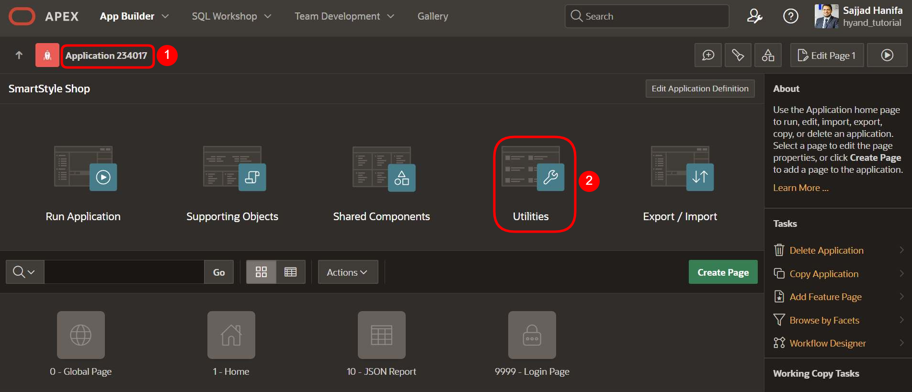
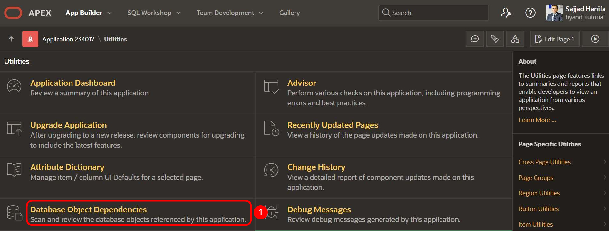
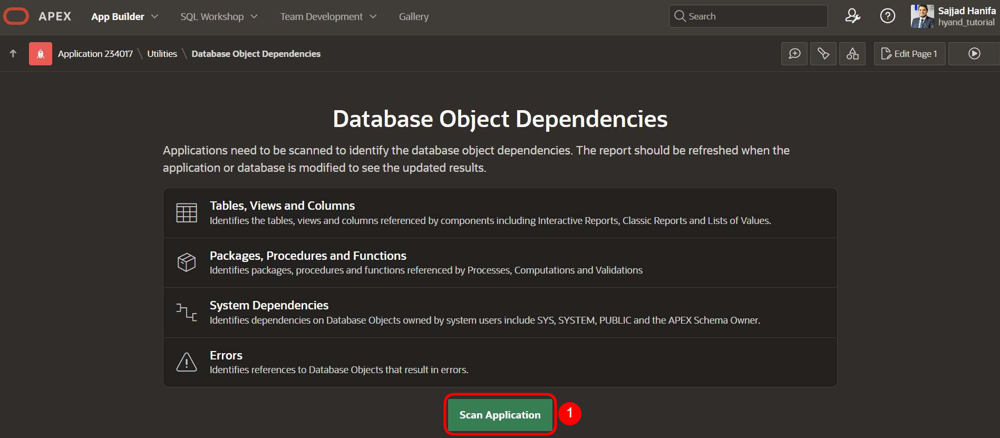
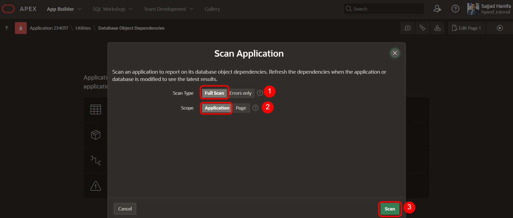
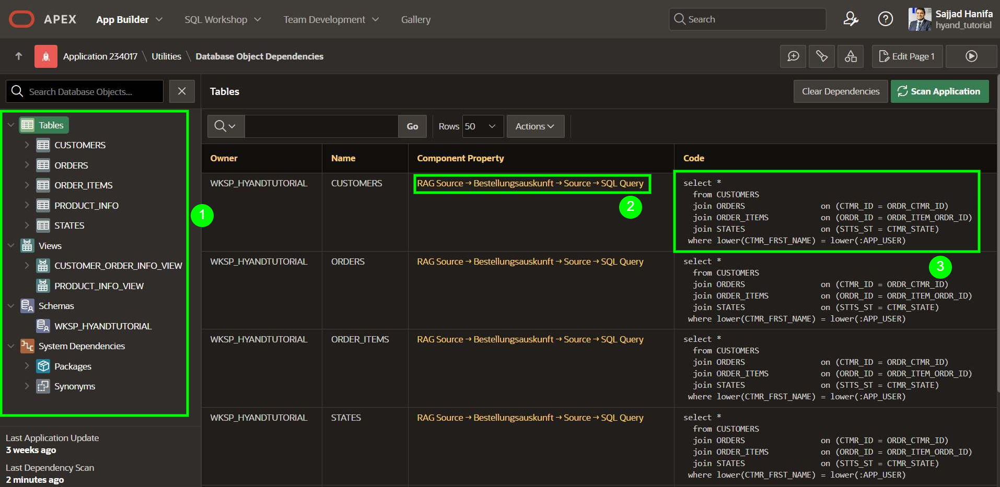

# Kapitel-23 - Database Object Dependencies

## Einleitung  

Mit APEX 24.2 wurde eine neue Funktion eingeführt, die es ermöglicht, die **Abhängigkeiten zwischen APEX-Komponenten und Datenbankobjekten** detailliert nachzuvollziehen. Diese Erweiterung unterstützt Sie dabei, Änderungen an Tabellen, Views, Packages oder Funktionen gezielt zu analysieren und deren Auswirkungen auf Ihre APEX-Anwendungen besser zu verstehen.

Die Funktion „Database Object Dependencies“ bietet Ihnen einen transparenten Einblick in die Verbindung zwischen der Datenbankstruktur und Ihren APEX-Komponenten – eine wertvolle Hilfe für Wartung, Refactoring und Qualitätssicherung.

## Vorteile  
- **Transparente Nachverfolgung von Abhängigkeiten** zwischen APEX und der Datenbank  
- **Schnellere Fehleranalyse** bei strukturellen Änderungen  
- **Optimierte Wartbarkeit** Ihrer Anwendungen  
- **Bessere Zusammenarbeit im Team** durch nachvollziehbare Datenflüsse

Im weiteren Verlauf dieses Kapitels erfahren Sie, wie Sie das neue Feature aktivieren, interpretieren und gezielt in Ihrem Entwicklungsprozess einsetzen können.

---

## Schritt 1: Applikation öffnen und zu den Utilities navigieren

1. Öffnen Sie Ihre gewünschte **APEX-Applikation** im App Builder  
   (im Beispiel: *Application 234017*).

2. Klicken Sie im Anwendungs-Dashboard auf die Kachel **Utilities**, um zu den Hilfsfunktionen zu gelangen.

> Über die Utilities gelangen Sie im nächsten Schritt zur neuen Funktion **Database Object Dependencies**, die mit APEX 24.2 eingeführt wurde.

---

## Schritt 2: Database Object Dependencies öffnen

1. Scrollen Sie auf der **Utilities-Seite** nach unten bis zum Abschnitt „Database Object Dependencies“.

2. Klicken Sie auf **Database Object Dependencies**, um die Übersicht der verwendeten Datenbankobjekte und deren Abhängigkeiten innerhalb der Applikation zu öffnen.

   

> In der folgenden Ansicht sehen Sie, welche Tabellen, Views, Packages, Funktionen und weitere Objekte in Ihrer APEX-Applikation referenziert werden.

---

## Schritt 3: Anwendung scannen

1. Klicken Sie auf den Button **Scan Application**, um die aktuelle APEX-Applikation auf Datenbankabhängigkeiten zu analysieren.

2. Der Scan identifiziert u. a. folgende Objektarten:
   - Tabellen, Views und Spalten
   - Packages, Prozeduren und Funktionen
   - Systemabhängigkeiten (z. B. auf `SYS`, `SYSTEM`, `PUBLIC`)
   - Referenzen, die zu Fehlern führen (z. B. nicht mehr existierende Objekte)

   

> Nach dem Scan stehen Ihnen die vollständigen Ergebnisse in verschiedenen Ansichten zur Verfügung. Diese helfen Ihnen, Änderungen an der Datenbank besser zu verstehen und fundierte Entscheidungen bei der Weiterentwicklung Ihrer Applikation zu treffen.

---

## Schritt 4: Scan-Optionen wählen und starten

1. Wählen Sie bei **Scan Type** die Option **Full Scan**, um alle referenzierten Objekte zu analysieren (nicht nur fehlerhafte).

2. Setzen Sie bei **Scope** die Auswahl auf **Application**, um die gesamte Applikation zu scannen (nicht nur eine einzelne Seite).

3. Klicken Sie anschließend auf **Scan**, um den Analysevorgang zu starten.

   

> Nach Abschluss des Scans erhalten Sie eine detaillierte Übersicht aller Datenbankobjekte, die von der Anwendung verwendet werden – inklusive Tabellen, Views, Packages, Funktionen und etwaiger Fehler.

---

## Schritt 5: Ergebnisse analysieren

Nach Abschluss des Scans wird Ihnen eine strukturierte Übersicht aller referenzierten Datenbankobjekte angezeigt.

1. Auf der linken Seite finden Sie die **Kategorisierung der Objekte** – z. B. Tabellen, Views, Packages oder Systemabhängigkeiten.

2. In der mittleren Spalte sehen Sie, **welche Komponente** in Ihrer APEX-Anwendung auf welches Objekt zugreift (z. B. durch eine SQL Query in einer Datenquelle).

3. In der rechten Spalte wird der zugehörige **SQL-Code** dargestellt, aus dem die Referenz hervorgeht.

   

> So erkennen Sie auf einen Blick, wo genau ein bestimmtes Datenbankobjekt in Ihrer Anwendung verwendet wird – eine enorme Hilfe bei Refactoring, Debugging oder bei der Analyse von Seiteneffekten nach Änderungen an Datenbankstrukturen.

## Fazit

Mit der neuen Funktion **Database Object Dependencies** in Oracle APEX 24.2 erhalten Sie eine transparente und detaillierte Übersicht darüber, wie Ihre Anwendung mit der Datenbank interagiert.

Gerade bei größeren Anwendungen oder in Teams mit mehreren Entwicklern hilft dieses Tool, Abhängigkeiten zuverlässig zu erkennen, Risiken bei Änderungen frühzeitig zu identifizieren und die Wartbarkeit deutlich zu verbessern.

Nutzen Sie diese Möglichkeit, um Ihre Anwendungen noch nachhaltiger, stabiler und zukunftssicherer zu gestalten.
