# <a name="oracle-apex-und-json"></a> 23. JSON-Daten in Oracle APEX nutzen

## <a name="einleitung"></a>Einleitung  
  
JSON ist ein flexibles Datenformat, das häufig für API-Integrationen und strukturierte Daten verwendet wird. In **Oracle APEX** kann JSON direkt aus der Datenbank verarbeitet und in Reports angezeigt werden.  

## Vorteile  
- **Flexible Datenstruktur** ohne starre Tabellen  
- **Nahtlose Integration mit APIs und externen Systemen**  
- **Einfache Verarbeitung und Anzeige in APEX**  

## Schritte  
1. **JSON-Spalte in der Datenbank anlegen**  
2. **JSON-Daten in einer Tabelle speichern**  
3. **In APEX eine JSON-Quelle erstellen**  
4. **Einen Classic Report mit JSON-Daten erstellen**  
5. **Spalten organisieren und Report anpassen**  

Die Integration von JSON in **Oracle APEX** ermöglicht dynamische, API-freundliche Anwendungen mit flexiblen Datenmodellen.

---

## <a name="schritt-sql-workshop-json"></a>Schritt 1: SQL Workshop öffnen und JSON-Daten vorbereiten

Um JSON-Daten in Oracle APEX zu verwenden, müssen Sie zunächst eine JSON-Spalte in der `CUSTOMERS`-Tabelle erstellen und Daten einfügen.

### 1. SQL Workshop öffnen
1. Navigieren Sie in **Oracle APEX** zum **SQL Workshop**.
2. Klicken Sie auf **SQL Commands**, um eine neue SQL-Abfrage einzugeben.

### 2. SQL-Befehle vorbereiten und ausführen
Fügen Sie die folgenden SQL-Befehle in das SQL Commands-Fenster ein und führen Sie die ersten beiden Befehle aus:

#### **Befehl 1: JSON-Spalte zur Tabelle hinzufügen**
```sql
ALTER TABLE CUSTOMERS ADD (CTMR_JSON_DATA CLOB CHECK (CTMR_JSON_DATA IS JSON));  -- 1
```
Dieser Befehl fügt eine neue Spalte `CTMR_JSON_DATA` zur `CUSTOMERS`-Tabelle hinzu, die JSON-Daten speichert.

#### **Befehl 2: JSON-Daten generieren und einfügen**
```sql
UPDATE CUSTOMERS                                                                 -- 2
SET CTMR_JSON_DATA = JSON_OBJECT(
    'customer_id' VALUE CTMR_ID,
    'first_name' VALUE CTMR_FRST_NAME,
    'last_name' VALUE CTMR_LAST_NAME,
    'address' VALUE JSON_OBJECT(
        'street' VALUE CTMR_STREET_ADDRESS1,
        'city' VALUE CTMR_CITY,
        'state' VALUE CTMR_STATE,
        'postal_code' VALUE CTMR_POSTAL_CODE
    )
) ;
```
Dieser Befehl generiert JSON-Daten aus den vorhandenen Spalten der `CUSTOMERS`-Tabelle und speichert sie in `CTMR_JSON_DATA`.

#### **Befehl 3: JSON-Daten anzeigen**
```sql
select CTMR_JSON_DATA from CUSTOMERS;                                            -- 3
```
Hiermit können Sie überprüfen, ob die Daten erfolgreich gespeichert wurden.

#### **Befehl 4: JSON-Werte extrahieren**
```sql
SELECT 
    JSON_VALUE(CTMR_JSON_DATA, '$.first_name') AS first_name,                    -- 4
    JSON_VALUE(CTMR_JSON_DATA, '$.address.city') AS city
FROM CUSTOMERS;
```
Dieser Befehl extrahiert gezielt JSON-Werte aus der `CTMR_JSON_DATA`-Spalte.

### 3. SQL-Befehle ausführen
1. Fügen Sie die **Befehle 1 und 2** in das **SQL Commands**-Fenster ein.
2. Klicken Sie auf **Run**, um sie auszuführen.
3. Danach können Sie die **Befehle 3 und 4** ausführen, um die Ergebnisse zu überprüfen.

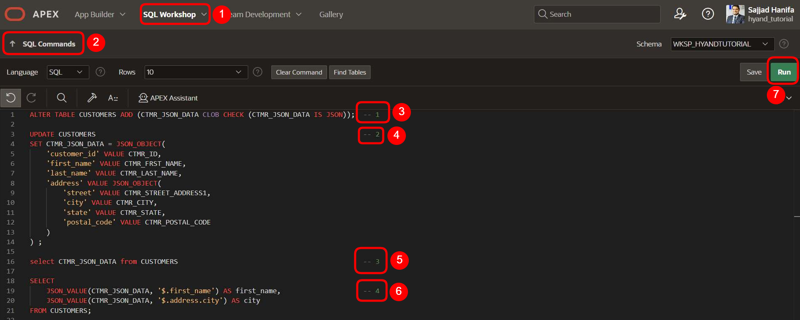  

---

 ## <a name="schritt-json-daten-abfragen"></a>Schritt 2: JSON-Daten abfragen  

1. Führen Sie im **SQL Commands**-Fenster den folgenden Befehl aus:  

   ```sql
   SELECT CTMR_JSON_DATA FROM CUSTOMERS;
   ```
2. Vergleichen Sie das Ergebnis mit der Darstellung im Bild.

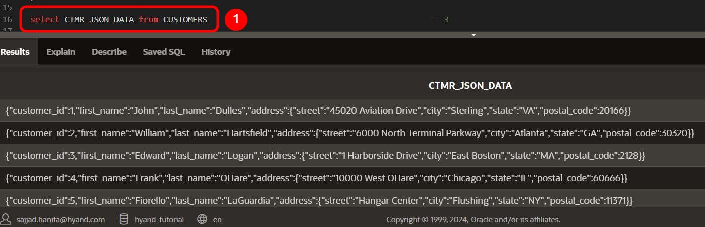 

---

## <a name="schritt-json-werte-extrahieren"></a>Schritt 3: JSON-Werte extrahieren  

1. Führen Sie im **SQL Commands**-Fenster den folgenden Befehl aus, um gezielt JSON-Werte abzurufen:  

   ```sql
   SELECT 
       JSON_VALUE(CTMR_JSON_DATA, '$.first_name') AS first_name,
       JSON_VALUE(CTMR_JSON_DATA, '$.address.city') AS city
   FROM CUSTOMERS;
   ```
2. Vergleichen Sie das Ergebnis mit der Darstellung im Bild.

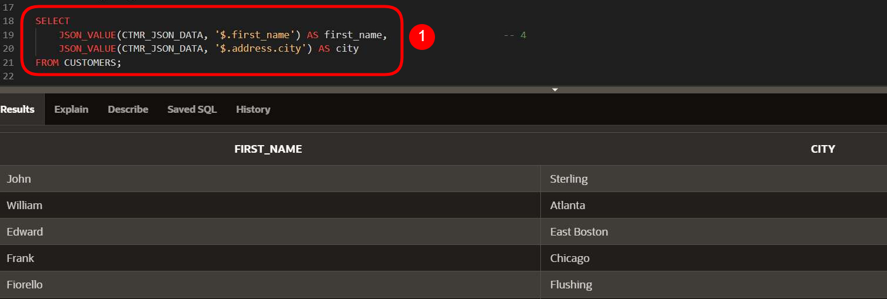 

---

## <a name="schritt-json-datenquelle-erstellen"></a>Schritt 4: JSON-Datenquelle erstellen  

1. Klicken Sie auf **Application**, um zur aktuellen Anwendung zu wechseln.  
2. Wählen Sie den Reiter **Shared Components** aus.  
3. Scrollen Sie nach unten zum Bereich **Data Sources**.  
4. Klicken Sie auf **JSON Sources**, um eine neue JSON-Datenquelle zu erstellen.  

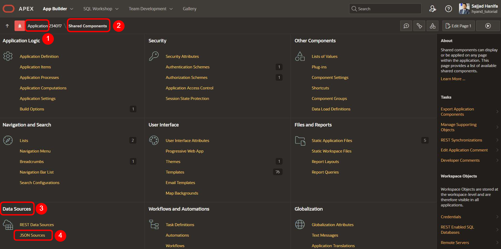  

---

## <a name="schritt-neue-json-datenquelle-erstellen"></a>Schritt 5: Neue JSON-Datenquelle erstellen  

1. Der Bereich **JSON Sources** ist aktuell leer, da noch keine JSON-Datenquelle vorhanden ist.  
2. Klicken Sie auf **Create**, um eine neue JSON-Datenquelle anzulegen.  

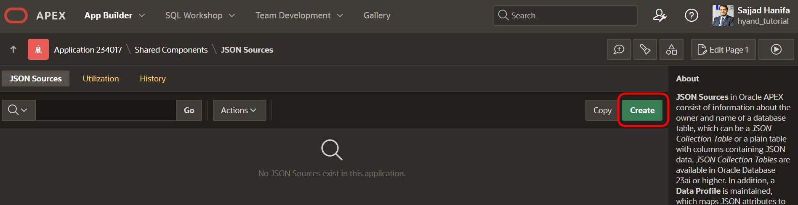  

---

## <a name="schritt-json-datenquelle-konfigurieren"></a>Schritt 6: JSON-Datenquelle konfigurieren  

Nachdem Sie auf **Create** geklickt haben, öffnet sich ein **Pop-up-Fenster** zur Konfiguration der JSON-Datenquelle. Hier geben Sie die grundlegenden Informationen für die JSON-Quelle ein.  

1. Geben Sie im Feld **Name** den Wert **customer_json_table** ein, um die JSON-Datenquelle zu benennen.  
2. Wählen Sie als **Table with JSON Columns** die Tabelle **CUSTOMERS** aus, die die JSON-Daten enthält.  
3. Klicken Sie auf **Next**, um die Einrichtung fortzusetzen.  

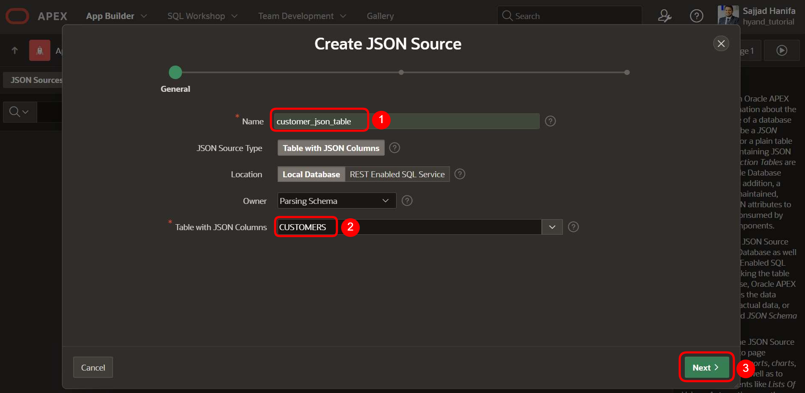  

---

## <a name="schritt-json-spalte-auswählen"></a>Schritt 7: JSON-Spalte auswählen  

Im nächsten Schritt müssen Sie die JSON-Spalte definieren, die für die Datenquelle verwendet wird.  

1. Wählen Sie im Dropdown-Menü unter **JSON Column 1** die Spalte **CTMR_JSON_DATA (Clob)** aus, die die JSON-Daten enthält.  
2. Klicken Sie anschließend auf **Next**, um fortzufahren.  

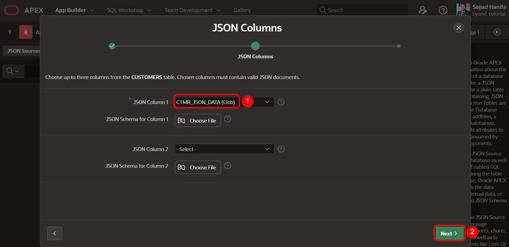  


---

## <a name="schritt-datenprofil-überprüfen"></a>Schritt 8: Datenprofil überprüfen  

Oracle APEX erstellt automatisch ein **Datenprofil** basierend auf der JSON-Quelle. Hier müssen einige Anpassungen vorgenommen werden.  

1. Setzen Sie ein Häkchen in der **Primary Key**-Spalte für **CTMR_ID**, um es als Primärschlüssel zu definieren.  
2. Scrollen Sie nach unten, um die restlichen Spalten zu überprüfen.   

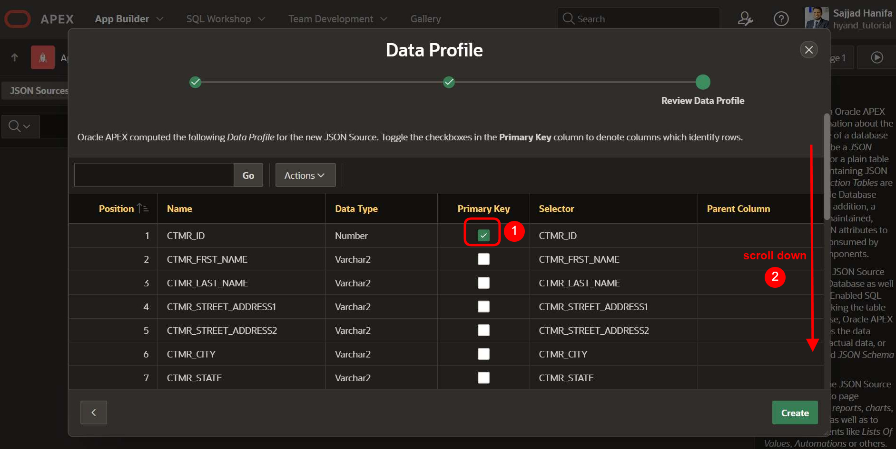  


---

## <a name="schritt-datenprofil-fertigstellen"></a>Schritt 9: Datenprofil fertigstellen  

Nachdem die Primärschlüssel-Spalte ausgewählt wurde, müssen weitere relevante Spalten für die JSON-Verarbeitung markiert werden.  

1. Scrollen Sie erneut nach unten, um zusätzliche Spalten zu sehen.  
2. Aktivieren Sie die Kontrollkästchen für folgende Spalten:  
   - **address.city**  
   - **address.state**  
   - **address.street**  
   - **address.postal_code**  
   - **last_name**  
   - **first_name**  
   - **customer_id**  
3. Klicken Sie auf **Create**, um die JSON-Quelle abzuschließen.  

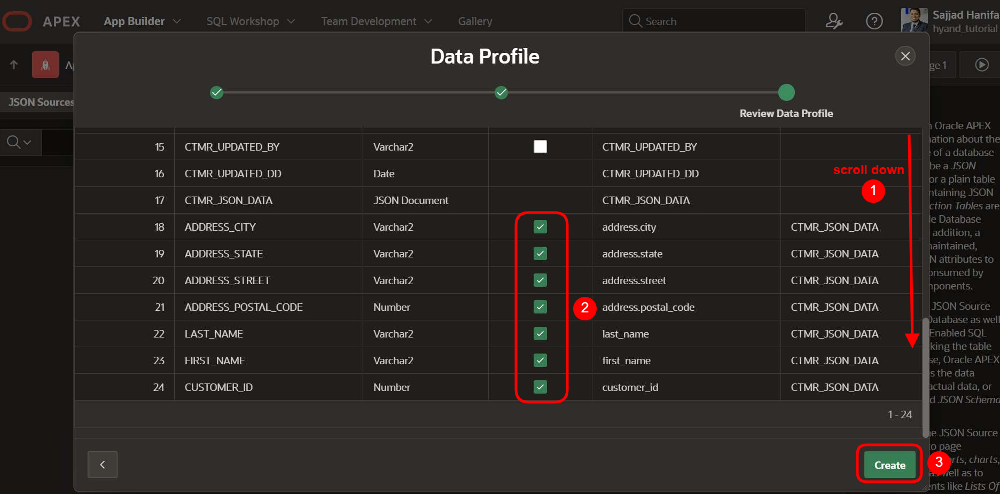  


---

## <a name="schritt-json-source-überprüfen"></a>Schritt 10: JSON Source erfolgreich erstellt  

Nachdem der JSON Source erfolgreich erstellt wurde, erscheint eine Bestätigungsmeldung und der Eintrag ist in der Liste sichtbar.  

1. Überprüfen Sie die grüne Bestätigungsmeldung **"JSON Source created."**, um sicherzustellen, dass die Erstellung erfolgreich war.  
2. Der neu erstellte JSON Source **customer_json_table** sollte nun in der Tabelle erscheinen.  

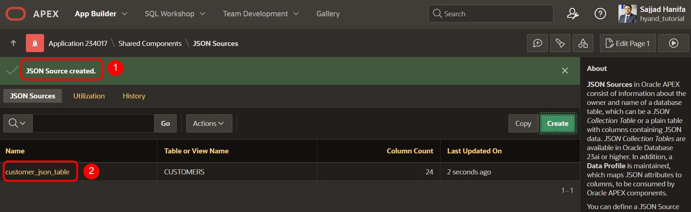  


---

## <a name="schritt-neue-seite-erstellen"></a>Schritt 11: Neue Seite erstellen  

Um die JSON-Daten in einem Bericht anzuzeigen, muss eine neue Seite in der APEX-Anwendung erstellt werden.  

1. Kehren Sie zur **Anwendungsübersicht** zurück.  
2. Klicken Sie auf **Create Page**, um eine neue Seite zu erstellen.  
3. Wählen Sie **Classic Report** als Seitentyp aus.  
4. Klicken Sie auf **Next**, um fortzufahren.  

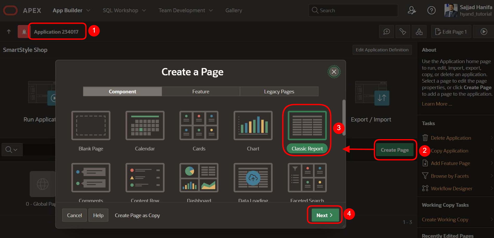  


---

## <a name="schritt-classic-report-definieren"></a>Schritt 12: Classic Report definieren  

Nachdem die neue Seite erstellt wurde, müssen die Einstellungen für den **Classic Report** konfiguriert werden.  

1. **Page Number**: Geben Sie eine Seitenzahl ein, z. B. **10**.  
2. **Name**: Setzen Sie den Namen auf **JSON Report**.  
3. **Data Source**: Wählen Sie **JSON Source** als Datenquelle.  
4. **JSON Source**: Wählen Sie **customer_json_table** aus.  
5. **Icon**: Verwenden Sie das Symbol **fa-file-json-o**, um die Seite visuell zu kennzeichnen.  
6. Klicken Sie auf **Create Page**, um die Seite zu erstellen.  

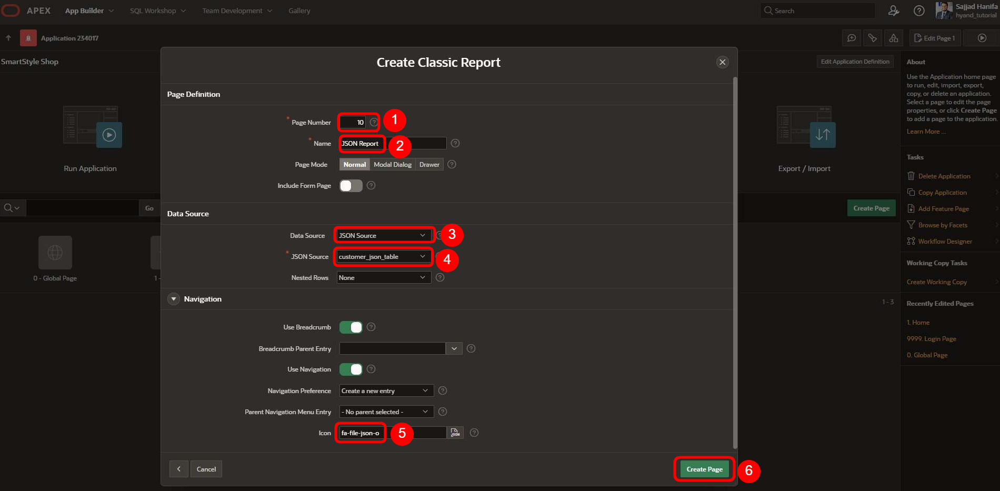  


---

## <a name="schritt-json-report-überprüfen"></a>Schritt 13: JSON Report überprüfen und Spalten öffnen  

Nachdem die Seite erstellt wurde, erscheint eine Bestätigungsmeldung. Jetzt können die Spalten für den Report angepasst werden.  

1. Stellen Sie sicher, dass Sie sich auf **Seite 10 (JSON Report)** befinden.  
2. Überprüfen Sie die Bestätigungsmeldung **"Classic Report page created."**, um sicherzugehen, dass die Seite erfolgreich erstellt wurde.  
3. Klappen Sie den Bereich **Columns** auf, um die Spalten des Reports zu verwalten.  

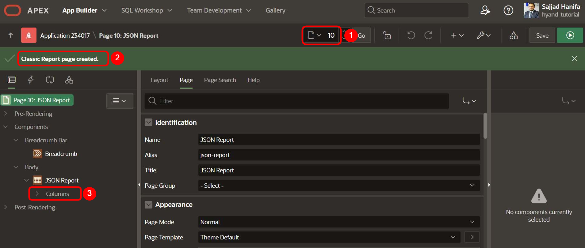  


---

## <a name="schritt-spalten-sortieren"></a>Schritt 14: Spalten sortieren und ausblenden  

Nachdem die JSON-Report-Seite erstellt wurde, müssen die Spalten sortiert und nicht benötigte Spalten ausgeblendet werden.  

1. **Spalten organisieren**  
   - Behalten Sie nur die folgenden Spalten sichtbar:
     - **FIRST_NAME**  
     - **LAST_NAME**  
     - **ADDRESS_STREET**  
     - **ADDRESS_POSTAL_CODE**  
     - **ADDRESS_CITY**  
     - **ADDRESS_STATE**  
   - Alle anderen Spalten werden als **kommentiert (ausgeblendet)** markiert.  

2. **Anschließend speichern und ausführen**  
   - Klicken Sie auf den **Speichern-Button**.  
   - Klicken Sie dann auf den **Ausführen-Button**, um die Änderungen zu überprüfen.  

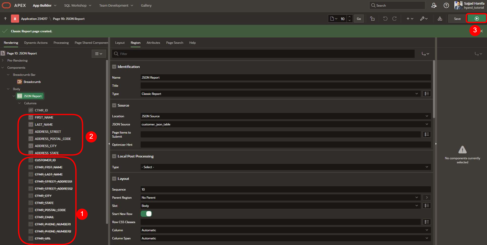  


---

## <a name="schritt-ergebnisprüfung"></a>Schritt 15: Ergebnisprüfung  

Nachdem alle Anpassungen vorgenommen wurden, sollte die JSON-Report-Seite nun korrekt dargestellt werden.  

1. **Seite ausführen**  
   - Klicken Sie auf den **Ausführen-Button**, um die Seite in der Anwendung zu öffnen.  

2. **Datenüberprüfung**  
   - Die Seite sollte eine **Tabelle mit den ausgewählten Spalten** anzeigen:  
     - **First Name**  
     - **Last Name**  
     - **Address Street**  
     - **Address Postal Code**  
     - **Address City**  
     - **Address State**  

3. **Finale Validierung**  
   - Überprüfen Sie, ob die Daten korrekt aus dem JSON-Source geladen werden und mit den vorherigen Schritten übereinstimmen.  

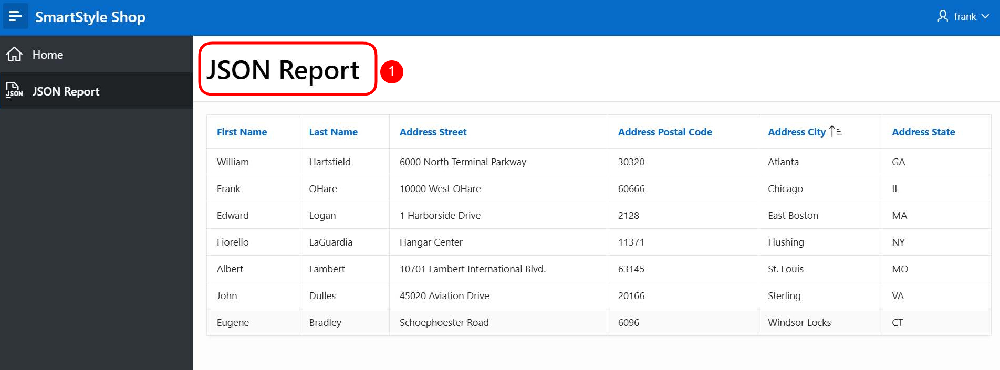  


---

## <a name="abschluss"></a>Abschluss  

Herzlichen Glückwunsch! Sie haben erfolgreich eine **JSON-Datenquelle in Oracle APEX** integriert und einen **dynamischen JSON-Report** erstellt.  

Vielen Dank fürs Mitmachen

 
 


