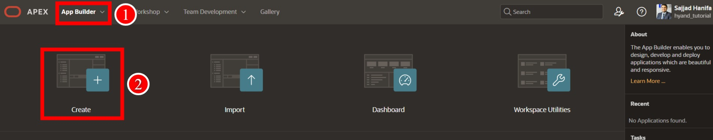

#  23. Oracle APEX und AI - RAG Daten
# Bereitstellung von RAG-Daten für KI-Anrufe

In diesem Kapitel werden wir drei verschiedene Funktionen von AI in Kombination mit Oracle APEX testen. Dabei konzentrieren wir uns auf den Einsatz von KI-Bots in verschiedenen bereichen. z.b haben wir erstmal einen public bot, der auskunft über alle artikel an public user ausgibt.
dann werden wir einen weitere ki-bot erstellen, der bezogen auf den eingeloggten kunden bestellungsdetails auskunft ausgibt.
diese 2 szenarion werden wir hier durch gehen.

 

## Schritt 1: Zugriff auf den App Builder

Um mit der Erstellung des AI-Dienstes zu beginnen, navigieren Sie zunächst zum **App Builder**.

1. Klicken Sie im Hauptmenü auf **App Builder**.
2. Wählen Sie dann **Workspace Utilities**, um weitere Tools zu nutzen.

---

 