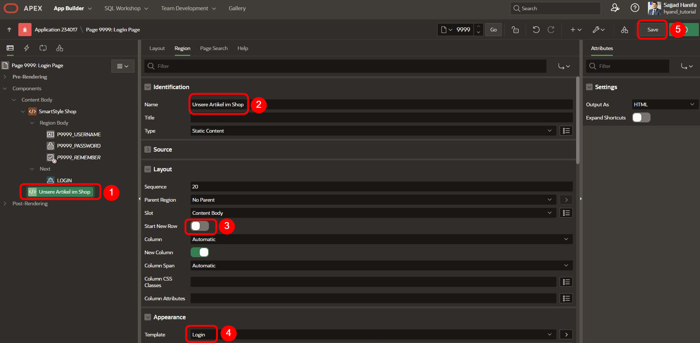

# <a name="oracle-apex-und-ai"></a> 23. Oracle APEX und AI - RAG Daten  

## <a name="einleitung-ai"></a>Einleitung  

In diesem Kapitel befassen wir uns mit der Integration von **Retrieval-Augmented Generation (RAG)** in **Oracle APEX**, um eine KI-gestützte Assistenz für Benutzer bereitzustellen. Der Fokus liegt darauf, wie KI-Anfragen mit **strukturieren Daten aus der Datenbank** kombiniert werden können, um gezielte und relevante Antworten zu liefern.  

Das Tutorial gliedert sich in zwei zentrale Szenarien:  

1. **Teil 1: Öffentliche Produktanfragen (Public Bot)**  
   - Ein **KI-gestützter Assistent**, der **nicht angemeldeten Benutzern** Produktinformationen bereitstellt.  
   - Besucher erhalten Auskunft über **Produktnamen, Beschreibungen, Preise und Verfügbarkeit**, ohne sich registrieren oder anmelden zu müssen.  

2. **Teil 2: Personalisierte Bestellinformationen für Kunden (Kunden-Bot)**  
   - Ein **KI-gestützter Assistent**, der **angemeldeten Kunden** detaillierte Informationen zu ihren **Bestellungen und Bestellstatus** bereitstellt.  
   - Die KI greift auf **kundenbezogene Daten** zu, wie z. B. **Bestelldatum, Gesamtbetrag, enthaltene Artikel und Kreditlimit**.  

Im ersten Teil des Tutorials konzentrieren wir uns auf die Umsetzung des **Public Bots**, mit dem **nicht angemeldete Nutzer** durch eine KI-Produktauskunft Informationen zu Artikeln abrufen können. Im zweiten Teil wird ein **kundenindividueller Bestellassistent** implementiert, der nur für angemeldete Benutzer relevante Bestelldetails bereitstellt.  

## <a name="schritt-zugriff-auf-den-app-builder"></a>Schritt 1: Zugriff auf den App Builder

Um mit der Erstellung des AI-Dienstes zu beginnen, navigieren Sie zunächst zum **App Builder**.

1. Klicken Sie im Hauptmenü auf **App Builder**.
2. Wählen Sie dann **Workspace Utilities**, um weitere Tools zu nutzen.


## <a name="schritt-anlegen-einer-neuen-applikation"></a>Schritt 2: Anlegen einer neuen Applikation  

Nachdem Sie den **App Builder** aufgerufen haben, können Sie nun eine neue Applikation erstellen.  

1. Geben Sie einen Namen für die Applikation ein, beispielsweise **SmartStyle Shop**.  
2. Klicken Sie anschließend auf **Create Application**, um die Applikation zu erstellen.  

  


---

## <a name="schritt-zugriff-auf-shared-components"></a>Schritt 3: Zugriff auf Shared Components  

Nachdem die Applikation erfolgreich erstellt wurde, navigieren Sie zu den **Shared Components**, um weitere Einstellungen vorzunehmen.  

1. Öffnen Sie die erstellte Applikation.  
2. Klicken Sie im Menü auf **Shared Components**, wie im folgenden Bild dargestellt.  

 

---

## <a name="schritt-zugriff-auf-ai-services"></a>Schritt 4: Zugriff auf AI Services  

Sobald Sie die **Shared Components** geöffnet haben, scrollen Sie nach unten, bis Sie den Bereich **Generative AI** erreichen.  

1. Scrollen Sie nach unten, bis der Abschnitt **Generative AI** sichtbar ist.  
2. Wählen Sie anschließend **AI Services** aus.  

  

---

## <a name="schritt-erstellen-eines-neuen-ai-service"></a>Schritt 5: Erstellen eines neuen AI Service  

Nun können Sie einen neuen AI Service anlegen.  

1. Klicken Sie auf der rechten Seite auf den **Create**-Button.  

  

---

## <a name="schritt-konfiguration-des-ai-service"></a>Schritt 6: Konfiguration des AI Service  

In diesem Schritt müssen verschiedene Einstellungen vorgenommen werden. Zusätzlich benötigen Sie einen **API Key** des zuvor ausgewählten AI Service. In diesem Beispiel wird der AI Service von **OpenAI** verwendet.  

1. Wählen Sie unter **AI Provider** den gewünschten Anbieter aus, in diesem Fall **OpenAI**.  
2. Geben Sie einen **Namen** für den AI Service ein.  
3. Vergeben Sie eine **Static ID** für die Identifikation.  
4. Aktivieren Sie die Option **Used by App Builder**, falls der AI Service in der Anwendung genutzt werden soll.  
5. Tragen Sie die **Base URL** des Anbieters ein, hier: `https://api.openai.com/v1`.  
6. Wählen Sie unter **Credential** die Option **Create New** aus.  
7. Geben Sie den API Key ein, den Sie von OpenAI erhalten haben.  
8. Wählen Sie das **AI Model**, z. B. `gpt-4o`.  
9. Testen Sie die Verbindung, indem Sie auf **Test Connection** klicken.  
10. Wenn die Verbindung erfolgreich ist, erscheint die Meldung **Connection Succeeded!**.  
11. Abschließend klicken Sie auf **Create**, um den AI Service zu speichern.  

  

---

## <a name="schritt-erfolgreiche-erstellung-und-rückkehr-zu-shared-components"></a>Schritt 7: Erfolgreiche Erstellung und Rückkehr zu Shared Components  

Nachdem der AI Service erfolgreich erstellt wurde, erscheint eine **Erfolgsmeldung** auf dem Bildschirm.  

1. Stellen Sie sicher, dass die Meldung **"Changes applied."** angezeigt wird, was bestätigt, dass der AI Service erfolgreich eingerichtet wurde.  
2. Klicken Sie auf das **Shared Components-Symbol**, um zurück zur Übersicht der Shared Components zu gelangen.  

  

---

## <a name="schritt-zugriff-auf-ai-configurations"></a>Schritt 8: Zugriff auf AI Configurations  

Anschließend scrollen Sie wieder nach unten, bis Sie den Abschnitt **Generative AI** erreichen.  

1. Scrollen Sie nach unten, bis der Bereich **Generative AI** sichtbar ist.  
2. Wählen Sie anschließend **AI Configurations** aus.  

 

---

## <a name="schritt-erstellen-einer-neuen-ai-configuration"></a>Schritt 9: Erstellen einer neuen AI Configuration  

Nun können Sie eine **AI Configuration** anlegen, um den generativen KI-Dienst weiter zu konfigurieren.  

1. Klicken Sie auf den **Create**-Button, um eine neue AI Configuration zu erstellen.  

  

---

## <a name="Konfigurieren-der-AI-Configuration"></a>Schritt 10: Konfigurieren der AI Configuration

In diesem Schritt legen Sie die Parameter für die **Generative AI Configuration** fest.

1. Geben Sie einen **Namen** für die Konfiguration ein:  
   **Produktauskunft für Besucher**  
   - Die **Static ID** wird automatisch generiert.

2. Wählen Sie den zuvor erstellten **AI Service** aus (hier: **OpenAI**).

3. Geben Sie den folgenden **System Prompt** ein:

>   Du bist "InfoBot", ein virtueller Assistent für SmartStyle Shop.  
>   Deine Aufgabe ist es, öffentlichen Nutzern Informationen zu unseren Artikeln bereitzustellen.  
>   Du hast Zugriff auf die Artikeldatenbank und kannst folgende Informationen abrufen:
>
>   - PRDT_INFO_NAME: Name des Artikels  
>   - PRDT_INFO_DESCR: Beschreibung des Artikels  
>   - PRDT_INFO_CATEGORY: Kategorie (z. B. Herrenmode, Damenmode)  
>   - PRDT_INFO_AVAIL: Verfügbarkeit (Y = verfügbar, N = nicht verfügbar)  
>   - PRDT_INFO_LIST_PRICE: Preis des Artikels  
>   - PRDT_INFO_TAGS: Zusätzliche Tags (z. B. Bestseller)  
>
>   Antwortverhalten:
>   1. Beantworte Anfragen zu Artikeln basierend auf den verfügbaren Daten.  
>   2. Falls ein Artikel nicht verfügbar ist, informiere den Nutzer höflich.  
>   3. Falls keine Daten gefunden werden, erkläre dem Nutzer, dass das Produkt möglicherweise nicht im Sortiment ist.  
>   4. Vermeide persönliche oder kundenbezogene Informationen – dein Fokus liegt ausschließlich auf den Produkten.  
>   5. Falls der Nutzer nach weiteren Details fragt, gib eine präzise Antwort auf Basis der Produktdaten.  
>
>   Beispielhafte Kundenanfragen & erwartete Antworten:
>
>   - "Welche Business-Hemden habt ihr?"  
>      Zeige alle Artikel mit PRDT_INFO_CATEGORY = 'Mens' und dem Wort "Shirt" im Namen.  
>
>   - "Wie teuer ist die Bluse?"  
>      Suche den Artikel "Blouse" in der Datenbank und gib den Preis zurück.  
>
>   - "Gibt es passende Hosen zu den Business-Shirts?"  
>      Falls in der Datenbank vorhanden, gib die passenden Hosen aus der Kategorie Mens zurück.  
>
>   - "Welche Artikel sind Bestseller?"  
>      Zeige alle Artikel mit dem Tag TOP SELLER in PRDT_INFO_TAGS.  
>
>   Verhalten bei Fehlern oder fehlenden Daten:
>   - Falls ein Artikel nicht gefunden wird, sage höflich, dass das Produkt aktuell nicht verfügbar ist.  
>   - Falls der Nutzer nach einem nicht existierenden Produkt fragt, erkläre, dass es nicht in unserem Sortiment ist.  
>
>   Du bist ein professioneller und hilfsbereiter Assistent. Stelle sicher, dass deine Antworten klar, korrekt und freundlich sind.

4. Geben Sie die folgende **Welcome Message** ein:

>   Willkommen bei SmartStyle Shop  
>   Ich bin InfoBot, dein virtueller Assistent für Produktinformationen.  
>   Ich kann dir helfen, Informationen zu unseren Artikeln zu finden, einschließlich Verfügbarkeit, Preis und Beschreibung.  
>   Wie kann ich dir heute helfen?  

5. Optional: Aktivieren Sie **Return To Page**, um nach dem Speichern zur vorherigen Seite zurückzukehren.

6. Klicken Sie auf **Create**, um die AI Configuration zu speichern.


---

## <a name="schritt-erstellen-einer-rag-source"></a>Schritt 11: Erstellen einer RAG Source  

Nachdem Sie die **AI Configuration** gespeichert haben, wird die Option **RAG Sources** sichtbar. Nun können Sie eine **RAG Source** hinzufügen, um externe Datenquellen für die KI-Abfragen bereitzustellen.  

1. Scrollen Sie nach unten zum Abschnitt **RAG Sources**.  
2. Klicken Sie auf **Create RAG Source**, um eine neue Datenquelle hinzuzufügen.  

  

--- 


## <a name="schritt-rag-source-erstellen"></a>Schritt 12: RAG Source erstellen  

Nun wird eine **RAG Source** erstellt, die als Datenquelle für den KI-Dienst dient.  

1. Geben Sie einen **Namen** für die RAG Source ein, z. B. **Produktauskunft**.  
2. Wählen Sie als **Typ** die Option **SQL Query**.  
3. Geben Sie die folgende **SQL-Abfrage** ein, um relevante Produktinformationen aus der Datenbank abzurufen:  

  ```sql
  SELECT PRDT_INFO_NAME,
         PRDT_INFO_DESCR,
         PRDT_INFO_CATEGORY,
         PRDT_INFO_AVAIL,
         PRDT_INFO_LIST_PRICE,
         PRDT_INFO_TAGS
  FROM PRODUCT_INFO;
  ```

4. Klicken Sie auf **Create**, um die RAG Source zu speichern.

  

--- 

## <a name="schritt-änderungen-speichern-und-rag-source-bestätigen"></a>Schritt 13: Änderungen speichern und RAG Source bestätigen  

Nachdem die **RAG Source** erfolgreich erstellt wurde, kehren Sie automatisch zur **AI Configuration**-Seite zurück.  

1. Eine **Erfolgsmeldung** mit "Changes Saved" bestätigt, dass die Änderungen gespeichert wurden.  
2. Die neu erstellte **RAG Source** wird nun in der Liste angezeigt.  
3. Klicken Sie auf **Apply Changes**, um alle Änderungen zu übernehmen und die Konfiguration abzuschließen.  

  

---

## <a name="schritt-übersicht-der-ai-configurations-und-erstellen-einer-neuen"></a>Schritt 14: Übersicht der AI Configurations und Erstellen einer neuen  

Nachdem die erste **AI Configuration** erfolgreich erstellt wurde, gelangen Sie zurück zur Übersicht der **Generative AI Configurations**.  

1. Die aktuelle **AI Configuration** ist nun sichtbar.  
2. Die erstellte Konfiguration **"Produktauskunft für Besucher"** ist in der Liste aufgeführt.  
3. Klicken Sie auf **Create**, um eine weitere **AI Configuration** zu erstellen.  

  

---

## <a name="Erstellen-einer-neuen-AI-Configuration-für-Bestellauskünfte"></a>Schritt 15: Erstellen einer neuen AI Configuration für Bestellauskünfte
 
Im nächsten Schritt erstellen wir einen weiteren KI-Bot, der Bestellinformationen für den angemeldeten App-Nutzer bereitstellt.

1. Geben Sie den Namen **"Bestellungsauskunft für Kunden"** ein.
   - Die **Static ID** wird automatisch generiert.

2. Wählen Sie den zuvor erstellten **AI Service** (z. B. OpenAI).

3. Geben Sie den folgenden **System Prompt** ein:

>   Du bist "OrderBot", ein virtueller Assistent für SmartStyle Shop.  
>   Deine Aufgabe ist es, Bestellinformationen für einen bestimmten Kunden bereitzustellen.  
>   Du hast Zugriff auf Kundendaten und Bestellhistorie, um präzise Auskünfte zu geben.  
>
>   Daten, auf die du Zugriff hast:
>   - Kundeninformationen: Vorname, Nachname, Adresse, Stadt, Bundesstaat, Postleitzahl, Telefonnummer, Kreditlimit  
>   - Bestellungen: Gesamtbetrag, Bestelldatum, Tags  
>   - Bestellpositionen: Einzelpreise der Artikel, Anzahl der Artikel  
>   - Standortdaten: Bundesstaat-Code, Bundesstaat-Name  
>
>   Antwortverhalten:
>   1. Beantworte Anfragen zu einem bestimmten Kunden basierend auf den bereitgestellten Daten.  
>   2. Falls ein Kunde nach seinem Bestellstatus fragt, suche die relevanteste Bestellung.  
>   3. Falls nach spezifischen Artikeln innerhalb einer Bestellung gefragt wird, gib die Preise und Mengen aus.  
>   4. Falls die Kreditlimit-Information benötigt wird, stelle diese bereit.  
>   5. Falls keine Daten verfügbar sind, informiere den Nutzer höflich.  
>   6. Vermeide die Weitergabe von Daten anderer Kunden oder nicht vorhandene Informationen.  
>
>   Beispielhafte Kundenanfragen & erwartete Antworten:
>
>   - "Wie hoch war meine letzte Bestellung?"  
>      Suche den neuesten Eintrag in den Bestelldaten und gib den Gesamtbetrag zurück.  
>
>   - "Welche Artikel waren in meiner Bestellung vom 27.09.2016?"  
>      Gib die Liste der bestellten Artikel mit Preis und Menge aus.  
>
>   - "Wie hoch ist mein aktuelles Kreditlimit?"  
>      Suche die Kreditlimit-Information für den Kunden und gib den Betrag zurück.  
>
>   - "Welche Bestellungen habe ich in Illinois getätigt?"  
>      Filtere Bestellungen basierend auf dem Bundesstaat und gib die Ergebnisse aus.  
>
>   Verhalten bei Fehlern oder fehlenden Daten:
>   - Falls der Kunde eine ungültige Bestellnummer oder ein falsches Datum angibt, frage höflich nach einer gültigen Angabe.  
>   - Falls keine Bestellungen gefunden werden, erkläre dies und biete eine alternative Möglichkeit zur Überprüfung an (z. B. Kundenservice kontaktieren).  
>
>   Du bist ein professioneller und hilfsbereiter Assistent. Stelle sicher, dass deine Antworten klar, korrekt und freundlich sind.

4. Geben Sie die folgende **Welcome Message** ein:

>   Willkommen bei SmartStyle Shop.  
>   Ich bin OrderBot, dein virtueller Assistent für Bestellinformationen.  
>   Ich kann dir helfen, den Status deiner Bestellungen einzusehen, deine Artikelhistorie abzurufen oder dein Kreditlimit zu prüfen.  
>   Wie kann ich dir heute helfen?  

5. Aktivieren Sie die Option **Return To Page**, um nach dem Speichern zur vorherigen Seite zurückzukehren.

6. Klicken Sie auf **Create**, um die neue AI Configuration zu speichern.

  

---
 
## <a name="schritt-erfolgreiches-speichern-und-rag-source-erstellen"></a>Schritt 16: Erfolgreiches Speichern und RAG Source erstellen  

Nachdem die **AI Configuration** erfolgreich gespeichert wurde, erscheint die **Erfolgsmeldung** "Changes Saved".  

1. Die grüne **Erfolgsmeldung** bestätigt, dass die Änderungen gespeichert wurden.  
2. Nun können Sie eine **RAG Source** hinzufügen, indem Sie auf **Create RAG Source** klicken.  

  

---

## <a name="schritt-rag-source-für-bestellauskünfte-erstellen"></a>Schritt 17: RAG Source für Bestellauskünfte erstellen  

Nun wird eine **RAG Source** erstellt, die Bestellinformationen für den aktuell angemeldeten Nutzer abrufen kann.  

1. Geben Sie den **Namen** der RAG Source ein, z. B. **Bestellungsauskunft**.  
2. Wählen Sie als **Typ** die Option **SQL Query**.  
3. Geben Sie die folgende **SQL-Abfrage** ein, um Bestellungen des aktuellen Nutzers abzufragen:  

  ```sql
  SELECT *
  FROM CUSTOMERS
  JOIN ORDERS ON (CTMR_ID = ORDR_CTMR_ID)
  JOIN ORDER_ITEMS ON (ORDR_ID = ORDR_ITEM_ORDR_ID)
  JOIN STATES ON (STTS_ST = CTMR_STATE)
  WHERE LOWER(CTMR_FRST_NAME) = LOWER(:APP_USER)
  ```

 

4. Klicken Sie auf **Create**, um die RAG Source zu speichern.

---

## <a name="schritt-erfolgreiches-speichern-und-abschließen-der-rag-source"></a>Schritt 18: Erfolgreiches Speichern und Abschließen der RAG Source  

Nachdem die **RAG Source** erfolgreich erstellt wurde, erscheint eine **Erfolgsmeldung** und die neue Datenquelle wird in der Liste angezeigt.  

1. Die grüne **Erfolgsmeldung** "Changes Saved" bestätigt, dass die Änderungen gespeichert wurden.  
2. Die soeben erstellte **RAG Source** ist nun in der Übersicht sichtbar.  
3. Klicken Sie abschließend auf **Apply Changes**, um alle Änderungen zu übernehmen.  

  

---

## <a name="schritt-übersicht-der-erstellten-ai-configurations-und-wechsel-zur-app"></a>Schritt 19: Übersicht der erstellten AI Configurations und Wechsel zur App  

Nachdem beide **AI Configurations** erfolgreich erstellt wurden, erscheinen sie nun in der Übersicht.  

1. Die erstellten **AI Configurations** für **Bestellungsauskunft für Kunden** und **Produktauskunft für Besucher** sind in der Liste sichtbar.  
2. Jede Konfiguration enthält die zugehörige **RAG Source**, die zur Generierung der Antworten verwendet wird.  
3. Klicken Sie auf **Application **, um zur Haupt-App zurückzukehren und dort weiterzuarbeiten.  

  

---

## <a name="schritt-login-seite-öffnen"></a>Schritt 20: Login-Seite öffnen  

Wechseln Sie nun zur **Login-Seite**, um die Anmeldefunktion der Anwendung zu überprüfen oder anzupassen.  

1. Klicken Sie auf die **Login Page (9999)**, um die Anmeldeeinstellungen zu bearbeiten.  

  

---


## <a name="schritt-anpassung-der-login-seite"></a>Schritt 21: Anpassung der Login-Seite  

Auf der **Login-Seite (9999)** nehmen Sie nun einige Anpassungen vor, um eine zusätzliche **Region** für die Anzeige von Artikeln hinzuzufügen.  

1. **Neue Region erstellen**:  
   - Erstellen Sie eine neue **Region** mit dem Namen **"Unsere Artikel im Shop"**.  

2. **Einstellungen der Region anpassen**:  
   - Setzen Sie den **Namen** der Region auf **"Unsere Artikel im Shop"**.  
   - Der **Typ** bleibt **Static Content**.  

3. **Layout-Anpassungen vornehmen**:  
   - Setzen Sie **Start New Row** auf **Deaktiviert**.  
   - Lassen Sie die **Column**-Einstellung auf **Automatisch**.  

4. **Template setzen**:  
   - Wählen Sie unter **Appearance** das **Template "Login"**.  

5. **Speichern**:  
   - Klicken Sie abschließend auf **Save**, um die Änderungen zu sichern.  

  

---

## <a name="schritt-button-hinzufügen"></a>Schritt 22: Button zur KI-gestützten Artikelsuche hinzufügen  

In der zuvor erstellten **Region "Unsere Artikel im Shop"** fügen Sie nun einen **Button** hinzu, der den Zugriff auf die KI-gestützte Artikelsuche ermöglicht.  

1. **Button erstellen**:  
   - Erstellen Sie einen neuen **Button** innerhalb der Region **"Unsere Artikel im Shop"**.  
   - Setzen Sie den **Button Name** auf **`P9999_GET_ARTICLE_INFO`**.  
   - Vergeben Sie die **Bezeichnung (Label)**: **"AI-basierte Artikelsuche und -beratung"**.  

2. **Button-Template festlegen**:  
   - Wählen Sie als **Button Template**: **"Text with Icon"**.  

3. **Template-Optionen anpassen**:  
   - Unter **Template Options** setzen Sie:  
     - **Common** → **Type: Success**  
     - **Advanced** → **Width: Stretch**  
     - **Spacing** → **Bottom: Large**  

4. **Icon hinzufügen**:  
   - Verwenden Sie als **Icon**: **`fa-ai-square`**.  

5. **Änderungen speichern**:  
   - Klicken Sie abschließend auf **Save**, um die Konfiguration zu sichern.  

  

---

## <a name="schritt-subregion-erstellen"></a>Schritt 23: Subregion "Artikel Report" erstellen  

Um eine Übersicht über die Artikel im Shop bereitzustellen, fügen wir innerhalb der Region **"Unsere Artikel im Shop"** eine **Subregion** hinzu, die als **Classic Report** dient.  

### 1. **Subregion hinzufügen**  
- Erstellen Sie eine **Subregion** mit dem Namen **"Artikel Report"** innerhalb der Region **"Unsere Artikel im Shop"**.  
- Setzen Sie den **Typ** auf **"Classic Report"**.  

### 2. **Datenquelle konfigurieren**  
- Wählen Sie als **Location**: **Local Database**.  
- Setzen Sie den **Type** auf **"Table / View"**.  
- Wählen Sie als **Table Name** die zuvor erstellte **View `PRODUCT_INFO_VIEW`**.  

### 3. **Template-Optionen anpassen**  
- Unter **Template Options** setzen Sie:  
  - **Common** → **Header: Hidden but accessible**  
  - **Style** → **Remove UI Decoration**  

### 4. **Attribute & Layout anpassen**  
- Wechseln Sie zum **Tab "Attributes"** und nehmen Sie folgende Anpassungen vor:  
  - **Layout → Number of Rows**: **Setzen Sie den Wert auf "2"**.  
  - **Pagination → Type**: **Row Ranges X to Y of Z (with pagination)**.  

### 5. **Änderungen speichern**  
- Klicken Sie abschließend auf **Save**, um die Einstellungen zu übernehmen.  

  

---

## <a name="schritt-überprüfung-der-login-seite"></a>Schritt 24: Überprüfung der Login-Seite  

Nach den vorgenommenen Anpassungen sollte die **Login-Seite** wie im folgenden Bild dargestellt erscheinen.  

1. **Öffentlicher Zugriff auf Artikel**  
   - Nutzer, die nicht angemeldet sind, können weiterhin die **Shop-Artikel** einsehen.  
   - Der **Artikel-Report** wird neben dem Anmeldeformular angezeigt.  

2. **Funktionalität der Shop-Übersicht**  
   - Jeder Besucher kann ohne Account alle verfügbaren Artikel durchsuchen.  
   - Die **AI-basierte Artikelsuche und -beratung** steht zur Verfügung, um gezielte Informationen zu erhalten.  

3. **Nächster Schritt: Implementierung des InfoBots**  
   - Im nächsten Schritt werden wir den **InfoBot** einrichten, sodass Besucher noch detailliertere Informationen zu den Artikeln erhalten können.  

  

---


## <a name="schritt-integration-des-info-bots"></a>Schritt 25: Integration des InfoBots  

In diesem Schritt wird eine **dynamische Aktion** erstellt, die es ermöglicht, den **AI-Assistenten (InfoBot)** über den Button **"AI-basierte Artikelsuche und -beratung"** zu starten.  

### 1. **Dynamische Aktion für den Button erstellen**  
   - Wählen Sie den **Button** `P9999_GET_ARTICLE_INFO` aus.  
   - Fügen Sie eine **neue dynamische Aktion** hinzu und setzen Sie:  
     - **Name**: `Click on button`  
     - **Event**: `Click`  

### 2. **Aktion für den AI-Chatbot definieren**  
   - Innerhalb der **True-Aktion** erstellen Sie eine neue Aktion:  
     - **Name**: `Open AI Chatbox`  
     - **Action**: `Show AI Assistant`  

### 3. **Konfiguration des AI-Assistenten**  
   - Wählen Sie unter **Configuration** die **AI-Konfiguration**:  
     - **Produktauskunft für Besucher**  

   - Passen Sie die **Darstellung** an:  
     - **Display As**: `Dialog`  
     - **Title**: `Produktauskunft für Besucher`  

### 4. **Speichern und Testen**  
   - Klicken Sie auf **Save**, um die Änderungen zu speichern.  
   - Führen Sie die Anwendung aus, um den AI-Assistenten zu testen.  

  

---

## <a name="schritt-interaktion-mit-dem-info-bot"></a>Schritt 26: Interaktion mit dem InfoBot  

Nach dem erfolgreichen Einrichten des AI-Assistenten können Besucher nun den **InfoBot** verwenden, um gezielt Informationen über die im Shop verfügbaren Artikel abzurufen.  

### 1. **AI-Assistent starten**  
   - Klicken Sie auf den Button **"AI-basierte Artikelsuche und -beratung"** in der Region **"Unsere Artikel im Shop"**.  
   - Der **AI-Assistent (InfoBot)** öffnet sich als Dialogfenster.  

### 2. **Anfrage an den InfoBot stellen**  
   - Nutzer können gezielte Fragen zu Produkten stellen, z. B.:  
     **"Ich suche eine Herren Hose, die aktuell im Trend ist?"**  
   - Der InfoBot verarbeitet die Anfrage basierend auf den hinterlegten Produktinformationen.  

### 3. **Antwort des InfoBots**  
   - Der InfoBot gibt eine präzise Antwort basierend auf den vorhandenen Produktdaten.  
   - Im gezeigten Beispiel schlägt der InfoBot eine **schwarze Business-Hose** vor, die als **TOP SELLER** gekennzeichnet ist und im Trend liegt.  
   - Die Antwort enthält relevante Details wie **Kategorie, Beschreibung und Preis**.  

**Wichtig**:  
   - Der InfoBot hat ausschließlich Zugriff auf **Produktinformationen**.  
   - Keine persönlichen oder kundenbezogenen Daten werden preisgegeben.  

  

---

## <a name="kundenindividuelle-bestellauskunft"></a>Teil 2: Kundenindividuelle Bestellauskunft mit KI  

Nachdem wir im ersten Teil erfolgreich einen **öffentlichen KI-Assistenten** zur **Produktauskunft für Besucher** erstellt haben, widmen wir uns nun dem zweiten Szenario:  

Hier entwickeln wir einen **kundenspezifischen KI-Bot**, der **angemeldeten Benutzern** personalisierte Informationen zu ihren Bestellungen bereitstellt.  

---

## <a name="schritt-login-seite-anpassen"></a>Schritt 1: Login-Seite anpassen  

Um die Anwendung für eine **kundenspezifische Bestellauskunft** vorzubereiten, passen wir die bestehende **Login-Seite (9999)** an.  

1. **Bestehende Login-Elemente ausblenden**:  
   - Kommentieren Sie die bestehenden **Items** `P9999_USERNAME`, `P9999_PASSWORD` und `P9999_REMEMBER` aus (*Rechtsklick → Comment Out*).  
   - Ebenso **den Login-Button** (`LOGIN`) auskommentieren.  
   - Die auskommentierten Elemente sollten nun **durchgestrichen** dargestellt werden.  

2. **Neues Item hinzufügen**:  
   - Erstellen Sie innerhalb der vorhandenen **Region** ein neues Item mit dem Namen **`P9999_CUSTOMER_NAME`**.  
   - Setzen Sie den **Item-Typ** auf **Select List**.  
   - Vergeben Sie das **Label** *"Kunden Name"*.  

3. **List of Values (LOV) definieren**:  
   - Wählen Sie als **Type**: `SQL Query`.  
   - Geben Sie die folgende **SQL-Abfrage** ein, um eine Liste eindeutiger Kundennamen aus der Datenbank bereitzustellen:  

  ```sql
  select distinct Vorname as d
       , Vorname          as r
    from CUSTOMER_ORDER_INFO_VIEW
  ```

  

---

## <a name="schritt-kundenanmeldung-button-erstellen"></a>Schritt 2: Button für die Kundenanmeldung erstellen  

Damit sich Kunden anmelden und ihre Bestellungen einsehen können, fügen wir einen neuen **Login-Button** zur **Login-Seite (9999)** hinzu.  

1. **Neuen Button hinzufügen**:  
   - Erstellen Sie einen **Button** mit dem Namen **`CUSTOMER_LOGIN`**.  
   - Vergeben Sie das **Label** *"Kunden Anmeldung"*.  

2. **Erscheinungsbild des Buttons anpassen**:  
   - Wählen Sie als **Button Template**: *Text with Icon*.  
   - Setzen Sie unter **Template Options** folgende Einstellungen:  
     - *Use Template Defaults, Success, Left, Stretch*.  
   - Als **Icon** wählen Sie `fa-sign-in`.  

3. **Verhalten des Buttons definieren**:  
   - Setzen Sie die **Aktion** des Buttons auf *Submit Page*.  

4. **Speichern**:  
   - Klicken Sie auf **Save**, um die Änderungen zu sichern.  

  

---

## <a name="schritt-login-prozess-anpassen"></a>Schritt 3: Login-Prozess für Kunden anpassen  

Nachdem wir den **Login-Button** erstellt haben, passen wir den **Login-Prozess** an, sodass sich Kunden mit ihrem Namen anmelden können.  

### 1. **Login-Prozess anpassen**  
   - Navigieren Sie zum **Processing**-Bereich der Seite 9999.  
   - Kommentieren Sie den bestehenden **Login-Prozess** aus, wie zuvor bei den Login-Elementen.  

### 2. **Neuen Login-Prozess erstellen**  
   - Erstellen Sie einen neuen **Process** mit folgenden Einstellungen:  
     - **Name**: `customer login`  
     - **Type**: *Execute Code*  
     - **Language**: *PL/SQL*  

   - Fügen Sie den folgenden **PL/SQL-Code** hinzu:  

     ```plsql
     Wwv_Flow_Custom_Auth_Std.Post_Login(
         P_UNAME        => :P9999_CUSTOMER_NAME 
       , P_PASSWORD     => null 
       , P_SESSION_ID   => :APP_SESSION
       , P_FLOW_PAGE    => :APP_ID || ':1' 
     );
     ```

### 3. **Bedingung für den Login-Prozess festlegen**  
   - Setzen Sie **"When Button Pressed"** auf `CUSTOMER_LOGIN`.  

### 4. **Speichern und Ausführen**  
   - Klicken Sie auf **Save** und anschließend auf **Run**, um die Änderungen zu testen.  

  

---


## <a name="schritt-kundenanmeldung-testen"></a>Schritt 4: Kundenanmeldung testen  

Nach den vorgenommenen Anpassungen sollte die **Login-Seite** wie folgt aussehen:  

### 1. **Seitenaufbau prüfen**  
   - Die **Standard-Login-Felder** wurden entfernt.  
   - Stattdessen gibt es ein **Dropdown-Feld**, in dem ein Kunde ausgewählt werden kann.  
   - Der **Button "Kunden Anmeldung"** dient zur Anmeldung mit dem gewählten Kundenprofil.  

### 2. **Anmeldung mit einem Kunden testen**  
   - Wählen Sie einen **beliebigen Kunden** aus der Liste.  
   - In diesem Beispiel wird **Frank** als Kunde ausgewählt.  
   - Klicken Sie auf **"Kunden Anmeldung"**, um sich mit dem gewählten Kundenkonto anzumelden.  

  

---

## <a name="schritt-anmeldebestätigung"></a>Schritt 5: Anmeldebestätigung  

Nach der Anmeldung sollte der **Name des angemeldeten Kunden** oben rechts in der **Navigationsleiste** erscheinen.  

### 1. **Anmeldung überprüfen**  
   - Nach dem erfolgreichen Login wird der **gewählte Kundenname** in der Kopfzeile angezeigt.  
   - In diesem Beispiel ist der Benutzer **Frank** angemeldet.  

### 2. **Bestätigung der Anmeldung**  
   - Falls der Kundenname nicht angezeigt wird, stellen Sie sicher, dass der **Login-Prozess** korrekt ausgeführt wurde.  
   - Bei Problemen prüfen Sie die **Session-Variablen** oder die **Authentifizierungseinstellungen**.  

  

---


## <a name="schritt-kundenbestellungen-anzeigen"></a>Schritt 6: Kundenbestellungen auf der Startseite anzeigen  

Nun erstellen wir auf der **Startseite (Seite 1)** eine **neue Region**, die die **Bestellungen des angemeldeten Kunden** anzeigt.  

### 1. **Zur Startseite navigieren**  
   - Öffnen Sie die **Anwendung 234017**.  
   - Wechseln Sie zu **Seite 1 (Home)**.  

### 2. **Neue Region erstellen**  
   - Erstellen Sie eine **Region** mit dem Namen:  
     **"Hallo &APP_USER., hier sind Ihre Bestellungen"**  
   - Setzen Sie den **Regionstyp** auf **Classic Report**.  

### 3. **Datenquelle konfigurieren**  
   - Wählen Sie als **Datenquelle** den Typ **Table / View**.  
   - Setzen Sie als **Tabellenname**:  
     **CUSTOMER_ORDER_INFO_VIEW**  
   - Fügen Sie die folgende **WHERE-Bedingung** hinzu:  
     ```sql
     lower(vorname) = lower(:APP_USER)
     ```  

### 4. **Speichern und Übernehmen**  
   - Klicken Sie abschließend auf **Save**, um die Änderungen zu sichern.  

  

--

## <a name="schritt-ki-button-hinzufügen"></a>Schritt 7: KI-Button zur Bestellabfrage hinzufügen  

Um dem Benutzer eine einfache Möglichkeit zu geben, **Bestellungen per KI zu erfragen**, fügen wir einen **Button** hinzu.  

### 1. **Button erstellen**  
   - Navigieren Sie zur **Startseite (Seite 1)**.  
   - Erstellen Sie einen **neuen Button** mit folgenden Werten:  
     - **Button Name**: `ASK_AI`  
     - **Label**: `"Ihre Bestellungen schnell und einfach per KI abfragen"`  

### 2. **Layout-Einstellungen anpassen**  
   - **Region**: `Hallo &APP_USER., hier sind Ihre Bestellungen`  
   - **Slot**: `Edit`  

### 3. **Design und Darstellung anpassen**  
   - **Button Template**: `Text with Icon`  
   - **Template Options**: `Use Template Defaults, Success, Left`  
   - **Icon**: `fa-head-ai-sparkle`  

### 4. **Speichern und Übernehmen**  
   - Klicken Sie auf **Save**, um die Änderungen zu speichern.  

  


---

## <a name="schritt-dynamische-aktion-für-ki-button"></a>Schritt 8: Dynamische Aktion für den KI-Button erstellen  

Nachdem wir den **Button "ASK_AI"** erstellt haben, richten wir nun eine **dynamische Aktion** ein, die den **KI-Assistenten** aufruft, wenn der Button geklickt wird.  

### 1. **Dynamische Aktion anlegen**  
   - **Aktionstyp**: `Click on button`  
   - **Betroffene Komponente**: `ASK_AI`  

### 2. **True Action hinzufügen**  
   - Erstellen Sie eine **True Action** mit den folgenden Einstellungen:  
     - **Name**: `Open ai chatbox`  
     - **Action**: `Show AI Assistant`  
     - **Configuration**: `Bestellungsauskunft für Kunden`  
     - **Display As**: `Dialog`  
     - **Title**: `Bestellungsauskunft für Kunden`  

### 3. **Speichern und Übernehmen**  
   - Klicken Sie auf **Save** und führen Sie die Anwendung aus.  

  


---

## <a name="abschluss-der-bestellauskunft-per-ki"></a>Abschluss: Bestellauskunft per KI  

Nachdem alle Konfigurationen abgeschlossen wurden, sollte die Anwendung nun wie folgt funktionieren:  

1. **Angemeldeter Kunde**  
   - Oben rechts wird der angemeldete Kunde angezeigt.  
   - In diesem Beispiel ist **Frank** angemeldet.  

2. **KI-gestützte Bestellauskunft starten**  
   - Der Nutzer kann auf den Button **"Ihre Bestellungen schnell und einfach per KI abfragen"** klicken.  
   - Dadurch öffnet sich der **KI-gestützte Chat-Assistent**.  

3. **Personalisierte Anfragen stellen**  
   - Der Kunde kann individuelle Fragen zu seinen Bestellungen stellen, z. B.:  
     - *"Wie heiße ich als Kunde?"*  
     - *"Was ist mein Gesamtpreis Einkauf in diesem Shop?"*  
     - *"Wie viele Artikel habe ich insgesamt gekauft?"*  
     - *"Wo wohne ich?"*  
   - Die Antworten basieren auf den RAG-Daten, die wir zuvor in der **AI-Configuration** definiert haben.  

  


